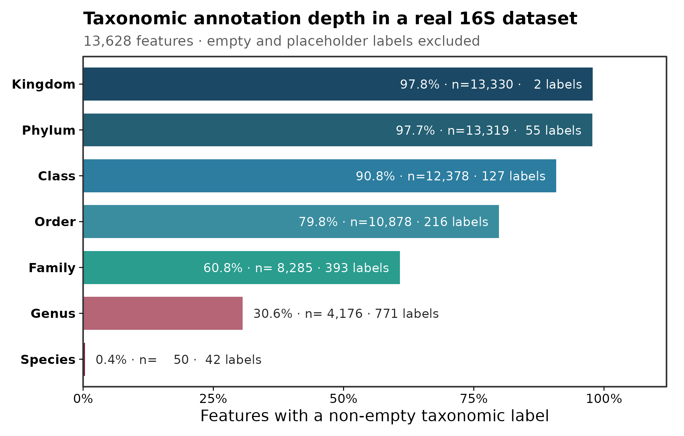
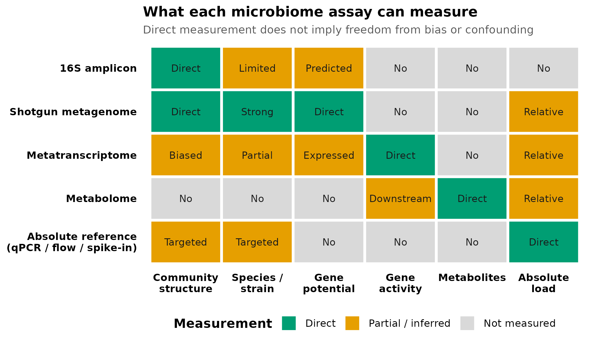

> **分析目标：**用真实 taxonomy 表量化 16S 的分类解析深度，并根据科学问题选择 16S、shotgun、宏转录组、代谢组或绝对定量。  
> **输入文件：**`otutab.tsv`、`taxonomy.tsv`、`metadata.tsv`。  
> **预计资源：**13,628 个 OTU、90 个样本；普通笔记本约 1 分钟，内存低于 500 MB。

## 先确定分辨率：16S 能测到什么？ {#sec-target}

在论文中，测序方法决定了后续结论能走多远。16S rRNA 扩增子测序最适合回答：

- 样本中细菌/古菌群落的相对组成如何变化；
- α 多样性和 β 多样性是否随分组、时间或环境梯度改变；
- 哪些 ASV/OTU 或较高分类层级与表型相关；
- 群落差异是否与预先指定的环境或临床变量相关。

它通常不能独立回答：

- 某个微生物的绝对细胞数是否增加；
- 某个菌是否存活、正在转录或正在产生某种代谢物；
- 某个 16S 序列是否属于特定致病菌株；
- 样本中实际携带哪些耐药、毒力或代谢基因；
- 微生物变化是否造成了宿主结局。

本篇从真实湿地 taxonomy 表生成两张目标图：

::: {layout-ncol=2}
{#fig-taxonomy-resolution}

{#fig-assay-scope}
:::

图 @fig-taxonomy-resolution 检查当前数据能被注释到多深；图 @fig-assay-scope 用来判断研究问题是否需要增加其他测量技术。

::: {.callout-important title="先写问题，再选技术"}
如果主要终点是“菌株传播”“耐药基因”“实际代谢活动”或“绝对微生物负荷”，仅做 16S 会让研究从采样开始就缺失关键测量。后期增加更复杂的统计模型，无法补回实验阶段没有测到的信息。
:::

## 16S 实际测到了什么 {#sec-theory}

### 1. 从生物样本到 reads，中间有多层选择

16S 结果不是样本中微生物的无偏普查。观测链条依次包含：

1. 样本采集与保存；
2. 细胞裂解与 DNA 提取；
3. 引物与目标可变区；
4. PCR 扩增；
5. 建库与测序；
6. 质量过滤、去嵌合体与 ASV/OTU 推断；
7. 参考数据库与分类器。

任一环节都可能使不同类群的检出概率不同。16S rRNA 基因在不同基因组中的拷贝数也不同，同一基因组内的多个拷贝还可能存在序列差异。因此，ASV 数不等于物种数，reads 比例也不等于细胞比例。[Větrovský 与 Baldrian](https://doi.org/10.1371/journal.pone.0057923)讨论了 16S 基因拷贝和基因组内变异对群落分析的影响。

### 2. 短扩增区通常不能稳定解析菌株

常规 Illumina 16S 只覆盖一个或数个可变区。不同物种可能在目标区域拥有相同序列，同一物种的不同菌株也可能共享完全相同的 16S 序列。[Johnson 等](https://doi.org/10.1038/s41467-019-13036-1)表明，短读长可变区的物种/菌株分辨率低于全长 16S；全长 16S 能改善部分分类群的物种分辨率，但仍不能把“全长序列不同”普遍等同于“菌株不同”。

因此：

- 属水平标签通常比种水平更稳妥，但仍依赖参考库、目标区域和分类阈值；
- 一个 ASV 可以对应多个物种；
- 同一个物种也可能产生多个 ASV；
- “检出某属”不能自动推出“检出该属中的致病种或致病株”。

### 3. DNA 潜力、转录活动和代谢产物是不同层次

shotgun 宏基因组直接测量样本 DNA 片段，可以分析基因家族、通路潜力，并在覆盖度足够时进行物种或菌株分析，但仍主要反映“基因存在的潜力”。宏转录组测量 RNA，更接近表达活动；代谢组测量小分子，是宿主、微生物、饮食和环境共同作用后的结果。[Quince 等](https://doi.org/10.1038/nbt.3935)综述了 shotgun 从采样到分析的能力与限制。

PICRUSt2 等工具可根据 16S 序列在参考系统发育中的位置预测基因家族与通路。[PICRUSt2 原始论文](https://doi.org/10.1038/s41587-020-0548-6)明确将其定位为 metagenome function prediction。预测结果不是实测基因，更不是表达量或代谢通量；参考基因组稀疏的环境样本尤其需要谨慎。

### 4. 分类变化不等于功能变化，功能相似也不等于机制相同

不同分类群可能携带相似功能，同一分类群内部也可能存在显著功能差异。[Louca 等](https://doi.org/10.1038/s41559-018-0519-1)总结了微生物系统中的功能冗余。因此：

- 分类组成显著变化时，功能潜力未必同步变化；
- 预测通路显著变化时，不能证明该通路正在表达；
- 代谢物变化时，不能仅凭相关性把来源归给某个菌；
- 要建立机制，需要时间顺序、干预、培养或多组学证据。

<details>
<summary><strong>深入：五类技术怎么选</strong></summary>

| 技术 | 主要测量 | 优势 | 关键限制 |
|---|---|---|---|
| 16S/ITS/18S 扩增子 | 标记基因片段 | 成本低、适合大队列、群落比较成熟 | PCR/引物偏倚、相对组成、功能和菌株有限 |
| Shotgun 宏基因组 | 群落总 DNA | 物种/菌株和基因潜力更强，可覆盖病毒与真菌 | 成本与计算量高，宿主 DNA、低丰度覆盖不足 |
| 宏转录组 | 群落 RNA | 更接近正在表达的功能 | RNA 易降解、rRNA 占比高、仍受组成和注释影响 |
| 代谢组 | 小分子 | 接近实际化学表型 | 来源不唯一、注释率有限、宿主与饮食混杂 |
| qPCR/ddPCR/流式/spike-in | 靶标或总负荷 | 提供绝对数量参照 | 通常只覆盖预先选择的靶标或总量 |

多组学不是“同一样本多测几张表”就自动得到机制。真正的整合需要匹配的样本/时间、明确的主要假设、独立验证和与每种测量误差相符的统计模型。iHMP 展示了纵向、多组学和宿主信息联合设计的范式，而不是简单把多个矩阵拼接。[iHMP 项目论文](https://doi.org/10.1038/s41586-019-1238-8)

</details>

## 准备工作 {#sec-setup}

<details>
<summary><strong>展开：安装依赖、下载真实数据和定义作图函数</strong></summary>

首次运行安装以下 CRAN 包：

```{r}
#| eval: false
install.packages(c("ggplot2", "scales", "digest"))
```

数据固定使用 `microeco 2.0.0` 源码包中的真实湿地 16S 表：

```{r}
#| eval: false
archive <- "data/raw/microeco_2.0.0.tar.gz"
source_url <- paste0(
  "https://cran.r-project.org/src/contrib/Archive/",
  "microeco/microeco_2.0.0.tar.gz"
)
expected_sha256 <- paste0(
  "454a3b71ceeea86bdd54f475a12b5bac",
  "9c3b124f663b8dc6e560827fca89ebfd"
)

dir.create("data/raw", recursive = TRUE, showWarnings = FALSE)
dir.create("data/small", recursive = TRUE, showWarnings = FALSE)
if (!file.exists(archive)) {
  download.file(source_url, archive, mode = "wb")
}
observed_sha256 <- digest::digest(
  file = archive,
  algo = "sha256",
  serialize = FALSE
)
stopifnot(identical(observed_sha256, expected_sha256))

required <- c(
  "microeco/data/otu_table_16S.RData",
  "microeco/data/taxonomy_table_16S.RData",
  "microeco/data/sample_info_16S.RData"
)
extract_dir <- tempfile("microeco-data-")
dir.create(extract_dir)
utils::untar(archive, files = required, exdir = extract_dir)

data_env <- new.env(parent = emptyenv())
for (relative_path in required) {
  load(file.path(extract_dir, relative_path), envir = data_env)
}

write_tsv <- function(x, id_name, path) {
  out <- data.frame(
    setNames(list(rownames(x)), id_name),
    x,
    check.names = FALSE
  )
  utils::write.table(
    out,
    path,
    sep = "\t",
    quote = FALSE,
    row.names = FALSE,
    na = ""
  )
}

write_tsv(data_env$otu_table_16S, "FeatureID", "data/small/otutab.tsv")
write_tsv(
  data_env$taxonomy_table_16S,
  "FeatureID",
  "data/small/taxonomy.tsv"
)
write_tsv(
  data_env$sample_info_16S,
  "SampleID",
  "data/small/metadata.tsv"
)
unlink(extract_dir, recursive = TRUE)
```

出版级函数直接定义在文章内：

```{r}
library(ggplot2)

set.seed(20260718)

pal_pub <- c(
  "#0072B2", "#D55E00", "#009E73", "#CC79A7",
  "#E69F00", "#56B4E9", "#F0E442", "#999999"
)

scale_color_pub <- function(...) {
  ggplot2::scale_color_manual(values = pal_pub, ...)
}

scale_fill_pub <- function(...) {
  ggplot2::scale_fill_manual(values = pal_pub, ...)
}

theme_pub <- function(base_size = 12) {
  ggplot2::theme_bw(base_size = base_size, base_family = "sans") +
    ggplot2::theme(
      panel.grid = ggplot2::element_blank(),
      axis.text = ggplot2::element_text(color = "black"),
      axis.ticks = ggplot2::element_line(color = "black", linewidth = 0.3),
      legend.key = ggplot2::element_blank(),
      legend.background = ggplot2::element_rect(
        fill = scales::alpha("white", 0.7),
        color = NA
      )
    )
}

save_pub <- function(
  plot,
  file_base,
  width = 120,
  height = 95,
  units = "mm",
  dpi = 300
) {
  dir.create(dirname(file_base), recursive = TRUE, showWarnings = FALSE)
  ggplot2::ggsave(
    paste0(file_base, ".pdf"),
    plot,
    width = width,
    height = height,
    units = units,
    device = grDevices::cairo_pdf
  )
  ggplot2::ggsave(
    paste0(file_base, ".png"),
    plot,
    width = width,
    height = height,
    units = units,
    dpi = dpi,
    bg = "white"
  )
  ggplot2::ggsave(
    paste0(file_base, ".tiff"),
    plot,
    width = width,
    height = height,
    units = units,
    dpi = dpi,
    compression = "lzw",
    bg = "white"
  )
  invisible(plot)
}
```


</details>

## 可复制代码 {#sec-code}

### 1. 从三件套读取并核对 ID

```{r}
otutab <- read.delim(
  "data/small/otutab.tsv",
  row.names = 1,
  check.names = FALSE
)
taxonomy <- read.delim(
  "data/small/taxonomy.tsv",
  row.names = 1,
  check.names = FALSE
)
metadata <- read.delim(
  "data/small/metadata.tsv",
  row.names = 1,
  check.names = FALSE
)

otutab <- as.matrix(otutab)
storage.mode(otutab) <- "numeric"

stopifnot(
  identical(rownames(otutab), rownames(taxonomy)),
  identical(colnames(otutab), rownames(metadata)),
  all(otutab >= 0),
  all(colSums(otutab) > 0)
)

dim(otutab)
otutab[1:5, 1:5]
taxonomy[1:5, , drop = FALSE]
head(metadata)
```

### 2. 统一 taxonomy 空值规则

示例表使用 `k__`、`p__`、`g__` 等前缀，未注释条目可能是空字符串或 `Unassigned`。先去掉层级前缀，再统一判定空值。

```{r}
rank_order <- c(
  "Kingdom", "Phylum", "Class", "Order",
  "Family", "Genus", "Species"
)
stopifnot(all(rank_order %in% colnames(taxonomy)))

clean_taxon <- function(x) {
  x <- trimws(as.character(x))
  x <- sub("^[A-Za-z]__", "", x)
  x
}

is_assigned <- function(x) {
  !is.na(x) &
    nzchar(x) &
    !grepl(
      "^(unassigned|unclassified|uncultured|unknown|norank|NA)$",
      x,
      ignore.case = TRUE
    )
}

taxonomy_clean <- taxonomy
taxonomy_clean[rank_order] <- lapply(
  taxonomy_clean[rank_order],
  clean_taxon
)
```

### 3. 计算每个分类层级的注释覆盖

```{r}
rank_summary <- do.call(
  rbind,
  lapply(rank_order, function(rank_name) {
    values <- taxonomy_clean[[rank_name]]
    assigned <- is_assigned(values)
    data.frame(
      Rank = rank_name,
      AssignedFeatures = sum(assigned),
      TotalFeatures = length(values),
      AssignedPercent = 100 * mean(assigned),
      DistinctLabels = length(unique(values[assigned])),
      stringsAsFactors = FALSE
    )
  })
)

rank_summary$Rank <- factor(
  rank_summary$Rank,
  levels = rev(rank_order)
)

rank_summary
stopifnot(
  all(rank_summary$AssignedFeatures <= rank_summary$TotalFeatures),
  all(diff(rank_summary$AssignedPercent) <= 1e-10)
)
```

本数据共有 `r format(nrow(taxonomy), big.mark = ",")` 个特征。属水平有明确非空标签的特征为 `r format(rank_summary$AssignedFeatures[rank_summary$Rank == "Genus"], big.mark = ",")` 个（`r sprintf("%.1f", rank_summary$AssignedPercent[rank_summary$Rank == "Genus"])`%），种水平为 `r format(rank_summary$AssignedFeatures[rank_summary$Rank == "Species"], big.mark = ",")` 个（`r sprintf("%.1f", rank_summary$AssignedPercent[rank_summary$Rank == "Species"])`%）。

这些数字表示“分类器返回了非空标签”，不等于标签一定正确。分类准确度还取决于扩增区、序列质量、参考库覆盖、训练方式和置信阈值。

### 4. 建立测量范围矩阵

以下矩阵是实验设计决策工具。`Direct` 表示该技术直接测量该层信息，`Partial / inferred` 表示覆盖有限或需要模型推断，`Not measured` 表示该技术本身没有测量该信息。

```{r}
questions <- c(
  "Community\nstructure",
  "Species /\nstrain",
  "Gene\npotential",
  "Gene\nactivity",
  "Metabolites",
  "Absolute\nload"
)

scope_row <- function(assay, status, label) {
  stopifnot(
    length(status) == length(questions),
    length(label) == length(questions)
  )
  data.frame(
    Assay = assay,
    Question = questions,
    Status = status,
    Label = label,
    stringsAsFactors = FALSE
  )
}

scope_matrix <- do.call(
  rbind,
  list(
    scope_row(
      "16S amplicon",
      c(
        "Direct", "Partial / inferred", "Partial / inferred",
        "Not measured", "Not measured", "Not measured"
      ),
      c("Direct", "Limited", "Predicted", "No", "No", "No")
    ),
    scope_row(
      "Shotgun metagenome",
      c(
        "Direct", "Direct", "Direct",
        "Not measured", "Not measured", "Partial / inferred"
      ),
      c("Direct", "Strong", "Direct", "No", "No", "Relative")
    ),
    scope_row(
      "Metatranscriptome",
      c(
        "Partial / inferred", "Partial / inferred", "Partial / inferred",
        "Direct", "Not measured", "Partial / inferred"
      ),
      c("Biased", "Partial", "Expressed", "Direct", "No", "Relative")
    ),
    scope_row(
      "Metabolome",
      c(
        "Not measured", "Not measured", "Not measured",
        "Partial / inferred", "Direct", "Partial / inferred"
      ),
      c("No", "No", "No", "Downstream", "Direct", "Relative")
    ),
    scope_row(
      "Absolute reference\n(qPCR / flow / spike-in)",
      c(
        "Partial / inferred", "Partial / inferred", "Not measured",
        "Not measured", "Not measured", "Direct"
      ),
      c("Targeted", "Targeted", "No", "No", "No", "Direct")
    )
  )
)

scope_matrix$Question <- factor(
  scope_matrix$Question,
  levels = questions
)
scope_matrix$Assay <- factor(
  scope_matrix$Assay,
  levels = rev(unique(scope_matrix$Assay))
)
scope_matrix$Status <- factor(
  scope_matrix$Status,
  levels = c("Direct", "Partial / inferred", "Not measured")
)

scope_matrix
```

## 出版级美化 {#sec-polish}

### 1. 真实 taxonomy 解析深度

```{r}
rank_palette <- c(
  Kingdom = "#1B4965",
  Phylum = "#245F73",
  Class = "#2C7DA0",
  Order = "#3A8D9F",
  Family = "#2A9D8F",
  Genus = "#B56576",
  Species = "#7A1F3D"
)

rank_summary$Label <- sprintf(
  "%.1f%% · n=%s · %s labels",
  rank_summary$AssignedPercent,
  format(rank_summary$AssignedFeatures, big.mark = ","),
  format(rank_summary$DistinctLabels, big.mark = ",")
)

p_taxonomy_resolution <- ggplot(
  rank_summary,
  aes(Rank, AssignedPercent, fill = Rank)
) +
  geom_col(width = 0.72) +
  geom_text(
    data = subset(rank_summary, AssignedPercent >= 50),
    aes(y = AssignedPercent - 2, label = Label),
    hjust = 1,
    size = 3.0,
    color = "white"
  ) +
  geom_text(
    data = subset(rank_summary, AssignedPercent < 50),
    aes(y = AssignedPercent + 2, label = Label),
    hjust = 0,
    size = 3.0,
    color = "grey15"
  ) +
  scale_fill_manual(values = rank_palette, guide = "none") +
  scale_y_continuous(
    limits = c(0, 112),
    breaks = c(0, 25, 50, 75, 100),
    labels = function(x) paste0(x, "%"),
    expand = expansion(mult = c(0, 0))
  ) +
  coord_flip(clip = "off") +
  labs(
    title = "Taxonomic annotation depth in a real 16S dataset",
    subtitle = paste0(
      format(nrow(taxonomy), big.mark = ","),
      " features · empty and placeholder labels excluded"
    ),
    x = NULL,
    y = "Features with a non-empty taxonomic label"
  ) +
  theme_pub(base_size = 11) +
  theme(
    plot.title = element_text(face = "bold", size = 12),
    plot.subtitle = element_text(color = "grey35", size = 9.5),
    axis.text.y = element_text(face = "bold"),
    plot.margin = margin(8, 12, 8, 8)
  )

p_taxonomy_resolution
save_pub(
  p_taxonomy_resolution,
  "figures/02-taxonomy-resolution",
  width = 165,
  height = 105
)
```

### 2. 技术选择范围图

```{r}
scope_colors <- c(
  "Direct" = "#009E73",
  "Partial / inferred" = "#E69F00",
  "Not measured" = "#D9D9D9"
)

p_assay_scope <- ggplot(
  scope_matrix,
  aes(Question, Assay, fill = Status)
) +
  geom_tile(color = "white", linewidth = 1.1) +
  geom_text(
    aes(label = Label),
    size = 3.0,
    color = "grey10",
    lineheight = 0.9
  ) +
  scale_fill_manual(
    values = scope_colors,
    drop = FALSE,
    name = "Measurement"
  ) +
  labs(
    title = "What each microbiome assay can measure",
    subtitle = "Direct measurement does not imply freedom from bias or confounding",
    x = NULL,
    y = NULL
  ) +
  theme_minimal(base_size = 11, base_family = "sans") +
  theme(
    panel.grid = element_blank(),
    plot.title = element_text(face = "bold", size = 12),
    plot.subtitle = element_text(color = "grey35", size = 9.5),
    axis.text.x = element_text(
      color = "black",
      face = "bold",
      lineheight = 0.9
    ),
    axis.text.y = element_text(
      color = "black",
      face = "bold",
      lineheight = 0.9
    ),
    legend.position = "bottom",
    legend.title = element_text(face = "bold")
  ) +
  guides(fill = guide_legend(nrow = 1, byrow = TRUE))

p_assay_scope
save_pub(
  p_assay_scope,
  "figures/02-assay-scope-map",
  width = 180,
  height = 105
)
```

两张图均导出为 PDF、PNG 和 300 dpi LZW-TIFF。图内标签全部使用英文；正文保留中文解释。

## 常见坑 {#sec-pitfalls}

::: {.callout-caution title="审稿人最容易指出的八种越界解释"}
1. **把 ASV 数写成物种数。** 一个基因组可能贡献多个 16S 拷贝或 ASV，多个物种也可能共享目标序列。
2. **taxonomy 有种名就按种解释。** 非空标签不等于有足够分辨率；必须结合扩增区、分类置信度和参考序列唯一性。
3. **把相对丰度写成绝对增殖。** 没有外部负荷参照时，只能解释组成变化。
4. **用 DNA 判断活菌或活性。** DNA 可来自休眠、死亡或胞外残留；RNA、培养和代谢测量回答不同问题。
5. **把 PICRUSt2 通路写成实测功能。** 应始终使用 predicted/inferred functional potential，并报告参考距离或预测质量。
6. **认为 shotgun 自动解决所有问题。** shotgun 仍有提取偏倚、宿主污染、深度不足、数据库缺口和组成性。
7. **把代谢物来源唯一归因于某个菌。** 同一代谢物可由宿主、饮食或多个微生物产生，也可能被其他成员消耗。
8. **用横断面多组学相关宣称机制。** 同时测量不提供时间顺序；机制需要纵向、扰动和实验验证。
:::

::: {.callout-warning title="本例 0.4% 的 species 标签不是普遍定律"}
当前比例由这套湿地数据、目标扩增区、`microeco 2.0.0` 分发的 taxonomy 和当时采用的参考数据库共同决定。其他数据可能更高或更低。真正可迁移的做法是对自己的 taxonomy 表运行同样的覆盖审计，并把结果写进报告。
:::

## 这段 Methods 怎么写 {#sec-methods}

适用于论文中说明测量边界的英文模板：

> Bacterial and archaeal community structure was profiled by 16S rRNA gene amplicon sequencing. Amplicon count, taxonomic annotation and sample-metadata tables were matched by feature and sample identifiers before analysis. Taxonomic labels were considered assigned only when they were non-empty and did not contain placeholder terms such as “unassigned” or “unclassified”. Among `r format(nrow(taxonomy), big.mark = ",")` features, `r sprintf("%.1f", rank_summary$AssignedPercent[rank_summary$Rank == "Genus"])`% and `r sprintf("%.1f", rank_summary$AssignedPercent[rank_summary$Rank == "Species"])`% received non-placeholder genus- and species-level labels, respectively. Analyses were therefore interpreted primarily at the ASV/OTU and higher taxonomic levels. Amplicon read counts were treated as compositional measurements and were not interpreted as absolute microbial loads. Predicted functional profiles, where used, were described as inferred genomic potential rather than directly measured genes, transcripts or metabolic activity.

真实论文还必须写明扩增区、引物序列、平台、读长、DADA2/OTU 参数、数据库名称与版本、分类器和置信阈值。

## 换成你自己的数据怎么做 {#sec-own-data}

替换三件套路径后，直接运行本篇的 taxonomy 清理与 `rank_summary` 代码：

```{r}
#| eval: false
otutab <- read.delim(
  "your_project/otutab.tsv",
  row.names = 1,
  check.names = FALSE
)
taxonomy <- read.delim(
  "your_project/taxonomy.tsv",
  row.names = 1,
  check.names = FALSE
)
metadata <- read.delim(
  "your_project/metadata.tsv",
  row.names = 1,
  check.names = FALSE
)

stopifnot(
  identical(rownames(otutab), rownames(taxonomy)),
  identical(colnames(otutab), rownames(metadata))
)
```

根据主要问题选择技术：

- **群落组成、大队列分层、基础生态比较：**16S 通常足够；
- **物种/菌株、耐药基因、毒力基因、代谢基因：**优先 shotgun，必要时培养分离和 isolate WGS；
- **正在表达什么：**宏转录组/宏蛋白组；
- **实际化学产物：**代谢组，并结合标准品和来源验证；
- **绝对数量：**qPCR/ddPCR、流式、spike-in 或定量宏基因组；
- **传播证据：**菌株级 SNV/单倍型和时间、接触信息，属水平相似远远不够；
- **机制或因果：**纵向、扰动、培养、动物或临床干预与多层验证。

若预算有限，可以先用 16S 覆盖大队列，再对预先定义的代表性样本做 shotgun 或多组学；子集选择规则必须在看主要结果前确定，避免只挑“最显著”的样本。

## 参考 {#sec-references}

- Knight R, Vrbanac A, Taylor BC, et al. Best practices for analysing microbiomes. *Nature Reviews Microbiology*. 2018;16:410–422. [doi:10.1038/s41579-018-0029-9](https://doi.org/10.1038/s41579-018-0029-9)
- Johnson JS, Spakowicz DJ, Hong B-Y, et al. Evaluation of 16S rRNA gene sequencing for species and strain-level microbiome analysis. *Nature Communications*. 2019;10:5029. [doi:10.1038/s41467-019-13036-1](https://doi.org/10.1038/s41467-019-13036-1)
- Větrovský T, Baldrian P. The variability of the 16S rRNA gene in bacterial genomes and its consequences for bacterial community analyses. *PLOS ONE*. 2013;8:e57923. [doi:10.1371/journal.pone.0057923](https://doi.org/10.1371/journal.pone.0057923)
- Quince C, Walker AW, Simpson JT, Loman NJ, Segata N. Shotgun metagenomics, from sampling to analysis. *Nature Biotechnology*. 2017;35:833–844. [doi:10.1038/nbt.3935](https://doi.org/10.1038/nbt.3935)
- Douglas GM, Maffei VJ, Zaneveld JR, et al. PICRUSt2 for prediction of metagenome functions. *Nature Biotechnology*. 2020;38:685–688. [doi:10.1038/s41587-020-0548-6](https://doi.org/10.1038/s41587-020-0548-6)
- Louca S, Polz MF, Mazel F, et al. Function and functional redundancy in microbial systems. *Nature Ecology & Evolution*. 2018;2:936–943. [doi:10.1038/s41559-018-0519-1](https://doi.org/10.1038/s41559-018-0519-1)
- The Integrative HMP Research Network Consortium. The Integrative Human Microbiome Project. *Nature*. 2019;569:641–648. [doi:10.1038/s41586-019-1238-8](https://doi.org/10.1038/s41586-019-1238-8)
- An J, Liu C, Wang Q, et al. Soil bacterial community structure in Chinese wetlands. *Geoderma*. 2019;337:290–299. [doi:10.1016/j.geoderma.2018.09.035](https://doi.org/10.1016/j.geoderma.2018.09.035)
- Liu C, Cui Y, Li X, Yao M. microeco: an R package for data mining in microbial community ecology. *FEMS Microbiology Ecology*. 2021;97(2):fiaa255. [doi:10.1093/femsec/fiaa255](https://doi.org/10.1093/femsec/fiaa255)
