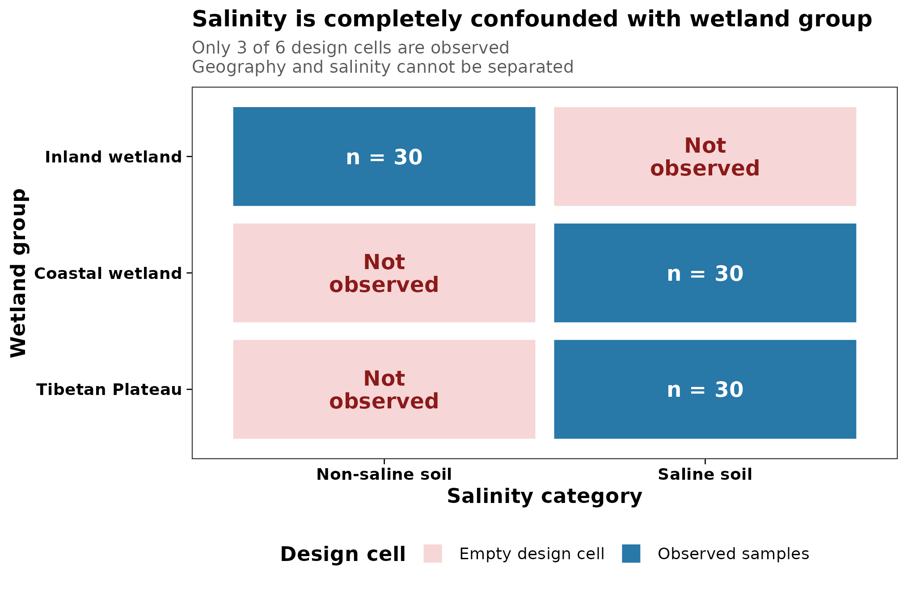
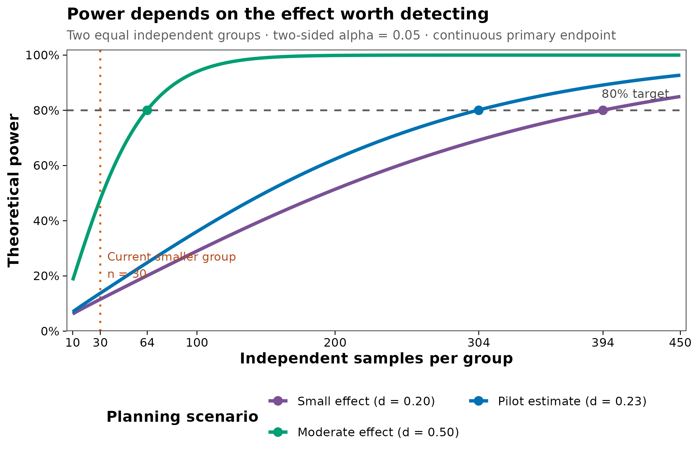

> **分析目标：**在测序前定义独立实验单位、主要终点、分组/配对结构和统计效力；用真实 metadata 识别完全混杂，并用 pilot Shannon 差异完成可复算的样本量敏感性分析。  
> **输入文件：**`otutab.tsv`、`taxonomy.tsv`、`metadata.tsv`。自己的研究还应在 metadata 中提供 `SubjectID`、`Block/Site/Cage`、`Batch` 和时间点等设计变量。  
> **预计资源：**13,628 个 OTU、90 个样本；普通笔记本约 1–3 分钟，内存低于 500 MB。

## 分析能否回答问题，首先由研究设计决定 {#sec-target}

实验设计不会只出现在 Methods。严谨的微生物组论文通常需要一张研究流程图或设计概览，并在正文或补充材料中说明：

- 每组有多少个**独立实验单位**；
- 样本如何分层、随机化、配对或重复测量；
- 主要终点和主要比较是什么；
- 哪些批次、中心、笼位、家庭或个体因素需要控制；
- 样本量依据的是何种效应量、方差、显著性水平和目标效力。

本篇从真实中国湿地 16S 数据重绘两张设计审计图：

::: {layout-ncol=2}
{#fig-design-confounding}

{#fig-power-sensitivity}
:::

图 @fig-design-confounding 先回答“设计是否允许区分两个因素”；图 @fig-power-sensitivity 再回答“在给定假设下，大致需要多少独立样本”。顺序不能颠倒：样本再多，也不能从完全混杂的设计中分离两个效应。

::: {.callout-important title="真正的 N 是独立实验单位数"}
同一只动物取 10 份粪便、同一位受试者测 10 个时间点，或同一笼内取 10 只共居动物，都不自动等于 $N=10$ 个独立重复。技术重复可以降低测量误差，纵向样本可以提高个体内变化的估计精度，但它们不能凭空增加独立受试者、笼位或样地的数量。
:::

## 理论：从科学问题倒推设计 {#sec-theory}

### 1. 先写清 estimand，再计算样本量

**Estimand（目标估计量）**是研究真正要估计的量。例如：

- 两个处理组在第 8 周 Shannon 指数的平均差；
- 干预后整体群落 Bray–Curtis 距离中由处理解释的变异比例；
- 某个预先指定菌属在病例与对照之间的对数丰度比；
- 同一个体从基线到治疗后的变化量之组间差异。

如果只写“比较两组菌群是否不同”，就无法唯一确定主要终点、统计检验、效应量或样本量。α 多样性、PERMANOVA、差异丰度和分类模型的效力函数不同，不能用一个通用的“每组至少 20 例”覆盖所有问题。

### 2. 实验单位、观测单位和技术重复不是一回事

- **实验单位（experimental unit）**：能够独立接受处理、暴露或被随机分组的最小单位。
- **观测单位（observational unit）**：实际被测量的样本。
- **技术重复（technical replicate）**：对同一生物材料重复提取、PCR 或测序。

若处理施加在笼位，笼位通常是实验单位；若处理施加在动物，动物才可能是实验单位。共居动物共享环境和微生物来源，不能默认彼此独立。[Reish 等](https://doi.org/10.1128/aem.01033-24)审阅宿主—微生物组研究后指出，伪重复和实验单位描述不足仍很常见。

### 3. 配对和重复测量要写进模型，而不是只连一条线

配对设计通过比较同一个体内的变化，消除稳定的个体间差异。它通常比同样人数的完全独立设计更有效，但前提是：

- 配对关系在 `SubjectID` 中明确记录；
- 每个时间点的缺失机制被报告；
- 模型包含个体随机截距或等价的配对结构；
- 置换检验被限制在设计允许的交换范围内。

一位受试者有两个时间点时，独立样本量仍是“受试者数/完整配对数”，不是样本管数。把 30 人 × 2 时间点写成 $N=60$ 个独立样本会造成伪重复。

### 4. 平衡、随机化和阻断决定能否解释结果

理想设计让主要比较在测序批次、提取批次、中心、笼位、板位和采样时间上尽量平衡。随机化用于降低已知和未知混杂；阻断（blocking）用于在不可避免的批次或空间结构内进行公平比较。

最危险的情况是：

> 所有病例在批次 A，所有对照在批次 B。

此时“疾病效应”和“批次效应”不可辨识。统计校正不能从没有交叉信息的设计中估计两个独立效应。相同问题也会出现在地点与暴露、笼位与处理、中心与疾病完全重合时。

### 5. 统计效力不是研究结束后的解释工具

统计效力（power）是在真实效应达到预设大小时，研究拒绝零假设的概率。设计阶段至少要指定：

1. 主要终点和统计模型；
2. 有科学意义的最小效应；
3. 方差或距离分布；
4. 双侧显著性水平 $\alpha$；
5. 目标效力 $1-\beta$；
6. 组间比例、失访率和不可用样本率；
7. 多重检验策略。

研究结束后用观测到的 P 值计算“observed power”通常只是在重新表达 P 值，不能挽救阴性结果。更有信息的做法是报告效应量、置信区间，并说明研究能排除或无法排除多大的效应。

<details>
<summary><strong>深入：为什么 PERMANOVA 样本量不能直接照搬 t 检验</strong></summary>

两独立组连续终点可用标准化均值差 $d$ 表示效应，并在给定分布假设下计算样本量。PERMANOVA 的效力则同时受到以下因素影响：

- 组内群落距离分布和离散度；
- 组间样本量及其不平衡；
- 所选距离度量；
- 群落组成与零值结构；
- 协变量、分层和允许的置换方式；
- 目标总体效应而非样本内偏高的 $R^2$。

[Kelly 等](https://doi.org/10.1093/bioinformatics/btv183)提出基于 pilot 距离信息的 PERMANOVA 样本量估计，并强调样本 $R^2$ 对总体效应存在偏倚。[La Rosa 等](https://doi.org/10.1371/journal.pone.0052078)和[Ferdous 等](https://doi.org/10.1038/s41385-022-00548-1)也说明，微生物组效力计算必须与数据类型和检验对应。

因此，本篇的曲线只针对一个明确的连续主要终点——固定测序深度下的 Shannon 指数——用于演示敏感性分析。若主要终点是 PERMANOVA、差异丰度或预测性能，应基于相应模型、pilot 数据和设计结构模拟，而不是把图中的 $n$ 直接套用。

</details>

::: {.callout-note title="真实数据中的设计警报"}
本例 90 个样本分为 inland wetland、coastal wetland 和 Tibetan Plateau 三组。30 个 non-saline 样本全部来自 inland wetland；60 个 saline 样本全部来自另外两组。因此 `Salinity` 与 `Group` 完全混杂，`Type` 也嵌套在 `Group` 内。盐碱状态的比较不能被解释为脱离地理/湿地类型的独立盐碱效应。
:::

## 准备工作 {#sec-setup}

<details>
<summary><strong>展开：安装依赖、下载真实数据和定义作图函数</strong></summary>

首次运行安装以下 CRAN 包：

```{r}
#| eval: false
install.packages(c(
  "vegan", "ggplot2", "scales", "digest", "lme4"
))
```

数据固定使用 `microeco 2.0.0` 源码包中的真实湿地 16S 表。以下代码下载固定版本、核对 SHA-256，并导出扩增子通用三件套：

```{r}
#| eval: false
archive <- "data/raw/microeco_2.0.0.tar.gz"
source_url <- paste0(
  "https://cran.r-project.org/src/contrib/Archive/",
  "microeco/microeco_2.0.0.tar.gz"
)
expected_sha256 <- paste0(
  "454a3b71ceeea86bdd54f475a12b5bac",
  "9c3b124f663b8dc6e560827fca89ebfd"
)

dir.create("data/raw", recursive = TRUE, showWarnings = FALSE)
dir.create("data/small", recursive = TRUE, showWarnings = FALSE)
if (!file.exists(archive)) {
  download.file(source_url, archive, mode = "wb")
}
observed_sha256 <- digest::digest(
  file = archive,
  algo = "sha256",
  serialize = FALSE
)
stopifnot(identical(observed_sha256, expected_sha256))

required <- c(
  "microeco/data/otu_table_16S.RData",
  "microeco/data/taxonomy_table_16S.RData",
  "microeco/data/sample_info_16S.RData"
)
extract_dir <- tempfile("microeco-data-")
dir.create(extract_dir)
utils::untar(archive, files = required, exdir = extract_dir)

data_env <- new.env(parent = emptyenv())
for (relative_path in required) {
  load(file.path(extract_dir, relative_path), envir = data_env)
}

write_tsv <- function(x, id_name, path) {
  out <- data.frame(
    setNames(list(rownames(x)), id_name),
    x,
    check.names = FALSE
  )
  utils::write.table(
    out,
    path,
    sep = "\t",
    quote = FALSE,
    row.names = FALSE,
    na = ""
  )
}

write_tsv(data_env$otu_table_16S, "FeatureID", "data/small/otutab.tsv")
write_tsv(
  data_env$taxonomy_table_16S,
  "FeatureID",
  "data/small/taxonomy.tsv"
)
write_tsv(
  data_env$sample_info_16S,
  "SampleID",
  "data/small/metadata.tsv"
)
unlink(extract_dir, recursive = TRUE)
```

出版级函数直接定义在文章内：

```{r}
library(vegan)
library(ggplot2)

set.seed(20260718)

pal_pub <- c(
  "#0072B2", "#D55E00", "#009E73", "#CC79A7",
  "#E69F00", "#56B4E9", "#F0E442", "#999999"
)

scale_color_pub <- function(...) {
  ggplot2::scale_color_manual(values = pal_pub, ...)
}

scale_fill_pub <- function(...) {
  ggplot2::scale_fill_manual(values = pal_pub, ...)
}

theme_pub <- function(base_size = 12) {
  ggplot2::theme_bw(base_size = base_size, base_family = "sans") +
    ggplot2::theme(
      panel.grid = ggplot2::element_blank(),
      axis.text = ggplot2::element_text(color = "black"),
      axis.ticks = ggplot2::element_line(color = "black", linewidth = 0.3),
      legend.key = ggplot2::element_blank(),
      legend.background = ggplot2::element_rect(
        fill = scales::alpha("white", 0.7),
        color = NA
      )
    )
}

save_pub <- function(
  plot,
  file_base,
  width = 120,
  height = 95,
  units = "mm",
  dpi = 300
) {
  dir.create(dirname(file_base), recursive = TRUE, showWarnings = FALSE)
  ggplot2::ggsave(
    paste0(file_base, ".pdf"),
    plot,
    width = width,
    height = height,
    units = units,
    device = grDevices::cairo_pdf
  )
  ggplot2::ggsave(
    paste0(file_base, ".png"),
    plot,
    width = width,
    height = height,
    units = units,
    dpi = dpi,
    bg = "white"
  )
  ggplot2::ggsave(
    paste0(file_base, ".tiff"),
    plot,
    width = width,
    height = height,
    units = units,
    dpi = dpi,
    compression = "lzw",
    bg = "white"
  )
  invisible(plot)
}
```

整仓库运行时可使用内容相同的 `R/theme_pub.R`；独立运行以上代码块即可获得全部函数。

</details>

## 可复制代码 {#sec-code}

### 1. 从三件套读取并核对设计

```{r}
otutab <- read.delim(
  "data/small/otutab.tsv",
  row.names = 1,
  check.names = FALSE
)
taxonomy <- read.delim(
  "data/small/taxonomy.tsv",
  row.names = 1,
  check.names = FALSE
)
metadata <- read.delim(
  "data/small/metadata.tsv",
  row.names = 1,
  check.names = FALSE
)

otutab <- as.matrix(otutab)
storage.mode(otutab) <- "numeric"

stopifnot(
  identical(rownames(otutab), rownames(taxonomy)),
  identical(colnames(otutab), rownames(metadata)),
  all(otutab >= 0),
  all(otutab == floor(otutab)),
  all(colSums(otutab) > 0),
  all(c("Group", "Type", "Saline") %in% colnames(metadata))
)

dim(otutab)
otutab[1:5, 1:5]
taxonomy[1:5, , drop = FALSE]
head(metadata)
```

### 2. 画出交叉表，而不是只看每列频数

单独运行 `table(metadata$Group)` 和 `table(metadata$Saline)` 都会得到看似合理的样本量；只有交叉表能暴露两个变量没有交叉。

```{r}
group_labels <- c(
  IW = "Inland wetland",
  CW = "Coastal wetland",
  TW = "Tibetan Plateau"
)

metadata$GroupLabel <- unname(group_labels[metadata$Group])
metadata$Salinity <- factor(
  metadata$Saline,
  levels = c("Non-saline soil", "Saline soil")
)
stopifnot(!anyNA(metadata$GroupLabel), !anyNA(metadata$Salinity))

design_counts <- as.data.frame(
  with(metadata, table(GroupLabel, Salinity)),
  responseName = "Count"
)
design_counts$Observed <- factor(
  design_counts$Count > 0,
  levels = c(FALSE, TRUE),
  labels = c("Empty design cell", "Observed samples")
)
design_counts$CellLabel <- ifelse(
  design_counts$Count == 0,
  "Not\nobserved",
  paste0("n = ", design_counts$Count)
)

design_matrix <- xtabs(Count ~ GroupLabel + Salinity, design_counts)
type_matrix <- with(metadata, table(Group, Type))

design_matrix
type_matrix

perfect_group_salinity_confounding <- all(
  rowSums(design_matrix > 0) == 1
)
type_nested_within_group <- all(
  colSums(type_matrix > 0) == 1
)

stopifnot(
  perfect_group_salinity_confounding,
  type_nested_within_group
)
```

结果显示：

- `Inland wetland` 的 30 个样本全部是 `Non-saline soil`；
- `Coastal wetland` 和 `Tibetan Plateau` 各 30 个样本，全部是 `Saline soil`；
- 六个 `Type` 水平分别只出现在一个 `Group` 中。

因此，在这份数据里拟合 `outcome ~ Group + Salinity` 不能得到可识别的两个独立效应。软件可能删除共线项或返回秩亏模型，但这不是“完成了统计校正”。

### 3. 用固定深度计算 pilot Shannon 指数

为了让本例的随机抽样可复现，先把每个样本稀释到最小测序深度，再计算 Shannon 指数。这里的目的只是构造一个明确的连续主要终点进行样本量敏感性分析；稀释并不是所有 α 多样性推断的默认答案。

```{r}
library_sizes <- colSums(otutab)
rarefaction_depth <- min(library_sizes)

set.seed(20260718)
otutab_rarefied <- t(
  vegan::rrarefy(
    t(otutab),
    sample = rarefaction_depth
  )
)

stopifnot(
  all(colSums(otutab_rarefied) == rarefaction_depth),
  identical(colnames(otutab_rarefied), rownames(metadata))
)

shannon <- vegan::diversity(
  t(otutab_rarefied),
  index = "shannon"
)

alpha_df <- data.frame(
  SampleID = names(shannon),
  Shannon = as.numeric(shannon),
  Salinity = metadata[names(shannon), "Salinity"],
  Group = metadata[names(shannon), "GroupLabel"],
  stringsAsFactors = FALSE
)

alpha_summary <- do.call(
  rbind,
  lapply(split(alpha_df$Shannon, alpha_df$Salinity), function(x) {
    data.frame(
      N = length(x),
      Mean = mean(x),
      SD = stats::sd(x)
    )
  })
)

alpha_summary
```

稀释深度为每样本 `r format(rarefaction_depth, big.mark = ",")` reads。`Non-saline soil` 的 Shannon 均值为 `r sprintf("%.3f", alpha_summary["Non-saline soil", "Mean"])`（$n=`r alpha_summary["Non-saline soil", "N"]`$），`Saline soil` 为 `r sprintf("%.3f", alpha_summary["Saline soil", "Mean"])`（$n=`r alpha_summary["Saline soil", "N"]`$）。

### 4. 估计标准化差异及其不确定性

这里把效应方向定义为 `Non-saline soil − Saline soil`，用 pooled SD 标准化。bootstrap 在每组内部有放回抽样 2,000 次，并固定随机种子。

```{r}
cohen_d <- function(x, y) {
  nx <- length(x)
  ny <- length(y)
  pooled_sd <- sqrt(
    ((nx - 1) * stats::var(x) + (ny - 1) * stats::var(y)) /
      (nx + ny - 2)
  )
  (mean(x) - mean(y)) / pooled_sd
}

shannon_non_saline <- subset(
  alpha_df,
  Salinity == "Non-saline soil"
)$Shannon
shannon_saline <- subset(
  alpha_df,
  Salinity == "Saline soil"
)$Shannon

pilot_d <- cohen_d(
  shannon_non_saline,
  shannon_saline
)

set.seed(20260718)
bootstrap_d <- replicate(2000, {
  x_boot <- sample(
    shannon_non_saline,
    length(shannon_non_saline),
    replace = TRUE
  )
  y_boot <- sample(
    shannon_saline,
    length(shannon_saline),
    replace = TRUE
  )
  cohen_d(x_boot, y_boot)
})
bootstrap_d <- bootstrap_d[is.finite(bootstrap_d)]
pilot_ci <- unname(
  stats::quantile(
    bootstrap_d,
    probs = c(0.025, 0.975)
  )
)

pilot_test <- stats::t.test(
  shannon_non_saline,
  shannon_saline,
  var.equal = FALSE
)

data.frame(
  CohenD = pilot_d,
  BootstrapLower = pilot_ci[1],
  BootstrapUpper = pilot_ci[2],
  WelchP = pilot_test$p.value
)
```

本例得到 $d=`r sprintf("%.3f", pilot_d)`$，bootstrap 95% CI 为 `r sprintf("%.3f", pilot_ci[1])` 到 `r sprintf("%.3f", pilot_ci[2])`，Welch 检验 $P=`r sprintf("%.3f", pilot_test$p.value)`$。区间跨过 0，效应估计很不精确；更重要的是，盐碱状态与湿地组完全混杂，所以这个 $d$ 不能解释为独立的盐碱效应。

### 5. 做 prospective sensitivity analysis

假设未来研究：

- 以一个连续主要终点为主；
- 两个独立组样本量相等；
- 双侧 $\alpha=0.05$；
- 目标 power = 80%；
- 标准化效应分别为 0.20、当前 pilot 点估计和 0.50。

```{r}
pilot_effect <- abs(pilot_d)
effect_scenarios <- data.frame(
  Scenario = c(
    "Small effect",
    "Pilot estimate",
    "Moderate effect"
  ),
  Effect = c(0.20, pilot_effect, 0.50),
  stringsAsFactors = FALSE
)

n_grid <- seq(10, 450, by = 2)

power_curve <- do.call(
  rbind,
  lapply(seq_len(nrow(effect_scenarios)), function(i) {
    effect <- effect_scenarios$Effect[i]
    data.frame(
      NPerGroup = n_grid,
      Power = vapply(
        n_grid,
        function(n) {
          stats::power.t.test(
            n = n,
            delta = effect,
            sd = 1,
            sig.level = 0.05,
            type = "two.sample",
            alternative = "two.sided"
          )$power
        },
        numeric(1)
      ),
      Scenario = effect_scenarios$Scenario[i],
      Effect = effect
    )
  })
)

n80 <- effect_scenarios
n80$NPerGroup <- vapply(
  n80$Effect,
  function(effect) {
    ceiling(
      stats::power.t.test(
        delta = effect,
        sd = 1,
        sig.level = 0.05,
        power = 0.80,
        type = "two.sample",
        alternative = "two.sided"
      )$n
    )
  },
  numeric(1)
)
n80$Power <- 0.80

current_smaller_group <- min(table(alpha_df$Salinity))
current_pilot_power <- stats::power.t.test(
  n = current_smaller_group,
  delta = pilot_effect,
  sd = 1,
  sig.level = 0.05,
  type = "two.sample",
  alternative = "two.sided"
)$power

n80
```

若把 $d=`r sprintf("%.3f", pilot_effect)`$ 当作未来研究的规划值，在这些理想化假设下达到 80% power 约需每组 `r n80$NPerGroup[n80$Scenario == "Pilot estimate"]` 个独立样本；当前较小组的 $n=`r current_smaller_group`$ 对该效应只有约 `r sprintf("%.1f", 100 * current_pilot_power)`% 的理论效力。由于 pilot 效应不确定且存在混杂，正式方案应同时比较多个效应情景，并增加失访、提取失败和质控淘汰余量。

## 出版级美化 {#sec-polish}

### 1. 设计混杂热图

```{r}
design_counts$GroupLabel <- factor(
  design_counts$GroupLabel,
  levels = rev(c(
    "Inland wetland",
    "Coastal wetland",
    "Tibetan Plateau"
  ))
)

design_fill <- c(
  "Empty design cell" = "#F6D6D6",
  "Observed samples" = "#2878A8"
)

p_design_confounding <- ggplot(
  design_counts,
  aes(Salinity, GroupLabel, fill = Observed)
) +
  geom_tile(
    color = "white",
    linewidth = 1.5,
    width = 0.96,
    height = 0.90
  ) +
  geom_text(
    aes(
      label = CellLabel,
      color = Observed
    ),
    size = 4.0,
    fontface = "bold",
    lineheight = 0.9
  ) +
  scale_fill_manual(
    values = design_fill,
    name = "Design cell"
  ) +
  scale_color_manual(
    values = c(
      "Empty design cell" = "#8B1A1A",
      "Observed samples" = "white"
    ),
    guide = "none"
  ) +
  labs(
    title = "Salinity is completely confounded with wetland group",
    subtitle = paste0(
      "Only 3 of 6 design cells are observed\n",
      "Geography and salinity cannot be separated"
    ),
    x = "Salinity category",
    y = "Wetland group"
  ) +
  theme_pub(base_size = 11) +
  theme(
    plot.title = element_text(face = "bold", size = 12),
    plot.subtitle = element_text(
      color = "grey35",
      size = 9.2,
      lineheight = 0.95
    ),
    axis.title = element_text(face = "bold"),
    axis.text = element_text(face = "bold"),
    legend.position = "bottom",
    legend.title = element_text(face = "bold")
  ) +
  guides(fill = guide_legend(nrow = 1, byrow = TRUE))

p_design_confounding
save_pub(
  p_design_confounding,
  "figures/03-design-confounding",
  width = 172,
  height = 112
)
```

### 2. 样本量—效力敏感性曲线

```{r}
scenario_labels <- c(
  "Small effect" = "Small effect (d = 0.20)",
  "Pilot estimate" = sprintf(
    "Pilot estimate (d = %.2f)",
    pilot_effect
  ),
  "Moderate effect" = "Moderate effect (d = 0.50)"
)

power_curve$ScenarioLabel <- factor(
  unname(scenario_labels[power_curve$Scenario]),
  levels = unname(scenario_labels)
)
n80$ScenarioLabel <- factor(
  unname(scenario_labels[n80$Scenario]),
  levels = unname(scenario_labels)
)

power_colors <- stats::setNames(
  c("#7A5195", "#0072B2", "#009E73"),
  unname(scenario_labels)
)

p_power_sensitivity <- ggplot(
  power_curve,
  aes(NPerGroup, Power, color = ScenarioLabel)
) +
  geom_hline(
    yintercept = 0.80,
    linetype = "dashed",
    color = "grey35",
    linewidth = 0.6
  ) +
  geom_vline(
    xintercept = current_smaller_group,
    linetype = "dotted",
    color = "#D55E00",
    linewidth = 0.7
  ) +
  geom_line(linewidth = 1.15) +
  geom_point(
    data = n80,
    aes(NPerGroup, Power, color = ScenarioLabel),
    inherit.aes = FALSE,
    size = 2.6
  ) +
  annotate(
    "text",
    x = 442,
    y = 0.845,
    label = "80% target",
    hjust = 1,
    vjust = 0,
    size = 3.1,
    color = "grey25"
  ) +
  annotate(
    "text",
    x = current_smaller_group + 5,
    y = 0.24,
    label = paste0(
      "Current smaller group\nn = ",
      current_smaller_group
    ),
    hjust = 0,
    size = 3.0,
    color = "#B24716"
  ) +
  scale_color_manual(
    values = power_colors,
    name = "Planning scenario"
  ) +
  scale_x_continuous(
    breaks = sort(unique(c(
      10,
      current_smaller_group,
      100,
      200,
      n80$NPerGroup,
      450
    ))),
    limits = c(10, 450),
    expand = expansion(mult = c(0.01, 0.01))
  ) +
  scale_y_continuous(
    limits = c(0, 1),
    breaks = seq(0, 1, by = 0.2),
    labels = scales::percent_format(accuracy = 1),
    expand = expansion(mult = c(0, 0.02))
  ) +
  labs(
    title = "Power depends on the effect worth detecting",
    subtitle = paste0(
      "Two equal independent groups · two-sided alpha = 0.05 · ",
      "continuous primary endpoint"
    ),
    x = "Independent samples per group",
    y = "Theoretical power"
  ) +
  theme_pub(base_size = 11) +
  theme(
    plot.title = element_text(face = "bold", size = 12),
    plot.subtitle = element_text(color = "grey35", size = 9.2),
    axis.title = element_text(face = "bold"),
    legend.position = "bottom",
    legend.title = element_text(face = "bold")
  ) +
  guides(color = guide_legend(nrow = 2, byrow = TRUE))

p_power_sensitivity
save_pub(
  p_power_sensitivity,
  "figures/03-power-sensitivity",
  width = 178,
  height = 118
)
```

两张图均导出为 PDF、PNG 和 300 dpi LZW-TIFF。图内所有文字均为英文；正文负责解释研究设计的生物学含义。

## 常见坑 {#sec-pitfalls}

::: {.callout-caution title="审稿人最容易指出的十个设计问题"}
1. **把样本管数当独立样本数。** 同一个体、同一笼、同一地块或同一家庭内的观测往往相关。
2. **所有病例与对照分属不同批次。** 完全混杂时，任何批次校正方法都不能恢复缺失的交叉设计。
3. **先收集数据，再从多个终点挑显著者。** 应预先指定主要终点、主要比较和多重检验策略。
4. **用固定经验数代替 power analysis。** “每组 20 个”没有说明效应、方差、模型、失访率或目标效力。
5. **把 pilot 点估计当真实效应。** 小 pilot 的效应常被高估；应使用置信区间、保守情景或最小有意义效应。
6. **报告事后 observed power。** 阴性结果应看效应量与置信区间，而不是从同一个 P 值反推效力。
7. **配对采样却按独立样本检验。** 忽略 `SubjectID` 会低估标准误，也浪费配对带来的信息。
8. **只在测序阶段随机化。** 采样、保存、提取、PCR、建库和测序都可能引入批次，需要全链路平衡。
9. **多变量模型塞入过多协变量。** 小样本、稀疏分层和共线性会导致不可识别或极不稳定的估计。
10. **只按 α 多样性估样本量，却把差异菌作为主要结论。** 每类主要终点都应有对应的效力或模拟依据。
:::

::: {.callout-warning title="样本量曲线不是本数据的因果结论"}
图 @fig-power-sensitivity 使用当前数据的 Shannon 标准化差异作为一个不确定的规划情景。它不证明盐碱状态影响 Shannon，也不意味着所有 16S 研究都需要每组 304 例。你的效应、方差、组间比例、配对相关、协变量和主要统计模型改变后，样本量会随之改变。
:::

## 这段 Methods 怎么写 {#sec-methods}

下面模板把实验单位、主要终点、混杂检查和样本量假设写完整。方括号内容应在研究开始前按方案替换：

> **Study design and sample-size planning.** The independent experimental unit was the [participant/animal/cage/site], and the prespecified primary comparison was [contrast] for [primary endpoint] at [time point]. Samples were randomized across extraction, PCR, library-preparation, and sequencing batches within [blocking factors]. Repeated observations from the same experimental unit were linked by a unique subject identifier and were analyzed using [paired/mixed-effects/restricted-permutation model]. Before analysis, contingency tables were used to identify empty design cells and complete confounding among treatment, site, batch, and other design variables. Sample size was planned for a two-sided type-I error rate of 0.05 and 80% power to detect a standardized effect of [d], with [n] independent units per group after allowing [x%] attrition.

本例可这样描述，但必须保留其限制：

> **Worked design audit.** The worked dataset comprised 90 soil samples (30 inland-wetland, 30 coastal-wetland, and 30 Tibetan-Plateau samples). Salinity was completely confounded with wetland group: all 30 non-saline samples belonged to the inland-wetland group, whereas all 60 saline samples belonged to the other two groups. Consequently, salinity and wetland-group effects were not separately identifiable. For an illustrative sensitivity analysis, Shannon diversity was calculated after rarefaction to `r format(rarefaction_depth, big.mark = ",")` reads per sample. The standardized non-saline versus saline difference was $d=`r sprintf("%.3f", pilot_d)`$ (2,000-resample bootstrap 95% CI `r sprintf("%.3f", pilot_ci[1])` to `r sprintf("%.3f", pilot_ci[2])`). Under an idealized equal-size two-sample design with two-sided $\alpha=0.05$, detecting an effect of this magnitude with 80% power would require approximately `r n80$NPerGroup[n80$Scenario == "Pilot estimate"]` independent samples per group. This calculation was treated as a planning scenario rather than evidence for an independent salinity effect.

Results 中建议同时报告：

- 各组独立实验单位数和观测样本数；
- 缺失、质控淘汰和完整配对数量；
- 主要效应量及 95% CI；
- 实际使用的阻断、随机效应和置换限制；
- 与预注册/方案相比的任何偏离。

## 换成你自己的数据怎么做 {#sec-own-data}

### 1. metadata 至少要记录什么

标准三件套路径只需替换为你的文件。metadata 每行对应一个样本，建议至少包含：

| 列名 | 含义 | 示例 |
|---|---|---|
| `SampleID` | 与 OTU/ASV 表列名一致的唯一 ID | `S001_T0` |
| `Group` | 主要暴露或处理组 | `Control`, `Treatment` |
| `SubjectID` | 独立个体/地块/笼位 ID | `P001` |
| `Time` | 时间点 | `Baseline`, `Week8` |
| `Block` | 分层、中心、笼或样地 | `Center1` |
| `ExtractionBatch` | DNA 提取批次 | `E01` |
| `PCRPlate` | PCR/建库板 | `P02` |
| `SequencingRun` | 测序批次 | `Run1` |
| 协变量 | 预先指定的年龄、性别、药物、pH 等 | 数值或因子 |

独立个体横断面研究没有重复测量时，`SubjectID` 仍应存在，并与每个独立单位一一对应。若处理施加在笼或样地，`SubjectID` 应改为真正接受处理的单位，而不是每只动物或每个土芯。

### 2. 先运行三张设计表

```{r}
#| eval: false
otutab <- read.delim(
  "your_data/otutab.tsv",
  row.names = 1,
  check.names = FALSE
)
taxonomy <- read.delim(
  "your_data/taxonomy.tsv",
  row.names = 1,
  check.names = FALSE
)
metadata <- read.delim(
  "your_data/metadata.tsv",
  row.names = 1,
  check.names = FALSE
)

otutab <- as.matrix(otutab)
storage.mode(otutab) <- "numeric"
stopifnot(
  identical(rownames(otutab), rownames(taxonomy)),
  identical(colnames(otutab), rownames(metadata))
)

# 主要分组是否跨批次平衡？
xtabs(~ Group + ExtractionBatch, data = metadata)
xtabs(~ Group + SequencingRun, data = metadata)

# 每个独立单位有几个时间点？
xtabs(~ SubjectID + Time, data = metadata)

# 关键协变量是否在各组都有观测？
xtabs(~ Group + Site, data = metadata)
```

看到 0 单元格时，不是所有情况都必须放弃研究；但要判断它代表随机缺失、稀疏分层，还是两个变量完全重合。完全重合的效应无法通过增加模型项分离。

### 3. 配对或纵向终点

两个完整时间点的连续终点可先计算个体内差值；多个时间点或不完整随访更适合混合模型：

```{r}
#| eval: false
# 两时间点的配对检验
wide <- reshape(
  alpha_df[, c("SubjectID", "Time", "Shannon")],
  idvar = "SubjectID",
  timevar = "Time",
  direction = "wide"
)
stats::t.test(
  wide$Shannon.Followup,
  wide$Shannon.Baseline,
  paired = TRUE
)

# 多时间点混合模型：独立 N 是 SubjectID 数
fit_alpha <- lme4::lmer(
  Shannon ~ Group * Time + ExtractionBatch + (1 | SubjectID),
  data = alpha_df
)
summary(fit_alpha)
```

若整体群落差异使用 PERMANOVA，置换必须与配对/阻断结构一致：

```{r}
#| eval: false
set.seed(20260718)
bray <- vegan::vegdist(
  t(otutab / rep(colSums(otutab), each = nrow(otutab))),
  method = "bray"
)

perm_design <- permute::how(
  within = permute::Within(type = "free"),
  blocks = metadata$SubjectID,
  nperm = 999
)

vegan::adonis2(
  bray ~ Group * Time + ExtractionBatch,
  data = metadata,
  permutations = perm_design,
  by = "margin"
)
```

允许怎样置换取决于随机化和采样结构。若时间有固定顺序、存在嵌套笼位/中心，或组别是个体间因素，不能机械套用“按 SubjectID 分块”；应先把可交换单位画清楚，再定义置换方案。

### 4. 把样本量变成可审查的假设

正式方案至少保存一张情景表：

| 情景 | 效应量 | 每组 N | 失访/失败率 | 最终招募量 | 依据 |
|---|---:|---:|---:|---:|---|
| 保守 | 最小有意义效应 | 由模型计算 | 预估比例 | 向上取整 | 生物学阈值 |
| 中间 | 外部研究/高质量 pilot | 由模型计算 | 预估比例 | 向上取整 | 文献或 pilot |
| 乐观 | 较大效应 | 由模型计算 | 预估比例 | 向上取整 | 敏感性分析 |

如果主要结论有多个层级，应明确一个主要终点作为样本量核心，再对 PERMANOVA、差异丰度、纵向交互或分类性能进行模拟敏感性分析。所有计算都应基于**独立实验单位数**，最后再把失访、提取失败、污染剔除和低深度样本按比例加回招募量。

## 参考 {#sec-references}

1. An J, Liu C, Wang Q, et al. Soil bacterial community structure in Chinese wetlands. *Geoderma*. 2019;337:290–299. [doi:10.1016/j.geoderma.2018.09.035](https://doi.org/10.1016/j.geoderma.2018.09.035)
2. Liu C, Cui Y, Li X, Yao M. microeco: an R package for data mining in microbial community ecology. *FEMS Microbiology Ecology*. 2021;97(2):fiaa255. [doi:10.1093/femsec/fiaa255](https://doi.org/10.1093/femsec/fiaa255)
3. Kelly BJ, Gross R, Bittinger K, et al. Power and sample-size estimation for microbiome studies using pairwise distances and PERMANOVA. *Bioinformatics*. 2015;31(15):2461–2468. [doi:10.1093/bioinformatics/btv183](https://doi.org/10.1093/bioinformatics/btv183)
4. La Rosa PS, Brooks JP, Deych E, et al. Hypothesis testing and power calculations for taxonomic-based human microbiome data. *PLOS ONE*. 2012;7(12):e52078. [doi:10.1371/journal.pone.0052078](https://doi.org/10.1371/journal.pone.0052078)
5. Ferdous T, Jiang J, Anderson G, et al. The rise to power of the microbiome: power and sample size calculation for microbiome studies. *Mucosal Immunology*. 2022;15:1060–1070. [doi:10.1038/s41385-022-00548-1](https://doi.org/10.1038/s41385-022-00548-1)
6. Reish HM, Dewey L, Kirschman LJ. A host of issues: pseudoreplication in host–microbiota studies. *Applied and Environmental Microbiology*. 2024;90(8). [doi:10.1128/aem.01033-24](https://doi.org/10.1128/aem.01033-24)
7. Anderson MJ. A new method for non-parametric multivariate analysis of variance. *Austral Ecology*. 2001;26(1):32–46. [doi:10.1111/j.1442-9993.2001.01070.pp.x](https://doi.org/10.1111/j.1442-9993.2001.01070.pp.x)
8. Knight R, Vrbanac A, Taylor BC, et al. Best practices for analysing microbiomes. *Nature Reviews Microbiology*. 2018;16:410–422. [doi:10.1038/s41579-018-0029-9](https://doi.org/10.1038/s41579-018-0029-9)
