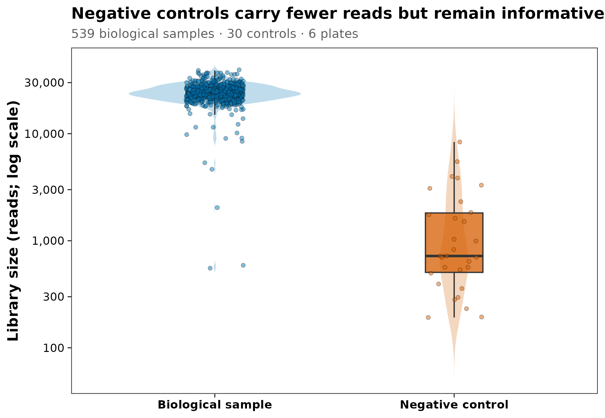
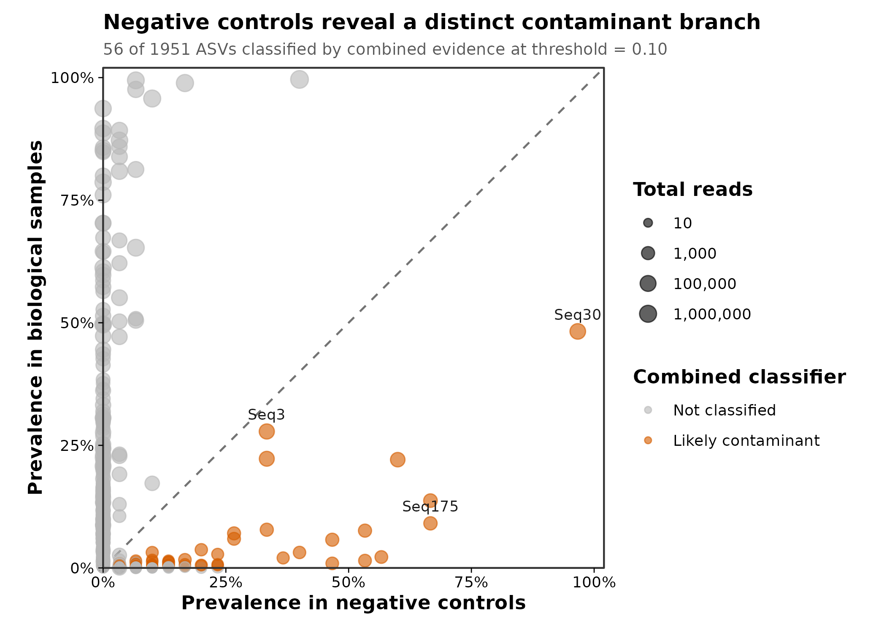
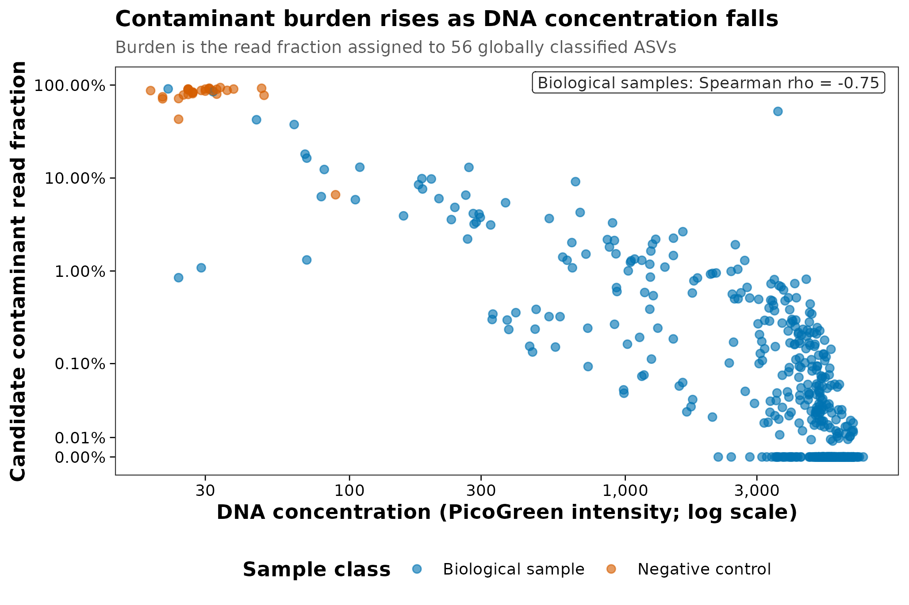

> **分析目标：**用阴性对照和 DNA 浓度识别 16S 数据中的污染 ASV，量化每个样本的污染 reads 比例，并导出保留完整审计轨迹的过滤后三件套。  
> **输入文件：**`otutab.tsv`、`taxonomy.tsv`、`metadata.tsv`；metadata 额外包含 `IsNegative`、`quant_reading` 和 `PlateNumber`。  
> **预计资源：**1,951 个 ASV、569 个样本（含 30 个阴性对照）；普通笔记本约 1–3 分钟，内存低于 1 GB。

## 这一步对应论文里的哪张图 {#sec-target}

低生物量研究中，污染不是一句“设置了 blank”就结束。论文至少应给出三类可审查证据：

1. 生物样本与阴性对照的 reads 分布；
2. 候选污染物在阴性对照和生物样本中的 prevalence（检出率）；
3. 每个生物样本中候选污染 reads 的比例，以及它与 DNA 浓度/生物量的关系。

本篇使用 `decontam` 官方示例 `MUClite.rds`。这是一个真实的 16S V4 数据对象，包含 1,951 个 DADA2 ASV、539 个口腔生物样本和分布在 6 块板上的 30 个阴性对照。我们不复制论文原图，而是从官方对象导出三件套并重新计算：

::: {layout-ncol=2}
{#fig-control-library}

{#fig-contaminant-prevalence}
:::

{#fig-contaminant-burden}

::: {.callout-important title="阴性对照必须测序，也必须暂时保留"}
阴性对照 reads 少是预期现象，不是“没测好”。如果在 ASV 推断后立刻按低 reads 删除所有 blank，就失去了 prevalence 方法最关键的参照。应先让对照经历与真实样本相同的采集、提取、PCR、建库、测序和序列处理，再做污染判定。
:::

## 理论：污染为什么在低生物量样本中被放大 {#sec-theory}

### 1. 观测到的 DNA 由样本信号与外源信号共同组成

可以把某个样本的观测 DNA 简化为：

$$
\text{Observed DNA}
=
\text{Biological DNA}
+
\text{Reagent/laboratory DNA}
+
\text{Cross-sample DNA}
$$

试剂或实验室带入的污染 DNA 质量可能不大，却常具有近似固定的绝对量。当真实样本的微生物 DNA 很少时，相同污染量会占据更高的相对比例。因此：

- 阴性对照可能获得可观的微生物 reads；
- 低 DNA 浓度样本更容易被 reagent/kit background 主导；
- 相同 kit lot 在高生物量粪便中几乎不可见，在胎盘、血液、肺、皮肤拭子或洁净环境样本中却可能决定结果。

[Salter 等](https://doi.org/10.1186/s12915-014-0087-z)系统展示了试剂与实验室污染对低生物量微生物组的影响；[Eisenhofer 等](https://doi.org/10.1016/j.tim.2018.11.003)进一步总结了从实验设计到报告的控制原则。

### 2. blank 不是一种，而是一条污染定位链

| 对照 | 从哪一步开始 | 主要帮助定位 |
|---|---|---|
| Field blank | 采样现场 | 采样器具、空气、运输和保存 |
| Collection blank | 采样操作 | 拭子、缓冲液和采样步骤 |
| Extraction blank | DNA 提取 | kit/reagent、工作台和提取批次 |
| PCR no-template control | PCR | PCR 试剂和扩增环境 |
| Mock community / positive control | 已知组成 | 提取偏倚、扩增偏倚、串样与流程失败 |

阴性对照回答“没有加入生物样本时出现了什么”，阳性对照回答“已知输入经过流程后变成什么”。两者不能互相替代。若研究跨多个 kit lot、提取板或测序批次，每个关键批次都要有相应对照；把所有 blank 集中在最后一块板上，无法识别批次特异污染。

### 3. kitome 不是可直接套用的黑名单

“kitome”泛指试剂盒和实验室背景中反复出现的微生物 DNA，但它不是固定的物种名单。同一个属：

- 在某个项目中可能是试剂污染；
- 在另一种真实生态位中可能是优势成员；
- 还可能同时包含真实信号和污染信号。

按属名删除 `Ralstonia`、`Pseudomonas` 或 `Sphingomonas` 等“常见污染菌”会制造不可追踪的主观偏差。判定应结合本实验的阴性对照、浓度、批次、序列分辨率和丰度模式，而不是仅看 taxonomy。

### 4. `decontam` 的两个基本证据

**Frequency method（频率法）**

若污染 DNA 的绝对量近似固定，其相对丰度会随样本总 DNA 浓度升高而下降。该方法需要每个样本在等摩尔混样前的定量值，且浓度必须为正数。

**Prevalence method（检出率法）**

若一个 ASV 在阴性对照中比在真实样本中更常检出，它更符合污染物模式。该方法需要经过完整流程并测序的阴性对照。

**Combined method（联合方法）**

`decontam` 可用 Fisher 方法合并 frequency 与 prevalence 证据。本例以 `method = "combined"`、`threshold = 0.10` 为主分析，同时报告 frequency、prevalence 和按板分层的敏感性结果。

::: {.callout-note title="threshold 不是通用 FDR 阈值"}
`decontam` 的 `threshold` 是分类器用于拒绝“非污染物”假设的内部概率阈值。`0.10` 是软件默认值，不等于 10% FDR，也不是所有研究的最优阈值。应结合控制设计、诊断图和敏感性分析预先确定并完整报告。
:::

<details>
<summary><strong>深入：哪些污染 decontam 不一定能抓到</strong></summary>

`decontam` 识别的是符合浓度或阴性对照模式的 feature。以下问题可能需要额外证据：

- 高丰度样本向相邻孔、索引或低生物量样本的 cross-talk；
- 所有阴性对照都在不同批次导致的不可识别批次混杂；
- 污染物同时也是目标生态位真实成员；
- 只有一个阴性对照，prevalence 几乎无法稳定估计；
- 某些污染只发生在采样前，而现有对照从提取步骤才开始；
- 样本已经被污染 reads 主导，仅删除若干 ASV 后仍不可解释。

因此还应检查板位、索引组合、批次、阴性/阳性对照、实验日志和样本总负荷。污染控制是证据整合，不是单一函数调用。

</details>

## 准备工作 {#sec-setup}

<details>
<summary><strong>展开：安装依赖、导出真实数据和定义作图函数</strong></summary>

本项目使用 R 4.4.1、Bioconductor 3.19 和 `decontam 1.24.0`。首次运行安装：

```{r}
#| eval: false
install.packages(c(
  "BiocManager", "ggplot2", "scales", "digest"
))
BiocManager::install(version = "3.19", ask = FALSE)
BiocManager::install(
  c("decontam", "phyloseq"),
  ask = FALSE,
  update = FALSE
)
```

`MUClite.rds` 随 `decontam` 分发。下面代码核对固定对象的 SHA-256，并导出标准三件套：

```{r}
#| eval: false
library(phyloseq)

muc_path <- system.file(
  "extdata",
  "MUClite.rds",
  package = "decontam"
)
stopifnot(nzchar(muc_path), file.exists(muc_path))

expected_sha256 <- paste0(
  "801456d5780d5f51308d04c23f447710",
  "2cc5fbe9543ffa62fad2240a99c43d62"
)
observed_sha256 <- digest::digest(
  file = muc_path,
  algo = "sha256",
  serialize = FALSE
)
stopifnot(identical(observed_sha256, expected_sha256))

ps <- readRDS(muc_path)
otutab <- as(phyloseq::otu_table(ps), "matrix")
if (!phyloseq::taxa_are_rows(ps)) {
  otutab <- t(otutab)
}
taxonomy <- as(phyloseq::tax_table(ps), "matrix")
metadata <- as.data.frame(phyloseq::sample_data(ps))
metadata$IsNegative <- (
  metadata$Sample_or_Control == "Control Sample"
)

stopifnot(
  identical(rownames(otutab), rownames(taxonomy)),
  identical(colnames(otutab), rownames(metadata))
)

write_tsv <- function(x, id_name, path) {
  out <- data.frame(
    setNames(list(rownames(x)), id_name),
    x,
    check.names = FALSE
  )
  utils::write.table(
    out,
    path,
    sep = "\t",
    quote = FALSE,
    row.names = FALSE,
    na = ""
  )
}

dir.create(
  "data/small/decontam",
  recursive = TRUE,
  showWarnings = FALSE
)
write_tsv(
  otutab,
  "FeatureID",
  "data/small/decontam/otutab.tsv"
)
write_tsv(
  taxonomy,
  "FeatureID",
  "data/small/decontam/taxonomy.tsv"
)
write_tsv(
  metadata,
  "SampleID",
  "data/small/decontam/metadata.tsv"
)
```

出版级函数直接定义在文章内：

```{r}
library(decontam)
library(ggplot2)

stopifnot(
  identical(
    as.character(utils::packageVersion("decontam")),
    "1.24.0"
  )
)

set.seed(20260718)

pal_pub <- c(
  "#0072B2", "#D55E00", "#009E73", "#CC79A7",
  "#E69F00", "#56B4E9", "#F0E442", "#999999"
)

scale_color_pub <- function(...) {
  ggplot2::scale_color_manual(values = pal_pub, ...)
}

scale_fill_pub <- function(...) {
  ggplot2::scale_fill_manual(values = pal_pub, ...)
}

theme_pub <- function(base_size = 12) {
  ggplot2::theme_bw(base_size = base_size, base_family = "sans") +
    ggplot2::theme(
      panel.grid = ggplot2::element_blank(),
      axis.text = ggplot2::element_text(color = "black"),
      axis.ticks = ggplot2::element_line(color = "black", linewidth = 0.3),
      legend.key = ggplot2::element_blank(),
      legend.background = ggplot2::element_rect(
        fill = scales::alpha("white", 0.7),
        color = NA
      )
    )
}

save_pub <- function(
  plot,
  file_base,
  width = 120,
  height = 95,
  units = "mm",
  dpi = 300
) {
  dir.create(dirname(file_base), recursive = TRUE, showWarnings = FALSE)
  ggplot2::ggsave(
    paste0(file_base, ".pdf"),
    plot,
    width = width,
    height = height,
    units = units,
    device = grDevices::cairo_pdf
  )
  ggplot2::ggsave(
    paste0(file_base, ".png"),
    plot,
    width = width,
    height = height,
    units = units,
    dpi = dpi,
    bg = "white"
  )
  ggplot2::ggsave(
    paste0(file_base, ".tiff"),
    plot,
    width = width,
    height = height,
    units = units,
    dpi = dpi,
    compression = "lzw",
    bg = "white"
  )
  invisible(plot)
}
```

整仓库运行时可使用内容相同的 `R/theme_pub.R`；独立运行以上代码块即可获得全部函数。

</details>

## 可复制代码 {#sec-code}

### 1. 从三件套读取并核对阴性对照

```{r}
otutab <- read.delim(
  "data/small/decontam/otutab.tsv",
  row.names = 1,
  check.names = FALSE
)
taxonomy <- read.delim(
  "data/small/decontam/taxonomy.tsv",
  row.names = 1,
  check.names = FALSE
)
metadata <- read.delim(
  "data/small/decontam/metadata.tsv",
  row.names = 1,
  check.names = FALSE
)

otutab <- as.matrix(otutab)
storage.mode(otutab) <- "numeric"
metadata$IsNegative <- as.logical(metadata$IsNegative)

stopifnot(
  identical(rownames(otutab), rownames(taxonomy)),
  identical(colnames(otutab), rownames(metadata)),
  all(otutab >= 0),
  all(otutab == floor(otutab)),
  all(colSums(otutab) > 0),
  all(c(
    "IsNegative",
    "quant_reading",
    "PlateNumber",
    "Sample_or_Control"
  ) %in% colnames(metadata)),
  all(is.finite(metadata$quant_reading)),
  all(metadata$quant_reading > 0)
)

dim(otutab)
otutab[1:5, 1:5]
taxonomy[1:5, , drop = FALSE]
head(metadata)

control_by_plate <- with(
  metadata,
  table(PlateNumber, IsNegative)
)
control_by_plate
stopifnot(all(control_by_plate[, "TRUE"] == 5))
```

共有 `r format(nrow(otutab), big.mark = ",")` 个 ASV、`r format(ncol(otutab), big.mark = ",")` 个测序样本，其中 `r sum(metadata$IsNegative)` 个为阴性对照；每块板均有 5 个对照。这里的独立生物单位不是 539：口腔样本来自重复受试者/部位，污染识别使用样本级浓度和对照，但后续生物学推断仍必须按原研究的重复测量结构建模。

### 2. 先看测序深度，不删除低 reads 对照

```{r}
sample_qc <- data.frame(
  SampleID = rownames(metadata),
  SampleClass = factor(
    ifelse(
      metadata$IsNegative,
      "Negative control",
      "Biological sample"
    ),
    levels = c("Biological sample", "Negative control")
  ),
  Plate = factor(metadata$PlateNumber),
  DNAConcentration = metadata$quant_reading,
  LibrarySize = colSums(otutab),
  stringsAsFactors = FALSE
)

library_summary <- do.call(
  rbind,
  lapply(
    split(sample_qc$LibrarySize, sample_qc$SampleClass),
    function(x) {
      data.frame(
        N = length(x),
        Minimum = min(x),
        Median = stats::median(x),
        Maximum = max(x)
      )
    }
  )
)
library_summary
```

生物样本的 median library size 为 `r format(library_summary["Biological sample", "Median"], big.mark = ",")` reads；阴性对照为 `r format(library_summary["Negative control", "Median"], big.mark = ",")` reads。对照 reads 较少，但并非全部为 0，这正是后续 prevalence 证据的来源。

### 3. 分别运行 frequency、prevalence 与 combined

`decontam` 的矩阵输入是“样本 × feature”，因此需要转置标准三件套中的 `otutab`。

```{r}
seqtab <- t(otutab)
is_negative <- metadata[rownames(seqtab), "IsNegative"]
dna_concentration <- metadata[
  rownames(seqtab),
  "quant_reading"
]

stopifnot(
  identical(rownames(seqtab), rownames(metadata)),
  identical(colnames(seqtab), rownames(taxonomy))
)

contam_frequency <- decontam::isContaminant(
  seqtab,
  method = "frequency",
  conc = dna_concentration,
  threshold = 0.10
)

contam_prevalence <- decontam::isContaminant(
  seqtab,
  method = "prevalence",
  neg = is_negative,
  threshold = 0.10
)

contam_combined <- decontam::isContaminant(
  seqtab,
  method = "combined",
  conc = dna_concentration,
  neg = is_negative,
  threshold = 0.10
)

classification_summary <- data.frame(
  Method = c("Frequency", "Prevalence", "Combined"),
  Threshold = 0.10,
  ContaminantASVs = c(
    sum(contam_frequency$contaminant),
    sum(contam_prevalence$contaminant),
    sum(contam_combined$contaminant)
  )
)
classification_summary

method_overlap <- table(
  Frequency = contam_frequency$contaminant,
  Prevalence = contam_prevalence$contaminant
)
method_overlap
```

在默认 `threshold = 0.10` 下，frequency 法标记 `r sum(contam_frequency$contaminant)` 个 ASV，prevalence 法标记 `r sum(contam_prevalence$contaminant)` 个，combined 法标记 `r sum(contam_combined$contaminant)` 个。两种基本证据不会完全重合：某些高 prevalence 污染物在真实样本和对照中都很常见，单独用 prevalence 可能漏掉；某些低丰度 feature 又主要依赖对照证据。

### 4. 按实验板做敏感性分析

本数据每块板都有 5 个阴性对照，可以检查板特异判定：

```{r}
contam_batch <- decontam::isContaminant(
  seqtab,
  method = "combined",
  conc = dna_concentration,
  neg = is_negative,
  batch = factor(metadata[rownames(seqtab), "PlateNumber"]),
  batch.combine = "minimum",
  threshold = 0.10
)

batch_comparison <- data.frame(
  GlobalCombined = contam_combined$contaminant,
  BatchCombined = contam_batch$contaminant
)

table(batch_comparison)
data.frame(
  Global = sum(batch_comparison$GlobalCombined),
  BatchAware = sum(batch_comparison$BatchCombined),
  Shared = sum(
    batch_comparison$GlobalCombined &
      batch_comparison$BatchCombined
  )
)
```

全局 combined 标记 `r sum(contam_combined$contaminant)` 个 ASV；按板分析标记 `r sum(contam_batch$contaminant)` 个，两者共有 `r sum(contam_combined$contaminant & contam_batch$contaminant)` 个。这里把全局 combined 作为可复现主分析，把按板结果作为敏感性检查；真实研究应根据 kit lot、提取板和对照布局在分析方案中预先确定主模型。

### 5. 生成 feature 级和样本级审计表

```{r}
negative_prevalence <- colMeans(
  seqtab[is_negative, , drop = FALSE] > 0
)
biological_prevalence <- colMeans(
  seqtab[!is_negative, , drop = FALSE] > 0
)
total_feature_reads <- colSums(seqtab)

contaminant_audit <- data.frame(
  FeatureID = rownames(contam_combined),
  taxonomy[rownames(contam_combined), , drop = FALSE],
  NegativePrevalence = negative_prevalence,
  BiologicalPrevalence = biological_prevalence,
  TotalReads = total_feature_reads,
  FrequencyP = contam_combined$p.freq,
  PrevalenceP = contam_combined$p.prev,
  CombinedP = contam_combined$p,
  GlobalContaminant = contam_combined$contaminant,
  BatchContaminant = contam_batch$contaminant,
  check.names = FALSE
)

contaminant_ids <- contaminant_audit$FeatureID[
  contaminant_audit$GlobalContaminant
]
library_size <- colSums(otutab)
contaminant_reads <- colSums(
  otutab[contaminant_ids, , drop = FALSE]
)

sample_burden <- data.frame(
  SampleID = colnames(otutab),
  SampleClass = sample_qc$SampleClass,
  Plate = sample_qc$Plate,
  DNAConcentration = sample_qc$DNAConcentration,
  LibrarySize = library_size,
  ContaminantReads = contaminant_reads,
  ContaminantFraction = contaminant_reads / library_size,
  stringsAsFactors = FALSE
)

burden_summary <- do.call(
  rbind,
  lapply(
    split(
      sample_burden$ContaminantFraction,
      sample_burden$SampleClass
    ),
    function(x) {
      data.frame(
        Minimum = min(x),
        Median = stats::median(x),
        Mean = mean(x),
        Maximum = max(x)
      )
    }
  )
)
burden_summary

burden_correlation <- stats::cor.test(
  sample_burden$ContaminantFraction[
    sample_burden$SampleClass == "Biological sample"
  ],
  sample_burden$DNAConcentration[
    sample_burden$SampleClass == "Biological sample"
  ],
  method = "spearman",
  exact = FALSE
)
burden_correlation
```

combined 候选污染 ASV 在阴性对照中占 reads 的 median 为 `r scales::percent(burden_summary["Negative control", "Median"], accuracy = 0.1)`，在生物样本中为 `r scales::percent(burden_summary["Biological sample", "Median"], accuracy = 0.001)`。生物样本内，污染 reads 比例与 DNA 浓度呈负相关（Spearman $\rho=`r sprintf("%.3f", unname(burden_correlation$estimate))`$，$P<2.2\times10^{-16}$）。这是低生物量样本更容易受固定背景 DNA 影响的真实数据表现，不是给所有项目套用的污染比例。

### 6. 导出过滤后的三件套，但保留原始对照

```{r}
biological_ids <- rownames(metadata)[!metadata$IsNegative]
kept_features <- setdiff(rownames(otutab), contaminant_ids)

otutab_filtered <- otutab[
  kept_features,
  biological_ids,
  drop = FALSE
]
taxonomy_filtered <- taxonomy[
  kept_features,
  ,
  drop = FALSE
]
metadata_filtered <- metadata[
  biological_ids,
  ,
  drop = FALSE
]

stopifnot(
  identical(
    rownames(otutab_filtered),
    rownames(taxonomy_filtered)
  ),
  identical(
    colnames(otutab_filtered),
    rownames(metadata_filtered)
  ),
  all(colSums(otutab_filtered) > 0)
)

biological_reads_before <- sum(
  otutab[, biological_ids, drop = FALSE]
)
biological_reads_after <- sum(otutab_filtered)
biological_reads_removed <- (
  1 - biological_reads_after / biological_reads_before
)

filter_summary <- data.frame(
  InputFeatures = nrow(otutab),
  RemovedFeatures = length(contaminant_ids),
  OutputFeatures = nrow(otutab_filtered),
  BiologicalSamples = ncol(otutab_filtered),
  BiologicalReadsRemoved = biological_reads_removed
)
filter_summary
```

本例删除 `r length(contaminant_ids)` / `r nrow(otutab)` 个 ASV，保留 `r nrow(otutab_filtered)` 个 ASV 和 `r ncol(otutab_filtered)` 个生物样本；这些 ASV 占全部生物样本 reads 的 `r scales::percent(biological_reads_removed, accuracy = 0.01)`。少量总体 reads 不代表不重要：污染可能集中在少数低 DNA 样本中，最高样本的候选污染比例达到 `r scales::percent(max(sample_burden$ContaminantFraction[sample_burden$SampleClass == "Biological sample"]), accuracy = 0.1)`。

```{r}
write_result_tsv <- function(x, id_name, path) {
  out <- data.frame(
    setNames(list(rownames(x)), id_name),
    x,
    check.names = FALSE
  )
  utils::write.table(
    out,
    path,
    sep = "\t",
    quote = FALSE,
    row.names = FALSE,
    na = ""
  )
}

result_dir <- "results/04-contamination"
dir.create(result_dir, recursive = TRUE, showWarnings = FALSE)

utils::write.table(
  contaminant_audit,
  file.path(result_dir, "contaminant-classification.tsv"),
  sep = "\t",
  quote = FALSE,
  row.names = FALSE,
  na = ""
)
utils::write.table(
  sample_burden,
  file.path(result_dir, "sample-contamination-burden.tsv"),
  sep = "\t",
  quote = FALSE,
  row.names = FALSE,
  na = ""
)
write_result_tsv(
  otutab_filtered,
  "FeatureID",
  file.path(result_dir, "otutab.filtered.tsv")
)
write_result_tsv(
  taxonomy_filtered,
  "FeatureID",
  file.path(result_dir, "taxonomy.filtered.tsv")
)
write_result_tsv(
  metadata_filtered,
  "SampleID",
  file.path(result_dir, "metadata.filtered.tsv")
)
```

原始 `data/small/decontam/` 三件套始终保留，过滤结果和判定表另写到 `results/04-contamination/`。这样可以回溯阈值、恢复被删 feature，并比较不同污染策略。

## 出版级美化 {#sec-polish}

### 1. 阴性对照与生物样本的 library size

```{r}
sample_colors <- c(
  "Biological sample" = "#0072B2",
  "Negative control" = "#D55E00"
)

p_control_library <- ggplot(
  sample_qc,
  aes(SampleClass, LibrarySize, fill = SampleClass)
) +
  geom_violin(
    width = 0.72,
    trim = FALSE,
    alpha = 0.25,
    color = NA
  ) +
  geom_boxplot(
    width = 0.24,
    outlier.shape = NA,
    alpha = 0.75,
    linewidth = 0.45
  ) +
  geom_point(
    position = position_jitter(
      width = 0.12,
      height = 0,
      seed = 20260718
    ),
    shape = 21,
    size = 1.35,
    stroke = 0.2,
    alpha = 0.48
  ) +
  scale_fill_manual(
    values = sample_colors,
    guide = "none"
  ) +
  scale_y_log10(
    breaks = c(100, 300, 1000, 3000, 10000, 30000),
    labels = scales::label_number(big.mark = ",")
  ) +
  labs(
    title = "Negative controls carry fewer reads but remain informative",
    subtitle = paste0(
      sum(!metadata$IsNegative),
      " biological samples · ",
      sum(metadata$IsNegative),
      " controls · ",
      length(unique(metadata$PlateNumber)),
      " plates"
    ),
    x = NULL,
    y = "Library size (reads; log scale)"
  ) +
  theme_pub(base_size = 11) +
  theme(
    plot.title = element_text(face = "bold", size = 12),
    plot.subtitle = element_text(color = "grey35", size = 9.5),
    axis.title.y = element_text(face = "bold"),
    axis.text.x = element_text(face = "bold")
  )

p_control_library
save_pub(
  p_control_library,
  "figures/04-control-library-size",
  width = 162,
  height = 112
)
```

### 2. 阴性对照与生物样本中的 prevalence

```{r}
prevalence_plot_df <- data.frame(
  FeatureID = contaminant_audit$FeatureID,
  NegativePrevalence = contaminant_audit$NegativePrevalence,
  BiologicalPrevalence = contaminant_audit$BiologicalPrevalence,
  TotalReads = contaminant_audit$TotalReads,
  Classification = factor(
    ifelse(
      contaminant_audit$GlobalContaminant,
      "Likely contaminant",
      "Not classified"
    ),
    levels = c("Not classified", "Likely contaminant")
  )
)

classification_colors <- c(
  "Not classified" = "#B8B8B8",
  "Likely contaminant" = "#D55E00"
)

label_features <- intersect(
  c("Seq30", "Seq175", "Seq3"),
  prevalence_plot_df$FeatureID
)

p_contaminant_prevalence <- ggplot(
  prevalence_plot_df,
  aes(
    NegativePrevalence,
    BiologicalPrevalence,
    color = Classification,
    size = TotalReads
  )
) +
  geom_abline(
    slope = 1,
    intercept = 0,
    linetype = "dashed",
    color = "grey45",
    linewidth = 0.55
  ) +
  geom_point(alpha = 0.62) +
  geom_text(
    data = subset(
      prevalence_plot_df,
      FeatureID %in% label_features
    ),
    aes(label = FeatureID),
    size = 3.0,
    color = "grey10",
    nudge_y = 0.035,
    show.legend = FALSE
  ) +
  scale_color_manual(
    values = classification_colors,
    name = "Combined classifier"
  ) +
  scale_size_continuous(
    trans = "log10",
    range = c(0.8, 4.4),
    breaks = c(10, 1000, 100000, 1000000),
    labels = scales::label_number(big.mark = ","),
    name = "Total reads"
  ) +
  scale_x_continuous(
    limits = c(0, 1),
    breaks = seq(0, 1, 0.25),
    labels = scales::percent_format(accuracy = 1),
    expand = expansion(mult = c(0, 0.02))
  ) +
  scale_y_continuous(
    limits = c(0, 1),
    breaks = seq(0, 1, 0.25),
    labels = scales::percent_format(accuracy = 1),
    expand = expansion(mult = c(0, 0.02))
  ) +
  coord_equal(clip = "off") +
  labs(
    title = "Negative controls reveal a distinct contaminant branch",
    subtitle = paste0(
      sum(contam_combined$contaminant),
      " of ",
      nrow(contam_combined),
      " ASVs classified by combined evidence at threshold = 0.10"
    ),
    x = "Prevalence in negative controls",
    y = "Prevalence in biological samples"
  ) +
  theme_pub(base_size = 11) +
  theme(
    plot.title = element_text(face = "bold", size = 12),
    plot.subtitle = element_text(color = "grey35", size = 9.2),
    axis.title = element_text(face = "bold"),
    legend.position = "right",
    legend.title = element_text(face = "bold"),
    plot.margin = margin(8, 10, 8, 8)
  )

p_contaminant_prevalence
save_pub(
  p_contaminant_prevalence,
  "figures/04-contaminant-prevalence",
  width = 178,
  height = 126
)
```

虚线是两类样本 prevalence 相等的位置；右下方向表示 feature 在阴性对照中相对更常检出。combined 方法还加入浓度证据，因此并非虚线下方的每个点都被判定，也可能识别出 prevalence 差异不大的强 frequency 候选。

### 3. 污染 burden 与 DNA 浓度

```{r}
rho_label <- sprintf(
  "Biological samples: Spearman rho = %.2f",
  unname(burden_correlation$estimate)
)

p_contaminant_burden <- ggplot(
  sample_burden,
  aes(
    DNAConcentration,
    ContaminantFraction,
    color = SampleClass
  )
) +
  geom_point(
    alpha = 0.62,
    size = 1.8
  ) +
  scale_color_manual(
    values = sample_colors,
    name = "Sample class"
  ) +
  scale_x_log10(
    labels = scales::label_number(big.mark = ",")
  ) +
  scale_y_continuous(
    trans = scales::pseudo_log_trans(
      base = 10,
      sigma = 0.0001
    ),
    breaks = c(0, 0.0001, 0.001, 0.01, 0.1, 1),
    labels = scales::percent_format(accuracy = 0.01),
    limits = c(0, 1)
  ) +
  annotate(
    "label",
    x = Inf,
    y = Inf,
    label = rho_label,
    hjust = 1.04,
    vjust = 1.25,
    size = 3.1,
    label.size = 0.25,
    fill = scales::alpha("white", 0.85),
    color = "grey15"
  ) +
  labs(
    title = "Contaminant burden rises as DNA concentration falls",
    subtitle = paste0(
      "Burden is the read fraction assigned to ",
      sum(contam_combined$contaminant),
      " globally classified ASVs"
    ),
    x = "DNA concentration (PicoGreen intensity; log scale)",
    y = "Candidate contaminant read fraction"
  ) +
  theme_pub(base_size = 11) +
  theme(
    plot.title = element_text(face = "bold", size = 12),
    plot.subtitle = element_text(color = "grey35", size = 9.2),
    axis.title = element_text(face = "bold"),
    legend.position = "bottom",
    legend.title = element_text(face = "bold")
  ) +
  guides(color = guide_legend(nrow = 1, byrow = TRUE))

p_contaminant_burden
save_pub(
  p_contaminant_burden,
  "figures/04-contaminant-burden",
  width = 174,
  height = 116
)
```

三张图均导出为 PDF、PNG 和 300 dpi LZW-TIFF，图内文字全部使用英文。

## 常见坑 {#sec-pitfalls}

::: {.callout-caution title="审稿人最容易指出的十个污染控制问题"}
1. **只写“设置空白对照”，不说明从哪一步开始。** Field blank、extraction blank 和 PCR NTC 监测的环节不同。
2. **阴性对照只做 PCR、不测序。** 没有 feature table 就无法与真实样本比较 prevalence。
3. **在污染识别前按低 reads 删除所有 blank。** 这会直接丢失最有价值的控制证据。
4. **所有 blank 都集中在一个批次。** 不能用它们代表其他 kit lot、提取板或测序批次。
5. **用“常见污染菌名单”按 taxonomy 删除。** 同一分类群可能是真实成员；应在 ASV/feature 层结合本实验证据。
6. **把 `threshold = 0.10` 写成 10% FDR。** 它是分类阈值，不是常规多重检验校正后的 FDR。
7. **只删除污染 ASV，不检查样本 burden。** 某些样本可能已被污染主导，删除后仍不适合进入下游分析。
8. **把阴性对照当作健康/环境零组参与多样性检验。** 它们是过程控制，不是生物学对照组。
9. **忽略 plate、kit lot 和 index cross-talk。** `decontam` 不能替代板位图、实验日志和阳性对照。
10. **只报告删了多少 feature。** 还应报告每类对照数、阈值、批次策略、reads 损失、样本排除和敏感性分析。
:::

::: {.callout-warning title="没有阴性对照，也没有浓度怎么办"}
两类核心证据都缺失时，不能事后从 taxonomy 可靠重建污染来源。可以做丰度—批次—板位敏感性检查、与同批公共背景比较并弱化结论，但这不能等价替代真实 blank。下一轮实验应把阴性对照和 DNA 定量作为设计必需项。
:::

## 这段 Methods 怎么写 {#sec-methods}

可直接修改的英文模板：

> **Contamination control and feature filtering.** Field/collection blanks, extraction blanks, PCR no-template controls, and mock-community controls were processed alongside biological samples as applicable. Each extraction batch and library-preparation plate contained [number] negative controls. DNA was quantified using [assay] before equimolar pooling. Negative controls were retained through denoising and contaminant inference. Candidate contaminant ASVs were identified with `decontam` version [version] using the [frequency/prevalence/combined] method at a classification threshold of [threshold]; analyses were [pooled across batches/performed within batch using batch variable]. We inspected feature prevalence in negative versus biological samples and quantified the fraction of contaminant-assigned reads per sample. ASVs classified as contaminants were removed from biological samples, while the original feature table, controls, classifier scores, and removal log were retained. Samples were excluded when [prespecified rule and rationale]. Negative controls were not included in downstream biological diversity or differential-abundance analyses.

本例的可复现实写：

> **Worked contamination analysis.** The dataset contained 1,951 ASVs from 539 biological oral samples and 30 negative controls distributed evenly across six plates. DNA concentration was represented by PicoGreen fluorescence (`quant_reading`). Contaminants were identified with `decontam` 1.24.0 using combined frequency and prevalence evidence and a classification threshold of 0.10. The global combined analysis classified `r sum(contam_combined$contaminant)` ASVs; a plate-aware sensitivity analysis classified `r sum(contam_batch$contaminant)`, with `r sum(contam_combined$contaminant & contam_batch$contaminant)` ASVs shared. Removing globally classified ASVs eliminated `r scales::percent(biological_reads_removed, accuracy = 0.01)` of reads across biological samples. The median candidate-contaminant read fraction was `r scales::percent(burden_summary["Biological sample", "Median"], accuracy = 0.001)` in biological samples and `r scales::percent(burden_summary["Negative control", "Median"], accuracy = 0.1)` in negative controls. Original controls and complete feature- and sample-level audit tables were retained.

Results 中不要只写“污染已去除”，应同时给：

- 阴性/阳性对照种类、数量和批次分布；
- 主要 classifier、版本、阈值和 batch 策略；
- 候选污染 feature 数及方法间重合；
- 生物样本总体 reads 损失和逐样本 burden 分布；
- 被排除样本及预先规定的理由；
- 改变阈值或 batch 策略后主要结论是否稳定。

## 换成你自己的数据怎么做 {#sec-own-data}

### 1. metadata 必需列

三件套路径仍只需替换为你的文件，但 metadata 至少应增加：

| 列名 | 类型 | 含义 |
|---|---|---|
| `IsNegative` | logical | 阴性对照为 `TRUE` |
| `ControlType` | factor | Field/collection/extraction/PCR control |
| `DNAConcentration` | numeric | 等摩尔混样前的 DNA 定量，必须 $>0$ |
| `ExtractionBatch` | factor | 提取板或 kit lot |
| `PCRPlate` | factor | PCR/建库板 |
| `SequencingRun` | factor | 测序批次 |
| `PlateRow`, `PlateColumn` | factor/integer | 排查邻孔串样 |
| `SubjectID`/`SiteID` | factor | 真正的独立生物单位 |

对照也必须拥有唯一 `SampleID`，并成为 `otutab` 的列。不要用空字符串、`NA` 或特殊行名把它们藏在主表之外。

### 2. 三件套通用代码

```{r}
#| eval: false
otutab <- read.delim(
  "your_data/otutab.tsv",
  row.names = 1,
  check.names = FALSE
)
taxonomy <- read.delim(
  "your_data/taxonomy.tsv",
  row.names = 1,
  check.names = FALSE
)
metadata <- read.delim(
  "your_data/metadata.tsv",
  row.names = 1,
  check.names = FALSE
)
otutab <- as.matrix(otutab)
storage.mode(otutab) <- "numeric"

stopifnot(
  identical(rownames(otutab), rownames(taxonomy)),
  identical(colnames(otutab), rownames(metadata)),
  is.logical(metadata$IsNegative),
  all(metadata$DNAConcentration > 0)
)

# 每个批次是否同时有生物样本和阴性对照？
design_table <- with(
  metadata,
  table(ExtractionBatch, IsNegative)
)
print(design_table)
stopifnot(all(design_table[, "TRUE"] > 0))

seqtab <- t(otutab)
contam <- decontam::isContaminant(
  seqtab,
  method = "combined",
  conc = metadata$DNAConcentration,
  neg = metadata$IsNegative,
  batch = metadata$ExtractionBatch,
  batch.combine = "minimum",
  threshold = 0.10
)

contaminant_ids <- rownames(contam)[contam$contaminant]
biological_ids <- rownames(metadata)[!metadata$IsNegative]

otutab_clean <- otutab[
  setdiff(rownames(otutab), contaminant_ids),
  biological_ids,
  drop = FALSE
]
taxonomy_clean <- taxonomy[
  rownames(otutab_clean),
  ,
  drop = FALSE
]
metadata_clean <- metadata[
  colnames(otutab_clean),
  ,
  drop = FALSE
]
```

若只有阴性对照而没有可靠浓度，使用 `method = "prevalence"`；若只有浓度而没有阴性对照，使用 `method = "frequency"`。不要为满足 combined 方法而伪造浓度或对照标签。

### 3. 样本排除要预先规定

对每个生物样本计算：

```{r}
#| eval: false
candidate_fraction <- colSums(
  otutab[contaminant_ids, , drop = FALSE]
) / colSums(otutab)

sample_audit <- data.frame(
  SampleID = colnames(otutab),
  IsNegative = metadata$IsNegative,
  DNAConcentration = metadata$DNAConcentration,
  LibrarySize = colSums(otutab),
  CandidateContaminantFraction = candidate_fraction
)
```

没有一个适用于所有生态位的固定排除比例。可结合以下证据预先制定规则：

- 候选污染 reads 比例；
- DNA 浓度/绝对微生物负荷；
- library size 与阳性对照表现；
- 样本是否处于异常板位或失败批次；
- 删除污染 ASV 后是否仍有足够信息；
- 改变阈值后主要结论是否稳定。

主分析与敏感性分析都应保存 feature 清单、样本清单、阈值和理由，避免看完结果后才决定删哪些样本。

## 参考 {#sec-references}

1. Davis NM, Proctor DM, Holmes SP, Relman DA, Callahan BJ. Simple statistical identification and removal of contaminant sequences in marker-gene and metagenomics data. *Microbiome*. 2018;6:226. [doi:10.1186/s40168-018-0605-2](https://doi.org/10.1186/s40168-018-0605-2)
2. Salter SJ, Cox MJ, Turek EM, et al. Reagent and laboratory contamination can critically impact sequence-based microbiome analyses. *BMC Biology*. 2014;12:87. [doi:10.1186/s12915-014-0087-z](https://doi.org/10.1186/s12915-014-0087-z)
3. Eisenhofer R, Minich JJ, Marotz C, Cooper A, Knight R, Weyrich LS. Contamination in low microbial biomass microbiome studies: issues and recommendations. *Trends in Microbiology*. 2019;27(2):105–117. [doi:10.1016/j.tim.2018.11.003](https://doi.org/10.1016/j.tim.2018.11.003)
4. Karstens L, Asquith M, Davin S, et al. Controlling for contaminants in low-biomass 16S rRNA gene sequencing experiments. *mSystems*. 2019;4(4):e00290-19. [doi:10.1128/mSystems.00290-19](https://doi.org/10.1128/mSystems.00290-19)
5. Minich JJ, Zhu Q, Janssen S, et al. KatharoSeq enables high-throughput microbiome analysis from low-biomass samples. *mSystems*. 2018;3(3):e00218-17. [doi:10.1128/mSystems.00218-17](https://doi.org/10.1128/mSystems.00218-17)
