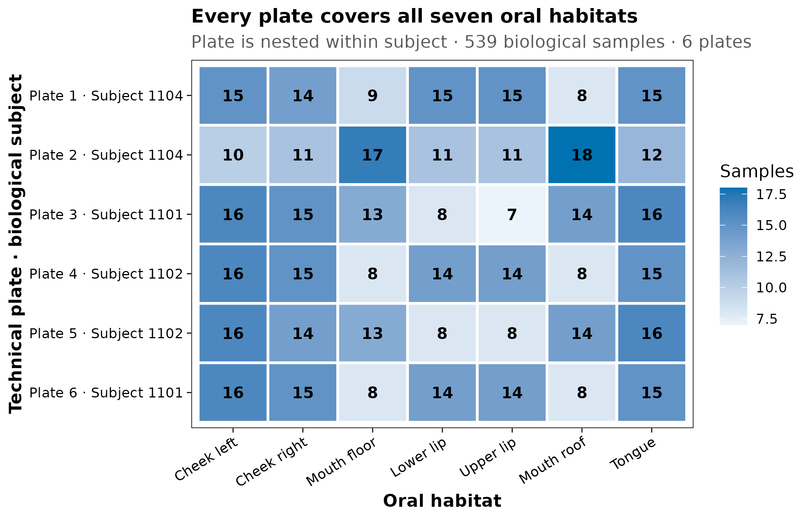
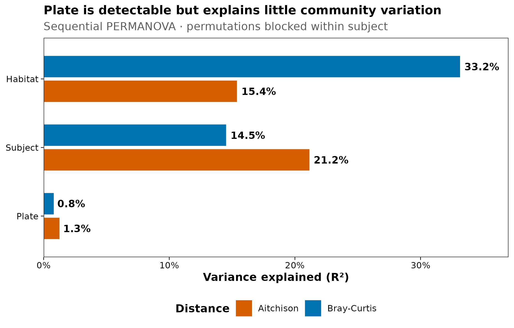
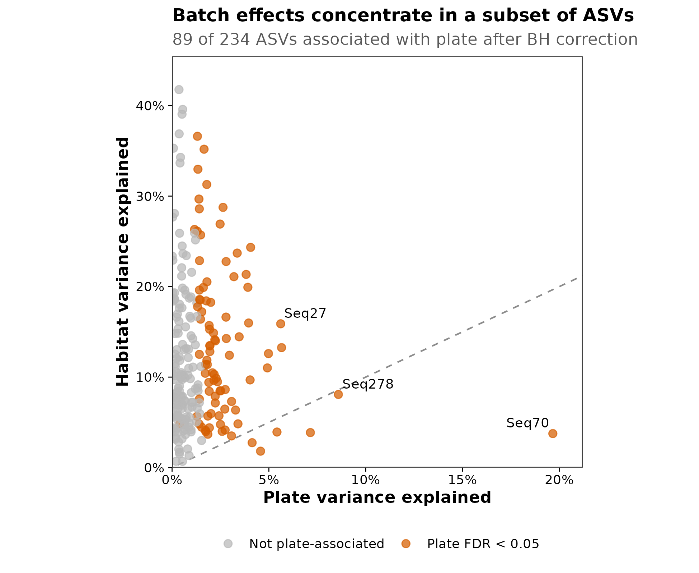
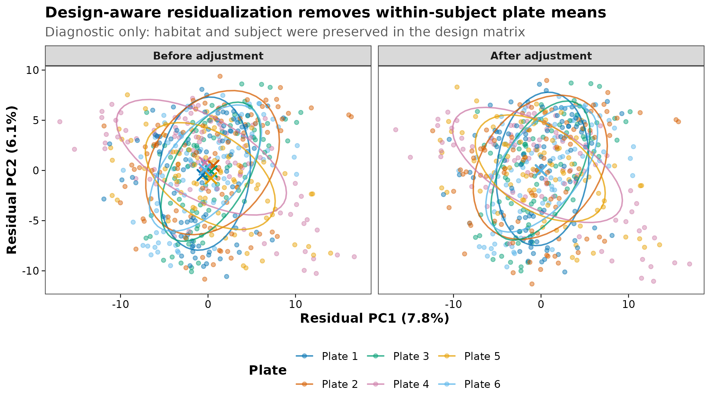

> **分析目标：**从实验设计、群落距离和 feature 三个层级识别 batch effect，区分“在模型中控制批次”和“直接改写丰度表”，并用可审计的敏感性分析检查生物结论是否稳定。  
> **输入文件：**`otutab.tsv`、`taxonomy.tsv`、`metadata.tsv`；metadata 额外包含 `PlateNumber`、`Subject`、`Habitat`、`IsNegative` 和 DNA 定量。  
> **预计资源：**1,951 个 ASV、569 个样本；普通笔记本约 2–5 分钟，内存低于 1 GB。

## 这一步对应论文里的哪张图 {#sec-target}

批次效应（batch effect）不是“PCoA 上按批次上色看起来没分开”就可以排除。论文中至少应留下四类证据：

1. 生物分组在各批次中的样本数，证明批次与研究变量可以区分；
2. 批次、研究变量与个体对群落差异的解释率，而不只给显著性；
3. feature 层面的批次影响和多重检验结果；
4. 主分析、批次控制模型和删去单一批次后的敏感性结果。

本篇使用 `decontam 1.24.0` 随包分发的真实 `MUClite.rds` 数据。对象包含 539 个口腔生物样本、30 个阴性对照、3 位受试者、7 个口腔部位和 6 块实验板。每位受试者分布在两块板上，每块板又覆盖全部 7 个部位，因此可以估计“同一受试者内部的板间差异”；但 plate 与 subject 仍是嵌套关系，不能把板间差异简单宣布为纯技术效应。

::: {layout-ncol=2}
{#fig-batch-design}

{#fig-community-batch}
:::

::: {layout-ncol=2}
{#fig-feature-batch}

{#fig-adjustment}
:::

::: {.callout-important title="先判断能不能分，再谈怎么校正"}
如果所有病例都在 Batch 1、所有对照都在 Batch 2，`Group` 与 `Batch` 完全共线。此时不存在能从这批数据中唯一分离“疾病效应”和“批次效应”的统计方法。ComBat、ConQuR、MMUPHin 或任何深度模型都不能凭空创造缺失的交叉设计；强行校正只是在不可识别的信号之间做未经验证的分配。
:::

## 理论：批次从哪里来，为什么不能见到就删 {#sec-theory}

### 1. 从采样到统计模型，每一层都可能形成批次

| 阶段 | 常见批次来源 | 建议保留的 metadata |
|---|---|---|
| Sampling | 日期、中心、操作者、季节、运输路线 | `CollectionDate`, `Site`, `Collector` |
| Storage | 保存液、温度、冻融次数、保存时长 | `Preservative`, `FreezeThaw`, `StorageDays` |
| Extraction | kit lot、提取板、机器人、实验人员 | `ExtractionBatch`, `KitLot`, `PlateRow/Column` |
| PCR | primer lot、循环数、PCR plate | `PCRBatch`, `PrimerLot`, `PCRCycles` |
| Sequencing | run、lane、flow cell、index set | `SequencingRun`, `Lane`, `IndexSet` |
| Bioinformatics | 引物、截断长度、数据库、软件版本 | `PipelineVersion`, `ClassifierVersion` |

同一天、同一块板或同一个研究中心产生的相似性，可能来自技术流程，也可能包含真实的空间、时间或人群差异。批次变量的定义不是“我不感兴趣的列”，而是需要结合采样流程、随机化记录和研究问题解释的变异来源。

### 2. technical batch、biological block 与 confounder 不是同义词

- **Technical batch：**本希望相同的样本因提取板、试剂批号或测序 run 不同而产生系统差异。
- **Biological block：**subject、cage、plot、center 等会让样本相关，但这种相关本身可能具有生物意义。
- **Confounder：**同时与暴露/分组和结局相关，导致目标效应无法直接解释。

例如 cage 既可能是需要控制的笼位效应，也可能通过共食粪便真实改变肠道微生物。把 cage 影响从丰度表中“抹平”不等于获得更真实的数据；更稳妥的做法通常是在设计和模型中承认 cage 这一层级。

### 3. 三种设计决定了可做的分析

| Batch × biology 关系 | 例子 | 能否估计批次 | 首选策略 |
|---|---|---|---|
| Crossed / balanced | 每个批次都有病例与对照 | 可以 | 模型中加入 batch；必要时做经过验证的校正 |
| Partially crossed | 部分批次缺少某一组 | 有限 | 限制比较范围、分层/混合模型、敏感性分析 |
| Completely confounded | Batch 1 全病例，Batch 2 全对照 | 不可以 | 补测桥接样本、重新设计或弱化问题 |

用设计矩阵表示时，完全混杂会导致矩阵不满秩：

$$
\operatorname{rank}(\mathbf{X}) < \operatorname{ncol}(\mathbf{X})
$$

这不是软件报错技巧问题，而是数据没有提供足够信息。

### 4. 批次诊断必须同时看 effect size 与 dispersion

PCoA/PCA 只展示前几个方向，批次也可能影响稀有 feature、零比例、方差或高阶分布。一个基本诊断组合是：

- 设计交叉表与 library/QC 分布；
- Bray-Curtis、Aitchison 等不同距离下的 PERMANOVA $R^2$；
- 与 PERMANOVA 配套的 multivariate dispersion；
- feature-wise 模型，并做 Benjamini-Hochberg FDR；
- leave-one-batch-out 或 within-batch 敏感性分析。

大样本中很小的批次效应也可能得到极小的 $P$ 值。反过来，批次数很少时，一个肉眼明显的差异也可能没有足够的批次级自由度。结论应首先看设计和效应量，再看显著性。

### 5. “控制 batch”优先于“改写数据”

从稳妥到激进，可按下列顺序决策：

1. **实验阶段预防：**随机分板、平衡分组、桥接样本、阴性/阳性对照；
2. **统计模型控制：**把 batch 作为固定效应、随机效应或 permutation block；
3. **分层与 meta-analysis：**先在 batch/study 内估计，再合并效应；
4. **生成校正后的 profile：**仅在设计可识别、方法与数据类型匹配且生物信号保留得到验证时使用；
5. **补测或缩小问题：**完全混杂时增加 bridge samples，或只回答批次内可识别的问题。

[Wang 与 Lê Cao](https://doi.org/10.1093/bib/bbz105)系统总结了微生物组 batch 的来源、设计条件和方法假设；[Gibbons 等](https://doi.org/10.1371/journal.pcbi.1006102)证明常规 omics 校正可能在微生物组 case-control 合并中制造或掩盖信号；[ConQuR](https://doi.org/10.1038/s41467-022-33071-9)与 [MMUPHin](https://doi.org/10.1186/s13059-022-02753-4)则针对零膨胀、过度离散和多队列结构提供了更专门的方法。

<details>
<summary><strong>深入：为什么本篇不把 ComBat 后的丰度表当默认答案</strong></summary>

16S 计数具有稀疏、过度离散和成分性。对相对丰度逐 feature 做高斯位置/尺度校正，可能：

- 产生负值或破坏每个样本总和；
- 把真实但与 batch 相关的生物差异一并删除；
- 改变零值、稀有 feature 与相关结构；
- 在全数据上先校正再交叉验证，造成测试集信息泄漏；
- 让排序图“混得更好”，但下游分类或差异结果更差。

因此本篇的矩阵调整只作为**设计矩阵是否按预期工作**的诊断：先保留 habitat 与 subject 的模型项，再减去每位 subject 内的 plate 均值对比。它不是 ConQuR、MMUPHin 或 ComBat 的替代品，也不作为后续差异丰度的默认输入。正式推断仍优先在每个方法自己的模型中加入 batch。

</details>

## 准备工作 {#sec-setup}

<details>
<summary><strong>展开：安装依赖、导出真实数据和定义作图函数</strong></summary>

本篇使用 R 4.4.1、Bioconductor 3.19、`decontam 1.24.0` 与 `vegan 2.6-6.1`。首次运行安装：

```{r}
#| eval: false
install.packages(c(
  "BiocManager", "vegan", "ggplot2", "scales", "digest"
))
BiocManager::install(version = "3.19", ask = FALSE)
BiocManager::install(
  c("decontam", "phyloseq"),
  ask = FALSE,
  update = FALSE
)
```

`MUClite.rds` 随 `decontam` 分发。下面代码核对对象 SHA-256，并导出本篇使用的三件套：

```{r}
#| eval: false
library(phyloseq)

muc_path <- system.file(
  "extdata",
  "MUClite.rds",
  package = "decontam"
)
expected_sha256 <- paste0(
  "801456d5780d5f51308d04c23f447710",
  "2cc5fbe9543ffa62fad2240a99c43d62"
)
stopifnot(
  nzchar(muc_path),
  identical(
    digest::digest(
      file = muc_path,
      algo = "sha256",
      serialize = FALSE
    ),
    expected_sha256
  )
)

ps <- readRDS(muc_path)
otutab <- as(phyloseq::otu_table(ps), "matrix")
if (!phyloseq::taxa_are_rows(ps)) {
  otutab <- t(otutab)
}
taxonomy <- as(phyloseq::tax_table(ps), "matrix")
metadata <- as.data.frame(phyloseq::sample_data(ps))
metadata$IsNegative <- (
  metadata$Sample_or_Control == "Control Sample"
)

write_tsv <- function(x, id_name, path) {
  out <- data.frame(
    setNames(list(rownames(x)), id_name),
    x,
    check.names = FALSE
  )
  utils::write.table(
    out,
    path,
    sep = "\t",
    quote = FALSE,
    row.names = FALSE,
    na = ""
  )
}

dir.create(
  "data/small/decontam",
  recursive = TRUE,
  showWarnings = FALSE
)
write_tsv(
  otutab,
  "FeatureID",
  "data/small/decontam/otutab.tsv"
)
write_tsv(
  taxonomy,
  "FeatureID",
  "data/small/decontam/taxonomy.tsv"
)
write_tsv(
  metadata,
  "SampleID",
  "data/small/decontam/metadata.tsv"
)
```

出版级函数直接定义在文章内：

```{r}
library(decontam)
library(vegan)
library(ggplot2)

stopifnot(
  identical(
    as.character(utils::packageVersion("decontam")),
    "1.24.0"
  ),
  identical(
    as.character(utils::packageVersion("vegan")),
    "2.6.6.1"
  )
)

set.seed(20260719)

pal_pub <- c(
  "#0072B2", "#D55E00", "#009E73", "#CC79A7",
  "#E69F00", "#56B4E9", "#F0E442", "#999999"
)

scale_color_pub <- function(...) {
  ggplot2::scale_color_manual(values = pal_pub, ...)
}

scale_fill_pub <- function(...) {
  ggplot2::scale_fill_manual(values = pal_pub, ...)
}

theme_pub <- function(base_size = 12) {
  ggplot2::theme_bw(base_size = base_size, base_family = "sans") +
    ggplot2::theme(
      panel.grid = ggplot2::element_blank(),
      axis.text = ggplot2::element_text(color = "black"),
      axis.ticks = ggplot2::element_line(
        color = "black",
        linewidth = 0.3
      ),
      legend.key = ggplot2::element_blank(),
      legend.background = ggplot2::element_rect(
        fill = scales::alpha("white", 0.7),
        color = NA
      )
    )
}

save_pub <- function(
  plot,
  file_base,
  width = 120,
  height = 95,
  units = "mm",
  dpi = 300
) {
  dir.create(
    dirname(file_base),
    recursive = TRUE,
    showWarnings = FALSE
  )
  ggplot2::ggsave(
    paste0(file_base, ".pdf"),
    plot,
    width = width,
    height = height,
    units = units,
    device = grDevices::cairo_pdf
  )
  ggplot2::ggsave(
    paste0(file_base, ".png"),
    plot,
    width = width,
    height = height,
    units = units,
    dpi = dpi,
    bg = "white"
  )
  ggplot2::ggsave(
    paste0(file_base, ".tiff"),
    plot,
    width = width,
    height = height,
    units = units,
    dpi = dpi,
    compression = "lzw",
    bg = "white"
  )
}
```

整仓库运行时可使用内容相同的 `R/theme_pub.R`；独立运行以上代码块即可获得全部函数。

</details>

## 可复制代码 {#sec-code}

### 1. 从三件套读取并核对 batch metadata

```{r}
otutab <- read.delim(
  "data/small/decontam/otutab.tsv",
  row.names = 1,
  check.names = FALSE
)
taxonomy <- read.delim(
  "data/small/decontam/taxonomy.tsv",
  row.names = 1,
  check.names = FALSE
)
metadata <- read.delim(
  "data/small/decontam/metadata.tsv",
  row.names = 1,
  check.names = FALSE
)

otutab <- as.matrix(otutab)
storage.mode(otutab) <- "numeric"
metadata$IsNegative <- as.logical(metadata$IsNegative)

stopifnot(
  identical(rownames(otutab), rownames(taxonomy)),
  identical(colnames(otutab), rownames(metadata)),
  all(otutab >= 0),
  all(otutab == floor(otutab)),
  all(c(
    "PlateNumber",
    "Subject",
    "Habitat",
    "quant_reading",
    "IsNegative"
  ) %in% colnames(metadata)),
  all(metadata$quant_reading > 0)
)

dim(otutab)
otutab[1:5, 1:5]
taxonomy[1:5, , drop = FALSE]
head(metadata)
```

原始对象包含 `r format(nrow(otutab), big.mark = ",")` 个 ASV 和 `r format(ncol(otutab), big.mark = ",")` 个测序样本，其中 `r sum(metadata$IsNegative)` 个为阴性对照。批次分析前不能忽略污染：若某一提取板的 reagent background 更高，污染本身就会表现为 batch effect。

### 2. 在本篇内完成污染判定，再保留生物样本

```{r}
seqtab <- t(otutab)
contam_combined <- decontam::isContaminant(
  seqtab,
  method = "combined",
  conc = metadata$quant_reading,
  neg = metadata$IsNegative,
  threshold = 0.10
)

contaminant_ids <- rownames(contam_combined)[
  contam_combined$contaminant
]
biological_ids <- rownames(metadata)[
  !metadata$IsNegative
]

otutab_bio <- otutab[
  setdiff(rownames(otutab), contaminant_ids),
  biological_ids,
  drop = FALSE
]
taxonomy_bio <- taxonomy[
  rownames(otutab_bio),
  ,
  drop = FALSE
]
metadata_bio <- metadata[
  biological_ids,
  ,
  drop = FALSE
]

stopifnot(
  identical(
    rownames(otutab_bio),
    rownames(taxonomy_bio)
  ),
  identical(
    colnames(otutab_bio),
    rownames(metadata_bio)
  )
)

data.frame(
  ContaminantsRemoved = length(contaminant_ids),
  BiologicalSamples = ncol(otutab_bio),
  RetainedASVs = nrow(otutab_bio)
)
```

本例标记并移除 `r length(contaminant_ids)` 个候选污染 ASV，保留 `r nrow(otutab_bio)` 个 ASV 和 `r ncol(otutab_bio)` 个生物样本。阴性对照不进入后续生物群落模型，但原始三件套与 classifier 结果始终保留。

### 3. 先画设计矩阵，不从排序图开始

```{r}
habitat_labels <- c(
  "Cheek_Left" = "Cheek left",
  "Cheek_Right" = "Cheek right",
  "Floor" = "Mouth floor",
  "Lip_Lower" = "Lower lip",
  "Lip_Upper" = "Upper lip",
  "Roof" = "Mouth roof",
  "Tongue" = "Tongue"
)
habitat_levels <- unname(habitat_labels)

metadata_bio$Habitat <- factor(
  unname(habitat_labels[metadata_bio$Habitat]),
  levels = habitat_levels
)
metadata_bio$Subject <- factor(
  paste("Subject", metadata_bio$Subject)
)
metadata_bio$Plate <- factor(
  paste("Plate", metadata_bio$PlateNumber),
  levels = paste("Plate", 1:6)
)

plate_subject_table <- with(
  metadata_bio,
  table(Plate, Subject)
)
plate_habitat_table <- with(
  metadata_bio,
  table(Plate, Habitat)
)

plate_subject_table
plate_habitat_table

stopifnot(
  all(rowSums(plate_subject_table > 0) == 1),
  all(colSums(plate_subject_table > 0) == 2),
  all(plate_habitat_table > 0)
)

plate_subject_map <- unique(
  metadata_bio[c("Plate", "Subject")]
)
plate_subject_map <- plate_subject_map[
  order(plate_subject_map$Plate),
  ,
  drop = FALSE
]

design_counts <- as.data.frame(
  plate_habitat_table,
  responseName = "Samples"
)
design_counts$Subject <- plate_subject_map$Subject[
  match(design_counts$Plate, plate_subject_map$Plate)
]
design_counts$PlateSubject <- factor(
  paste(
    design_counts$Plate,
    design_counts$Subject,
    sep = " · "
  ),
  levels = rev(
    paste(
      plate_subject_map$Plate,
      plate_subject_map$Subject,
      sep = " · "
    )
  )
)
head(design_counts)
```

每块板都覆盖全部 7 个 habitat，单格 `r min(design_counts$Samples)`–`r max(design_counts$Samples)` 个样本；每位 subject 分布在两块板上。因而 habitat 与 plate 是交叉的，但 plate 嵌套在 subject 内。后续模型按 `Habitat + Subject + Plate` 的顺序估计：`Plate` 项表示控制 habitat 和 subject 后剩余的 subject 内板间差异。

### 4. 同时检查 Bray-Curtis 与 Aitchison 距离

Bray-Curtis 使用污染过滤后的相对丰度。Aitchison 距离先保留至少 5% 生物样本中检出的 ASV，再加 0.5 pseudocount 做 centered log-ratio（CLR）：

```{r}
relative_abundance <- sweep(
  otutab_bio,
  2,
  colSums(otutab_bio),
  "/"
)
bray_distance <- vegan::vegdist(
  t(relative_abundance),
  method = "bray"
)

feature_prevalence <- rowMeans(otutab_bio > 0)
clr_feature_ids <- names(feature_prevalence)[
  feature_prevalence >= 0.05
]
clr_counts <- otutab_bio[
  clr_feature_ids,
  ,
  drop = FALSE
]

clr_matrix <- t(
  apply(
    t(clr_counts) + 0.5,
    1,
    function(x) {
      log(x) - mean(log(x))
    }
  )
)
rownames(clr_matrix) <- colnames(clr_counts)
colnames(clr_matrix) <- rownames(clr_counts)

stopifnot(
  nrow(clr_matrix) == nrow(metadata_bio),
  max(abs(rowSums(clr_matrix))) < 1e-10
)

aitchison_distance <- stats::dist(clr_matrix)
dim(clr_matrix)
```

这里进入 CLR 诊断的有 `r ncol(clr_matrix)` 个 ASV。pseudocount 是零值处理假设，不是“恢复真实绝对丰度”；因此 Bray-Curtis 与 Aitchison 结果都报告，避免把单一变换当成唯一真相。

### 5. PERMANOVA 报告 $R^2$，并限制置换范围

```{r}
run_permanova <- function(distance_object) {
  set.seed(20260719)
  vegan::adonis2(
    distance_object ~ Habitat + Subject + Plate,
    data = metadata_bio,
    permutations = 999,
    by = "terms",
    strata = metadata_bio$Subject
  )
}

extract_permanova <- function(model, metric) {
  term_names <- c("Habitat", "Subject", "Plate")
  data.frame(
    Metric = metric,
    Test = "PERMANOVA",
    Term = term_names,
    Df = model[term_names, "Df"],
    R2 = model[term_names, "R2"],
    F = model[term_names, "F"],
    P = model[term_names, "Pr(>F)"],
    row.names = NULL
  )
}

bray_permanova <- run_permanova(bray_distance)
aitchison_permanova <- run_permanova(
  aitchison_distance
)

community_terms <- rbind(
  extract_permanova(
    bray_permanova,
    "Bray-Curtis"
  ),
  extract_permanova(
    aitchison_permanova,
    "Aitchison"
  )
)
community_terms
```

Bray-Curtis 下，habitat、subject 和 plate 分别解释 `r scales::percent(community_terms$R2[community_terms$Metric == "Bray-Curtis" & community_terms$Term == "Habitat"], accuracy = 0.1)`、`r scales::percent(community_terms$R2[community_terms$Metric == "Bray-Curtis" & community_terms$Term == "Subject"], accuracy = 0.1)` 和 `r scales::percent(community_terms$R2[community_terms$Metric == "Bray-Curtis" & community_terms$Term == "Plate"], accuracy = 0.01)`。Aitchison 下对应为 `r scales::percent(community_terms$R2[community_terms$Metric == "Aitchison" & community_terms$Term == "Habitat"], accuracy = 0.1)`、`r scales::percent(community_terms$R2[community_terms$Metric == "Aitchison" & community_terms$Term == "Subject"], accuracy = 0.1)` 和 `r scales::percent(community_terms$R2[community_terms$Metric == "Aitchison" & community_terms$Term == "Plate"], accuracy = 0.01)`。

plate 项在两种距离下都达到置换显著，但解释率只有约 1%。这正说明“大样本 $P$ 值很小”不等于“batch 主导整个数据”。

### 6. PERMANOVA 必须配 dispersion

```{r}
run_dispersion <- function(distance_object, metric) {
  dispersion <- vegan::betadisper(
    distance_object,
    metadata_bio$Plate,
    bias.adjust = TRUE
  )
  set.seed(20260719)
  test <- vegan::permutest(
    dispersion,
    permutations = 999
  )
  data.frame(
    Metric = metric,
    Test = "PERMDISP",
    Term = "Plate dispersion",
    Df = unname(test$tab[1, "Df"]),
    R2 = NA_real_,
    F = unname(test$tab[1, "F"]),
    P = unname(test$tab[1, "Pr(>F)"])
  )
}

dispersion_results <- rbind(
  run_dispersion(
    bray_distance,
    "Bray-Curtis"
  ),
  run_dispersion(
    aitchison_distance,
    "Aitchison"
  )
)
dispersion_results

community_diagnostics <- rbind(
  community_terms,
  dispersion_results
)
```

Bray-Curtis 的 plate dispersion $P=`r sprintf("%.3f", dispersion_results$P[dispersion_results$Metric == "Bray-Curtis"])`$，Aitchison 的 $P=`r sprintf("%.3f", dispersion_results$P[dispersion_results$Metric == "Aitchison"])`$。因此 Aitchison 下的 plate PERMANOVA 既可能包含 centroid shift，也受到组内离散度差异影响，不能只解释为板间均值位移。

### 7. feature-wise 模型：做 FDR，也报告解释率

```{r}
fit_feature_model <- function(y) {
  fit <- stats::lm(
    y ~ Habitat + Subject + Plate,
    data = metadata_bio
  )
  tab <- stats::anova(fit)
  total_ss <- sum(tab[, "Sum Sq"])
  c(
    HabitatP = tab["Habitat", "Pr(>F)"],
    HabitatR2 = tab["Habitat", "Sum Sq"] / total_ss,
    SubjectP = tab["Subject", "Pr(>F)"],
    SubjectR2 = tab["Subject", "Sum Sq"] / total_ss,
    PlateP = tab["Plate", "Pr(>F)"],
    PlateR2 = tab["Plate", "Sum Sq"] / total_ss
  )
}

feature_model_matrix <- t(
  apply(
    clr_matrix,
    2,
    fit_feature_model
  )
)
feature_model_table <- as.data.frame(
  feature_model_matrix
)
feature_model_table <- feature_model_table[
  colnames(clr_matrix),
  ,
  drop = FALSE
]
feature_model_table$HabitatQ <- stats::p.adjust(
  feature_model_table$HabitatP,
  method = "BH"
)
feature_model_table$PlateQ <- stats::p.adjust(
  feature_model_table$PlateP,
  method = "BH"
)

feature_diagnostics <- data.frame(
  FeatureID = colnames(clr_matrix),
  taxonomy_bio[
    colnames(clr_matrix),
    ,
    drop = FALSE
  ],
  Prevalence = feature_prevalence[
    colnames(clr_matrix)
  ],
  TotalReads = rowSums(
    otutab_bio[
      colnames(clr_matrix),
      ,
      drop = FALSE
    ]
  ),
  feature_model_table,
  check.names = FALSE,
  row.names = NULL
)

feature_summary <- data.frame(
  TestedASVs = nrow(feature_diagnostics),
  HabitatFDR05 = sum(
    feature_diagnostics$HabitatQ < 0.05
  ),
  PlateFDR05 = sum(
    feature_diagnostics$PlateQ < 0.05
  ),
  MedianHabitatR2 = stats::median(
    feature_diagnostics$HabitatR2
  ),
  MedianPlateR2 = stats::median(
    feature_diagnostics$PlateR2
  )
)
feature_summary
```

在 `r nrow(feature_diagnostics)` 个高检出 ASV 中，`r feature_summary$PlateFDR05` 个的 plate 项达到 BH FDR < 0.05，`r feature_summary$HabitatFDR05` 个的 habitat 项达到 FDR < 0.05。median plate $R^2$ 为 `r scales::percent(feature_summary$MedianPlateR2, accuracy = 0.01)`，明显低于 median habitat $R^2$ 的 `r scales::percent(feature_summary$MedianHabitatR2, accuracy = 0.1)`；但少数 feature 的 plate $R^2$ 很大，不能用群落总体的 1% 替代 feature 审计。

本对象没有完整的纵向时间与采样事件字段，因此这里的 feature 模型是 batch diagnostic，不用于宣称总体人群中的口腔部位差异。真实重复测量研究应加入 time/visit，并按 subject 使用 mixed model 或其他相关结构。

### 8. leave-one-plate-out：结论是否被某块板推动

```{r}
leave_one_plate_out <- do.call(
  rbind,
  lapply(
    levels(metadata_bio$Plate),
    function(dropped_plate) {
      keep_samples <- (
        metadata_bio$Plate != dropped_plate
      )
      metadata_subset <- droplevels(
        metadata_bio[
          keep_samples,
          ,
          drop = FALSE
        ]
      )
      model <- vegan::adonis2(
        stats::dist(
          clr_matrix[
            keep_samples,
            ,
            drop = FALSE
          ]
        ) ~ Habitat + Subject + Plate,
        data = metadata_subset,
        permutations = 0,
        by = "terms"
      )
      data.frame(
        DroppedPlate = dropped_plate,
        Samples = sum(keep_samples),
        HabitatR2 = model["Habitat", "R2"],
        SubjectR2 = model["Subject", "R2"],
        PlateR2 = model["Plate", "R2"]
      )
    }
  )
)
leave_one_plate_out
```

删去任一板后，Aitchison habitat $R^2$ 保持在 `r scales::percent(min(leave_one_plate_out$HabitatR2), accuracy = 0.1)`–`r scales::percent(max(leave_one_plate_out$HabitatR2), accuracy = 0.1)`，plate $R^2$ 保持在 `r scales::percent(min(leave_one_plate_out$PlateR2), accuracy = 0.01)`–`r scales::percent(max(leave_one_plate_out$PlateR2), accuracy = 0.01)`。这比只报告全数据的一次 $P$ 值更能说明结果不是由某一块板单独推动。

### 9. 设计感知的 adjustment 只用于诊断

因为每位 subject 恰好分布在两块板上，可以为每位 subject 构造一个板间对比：该 subject 的两块板分别记为 $-0.5$ 和 $+0.5$，其他 subject 记为 0。模型先保留 habitat 与 subject，再估计三个 subject 内 plate contrast：

```{r}
x_biology <- stats::model.matrix(
  ~ Habitat + Subject,
  data = metadata_bio
)

subject_levels <- levels(metadata_bio$Subject)
plate_contrasts <- sapply(
  subject_levels,
  function(subject_level) {
    subject_plates <- sort(
      unique(
        as.character(
          metadata_bio$Plate[
            metadata_bio$Subject == subject_level
          ]
        )
      )
    )
    stopifnot(length(subject_plates) == 2)
    ifelse(
      metadata_bio$Subject == subject_level &
        metadata_bio$Plate == subject_plates[1],
      -0.5,
      ifelse(
        metadata_bio$Subject == subject_level &
          metadata_bio$Plate == subject_plates[2],
        0.5,
        0
      )
    )
  }
)
colnames(plate_contrasts) <- paste0(
  "Within_",
  gsub(" ", "_", subject_levels)
)

x_full <- cbind(
  x_biology,
  plate_contrasts
)
stopifnot(qr(x_full)$rank == ncol(x_full))

all_coefficients <- qr.coef(
  qr(x_full),
  clr_matrix
)
batch_rows <- (
  ncol(x_biology) + 1
):ncol(x_full)
batch_coefficients <- all_coefficients[
  batch_rows,
  ,
  drop = FALSE
]

clr_adjusted_diagnostic <- (
  clr_matrix -
    plate_contrasts %*% batch_coefficients
)

adjustment_coefficients <- data.frame(
  FeatureID = colnames(clr_matrix),
  t(batch_coefficients),
  check.names = FALSE,
  row.names = NULL
)
head(adjustment_coefficients)
```

用相同公式重新计算 Aitchison PERMANOVA：

```{r}
adjusted_aitchison <- stats::dist(
  clr_adjusted_diagnostic
)
adjusted_permanova <- run_permanova(
  adjusted_aitchison
)
adjusted_terms <- extract_permanova(
  adjusted_permanova,
  "Aitchison after diagnostic adjustment"
)

adjustment_diagnostic <- rbind(
  transform(
    community_terms[
      community_terms$Metric == "Aitchison",
      ,
      drop = FALSE
    ],
    Stage = "Before adjustment"
  ),
  transform(
    adjusted_terms,
    Stage = "After adjustment"
  )
)
adjustment_diagnostic
```

plate $R^2$ 从 `r scales::percent(adjustment_diagnostic$R2[adjustment_diagnostic$Stage == "Before adjustment" & adjustment_diagnostic$Term == "Plate"], accuracy = 0.01)` 变为 `r scales::percent(adjustment_diagnostic$R2[adjustment_diagnostic$Stage == "After adjustment" & adjustment_diagnostic$Term == "Plate"], accuracy = 0.01)`。后者为 0 是这一步在**同一数据上按定义减去 plate contrast** 的代数结果，不是外部验证，更不证明所有技术偏差已经消失。

下面只为可视化检查，在保留/调整后的 CLR 中进一步回归掉 habitat 与 subject，并把两组 residual 投影到同一个 PCA 基底：

```{r}
residualize_biology <- function(x) {
  stats::lm.fit(
    x = x_biology,
    y = x
  )$residuals
}

residual_before <- residualize_biology(
  clr_matrix
)
residual_after <- residualize_biology(
  clr_adjusted_diagnostic
)

pca_reference <- stats::prcomp(
  residual_before,
  center = TRUE,
  scale. = FALSE
)
scores_before <- pca_reference$x[, 1:2]
scores_after <- (
  scale(
    residual_after,
    center = pca_reference$center,
    scale = FALSE
  ) %*%
    pca_reference$rotation[, 1:2]
)

pca_variance <- (
  pca_reference$sdev^2 /
    sum(pca_reference$sdev^2)
)

ordination_scores <- rbind(
  data.frame(
    SampleID = rownames(metadata_bio),
    Stage = "Before adjustment",
    PC1 = scores_before[, 1],
    PC2 = scores_before[, 2],
    Plate = metadata_bio$Plate,
    Subject = metadata_bio$Subject
  ),
  data.frame(
    SampleID = rownames(metadata_bio),
    Stage = "After adjustment",
    PC1 = scores_after[, 1],
    PC2 = scores_after[, 2],
    Plate = metadata_bio$Plate,
    Subject = metadata_bio$Subject
  )
)
ordination_scores$Stage <- factor(
  ordination_scores$Stage,
  levels = c(
    "Before adjustment",
    "After adjustment"
  )
)

ordination_centroids <- aggregate(
  cbind(PC1, PC2) ~ Stage + Plate,
  data = ordination_scores,
  FUN = mean
)
head(ordination_scores)
```

### 10. 导出完整审计轨迹

```{r}
result_dir <- "results/05-batch"
dir.create(
  result_dir,
  recursive = TRUE,
  showWarnings = FALSE
)

write_result <- function(x, filename) {
  utils::write.table(
    x,
    file.path(result_dir, filename),
    sep = "\t",
    quote = FALSE,
    row.names = FALSE,
    na = ""
  )
}

write_result(
  design_counts,
  "batch-design-counts.tsv"
)
write_result(
  community_diagnostics,
  "community-batch-diagnostics.tsv"
)
write_result(
  feature_diagnostics,
  "feature-batch-diagnostics.tsv"
)
write_result(
  leave_one_plate_out,
  "leave-one-plate-out.tsv"
)
write_result(
  adjustment_diagnostic,
  "adjustment-diagnostic.tsv"
)
write_result(
  adjustment_coefficients,
  "plate-adjustment-coefficients.tsv"
)
write_result(
  ordination_scores,
  "ordination-scores.tsv"
)
```

这些文件分别回答“设计是否交叉”“群落层 batch 多大”“哪些 ASV 受影响”“删去哪一板是否改变结论”“诊断性 adjustment 做了什么”。不要只保存一张校正后 PCA；没有原始输入、模型矩阵和系数的校正结果不可审计。

## 出版级美化 {#sec-polish}

### 1. Batch × habitat 设计热图

```{r}
p_batch_design <- ggplot(
  design_counts,
  aes(
    Habitat,
    PlateSubject,
    fill = Samples
  )
) +
  geom_tile(
    color = "white",
    linewidth = 0.8
  ) +
  geom_text(
    aes(label = Samples),
    color = "black",
    size = 3.5,
    fontface = "bold"
  ) +
  scale_fill_gradient(
    low = "#EAF4FA",
    high = "#0072B2",
    limits = range(design_counts$Samples),
    name = "Samples"
  ) +
  labs(
    title = "Every plate covers all seven oral habitats",
    subtitle = paste0(
      "Plate is nested within subject · ",
      nrow(metadata_bio),
      " biological samples · 6 plates"
    ),
    x = "Oral habitat",
    y = "Technical plate · biological subject"
  ) +
  theme_pub(base_size = 11) +
  theme(
    plot.title = element_text(
      face = "bold",
      size = 12
    ),
    plot.subtitle = element_text(
      color = "grey35"
    ),
    axis.text.x = element_text(
      angle = 32,
      hjust = 1
    ),
    axis.title = element_text(face = "bold"),
    legend.position = "right"
  )

p_batch_design
save_pub(
  p_batch_design,
  "figures/05-batch-design-audit",
  width = 180,
  height = 115
)
```

### 2. 群落层解释率

```{r}
community_plot_data <- community_terms
community_plot_data$Term <- factor(
  community_plot_data$Term,
  levels = c("Plate", "Subject", "Habitat")
)

p_community_batch <- ggplot(
  community_plot_data,
  aes(
    R2,
    Term,
    fill = Metric
  )
) +
  geom_col(
    position = position_dodge(width = 0.72),
    width = 0.64,
    color = "white",
    linewidth = 0.25
  ) +
  geom_text(
    aes(
      label = scales::percent(
        R2,
        accuracy = 0.1
      )
    ),
    position = position_dodge(width = 0.72),
    hjust = -0.12,
    size = 3.5,
    fontface = "bold"
  ) +
  scale_fill_manual(
    values = c(
      "Bray-Curtis" = "#0072B2",
      "Aitchison" = "#D55E00"
    ),
    name = "Distance"
  ) +
  scale_x_continuous(
    labels = scales::percent_format(accuracy = 1),
    limits = c(0, 0.37),
    expand = expansion(mult = c(0, 0))
  ) +
  labs(
    title = "Plate is detectable but explains little community variation",
    subtitle = "Sequential PERMANOVA · permutations blocked within subject",
    x = "Variance explained (R²)",
    y = NULL
  ) +
  theme_pub(base_size = 11) +
  theme(
    plot.title = element_text(
      face = "bold",
      size = 12
    ),
    plot.subtitle = element_text(
      color = "grey35"
    ),
    axis.title.x = element_text(face = "bold"),
    legend.position = "bottom",
    legend.title = element_text(face = "bold")
  )

p_community_batch
save_pub(
  p_community_batch,
  "figures/05-community-batch-effects",
  width = 180,
  height = 115
)
```

### 3. Feature 层 effect-size landscape

```{r}
feature_diagnostics$PlateStatus <- factor(
  ifelse(
    feature_diagnostics$PlateQ < 0.05,
    "Plate FDR < 0.05",
    "Not plate-associated"
  ),
  levels = c(
    "Not plate-associated",
    "Plate FDR < 0.05"
  )
)

label_feature_ids <- head(
  feature_diagnostics$FeatureID[
    order(feature_diagnostics$PlateQ)
  ],
  3
)
feature_labels <- feature_diagnostics[
  feature_diagnostics$FeatureID %in%
    label_feature_ids,
  ,
  drop = FALSE
]
feature_labels$LabelHjust <- ifelse(
  feature_labels$PlateR2 > 0.15,
  1.08,
  -0.08
)

p_feature_batch <- ggplot(
  feature_diagnostics,
  aes(
    PlateR2,
    HabitatR2,
    color = PlateStatus
  )
) +
  geom_abline(
    slope = 1,
    intercept = 0,
    linetype = 2,
    linewidth = 0.5,
    color = "grey55"
  ) +
  geom_point(
    size = 2.2,
    alpha = 0.72
  ) +
  geom_text(
    data = feature_labels,
    aes(
      label = FeatureID,
      hjust = LabelHjust
    ),
    nudge_y = 0.012,
    color = "black",
    size = 3.2,
    check_overlap = TRUE,
    show.legend = FALSE
  ) +
  scale_color_manual(
    values = c(
      "Not plate-associated" = "#B8B8B8",
      "Plate FDR < 0.05" = "#D55E00"
    ),
    name = NULL
  ) +
  scale_x_continuous(
    labels = scales::percent_format(accuracy = 1),
    limits = c(0, 0.21),
    expand = expansion(mult = c(0, 0.01))
  ) +
  scale_y_continuous(
    labels = scales::percent_format(accuracy = 1),
    limits = c(0, 0.45),
    expand = expansion(mult = c(0, 0.01))
  ) +
  coord_fixed(ratio = 0.21 / 0.45) +
  labs(
    title = "Batch effects concentrate in a subset of ASVs",
    subtitle = paste0(
      feature_summary$PlateFDR05,
      " of ",
      feature_summary$TestedASVs,
      " ASVs associated with plate after BH correction"
    ),
    x = "Plate variance explained",
    y = "Habitat variance explained"
  ) +
  theme_pub(base_size = 11) +
  theme(
    plot.title = element_text(
      face = "bold",
      size = 12
    ),
    plot.subtitle = element_text(
      color = "grey35"
    ),
    axis.title = element_text(face = "bold"),
    legend.position = "bottom"
  )

p_feature_batch
save_pub(
  p_feature_batch,
  "figures/05-feature-batch-effects",
  width = 165,
  height = 135
)
```

### 4. Adjustment 前后诊断图

```{r}
plate_colors <- setNames(
  pal_pub[1:6],
  levels(metadata_bio$Plate)
)

p_adjustment <- ggplot(
  ordination_scores,
  aes(
    PC1,
    PC2,
    color = Plate
  )
) +
  geom_point(
    size = 1.25,
    alpha = 0.45
  ) +
  stat_ellipse(
    level = 0.68,
    linewidth = 0.55,
    alpha = 0.75
  ) +
  geom_point(
    data = ordination_centroids,
    shape = 4,
    size = 3.2,
    stroke = 1.1,
    show.legend = FALSE
  ) +
  facet_wrap(
    ~ Stage,
    nrow = 1
  ) +
  scale_color_manual(
    values = plate_colors
  ) +
  labs(
    title = "Design-aware residualization removes within-subject plate means",
    subtitle = "Diagnostic only: habitat and subject were preserved in the design matrix",
    x = paste0(
      "Residual PC1 (",
      scales::percent(
        pca_variance[1],
        accuracy = 0.1
      ),
      ")"
    ),
    y = paste0(
      "Residual PC2 (",
      scales::percent(
        pca_variance[2],
        accuracy = 0.1
      ),
      ")"
    ),
    color = "Plate"
  ) +
  theme_pub(base_size = 10.5) +
  theme(
    plot.title = element_text(
      face = "bold",
      size = 12
    ),
    plot.subtitle = element_text(
      color = "grey35"
    ),
    strip.text = element_text(face = "bold"),
    axis.title = element_text(face = "bold"),
    legend.position = "bottom",
    legend.title = element_text(face = "bold")
  )

p_adjustment
save_pub(
  p_adjustment,
  "figures/05-adjustment-diagnostic",
  width = 200,
  height = 115
)
```

## 常见坑 {#sec-pitfalls}

::: {.callout-caution title="1. Group 与 batch 完全混杂，还想靠软件救回来"}
先画 `table(Batch, Group)` 并检查 `qr(model.matrix(~ Group + Batch))$rank`。不满秩时，应补测桥接样本、缩小到批次内比较或明确承认不可识别；不要把校正后分组消失当作“批次去得很干净”。
:::

::: {.callout-caution title="2. 把 subject、cage、site 全部当技术噪声删除"}
这些变量可能是真实生物层级。优先在 mixed model、stratified permutation 或分层 meta-analysis 中控制相关性，而不是直接从整个 feature table 中抹去它们。
:::

::: {.callout-caution title="3. 只看 PCA/PCoA 是否按 batch 聚类"}
前两个轴没有分离不能排除 feature、零比例、方差或高阶分布上的批次。至少补充设计表、PERMANOVA $R^2$、dispersion、feature-wise FDR 和 sensitivity analysis。
:::

::: {.callout-caution title="4. 只报 P 值，不报 batch R²"}
本例 plate 在两种距离下都显著，但仅解释约 1% 的群落差异。大样本容易让很小的偏差显著；审稿人需要知道它是否足以改变主要生物结论。
:::

::: {.callout-caution title="5. PERMANOVA 显著就断言 centroid shift"}
Aitchison 下 plate dispersion 也显著。位置与离散度可能共同贡献 PERMANOVA，因此必须配套 `betadisper()` / `permutest()`，并检查不同距离是否给出一致故事。
:::

::: {.callout-caution title="6. 先校正全数据，再随机分训练集和测试集"}
校正模型已经看到测试集的 batch 与生物分布，会产生信息泄漏。预测任务应在每个训练折内估计预处理/校正参数，再应用到验证折；更严格的是按 batch 或 study 做外部验证。
:::

::: {.callout-caution title="7. 把通用 ComBat 直接套到相对丰度"}
微生物组具有零膨胀、过度离散和成分性。方法必须匹配输入尺度和研究目的；需要生成校正后的 count/profile 时，评估 ConQuR、MMUPHin 等专门方法，并核对其设计假设。
:::

::: {.callout-caution title="8. 认为 rarefaction、TSS 或 CLR 已经校正 batch"}
这些步骤改变测序深度或数据几何，不会自动消除 kit lot、plate、run 或 center 的系统差异。normalization 与 batch handling 是两个问题。
:::

::: {.callout-caution title="9. 只展示校正后图，不展示校正前图和系数"}
至少保存原始三件套、设计矩阵、方法版本、保留变量、校正参数、前后图和关键生物效应。否则无法判断是去除了技术差异，还是删掉了真实信号。
:::

::: {.callout-caution title="10. 忽略污染与 batch 的联动"}
某一提取板的 blank burden、kitome 或串样异常会表现为 batch effect。应先完成对照与污染审计，再判断剩余板间结构；低生物量项目尤其不能跳过这一步。
:::

## 这段 Methods 怎么写 {#sec-methods}

可直接修改的英文模板：

> **Batch design, diagnostics, and sensitivity analysis.** Samples were randomized across [extraction/PCR/sequencing] batches while balancing [primary biological variables], and [number] negative plus [number] positive controls were included per batch. Batch metadata included [variables]. The batch-by-exposure design was inspected before analysis, and model-matrix rank was verified. After contaminant filtering, community structure was evaluated using [distances/transformations]. PERMANOVA models included [biological covariates] followed by [batch terms], with permutations restricted within [subject/site/block]; multivariate dispersion was assessed separately. Feature-wise [model] included batch as [fixed/random] effect, and P values were adjusted by the Benjamini-Hochberg method. The primary inference used unadjusted counts with batch represented in each statistical model. A batch-adjusted profile generated by [method, version, covariates preserved] was used only for [visualization/prediction] and was audited before and after adjustment. Robustness was assessed by [leave-one-batch-out/within-batch/meta-analysis] sensitivity analyses.

本例的可复现实写：

> **Worked batch diagnostic.** The dataset comprised 539 biological oral samples from three subjects, seven oral habitats, and six technical plates after 56 candidate contaminant ASVs were removed with `decontam` 1.24.0. Each subject was represented on two plates, and every plate contained all seven habitats. Bray-Curtis distances were calculated from relative abundance; Aitchison distances were calculated from 234 ASVs detected in at least 5% of biological samples after adding a 0.5 pseudocount and applying the centered log-ratio transformation. Sequential PERMANOVA models included habitat, subject, and plate, with 999 permutations restricted within subject; plate dispersion was tested separately. Plate explained `r scales::percent(community_terms$R2[community_terms$Metric == "Bray-Curtis" & community_terms$Term == "Plate"], accuracy = 0.01)` of Bray-Curtis and `r scales::percent(community_terms$R2[community_terms$Metric == "Aitchison" & community_terms$Term == "Plate"], accuracy = 0.01)` of Aitchison variation. Feature-wise CLR models identified `r feature_summary$PlateFDR05` / `r feature_summary$TestedASVs` ASVs with a plate term at BH FDR < 0.05. Leave-one-plate-out analyses retained habitat Aitchison R² values between `r scales::percent(min(leave_one_plate_out$HabitatR2), accuracy = 0.1)` and `r scales::percent(max(leave_one_plate_out$HabitatR2), accuracy = 0.1)`. A design-matrix residualization preserving habitat and subject was used only as a visualization diagnostic, not as the input for biological inference.

Results 中应同时给出：

- 各组在 batch 中的样本数与缺失组合；
- batch 与主要协变量能否在设计矩阵中区分；
- 距离、变换、模型项顺序和 permutation block；
- batch 的 $R^2$、$P$ 值与 dispersion；
- feature-wise FDR 数量和 effect-size 分布；
- 校正前后生物效应与批次效应；
- leave-one-batch-out、within-batch 或外部验证结果。

## 换成你自己的数据怎么做 {#sec-own-data}

### 1. metadata 至少要有这些列

| 列名 | 类型 | 用途 |
|---|---|---|
| `Group` | factor | 主要暴露/处理/病例状态 |
| `Batch` | factor | 提取板、PCR plate 或 sequencing run |
| `SubjectID` / `PlotID` | factor | 独立实验单位与重复测量 |
| `Site` / `Center` | factor | 多中心或空间 block |
| `CollectionDate` | date/factor | 时间和季节 |
| `KitLot` | factor | 试剂批号 |
| `IsNegative` | logical | 阴性对照 |
| `LibrarySize` / `DNAConcentration` | numeric | QC 与低生物量诊断 |

不要把多个来源都压成一个含义模糊的 `batch1/batch2`。提取板、PCR plate、测序 run 和研究中心可能需要分别建模。

### 2. 先做可识别性检查

```{r}
#| eval: false
otutab <- read.delim(
  "your_data/otutab.tsv",
  row.names = 1,
  check.names = FALSE
)
taxonomy <- read.delim(
  "your_data/taxonomy.tsv",
  row.names = 1,
  check.names = FALSE
)
metadata <- read.delim(
  "your_data/metadata.tsv",
  row.names = 1,
  check.names = FALSE
)
otutab <- as.matrix(otutab)
storage.mode(otutab) <- "numeric"

stopifnot(
  identical(rownames(otutab), rownames(taxonomy)),
  identical(colnames(otutab), rownames(metadata))
)

design_table <- with(
  metadata,
  table(Batch, Group)
)
print(design_table)

x <- model.matrix(
  ~ Group + SubjectID + Batch,
  data = metadata
)
if (qr(x)$rank < ncol(x)) {
  stop(
    paste(
      "Group and batch are not identifiable.",
      "Add bridge samples or restrict the question."
    )
  )
}
```

设计平衡不要求每格完全相等，但主要生物水平必须在足够多的 batch 中重复出现。批次只有 1–2 个水平时，也很难把它当作可推广的随机效应。

### 3. 默认在统计模型中加入 batch

```{r}
#| eval: false
relative_abundance <- sweep(
  otutab,
  2,
  colSums(otutab),
  "/"
)
distance <- vegan::vegdist(
  t(relative_abundance),
  method = "bray"
)

set.seed(20260719)
permanova <- vegan::adonis2(
  distance ~ Group + Age + Sex + Batch,
  data = metadata,
  permutations = 999,
  by = "margin",
  strata = metadata$SubjectID
)
permanova

dispersion <- vegan::betadisper(
  distance,
  metadata$Batch,
  bias.adjust = TRUE
)
set.seed(20260719)
vegan::permutest(
  dispersion,
  permutations = 999
)
```

差异丰度、alpha diversity、纵向模型和预测模型都应在各自方法中处理 batch；不要因为生成过一次“校正表”就从所有下游模型中删除 batch。

### 4. 什么时候考虑生成校正后的 profile

| 场景 | 可考虑的方法 | 必须检查 |
|---|---|---|
| 多队列 case-control 且每队列都有 control | percentile normalization / meta-analysis | control 定义一致、每批 control 足够 |
| 零膨胀 count profile，需要通用下游 | ConQuR / ConQuR-libsize | key covariates 保留、训练/验证隔离 |
| 多队列 abundance 与 meta-analysis | MMUPHin | batch 与 covariates、零膨胀、cohort heterogeneity |
| 重复测量/中心/笼位 | mixed model / stratified analysis | 实验单位、随机效应水平数 |
| 完全混杂 | 不做 profile correction | bridge samples、补实验或缩小问题 |

若使用 MMUPHin，最小调用形式如下；它是可选扩展，不是本篇主分析的复现必需项：

```{r}
#| eval: false
BiocManager::install(
  "MMUPHin",
  ask = FALSE,
  update = FALSE
)

relative_abundance <- sweep(
  otutab,
  2,
  colSums(otutab),
  "/"
)

mmuphin_fit <- MMUPHin::adjust_batch(
  feature_abd = relative_abundance,
  batch = "Batch",
  covariates = c("Group", "Age", "Sex"),
  data = metadata
)
abundance_adjusted <- (
  mmuphin_fit$feature_abd_adj
)
```

任何校正方法都要在原始设计、校正前后 batch effect、主要生物效应、稀疏度、library size、预测泛化和 leave-one-batch-out 结果之间做联合验收。目标不是让图“混在一起”，而是减少不需要的技术变异，同时保留可验证的生物信号。

## 参考 {#sec-references}

1. Wang Y, Lê Cao KA. Managing batch effects in microbiome data. *Briefings in Bioinformatics*. 2020;21(6):1954–1970. [doi:10.1093/bib/bbz105](https://doi.org/10.1093/bib/bbz105)
2. Gibbons SM, Duvallet C, Alm EJ. Correcting for batch effects in case-control microbiome studies. *PLOS Computational Biology*. 2018;14(4):e1006102. [doi:10.1371/journal.pcbi.1006102](https://doi.org/10.1371/journal.pcbi.1006102)
3. Ling W, Lu J, Zhao N, et al. Batch effects removal for microbiome data via conditional quantile regression. *Nature Communications*. 2022;13:5418. [doi:10.1038/s41467-022-33071-9](https://doi.org/10.1038/s41467-022-33071-9)
4. Ma S, Shungin D, Mallick H, et al. Population structure discovery in meta-analyzed microbial communities and inflammatory bowel disease using MMUPHin. *Genome Biology*. 2022;23:208. [doi:10.1186/s13059-022-02753-4](https://doi.org/10.1186/s13059-022-02753-4)
5. Gloor GB, Macklaim JM, Pawlowsky-Glahn V, Egozcue JJ. Microbiome datasets are compositional: and this is not optional. *Frontiers in Microbiology*. 2017;8:2224. [doi:10.3389/fmicb.2017.02224](https://doi.org/10.3389/fmicb.2017.02224)
6. Anderson MJ. A new method for non-parametric multivariate analysis of variance. *Austral Ecology*. 2001;26(1):32–46. [doi:10.1111/j.1442-9993.2001.01070.pp.x](https://doi.org/10.1111/j.1442-9993.2001.01070.pp.x)
7. Anderson MJ. Distance-based tests for homogeneity of multivariate dispersions. *Biometrics*. 2006;62(1):245–253. [doi:10.1111/j.1541-0420.2005.00440.x](https://doi.org/10.1111/j.1541-0420.2005.00440.x)
8. Davis NM, Proctor DM, Holmes SP, Relman DA, Callahan BJ. Simple statistical identification and removal of contaminant sequences in marker-gene and metagenomics data. *Microbiome*. 2018;6:226. [doi:10.1186/s40168-018-0605-2](https://doi.org/10.1186/s40168-018-0605-2)
