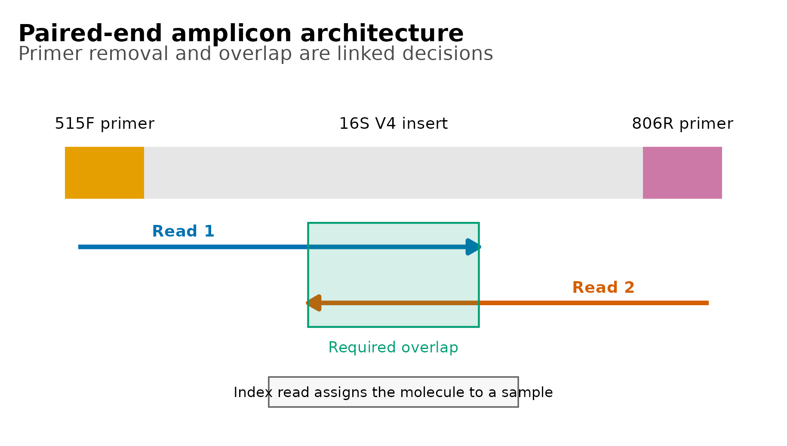
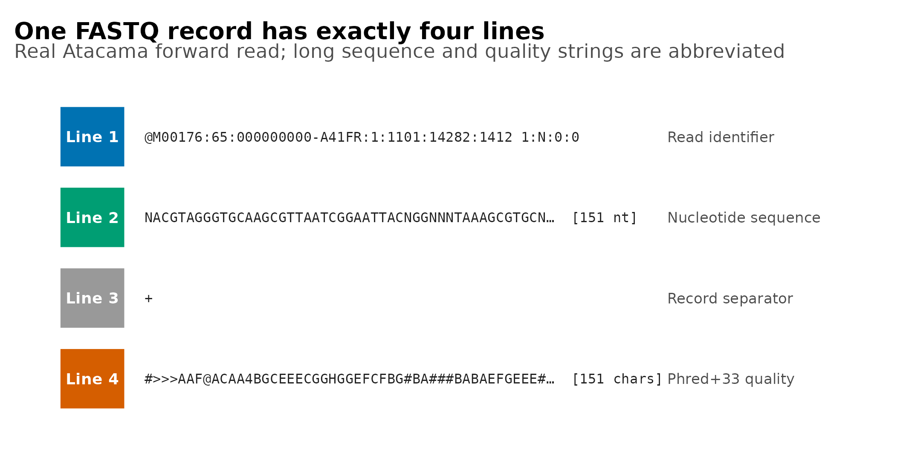
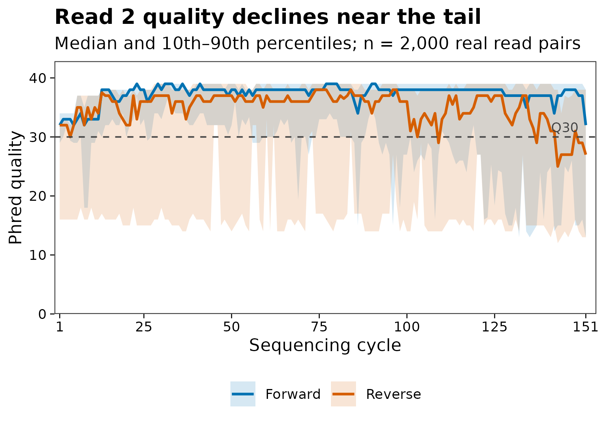
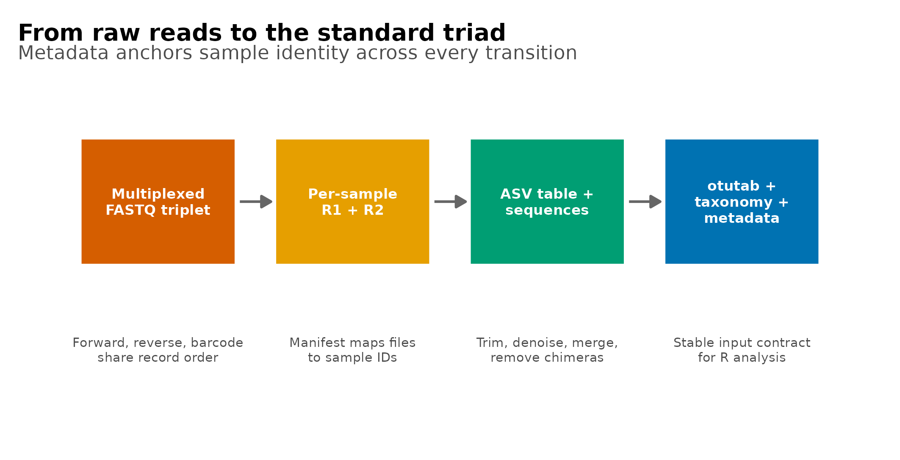

## 开始分析前，先认清 FASTQ 和样本表 {#sec-target}

论文通常不会把 FASTQ 四行结构当作结果图，但一篇可信的 16S 论文至少需要让读者从 Methods 或流程图中回答五个问题：

1. 测的是哪个扩增子区域，使用 single-end 还是 paired-end；
2. R1、R2 与 index read 如何产生，是否已经 demultiplex；
3. 原始 reads 的长度、质量编码与文件完整性是否正确；
4. primer、adapter 和低质量尾端在什么位置处理；
5. 原始 FASTQ 最终如何变成 feature table、代表序列、taxonomy 和 metadata。

本篇使用 QIIME 2 官方 Atacama soils paired-end 教程数据。原研究沿智利 Atacama Desert 的 Baquedano 与 Yungay 两条 transect 采集土壤，研究干旱增强对微生物群落的影响。官方 1% 数据包含 135,487 个同步的 forward、reverse 与 barcode record；这里从首尾完整覆盖的 1% 文件中等间距、保序抽取 2,000 组，既保留真实 read header 和质量分布，也让文章可以快速重复执行。


::: {.callout-important title="先确认交付类型，再写导入命令"}
`R1/R2` 两个文件不一定代表“两个样本”，也不一定已经按样本拆分。本篇数据采用 EMP multiplexed 格式：所有样本共用一份 `forward.fastq.gz`、一份 `reverse.fastq.gz` 和一份 `barcodes.fastq.gz`，三个文件依靠 **record 顺序**保持对应。若测序公司交付的是每个样本一对 FASTQ，则它们已经 demultiplex，导入方式完全不同。
:::

### 数据出处与固定校验值

| 文件 | 官方 2024.5 URL | SHA-256 |
|---|---|---|
| Forward 1% | `.../atacama-soils/1p/forward.fastq.gz` | `392f178b...88c2702` |
| Reverse 1% | `.../atacama-soils/1p/reverse.fastq.gz` | `54073703...86cfae` |
| Barcode 1% | `.../atacama-soils/1p/barcodes.fastq.gz` | `c07f517e...ff3c0f` |
| Metadata | `.../atacama-soils/sample_metadata.tsv` | `7cff810a...c5b3bd` |

完整 URL、完整校验值、2,000-record 摘录的生成规则和摘录文件校验值均保存在 `data/small/fastq/source_summary.json`。

## 下载并读取本次分析的数据 {#sec-setup}

需要 R，以及 `dplyr`、`ggplot2`、`knitr`、`scales`、`tidyr`。本次使用Atacama 土壤示例的 2,000 组同步 FASTQ records、barcode reads 与样本信息表。

在一个新建的文件夹中运行以下代码，下载文件后按文中的顺序继续分析：

```{r}
#| label: reader-download
#| results: hide
options(timeout = 600)
data_url <- "https://raw.githubusercontent.com/petemeng/microbiome-best-practices/3cb6a817e0c73ab7ecbec1cedc1ad80cbb9ecfaa/"
input_files <- c(
  "data/small/fastq/barcodes.fastq.gz",
  "data/small/fastq/forward.fastq.gz",
  "data/small/fastq/metadata.tsv",
  "data/small/fastq/reverse.fastq.gz",
  "data/small/fastq/source_summary.json"
)
for (path in input_files) {
  dir.create(dirname(path), recursive = TRUE, showWarnings = FALSE)
  if (!file.exists(path)) download.file(paste0(data_url, path), path, mode = "wb", quiet = TRUE)
}
```

```{r}
#| results: hold
#| label: reader-step-02
library(ggplot2)
library(dplyr)
library(tidyr)

stopifnot(
  identical(
    as.character(utils::packageVersion("ggplot2")),
    "3.5.2"
  ),
  identical(
    as.character(utils::packageVersion("dplyr")),
    "1.1.4"
  ),
  identical(
    as.character(utils::packageVersion("tidyr")),
    "1.3.1"
  ),
  identical(
    as.character(utils::packageVersion("jsonlite")),
    "1.8.8"
  ),
  identical(
    as.character(utils::packageVersion("digest")),
    "0.6.36"
  )
)

set.seed(20260719)

pal_pub <- c(
  "#0072B2", "#D55E00", "#009E73", "#CC79A7",
  "#E69F00", "#56B4E9", "#F0E442", "#999999"
)

scale_color_pub <- function(...) {
  ggplot2::scale_color_manual(values = pal_pub, ...)
}

scale_fill_pub <- function(...) {
  ggplot2::scale_fill_manual(values = pal_pub, ...)
}

theme_pub <- function(base_size = 12) {
  ggplot2::theme_bw(base_size = base_size, base_family = "sans") +
    ggplot2::theme(
      panel.grid = ggplot2::element_blank(),
      axis.text = ggplot2::element_text(color = "black"),
      axis.ticks = ggplot2::element_line(
        color = "black",
        linewidth = 0.3
      ),
      legend.key = ggplot2::element_blank(),
      legend.background = ggplot2::element_rect(
        fill = scales::alpha("white", 0.7),
        color = NA
      )
    )
}

save_pub <- function(
  plot,
  file_base,
  width = 120,
  height = 95,
  units = "mm",
  dpi = 300
) {
  dir.create(
    dirname(file_base),
    recursive = TRUE,
    showWarnings = FALSE
  )
  ggplot2::ggsave(
    paste0(file_base, ".pdf"),
    plot,
    width = width,
    height = height,
    units = units,
    device = grDevices::cairo_pdf
  )
  ggplot2::ggsave(
    paste0(file_base, ".png"),
    plot,
    width = width,
    height = height,
    units = units,
    dpi = dpi,
    bg = "white"
  )
  ggplot2::ggsave(
    paste0(file_base, ".tiff"),
    plot,
    width = width,
    height = height,
    units = units,
    dpi = dpi,
    compression = "lzw",
    bg = "white"
  )
}
```

### 选择输入并核对 SHA-256

默认读取随文章提供的真实摘录。若改用官方完整 1% 文件，只需把 `fastq_dir` 改为 `data/atacama-1p`。

```{r}
#| results: hold
#| label: reader-step-03
fastq_dir <- "data/small/fastq"

fastq_paths <- c(
  Forward = file.path(fastq_dir, "forward.fastq.gz"),
  Reverse = file.path(fastq_dir, "reverse.fastq.gz"),
  Barcode = file.path(fastq_dir, "barcodes.fastq.gz"),
  Metadata = file.path(fastq_dir, "metadata.tsv")
)

stopifnot(all(file.exists(fastq_paths)))

known_sha256 <- data.frame(
  File = names(fastq_paths),
  ExcerptSHA256 = c(
    "e6fabdbd31db519c719447f1caf2d1cd334c6ab932353e534ea2433ead88d254",
    "d2fa5841d150fead5a73067a267ec531221de11c512a38ec32ada03f1621bf65",
    "9cce1bb9a57975d14b54a5cf07c89b2b7c2095da4a8f0d1bd2720f1349e74057",
    "8d5342f0a80abf4197088bb1ce92f4903c1bd1212f6a9182e0e1c87ebc322bcb"
  ),
  Full1PercentSHA256 = c(
    "392f178b5f15967fafb9332c0493a8b6ecbf4a7857538023813a630c488c2702",
    "5407370313a3974e5b70878153841a61df408e49ced133b3ace44b2db286cfae",
    "c07f517e920d9e3924ce1e87102f057232b57041947523b90d560f68a0ff3c0f",
    "7cff810ad86a621ebc78a16b690255d839ea58e2622ad45a11a838d0f8c5b3bd"
  ),
  stringsAsFactors = FALSE
)

observed_sha256 <- vapply(
  fastq_paths,
  digest::digest,
  FUN.VALUE = character(1),
  algo = "sha256",
  serialize = FALSE,
  file = TRUE
)

known_sha256$ObservedSHA256 <- unname(observed_sha256)
known_sha256$SourceSet <- ifelse(
  known_sha256$ObservedSHA256 == known_sha256$ExcerptSHA256,
  "Bundled 2,000-record excerpt",
  ifelse(
    known_sha256$ObservedSHA256 ==
      known_sha256$Full1PercentSHA256,
    "Official 1% source",
    "Unknown"
  )
)

stopifnot(!any(known_sha256$SourceSet == "Unknown"))

knitr::kable(
  known_sha256[, c("File", "SourceSet", "ObservedSHA256")],
  caption = "Input identity audit"
)
```

这一关拦住的不是“下载失败”而是更危险的静默替换：同名文件被覆盖、下载不完整、上游版本变更或团队成员传错数据，都可能让后续分析在不报错的情况下变成另一批数据。

[下载完整 R 脚本](https://github.com/petemeng/microbiome-best-practices/blob/6c3ebab44401839f38b8d9356cb2f338ecfc9a3f/examples/06-data-and-fastq.R)。脚本包含数据下载、计算和图形导出。

<details class="wechat-omit">
<summary>首次使用时安装 R 包</summary>

```{r}
#| eval: false
install.packages(c(
  "ggplot2", "dplyr", "tidyr", "scales",
  "jsonlite", "digest", "knitr"
))
```

</details>

## 从荧光信号到四行文本 {#sec-theory}

### paired-end 测序得到的是两个方向的观测

Illumina sequencing by synthesis（边合成边测序）每个 cycle 延伸一个碱基并记录荧光信号。single-end 只从文库分子的一端读取；paired-end 先完成 Read 1，再经过 index read 和模板重建，从另一端得到 Read 2。一个文库分子因此对应：

- 一条 R1；
- 一条 R2；
- 一个或两个 index read，取决于建库方案。

“2 × 150 bp”表示每个分子得到 151 bp 左右的两个方向观测，不表示一个样本只有 300 bp 数据，也不表示 R1 与 R2 可以直接首尾拼接。扩增子分析还要先去除 primer，再把 R2 reverse-complement 后寻找足够的 overlap。

设去 primer 与截断后的有效长度为 \(L_F\) 和 \(L_R\)，扩增子长度为 \(L_A\)，理论 overlap 为：

$$
L_{\mathrm{overlap}} = L_F + L_R - L_A
$$

若 overlap 太短、两端在重叠区冲突太多，paired reads 就不能可靠合并。不能只看“尾端质量差不差”，还要同时保住扩增子几何关系。

### FASTQ 的一个 record 固定为四行

```text
@read_identifier optional_description
ACGT...                         # sequence
+
?IIG...                         # ASCII-encoded quality
```

四行分别是：

1. `@` 开头的 read identifier；
2. 碱基序列；
3. `+` 开头的分隔行；
4. 与序列等长的质量字符串。

最基本的合法性条件是：

$$
n_{\mathrm{lines}} \bmod 4 = 0
$$

并且每条 read 都满足：

$$
\operatorname{length}(\mathrm{sequence})
=
\operatorname{length}(\mathrm{quality})
$$

`.fastq.gz` 只是使用 gzip 压缩的 FASTQ。检查时应流式解压，不能把压缩文件的字节数当作 read 数。

### Phred 质量是错误概率的对数尺度

Phred score \(Q\) 与碱基判错概率 \(P_e\) 的关系为：

$$
Q = -10\log_{10}(P_e), \qquad
P_e = 10^{-Q/10}
$$

| Phred | 估计错误概率 | 直观解释 |
|---:|---:|---|
| Q20 | 1% | 约每 100 个 base 错 1 个 |
| Q30 | 0.1% | 约每 1,000 个 base 错 1 个 |
| Q40 | 0.01% | 约每 10,000 个 base 错 1 个 |

现代 Illumina FASTQ 通常使用 Phred+33：质量字符的 ASCII 整数减 33 得到 \(Q\)。例如 `?` 的 ASCII 值是 63，因此表示 Q30；`I` 的 ASCII 值是 73，因此表示 Q40。质量字符不是“越像乱码越差”，必须先解码。

<details>
<summary><strong>深入：为什么不能只报告平均 Q30</strong></summary>

平均 Q30 会把 cycle、方向和 read 之间的异质性压成一个数字。扩增子去噪真正需要的是：

- 每个 cycle 的质量分布；
- forward 与 reverse 分开观察；
- 碱基 `N` 的位置；
- read 长度是否一致；
- 保留足够 overlap 后的可截断区间。

如果 R2 从 cycle 120 后快速下降，整文件平均 Q30 仍可能很好看；但把 `trunc-len-r` 设在 150 可能造成错误率升高或合并失败。质量图用于提出截断候选值，最终参数还要用 DADA2 retention、merged reads 和 non-chimeric reads 验收。

</details>

### 区分尚未拆样与已经拆样的 FASTQ 文件

**Multiplexed EMP paired-end：**

```text
forward.fastq.gz
reverse.fastq.gz
barcodes.fastq.gz
sample_metadata.tsv  # sample ID ↔ barcode
```

三个 FASTQ 的第 \(i\) 个 record 必须属于同一文库分子。任何单独排序、过滤或截取都会破坏对应。

**Demultiplexed paired-end：**

```text
SampleA_R1.fastq.gz
SampleA_R2.fastq.gz
SampleB_R1.fastq.gz
SampleB_R2.fastq.gz
manifest.tsv
```

每个样本各有一对 FASTQ，manifest 明确 `sample-id`、绝对路径和方向。此时通常不再需要 barcode FASTQ，但必须检查 manifest 与文件名、方向、样本数是否一致。

### 常见文件不是彼此替代品

| 文件/对象 | 保存什么 | 是否含质量 | 典型阶段 |
|---|---|---:|---|
| FASTQ / FASTQ.GZ | reads + per-base quality | 是 | 原始测序、去噪前 |
| FASTA | 序列 | 否 | 代表序列、参考序列 |
| TSV/CSV manifest | sample 与文件路径 | 否 | 导入 demultiplexed FASTQ |
| QZA | QIIME 2 数据 + provenance | 视类型而定 | QIIME 2 中间/结果对象 |
| QZV | 可视化结果 + provenance | 不适用 | QIIME 2 报告 |
| BIOM | feature count table | 否 | ASV/OTU 计数 |
| `otutab.tsv` | feature × sample 计数 | 否 | R 下游标准输入 |
| `taxonomy.tsv` | feature × taxonomic ranks | 否 | R 下游标准输入 |
| `metadata.tsv` | sample × covariates | 否 | 全流程设计信息 |

原始 FASTQ 阶段还没有 `otutab` 和 `taxonomy`。它们必须通过 demultiplex、primer trimming、denoising、chimera removal 与 taxonomic classification 产生；metadata 则应从实验设计开始就存在，并贯穿所有步骤。

## 读取FASTQ并检查双端与barcode对应关系 {#sec-code}

### 不依赖专用包读取并验证 FASTQ

下面的函数只使用 base R，完整检查四行结构、header、separator 与 sequence/quality 等长条件。

```{r}
#| results: hold
#| label: reader-step-04
read_fastq <- function(path) {
  connection <- gzfile(path, open = "rt")
  on.exit(close(connection), add = TRUE)
  lines <- readLines(
    connection,
    warn = FALSE,
    encoding = "bytes"
  )

  if (length(lines) %% 4 != 0) {
    stop(
      basename(path),
      " does not contain a multiple of four lines"
    )
  }

  records <- matrix(
    lines,
    ncol = 4,
    byrow = TRUE,
    dimnames = list(
      NULL,
      c("Header", "Sequence", "Separator", "Quality")
    )
  )
  records <- as.data.frame(
    records,
    stringsAsFactors = FALSE
  )

  if (!all(startsWith(records$Header, "@"))) {
    stop(basename(path), " contains an invalid header")
  }
  if (!all(startsWith(records$Separator, "+"))) {
    stop(basename(path), " contains an invalid separator")
  }
  if (!all(
    nchar(records$Sequence, type = "bytes") ==
      nchar(records$Quality, type = "bytes")
  )) {
    stop(
      basename(path),
      " contains unequal sequence and quality lengths"
    )
  }

  records$ReadID <- sub(
    "^@([^ ]+).*$",
    "\\1",
    records$Header
  )
  records$Mate <- sub(
    "^@[^ ]+ ([12]):.*$",
    "\\1",
    records$Header
  )
  records
}

forward <- read_fastq(fastq_paths[["Forward"]])
reverse <- read_fastq(fastq_paths[["Reverse"]])
barcodes <- read_fastq(fastq_paths[["Barcode"]])

stopifnot(
  nrow(forward) == nrow(reverse),
  nrow(forward) == nrow(barcodes),
  identical(forward$ReadID, reverse$ReadID),
  identical(forward$ReadID, barcodes$ReadID),
  all(forward$Mate == "1"),
  all(reverse$Mate == "2")
)
```

当前输入包含 `r format(nrow(forward), big.mark = ",")` 组完全同步的 records。下面不是虚构例子，而是文件中的第一条真实 forward read：

```{r}
#| results: hold
#| label: reader-step-05
record_example <- data.frame(
  Line = 1:4,
  Field = c(
    "Header", "Sequence",
    "Separator", "Quality"
  ),
  Value = unname(unlist(
    forward[1, c(
      "Header", "Sequence",
      "Separator", "Quality"
    )]
  )),
  stringsAsFactors = FALSE
)

record_example$Length <- nchar(
  record_example$Value,
  type = "bytes"
)

knitr::kable(
  transform(
    record_example,
    Value = ifelse(
      nchar(Value) > 72,
      paste0(substr(Value, 1, 69), "..."),
      ifelse(
        startsWith(Value, "@"),
        paste0("\\", Value),
        Value
      )
    )
  ),
  caption = "First real FASTQ record"
)
```

### 读 metadata，确认 barcode 与实验设计

QIIME 2 metadata 的第二行是类型声明 `#q2:types`，不是一个样本。读取时保留表头、跳过这一行：

```{r}
#| results: hold
#| label: reader-step-06
read_q2_metadata <- function(path) {
  lines <- readLines(path, warn = FALSE)
  stopifnot(
    length(lines) >= 3,
    startsWith(lines[2], "#q2:types")
  )
  connection <- textConnection(
    c(lines[1], lines[-c(1, 2)])
  )
  on.exit(close(connection), add = TRUE)
  read.delim(
    connection,
    check.names = FALSE,
    stringsAsFactors = FALSE,
    quote = ""
  )
}

metadata <- read_q2_metadata(
  fastq_paths[["Metadata"]]
)

metadata_summary <- metadata |>
  count(
    Transect = .data[["transect-name"]],
    name = "Samples"
  ) |>
  arrange(Transect)

stopifnot(
  nrow(metadata) == 75,
  n_distinct(metadata[["sample-id"]]) == 75,
  n_distinct(metadata[["barcode-sequence"]]) == 75,
  all(nchar(metadata[["barcode-sequence"]]) == 12)
)

knitr::kable(
  head(metadata, 5),
  caption = "First five Atacama metadata rows"
)

knitr::kable(
  metadata_summary,
  caption = "Samples by transect"
)
```

metadata 共 75 个样本：Baquedano 32 个、Yungay 43 个。barcode 是 12 nt，并且在 metadata 内唯一。注意本数据的 barcode reads 与 metadata 中的 barcode 方向相反，因此 QIIME 2 demultiplex 时需要 `--p-rev-comp-mapping-barcodes`；这个选项来自实际建库方向，不能对所有项目机械照抄。

### 解码 Phred，按 cycle 审计 R1 与 R2

```{r}
#| results: hold
#| label: reader-step-07
decode_phred33 <- function(quality_string) {
  utf8ToInt(quality_string) - 33L
}

quality_matrix <- function(records) {
  lengths <- nchar(
    records$Quality,
    type = "bytes"
  )
  if (length(unique(lengths)) != 1) {
    stop("variable read lengths require padding before matrix conversion")
  }
  do.call(
    rbind,
    lapply(records$Quality, decode_phred33)
  )
}

summarize_cycles <- function(records, read_name) {
  quality <- quality_matrix(records)
  tibble(
    Read = read_name,
    Cycle = seq_len(ncol(quality)),
    Q10 = apply(
      quality,
      2,
      stats::quantile,
      probs = 0.10,
      names = FALSE,
      type = 8
    ),
    MedianQ = apply(
      quality,
      2,
      stats::median
    ),
    Q90 = apply(
      quality,
      2,
      stats::quantile,
      probs = 0.90,
      names = FALSE,
      type = 8
    ),
    Q30Fraction = colMeans(quality >= 30)
  )
}

summarize_file <- function(records, read_name) {
  quality <- quality_matrix(records)
  sequence_length <- nchar(
    records$Sequence,
    type = "bytes"
  )
  tibble(
    Read = read_name,
    Records = nrow(records),
    MinLength = min(sequence_length),
    MedianLength = stats::median(sequence_length),
    MaxLength = max(sequence_length),
    MedianReadMeanPhred = stats::median(
      rowMeans(quality)
    ),
    Q30BaseFraction = mean(quality >= 30),
    NBaseFraction = NA_real_
  )
}

cycle_summary <- bind_rows(
  summarize_cycles(forward, "Forward"),
  summarize_cycles(reverse, "Reverse")
)

file_summary <- bind_rows(
  summarize_file(forward, "Forward"),
  summarize_file(reverse, "Reverse"),
  summarize_file(barcodes, "Barcode")
)

# NBaseFraction 用明确的逐字符计数重算，避免零匹配的特殊值。
count_n <- function(records) {
  n_bases <- sum(
    vapply(
      strsplit(records$Sequence, "", fixed = TRUE),
      function(x) sum(x == "N"),
      integer(1)
    )
  )
  n_bases / sum(
    nchar(records$Sequence, type = "bytes")
  )
}

file_summary$NBaseFraction <- c(
  count_n(forward),
  count_n(reverse),
  count_n(barcodes)
)

knitr::kable(
  transform(
    file_summary,
    MedianReadMeanPhred = round(
      MedianReadMeanPhred,
      2
    ),
    Q30BaseFraction = scales::percent(
      Q30BaseFraction,
      accuracy = 0.1
    ),
    NBaseFraction = scales::percent(
      NBaseFraction,
      accuracy = 0.01
    )
  ),
  caption = "Read-level FASTQ audit"
)
```

在 2,000-record 摘录中，forward 与 reverse 都是 151 nt。forward 的 median read-mean Phred 为 `r sprintf("%.2f", file_summary$MedianReadMeanPhred[file_summary$Read == "Forward"])`，Q30 base 占 `r scales::percent(file_summary$Q30BaseFraction[file_summary$Read == "Forward"], accuracy = 0.1)`；reverse 分别为 `r sprintf("%.2f", file_summary$MedianReadMeanPhred[file_summary$Read == "Reverse"])` 和 `r scales::percent(file_summary$Q30BaseFraction[file_summary$Read == "Reverse"], accuracy = 0.1)`。因此 R2 的整体质量低于 R1，但截断位置仍应根据逐 cycle 分布和后续 merge retention 联合决定。

### 导出可审计结果表

```{r}
#| results: hold
#| label: reader-step-08
dir.create(
  "results/06-fastq",
  recursive = TRUE,
  showWarnings = FALSE
)

file_audit <- file_summary |>
  left_join(
    known_sha256[, c(
      "File", "ObservedSHA256",
      "SourceSet"
    )],
    by = c("Read" = "File")
  )

utils::write.table(
  file_audit,
  "results/06-fastq/fastq-file-audit.tsv",
  sep = "\t",
  quote = FALSE,
  row.names = FALSE
)
utils::write.table(
  cycle_summary,
  "results/06-fastq/quality-by-cycle.tsv",
  sep = "\t",
  quote = FALSE,
  row.names = FALSE
)
utils::write.table(
  record_example,
  "results/06-fastq/fastq-record-example.tsv",
  sep = "\t",
  quote = FALSE,
  row.names = FALSE
)
utils::write.table(
  metadata_summary,
  "results/06-fastq/metadata-summary.tsv",
  sep = "\t",
  quote = FALSE,
  row.names = FALSE
)
```

`fastq-file-audit.tsv` 保存文件级 read 数、长度、Phred、Q30、N 比例与 SHA-256；`quality-by-cycle.tsv` 是截断参数决策的机器可读证据；另外两张表分别保留真实四行 record 和 metadata 分组规模。

## 用结构图和质量曲线检查测序交付 {#sec-polish}

### 图 1：read architecture 只画能由实验流程支持的关系

```{r}
#| results: hold
#| label: reader-step-09
#| fig-show: hide
p_architecture <- ggplot() +
  annotate(
    "rect",
    xmin = 0, xmax = 12,
    ymin = 0.92, ymax = 1.18,
    fill = pal_pub[5]
  ) +
  annotate(
    "rect",
    xmin = 12, xmax = 88,
    ymin = 0.92, ymax = 1.18,
    fill = "#E6E6E6"
  ) +
  annotate(
    "rect",
    xmin = 88, xmax = 100,
    ymin = 0.92, ymax = 1.18,
    fill = pal_pub[4]
  ) +
  annotate(
    "segment",
    x = 2, xend = 63,
    y = 0.68, yend = 0.68,
    linewidth = 1.2,
    color = pal_pub[1],
    arrow = grid::arrow(
      length = grid::unit(2.5, "mm"),
      type = "closed"
    )
  ) +
  annotate(
    "segment",
    x = 98, xend = 37,
    y = 0.40, yend = 0.40,
    linewidth = 1.2,
    color = pal_pub[2],
    arrow = grid::arrow(
      length = grid::unit(2.5, "mm"),
      type = "closed"
    )
  ) +
  annotate(
    "rect",
    xmin = 37, xmax = 63,
    ymin = 0.28, ymax = 0.80,
    fill = scales::alpha(pal_pub[3], 0.16),
    color = pal_pub[3],
    linewidth = 0.5
  ) +
  annotate(
    "text",
    x = 6, y = 1.30,
    label = "515F primer",
    size = 3.2
  ) +
  annotate(
    "text",
    x = 50, y = 1.30,
    label = "16S V4 insert",
    size = 3.2
  ) +
  annotate(
    "text",
    x = 94, y = 1.30,
    label = "806R primer",
    size = 3.2
  ) +
  annotate(
    "text",
    x = 18, y = 0.76,
    label = "Read 1",
    color = pal_pub[1],
    fontface = "bold",
    size = 3.2
  ) +
  annotate(
    "text",
    x = 82, y = 0.48,
    label = "Read 2",
    color = pal_pub[2],
    fontface = "bold",
    size = 3.2
  ) +
  annotate(
    "text",
    x = 50, y = 0.18,
    label = "Required overlap",
    color = pal_pub[3],
    size = 3
  ) +
  annotate(
    "rect",
    xmin = 31, xmax = 69,
    ymin = -0.12, ymax = 0.03,
    fill = "#F7F7F7",
    color = "#666666",
    linewidth = 0.4
  ) +
  annotate(
    "text",
    x = 50, y = -0.045,
    label = "Index read assigns the molecule to a sample",
    size = 2.8
  ) +
  coord_cartesian(
    xlim = c(-2, 102),
    ylim = c(-0.18, 1.45),
    clip = "off"
  ) +
  labs(
    title = "Paired-end amplicon architecture",
    subtitle = "Primer removal and overlap are linked decisions"
  ) +
  theme_void(base_size = 11, base_family = "sans") +
  theme(
    plot.title = element_text(
      face = "bold",
      hjust = 0
    ),
    plot.subtitle = element_text(
      color = "#4D4D4D",
      margin = margin(b = 7)
    ),
    plot.margin = margin(8, 10, 6, 10)
  )

save_pub(
  p_architecture,
  "figures/06-read-architecture",
  width = 155,
  height = 88
)

p_architecture
```

{#fig-read-architecture}

这张图不声称所有项目都使用 515F/806R，也不把示意长度伪装成测量值。换引物区域时需要重画 primer、insert 和 overlap 的关系，并把实际 primer sequence 写进 Methods。

### 图 2：读懂一条真实 FASTQ 记录的四行结构

```{r}
#| results: hold
#| label: reader-step-10
#| fig-show: hide
anatomy <- record_example |>
  mutate(
    Display = case_when(
      Field == "Header" ~ substr(Value, 1, 53),
      Field == "Sequence" ~ paste0(
        substr(Value, 1, 48),
        "…  [151 nt]"
      ),
      Field == "Quality" ~ paste0(
        substr(Value, 1, 48),
        "…  [151 chars]"
      ),
      TRUE ~ Value
    ),
    Meaning = c(
      "Read identifier",
      "Nucleotide sequence",
      "Record separator",
      "Phred+33 quality"
    ),
    PlotRow = rev(Line)
  )

p_anatomy <- ggplot(anatomy) +
  geom_tile(
    aes(
      x = 0,
      y = PlotRow,
      fill = Field
    ),
    width = 0.48,
    height = 0.76,
    color = "white",
    linewidth = 0.5
  ) +
  geom_text(
    aes(
      x = 0,
      y = PlotRow,
      label = paste0("Line ", Line)
    ),
    color = "white",
    fontface = "bold",
    size = 3.1
  ) +
  geom_text(
    aes(
      x = 0.38,
      y = PlotRow,
      label = Display
    ),
    family = "mono",
    hjust = 0,
    size = 2.75,
    color = "#222222"
  ) +
  geom_text(
    aes(
      x = 4.20,
      y = PlotRow,
      label = Meaning
    ),
    hjust = 0,
    size = 2.9,
    color = "#4D4D4D"
  ) +
  scale_fill_manual(
    values = setNames(
      pal_pub[c(1, 3, 8, 2)],
      c(
        "Header", "Sequence",
        "Separator", "Quality"
      )
    ),
    guide = "none"
  ) +
  coord_cartesian(
    xlim = c(-0.28, 5.55),
    ylim = c(0.45, 4.55),
    clip = "off"
  ) +
  labs(
    title = "One FASTQ record has exactly four lines",
    subtitle = "Real Atacama forward read; long sequence and quality strings are abbreviated"
  ) +
  theme_void(base_size = 11, base_family = "sans") +
  theme(
    plot.title = element_text(face = "bold"),
    plot.subtitle = element_text(
      color = "#4D4D4D",
      margin = margin(b = 8)
    ),
    plot.margin = margin(7, 8, 7, 8)
  )

save_pub(
  p_anatomy,
  "figures/06-fastq-anatomy",
  width = 180,
  height = 90
)

p_anatomy
```

{#fig-fastq-anatomy}

### 图 3：逐 cycle 质量图显示分布，不只画均值

```{r}
#| results: hold
#| label: reader-step-11
#| fig-show: hide
p_quality <- ggplot(
  cycle_summary,
  aes(
    x = Cycle,
    y = MedianQ,
    color = Read,
    fill = Read
  )
) +
  geom_ribbon(
    aes(
      ymin = Q10,
      ymax = Q90
    ),
    alpha = 0.16,
    color = NA
  ) +
  geom_line(linewidth = 0.8) +
  geom_hline(
    yintercept = 30,
    linetype = 2,
    linewidth = 0.45,
    color = "#444444"
  ) +
  annotate(
    "text",
    x = 149,
    y = 30.8,
    label = "Q30",
    hjust = 1,
    vjust = 0,
    size = 3,
    color = "#444444"
  ) +
  scale_color_manual(
    values = c(
      Forward = pal_pub[1],
      Reverse = pal_pub[2]
    )
  ) +
  scale_fill_manual(
    values = c(
      Forward = pal_pub[1],
      Reverse = pal_pub[2]
    )
  ) +
  scale_x_continuous(
    breaks = c(1, 25, 50, 75, 100, 125, 151),
    expand = expansion(mult = c(0.01, 0.02))
  ) +
  scale_y_continuous(
    limits = c(0, 42),
    breaks = seq(0, 40, 10),
    expand = expansion(mult = c(0, 0.02))
  ) +
  labs(
    x = "Sequencing cycle",
    y = "Phred quality",
    color = NULL,
    fill = NULL,
    title = "Read 2 quality declines near the tail",
    subtitle = "Median and 10th–90th percentiles; n = 2,000 real read pairs"
  ) +
  theme_pub(base_size = 11) +
  theme(
    legend.position = "bottom",
    legend.direction = "horizontal",
    plot.title = element_text(face = "bold")
  )

save_pub(
  p_quality,
  "figures/06-quality-profile",
  width = 135,
  height = 95
)

p_quality
```

{#fig-quality-profile}

### 图 4：把 FASTQ 与三件套放在同一条 provenance 链上

```{r}
#| results: hold
#| label: reader-step-12
#| fig-show: hide
flow <- tibble(
  Step = 1:4,
  Stage = factor(
    c(
      "Raw", "Demultiplexed",
      "Denoised", "Analysis-ready"
    ),
    levels = c(
      "Raw", "Demultiplexed",
      "Denoised", "Analysis-ready"
    )
  ),
  Label = c(
    "Multiplexed\nFASTQ triplet",
    "Per-sample\nR1 + R2",
    "ASV table +\nsequences",
    "otutab +\ntaxonomy +\nmetadata"
  ),
  Detail = c(
    "Forward, reverse, barcode\nshare record order",
    "Manifest maps files\nto sample IDs",
    "Trim, denoise, merge,\nremove chimeras",
    "Stable input contract\nfor R analysis"
  )
)

p_contract <- ggplot(flow) +
  geom_segment(
    data = tibble(
      x = 1:3 + 0.42,
      xend = 2:4 - 0.42,
      y = 1,
      yend = 1
    ),
    aes(
      x = x,
      xend = xend,
      y = y,
      yend = yend
    ),
    linewidth = 0.7,
    color = "#666666",
    arrow = grid::arrow(
      type = "closed",
      length = grid::unit(2.2, "mm")
    )
  ) +
  geom_rect(
    aes(
      xmin = Step - 0.40,
      xmax = Step + 0.40,
      ymin = 0.82,
      ymax = 1.18,
      fill = Stage
    ),
    color = "white",
    linewidth = 0.7
  ) +
  geom_text(
    aes(
      x = Step,
      y = 1,
      label = Label
    ),
    color = "white",
    fontface = "bold",
    lineheight = 0.95,
    size = 2.8
  ) +
  geom_text(
    aes(
      x = Step,
      y = 0.58,
      label = Detail
    ),
    size = 2.6,
    color = "#4D4D4D",
    lineheight = 0.95
  ) +
  scale_fill_manual(
    values = setNames(
      pal_pub[c(2, 5, 3, 1)],
      levels(flow$Stage)
    ),
    guide = "none"
  ) +
  coord_cartesian(
    xlim = c(0.48, 4.52),
    ylim = c(0.34, 1.30),
    clip = "off"
  ) +
  labs(
    title = "From raw reads to the standard triad",
    subtitle = "Metadata anchors sample identity across every transition"
  ) +
  theme_void(base_size = 11, base_family = "sans") +
  theme(
    plot.title = element_text(face = "bold"),
    plot.subtitle = element_text(
      color = "#4D4D4D",
      margin = margin(b = 9)
    ),
    plot.margin = margin(8, 10, 5, 10)
  )

save_pub(
  p_contract,
  "figures/06-file-contract",
  width = 180,
  height = 92
)

p_contract
```

{#fig-file-contract}

::: {.callout-note title="这四张图各自回答什么"}
- `read architecture` 回答 primer、R1/R2 与 overlap 的几何关系；
- `FASTQ anatomy` 回答文件内部每一行是什么；
- `quality profile` 回答两个方向哪些 cycle 可能限制截断；
- `文件格式` 回答 FASTQ、QIIME 2 artifact 与 R 三件套如何衔接。
:::

## 常见坑 {#sec-pitfalls}

::: {.callout-caution title="审稿与复现中最常见的 FASTQ 问题"}
1. **把 read 与 read pair 混为一谈。**100 万 pairs 是 200 万 reads，但仍只代表 100 万个文库分子。
2. **把 R1/R2 当成两个样本。**它们是同一批分子的两个方向，样本身份由 demultiplex 或 manifest 决定。
3. **对 EMP 三个文件分别排序或过滤。**record 顺序一旦错位，barcode 会分配给错误分子。
4. **只用 `文件行数 ÷ 4`。**这只能给 record 数，不能证明 header、separator、等长和 R1/R2 ID 都正确。
5. **直接对 `.gz` 用普通 `wc -l`。**应先 `gzip -t`，再用 `zcat file.fastq.gz | wc -l` 或流式解析器。
6. **默认所有质量编码都是 Phred+33。**现代 Illumina 通常如此，但历史 Solexa/Illumina 文件可能不同；公共旧数据应查 archive metadata。
7. **只报平均 Q30。**去噪参数依赖 per-cycle、per-direction 质量和 overlap，不能被一个全局均值替代。
8. **把 adapter 与 locus-specific primer 混为一谈。**adapter contamination 和 PCR primer 都可能要去除，但序列、位置和工具参数不同。
9. **根据文件名猜方向。**`_1/_2`、`R1/R2` 是常见命名，不是可靠 provenance；应核对 sample sheet、header、manifest 和交付说明。
10. **认为文件能解压就完整。**gzip CRC 通过后仍需 SHA-256 或 archive checksum，以确认拿到的是预期版本。
11. **忽略 metadata 类型行。**QIIME 2 的 `#q2:types` 不是样本；把它读成样本会造成样本数和 barcode 审计错误。
12. **先截短再问能否合并。**truncation 同时改变错误率和 overlap；必须用 merged/non-chimeric retention 反向验收。
:::

::: {.callout-warning title="FASTQ 质量好不等于生物学设计好"}
高 Q30、无损 gzip、完全配对只能证明测序文件在技术上可读，不能补救病例/对照混杂、样本量不足、阴性对照缺失或 metadata 错误。文件 QC 与研究设计 QC 是两条都必须通过的证据链。
:::

## 报告测序数据与质量编码的方法与限制 {#sec-methods}

以下模板把可替换字段保留在方括号中：

> Amplicons targeting the [16S region] were sequenced on an Illumina [instrument] using a [2 × N]-bp paired-end configuration with [single/dual] indexing. Raw FASTQ files were verified by gzip integrity testing and SHA-256 checksums. FASTQ records were audited for four-line structure, equal sequence and quality-string lengths, synchronized forward/reverse read identifiers, and Phred+33 encoding. Per-cycle quality distributions were inspected separately for forward and reverse reads. Primer trimming and truncation parameters were selected jointly to remove primer sequences and low-quality tails while retaining at least [N] nt of expected overlap. Demultiplexing was performed using [barcode/manifest method], and sample identifiers were matched against the prespecified metadata table before denoising.

本篇真实数据的文件审计可写为：

> The QIIME 2 Atacama soils 1% paired-end data set comprised 135,487 synchronized forward, reverse, and 12-nt barcode records. File identities were fixed by SHA-256 checksums. A deterministic, order-preserving excerpt of 2,000 evenly spaced record triplets was used to render the tutorial diagnostics. Both sequence reads were 151 nt; per-cycle Phred distributions and the proportion of bases at Q30 or higher were evaluated separately by read direction. The excerpt was used only for file-format demonstration, whereas denoising parameters should be validated on the complete study data.

Methods 中不要只写“quality control was performed”。至少给出 read 类型、长度、质量编码、primer、截断/去引物规则、最低 overlap、demultiplex 方式和完整数据上的 retention。

## 将测序数据与质量编码用于自己的研究 {#sec-own-data}

### 先判定是哪种交付

| 你收到的文件 | 交付类型 | 下一步 |
|---|---|---|
| 全项目只有 forward/reverse/barcodes 三个 FASTQ | EMP multiplexed | 用 barcode metadata demultiplex |
| 每样本一对 R1/R2 FASTQ | Demultiplexed paired-end | 建 manifest 后导入 |
| 每样本一个 FASTQ | Demultiplexed single-end | 建 single-end manifest |
| BCL + sample sheet | 未完成 base calling/demultiplex | 先运行厂商转换流程或要求测序方交付 FASTQ |

### 只改路径即可复用本篇审计

```{r}
#| eval: false
fastq_dir <- "your_project/data/raw"
fastq_paths <- c(
  Forward = file.path(fastq_dir, "your_R1.fastq.gz"),
  Reverse = file.path(fastq_dir, "your_R2.fastq.gz"),
  Barcode = file.path(fastq_dir, "your_index.fastq.gz"),
  Metadata = "your_project/data/metadata.tsv"
)

forward <- read_fastq(fastq_paths[["Forward"]])
reverse <- read_fastq(fastq_paths[["Reverse"]])

stopifnot(
  nrow(forward) == nrow(reverse),
  identical(forward$ReadID, reverse$ReadID)
)

cycle_summary <- bind_rows(
  summarize_cycles(forward, "Forward"),
  summarize_cycles(reverse, "Reverse")
)
```

若已 demultiplex，没有独立 barcode FASTQ，则删除 barcode 相关代码，改为检查：

- manifest 中每个 sample 是否恰好有一个 forward 和一个 reverse；
- 文件路径是否存在且为绝对路径；
- metadata sample ID 是否与 manifest 一致；
- 每个样本内部 R1/R2 record 数和 read ID 是否一一对应。

### 原始 reads 之后仍要回到标准三件套

完成 demultiplex、primer trimming、DADA2/其他 ASV inference 与 taxonomy classification 后，导出：

```text
otutab.tsv      # rows = ASVs, columns = samples
taxonomy.tsv    # rows = the same ASVs, columns = taxonomic ranks
metadata.tsv    # rows = the same samples, columns = study variables
```

在进入 R 下游前做最后一次 ID 合同检查：

```{r}
#| eval: false
otutab <- read.delim(
  "otutab.tsv",
  row.names = 1,
  check.names = FALSE
)
taxonomy <- read.delim(
  "taxonomy.tsv",
  row.names = 1,
  check.names = FALSE
)
metadata <- read.delim(
  "metadata.tsv",
  row.names = 1,
  check.names = FALSE
)

stopifnot(
  identical(rownames(otutab), rownames(taxonomy)),
  setequal(colnames(otutab), rownames(metadata))
)
metadata <- metadata[colnames(otutab), , drop = FALSE]
```

FASTQ 是测序证据的起点，三件套是统计分析的入口；二者之间必须由可追踪的参数、日志和 artifact provenance 连接起来。

## 参考 {#sec-references}

1. Neilson JW, Califf K, Cardona C, et al. Significant impacts of increasing aridity on the arid soil microbiome. *mSystems*. 2017;2(3):e00195-16. [doi:10.1128/mSystems.00195-16](https://doi.org/10.1128/mSystems.00195-16)
2. QIIME 2. “Atacama soil microbiome” tutorial, archived 2024.10 documentation. [docs.qiime2.org/2024.10/tutorials/atacama-soils/](https://docs.qiime2.org/2024.10/tutorials/atacama-soils/)
3. Cock PJA, Fields CJ, Goto N, Heuer ML, Rice PM. The Sanger FASTQ file format for sequences with quality scores, and the Solexa/Illumina FASTQ variants. *Nucleic Acids Research*. 2010;38(6):1767–1771. [doi:10.1093/nar/gkp1137](https://doi.org/10.1093/nar/gkp1137)
4. Ewing B, Green P. Base-calling of automated sequencer traces using phred. II. Error probabilities. *Genome Research*. 1998;8(3):186–194. [doi:10.1101/gr.8.3.186](https://doi.org/10.1101/gr.8.3.186)
5. Bolyen E, Rideout JR, Dillon MR, et al. Reproducible, interactive, scalable and extensible microbiome data science using QIIME 2. *Nature Biotechnology*. 2019;37:852–857. [doi:10.1038/s41587-019-0209-9](https://doi.org/10.1038/s41587-019-0209-9)
6. Callahan BJ, McMurdie PJ, Rosen MJ, Han AW, Johnson AJA, Holmes SP. DADA2: high-resolution sample inference from Illumina amplicon data. *Nature Methods*. 2016;13:581–583. [doi:10.1038/nmeth.3869](https://doi.org/10.1038/nmeth.3869)
7. Illumina. What is a Single Read, Paired End reads, and read requirements for sequencing? Illumina Knowledge Article 9547.
