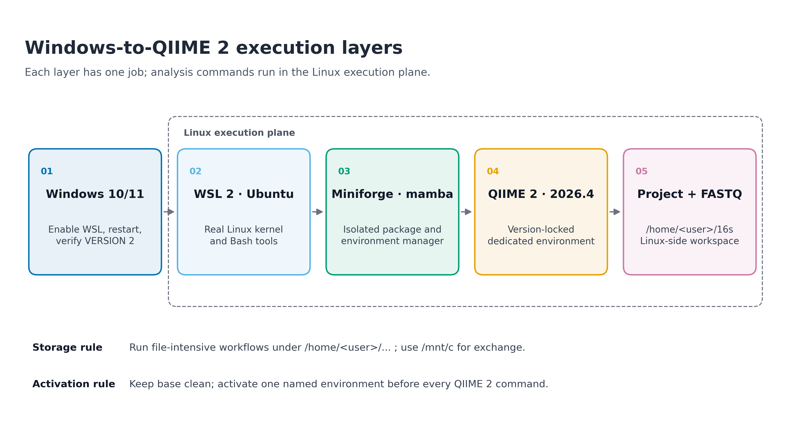
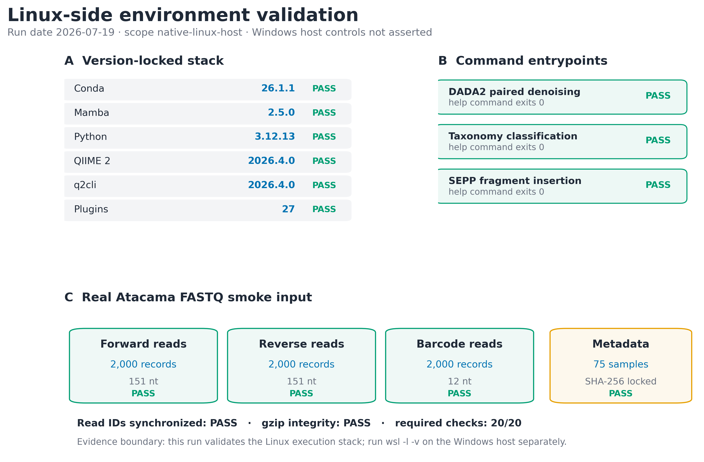

> **分析目标：**在 Windows 10/11 上建立可执行 Linux 生信软件的 WSL2 工作层，用 Miniforge 提供 `conda`/`mamba` 环境管理，并用版本、插件入口和真实 FASTQ 完整性检查证明环境确实可用。  
> **输入文件：**`env/qiime2.yml`，以及真实 Atacama 摘录 `data/small/fastq/`。  
> **预计资源：**WSL2 与 Miniforge 安装约 10–25 分钟；QIIME 2 2026.4 环境约占 5–8 GB，首次求解和下载通常需要 20–60 分钟；本篇验证约 30 秒、内存低于 500 MB。  
> **验证边界：**Windows 侧命令必须在读者自己的管理员 PowerShell 中执行；随文证据记录的是 Linux 执行层的真实服务器实测，不把 native Linux 主机冒充成 WSL2 主机。

## Windows 上怎样建立稳定的分析环境？ {#sec-target}

环境安装不是生物学结果，但它决定 Methods 中的命令能否被第三方重跑。对应到论文，最适合放在以下两个位置：

1. Methods 的 **Computational environment** 段，报告操作系统、环境管理器、软件 release 和环境文件；
2. Supplementary Methods 或代码仓库中的 **reproducibility workflow** 图，说明 Windows、WSL2、环境管理器、QIIME 2 与项目数据之间的层次。

{#fig-wsl2-layer-map}

{#fig-environment-validation}

::: {.callout-important title="先记住一句话"}
在 Windows 上做 16S 命令行分析时，**PowerShell 只用来安装和管理 WSL；`conda`、`mamba`、`qiime`、FASTQ 与项目代码都放到 Ubuntu/WSL2 终端里运行。**不要在 Windows Python、Anaconda Prompt 与 WSL 的 Linux 环境之间混装软件。
:::

### 为什么要保留“验证边界”

一次 `qiime info` 成功只能证明当前 Linux shell 中的 QIIME 2 可启动，不能自动证明：

- Windows 已启用虚拟化；
- Ubuntu 发行版运行在 WSL2 而不是 WSL1；
- 项目位于 Linux 文件系统而不是 `/mnt/c`；
- FASTQ 没有损坏；
- DADA2、分类器或 SEPP 的命令入口已经注册。

因此本篇把验证拆成两部分：

| 验证面 | 在哪里运行 | 成功标准 |
|---|---|---|
| Windows / WSL 控制面 | 管理员 PowerShell | `wsl -l -v` 的目标发行版 `VERSION` 为 `2` |
| Linux 执行面 | Ubuntu / WSL2 Bash | 版本、插件入口、环境文件和真实 FASTQ 检查全部通过 |

随文实测记录的 Linux 执行面为 `native-linux-host`，内核 `6.8.0-49-generic`、架构 `x86_64`。这与 WSL2 内需要满足的 Linux 软件合同相同，但不声称服务器运行在 Windows 上。

## 理论：WSL2、conda 与 mamba 各自解决什么问题 {#sec-theory}

### 1. WSL2 提供真正的 Linux 执行层

WSL（Windows Subsystem for Linux）允许 Windows 同时运行 Linux 发行版。WSL2 使用受管理的轻量虚拟机和真实 Linux kernel，提供完整 system-call compatibility；这正是许多只发布 Linux/macOS 构建的生信工具需要的运行条件。

可以把它理解为五层：

```text
Windows 10/11
└── WSL2
    └── Ubuntu Linux
        └── Miniforge / conda / mamba
            └── QIIME 2 environment + project + FASTQ
```

Windows 与 WSL2 仍然是两套文件系统、两套可执行文件和两套环境变量。下面两条命令即使名字相似，实际运行位置完全不同：

```powershell
# Windows PowerShell
wsl.exe --list --verbose
```

```bash
# Ubuntu / WSL2
uname -a
```

前者管理 WSL 发行版，后者查询 Linux 内核。不要在 PowerShell 中直接期待 `qiime`，也不要在 Ubuntu 中安装 Windows 版 Anaconda。

### 2. 文件放在哪里会影响 I/O

在 WSL 终端中：

- `/home/<user>/project` 位于 Linux 文件系统；
- `/mnt/c/Users/<user>/project` 是挂载进来的 Windows C 盘。

FASTQ 解压、DADA2 临时文件、feature table 和参考库都会产生大量小文件或频繁读写。Microsoft 的官方建议是：Linux 命令行处理的项目应存放在 WSL 的 Linux 文件系统中。因此本项目采用：

```text
/home/<user>/projects/microbiome-best-practices/
```

需要用 Windows 资源管理器查看时，在项目目录运行：

```bash
explorer.exe .
```

或在 Windows 地址栏访问：

```text
\\wsl$\Ubuntu\home\<user>\projects
```

`/mnt/c` 适合作为文件交换入口，不适合作为 I/O 密集分析的主工作目录。

### 3. conda 管环境，mamba 加速求解

`conda` 同时承担三件事：

1. 创建相互隔离的 environment；
2. 解析并安装软件及依赖；
3. 激活环境，修改当前 shell 的 `PATH`。

`mamba` 使用兼容 conda 的环境和包格式，并提供更快的依赖求解。两者不是两套互不相干的软件仓库；常见用法是：

```bash
mamba env create ...   # 创建或安装，求解更快
conda activate ...     # 激活环境，shell 集成成熟
qiime info             # 运行环境内的软件
```

环境隔离的关键不是“装了几个 conda”，而是让每个项目明确回答：

```text
当前激活哪个环境？
环境由哪个 YAML 创建？
YAML 的 SHA-256 是什么？
关键命令真的能启动吗？
```

### 4. `base` 不是分析环境

Miniforge 的 `base` 负责提供 `conda`/`mamba` 本身。把 QIIME 2、R、Python 数据科学包和其他流程全部装进 `base`，容易出现依赖被相互升级或降级、环境无法重建、命令来自错误路径等问题。

推荐命名包含软件和 release：

```text
microbiome-qiime2-2026.4
```

激活后检查：

```bash
echo "$CONDA_DEFAULT_ENV"
which python
which qiime
```

三条输出应指向同一个环境语境。只看到 shell 提示符前有括号还不够，`which` 才能揭示实际命令来源。

### 5. “安装成功”至少包含四层证据

| 层级 | 检查 | 能证明什么 |
|---|---|---|
| 控制面 | `wsl -l -v` | 发行版运行在 WSL2 |
| 环境面 | `conda env list`、YAML SHA-256 | 环境存在且来源固定 |
| 软件面 | `qiime info`、插件 `--help` | CLI 和关键插件入口可启动 |
| 数据面 | `gzip -t`、SHA-256、record 同步 | 真实输入能被无损读取 |

只有四层都通过，才值得继续投入数小时运行去噪或分类注释。

<details>
<summary><strong>深入：为什么一个环境文件还不等于完全可复现</strong></summary>

环境文件有不同强度：

- `conda env export --from-history` 只记录显式安装的顶层包，易读但不锁全部依赖；
- `conda env export` 会记录完整解析结果，但不同平台仍可能解析出差异；
- `conda list --explicit` 最接近平台特异的精确包 URL 锁；
- 软件自己的 artifact provenance、命令日志、输入校验值仍需另外保存。

本项目的 `env/qiime2.yml` 来自 QIIME 2 2026.4 Linux distribution，并固定完整包解析结果。它的 SHA-256 为：

```text
68b0e9b974937525b71cca3dec48b7dc5b6135f588a941d1313c118c2a41f4b5
```

环境文件仍不能证明机器支持相应架构、下载未中断或命令入口已注册，所以还要执行本篇的审计。

</details>

## 准备工作 {#sec-setup}

<details>
<summary><strong>展开：系统条件、随文真实数据与出版级函数</strong></summary>

### Windows 侧条件

- Windows 11，或 Windows 10 version 2004 / Build 19041 及以上；
- 管理员权限；
- BIOS/UEFI 虚拟化已启用；
- 至少预留 20 GB 可用空间，推荐 50 GB 以上；
- 网络可访问 Microsoft、GitHub、conda-forge 与 QIIME 2 package channel。

按 `Win + R`，输入 `winver` 查看 Windows 版本。

### Linux 侧随文输入

```text
env/qiime2.yml
data/small/fastq/forward.fastq.gz
data/small/fastq/reverse.fastq.gz
data/small/fastq/barcodes.fastq.gz
data/small/fastq/metadata.tsv
data/small/fastq/source_summary.json
```

FASTQ 来自 QIIME 2 Atacama soils 2024.5 paired-end 教程 1% 数据的确定性 2,000-record 摘录。每个文件的 SHA-256、抽取规则和官方来源保存在 `source_summary.json`。

### R 作图依赖与函数

环境章节的命令不依赖 R，但将审计表转换为论文补充图时使用以下函数。单独复制本文时直接保留这段：

```{r}
#| eval: false
install.packages(c(
  "ggplot2", "dplyr", "readr", "scales", "patchwork"
))
```

```{r}
#| eval: false
library(ggplot2)
library(dplyr)
library(readr)
library(scales)

set.seed(20260719)

pal_pub <- c(
  "#0072B2", "#D55E00", "#009E73", "#CC79A7",
  "#E69F00", "#56B4E9", "#F0E442", "#999999"
)

scale_color_pub <- function(...) {
  ggplot2::scale_color_manual(values = pal_pub, ...)
}

scale_fill_pub <- function(...) {
  ggplot2::scale_fill_manual(values = pal_pub, ...)
}

theme_pub <- function(base_size = 12) {
  ggplot2::theme_bw(base_size = base_size, base_family = "sans") +
    ggplot2::theme(
      panel.grid = ggplot2::element_blank(),
      axis.text = ggplot2::element_text(color = "black"),
      axis.ticks = ggplot2::element_line(
        color = "black", linewidth = 0.3
      ),
      plot.title.position = "plot",
      legend.key = ggplot2::element_blank(),
      legend.background = ggplot2::element_rect(
        fill = scales::alpha("white", 0.6),
        color = NA
      )
    )
}

save_pub <- function(
  plot,
  file_base,
  width = 180,
  height = 115,
  units = "mm",
  dpi = 300,
  write_tiff = TRUE
) {
  dir.create(dirname(file_base), recursive = TRUE, showWarnings = FALSE)
  ggplot2::ggsave(
    paste0(file_base, ".pdf"),
    plot,
    width = width,
    height = height,
    units = units,
    device = grDevices::cairo_pdf
  )
  ggplot2::ggsave(
    paste0(file_base, ".png"),
    plot,
    width = width,
    height = height,
    units = units,
    dpi = dpi,
    bg = "white"
  )
  if (isTRUE(write_tiff)) {
    ggplot2::ggsave(
      paste0(file_base, ".tiff"),
      plot,
      width = width,
      height = height,
      units = units,
      dpi = dpi,
      compression = "lzw",
      bg = "white"
    )
  }
  invisible(plot)
}
```

整仓库运行时可以改用 `source("R/theme_pub.R")`；单篇复制时使用上面的内联定义。

</details>

## 可复制代码 {#sec-code}

### 步骤 1：在管理员 PowerShell 安装 WSL2

关闭 Ubuntu、Anaconda Prompt 与普通 PowerShell。右键 PowerShell，选择 **Run as administrator**：

```powershell
wsl.exe --install
```

命令完成后重启 Windows。首次打开 Ubuntu 时，根据提示创建 Linux 用户名与密码。Linux 密码输入时终端不会显示星号，这是正常行为。

若 `wsl --install` 只显示帮助，先查看可用发行版：

```powershell
wsl.exe --list --online
wsl.exe --install -d Ubuntu
```

安装后更新 WSL，并确认发行版版本：

```powershell
wsl.exe --update
wsl.exe --status
wsl.exe --list --verbose
```

目标输出的最后一列必须为 `2`，例如：

```text
  NAME      STATE           VERSION
* Ubuntu    Running         2
```

如果目标发行版仍为 WSL1：

```powershell
wsl.exe --set-default-version 2
wsl.exe --set-version Ubuntu 2
wsl.exe --list --verbose
```

发行版名称必须与 `wsl -l -v` 完全一致；若显示 `Ubuntu-24.04`，就不能写成 `Ubuntu`。

::: {.callout-note title="PowerShell 到此为止"}
看到 `VERSION 2` 后，后续命令切换到 **Ubuntu 终端**。`sudo apt`、`bash`、`conda`、`mamba` 和 `qiime` 都不在管理员 PowerShell 中运行。
:::

### 步骤 2：在 Ubuntu 检查 Linux 层

打开 Ubuntu：

```{bash}
#| eval: false
uname -srmo
cat /etc/os-release
id
df -h /
```

确认：

- `uname` 显示 Linux；
- 当前用户不是 `root`；
- 根文件系统有足够空间；
- `HOME` 指向 `/home/<user>`。

```{bash}
#| eval: false
printf 'USER=%s\nHOME=%s\nPWD=%s\n' "$USER" "$HOME" "$PWD"
```

更新基础工具：

```{bash}
#| eval: false
sudo apt-get update
sudo apt-get install -y \
  ca-certificates curl wget git \
  build-essential gzip bzip2 unzip
```

### 步骤 3：把项目放进 Linux 文件系统

```{bash}
#| eval: false
mkdir -p "$HOME/projects"
cd "$HOME/projects"

# 克隆仓库时替换为你的实际 URL
git clone <YOUR_REPOSITORY_URL> microbiome-best-practices
cd microbiome-best-practices

pwd
```

`pwd` 应以 `/home/` 开头。若显示 `/mnt/c/Users/...`，把项目复制到 Linux 侧：

```{bash}
#| eval: false
mkdir -p "$HOME/projects/microbiome-best-practices"
rsync -a \
  /mnt/c/Users/<WINDOWS_USER>/microbiome-best-practices/ \
  "$HOME/projects/microbiome-best-practices/"

cd "$HOME/projects/microbiome-best-practices"
```

不要把尖括号原样执行；替换 `<WINDOWS_USER>` 与仓库 URL。

### 步骤 4：安装版本固定的 Miniforge

这里使用 `Miniforge3 26.3.2-2` 的 Linux x86_64 安装器。先确认架构：

```{bash}
#| eval: false
uname -m
```

若输出 `x86_64`：

```{bash}
#| eval: false
cd "$HOME"

MINIFORGE_VERSION="26.3.2-2"
INSTALLER="Miniforge3-${MINIFORGE_VERSION}-Linux-x86_64.sh"
INSTALLER_URL="https://github.com/conda-forge/miniforge/releases/download/${MINIFORGE_VERSION}/${INSTALLER}"
INSTALLER_SHA256="42260ffe3830fb953d5eee1bbb32229ff06aa7c3833c1ed7a9a0420a95685d94"

curl -fL \
  "$INSTALLER_URL" \
  -o "$INSTALLER"

printf '%s  %s\n' \
  "$INSTALLER_SHA256" \
  "$INSTALLER" |
  sha256sum -c -

bash "$INSTALLER" \
  -b \
  -p "$HOME/miniforge3"
```

`sha256sum` 必须输出：

```text
Miniforge3-26.3.2-2-Linux-x86_64.sh: OK
```

载入 shell 集成：

```{bash}
#| eval: false
source "$HOME/miniforge3/etc/profile.d/conda.sh"
source "$HOME/miniforge3/etc/profile.d/mamba.sh"

conda init bash
exec bash
```

新 shell 中验证：

```{bash}
#| eval: false
conda --version
mamba --version
conda info --base
conda config --show channels
conda config --show-sources
```

Miniforge 应以 `conda-forge` 为主要 channel。若配置中混入 `defaults`，先查清它来自哪个 `.condarc`，不要在不理解来源时盲目叠加 channel。

::: {.callout-warning title="不要把分析软件装进 base"}
`base` 只保留环境管理器。不要执行 `mamba install -n base qiime2`，也不要在 `base` 中长期安装互相冲突的 R、Python 和生信工具。
:::

### 步骤 5：先做一个最小环境冒烟测试

```{bash}
#| eval: false
mamba create \
  -n 16s-platform-smoke \
  -c conda-forge \
  python=3.12 \
  -y

conda activate 16s-platform-smoke

python - <<'PY'
import platform
import sys

print("python:", sys.version.split()[0])
print("platform:", platform.platform())
print("architecture:", platform.machine())
assert sys.version_info[:2] == (3, 12)
assert platform.system() == "Linux"
PY

conda deactivate
```

这一步只验证 WSL2 与环境管理器的基本合同，不代表 QIIME 2 已经安装。

### 步骤 6：从锁定 YAML 创建 QIIME 2 环境

回到项目目录：

```{bash}
#| eval: false
cd "$HOME/projects/microbiome-best-practices"

sha256sum env/qiime2.yml
```

应得到：

```text
68b0e9b974937525b71cca3dec48b7dc5b6135f588a941d1313c118c2a41f4b5  env/qiime2.yml
```

创建独立环境：

```{bash}
#| eval: false
mamba env create \
  -n microbiome-qiime2-2026.4 \
  -f env/qiime2.yml \
  --channel-priority flexible
```

该固定 manifest 在实测时安装了 676 个包。上游 `deblur 1.1.1` 与 `sortmerna 2.0` 在 strict channel priority 下发生求解冲突；对同一官方 manifest 使用 flexible priority 后成功完成。因此这里把 `--channel-priority flexible` 写入真实创建命令，而不是事后隐藏求解条件。

安装过程中不要关闭终端。完成后：

```{bash}
#| eval: false
conda activate microbiome-qiime2-2026.4

echo "$CONDA_DEFAULT_ENV"
which python
which qiime
qiime info
```

实测核心输出为：

```text
Python version: 3.12.13
QIIME 2 release: 2026.4
QIIME 2 version: 2026.4.0
q2cli version: 2026.4.0
Installed plugins: 27
```

`qiime info` 列出的 27 个插件包括 `cutadapt`、`dada2`、`demux`、`diversity`、`feature-classifier`、`feature-table`、`fragment-insertion`、`phylogeny`、`quality-control`、`taxa` 与 `vsearch`。

### 步骤 7：检查三个关键命令入口

```{bash}
#| eval: false
set -euo pipefail

qiime dada2 denoise-paired --help >/dev/null
printf 'DADA2 paired denoising\tPASS\n'

qiime feature-classifier classify-sklearn --help >/dev/null
printf 'Taxonomy classification\tPASS\n'

qiime fragment-insertion sepp --help >/dev/null
printf 'SEPP fragment insertion\tPASS\n'
```

实测三条命令 exit code 均为 `0`。这只能证明命令入口可用；分类器参考库、SEPP reference artifact 和完整 DADA2 参数仍需在相应分析步骤单独验证。

### 步骤 8：用真实 FASTQ 检查数据层

先核对固定 SHA-256：

```{bash}
#| eval: false
sha256sum \
  data/small/fastq/forward.fastq.gz \
  data/small/fastq/reverse.fastq.gz \
  data/small/fastq/barcodes.fastq.gz \
  data/small/fastq/metadata.tsv \
  data/small/fastq/source_summary.json
```

预期值：

```text
e6fabdbd31db519c719447f1caf2d1cd334c6ab932353e534ea2433ead88d254  forward.fastq.gz
d2fa5841d150fead5a73067a267ec531221de11c512a38ec32ada03f1621bf65  reverse.fastq.gz
9cce1bb9a57975d14b54a5cf07c89b2b7c2095da4a8f0d1bd2720f1349e74057  barcodes.fastq.gz
8d5342f0a80abf4197088bb1ce92f4903c1bd1212f6a9182e0e1c87ebc322bcb  metadata.tsv
daa3e140b0bf7e91c94392a48085da8e1e154920a0272eef93c15a26956e9983  source_summary.json
```

检查 gzip 流：

```{bash}
#| eval: false
gzip -t \
  data/small/fastq/forward.fastq.gz \
  data/small/fastq/reverse.fastq.gz \
  data/small/fastq/barcodes.fastq.gz

printf 'gzip integrity\tPASS\n'
```

下面的单篇内联检查器验证 FASTQ 四行结构、sequence/quality 等长、三个文件的 record 数和 read ID 顺序：

```{python}
#| eval: false
from __future__ import annotations

import csv
import gzip
import itertools
from pathlib import Path

root = Path("data/small/fastq")
paths = {
    "forward": root / "forward.fastq.gz",
    "reverse": root / "reverse.fastq.gz",
    "barcodes": root / "barcodes.fastq.gz",
}


def records(path):
    with gzip.open(path, "rt", encoding="ascii") as handle:
        number = 0
        while True:
            header = handle.readline()
            if not header:
                break
            sequence = handle.readline().rstrip("\r\n")
            separator = handle.readline().rstrip("\r\n")
            quality = handle.readline().rstrip("\r\n")
            number += 1

            assert header.startswith("@"), (path, number, "header")
            assert separator.startswith("+"), (path, number, "separator")
            assert len(sequence) == len(quality), (
                path, number, "sequence-quality length"
            )

            yield (
                header.split(maxsplit=1)[0].removeprefix("@"),
                len(sequence),
            )


counts = {key: 0 for key in paths}
lengths = {key: set() for key in paths}

streams = [
    records(paths[key])
    for key in ("forward", "reverse", "barcodes")
]

for triplet in itertools.zip_longest(*streams):
    assert all(item is not None for item in triplet)
    assert len({item[0] for item in triplet}) == 1

    for key, item in zip(
        ("forward", "reverse", "barcodes"),
        triplet,
    ):
        counts[key] += 1
        lengths[key].add(item[1])

assert counts == {
    "forward": 2000,
    "reverse": 2000,
    "barcodes": 2000,
}
assert lengths == {
    "forward": {151},
    "reverse": {151},
    "barcodes": {12},
}

with (root / "metadata.tsv").open(
    encoding="ascii",
    newline="",
) as handle:
    rows = csv.reader(handle, delimiter="\t")
    next(rows)
    metadata_samples = sum(
        bool(row) and not row[0].startswith("#")
        for row in rows
    )

assert metadata_samples == 75

print("records:", counts)
print("read lengths:", lengths)
print("read IDs synchronized: PASS")
print("metadata samples:", metadata_samples)
```

预期输出：

```text
records: {'forward': 2000, 'reverse': 2000, 'barcodes': 2000}
read lengths: {'forward': {151}, 'reverse': {151}, 'barcodes': {12}}
read IDs synchronized: PASS
metadata samples: 75
```

### 步骤 9：生成一份机器可读审计

整仓库用户可以运行已经固化的审计器：

```{bash}
#| eval: false
python3 scripts/validate_wsl2_conda.py \
  --project-root . \
  --output-dir results/07-wsl2-conda \
  --figure-dir figures
```

它生成：

```text
results/07-wsl2-conda/
├── environment-audit.tsv
├── entrypoint-audit.tsv
├── fastq-smoke.tsv
├── environment-summary.json
└── environment-validation.log

figures/
├── 07-wsl2-layer-map.pdf / .png / .tiff
└── 07-environment-validation.pdf / .png / .tiff
```

本次真实运行结果：

| 指标 | 观察值 | 状态 |
|---|---:|---|
| Execution scope | native-linux-host | recorded |
| Architecture | x86_64 | PASS |
| Conda | 26.1.1 | PASS |
| Mamba | 2.5.0 | PASS |
| QIIME 2 | 2026.4.0 | PASS |
| q2cli | 2026.4.0 | PASS |
| Registered plugins | 27 | PASS |
| Entrypoint checks | 3 / 3 | PASS |
| FASTQ records | 2,000 × 3 | PASS |
| Synchronized read IDs | true | PASS |
| Metadata samples | 75 | PASS |
| Required checks | 20 / 20 | PASS |

### 步骤 10：记录环境，而不是只依赖终端历史

```{bash}
#| eval: false
mkdir -p env/audit

conda env export \
  -n microbiome-qiime2-2026.4 \
  > env/audit/qiime2-2026.4-complete.yml

conda env export \
  -n microbiome-qiime2-2026.4 \
  --from-history \
  > env/audit/qiime2-2026.4-history.yml

conda list \
  -n microbiome-qiime2-2026.4 \
  --explicit \
  > env/audit/qiime2-2026.4-linux-64-explicit.txt

qiime info \
  > env/audit/qiime-info.txt

sha256sum \
  env/qiime2.yml \
  env/audit/* \
  > env/audit/SHA256SUMS
```

三类文件分别服务可读性、平台精确重建和执行证据。提交前检查是否意外包含本机私有路径或凭据；环境文件不应保存 token、密码或云密钥。

## 出版级美化 {#sec-publication}

### 1. 图里展示“通过了什么”，不要粘整页终端

终端截图常见问题是字体太小、路径泄露、颜色依赖主题、难以检索。更好的补充图做法是：

- 用流程图展示层次与职责；
- 用短表展示 observed / expected / status；
- 完整原始 log 作为文本文件归档；
- 图内只保留英文；
- 明确 evidence boundary。

本篇两张图分别回答：

1. 软件从 Windows 到项目数据如何分层；
2. 真实审计中哪些检查实际通过。

### 2. 从审计表画出可投稿的检查图

若只复制本文而没有整仓库脚本，可先把检查结果保存为 `environment-audit.tsv`，再用下面的 R 代码画简洁的 validation matrix：

```{r}
#| eval: false
audit <- readr::read_tsv(
  "results/07-wsl2-conda/environment-audit.tsv",
  show_col_types = FALSE
) |>
  dplyr::filter(required) |>
  dplyr::mutate(
    check = factor(check, levels = rev(check)),
    status = factor(status, levels = c("PASS", "FAIL"))
  )

p_validation <- ggplot(
  audit,
  aes(x = 1, y = check, fill = status)
) +
  geom_tile(
    width = 0.9,
    height = 0.78,
    color = "white",
    linewidth = 1
  ) +
  geom_text(
    aes(label = paste(observed, status, sep = "  ·  ")),
    color = "white",
    fontface = "bold",
    size = 3.5
  ) +
  scale_fill_manual(
    values = c(PASS = "#009E73", FAIL = "#D55E00")
  ) +
  scale_x_continuous(expand = expansion(mult = c(0.05, 0.05))) +
  labs(
    title = "Linux-side environment audit",
    subtitle = "Observed value and contract status",
    x = NULL,
    y = NULL,
    fill = "Status"
  ) +
  theme_pub(11) +
  theme(
    axis.text.x = element_blank(),
    axis.ticks.x = element_blank(),
    legend.position = "top"
  )

save_pub(
  p_validation,
  "figures/07-environment-audit-matrix",
  width = 150,
  height = 120
)
```

### 3. 图注要写清楚验证范围

推荐图注：

> **Linux-side computational environment validation.** The locked QIIME 2 2026.4 environment, 27 registered plugins, three required command entrypoints, and synchronized Atacama FASTQ smoke inputs passed all predefined checks. Windows-side WSL controls were evaluated separately on the analysis workstation.

最后一句只有在你确实保存了 `wsl -l -v` 证据时才能使用。若是在 native Linux 服务器运行，改为：

> Windows-side WSL controls were outside the scope of the server-side validation.

## 常见坑 {#sec-pitfalls}

::: {.callout-caution title="坑 1：目标发行版仍然是 WSL1"}
**症状：**部分 Linux 工具异常，或照着文档操作仍不一致。  
**检查：**管理员 PowerShell 运行 `wsl -l -v`。  
**处理：**对准确的发行版名称运行 `wsl --set-version <Distro> 2`。只运行 `wsl --set-default-version 2` 不会自动转换已经存在的 WSL1 发行版。
:::

::: {.callout-caution title="坑 2：在 PowerShell 安装 Linux 版 conda"}
**症状：**`bash Miniforge3-Linux-x86_64.sh` 无法执行，或 `qiime` 安装到 Windows Python。  
**处理：**PowerShell 只管理 WSL；Linux `.sh` 安装器必须在 Ubuntu 终端运行。
:::

::: {.callout-caution title="坑 3：项目位于 /mnt/c"}
**症状：**解压、建索引、读大量小文件明显变慢，权限或大小写行为混乱。  
**检查：**`pwd`。  
**处理：**把项目移动到 `/home/<user>/projects/`，需要查看时用 `explorer.exe .`。
:::

::: {.callout-caution title="坑 4：conda: command not found"}
安装后当前 shell 还没加载初始化脚本：

```{bash}
#| eval: false
source "$HOME/miniforge3/etc/profile.d/conda.sh"
source "$HOME/miniforge3/etc/profile.d/mamba.sh"
conda init bash
exec bash
```

若 Miniforge 安装在其他路径，把 `$HOME/miniforge3` 改成真实路径。
:::

::: {.callout-caution title="坑 5：qiime: command not found"}
先检查环境：

```{bash}
#| eval: false
conda env list
conda activate microbiome-qiime2-2026.4
echo "$CONDA_DEFAULT_ENV"
which qiime
qiime info
```

不要用 `pip install qiime2` 临时补救；这会绕开 distribution 的插件与依赖合同。
:::

::: {.callout-caution title="坑 6：把所有包都装进 base"}
**症状：**更新一个工具后另一个工具消失，`conda` 自身也开始报依赖错误。  
**处理：**保留干净 base，为每个软件 release 建命名环境。环境坏了优先从 YAML 重建，不在旧环境中无休止手工修补。
:::

::: {.callout-caution title="坑 7：strict channel priority 无解"}
先保存完整 solver 报错和所用 manifest。若官方固定 manifest 在 strict 模式下发生已知依赖冲突，可像本次实测一样对同一文件使用：

```{bash}
#| eval: false
mamba env create \
  -n microbiome-qiime2-2026.4 \
  -f env/qiime2.yml \
  --channel-priority flexible
```

不要通过随意删除包、改 release 或混入更多 channel 来“让它装上”，否则环境已不再对应声明版本。
:::

::: {.callout-caution title="坑 8：脚本出现 $'\\r': command not found"}
这是 Windows CRLF 行尾进入 Linux shell 的典型表现：

```{bash}
#| eval: false
sudo apt-get install -y dos2unix
dos2unix scripts/your-script.sh
```

Git 仓库还应统一文本行尾，避免 shell 脚本反复被改回 CRLF。
:::

::: {.callout-caution title="坑 9：WSL 磁盘突然耗尽"}
先检查：

```{bash}
#| eval: false
df -h /
du -sh "$HOME"/miniforge3/envs/*
conda clean --dry-run --all
```

确认清理范围后再运行真正的清理命令。FASTQ、缓存、参考库和环境都可能占数十 GB；不要在不知道内容时直接删除整个 conda package cache。
:::

::: {.callout-caution title="坑 10：只保存成功截图，不保存失败日志"}
依赖求解失败、网络错误和插件入口缺失都具有诊断价值。至少保存命令、exit code、stdout/stderr、日期、环境名和 manifest SHA-256。截图适合快速浏览，文本 log 才适合审计与搜索。
:::

## 这段 Methods 怎么写 {#sec-methods}

### Windows + WSL2 版本

下面模板只有在你的 Windows 控制面和 Linux 执行面都实际验证后才能使用：

> Computational analyses were performed in Ubuntu under Windows Subsystem for Linux 2 (WSL2). Software dependencies were managed in an isolated conda environment created from a version-controlled YAML manifest using mamba. QIIME 2 release 2026.4 (QIIME 2 and q2cli version 2026.4.0; Python 3.12.13) was used for marker-gene processing. The environment manifest, command logs, and SHA-256 checksums of the validation inputs were archived with the analysis code. Project files were stored in the WSL Linux file system, and the QIIME 2 installation was verified using `qiime info` and plugin-specific command-entrypoint checks before data processing.

需要按实际情况替换：

- Ubuntu 发行版与版本；
- QIIME 2 release；
- Python 版本；
- 环境文件名和仓库地址；
- 是否确实使用 WSL Linux 文件系统；
- 是否保存了 SHA-256 和验证日志。

### Native Linux 服务器版本

若实际运行在 Linux 服务器，不要为了套模板写 WSL2：

> Computational analyses were performed on a native x86_64 Linux host. Software dependencies were managed in an isolated conda environment created from a version-controlled YAML manifest using mamba. QIIME 2 release 2026.4 (QIIME 2 and q2cli version 2026.4.0; Python 3.12.13) was used for marker-gene processing. The environment manifest, command logs, and SHA-256 checksums of validation inputs were archived with the analysis code. The installation was verified using `qiime info`, three plugin-specific command-entrypoint checks, and a synchronized real-FASTQ smoke test before full processing.

::: {.callout-warning title="Methods 不应写的内容"}
不要只写“QIIME 2 was used”或“analysis was conducted in conda”。缺少 release、环境文件、关键参数和输入 provenance 时，读者无法判断软件行为是否一致。
:::

## 换成你自己的数据怎么做 {#sec-own-data}

### 1. 保留平台合同，只替换项目目录与数据

推荐结构：

```text
~/projects/my-16s-study/
├── env/
│   └── qiime2.yml
├── data/
│   └── raw/
│       ├── SampleA_R1.fastq.gz
│       ├── SampleA_R2.fastq.gz
│       └── ...
├── metadata.tsv
├── scripts/
├── results/
└── logs/
```

在 Ubuntu/WSL2 中创建：

```{bash}
#| eval: false
mkdir -p \
  "$HOME/projects/my-16s-study/data/raw" \
  "$HOME/projects/my-16s-study/scripts" \
  "$HOME/projects/my-16s-study/results" \
  "$HOME/projects/my-16s-study/logs" \
  "$HOME/projects/my-16s-study/env"

cd "$HOME/projects/my-16s-study"
```

### 2. 对自己的 FASTQ 做最小完整性检查

```{bash}
#| eval: false
find data/raw \
  -maxdepth 1 \
  -type f \
  -name '*.fastq.gz' \
  -print0 |
  sort -z |
  xargs -0 gzip -t

find data/raw \
  -maxdepth 1 \
  -type f \
  -name '*.fastq.gz' \
  -print0 |
  sort -z |
  xargs -0 sha256sum \
  > data/raw/SHA256SUMS
```

对 demultiplexed paired-end 数据，还要核对：

- 每个 sample 是否恰好一份 R1 和一份 R2；
- sample ID 与 metadata 是否完全对应；
- 文件是否为空；
- R1/R2 record 数是否一致；
- 路径是否包含意外空格、换行或非预期扩展名。

### 3. 每次运行前打印环境指纹

```{bash}
#| eval: false
set -euo pipefail

conda activate microbiome-qiime2-2026.4

{
  date -Iseconds
  uname -srmo
  echo "environment=$CONDA_DEFAULT_ENV"
  sha256sum env/qiime2.yml
  qiime info
} \
  > logs/environment-$(date +%Y%m%d).log
```

### 4. 判定是否可以继续

| 检查 | 继续条件 |
|---|---|
| `wsl -l -v` | 目标发行版为 VERSION 2 |
| `pwd` | 项目在 `/home/...` |
| `conda activate` | 环境名正确 |
| `sha256sum env/qiime2.yml` | 与项目记录一致 |
| `qiime info` | release 与 Methods 一致 |
| 插件 `--help` | 所需入口 exit 0 |
| `gzip -t` | 全部 FASTQ 无报错 |
| R1/R2 配对 | sample 和 record 数一致 |

任一关键项失败时先停止，不要用完整数据“试试看”。越早发现环境与文件合同问题，浪费的计算时间越少。

## 参考 {#sec-references}

1. Microsoft. [How to install Linux on Windows with WSL](https://learn.microsoft.com/en-us/windows/wsl/install). Windows 10 version 2004 / Build 19041 及以上或 Windows 11 可使用 `wsl --install`；新安装默认使用 WSL2。
2. Microsoft. [Comparing WSL Versions](https://learn.microsoft.com/en-us/windows/wsl/compare-versions). WSL2 使用受管理虚拟机中的 Linux kernel，并提供完整 system-call compatibility。
3. Microsoft. [Working across Windows and Linux file systems](https://learn.microsoft.com/en-us/windows/wsl/filesystems). Linux 命令行工作负载建议将项目保存在 WSL Linux 文件系统。
4. QuantStack and mamba contributors. [Mamba Installation](https://mamba.readthedocs.io/en/stable/installation/mamba-installation.html). 官方建议从 Miniforge 安装，并避免向 `base` 环境安装分析软件。
5. conda-forge. [Miniforge release 26.3.2-2](https://github.com/conda-forge/miniforge/releases/tag/26.3.2-2). 本篇固定的 Linux x86_64 安装器与 SHA-256 来源。
6. QIIME 2. [QIIME 2 Library installation instructions](https://library.qiime2.org/quickstart/qiime2). 2026.4 Linux / Windows WSL2 distribution 的环境创建与 `qiime info` 验证入口。
7. Bolyen E, Rideout JR, Dillon MR, et al. Reproducible, interactive, scalable and extensible microbiome data science using QIIME 2. *Nature Biotechnology*. 2019;37:852–857. [doi:10.1038/s41587-019-0209-9](https://doi.org/10.1038/s41587-019-0209-9).
8. Neilson JW, Califf K, Cardona C, et al. Significant impacts of increasing aridity on the arid soil microbiome. *mSystems*. 2017;2(3):e00195-16. [doi:10.1128/mSystems.00195-16](https://doi.org/10.1128/mSystems.00195-16).
