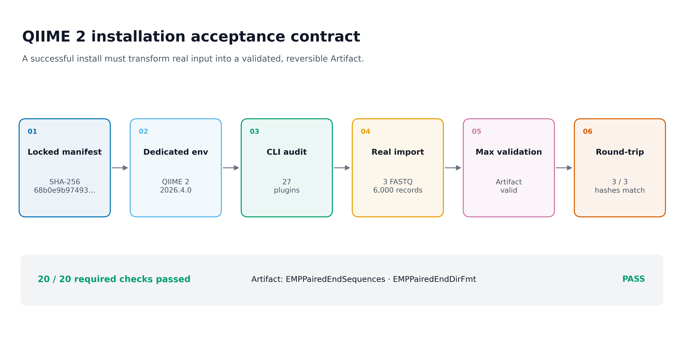
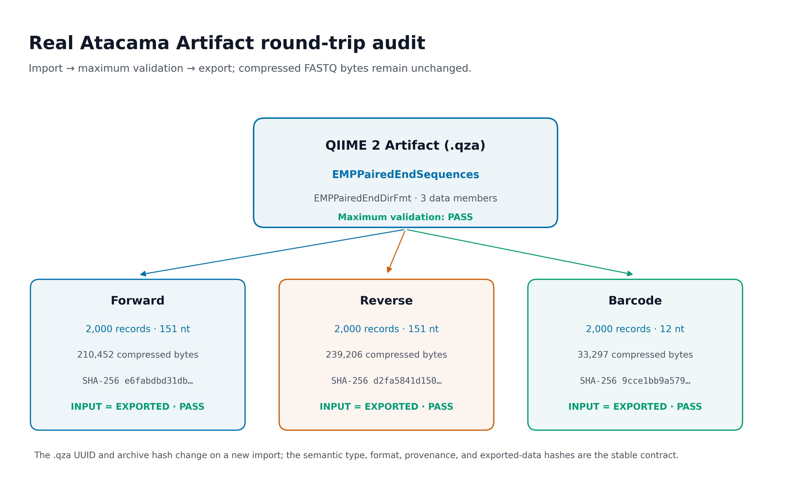
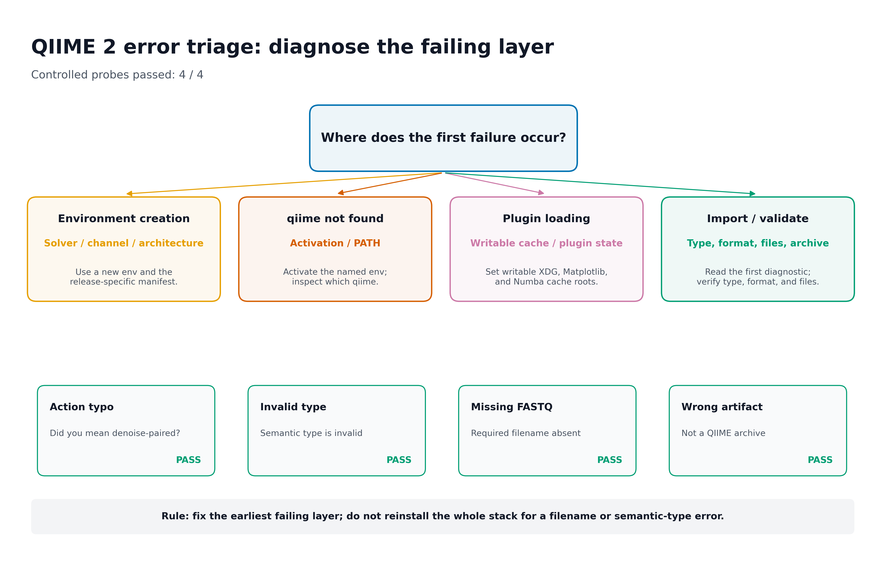

## 怎样确认 QIIME 2 真的安装正确？ {#sec-target}

安装过程通常不进入主文结果图，但它直接决定 Methods 与补充材料能否被第三方复现。最有用的呈现方式有三类：

1. **Computational environment** 流程图：从锁定 manifest 到真实数据验收；
2. **Artifact round-trip audit**：证明输入进入 QIIME 2 后类型正确、最大级别校验通过，并能无损导出；
3. **Troubleshooting decision tree**：按环境、激活、插件加载、type/format 与 archive 层定位故障。

{#fig-qiime2-install-contract}

{#fig-artifact-smoke-audit}

{#fig-error-triage}

::: {.callout-important title="先记住一句话"}
`qiime info` 成功只证明 CLI 能启动；**真正可接受的安装还必须让一组真实数据成功导入为正确 semantic type，经 `qiime tools validate --level max` 通过，再导出并与原始文件核对。**
:::

本次实测使用 QIIME 2 2026.4.0、q2cli 2026.4.0 与 Python 3.12.13，发现 27 个插件。真实 Atacama 摘录的三条同步 FASTQ 流各含 2,000 个 record；导入结果为：

```text
Type:        EMPPairedEndSequences
Data format: EMPPairedEndDirFmt
Validation:  PASS (level=max)
Round-trip:  3/3 exported FASTQ SHA-256 values match
```

预定义的 20 项安装、Artifact 与数据检查全部通过；四个受控失败探针也都返回了预期的非零 exit code 和诊断模式。

## 开始前：数据与运行环境 {#sec-setup}

在 Linux 或 WSL2 的项目文件夹中运行下面的下载命令。Windows 用户先完成下文的 WSL2 安装，再回到 Ubuntu 终端执行。下载后保留这里的相对目录，后续命令使用同一组文件。

```bash
base_url="https://raw.githubusercontent.com/petemeng/microbiome-best-practices/3cb6a817e0c73ab7ecbec1cedc1ad80cbb9ecfaa"
for file in \
  data/small/fastq/barcodes.fastq.gz \
  data/small/fastq/forward.fastq.gz \
  data/small/fastq/metadata.tsv \
  data/small/fastq/reverse.fastq.gz \
  data/small/fastq/source_summary.json \
  env/qiime2.yml \
  scripts/validate_qiime2_install.py
do
  mkdir -p "$(dirname "$file")"
  curl --fail --location --retry 3 "$base_url/$file" --output "$file" || break
done
```


<details>
<summary>本次分析的数据、环境与图形设置</summary>

### 系统条件

- Linux x86_64，或 Windows 10/11 中的 WSL2 Linux；
- 已安装并初始化 `conda`/`mamba`；
- 至少 10 GB 可用空间，推荐预留 20 GB；
- 项目目录与缓存目录对当前用户可写；
- 网络能访问 conda-forge、bioconda 与 QIIME 2 package channel；
- 不在 conda `base` 中安装分析 distribution。

检查：

```{bash}
#| eval: false
uname -srmo
uname -m
df -h .
conda --version
mamba --version
conda info --base
```

本篇 Linux/WSL2 环境文件为：

```text
env/qiime2.yml
```

固定 SHA-256：

```text
68b0e9b974937525b71cca3dec48b7dc5b6135f588a941d1313c118c2a41f4b5
```

### 随文真实输入

```text
data/small/fastq/
├── forward.fastq.gz
├── reverse.fastq.gz
├── barcodes.fastq.gz
├── metadata.tsv
└── source_summary.json
```

三份 FASTQ 是 QIIME 2 官方 Atacama soils paired-end 1% 数据的确定性 2,000-record 摘录，来自 Neilson 等人的干旱土壤研究。原始来源、完整 1% 文件校验值和摘录规则记录在 `source_summary.json`。

随文输入固定值：

| 文件 | Records | Read length | SHA-256 |
|---|---:|---:|---|
| `forward.fastq.gz` | 2,000 | 151 nt | `e6fabdbd31db…` |
| `reverse.fastq.gz` | 2,000 | 151 nt | `d2fa5841d150…` |
| `barcodes.fastq.gz` | 2,000 | 12 nt | `9cce1bb9a579…` |

### R 作图依赖与函数

QIIME 2 安装与 Artifact 检查在 shell 中完成。将审计表重绘为补充图时使用下面的 R 函数；复制文章时保留这段即可：

```{r}
#| eval: false
install.packages(c(
  "ggplot2", "dplyr", "readr", "scales", "patchwork"
))
```

```{r}
#| eval: false
library(ggplot2)
library(dplyr)
library(readr)
library(scales)

set.seed(20260719)

pal_pub <- c(
  "#0072B2", "#D55E00", "#009E73", "#CC79A7",
  "#E69F00", "#56B4E9", "#F0E442", "#999999"
)

scale_color_pub <- function(...) {
  ggplot2::scale_color_manual(values = pal_pub, ...)
}

scale_fill_pub <- function(...) {
  ggplot2::scale_fill_manual(values = pal_pub, ...)
}

theme_pub <- function(base_size = 12) {
  ggplot2::theme_bw(base_size = base_size, base_family = "sans") +
    ggplot2::theme(
      panel.grid = ggplot2::element_blank(),
      axis.text = ggplot2::element_text(color = "black"),
      axis.ticks = ggplot2::element_line(
        color = "black",
        linewidth = 0.3
      ),
      plot.title.position = "plot",
      legend.key = ggplot2::element_blank(),
      legend.background = ggplot2::element_rect(
        fill = scales::alpha("white", 0.6),
        color = NA
      )
    )
}

save_pub <- function(
  plot,
  file_base,
  width = 180,
  height = 115,
  units = "mm",
  dpi = 300,
  write_tiff = TRUE
) {
  dir.create(
    dirname(file_base),
    recursive = TRUE,
    showWarnings = FALSE
  )
  ggplot2::ggsave(
    paste0(file_base, ".pdf"),
    plot,
    width = width,
    height = height,
    units = units,
    device = grDevices::cairo_pdf
  )
  ggplot2::ggsave(
    paste0(file_base, ".png"),
    plot,
    width = width,
    height = height,
    units = units,
    dpi = dpi,
    bg = "white"
  )
  if (isTRUE(write_tiff)) {
    ggplot2::ggsave(
      paste0(file_base, ".tiff"),
      plot,
      width = width,
      height = height,
      units = units,
      dpi = dpi,
      compression = "lzw",
      bg = "white"
    )
  }
  invisible(plot)
}
```


</details>


## QIIME 2 的“安装成功”究竟指什么 {#sec-theory}

### 安装的是 distribution，不是一个孤立 Python 包

QIIME 2 把框架、命令行接口和插件组织为 distribution。扩增子分析所需的 `demux`、`cutadapt`、`dada2`、`feature-classifier`、`feature-table`、`diversity`、`phylogeny` 与 `fragment-insertion` 等插件需要以一组兼容版本共同安装。

这也是为什么下面的做法不可靠：

```bash
pip install qiime2
```

即使某个 Python 包能够安装，它也没有证明整套 amplicon distribution 的插件和非 Python 依赖兼容。正确做法是使用对应 release、平台与 distribution 的 conda manifest，在新环境中创建完整部署。

当前 Linux / Windows WSL2 主线使用 release `2026.4`。环境名称不是软件版本证据，但把 release 写进名称可以减少误用：

```text
microbiome-qiime2-2026.4
```

### release、软件版本与环境 manifest 是三层信息

本次环境记录包含：

| 层级 | 实测值 | 作用 |
|---|---|---|
| QIIME 2 release | 2026.4 | 对应发布周期与 distribution |
| QIIME 2 / q2cli | 2026.4.0 / 2026.4.0 | 对应实际框架与 CLI 版本 |
| Python | 3.12.13 | 对应解释器运行时 |
| Environment manifest | SHA-256 `68b0e9b97493…` | 固定完整依赖解析结果 |
| Registered plugins | 27 | 证明部署发现了预期插件集合 |

只在 Methods 写“QIIME 2 was used”缺少可复现强度。至少还要报告 release、关键 action、参数、环境文件和输入来源。

### semantic type 回答“数据是什么”

QIIME 2 导入时不是简单压缩文件，而是给数据附加 **semantic type（语义类型）**。本次输入是仍然混样、具有独立 barcode reads 的 EMP paired-end 数据，因此类型为：

```text
EMPPairedEndSequences
```

它不同于已经拆样的：

```text
SampleData[PairedEndSequencesWithQuality]
```

两者都含 paired-end reads，但生物信息学状态不同。前者还需要依据 metadata barcode mapping 拆样；后者已经按样本分文件。错误的 semantic type 可能在导入时立即失败，也可能把问题推迟到后续 action 的类型检查。

### data format 回答“文件怎样落盘”

同一个 semantic type 可以有一种或多种可接受的物理格式。官方 Artifact class 记录中，`EMPPairedEndSequences` 的标准目录格式是：

```text
EMPPairedEndDirFmt
```

它要求目录内存在三个固定文件名：

```text
forward.fastq.gz
reverse.fastq.gz
barcodes.fastq.gz
```

三份文件的 record 顺序定义 forward、reverse 和 barcode 之间的对应关系。文件名、record 数或顺序任一错误，都可能破坏配对关系。`metadata.tsv` 不属于这个导入目录；它在拆样 action 中通过 metadata 参数另行传入。

### Artifact 保存数据、类型、校验与 provenance

`.qza` 是 QIIME 2 Artifact。它通常包括：

```text
<UUID>/
├── VERSION
├── metadata.yaml
├── checksums.sha512
├── data/
└── provenance/
```

本次真实 Artifact 中有三份 `data/*.fastq.gz`、checksum manifest、创建 action、环境记录和 citations。后续 QIIME 2 action 读取的不只是字节，还读取 semantic type 与 provenance。

不要把 `.qza` 当普通 ZIP 手工修改。需要交给其他软件时使用 `qiime tools export`；需要检查内容时优先使用 `peek`、`validate` 和 QIIME 2 provenance 工具。

### `.qza` 哈希变化不等于数据漂移

每次新导入都会产生新的 UUID，并记录创建时间和 provenance。因此，即使输入完全一致，整个 `.qza` 的 SHA-256 和压缩后字节数也可能变化。

安装验收应比较稳定合同：

| 稳定验收项 | 本次结果 |
|---|---|
| Semantic type | `EMPPairedEndSequences` |
| Data format | `EMPPairedEndDirFmt` |
| Maximum validation | PASS |
| Provenance present | PASS |
| Forward export SHA-256 | 与输入一致 |
| Reverse export SHA-256 | 与输入一致 |
| Barcode export SHA-256 | 与输入一致 |

Artifact UUID 和整个 archive hash 仍应记录，方便定位某次运行，但不应被误当作跨运行必须相同的复现条件。

<details>
<summary><strong>深入：为什么 `qiime info` 成功后，第一次真实 import 仍可能失败</strong></summary>

`qiime info` 主要检查框架、CLI 和插件注册信息；真实导入会进一步加载插件模块、transformer、目录格式与相关 Python 依赖。当前服务器第一次直接导入时，CLI 已能报告 27 个插件，但插件加载经过 `q2-diversity → umap → numba` 时，Numba cache 指向当前执行边界不可写的位置，最终返回：

```text
RuntimeError: cannot cache function 'rdist': no locator available
```

这个报错发生在插件加载层，不是 FASTQ 质量、semantic type 或 barcode 问题。把以下缓存显式指向可写目录后，同一环境、同一输入和同一导入命令成功：

```bash
export XDG_CACHE_HOME="${TMPDIR:-/tmp}/qiime2-cache-$(id -u)/xdg"
export MPLCONFIGDIR="${TMPDIR:-/tmp}/qiime2-cache-$(id -u)/matplotlib"
export NUMBA_CACHE_DIR="${TMPDIR:-/tmp}/qiime2-cache-$(id -u)/numba"
mkdir -p "$XDG_CACHE_HOME" "$MPLCONFIGDIR" "$NUMBA_CACHE_DIR"
```

这说明验收必须覆盖真实 action 路径；单看版本打印无法发现所有运行时写权限问题。

</details>

## 安装QIIME 2并完成一次真实导入 {#sec-code}

### 确认平台与环境管理器

下面命令在 Linux 或 WSL2 Ubuntu 终端运行：

```{bash}
#| eval: false
set -euo pipefail

test "$(uname -s)" = "Linux"
test "$(uname -m)" = "x86_64"

command -v conda
command -v mamba

conda --version
mamba --version
df -h .
```

Windows 用户还应在管理员 PowerShell 单独确认目标发行版是 WSL2：

```powershell
wsl.exe --list --verbose
```

### 核对固定环境文件

进入项目根目录：

```{bash}
#| eval: false
cd "$HOME/projects/microbiome-best-practices"

sha256sum env/qiime2.yml
```

必须得到：

```text
68b0e9b974937525b71cca3dec48b7dc5b6135f588a941d1313c118c2a41f4b5  env/qiime2.yml
```

如果哈希不同，先确认文件来源和 release，不要继续使用文中的预期版本解释结果。

也可以按 QIIME 2 Library 当前 release 的 Linux/WSL2 命令直接创建官方环境：

```{bash}
#| eval: false
conda env create \
  --name rachis-qiime2-2026.4 \
  --file \
  https://raw.githubusercontent.com/qiime2/distributions/refs/heads/dev/2026.4/qiime2/released/rachis-qiime2-linux-64-conda.yml
```

直接 URL 适合快速开始；正式项目应把成功使用的 manifest 保存进仓库并计算 SHA-256，避免上游文件在未来变化而无法解释。

### 创建独立 QIIME 2 环境

确保没有把安装目标设为 `base`：

```{bash}
#| eval: false
conda deactivate || true

mamba env create \
  -n microbiome-qiime2-2026.4 \
  -f env/qiime2.yml \
  --channel-priority flexible
```

本次真实求解安装 676 个包，下载约 895 MB。主机的 strict channel priority 无法同时解析固定 manifest 中的 `deblur 1.1.1` 与 `sortmerna 2.0`；对同一 manifest 使用 flexible priority 后成功。

这不是允许任意混加 channel。仍然使用原文件中的固定 channel 顺序与包版本，只改变 solver 的 channel-priority 策略，并把这一事实写入环境记录。

### 激活并确认命令来源

```{bash}
#| eval: false
conda activate microbiome-qiime2-2026.4

printf 'environment=%s\n' "$CONDA_DEFAULT_ENV"
command -v python
command -v qiime
python --version
qiime info
```

实测核心输出：

```text
Python version: 3.12.13
QIIME 2 release: 2026.4
QIIME 2 version: 2026.4.0
q2cli version: 2026.4.0
Installed plugins: 27
```

`command -v qiime` 应指向当前命名环境，而不是 `base`、系统 Python 或另一个旧 release。

### 为共享服务器准备可写缓存

普通个人 Linux/WSL 主目录通常可写，这段不会成为必需条件；共享服务器、容器或受限任务节点建议显式设置：

```{bash}
#| eval: false
CACHE_ROOT="${TMPDIR:-/tmp}/qiime2-cache-$(id -u)"

mkdir -p \
  "$CACHE_ROOT/xdg" \
  "$CACHE_ROOT/matplotlib" \
  "$CACHE_ROOT/numba"

chmod 700 "$CACHE_ROOT"

export XDG_CACHE_HOME="$CACHE_ROOT/xdg"
export MPLCONFIGDIR="$CACHE_ROOT/matplotlib"
export NUMBA_CACHE_DIR="$CACHE_ROOT/numba"
export MPLBACKEND=Agg
```

若第一次真实 action 出现 Matplotlib、fontconfig 或 Numba cache 不可写警告，先修正缓存层，再判断数据或插件。

### 核对真实 FASTQ

```{bash}
#| eval: false
sha256sum \
  data/small/fastq/forward.fastq.gz \
  data/small/fastq/reverse.fastq.gz \
  data/small/fastq/barcodes.fastq.gz

gzip -t \
  data/small/fastq/forward.fastq.gz \
  data/small/fastq/reverse.fastq.gz \
  data/small/fastq/barcodes.fastq.gz
```

预期 SHA-256：

```text
e6fabdbd31db519c719447f1caf2d1cd334c6ab932353e534ea2433ead88d254  forward.fastq.gz
d2fa5841d150fead5a73067a267ec531221de11c512a38ec32ada03f1621bf65  reverse.fastq.gz
9cce1bb9a57975d14b54a5cf07c89b2b7c2095da4a8f0d1bd2720f1349e74057  barcodes.fastq.gz
```

### 建立严格的 EMP 输入目录

不要直接把包含 metadata、JSON 和其他文件的工作目录交给目录格式。创建只含三份 FASTQ 的输入目录：

```{bash}
#| eval: false
RUN_TAG="$(date -u +%Y%m%dT%H%M%SZ)"
WORK_DIR="results/08-qiime2-install/manual-${RUN_TAG}"
EMP_DIR="$WORK_DIR/emp-paired-end-sequences"

mkdir -p "$EMP_DIR"

cp data/small/fastq/forward.fastq.gz "$EMP_DIR/"
cp data/small/fastq/reverse.fastq.gz "$EMP_DIR/"
cp data/small/fastq/barcodes.fastq.gz "$EMP_DIR/"

find "$EMP_DIR" \
  -maxdepth 1 \
  -type f \
  -printf '%f\n' |
  sort
```

应只显示：

```text
barcodes.fastq.gz
forward.fastq.gz
reverse.fastq.gz
```

### 真实导入为 QIIME 2 Artifact

```{bash}
#| eval: false
ARTIFACT="$WORK_DIR/atacama-emp-paired-end.qza"

qiime tools import \
  --type EMPPairedEndSequences \
  --input-path "$EMP_DIR" \
  --output-path "$ARTIFACT"
```

成功输出应明确报告输入被识别为 `EMPPairedEndDirFmt`。这一步不拆样，也不读取 `metadata.tsv`；它只把仍然 multiplexed 的 EMP paired-end 数据导入 Artifact。

### 最大级别校验与类型检查

```{bash}
#| eval: false
qiime tools validate \
  "$ARTIFACT" \
  --level max

qiime tools peek \
  --tsv \
  "$ARTIFACT"
```

本次真实输出：

```text
Filename                         Type                   UUID                                  Data Format
atacama-emp-paired-end.qza       EMPPairedEndSequences  <run-specific UUID>                   EMPPairedEndDirFmt
```

`validate` 必须返回：

```text
appears to be valid at level=max
```

UUID 每次导入不同，不要拿文中的 UUID 当预期值。

### 导出并逐字节回验

```{bash}
#| eval: false
EXPORT_DIR="$WORK_DIR/exported"
mkdir -p "$EXPORT_DIR"

qiime tools export \
  --input-path "$ARTIFACT" \
  --output-path "$EXPORT_DIR"

for file in \
  forward.fastq.gz \
  reverse.fastq.gz \
  barcodes.fastq.gz
do
  cmp \
    "$EMP_DIR/$file" \
    "$EXPORT_DIR/$file"
  printf '%s\tPASS\n' "$file"
done
```

再保存哈希：

```{bash}
#| eval: false
{
  printf '# input\n'
  sha256sum "$EMP_DIR"/*.fastq.gz
  printf '# exported\n'
  sha256sum "$EXPORT_DIR"/*.fastq.gz
} \
  > "$WORK_DIR/round-trip-sha256.txt"
```

本次三份文件均逐字节相同。它证明 import/export 没有悄悄重编码或重压缩这三份 gzip 输入。

### 查看 archive 结构但不修改

```{bash}
#| eval: false
unzip -l "$ARTIFACT" |
  sed -n '1,30p'
```

检查 `metadata.yaml`、`checksums.sha512`、`data/` 与 `provenance/` 是否存在。不要执行“解压后改文件再压回 `.qza`”的操作；那会破坏内部校验与 provenance。

### 运行完整的可审计验收

以下验收命令会创建临时 EMP 目录、设置可写缓存、完成真实 import/validate/export、扫描 archive，并执行四个预期失败探针：

```{bash}
#| eval: false
python3 scripts/validate_qiime2_install.py \
  --project-root . \
  --output-dir results/08-qiime2-install \
  --figure-dir figures
```

它生成：

```text
results/08-qiime2-install/
├── atacama-emp-paired-end.qza
├── qiime-info.txt
├── installation-audit.tsv
├── artifact-peek.tsv
├── artifact-content-audit.tsv
├── artifact-summary.json
├── error-probes.tsv
└── import-validation.log

figures/
├── 08-qiime2-install-contract.pdf / .png / .tiff
├── 08-artifact-smoke-audit.pdf / .png / .tiff
└── 08-error-triage.pdf / .png / .tiff
```

真实验收摘要：

| 指标 | 观察值 | 状态 |
|---|---:|---|
| Environment manifest | SHA-256 fixed | PASS |
| QIIME 2 / q2cli | 2026.4.0 / 2026.4.0 | PASS |
| Registered plugins | 27 | PASS |
| Real EMP import | exit 0 | PASS |
| Artifact type / format | expected / expected | PASS |
| Maximum validation | exit 0 | PASS |
| Provenance members | present | PASS |
| Exported FASTQ hashes | 3 / 3 match | PASS |
| Synchronized records | 2,000 × 3 | PASS |
| Controlled error probes | 4 / 4 | PASS |
| Required checks | 20 / 20 | PASS |

## 用导入与导出检查安装结果 {#sec-publication}

### 把完整日志与审计图分工

终端截图不适合作为唯一证据：字体小、路径可能泄露、不能检索，也很难比较 observed 与 expected。推荐三层输出：

| 输出 | 放什么 | 用途 |
|---|---|---|
| `import-validation.log` | 命令、exit code、stdout/stderr、耗时 | 完整审计 |
| `*.tsv` / `*.json` | observed、expected、status、hash | 机器检查 |
| PDF/PNG/TIFF | 关键层与 PASS/FAIL | 论文补充图与公众号 |

公开日志应把主机用户目录、临时目录和私有项目路径替换为 `<HOME>`、`<PROJECT_ROOT>` 等占位符；不要把 token、密码、对象存储签名 URL 或受限数据路径写进图。

### 从审计表重绘 validation matrix

```{r}
#| eval: false
audit <- readr::read_tsv(
  "results/08-qiime2-install/installation-audit.tsv",
  show_col_types = FALSE
) |>
  dplyr::mutate(
    check = factor(check, levels = rev(check)),
    status = factor(status, levels = c("PASS", "FAIL"))
  )

p_audit <- ggplot(
  audit,
  aes(x = 1, y = check, fill = status)
) +
  geom_tile(
    width = 0.95,
    height = 0.78,
    color = "white",
    linewidth = 0.8
  ) +
  geom_text(
    aes(label = paste(observed, status, sep = "  ·  ")),
    color = "white",
    fontface = "bold",
    size = 3.0
  ) +
  scale_fill_manual(
    values = c(PASS = "#009E73", FAIL = "#D55E00"),
    drop = FALSE
  ) +
  labs(
    title = "QIIME 2 installation acceptance audit",
    subtitle = "Observed value and predefined contract status",
    x = NULL,
    y = NULL,
    fill = "Status"
  ) +
  theme_pub(10) +
  theme(
    axis.text.x = element_blank(),
    axis.ticks.x = element_blank(),
    legend.position = "top"
  )

save_pub(
  p_audit,
  "figures/08-installation-audit-matrix",
  width = 180,
  height = 150
)
```

### 图注必须说明“验收了什么”

推荐图注：

> **QIIME 2 installation acceptance audit.** A release-locked QIIME 2 2026.4 environment was evaluated using a synchronized 2,000-record excerpt of the Atacama EMP paired-end data. The input was imported as `EMPPairedEndSequences`, validated at the maximum level, and exported without changes to the SHA-256 hashes of the forward, reverse, or barcode FASTQ files. All 20 predefined checks passed.

若你只执行了 `qiime info`，不能使用这段图注；必须把真实 import、maximum validation 和 export hash check 删除。

### 图里只保留稳定证据

不建议把 UUID 或整个 `.qza` SHA-256 画成跨运行基准。更适合放图的是：

- release 与软件版本；
- plugin 数及关键 action 是否存在；
- semantic type 与 data format；
- maximum validation status；
- provenance 是否存在；
- 输入/导出数据哈希是否一致；
- error probes 的失败层与诊断。

## 常见坑 {#sec-pitfalls}

::: {.callout-caution title="坑 1：在 base 中安装 QIIME 2"}
**症状：**更新 conda 或另一个工具后，QIIME 2 插件消失或依赖冲突。  
**处理：**为每个 release 建独立命名环境。`base` 只保留环境管理器；环境损坏时从固定 manifest 重建。
:::

::: {.callout-caution title="坑 2：Linux、Intel Mac 与 Apple Silicon 共用同一个 manifest"}
不同平台需要对应的官方文件。Linux/WSL2 使用 `linux-64`；Intel Mac 使用 `osx-64`。当前官方 Apple Silicon 路径使用 Rosetta 2 与 `CONDA_SUBDIR=osx-64`。不要把 Linux manifest 强行装到 macOS。
:::

::: {.callout-caution title="坑 3：strict channel priority 求解失败"}
本次固定 manifest 在主机 strict 模式下出现 `deblur 1.1.1` / `sortmerna 2.0` 冲突，而 flexible 模式成功。先保存完整 solver 日志，再对**同一个官方 manifest**尝试：

```{bash}
#| eval: false
mamba env create \
  -n microbiome-qiime2-2026.4 \
  -f env/qiime2.yml \
  --channel-priority flexible
```

不要随意删除依赖、混入 `defaults` 或把多个 release 的 channel 拼在一起。
:::

::: {.callout-caution title="坑 4：qiime: command not found"}
```{bash}
#| eval: false
conda env list
conda activate microbiome-qiime2-2026.4
echo "$CONDA_DEFAULT_ENV"
command -v qiime
qiime info
```

若环境存在但当前 shell 不能激活，先加载 conda shell 初始化脚本；不要用 `pip install` 临时补一个同名命令。
:::

::: {.callout-caution title="坑 5：qiime info 成功，但 import 报 Numba/Matplotlib cache 错误"}
这是运行时缓存写权限层，不是 FASTQ 层。将 `XDG_CACHE_HOME`、`MPLCONFIGDIR` 与 `NUMBA_CACHE_DIR` 指向当前用户可写目录，再原样重跑 import。不要先改 semantic type 或重新下载数据。
:::

::: {.callout-caution title="坑 6：Semantic type ... is invalid"}
**实测探针：**`NotARealSemanticType` 返回非零 exit code，并报告该 type 未注册或没有兼容 directory format。  
**处理：**从数据当前状态出发选类型。仍混样且有独立 EMP barcode reads 时使用 `EMPPairedEndSequences`；已经拆样的每样本 R1/R2 通常使用 `SampleData[PairedEndSequencesWithQuality]` 与相应 manifest/Casava format。
:::

::: {.callout-caution title="坑 7：Missing one or more files for EMPPairedEndDirFmt"}
EMP paired directory 要求三个固定文件名。实测缺少 reverse 时，QIIME 2 直接报告：

```text
Missing one or more files for EMPPairedEndDirFmt: 'reverse.fastq.gz'
```

检查大小写、扩展名和目录层级；`R1.fastq.gz` 不能自动代替 `forward.fastq.gz`。
:::

::: {.callout-caution title="坑 8：把 metadata.tsv 交给 qiime tools validate"}
`qiime tools validate` 检查 `.qza`/`.qzv` Result。实测对普通 metadata TSV 调用它会返回：

```text
is not a QIIME archive
```

这不表示 metadata 内容一定错误，只表示工具和对象类型用错。metadata 应使用 QIIME 2 metadata 验证或后续 action 的 metadata 参数检查。
:::

::: {.callout-caution title="坑 9：插件 action 拼写错误或 release 已变化"}
实测 `qiime dada2 denoise-pairedx --help` 返回：

```text
has no action 'denoise-pairedx'. Did you mean 'denoise-paired'?
```

先运行：

```{bash}
#| eval: false
qiime dada2 --help
qiime dada2 denoise-paired --help
```

不要把另一个 release 的博客命令直接复制到当前环境。
:::

::: {.callout-caution title="坑 10：每次导入后的 .qza SHA-256 不同"}
新 UUID、创建时间与 provenance 会改变 archive。检查 type、format、`validate --level max`、provenance 和导出数据哈希；不要为了让整个 `.qza` 哈希相同而手工改 archive。
:::

::: {.callout-caution title="坑 11：直接解压、编辑、再压回 .qza"}
这种操作会破坏 QIIME 2 内部 checksum 和 provenance。需要外部格式时用 `qiime tools export`；外部修改后的数据若要回到 QIIME 2，应按正确 type/format 重新 import。
:::

::: {.callout-caution title="坑 12：只看 traceback 最后一行"}
conda wrapper、Python traceback 和 QIIME 2 用户诊断可能同时出现。先找最早失败层和第一条明确的 QIIME 2 诊断，例如：

- `command not found` → 激活/PATH；
- `cannot cache` → 插件加载与写权限；
- `Semantic type ... invalid` → type；
- `Missing one or more files` → directory format；
- `not a QIIME archive` → 输入对象。

修最早失败层，不要一次同时改环境、数据和参数。
:::

## 报告QIIME 2环境与数据类型 {#sec-methods}

### Linux / WSL2 环境与安装验收模板

> Amplicon data processing was performed with QIIME 2 release 2026.4 (QIIME 2 and q2cli version 2026.4.0; Python 3.12.13) in an isolated conda environment created from a version-controlled Linux x86_64 manifest (SHA-256: `68b0e9b974937525b71cca3dec48b7dc5b6135f588a941d1313c118c2a41f4b5`). The deployment contained 27 registered plugins. Before processing the study data, installation integrity was evaluated by importing synchronized EMP paired-end FASTQ streams as `EMPPairedEndSequences`, validating the resulting Artifact at the maximum level, and confirming byte-identical SHA-256 values after export. The environment manifest, command log, Artifact metadata, and validation audit were archived with the analysis code.

换成自己的研究时必须调整：

- 实际 QIIME 2 release、q2cli 与 Python 版本；
- 实际平台和环境 manifest SHA-256；
- 是否确实使用 EMP paired-end 输入；
- 验收数据规模；
- 实际 plugin/action 与参数；
- 环境和审计文件的公开位置。

### 若只做了基础安装检查

如果只运行了 `qiime info` 和 action `--help`，应降低表述强度：

> QIIME 2 release [release] was installed in an isolated conda environment generated from a version-controlled manifest. The command-line interface and required plugin action entrypoints were verified before analysis.

不要声称完成了真实数据 import、Artifact validation 或 round-trip hash verification。

### Artifact 导入的 Methods 句子

对于与本次相同的 EMP multiplexed paired-end 数据：

> Multiplexed forward, reverse, and barcode FASTQ files were imported into QIIME 2 as an `EMPPairedEndSequences` Artifact using the `EMPPairedEndDirFmt` directory format. The Artifact was validated with `qiime tools validate --level max` before demultiplexing.

后续拆样、去引物和去噪必须在相应 Methods 段报告，不能用这句话替代。

::: {.callout-warning title="Methods 不能由环境名推断"}
环境叫 `microbiome-qiime2-2026.4` 不证明里面真是 2026.4。Methods 数字必须来自 `qiime info`、manifest 与真实 action 日志。
:::

## 将QIIME 2环境与数据类型用于自己的研究 {#sec-own-data}

### 先判断原始数据属于哪一种交付形态

| 交付形态 | 典型文件 | 常见 semantic type / import path |
|---|---|---|
| EMP multiplexed paired-end | 1 个 forward、1 个 reverse、1 个 barcode | `EMPPairedEndSequences` |
| 每样本拆分 paired-end | 每样本 R1/R2 | `SampleData[PairedEndSequencesWithQuality]` |
| 每样本拆分 single-end | 每样本一个 FASTQ | `SampleData[SequencesWithQuality]` |
| Barcode 在 sequence 内 | multiplexed sequence + metadata barcode | 对应 barcode-in-sequence 类型 |

不要只根据“都是 FASTQ”选择类型。向测序方确认：

- 是否已经 demultiplexed；
- barcode 是独立 index read 还是在 sequence 内；
- Phred 编码；
- paired-end 文件命名规则；
- sample ID 如何与 metadata 对应。

### EMP paired-end 数据只替换三个路径

推荐项目结构：

```text
my-16s-study/
├── env/
│   └── qiime2.yml
├── data/
│   └── emp-paired-end-sequences/
│       ├── forward.fastq.gz
│       ├── reverse.fastq.gz
│       └── barcodes.fastq.gz
├── metadata.tsv
├── results/
└── logs/
```

导入：

```{bash}
#| eval: false
MY_PROJECT="$HOME/projects/my-16s-study"
cd "$MY_PROJECT"

conda activate microbiome-qiime2-2026.4

qiime tools import \
  --type EMPPairedEndSequences \
  --input-path data/emp-paired-end-sequences \
  --output-path results/emp-paired-end-sequences.qza

qiime tools validate \
  results/emp-paired-end-sequences.qza \
  --level max

qiime tools peek \
  --tsv \
  results/emp-paired-end-sequences.qza
```

### 已拆样 paired-end 不要硬套 EMP 类型

如果测序方交付每个样本的 R1/R2，通常需要建立 manifest，例如：

```text
sample-id	forward-absolute-filepath	reverse-absolute-filepath
SampleA	/home/user/projects/my-16s-study/data/raw/SampleA_R1.fastq.gz	/home/user/projects/my-16s-study/data/raw/SampleA_R2.fastq.gz
SampleB	/home/user/projects/my-16s-study/data/raw/SampleB_R1.fastq.gz	/home/user/projects/my-16s-study/data/raw/SampleB_R2.fastq.gz
```

对应导入示意：

```{bash}
#| eval: false
qiime tools import \
  --type 'SampleData[PairedEndSequencesWithQuality]' \
  --input-path data/paired-end-manifest.tsv \
  --input-format PairedEndFastqManifestPhred33V2 \
  --output-path results/demux-paired-end.qza
```

manifest 中必须使用当前系统可读取的绝对路径。不要把本机 `/home/...` 路径复制到另一台服务器后直接运行。

### 为自己的安装建立最小验收表

| 检查 | 必须满足 |
|---|---|
| Environment manifest | 来源、release、SHA-256 已保存 |
| `command -v qiime` | 指向目标命名环境 |
| `qiime info` | release 与 Methods 一致 |
| Required actions | 每个 `--help` exit 0 |
| FASTQ integrity | `gzip -t` 全部通过 |
| Input contract | 文件名、方向、sample ID、barcode 状态明确 |
| Real import | exit 0 |
| Artifact type/format | 与输入状态一致 |
| Maximum validation | PASS |
| Export check | 数据哈希或结构符合预期 |
| Logs | 命令、exit code、日期与路径已脱敏归档 |

任一关键项失败时停止后续拆样和去噪。环境层错误若混进长流程，常常会在数小时后才暴露，诊断成本更高。

## 参考 {#sec-references}

1. QIIME 2. [QIIME 2 Library installation instructions](https://library.qiime2.org/quickstart/qiime2). Linux/WSL2、macOS 与 Docker 的 current distribution 安装入口；本次查验 release 为 2026.4。
2. QIIME 2. [Importing data](https://docs.qiime2.org/2024.10/tutorials/importing/). 官方 EMP paired-end、Casava 与 FASTQ manifest 导入示例；EMP paired-end 目录要求 forward、reverse 与 barcode 三份固定文件。
3. QIIME 2. [Artifact classes](https://amplicon-docs.qiime2.org/en/latest/references/artifacts/classes/). `EMPPairedEndSequences`、`EMPPairedEndDirFmt` 以及可导入/导出的格式合同。
4. QIIME 2. [Glossary](https://use.qiime2.org/en/latest/back-matter/glossary.html). Artifact、qza、distribution、plugin、action 与 visualization 的定义。
5. QIIME 2. [Atacama soil microbiome tutorial](https://docs.qiime2.org/2024.10/tutorials/atacama-soils/). 本篇真实 paired-end FASTQ 与 metadata 的官方教程来源。
6. Bolyen E, Rideout JR, Dillon MR, et al. Reproducible, interactive, scalable and extensible microbiome data science using QIIME 2. *Nature Biotechnology*. 2019;37:852–857. [doi:10.1038/s41587-019-0209-9](https://doi.org/10.1038/s41587-019-0209-9).
7. Neilson JW, Califf K, Cardona C, et al. Significant impacts of increasing aridity on the arid soil microbiome. *mSystems*. 2017;2(3):e00195-16. [doi:10.1128/mSystems.00195-16](https://doi.org/10.1128/mSystems.00195-16).
