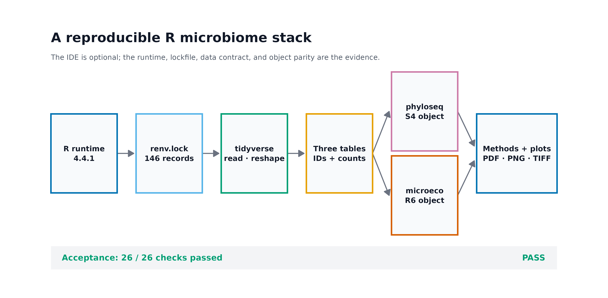
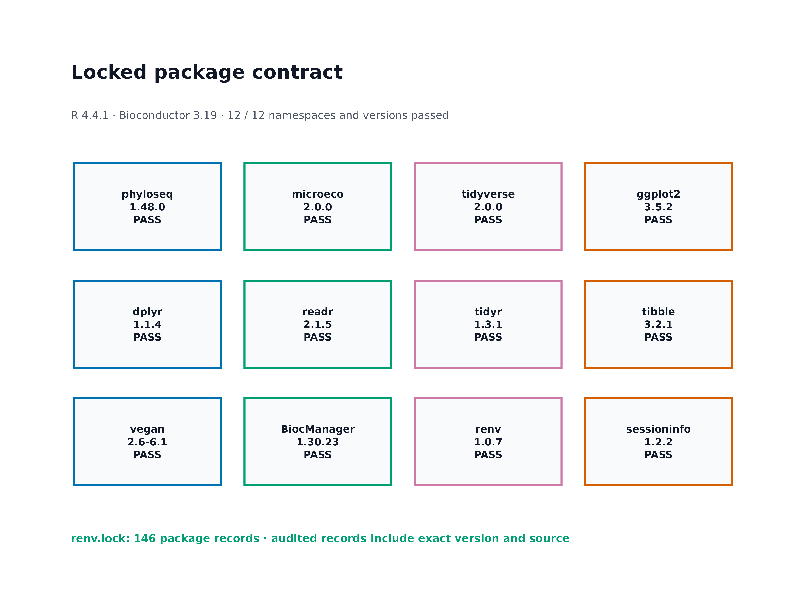
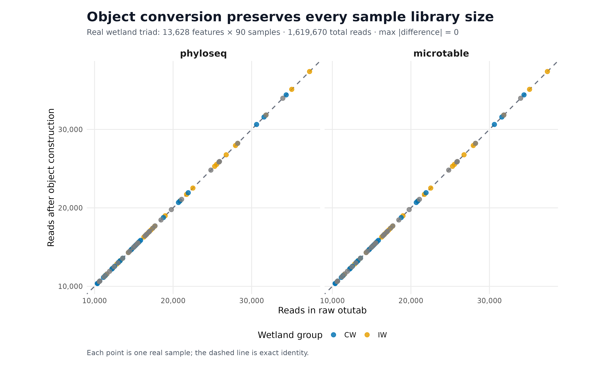

> **分析目标：**建立可复现的 R 微生物组环境，并用真实 `otutab`、`taxonomy`、`metadata` 同时构建 `phyloseq` 与 `microeco::microtable` 对象，核对转换前后的数据同一性。  
> **输入文件：**`env/renv.lock`，以及 `data/small/otutab.tsv`、`data/small/taxonomy.tsv`、`data/small/metadata.tsv`。  
> **预计资源：**首次安装通常 10–40 分钟，取决于是否有二进制包和编译缓存；真实三件套验收约 15 秒，峰值内存约 1–2 GB。  
> **执行策略：**安装、锁文件、namespace 和对象验收已用 `Rscript --vanilla` 一次性实跑并保存审计结果；网页渲染使用 `eval: false`，避免每次构建重复安装包。

## R 端分析需要哪些核心对象与包？ {#sec-target}

R 与 RStudio 的安装通常不进入论文主图，却决定后续每一张图能否在另一台机器上重现。最有用的证据不是 IDE 截图，而是三类可审计结果：

1. **R ecosystem map**：运行时、锁文件、数据整理、对象模型与绘图各自负责什么；
2. **Package contract**：R、Bioconductor 和关键包是否处在预期代际；
3. **Object parity audit**：三件套转为不同对象后，feature、sample 与 reads 是否保持不变。

{#fig-r-ecosystem-map}

{#fig-package-version-audit}

{#fig-object-parity-audit}

::: {.callout-important title="先记住一句话"}
**RStudio 能打开，只说明编辑器能启动；`library()` 不报错，也只说明 namespace 能加载。可用于论文分析的环境还要证明版本被锁定、三件套方向正确、ID 对齐，并且对象转换没有改变数据。**
:::

本次实测环境为 R 4.4.1、Bioconductor 3.19、phyloseq 1.48.0、microeco 2.0.0、tidyverse 2.0.0 和 vegan 2.6-6.1。`env/renv.lock` 含 147 条包记录。真实湿地数据的验收结果为：

```text
Input:       13,628 features × 90 samples
Taxonomy:    13,628 features × 7 ranks
Metadata:    90 samples × 3 variables
Total reads: 1,619,670

phyloseq:    13,628 features × 90 samples; 1,619,670 reads
microtable:  13,628 features × 90 samples; 1,619,670 reads
Sample-wise maximum absolute difference: 0
Required checks: 26 / 26 PASS
```

## R 微生物组环境到底由哪些层组成 {#sec-theory}

### 1. R 是运行时，RStudio 是 IDE

R 执行统计计算；RStudio 是 **integrated development environment（集成开发环境，IDE）**，提供脚本编辑、项目导航、帮助、绘图窗格和调试工具。

两者关系类似：

```text
R        = engine
RStudio  = cockpit
```

安装 RStudio 不等于安装了合适版本的 R。反过来，没有 RStudio 也可以在终端执行：

```bash
Rscript --vanilla analysis.R
```

`--vanilla` 会减少用户级启动文件、历史文件和已保存 workspace 对结果的隐性影响。自动化、服务器和论文复现应至少保留一条不依赖 IDE 点击操作的 `Rscript` 路径。

### 2. R、CRAN 与 Bioconductor 有不同的版本节奏

`tidyverse`、`microeco`、`vegan`、`renv` 等主要来自 CRAN；`phyloseq` 来自 Bioconductor。Bioconductor 每个 release 与特定 R 大版本配套，不能把任意 Bioconductor release 强行装进任意 R。

本次固定组合是：

| 层级 | 固定版本 | 说明 |
|---|---:|---|
| R | 4.4.1 | 统计运行时 |
| Bioconductor | 3.19 | 与 R 4.4 配套的 release |
| phyloseq | 1.48.0 | Bioconductor 3.19 |
| microeco | 2.0.0 | 固定真实数据与接口版本 |
| tidyverse | 2.0.0 | 数据导入、整理与可视化语法集合 |
| vegan | 2.6-6.1 | 生态距离、排序与置换统计 |

这里使用历史固定组合是为了复现实测结果，不表示新项目永远应该停留在旧版本。新项目可以采用当前兼容的 R/Bioconductor 组合，但升级后必须重跑完整 QA，再生成新的锁文件。

### 3. “包生态”不是把所有包都 `library()` 一遍

不同包承担不同责任：

| 层级 | 包 | 主要责任 |
|---|---|---|
| 输入与整理 | `readr`、`dplyr`、`tidyr`、`tibble` | 读取、连接、长宽转换、变量管理 |
| 通用对象 | `phyloseq` | S4 容器，统一 OTU、taxonomy、metadata 与 tree |
| 工作流对象 | `microeco` | R6 容器和生态分析模块 |
| 生态统计 | `vegan` | 距离、排序、PERMANOVA、约束模型 |
| 作图 | `ggplot2` | 图层语法与出版级导出 |
| 环境锁定 | `renv` | 记录包版本、来源与依赖 |
| 证据记录 | `sessioninfo` | 输出运行时、平台和包信息 |

调用函数时优先写包前缀：

```r
dplyr::filter(...)
stats::filter(...)
```

这比依赖 `library()` 的加载顺序更容易审计，也能避免 `filter()`、`select()` 等同名函数被错误解析。

### 4. phyloseq 与 microeco 是不同的对象模型

`phyloseq` 使用 S4 对象：

```r
phyloseq(
  otu_table(...),
  tax_table(...),
  sample_data(...)
)
```

它适合显式 slot、严格 accessor 和大量生态包之间的对象交换。

`microeco` 使用 R6 对象：

```r
microtable$new(
  otu_table = ...,
  tax_table = ...,
  sample_table = ...
)
```

R6 方法常直接修改对象自身。下面两行不一定产生两个互不影响的深拷贝：

```r
dataset_b <- dataset_a
dataset_b$tidy_dataset()
```

需要保留原对象时，应使用对应的 clone 机制：

```r
dataset_b <- dataset_a$clone(deep = TRUE)
```

### 5. 三件套方向是对象构建的第一道门

本项目统一约定：

```text
otutab:    features × samples
taxonomy:  features × taxonomic ranks
metadata:  samples × variables
```

因此：

```r
phyloseq::otu_table(otu_matrix, taxa_are_rows = TRUE)
```

如果你的 OTU 表是 samples × features，必须先转置，或把 `taxa_are_rows` 设为 `FALSE`。一个对象“成功创建”不自动证明方向正确；必须继续核对：

```r
ntaxa(ps)
nsamples(ps)
sample_sums(ps)
```

### 6. renv 锁的是 R 包，不是整个计算机

`renv.lock` 记录包版本、来源和依赖，可由 `renv::restore()` 恢复项目库。但它不会替你安装：

- 对应版本的 R；
- 系统级 C/C++/Fortran 编译器；
- `libxml2`、`libcurl`、`fontconfig`、`harfbuzz` 等系统开发库；
- Quarto/Pandoc；
- 操作系统本身。

因此完整环境证据至少包括：

```text
R version
Bioconductor release
renv.lock
system / container description
session information
real-data smoke test
```

<details>
<summary><strong>深入：为什么只记录 sessionInfo() 仍然不够</strong></summary>

`sessionInfo()` 记录“这一次运行加载了什么”，适合追溯；但它不能自动在另一台机器上安装同一批包。`renv.lock` 可以描述如何恢复包，却不能证明恢复后的数据入口和对象转换仍然正确。

两者应分工：

| 证据 | 回答的问题 |
|---|---|
| `sessionInfo()` / `sessioninfo` | 这一次究竟运行了什么 |
| `renv.lock` | 如何恢复同一批 R 包 |
| 三件套 SHA-256 | 输入是否还是同一份 |
| 对象回验 | 转换是否保留 feature、sample 与 reads |
| Docker/系统记录 | 编译器和系统库是什么 |

这也是为什么本次验收同时保存版本审计、锁文件审计、输入哈希和对象同一性，而不是只贴一段 console 输出。

</details>

## 准备工作 {#sec-setup}

### 1. 安装顺序

建议按以下顺序安装：

```text
R → RStudio（可选）→ 系统编译依赖 → CRAN/Bioconductor 包 → renv 锁定 → 真实数据验收
```

Windows 和 macOS 可从 CRAN 下载 R，再从 Posit 下载 RStudio Desktop。Linux 可使用发行版包管理器或 CRAN 对应发行版仓库。安装后先在终端核对：

```bash
R --version
Rscript --version
```

RStudio 中再运行：

```r
R.version.string
R.home()
```

终端和 IDE 若显示不同 R 路径，先统一运行时，再安装包。

Ubuntu/WSL2 上，源码包常需要系统开发库。常用基线为：

```bash
#| eval: false
sudo apt update
sudo apt install -y \
  r-base r-base-dev \
  build-essential gfortran \
  libcurl4-openssl-dev libssl-dev libxml2-dev \
  libfontconfig1-dev libfreetype6-dev \
  libharfbuzz-dev libfribidi-dev \
  libpng-dev libtiff5-dev libjpeg-dev
```

发行版仓库中的 R 版本不一定等于本次固定的 R 4.4.1。需要严格复现时，应安装对应 R 版本或使用预先验证的容器，而不是在不同 R 大版本下强行恢复旧 Bioconductor。

### 2. 两种包安装路径

**路径 A：恢复本次固定环境。**

在含 `env/renv.lock` 的项目根目录运行：

```r
#| eval: false
install.packages("renv", repos = "https://cloud.r-project.org")

stopifnot(
  getRversion() >= "4.4.0",
  getRversion() < "4.5.0"
)

renv::restore(
  lockfile = "env/renv.lock",
  prompt = FALSE
)
```

恢复后核对 Bioconductor：

```r
#| eval: false
BiocManager::version()
BiocManager::valid()
```

**路径 B：为新项目安装当前兼容环境。**

```r
#| eval: false
install.packages(
  c(
    "BiocManager", "microeco", "tidyverse", "vegan",
    "renv", "sessioninfo", "digest"
  ),
  repos = "https://cloud.r-project.org"
)

BiocManager::install(
  "phyloseq",
  ask = FALSE,
  update = FALSE
)

renv::init()
renv::snapshot()
```

路径 B 可能得到更新版本，不能直接套用本次固定版本的 QA 数字；应在自己的环境重新运行对象回验并记录实际版本。

### 3. 内联作图函数

<details>
<summary><strong>展开：复制依赖与出版级作图函数</strong></summary>

```{r}
#| eval: false
library(ggplot2)
library(dplyr)
library(readr)
library(tidyr)
library(tibble)
library(scales)
library(phyloseq)
library(microeco)

set.seed(20260719)

pal_pub <- c(
  "#0072B2", "#D55E00", "#009E73", "#CC79A7",
  "#E69F00", "#56B4E9", "#F0E442", "#999999"
)

scale_color_pub <- function(...) {
  ggplot2::scale_color_manual(values = pal_pub, ...)
}

scale_fill_pub <- function(...) {
  ggplot2::scale_fill_manual(values = pal_pub, ...)
}

theme_pub <- function(base_size = 12) {
  ggplot2::theme_bw(base_size = base_size, base_family = "sans") +
    ggplot2::theme(
      panel.grid = ggplot2::element_blank(),
      axis.text = ggplot2::element_text(color = "black"),
      axis.ticks = ggplot2::element_line(
        color = "black",
        linewidth = 0.3
      ),
      plot.title.position = "plot",
      legend.key = ggplot2::element_blank(),
      legend.background = ggplot2::element_rect(
        fill = scales::alpha("white", 0.6),
        color = NA
      )
    )
}

save_pub <- function(
  plot,
  file_base,
  width = 180,
  height = 115,
  units = "mm",
  dpi = 300,
  write_tiff = TRUE
) {
  dir.create(
    dirname(file_base),
    recursive = TRUE,
    showWarnings = FALSE
  )
  ggplot2::ggsave(
    paste0(file_base, ".pdf"),
    plot,
    width = width,
    height = height,
    units = units,
    device = grDevices::cairo_pdf
  )
  ggplot2::ggsave(
    paste0(file_base, ".png"),
    plot,
    width = width,
    height = height,
    units = units,
    dpi = dpi,
    bg = "white"
  )
  if (isTRUE(write_tiff)) {
    ggplot2::ggsave(
      paste0(file_base, ".tiff"),
      plot,
      width = width,
      height = height,
      units = units,
      dpi = dpi,
      compression = "lzw",
      bg = "white"
    )
  }
  invisible(plot)
}
```


</details>

## 可复制代码 {#sec-code}

### 确认 R、Rscript 与 Bioconductor 版本

在终端运行：

```bash
#| eval: false
Rscript --vanilla -e '
cat(R.version.string, "\n")
cat("Platform:", R.version$platform, "\n")
cat("Architecture:", .Machine$sizeof.pointer * 8, "bit\n")
cat("Libraries:\n")
writeLines(.libPaths())
'
```

然后在 R 中确认 Bioconductor：

```r
#| eval: false
cat("R:", as.character(getRversion()), "\n")
cat("Bioconductor:", as.character(BiocManager::version()), "\n")
```

固定环境应得到：

```text
R: 4.4.1
Bioconductor: 3.19
Architecture: 64 bit
```

### 固定并校验真实数据来源 {.wechat-omit}

本次使用 `microeco 2.0.0` 源码包中随软件分发的真实 16S 湿地数据。下载固定归档：

```r
#| eval: false
dir.create("downloads", showWarnings = FALSE)
dir.create("data/small", recursive = TRUE, showWarnings = FALSE)

microeco_url <- paste0(
  "https://cran.r-project.org/src/contrib/Archive/",
  "microeco/microeco_2.0.0.tar.gz"
)
microeco_tar <- "downloads/microeco_2.0.0.tar.gz"

download.file(
  microeco_url,
  microeco_tar,
  mode = "wb"
)

observed_sha256 <- digest::digest(
  file = microeco_tar,
  algo = "sha256",
  serialize = FALSE
)

stopifnot(
  observed_sha256 ==
    "454a3b71ceeea86bdd54f475a12b5bac9c3b124f663b8dc6e560827fca89ebfd"
)
```

只解压三张数据表：

```r
#| eval: false
extract_dir <- "downloads/microeco_2.0.0-source"
dir.create(extract_dir, recursive = TRUE, showWarnings = FALSE)

utils::untar(
  microeco_tar,
  files = c(
    "microeco/data/otu_table_16S.RData",
    "microeco/data/taxonomy_table_16S.RData",
    "microeco/data/sample_info_16S.RData"
  ),
  exdir = extract_dir
)

load(file.path(
  extract_dir,
  "microeco/data/otu_table_16S.RData"
))
load(file.path(
  extract_dir,
  "microeco/data/taxonomy_table_16S.RData"
))
load(file.path(
  extract_dir,
  "microeco/data/sample_info_16S.RData"
))
```

### 将包内数据导出为通用三件套 {.wechat-omit}

```r
#| eval: false
stopifnot(
  identical(
    rownames(otu_table_16S),
    rownames(taxonomy_table_16S)
  ),
  identical(
    colnames(otu_table_16S),
    rownames(sample_info_16S)
  )
)

write.table(
  otu_table_16S,
  "data/small/otutab.tsv",
  sep = "\t",
  quote = FALSE,
  col.names = NA
)
write.table(
  taxonomy_table_16S,
  "data/small/taxonomy.tsv",
  sep = "\t",
  quote = FALSE,
  col.names = NA
)
write.table(
  sample_info_16S,
  "data/small/metadata.tsv",
  sep = "\t",
  quote = FALSE,
  col.names = NA
)
```

显示数据结构：

```r
#| eval: false
dim(otu_table_16S)
dim(taxonomy_table_16S)
dim(sample_info_16S)

otu_table_16S[1:5, 1:5]
taxonomy_table_16S[1:5, ]
head(sample_info_16S)
```

预期维度：

```text
otutab:   13628 × 90
taxonomy: 13628 × 7
metadata: 90 × 3
```

### 从文本三件套重新读入

不要直接沿用内存中的包对象；重新读取 TSV 才能检验交付接口。

```r
#| eval: false
otutab <- read.delim(
  "data/small/otutab.tsv",
  row.names = 1,
  check.names = FALSE
)
taxonomy <- read.delim(
  "data/small/taxonomy.tsv",
  row.names = 1,
  check.names = FALSE
)
metadata <- read.delim(
  "data/small/metadata.tsv",
  row.names = 1,
  check.names = FALSE
)

otu_matrix <- as.matrix(otutab)
storage.mode(otu_matrix) <- "numeric"
tax_matrix <- as.matrix(taxonomy)
storage.mode(tax_matrix) <- "character"
```

`check.names = FALSE` 很重要：它避免 R 自动把样本名中的连字符等字符改写成点号。

### 在构建对象前核对数据合同

```r
#| eval: false
stopifnot(
  nrow(otutab) == 13628,
  ncol(otutab) == 90,
  nrow(taxonomy) == nrow(otutab),
  nrow(metadata) == ncol(otutab),
  identical(rownames(otutab), rownames(taxonomy)),
  identical(colnames(otutab), rownames(metadata)),
  !anyDuplicated(rownames(otutab)),
  !anyDuplicated(colnames(otutab)),
  !anyDuplicated(rownames(metadata)),
  all(is.finite(otu_matrix)),
  all(otu_matrix >= 0),
  all(otu_matrix == round(otu_matrix))
)

raw_library <- colSums(otu_matrix)
stopifnot(sum(raw_library) == 1619670)
```

### 构建 phyloseq 对象

```r
#| eval: false
ps <- phyloseq::phyloseq(
  phyloseq::otu_table(
    otu_matrix,
    taxa_are_rows = TRUE
  ),
  phyloseq::tax_table(tax_matrix),
  phyloseq::sample_data(metadata)
)

ps
phyloseq::ntaxa(ps)
phyloseq::nsamples(ps)
summary(phyloseq::sample_sums(ps))
```

关键回验：

```r
#| eval: false
stopifnot(
  phyloseq::ntaxa(ps) == nrow(otu_matrix),
  phyloseq::nsamples(ps) == ncol(otu_matrix),
  sum(phyloseq::sample_sums(ps)) == sum(otu_matrix),
  identical(
    sort(phyloseq::taxa_names(ps)),
    sort(rownames(otu_matrix))
  ),
  identical(
    sort(phyloseq::sample_names(ps)),
    sort(colnames(otu_matrix))
  )
)
```

### 构建 microeco 对象

```r
#| eval: false
mt <- microeco::microtable$new(
  sample_table = metadata,
  otu_table = as.data.frame(
    otu_matrix,
    check.names = FALSE
  ),
  tax_table = taxonomy,
  auto_tidy = TRUE
)

mt
```

关键回验：

```r
#| eval: false
stopifnot(
  nrow(mt$otu_table) == nrow(otu_matrix),
  ncol(mt$otu_table) == ncol(otu_matrix),
  nrow(mt$tax_table) == nrow(taxonomy),
  nrow(mt$sample_table) == nrow(metadata),
  identical(
    rownames(mt$otu_table),
    rownames(mt$tax_table)
  ),
  identical(
    colnames(mt$otu_table),
    rownames(mt$sample_table)
  ),
  sum(as.matrix(mt$otu_table)) == sum(otu_matrix)
)
```

### 用 tidyverse 连接逐样本核对

```r
#| eval: false
phyloseq_library <- phyloseq::sample_sums(ps)
microtable_library <- colSums(
  as.matrix(mt$otu_table)
)

library_audit <- tibble::tibble(
  sample_id = names(raw_library),
  raw_reads = as.numeric(raw_library)
) |>
  dplyr::left_join(
    tibble::tibble(
      sample_id = names(phyloseq_library),
      phyloseq_reads = as.numeric(phyloseq_library)
    ),
    by = "sample_id"
  ) |>
  dplyr::left_join(
    tibble::tibble(
      sample_id = names(microtable_library),
      microtable_reads = as.numeric(microtable_library)
    ),
    by = "sample_id"
  ) |>
  dplyr::mutate(
    phyloseq_delta = phyloseq_reads - raw_reads,
    microtable_delta = microtable_reads - raw_reads
  )

stopifnot(
  nrow(library_audit) == 90,
  all(stats::complete.cases(library_audit)),
  max(abs(library_audit$phyloseq_delta)) == 0,
  max(abs(library_audit$microtable_delta)) == 0
)

head(library_audit)
```

### 输出可引用的环境信息

```r
#| eval: false
dir.create(
  "results/09-r-ecosystem",
  recursive = TRUE,
  showWarnings = FALSE
)

write.table(
  library_audit,
  "results/09-r-ecosystem/sample-library-audit.tsv",
  sep = "\t",
  quote = FALSE,
  row.names = FALSE
)

capture.output(
  sessioninfo::session_info(),
  file = "results/09-r-ecosystem/r-session-info.txt"
)

cat(
  "Bioconductor:",
  as.character(BiocManager::version()),
  "\n",
  file = "results/09-r-ecosystem/r-session-info.txt",
  append = TRUE
)
```

一次性环境审计入口为：

```bash
#| eval: false
Rscript --vanilla scripts/validate_r_ecosystem.R \
  --project-root . \
  --output-dir results/09-r-ecosystem \
  --figure-dir figures
```

执行成功时，`environment-summary.json` 中应出现：

```json
{
  "status": "passed",
  "r_version": "4.4.1",
  "bioconductor_version": "3.19",
  "lock_package_records": 147,
  "package_checks_passed": 12,
  "checks_total": 26,
  "checks_passed": 26,
  "checks_failed": 0,
  "object_parity_checks_passed": 6
}
```

## 出版级美化 {#sec-publication}

### 1. 用同一性图证明对象转换没有改数据

把两个对象的逐样本 library size 整成长表：

```r
#| eval: false
plot_data <- dplyr::bind_rows(
  library_audit |>
    dplyr::transmute(
      sample_id,
      raw_reads,
      object_reads = phyloseq_reads,
      object = "phyloseq"
    ),
  library_audit |>
    dplyr::transmute(
      sample_id,
      raw_reads,
      object_reads = microtable_reads,
      object = "microtable"
    )
) |>
  dplyr::left_join(
    tibble::rownames_to_column(
      metadata,
      var = "sample_id"
    ),
    by = "sample_id"
  )
```

图内分组名称保持英文：

```r
#| eval: false
plot_data$Group <- dplyr::recode(
  plot_data$Group,
  CW = "CW",
  IW = "IW"
)
```

绘制 identity audit：

```r
#| eval: false
p_parity <- ggplot2::ggplot(
  plot_data,
  ggplot2::aes(
    x = raw_reads,
    y = object_reads,
    color = Group
  )
) +
  ggplot2::geom_abline(
    slope = 1,
    intercept = 0,
    color = "#6B7280",
    linetype = "dashed",
    linewidth = 0.7
  ) +
  ggplot2::geom_point(
    size = 2.4,
    alpha = 0.82
  ) +
  ggplot2::facet_wrap(
    ~object,
    nrow = 1
  ) +
  scale_color_pub(name = "Wetland group") +
  ggplot2::scale_x_continuous(
    labels = scales::label_comma()
  ) +
  ggplot2::scale_y_continuous(
    labels = scales::label_comma()
  ) +
  ggplot2::coord_equal() +
  ggplot2::labs(
    title = "Object conversion preserves every sample library size",
    subtitle = paste0(
      "13,628 features × 90 samples · ",
      "1,619,670 total reads · max |difference| = 0"
    ),
    x = "Reads in raw otutab",
    y = "Reads after object construction"
  ) +
  theme_pub()

save_pub(
  p_parity,
  "figures/09-object-parity-audit",
  width = 190,
  height = 120,
  dpi = 350
)
```

### 2. 环境图只呈现稳定合同

适合放进补充材料的稳定信息包括：

- R 与 Bioconductor 代际；
- 被分析脚本实际调用的包版本；
- `renv.lock` 哈希；
- 输入表 SHA-256；
- 对象转换后维度与 reads；
- 验收日期和命令。

不适合作为核心合同的内容包括：

- RStudio 窗口布局；
- console 历史；
- 临时目录；
- 本机用户名和绝对路径；
- 某次下载缓存位置。

### 3. 图形导出

网页展示 PNG，投稿与后续编辑保留 PDF；期刊要求位图时提供 300 dpi 以上 LZW TIFF。导出后检查：

```r
#| eval: false
file.info(
  c(
    "figures/09-object-parity-audit.pdf",
    "figures/09-object-parity-audit.png",
    "figures/09-object-parity-audit.tiff"
  )
)[, c("size", "mtime")]
```

## 常见坑 {#sec-pitfalls}

::: {.callout-caution title="坑 1：把 RStudio 当成 R"}
RStudio 需要连接一个已安装的 R。若终端 `Rscript --version` 失败，先安装或修复 R；反复重装 IDE 不会补齐统计运行时。
:::

::: {.callout-caution title="坑 2：IDE 与终端指向不同 R"}
RStudio 中的 `R.home()`、终端中的 `R RHOME` 和 `which Rscript` 应指向预期安装。不同路径会导致“IDE 能加载、服务器脚本不能加载”的假象。
:::

::: {.callout-caution title="坑 3：用 install.packages() 安装 phyloseq"}
`phyloseq` 属于 Bioconductor，应使用 `BiocManager::install("phyloseq")`。同时核对 R 与 Bioconductor release 的兼容关系。
:::

::: {.callout-caution title="坑 4：在旧 R 中强行安装新 Bioconductor"}
不要把“package is not available”立即解释为网络问题。先运行 `BiocManager::version()` 和 `BiocManager::valid()`，确认 release 代际。
:::

::: {.callout-caution title="坑 5：用户库不可写"}
若报 `library is not writable`，建立属于当前用户的项目库或用户库，不要习惯性用管理员权限启动 R。项目级 `renv` 通常比污染系统库更安全。
:::

::: {.callout-caution title="坑 6：缺少编译器或系统开发库"}
Linux 源码包可能需要 GCC、gfortran、curl/XML/SSL/font 系统头文件；Windows 安装源码包时可能需要对应 R 版本的 Rtools。先读安装日志中第一条真实编译错误。
:::

::: {.callout-caution title="坑 7：全局 update.packages() 后直接覆盖锁文件"}
升级应在单独分支或新环境完成，先全流程验收，再 `renv::snapshot()`。锁文件改变但结果未复核，不应进入发布版本。
:::

::: {.callout-caution title="坑 8：OTU 表方向反了"}
对象能创建不代表方向正确。构建后必须把 `ntaxa()`、`nsamples()` 与原始表的 feature/sample 数逐项对照。
:::

::: {.callout-caution title="坑 9：R 自动改写样本名"}
`read.delim()` 默认可能把列名改成合法 R 名称。读取三件套时使用 `check.names = FALSE`，并在对象构建前执行 `identical(colnames(otutab), rownames(metadata))`。
:::

::: {.callout-caution title="坑 10：只比较总 reads"}
两个对象总 reads 相同，仍可能发生样本错位。至少比较逐样本 library size；涉及 taxonomy 时还要比较 feature ID 与顺序。
:::

::: {.callout-caution title="坑 11：忽略 R6 引用语义"}
`b <- a` 可能让两个变量引用同一 R6 对象。需要独立分支时使用 `a$clone(deep = TRUE)`，并在过滤前后保存 feature/sample 审计。
:::

::: {.callout-caution title="坑 12：函数同名被遮蔽"}
`filter()`、`select()`、`lag()` 等函数可能来自多个包。论文分析脚本优先使用 `dplyr::filter()` 这样的显式命名空间。
:::

::: {.callout-caution title="坑 13：一开始就把 13,628 × 90 表转成长表"}
长表会把 1,226,520 个 count 单元展开为行，显著增加内存。多数 library-size、过滤和距离计算应先在矩阵或稀疏结构上完成。
:::

::: {.callout-caution title="坑 14：只保存 ps.rds，不保留三件套"}
RDS 适合加速项目内部工作，但会绑定对象类和包版本。正式交付仍应保留可读的 `otutab`、`taxonomy`、`metadata` 与 checksum。
:::

## 这段 Methods 怎么写 {#sec-methods}

### 英文模板

```text
All analyses were performed in R 4.4.1 under Bioconductor 3.19.
Package dependencies were recorded in an renv lockfile. The principal
packages were phyloseq 1.48.0, microeco 2.0.0, tidyverse 2.0.0,
vegan 2.6-6.1, and ggplot2 3.5.2. The input consisted of a
feature-by-sample count table, a feature-by-rank taxonomy table, and a
sample-by-variable metadata table. Feature and sample identifiers were
required to match exactly before object construction. The same input
was assembled independently as a phyloseq object and a microeco
microtable object. Feature counts, sample counts, total reads, and
sample-wise library sizes were verified to be identical to the source
tables. Scripts were executed with Rscript in a clean session, and
session information and input SHA-256 values were retained.
```

### 需要替换的内容

- R 与 Bioconductor 版本；
- 实际使用的包和版本；
- count/taxonomy/metadata 表方向；
- 是否包含 phylogenetic tree；
- 是否真正使用了 phyloseq、microeco，或两者；
- 锁文件、容器或系统环境的获取位置；
- 输入 checksum 和对象回验指标。

::: {.callout-warning title="不要写进 Methods 的内容"}
没有实际使用 RStudio 的交互功能时，不必把 RStudio 版本当成分析方法；没有执行对象同一性检查时，也不要写“data integrity was verified”。
:::

## 换成你自己的数据怎么做 {#sec-own-data}

### 1. 只改路径和分组列

```r
#| eval: false
otu_path <- "data/my_project/otutab.tsv"
tax_path <- "data/my_project/taxonomy.tsv"
meta_path <- "data/my_project/metadata.tsv"
group_col <- "Treatment"

otutab <- read.delim(
  otu_path,
  row.names = 1,
  check.names = FALSE
)
taxonomy <- read.delim(
  tax_path,
  row.names = 1,
  check.names = FALSE
)
metadata <- read.delim(
  meta_path,
  row.names = 1,
  check.names = FALSE
)
```

### 2. 自动判断是否需要转置

```r
#| eval: false
feature_match_rows <- sum(
  rownames(otutab) %in% rownames(taxonomy)
)
feature_match_columns <- sum(
  colnames(otutab) %in% rownames(taxonomy)
)

if (
  feature_match_columns > feature_match_rows
) {
  otutab <- as.data.frame(
    t(as.matrix(otutab)),
    check.names = FALSE
  )
}
```

转置后仍要执行严格合同：

```r
#| eval: false
stopifnot(
  identical(rownames(otutab), rownames(taxonomy)),
  identical(colnames(otutab), rownames(metadata)),
  group_col %in% colnames(metadata)
)
```

### 3. taxonomy 只有一列分号字符串

如果 taxonomy 形如：

```text
k__Bacteria;p__Proteobacteria;c__Gammaproteobacteria;...
```

可拆成七列：

```r
#| eval: false
taxonomy <- taxonomy |>
  tibble::rownames_to_column("FeatureID") |>
  tidyr::separate_wider_delim(
    cols = 2,
    delim = ";",
    names = c(
      "Kingdom", "Phylum", "Class", "Order",
      "Family", "Genus", "Species"
    ),
    too_few = "align_start",
    too_many = "merge"
  ) |>
  tibble::column_to_rownames("FeatureID")
```

再清理前缀：

```r
#| eval: false
taxonomy[] <- lapply(
  taxonomy,
  function(x) sub("^[a-z]__", "", trimws(x))
)
```

### 4. metadata 中含中文分组

作图前映射为英文：

```r
#| eval: false
metadata$Treatment <- dplyr::recode(
  metadata$Treatment,
  "对照" = "Control",
  "处理" = "Treatment"
)
```

### 5. 构建两种对象并回验

```r
#| eval: false
otu_matrix <- as.matrix(otutab)
storage.mode(otu_matrix) <- "numeric"

ps <- phyloseq::phyloseq(
  phyloseq::otu_table(
    otu_matrix,
    taxa_are_rows = TRUE
  ),
  phyloseq::tax_table(
    as.matrix(taxonomy)
  ),
  phyloseq::sample_data(metadata)
)

mt <- microeco::microtable$new(
  sample_table = metadata,
  otu_table = as.data.frame(
    otu_matrix,
    check.names = FALSE
  ),
  tax_table = taxonomy,
  auto_tidy = TRUE
)

stopifnot(
  phyloseq::ntaxa(ps) == nrow(otu_matrix),
  phyloseq::nsamples(ps) == ncol(otu_matrix),
  sum(phyloseq::sample_sums(ps)) == sum(otu_matrix),
  nrow(mt$otu_table) == nrow(otu_matrix),
  ncol(mt$otu_table) == ncol(otu_matrix),
  sum(as.matrix(mt$otu_table)) == sum(otu_matrix),
  identical(
    unname(phyloseq::sample_sums(ps)[colnames(otu_matrix)]),
    unname(colSums(otu_matrix))
  ),
  identical(
    unname(colSums(mt$otu_table)[colnames(otu_matrix)]),
    unname(colSums(otu_matrix))
  )
)
```

::: {.callout-tip title="树不是本章必需输入"}
基础对象可以只包含 counts、taxonomy 和 metadata。Faith's PD、UniFrac 等系统发育指标才需要额外的 feature tree；加入树时还要核对 tip labels 与 feature IDs。
:::

## 参考 {#sec-references}

1. R Core Team. **R Installation and Administration**. [CRAN official manual](https://cran.r-project.org/doc/manuals/r-release/R-admin.html).
2. Posit. **RStudio IDE User Guide**. [Official documentation](https://docs.posit.co/ide/user/).
3. Bioconductor. **Bioconductor 3.19 Released**. 2024. [Release announcement](https://bioconductor.org/news/bioc_3_19_release/).
4. Bioconductor. **Install Bioconductor**. [Official installation guide](https://bioconductor.org/install/).
5. McMurdie PJ, Holmes S. phyloseq: an R package for reproducible interactive analysis and graphics of microbiome census data. *PLOS ONE*. 2013;8(4):e61217. [doi:10.1371/journal.pone.0061217](https://doi.org/10.1371/journal.pone.0061217).
6. Liu C, Cui Y, Li X, Yao M. microeco: an R package for data mining in microbial community ecology. *FEMS Microbiology Ecology*. 2021;97(2):fiaa255. [doi:10.1093/femsec/fiaa255](https://doi.org/10.1093/femsec/fiaa255).
7. Wickham H, Averick M, Bryan J, et al. Welcome to the tidyverse. *Journal of Open Source Software*. 2019;4(43):1686. [doi:10.21105/joss.01686](https://doi.org/10.21105/joss.01686).
8. Ushey K, Wickham H. **Project Environments with renv**. [Official documentation](https://rstudio.github.io/renv/).
9. CRAN. **microeco source archive**. [microeco 2.0.0](https://cran.r-project.org/src/contrib/Archive/microeco/microeco_2.0.0.tar.gz).
10. An J, Liu C, Wang Q, et al. Soil bacterial community structure in Chinese wetlands. *Geoderma*. 2019;337:290–299. [doi:10.1016/j.geoderma.2018.09.035](https://doi.org/10.1016/j.geoderma.2018.09.035).
