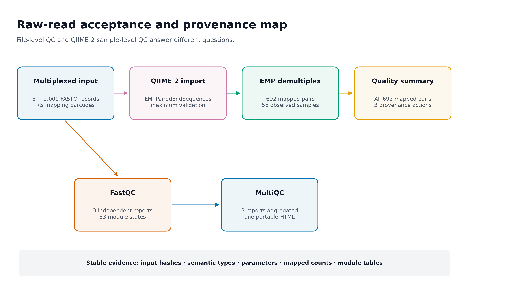
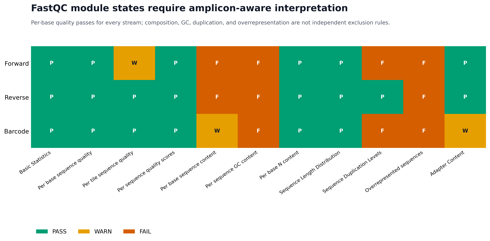
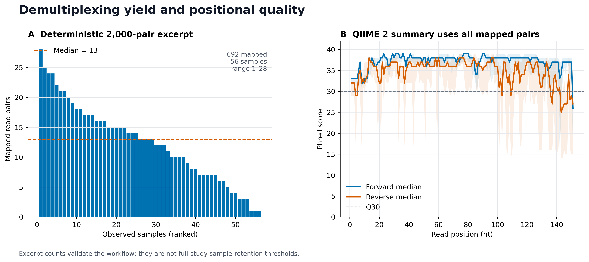

> **分析目标：**把仍处于 multiplexed 状态的真实 paired-end FASTQ 导入 QIIME 2，按样本 barcode 拆分，核对 semantic type、样本产量、逐位置质量和完整 provenance；同时用 FastQC 与 MultiQC 完成文件级原始数据审计。  
> **输入文件：**`data/small/fastq/forward.fastq.gz`、`reverse.fastq.gz`、`barcodes.fastq.gz`、`metadata.tsv`，以及锁定环境 `env/qiime2.yml`、`env/raw-qc.yml`。  
> **预计资源：**本页使用的 2,000-pair 真实摘录约 0.5 MB，完整验收约 3–5 分钟、峰值内存低于 2 GB；完整研究数据的耗时和空间近似随 reads 数增长。  
> **执行策略：**导入、拆样、FastQC、MultiQC 与 provenance 审计已在固定环境中一次性实跑；网页渲染使用 `eval: false`，避免每次构建生成新的 Artifact UUID 或重复运行上游工具。

## 先让每一步输入、输出和来源可追溯 {#sec-target}

“导入成功”通常不会成为论文主图，但它决定后续 ASV 表是否还对应正确样本。建议至少保留三类证据：

1. **Raw-read acceptance and provenance map**：清楚区分文件级 QC 与样本级 QC；
2. **FastQC module audit**：完整报告 PASS/WARN/FAIL，同时按扩增子文库语境解释；
3. **Demultiplexing yield and positional quality**：展示逐样本 reads 和 forward/reverse 质量曲线。

{#fig-import-provenance-map}

{#fig-fastqc-module-audit}

{#fig-demultiplexing-qc}

::: {.callout-important title="先记住一句话"}
**FASTQ 完整、FastQC 状态正常、QIIME 2 semantic type 正确、barcode 能映射、provenance 可追溯，是五道不同的门。任何一道通过，都不能替代其余四道。**
:::

本次实测环境与结果为：

```text
QIIME 2 / q2cli / q2-demux: 2026.4.0
FastQC:                      0.12.1
MultiQC:                     1.33

Input streams:               3 × 2,000 synchronized FASTQ records
Mapping metadata:            75 samples, 75 unique 12-nt barcodes
Imported type / format:      EMPPairedEndSequences / EMPPairedEndDirFmt
Demultiplexed type / format: SampleData[PairedEndSequencesWithQuality] /
                             SingleLanePerSamplePairedEndFastqDirFmt

Mapped read pairs:           692 / 2,000 (34.6%)
Observed samples:            56
Per-sample mapped pairs:     median 13, range 1–28
Provenance actions:          import → demux.emp_paired → demux.summarize

FastQC reports:              3
FastQC module states:        33
Per-base quality PASS:       3 / 3 streams
MultiQC reports aggregated:  3
Required checks:             45 / 45 PASS
```

::: {.callout-warning title="摘录结果不能外推到完整研究"}
这里从官方 135,487 对 reads 中等间距抽取 2,000 对，用于快速、确定性地验证接口。未在摘录中观察到的 19 个 metadata 样本，可能只是没有任何被抽中的 reads；**不能据此判定这些样本在完整研究中测序失败，也不能把 34.6% 当作完整数据的拆样率。**
:::

## 理论：导入、拆样与质控分别回答什么 {#sec-theory}

### 1. 先判断数据处于哪个状态

paired-end FASTQ 常见的三种状态如下：

| 数据状态 | 文件外观 | QIIME 2 入口 |
|---|---|---|
| Multiplexed EMP | 全部样本共用 `forward`、`reverse`、`barcodes` 三个文件 | `EMPPairedEndSequences` |
| 已按样本拆分 | 每个样本各有 R1/R2，另有 manifest | `SampleData[PairedEndSequencesWithQuality]` |
| Casava 1.8 拆分目录 | 每个样本按 Illumina 规则命名 R1/R2 | `CasavaOneEightSingleLanePerSampleDirFmt` |

文件扩展名都是 `.fastq.gz`，并不表示它们处于同一个生物信息学状态。把 multiplexed 三文件误写进 per-sample manifest，会绕过真正需要的 barcode mapping；把已经拆样的数据再交给 EMP demultiplex，则没有对应的独立 barcode stream。

这组真实输入仍是 multiplexed EMP paired-end 数据，因此第一步类型为：

```text
EMPPairedEndSequences
```

只有完成 barcode mapping 后，输出才变为：

```text
SampleData[PairedEndSequencesWithQuality]
```

### 2. 五层门禁不能合并成一个“QC 通过”

| 层级 | 代表工具或检查 | 主要问题 |
|---|---|---|
| 字节与结构 | SHA-256、gzip、FASTQ 四行结构 | 文件是否完整、内容是否漂移 |
| 三流配对 | record 数、read ID、顺序 | forward/reverse/barcode 是否仍一一对应 |
| 文件级诊断 | FastQC | 每条输入流的质量、组成、重复、adapter 信号 |
| 样本级诊断 | QIIME 2 `demux` | barcode 是否能映射、每个样本获得多少 reads |
| 可追溯性 | QIIME 2 provenance | 实际 action、参数、输入与软件环境是什么 |

FastQC 不知道哪一条 read 属于哪个样本；拆样之前，它只能报告整条 multiplexed 文件的汇总。反过来，QIIME 2 拆样成功也不自动证明原始 gzip 没有被替换，或所有 FastQC 模块都得到过审阅。

### 3. barcode 方向是实验协议的一部分

QIIME 2 的 `demux emp-paired` 区分两种反向互补操作：

```text
--p-rev-comp-barcodes
--p-rev-comp-mapping-barcodes
```

前者反向互补测序得到的 barcode reads；后者反向互补 metadata 中记录的 mapping barcodes。它们不是可互换的“修复开关”。

Atacama 官方教程明确要求：

```bash
--p-rev-comp-mapping-barcodes
```

本次若省略该参数，受控探针得到 `No sequences were mapped`。加回后，2,000 对摘录 reads 中有 692 对被分配到 56 个样本。这是对协议和参数方向的验证，不是通过反复切换参数寻找“映射率最高”的组合。

### 4. Golay error correction 只适用于相应 barcode 设计

`demux emp-paired` 默认启用 12-nt Golay error correction。它能够在协议允许范围内纠正 barcode 错误，并输出 `ErrorCorrectionDetails`。

本次 2,000 条 barcode reads 的审计为：

| Mapping status | Barcode errors | Records | Percent |
|---|---:|---:|---:|
| Mapped | 0 | 614 | 30.70% |
| Mapped | 1 | 30 | 1.50% |
| Mapped | 2 | 27 | 1.35% |
| Mapped | 3 | 21 | 1.05% |
| Unmapped | 0 | 870 | 43.50% |
| Unmapped | 1–4 | 438 | 21.90% |

不要因为软件提供 Golay 纠错，就默认任意长度、任意设计的 index 都适用。若实验不是 EMP 12-nt Golay barcode，应依据建库协议选择对应 demultiplex 方法，不能机械照搬这里的参数。

### 5. QZA、QZV 与 provenance 的责任不同

- `.qza` 是带 semantic type 和 provenance 的数据 Artifact；
- `.qzv` 是带 provenance 的 Visualization；
- `qiime tools export` 导出的是数据表示，导出的普通文件不再携带完整 QIIME 2 provenance；
- 每次 action 会生成新的 UUID，因此整个 archive 的 SHA-256 通常不是跨运行固定值。

本次质量摘要 `.qzv` 的祖先链含三个 action：

```text
import
└── demux.emp_paired
    └── demux.summarize
```

稳定的验收对象应包括输入哈希、semantic type、data format、action、参数、样本计数和模块表；UUID 与 archive 整体哈希用于标识某一次运行，但不应被要求在重新运行时保持不变。

<details>
<summary><strong>深入：provenance 能记录什么，又不能替你做什么</strong></summary>

QIIME 2 provenance 可记录：

- action 和 plugin；
- 参数值；
- 输入与输出 UUID；
- framework/plugin 版本；
- citations；
- action 接收到的 metadata。

它不能自动证明：

- 上机样本标签与真实生物样本没有贴错；
- FASTQ 在首次进入 QIIME 2 之前的传输历史完整；
- metadata 中每个临床字段都正确；
- 某个参数在科学上最合理；
- 导出后由外部软件执行的步骤仍被 QIIME 2 追踪。

因此 provenance 是审计链，不是科学合理性的自动认证。共享 `.qza` 或 `.qzv` 前还要考虑嵌入 metadata 的隐私风险。

</details>

### 6. FastQC 的颜色不是扩增子样本删除规则

FastQC 的阈值面向多种测序应用。扩增子文库具有共同引物起点、有限扩增区域和 PCR 扩增，天然不满足随机 shotgun 文库的一些假设。

本次三条流中，“Per base sequence quality”均为 PASS，但还出现：

| 模块 | 典型状态 | 扩增子语境中的解释 |
|---|---|---|
| Per base sequence content | WARN/FAIL | 共同引物和保守位点使起始碱基不均衡 |
| Per sequence GC content | FAIL | 靶区与群落组成形成非随机 GC 分布 |
| Sequence Duplication Levels | PASS/FAIL | PCR 与有限靶区使重复 reads 常见 |
| Overrepresented sequences | FAIL | 真实高丰度扩增子、primer 或污染都可能造成 |
| Adapter Content | PASS/WARN | 需结合接头、引物和 read-through 判断 |
| Per tile sequence quality | PASS/WARN | 更接近仪器空间问题，应查看具体 tile 图 |

正确用法是：

1. 找异常流和异常 cycle；
2. 与建库结构、阴性对照、拆样率和后续 DADA2 retention 联合判断；
3. 保留完整模块表；
4. 不把一个红色 FAIL 自动翻译成“删除样本”。

### 7. MultiQC 聚合报告，不重新分析 FASTQ

MultiQC 读取 FastQC 的结果文件，把多个报告统一到一个 HTML 和机器可读表中。它不会重新计算碱基质量，也不会替你选择截断长度。

本次 MultiQC 汇总：

| Stream | Total sequences | GC | Duplicates | Mean length | Failed modules |
|---|---:|---:|---:|---:|---:|
| Barcode | 2,000 | 47% | 69.55% | 12 nt | 27.27% |
| Forward | 2,000 | 54% | 51.05% | 151 nt | 36.36% |
| Reverse | 2,000 | 55% | 25.80% | 151 nt | 27.27% |

这些数字帮助快速发现流之间的差异；它们不替代逐模块图，也不替代拆样后的逐样本深度。

### 8. 质量摘要中的随机抽样必须被记录

`qiime demux summarize` 的 `--p-n` 表示用于质量曲线的随机序列数，默认 10,000。若输入多于 `n`，质量曲线来自抽样；逐样本 read counts 仍来自全部输入。

本页摘录仅有 692 对已拆样 reads，设置：

```bash
--p-n 10000
```

因此曲线实际使用全部 692 对，不再发生随机子抽样。完整研究若 reads 远多于 10,000，应在 Methods 记录 `n`；若需要比较两次质量曲线，应固定软件版本并保留原始 `.qzv`，不要假设随机抽样结果逐像素一致。

## 准备工作 {#sec-setup}

### 1. 获取真实数据

本页使用 Neilson 等人的 Atacama aridity gradient 土壤 16S 数据。官方 QIIME 2 2024.5 教程提供 1% multiplexed paired-end 数据：

```bash
mkdir -p downloads/atacama-1p data/small/fastq

curl -L \
  https://data.qiime2.org/2024.5/tutorials/atacama-soils/1p/forward.fastq.gz \
  -o downloads/atacama-1p/forward.fastq.gz
curl -L \
  https://data.qiime2.org/2024.5/tutorials/atacama-soils/1p/reverse.fastq.gz \
  -o downloads/atacama-1p/reverse.fastq.gz
curl -L \
  https://data.qiime2.org/2024.5/tutorials/atacama-soils/1p/barcodes.fastq.gz \
  -o downloads/atacama-1p/barcodes.fastq.gz
curl -L \
  https://data.qiime2.org/2024.5/tutorials/atacama-soils/sample_metadata.tsv \
  -o downloads/atacama-1p/sample_metadata.tsv
```

先核对官方源文件：

```bash
sha256sum downloads/atacama-1p/*
```

预期值：

```text
392f178b5f15967fafb9332c0493a8b6ecbf4a7857538023813a630c488c2702  forward.fastq.gz
5407370313a3974e5b70878153841a61df408e49ced133b3ace44b2db286cfae  reverse.fastq.gz
c07f517e920d9e3924ce1e87102f057232b57041947523b90d560f68a0ff3c0f  barcodes.fastq.gz
7cff810ad86a621ebc78a16b690255d839ea58e2622ad45a11a838d0f8c5b3bd  sample_metadata.tsv
```

整套 1% 数据可直接继续分析。为了快速复现本页数字，项目还提供了从 135,487 个同步 record 中等间距、保持顺序选择 2,000 个 record 的摘录。

<details>
<summary><strong>展开：生成同步且确定性的 2,000-record 摘录</strong></summary>

下面代码只选择 record，不改变序列、质量或三条流的相对顺序。保存为 `make_excerpt.py`：

```python
from pathlib import Path
import gzip
import itertools
import shutil

source = Path("downloads/atacama-1p")
target = Path("data/small/fastq")
target.mkdir(parents=True, exist_ok=True)

def records(path):
    with gzip.open(path, "rt", encoding="ascii", newline="") as handle:
        while True:
            lines = tuple(handle.readline().rstrip("\r\n") for _ in range(4))
            if not lines[0]:
                return
            if any(line == "" for line in lines[1:]):
                raise ValueError(f"Truncated FASTQ: {path}")
            if not lines[0].startswith("@") or not lines[2].startswith("+"):
                raise ValueError(f"Invalid FASTQ structure: {path}")
            if len(lines[1]) != len(lines[3]):
                raise ValueError(f"Sequence/quality mismatch: {path}")
            yield lines

def read_id(record):
    return record[0].split()[0].removeprefix("@")

paths = {
    "forward": source / "forward.fastq.gz",
    "reverse": source / "reverse.fastq.gz",
    "barcodes": source / "barcodes.fastq.gz",
}

total = sum(1 for _ in records(paths["forward"]))
if total != 135487:
    raise ValueError(f"Unexpected source record count: {total}")

n = 2000
keep = {
    round(i * (total - 1) / (n - 1))
    for i in range(n)
}
if len(keep) != n:
    raise ValueError("Selection indices are not unique")

raw_handles = {
    name: (target / f"{name}.fastq.gz").open("wb")
    for name in paths
}
gzip_handles = {
    name: gzip.GzipFile(
        fileobj=raw_handles[name],
        mode="wb",
        filename="",
        mtime=0,
    )
    for name in paths
}

try:
    streams = [records(paths[name]) for name in paths]
    selected = 0
    for index, triplet in enumerate(itertools.zip_longest(*streams)):
        if any(record is None for record in triplet):
            raise ValueError("FASTQ streams ended at different records")
        if len({read_id(record) for record in triplet}) != 1:
            raise ValueError(f"Read IDs differ at record {index + 1}")
        if index not in keep:
            continue
        for name, record in zip(paths, triplet):
            gzip_handles[name].write(
                ("\n".join(record) + "\n").encode("ascii")
            )
        selected += 1
finally:
    for handle in gzip_handles.values():
        handle.close()
    for handle in raw_handles.values():
        handle.close()

if selected != n:
    raise ValueError(f"Selected {selected}, expected {n}")

metadata = source / "sample_metadata.tsv"
(target / "metadata.tsv").write_text(
    "\n".join(metadata.read_text(encoding="ascii").splitlines()) + "\n",
    encoding="ascii",
    newline="\n",
)
```

执行并核对：

```bash
python3 make_excerpt.py
sha256sum data/small/fastq/{forward,reverse,barcodes}.fastq.gz \
  data/small/fastq/metadata.tsv
```

本次固定摘录：

```text
e6fabdbd31db519c719447f1caf2d1cd334c6ab932353e534ea2433ead88d254  forward.fastq.gz
d2fa5841d150fead5a73067a267ec531221de11c512a38ec32ada03f1621bf65  reverse.fastq.gz
9cce1bb9a57975d14b54a5cf07c89b2b7c2095da4a8f0d1bd2720f1349e74057  barcodes.fastq.gz
8d5342f0a80abf4197088bb1ce92f4903c1bd1212f6a9182e0e1c87ebc322bcb  metadata.tsv
```

若不同 Python/zlib 组合使 gzip archive 的字节哈希不同，应解压后比较 FASTQ 内容、record 数和 read ID；不要为了追求压缩字节完全相同而修改生物学序列。

</details>

### 2. 安装两个独立环境

QIIME 2 与 FastQC/MultiQC 分开锁定，减少 Java、Python 与 R 依赖互相牵连：

```bash
mamba env create -n microbiome-qiime2-2026.4 -f env/qiime2.yml
mamba env create -f env/raw-qc.yml
```

`env/raw-qc.yml` 的最小合同为：

```yaml
name: microbiome-fastqc-multiqc
channels:
  - conda-forge
  - bioconda
dependencies:
  - python=3.14.6
  - openjdk=25.0.2
  - fastqc=0.12.1
  - multiqc=1.33
```

验证版本：

```bash
conda run -n microbiome-qiime2-2026.4 qiime info
conda run -n microbiome-fastqc-multiqc fastqc --version
conda run -n microbiome-fastqc-multiqc \
  python -m multiqc --version
```

使用 `python -m multiqc` 可以避免 PATH 中残留的用户级 `multiqc` 启动脚本抢先于锁定环境。

### 3. 准备可写缓存与结果目录

```bash
export XDG_CACHE_HOME="${TMPDIR:-/tmp}/article10-cache/xdg"
export MPLCONFIGDIR="${TMPDIR:-/tmp}/article10-cache/matplotlib"
export NUMBA_CACHE_DIR="${TMPDIR:-/tmp}/article10-cache/numba"
mkdir -p \
  "$XDG_CACHE_HOME" \
  "$MPLCONFIGDIR" \
  "$NUMBA_CACHE_DIR" \
  work/10-import-qc/emp-paired-end-sequences \
  results/10-import-provenance-qc/fastqc \
  results/10-import-provenance-qc/multiqc
```

### 4. 内联作图函数

<details>
<summary><strong>展开：安装 R 绘图依赖并定义出版级函数</strong></summary>

```r
install.packages(
  c("ggplot2", "dplyr", "readr", "tidyr", "tibble", "scales"),
  repos = "https://cloud.r-project.org"
)
```

```{r}
#| eval: false
library(ggplot2)
library(dplyr)
library(readr)
library(tidyr)
library(tibble)
library(scales)

set.seed(20260719)

pal_pub <- c(
  "#0072B2", "#D55E00", "#009E73", "#CC79A7",
  "#E69F00", "#56B4E9", "#F0E442", "#999999"
)

scale_color_pub <- function(...) {
  ggplot2::scale_color_manual(values = pal_pub, ...)
}

scale_fill_pub <- function(...) {
  ggplot2::scale_fill_manual(values = pal_pub, ...)
}

theme_pub <- function(base_size = 12) {
  ggplot2::theme_bw(base_size = base_size, base_family = "sans") +
    ggplot2::theme(
      panel.grid = ggplot2::element_blank(),
      axis.text = ggplot2::element_text(color = "black"),
      axis.ticks = ggplot2::element_line(
        color = "black",
        linewidth = 0.3
      ),
      plot.title.position = "plot",
      legend.key = ggplot2::element_blank(),
      legend.background = ggplot2::element_rect(
        fill = scales::alpha("white", 0.6),
        color = NA
      )
    )
}

save_pub <- function(
  plot,
  file_base,
  width = 180,
  height = 115,
  units = "mm",
  dpi = 350,
  write_tiff = TRUE
) {
  dir.create(
    dirname(file_base),
    recursive = TRUE,
    showWarnings = FALSE
  )
  ggplot2::ggsave(
    paste0(file_base, ".pdf"),
    plot,
    width = width,
    height = height,
    units = units,
    device = grDevices::cairo_pdf
  )
  ggplot2::ggsave(
    paste0(file_base, ".png"),
    plot,
    width = width,
    height = height,
    units = units,
    dpi = dpi,
    bg = "white"
  )
  if (isTRUE(write_tiff)) {
    ggplot2::ggsave(
      paste0(file_base, ".tiff"),
      plot,
      width = width,
      height = height,
      units = units,
      dpi = dpi,
      compression = "lzw",
      bg = "white"
    )
  }
  invisible(plot)
}
```


</details>

## 可复制代码 {#sec-code}

### 步骤 1：核对 gzip、record 数与三流同步

先验证 gzip：

```bash
gzip -t data/small/fastq/forward.fastq.gz
gzip -t data/small/fastq/reverse.fastq.gz
gzip -t data/small/fastq/barcodes.fastq.gz
```

再一次性检查 FASTQ 四行结构、长度与 read ID：

```python
from pathlib import Path
import gzip
import itertools

root = Path("data/small/fastq")
paths = [
    root / "forward.fastq.gz",
    root / "reverse.fastq.gz",
    root / "barcodes.fastq.gz",
]

def fastq(path):
    with gzip.open(path, "rt", encoding="ascii", newline="") as handle:
        record_number = 0
        while True:
            header = handle.readline()
            if not header:
                return
            sequence = handle.readline()
            separator = handle.readline()
            quality = handle.readline()
            record_number += 1
            if not sequence or not separator or not quality:
                raise ValueError(f"{path}: truncated record {record_number}")
            header, sequence, separator, quality = (
                value.rstrip("\r\n")
                for value in (header, sequence, separator, quality)
            )
            if not header.startswith("@") or not separator.startswith("+"):
                raise ValueError(f"{path}: invalid record {record_number}")
            if len(sequence) != len(quality):
                raise ValueError(f"{path}: length mismatch {record_number}")
            yield header, sequence, separator, quality

counts = [0, 0, 0]
for triplet in itertools.zip_longest(*(fastq(path) for path in paths)):
    if any(record is None for record in triplet):
        raise ValueError("The three streams ended at different records")
    ids = {
        record[0].split()[0].removeprefix("@")
        for record in triplet
    }
    if len(ids) != 1:
        raise ValueError(f"Unsynchronized read IDs: {ids}")
    counts = [value + 1 for value in counts]

print(dict(zip((path.name for path in paths), counts)))
```

预期：

```text
{'forward.fastq.gz': 2000,
 'reverse.fastq.gz': 2000,
 'barcodes.fastq.gz': 2000}
```

### 步骤 2：核对 metadata 与 barcode 合同

```python
import csv
from pathlib import Path

path = Path("data/small/fastq/metadata.tsv")
with path.open(encoding="utf-8", newline="") as handle:
    rows = list(csv.DictReader(handle, delimiter="\t"))

rows = [
    row for row in rows
    if row["sample-id"] and not row["sample-id"].startswith("#")
]
samples = [row["sample-id"] for row in rows]
barcodes = [row["barcode-sequence"] for row in rows]

assert len(samples) == 75
assert len(samples) == len(set(samples))
assert len(barcodes) == len(set(barcodes))
assert {len(barcode) for barcode in barcodes} == {12}
assert all(set(barcode) <= set("ACGT") for barcode in barcodes)

print(rows[:3])
```

前 3 个样本的输入结构：

```text
sample-id       barcode-sequence  transect-name  site-name  depth
BAQ1370.1.2     GCCCAAGTTCAC      Baquedano      BAQ1370    2
BAQ1370.3       GCGCCGAATCTT      Baquedano      BAQ1370    2
BAQ1370.1.3     ATAAAGAGGAGG      Baquedano      BAQ1370    3
```

### 步骤 3：建立 EMP 输入目录

`EMPPairedEndDirFmt` 要求三个固定文件名：

```bash
cp data/small/fastq/forward.fastq.gz \
  work/10-import-qc/emp-paired-end-sequences/forward.fastq.gz
cp data/small/fastq/reverse.fastq.gz \
  work/10-import-qc/emp-paired-end-sequences/reverse.fastq.gz
cp data/small/fastq/barcodes.fastq.gz \
  work/10-import-qc/emp-paired-end-sequences/barcodes.fastq.gz
```

不要把 `metadata.tsv` 放进这个目录。metadata 在拆样 action 中单独传入。

### 步骤 4：导入为正确 semantic type

```bash
conda run -n microbiome-qiime2-2026.4 \
  qiime tools import \
  --type EMPPairedEndSequences \
  --input-path work/10-import-qc/emp-paired-end-sequences \
  --input-format EMPPairedEndDirFmt \
  --validate-level max \
  --output-path results/10-import-provenance-qc/atacama-emp-paired-end.qza
```

`--validate-level max` 会执行更完整的格式检查；大文件因此耗时更久，但适合作为正式输入门禁。

### 步骤 5：独立验证 type、format 与 archive

```bash
conda run -n microbiome-qiime2-2026.4 \
  qiime tools peek --tsv \
  results/10-import-provenance-qc/atacama-emp-paired-end.qza

conda run -n microbiome-qiime2-2026.4 \
  qiime tools validate \
  results/10-import-provenance-qc/atacama-emp-paired-end.qza \
  --level max
```

预期稳定字段：

```text
Type         EMPPairedEndSequences
Data Format  EMPPairedEndDirFmt
Validation   PASS at level=max
```

UUID 每次新导入都会变化，不要把本次 UUID 写成跨运行断言。

### 步骤 6：按 Atacama barcode 方向拆样

```bash
conda run -n microbiome-qiime2-2026.4 \
  qiime demux emp-paired \
  --i-seqs results/10-import-provenance-qc/atacama-emp-paired-end.qza \
  --m-barcodes-file data/small/fastq/metadata.tsv \
  --m-barcodes-column barcode-sequence \
  --p-rev-comp-mapping-barcodes \
  --o-per-sample-sequences \
    results/10-import-provenance-qc/atacama-demux-paired.qza \
  --o-error-correction-details \
    results/10-import-provenance-qc/atacama-demux-details.qza
```

输出类型：

```text
atacama-demux-paired.qza
  SampleData[PairedEndSequencesWithQuality]

atacama-demux-details.qza
  ErrorCorrectionDetails
```

::: {.callout-caution title="零 reads 映射时先查方向，不要先降质量阈值"}
省略 `--p-rev-comp-mapping-barcodes` 时，本数据返回 `No sequences were mapped`。这发生在 barcode mapping 层，和 DADA2 截断长度、去噪质量阈值无关。应回查建库协议、barcode 文件与 metadata 方向，而不是调整下游参数。
:::

### 步骤 7：验证拆样 Artifact

```bash
conda run -n microbiome-qiime2-2026.4 \
  qiime tools peek --tsv \
  results/10-import-provenance-qc/atacama-demux-paired.qza

conda run -n microbiome-qiime2-2026.4 \
  qiime tools validate \
  results/10-import-provenance-qc/atacama-demux-paired.qza \
  --level max

conda run -n microbiome-qiime2-2026.4 \
  qiime tools peek --tsv \
  results/10-import-provenance-qc/atacama-demux-details.qza
```

稳定合同：

```text
Type:        SampleData[PairedEndSequencesWithQuality]
Data format: SingleLanePerSamplePairedEndFastqDirFmt
Validation:  PASS at level=max
```

### 步骤 8：生成样本产量与质量摘要

```bash
conda run -n microbiome-qiime2-2026.4 \
  qiime demux summarize \
  --i-data results/10-import-provenance-qc/atacama-demux-paired.qza \
  --p-n 10000 \
  --o-visualization \
    results/10-import-provenance-qc/atacama-demux-summary.qzv
```

查看：

```bash
conda run -n microbiome-qiime2-2026.4 \
  qiime tools view \
  results/10-import-provenance-qc/atacama-demux-summary.qzv
```

也可上传至官方 [QIIME 2 View](https://view.qiime2.org/)。含敏感 metadata 的 Artifact/Visualization 不应上传到公共服务。

本次摘录的拆样摘要：

```text
Mapped:             692 pairs
Unmapped:         1,308 pairs
Observed samples:    56
Median per sample:   13 pairs
Range:             1–28 pairs
```

forward 与 reverse 的逐样本计数完全相同，这是 paired-end 拆样输出的必要一致性检查。

### 步骤 9：提取 provenance、复现脚本与引用

生成 CLI replay：

```bash
conda run -n microbiome-qiime2-2026.4 \
  qiime tools replay-provenance \
  --in-fp results/10-import-provenance-qc/atacama-demux-summary.qzv \
  --usage-driver cli \
  --validate-checksums \
  --parse-metadata \
  --no-use-recorded-metadata \
  --no-dump-recorded-metadata \
  --out-fp results/10-import-provenance-qc/replay.sh
```

汇总引用：

```bash
conda run -n microbiome-qiime2-2026.4 \
  qiime tools replay-citations \
  --in-fp results/10-import-provenance-qc/atacama-demux-summary.qzv \
  --deduplicate \
  --out-fp results/10-import-provenance-qc/qiime2-citations.bib
```

`--no-use-recorded-metadata` 使 replay 默认要求显式提供 metadata，而不是静默复用 archive 中捕获的原始表。正式共享前仍应打开脚本，核对路径、参数和 metadata 字段。

### 步骤 10：对三条原始流运行 FastQC

```bash
conda run -n microbiome-fastqc-multiqc \
  fastqc \
  --threads 3 \
  --noextract \
  --outdir results/10-import-provenance-qc/fastqc \
  data/small/fastq/forward.fastq.gz \
  data/small/fastq/reverse.fastq.gz \
  data/small/fastq/barcodes.fastq.gz
```

每条流会产生：

```text
*_fastqc.html
*_fastqc.zip
```

HTML 适合人工阅读；ZIP 中的 `summary.txt`、`fastqc_data.txt` 等适合自动审计。保留两者，不要只截一张界面图。

### 步骤 11：用 MultiQC 聚合 FastQC

```bash
conda run -n microbiome-fastqc-multiqc \
  python -m multiqc \
  results/10-import-provenance-qc/fastqc \
  --module fastqc \
  --require-logs \
  --force \
  --no-version-check \
  --no-ansi \
  --data-dir \
  --outdir results/10-import-provenance-qc/multiqc \
  --filename multiqc_report.html
```

关键日志应包含：

```text
fastqc | Found 3 reports
MultiQC complete
```

若日志显示 2 份而预期 3 份，应先查缺失文件和 sample-name collision，不要把已有 2 份报告当成“聚合成功”。

### 步骤 12：运行机器可读的完整验收

项目中的验证器从原始四文件重新开始，重建 QZA/QZV、FastQC、MultiQC、审计表和出版图：

```bash
python3 scripts/validate_import_provenance_qc.py \
  --project-root . \
  --output-dir results/10-import-provenance-qc \
  --figure-dir figures \
  --qiime-env microbiome-qiime2-2026.4 \
  --qc-env microbiome-fastqc-multiqc
```

它同时检查：

- 工具与锁文件版本；
- 输入哈希、FASTQ 结构、三流同步、metadata/barcode；
- import、demux、summary 的 type、format、maximum validation；
- `rev_comp_mapping_barcodes=true`；
- 692 对 mapped reads、56 个观察样本和 paired count 一致性；
- 3 个 FastQC 报告、33 个模块状态和 3/3 per-base quality PASS；
- 3 个 MultiQC 汇总对象；
- import、demux、summarize 三个 provenance action；
- 9 个 PDF/PNG/TIFF 图文件；
- 公开产物中的本机绝对路径。

验收摘要：

```json
{
  "status": "passed",
  "assigned_read_pairs": 692,
  "demultiplexed_samples": 56,
  "fastqc_reports": 3,
  "fastqc_module_states": 33,
  "multiqc_reports": 3,
  "provenance_actions": 3,
  "checks_total": 45,
  "checks_passed": 45,
  "checks_failed": 0
}
```

## 出版级美化 {#sec-publication}

### 1. 把 FastQC 状态画成可审计矩阵

FastQC 截图不利于比较三条流。先把 ZIP 中的模块状态整理为：

```text
role      filename             module                         status
Forward   forward.fastq.gz     Per base sequence quality      PASS
Reverse   reverse.fastq.gz     Per base sequence quality      PASS
Barcode   barcodes.fastq.gz    Per base sequence quality      PASS
...
```

再用同一顺序绘图：

```{r}
#| eval: false
fastqc <- readr::read_tsv(
  "results/10-import-provenance-qc/fastqc-module-audit.tsv",
  show_col_types = FALSE
) |>
  dplyr::mutate(
    role = factor(role, levels = c("Forward", "Reverse", "Barcode")),
    status = factor(status, levels = c("PASS", "WARN", "FAIL")),
    module = factor(module, levels = unique(module))
  )

p_fastqc <- ggplot2::ggplot(
  fastqc,
  ggplot2::aes(module, role, fill = status)
) +
  ggplot2::geom_tile() +
  ggplot2::geom_text(
    ggplot2::aes(label = substr(status, 1, 1)),
    fontface = "bold",
    color = "white"
  ) +
  ggplot2::scale_fill_manual(
    values = c(
      PASS = "#009E73",
      WARN = "#E69F00",
      FAIL = "#D55E00"
    ),
    drop = FALSE
  ) +
  ggplot2::labs(
    x = NULL,
    y = NULL,
    fill = NULL,
    title = "FastQC module audit",
    subtitle = "Interpret module states in the context of amplicon libraries"
  ) +
  theme_pub() +
  ggplot2::theme(
    axis.text.x = ggplot2::element_text(
      angle = 35,
      hjust = 1
    ),
    panel.border = ggplot2::element_blank(),
    legend.position = "bottom"
  )

save_pub(
  p_fastqc,
  "figures/10-fastqc-module-audit-redrawn",
  width = 180,
  height = 105
)
```

图中只显示状态，不把 FAIL 等同于排除。正文或图注必须说明扩增子组成、GC、重复与过度代表序列的解释边界。

### 2. 拆样产量按 reads 排序，不按样本字母排序

```{r}
#| eval: false
demux_counts <- readr::read_tsv(
  "results/10-import-provenance-qc/demux-sample-counts.tsv",
  show_col_types = FALSE
) |>
  dplyr::arrange(dplyr::desc(forward_sequence_count)) |>
  dplyr::mutate(rank = dplyr::row_number())

stopifnot(all(
  demux_counts$forward_sequence_count ==
    demux_counts$reverse_sequence_count
))

p_yield <- ggplot2::ggplot(
  demux_counts,
  ggplot2::aes(rank, forward_sequence_count)
) +
  ggplot2::geom_col(
    fill = pal_pub[[1]],
    width = 0.88
  ) +
  ggplot2::geom_hline(
    yintercept = median(demux_counts$forward_sequence_count),
    linetype = 2,
    color = pal_pub[[2]]
  ) +
  ggplot2::labs(
    x = "Observed samples (ranked)",
    y = "Mapped read pairs",
    title = "Demultiplexing yield",
    subtitle = "Deterministic 2,000-pair excerpt"
  ) +
  theme_pub()

save_pub(
  p_yield,
  "figures/10-demultiplexing-yield-redrawn",
  width = 90,
  height = 80
)
```

排序后容易看出长尾和低深度样本。正式研究中应基于完整数据、阴性对照、后续 denoising retention 和预注册规则决定去留，不能从本页摘录图读取阈值。

### 3. provenance 图只放稳定证据

流程图中优先呈现：

```text
input hashes
semantic types
data formats
action names
critical parameters
mapped / unmapped counts
software versions
```

通常不必把以下内容放进主图：

```text
temporary paths
random UUIDs
complete console logs
host usernames
embedded metadata values
```

完整信息应留在 QZA/QZV、机器可读审计表与补充材料中。

### 4. 图内全英文，图注解释限制

推荐图内标签：

```text
Mapped read pairs
Observed samples
Read position (nt)
Phred score
Forward median
Reverse median
Barcode
PASS / WARN / FAIL
```

中文解释留在正文。图注至少注明：

- 这是完整数据还是确定性摘录；
- 质量曲线使用多少 reads；
- FastQC 状态是否被用作删除规则；
- barcode 方向和 error-correction 方案。

### 5. 导出尺寸与格式

- 双栏综合图：宽 170–180 mm；
- 单栏子图：宽 85–90 mm；
- 矢量线条与文字：PDF；
- 公众号与网页：PNG；
- 期刊位图：350 dpi LZW TIFF；
- 背景固定为白色；
- 文件名带分析对象，不使用 `final2-new.png`。

## 常见坑 {#sec-pitfalls}

::: {.callout-caution title="坑 1：看到三份 FASTQ 就假定已经拆样"}
先看文件代表“三条流”还是“三个样本”。本数据的 forward、reverse、barcode 各含所有样本，必须先进行 EMP demultiplex。
:::

::: {.callout-caution title="坑 2：EMP 目录中的文件名不符合格式合同"}
`EMPPairedEndDirFmt` 要求 `forward.fastq.gz`、`reverse.fastq.gz`、`barcodes.fastq.gz`。随意命名为 `R1.fastq.gz` 可能导致格式验证失败。
:::

::: {.callout-caution title="坑 3：只比较 record 数，不比较 read ID 和顺序"}
三条流都含 2,000 条并不保证仍同步。必须逐 record 比较 ID；排序或过滤任一条流都会破坏 mapping。
:::

::: {.callout-caution title="坑 4：靠试参数追求最高 barcode 映射率"}
`--p-rev-comp-barcodes` 与 `--p-rev-comp-mapping-barcodes` 应由建库协议决定。没有实验依据地轮流尝试会把参数选择变成结果导向。
:::

::: {.callout-caution title="坑 5：把 Golay correction 用到任意 index"}
默认纠错针对 EMP 12-nt Golay barcode。非 Golay、双 index、inline primer barcode 或其他长度必须采用对应流程。
:::

::: {.callout-caution title="坑 6：把 FastQC 红色模块机械转为删除规则"}
扩增子文库的起始碱基组成、GC、重复与高丰度序列并非独立异常。应结合逐 cycle 图、阴性对照、拆样与 denoising retention 判断。
:::

::: {.callout-caution title="坑 7：只看 MultiQC，不保留 FastQC ZIP"}
MultiQC 是汇总层。机器可读的 FastQC ZIP、原始 HTML 和 MultiQC HTML 应共同保留，以便追溯具体模块。
:::

::: {.callout-caution title="坑 8：把 multiplexed FastQC 当作逐样本 QC"}
拆样前的 forward/reverse 文件混合所有样本。它能发现全局问题，不能识别单一样本的低深度或异常组成。
:::

::: {.callout-caution title="坑 9：忽略 QZV 质量曲线的抽样数"}
当总 reads 大于 `--p-n` 时，质量曲线基于随机子集。Methods 要报告 `n`；逐样本 counts 与质量曲线的样本量不是同一概念。
:::

::: {.callout-caution title="坑 10：要求每次 QZA UUID 或 archive 哈希一致"}
新 action 会产生新 UUID 和创建记录。应比较稳定合同；UUID 用来定位运行，不用来判定生物学内容是否相同。
:::

::: {.callout-caution title="坑 11：导出后仍声称 provenance 完整"}
`qiime tools export` 输出普通文件，外部步骤不会自动进入 QIIME 2 provenance。要保留原始 QZA/QZV，并单独记录外部命令。
:::

::: {.callout-caution title="坑 12：公开 Artifact 前未审查 metadata"}
QIIME 2 action 可把接收到的 metadata 捕获进 provenance。患者标识、精确地理位置或其他敏感字段必须在进入公开工作流前去标识化。
:::

::: {.callout-caution title="坑 13：用本页摘录深度制定完整研究阈值"}
等间距摘录保留的是流程结构，不保留每个样本的完整 library size。样本过滤阈值必须由完整数据重新计算。
:::

::: {.callout-caution title="坑 14：拆样失败后直接进入 DADA2"}
DADA2 需要已按样本组织的序列。barcode mapping 尚未解决时，调整 truncation、maxEE 或 pooling 都不会修复样本身份。
:::

## 这段 Methods 怎么写 {#sec-methods}

### 英文模板：正式研究

> Raw paired-end amplicon reads were first verified by SHA-256 checksum and by synchronized FASTQ record identifiers across forward, reverse, and barcode streams. Multiplexed Earth Microbiome Project reads were imported into QIIME 2 release **[release]** as `EMPPairedEndSequences` using `EMPPairedEndDirFmt` and validated at the maximum level. Reads were demultiplexed with `q2-demux emp-paired` using the **[metadata column]** barcode column, **[enabled/disabled]** 12-nt Golay error correction, and **[the exact barcode-orientation flags]**. Demultiplexing retained **[mapped pairs]** of **[input pairs]** read pairs across **[number]** samples. Positional quality profiles were generated from **[n]** paired reads with `q2-demux summarize`. Raw forward, reverse, and barcode streams were independently assessed with FastQC **[version]**, and the three reports were aggregated with MultiQC **[version]**. FastQC composition, GC-content, duplication, and overrepresentation flags were interpreted in the context of targeted amplicon libraries and were not used as stand-alone sample-exclusion criteria. QIIME 2 Artifacts and Visualizations were retained with complete provenance, while public metadata were de-identified before analysis.

### 英文模板：本页确定性摘录

> A deterministic, order-preserving excerpt of 2,000 synchronized read pairs was selected from the official QIIME 2 Atacama soils 2024.5 1% paired-end tutorial dataset. The excerpt was imported with QIIME 2 2026.4.0 as `EMPPairedEndSequences` and demultiplexed with `q2-demux emp-paired`, reverse-complementing the mapping barcodes and retaining the default 12-nt Golay error correction. A total of 692 read pairs mapped to 56 observed samples. Because fewer than 10,000 pairs were retained, the `q2-demux summarize` positional-quality profiles used all 692 mapped pairs. The three input streams were assessed with FastQC 0.12.1 and aggregated with MultiQC 1.33. These excerpt-level mapping and depth estimates were used only to validate the workflow and were not interpreted as full-study sample-retention statistics.

### 需要替换和补充的内容

- QIIME 2 release、plugin 与 action；
- 输入数据状态与 import format；
- barcode 位于 reads 还是 metadata、是否反向互补；
- 是否为 12-nt Golay 及是否启用纠错；
- 完整数据的 input、mapped、unmapped reads；
- 完整数据中保留的样本数和深度摘要；
- `demux summarize --p-n`；
- FastQC、MultiQC 版本；
- 预先定义的排除规则；
- provenance、metadata 去标识化和公开策略。

不要把摘录的 692/2,000、56 个样本或 1–28 reads 直接写进自己的研究 Methods。

## 换成你自己的数据怎么做 {#sec-own-data}

### 1. 先用决策表选择入口

| 你拿到的数据 | 应使用的入口 |
|---|---|
| 全部样本共用 forward/reverse/barcode 三流 | EMP 或与协议匹配的 demultiplex action |
| 每个样本一个 R1/R2 | paired-end manifest |
| 每个样本一个单端 FASTQ | single-end manifest |
| Casava 1.8 单 lane 命名目录 | Casava directory format |
| BCL 或尚未完成 index 拆分 | 先使用测序平台/协议对应的 demultiplex 工具 |

在确认状态前，不要先复制某条 import 命令。

### 2. 已拆样 paired-end：使用 manifest

manifest 为三列、路径使用绝对路径：

```text
sample-id	forward-absolute-filepath	reverse-absolute-filepath
S01	/project/fastq/S01_R1.fastq.gz	/project/fastq/S01_R2.fastq.gz
S02	/project/fastq/S02_R1.fastq.gz	/project/fastq/S02_R2.fastq.gz
```

导入：

```bash
conda run -n microbiome-qiime2-2026.4 \
  qiime tools import \
  --type 'SampleData[PairedEndSequencesWithQuality]' \
  --input-path manifest.tsv \
  --input-format PairedEndFastqManifestPhred33V2 \
  --validate-level max \
  --output-path demux-paired.qza
```

若仪器使用 Phred+64，必须选择匹配格式；不要因为大多数现代 Illumina 是 Phred+33 就跳过确认。

### 3. 已拆样 single-end：使用单端 manifest

```text
sample-id	absolute-filepath
S01	/project/fastq/S01.fastq.gz
S02	/project/fastq/S02.fastq.gz
```

```bash
conda run -n microbiome-qiime2-2026.4 \
  qiime tools import \
  --type 'SampleData[SequencesWithQuality]' \
  --input-path manifest.tsv \
  --input-format SingleEndFastqManifestPhred33V2 \
  --validate-level max \
  --output-path demux-single.qza
```

### 4. EMP 三流：替换路径和 barcode 列

目录仍需：

```text
emp-input/
├── forward.fastq.gz
├── reverse.fastq.gz
└── barcodes.fastq.gz
```

metadata 至少包含：

```text
sample-id	barcode-sequence
S01	ACGTACGTACGT
S02	TGCATGCATGCA
```

需要根据实验协议明确：

- barcode read 是否已经 reverse-complement；
- metadata mapping barcode 是否需要 reverse-complement；
- barcode 是否为 12-nt Golay；
- 是否允许纠错；
- sequence description mismatch 是否有合理来源。

将这些决定写入运行配置和 Methods，不要只留在聊天记录。

### 5. 为完整数据重新计算验收表

至少输出：

```text
input read pairs
mapped / unmapped read pairs
mapping rate
observed metadata samples
metadata samples absent after demultiplexing
per-sample min / median / max / quantiles
forward-reverse count parity
barcode error-correction distribution
quality-profile sample size
FastQC module table
MultiQC report count
```

样本排除应结合：

- 预注册的最低 reads；
- 阴性对照与污染信号；
- DADA2 filtering/denoising/chimera retention；
- 生物学组别是否因过滤而失衡；
- 批次、lane、plate 与 extraction 信息；
- 失败样本是否可重测。

### 6. metadata 含敏感字段时先去标识化

公开工作流只保留分析必需字段：

```text
sample-id
group
batch
barcode-sequence
non-identifying covariates
```

将姓名、病历号、精确地址、联系电话和直接身份标识保存在受控系统中，不要先传入 QIIME 2 再试图从 provenance 中删除。

### 7. 建立自己的稳定验收合同

把会随运行变化和不应变化的内容分开：

| 应固定或解释 | 可随运行变化 |
|---|---|
| 原始输入 SHA-256 | Artifact UUID |
| semantic type / format | archive 整体 SHA-256 |
| barcode 方向参数 | action 创建时间 |
| 工具版本 | 临时目录 |
| mapped counts | console 的耗时 |
| FastQC 模块表 | HTML 内部资源顺序 |

每次升级 QIIME 2、FastQC 或 MultiQC 后，重新运行整套验收并保存新的审计摘要。

## 参考 {#sec-references}

- QIIME 2. [How to import data for use with QIIME 2](https://amplicon-docs.qiime2.org/en/2025.7/how-to-guides/how-to-import.html).
- QIIME 2. [Artifact classes](https://amplicon-docs.qiime2.org/en/latest/references/artifacts/classes/) and [data formats](https://amplicon-docs.qiime2.org/en/latest/references/artifacts/formats/).
- QIIME 2. [`demux` plugin reference](https://amplicon-docs.qiime2.org/en/2026.4/references/plugins/demux/).
- QIIME 2. [Getting started: provenance and reproducibility](https://amplicon-docs.qiime2.org/en/latest/explanations/getting-started/).
- QIIME 2. [Exporting data and the provenance boundary](https://amplicon-docs.qiime2.org/en/latest/how-to-guides/how-to-export/).
- QIIME 2. [Atacama soils paired-end tutorial](https://docs.qiime2.org/2024.10/tutorials/atacama-soils/).
- Babraham Bioinformatics. [FastQC](https://www.bioinformatics.babraham.ac.uk/projects/fastqc/) and its module documentation for [per-base quality](https://www.bioinformatics.babraham.ac.uk/projects/fastqc/Help/3%20Analysis%20Modules/2%20Per%20Base%20Sequence%20Quality.html), [per-base content](https://www.bioinformatics.babraham.ac.uk/projects/fastqc/Help/3%20Analysis%20Modules/4%20Per%20Base%20Sequence%20Content.html), and [overrepresented sequences](https://www.bioinformatics.babraham.ac.uk/projects/fastqc/Help/3%20Analysis%20Modules/9%20Overrepresented%20Sequences.html).
- Seqera. [MultiQC documentation](https://docs.seqera.io/multiqc/) and [FastQC module](https://docs.seqera.io/multiqc/modules/fastqc).
- Bolyen E, Rideout JR, Dillon MR, et al. Reproducible, interactive, scalable and extensible microbiome data science using QIIME 2. *Nature Biotechnology*. 2019;37:852–857. [doi:10.1038/s41587-019-0209-9](https://doi.org/10.1038/s41587-019-0209-9).
- Ewels P, Magnusson M, Lundin S, Käller M. MultiQC: summarize analysis results for multiple tools and samples in a single report. *Bioinformatics*. 2016;32(19):3047–3048. [doi:10.1093/bioinformatics/btw354](https://doi.org/10.1093/bioinformatics/btw354).
- Neilson JW, Califf K, Cardona C, et al. Significant impacts of increasing aridity on the arid soil microbiome. *mSystems*. 2017;2(3):e00195-16. [doi:10.1128/mSystems.00195-16](https://doi.org/10.1128/mSystems.00195-16).
