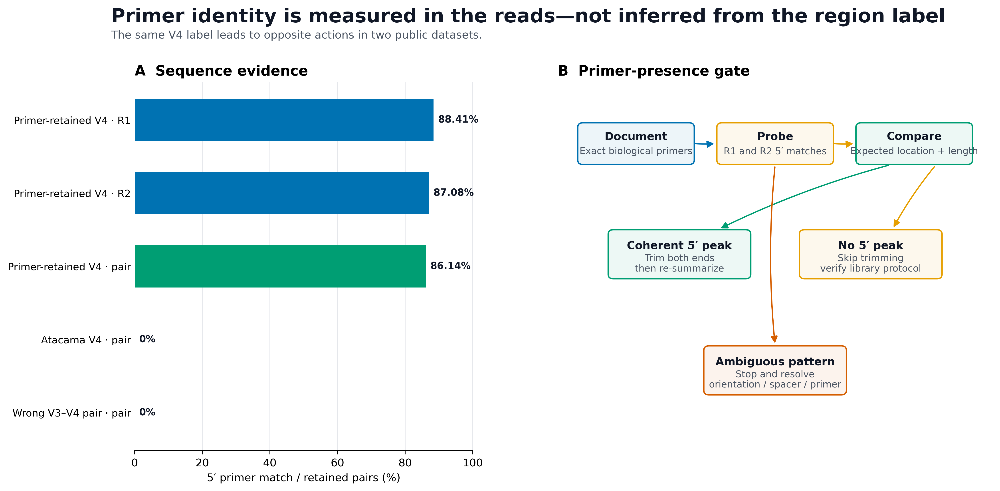
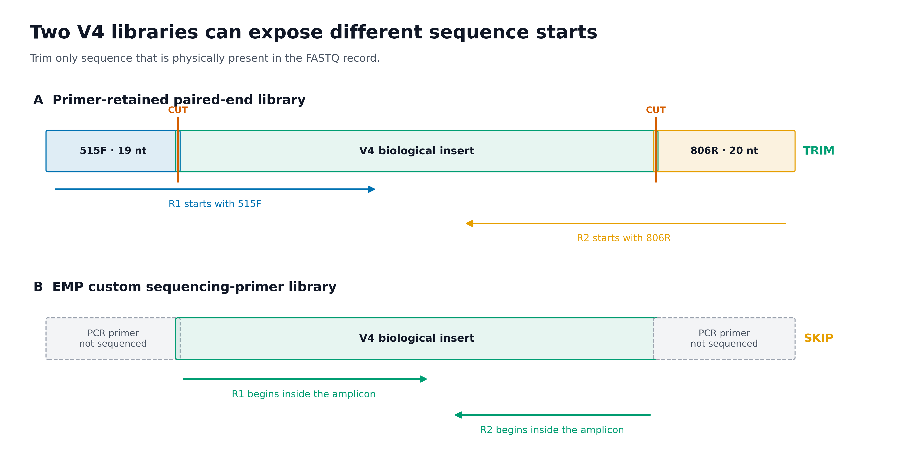
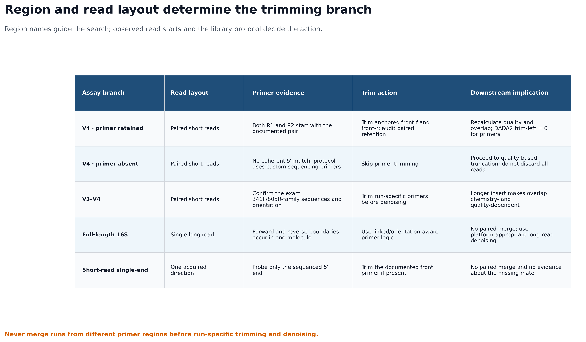

> **分析目标：**先用真实 reads 判断 PCR 引物是否仍位于 R1/R2 的 5′ 端，再选择“去引物”或“跳过去引物”分支；完整审计正确/错误引物、锚定/非锚定搜索、成对保留率、长度变化和 QIIME 2 provenance。  
> **输入文件：**4 个样本、每样本 2,500 对的真实 MiSeq V4 FASTQ；另用 2,000 对真实 Atacama EMP reads 验证“同为 V4 但无需去引物”的分支。  
> **预计资源：**示例输入约 2.5 MB；固定环境中的 50 项完整验收约 6–8 分钟，峰值内存低于 2 GB。完整研究的耗时和临时磁盘近似随 reads 数增加。  
> **执行策略：**导入、探针搜索、`q2-cutadapt`、Artifact 校验、provenance 审计与出图已一次性实跑；网页渲染使用 `eval: false`，避免每次构建重复执行上游处理。

## 去引物前，先确认扩增区域和读长结构 {#sec-target}

去引物通常不会成为论文主图，却会决定 ASV 是否仍携带技术序列、双端 reads 是否还能合并，以及不同批次能否进入同一条分析链。建议把下面四类证据保存在补充材料或内部审计中：

1. **Primer-presence gate**：不同引物假设在真实 reads 上的命中率；
2. **Paired retention audit**：每个样本有多少 read pairs 因双端引物规则被保留；
3. **Read architecture**：PCR 引物与实际测序起点之间的关系；
4. **Region/layout decision matrix**：V4、V3–V4、全长和单双端数据分别走哪条分支。

{#fig-primer-presence-gate}

{#fig-trimming-retention-audit}

{#fig-primer-read-architecture}

{#fig-region-branch-decision}

::: {.callout-important title="先记住一句话"}
**“V4”不等于“FASTQ 一定含 515F/806R”。先看真实 read 起点，再决定是否 trimming；在证据出现之前，不要打开 `discard-untrimmed`。**
:::

本次固定实测得到：

```text
QIIME 2 / q2cli / q2-cutadapt: 2026.4.0
Cutadapt:                       5.2

Primer-retained V4 data:
  Samples:                      4
  Input read pairs:             10,000
  Anchored R1 primer matches:   8,841
  Anchored R2 primer matches:   8,708
  Retained pairs:               8,614 (86.14%)
  Per-sample retention:         72.40%–93.88%
  Median input length:          249 nt / 249 nt
  Median output length:         230 nt / 229 nt

Sensitivity probes:
  Unanchored correct primers:   8,627 pairs (+13)
  Wrong V3–V4 primers:          0 pairs

Atacama EMP V4 excerpt:
  Input read pairs:             2,000
  Original 515F/806R matches:   0 / 0
  Decision:                     SKIP primer trimming

QIIME 2 provenance actions:     import → cutadapt.trim_paired
Required checks:                50 / 50 PASS
```

这组正例来自版本锁定的 [`nf-core/test-datasets`](https://github.com/nf-core/test-datasets/tree/f282ad2bafb3ca90190ec87290066ee1985df655/testdata) MiSeq v2 原始 FASTQ，并与 [`nf-core/ampliseq 2.18.0`](https://nf-co.re/ampliseq/2.18.0/) 测试配置中的 515F (Parada) / 806R (Apprill) 序列对应。该仓库没有为这 8 个技术测试文件单独附上生物学研究 accession，因此它们只用于验证引物处理和保留统计，不用于生物学推断。

负例来自 QIIME 2 Atacama soils 1% paired-end 数据。其原始研究考察干旱度对荒漠土壤微生物组的影响；这里使用确定性抽取的 2,000 对 reads，只验证“已从扩增子内部开始测序”的处理分支，不重新解释研究结论。[Neilson et al., 2017](https://doi.org/10.1128/mSystems.00195-16)

## 理论：为什么这么做 {#sec-theory}

### 1. 引物名称只是标签，序列才是计算输入

“515F/806R”在不同年代和协议中可能指向不同退化碱基版本。Earth Microbiome Project（EMP）列出的两组 V4 序列为：

| Primer version | Forward primer, 5′→3′ | Reverse primer, 5′→3′ |
|---|---|---|
| Updated: 515F (Parada) / 806R (Apprill) | `GTGYCAGCMGCCGCGGTAA` | `GGACTACNVGGGTWTCTAAT` |
| Original: 515F / 806R | `GTGCCAGCMGCCGCGGTAA` | `GGACTACHVGGGTWTCTAAT` |

`Y`、`M`、`N`、`V`、`W`、`H` 都是 IUPAC 退化碱基。若把它们当普通字符，或擅自改成一个具体碱基，会系统性漏掉本应匹配的类群。EMP 也明确提醒：**不要只看 primer name，必须核对完整序列。**

同理，“V3–V4”也不是唯一的一对字符串。341F 常与 785R、805R 或 806R 家族成员组合；接头、heterogeneity spacer、linker 和测序引物还可能改变 FASTQ 的前缀结构。必须从 wet-lab sheet、测序中心说明或论文补充方法取得本次 run 的 5′→3′ 序列。

### 2. PCR 引物参与建库，不代表它一定成为 FASTQ 的前 20 个碱基

PCR primer 决定扩增边界；sequencing primer 决定仪器从哪个位置开始识别碱基。两者可能相同，也可能不同。

**常规 primer-retained library**

```text
R1: 515F + biological insert ------------------->
R2: 806R + biological insert <-------------------
```

这种情况下，R1 的 5′ 端应命中 forward primer，R2 的 5′ 端应命中 reverse primer。去掉引物后，示例数据的中位长度由 249/249 nt 变成 230/229 nt，正好对应 19/20 nt 的引物长度。

**EMP custom sequencing-primer library**

EMP 的 Read 1 / Read 2 sequencing primer 本身含有 PCR primer、pad 和 linker。测序延伸从这些 oligo 的 3′ 端之后开始，因此被识别并写入 FASTQ 的第一个碱基已经位于扩增子内部。Atacama 的实际 reads 对原始 515F/806R 锚定探针为 0/2,000；若此时强制 `--discard-untrimmed`，会把全部数据清空。

因此需要同时核对：

- PCR primer；
- sequencing primer；
- adapter / linker / spacer 构造；
- reads 是否由测序中心预先 trimming；
- 实际 R1/R2 的 5′ 序列。

### 3. R1 与 R2 使用的是“各自 FASTQ 中实际出现的方向”

对短扩增子 paired-end reads，Cutadapt 的基本写法是：

```bash
-g '^FWDPRIMER' -G '^REVPRIMER'
```

其中：

- 小写 `-g` / QIIME 2 `front-f` 搜索 R1 的 5′ 端；
- 大写 `-G` / QIIME 2 `front-r` 搜索 R2 的 5′ 端；
- 本例 R2 开头实际是 `GGACTAC...`，因此 `front-r` 直接写 `GGACTACNVGGGTWTCTAAT`；
- 不要因为文件名是 R2 就无条件先做 reverse complement。

反向互补只在 read-through 或 linked-adapter 表达式中按结构需要加入。例如 Cutadapt 对可能读穿整个短扩增子的建议形式是：

```text
R1: ^FWDPRIMER...RCREVPRIMER
R2: ^REVPRIMER...RCFWDPRIMER
```

这里的 `RCREVPRIMER` 与 `RCFWDPRIMER` 必须由使用者明确提供；Cutadapt 不会替你自动反向互补。若 reads 长度不可能读到另一端，就只处理两个 5′ front primers，避免让多余的 3′ 搜索制造误匹配。

### 4. `^`、minimum overlap 与 error rate 共同定义“命中”

本例主分析采用：

```text
5′ anchor:          ^
minimum overlap:    15 nt
maximum error rate: 0.10
adapter wildcards:  enabled
read wildcards:     disabled
indels:             enabled
```

含义如下：

- `^` 把“引物应位于 read 起点”写成可检验假设；
- `overlap = 15` 要求 19/20 nt 引物至少有 15 nt 参与比对，降低短随机片段命中；
- `error_rate = 0.10` 允许测序误差和有限 indel，但不是允许任意错配；
- adapter 端解释 IUPAC 退化碱基；
- read 中的 `N` 不充当通配符，避免低质量未知碱基轻易“匹配”引物。

这些不是所有研究的固定参数。短引物、长 spacer、引物前残留条形码、非零长度异质性 spacer，都可能需要不同模型。参数应由文库结构决定，并通过正对照、空白和逐样本统计验证。

去掉 `^` 后，本例多保留 13 对 reads：

| Search mode | Retained pairs | Retention |
|---|---:|---:|
| Correct primers, anchored | 8,614 | 86.14% |
| Correct primers, unanchored | 8,627 | 86.27% |

这 13 对只能作为“值得复核”的敏感性差异，不能自动判为更好。若协议说明引物必须位于第一个碱基，非锚定命中可能来自 read 内部相似片段、前置 spacer，或上游处理不一致。

### 5. `discard-untrimmed` 是成对过滤器，不是无害开关

paired-end 模式下，Cutadapt 默认按 pair 过滤。使用两端 front primer 和 `--discard-untrimmed` 时，只要 R1 或 R2 未满足命中条件，整对 reads 就不进入输出。

本例样本 `1` 中：

```text
R1 matches:      1,839 / 2,500
R2 matches:      1,819 / 2,500
Retained pairs:  1,810 / 2,500
```

最终 1,810 不是 R1 或 R2 命中数的简单平均，而是双端共同满足规则的 pair 数。正因如此，推荐两步执行：

1. 用 `--action=none` 或不启用 discard 的方式做**非破坏性探针**；
2. 只有当序列、方向、样本分布和协议互相支持时，才运行真正 trimming，并审计每个样本的 pair retention。

::: {.callout-warning title="不存在通用的“80% 引物命中率及格线”"}
引物命中率取决于上游是否预剪切、测序起点、正反向质量、spacer、非特异扩增和对照设计。72.4% 可以暴露某个样本的异常，但不能仅凭一个全局百分比自动删除；0% 也可能是正确的 SKIP 分支。判断必须回到协议和逐样本证据。
:::

### 6. 错误区域引物是一个必要的负对照

把一组 341F/805R-family V3–V4 序列错误地用于本例 V4 reads，锚定搜索保留：

```text
0 / 10,000 read pairs
```

这说明区域假设可以被真实 reads 否证。反过来，如果“错误区域”也得到大量命中，应检查：

- 是否使用了过短 overlap；
- 是否取消锚定后在 read 内部找到相似片段；
- 是否混入多个 amplicon panel；
- 是否存在 spacer / inline barcode；
- 是否把 adapter 当成 primer；
- 文件是否来自预期 run。

### 7. V4、V3–V4、全长和单双端不能共用一套 trimming 逻辑

| Assay branch | Read layout | Primer evidence | Recommended action | Downstream consequence |
|---|---|---|---|---|
| V4, primer retained | Paired short reads | R1/R2 5′ 端分别命中记录的 primer pair | 锚定 trimming；审计 paired retention | 重新查看质量和 overlap；DADA2 不再重复 trim primer |
| V4, primer absent | Paired short reads | 无一致 5′ 命中，协议证明从扩增子内部测序 | 跳过去引物 | 直接进入质量截断；不能把所有 reads 丢掉 |
| V3–V4 | Paired short reads | 核对本 run 的 341F/805R-family 序列与方向 | 按 run 去引物后再 denoise | 插入片段更长，merge 对截断长度更敏感 |
| Full-length 16S | Single long read | 一条 molecule 中可能出现两端边界 | linked / orientation-aware trimming | 不做 paired merge；使用适配平台的长读长 denoising |
| Short-read single-end | One acquired direction | 只能检查实际测得的一端 | 若存在，仅去该端 front primer | 无法证明缺失 mate 的引物状态，也不做 paired merge |

不同区域的 reads 不应在去引物和 denoising 前混在一起。区域不同意味着可观察的分类位点、扩增偏倚、参考序列裁剪范围和 ASV 序列空间都不同。即使最终需要跨 run 汇总，也应先按区域独立完成 trimming、denoising 和分类，再在明确可比的分类层级上设计整合分析。

<details>
<summary><strong>深入：何时需要 linked adapter</strong></summary>

若 read 长度足以穿过整个扩增子，R1 除了 5′ forward primer，还可能在 3′ 端读到 reverse primer 的反向互补；R2 同理。此时只剪 5′ primer 会在 read 尾部留下另一端技术序列。

Cutadapt 的 linked adapter 用 `...` 把必需的 5′ 部分和另一端部分连接。是否要求两端都出现、是否允许其中一端缺失、pair filtering 使用 `any`、`both` 还是 `first`，都会改变保留集合。必须用已知构造或 mock community 验证，不能把短读长命令机械搬到全长 16S/PacBio/ONT。

对长读长数据还要额外考虑：

- molecule 方向是否混合；
- concatemer 或多次扩增子串联；
- primer 是否允许反向互补搜索；
- full-length 长度窗口；
- 平台特异的质量模型和 chimera 处理。

</details>

## 准备工作 {#sec-setup}

<details>
<summary><strong>展开：安装环境、下载真实数据和定义作图函数</strong></summary>

### 1. 安装固定环境

从项目根目录创建 QIIME 2 2026.4 环境：

```{bash}
mamba env create \
  --name microbiome-qiime2-2026.4 \
  --file env/qiime2.yml

conda run -n microbiome-qiime2-2026.4 qiime info
conda run -n microbiome-qiime2-2026.4 cutadapt --version
```

本页验收锁定：

```text
QIIME 2 release: 2026.4
q2-cutadapt:      2026.4.0
Cutadapt:         5.2
```

如果只运行命令行处理，不需要 R；若要重绘出版图，安装：

```{r}
install.packages(c(
  "ggplot2", "dplyr", "readr", "tidyr", "scales", "tibble"
))
```

### 2. 下载 primer-retained V4 FASTQ

以下 8 个 gzip 文件从固定 commit 原样复制，没有抽样或改写：

```{bash}
mkdir -p data/small/primer-trimming

base_url="https://raw.githubusercontent.com/nf-core/test-datasets/f282ad2bafb3ca90190ec87290066ee1985df655/testdata"

for file in \
  1_S103_L001_R1_001.fastq.gz \
  1_S103_L001_R2_001.fastq.gz \
  1a_S103_L001_R1_001.fastq.gz \
  1a_S103_L001_R2_001.fastq.gz \
  2_S115_L001_R1_001.fastq.gz \
  2_S115_L001_R2_001.fastq.gz \
  2a_S115_L001_R1_001.fastq.gz \
  2a_S115_L001_R2_001.fastq.gz
do
  curl -fL \
    "${base_url}/${file}" \
    -o "data/small/primer-trimming/${file}"
done

sha256sum -c <<'SHA256'
6121840c7f58f9992a4ed8fbd83d1e84497305481682ccaaa4e05f77f65c037e  data/small/primer-trimming/1_S103_L001_R1_001.fastq.gz
96dfe650ec086ece5256b7315e7edbe4665b0ceba251481bd23bd5b0fefd4ab5  data/small/primer-trimming/1_S103_L001_R2_001.fastq.gz
f677b902d2a9c5ff3144651b21e111574fec06b46e8d4e8b9871f28c6ca7e7c0  data/small/primer-trimming/1a_S103_L001_R1_001.fastq.gz
b473d9f1fc992f0f7b990d309f94db5c9b5205cd66cd9d8af18906b41c04ad18  data/small/primer-trimming/1a_S103_L001_R2_001.fastq.gz
4ef3dcca02628627ac89051f0df5dd341ce1d87b34c04f7403576b70c17705a0  data/small/primer-trimming/2_S115_L001_R1_001.fastq.gz
a26d7b7afc45d74f232bc719ea612cf22cb788252bb36b1e0bffe1d86e556ba2  data/small/primer-trimming/2_S115_L001_R2_001.fastq.gz
a8fe1286b639346356cec5fc8f1617778e14e04ac997ad02cbf2b71b15d16ff0  data/small/primer-trimming/2a_S115_L001_R1_001.fastq.gz
42fc33921fcb3cb4a1d820b72d0804ad82f51b53e2133999e12a8d7c1b2240bf  data/small/primer-trimming/2a_S115_L001_R2_001.fastq.gz
SHA256
```

查看真实 FASTQ 结构：

```{bash}
gzip -cd \
  data/small/primer-trimming/1_S103_L001_R1_001.fastq.gz |
  sed -n '1,8p'
```

前两条 R1 记录的结构为：

```text
@SRR10070132.1.1 1 length=35
NNNNNNNNNNNNNNNNNNNNNNNNNNNNNNNNNNN
+
###################################
@SRR10070132.2.1 2 length=249
GTGTCAGCAGCCGCGGTAATACGTAGGGTGCGAGCGTTAAT...
+
AABBBFFFDFFAGGGGGGGGGGHFHHGGA2E2EFGGGG1...
```

第二条 read 以 `GTGTCAGCMGCCGCGGTAA` 的实际变体开头；退化位点 `Y` 可匹配这里的 `T`。第一条全为 `N`，会自然成为未命中记录，这也解释了为什么不能期待所有 reads 都通过 primer gate。

### 3. 获取 Atacama “primer absent” 对照

仓库中的 `data/small/fastq/forward.fastq.gz` 和 `reverse.fastq.gz` 是从官方 135,487 对 1% 数据中等间距、保持顺序地抽取 2,000 对。若需从来源重建：

```{bash}
mkdir -p downloads/atacama-1p

curl -fL \
  https://data.qiime2.org/2024.5/tutorials/atacama-soils/1p/forward.fastq.gz \
  -o downloads/atacama-1p/forward.fastq.gz
curl -fL \
  https://data.qiime2.org/2024.5/tutorials/atacama-soils/1p/reverse.fastq.gz \
  -o downloads/atacama-1p/reverse.fastq.gz
curl -fL \
  https://data.qiime2.org/2024.5/tutorials/atacama-soils/1p/barcodes.fastq.gz \
  -o downloads/atacama-1p/barcodes.fastq.gz
curl -fL \
  https://data.qiime2.org/2024.5/tutorials/atacama-soils/sample_metadata.tsv \
  -o downloads/atacama-1p/sample_metadata.tsv

python3 scripts/prepare_fastq_excerpt.py \
  --forward downloads/atacama-1p/forward.fastq.gz \
  --reverse downloads/atacama-1p/reverse.fastq.gz \
  --barcodes downloads/atacama-1p/barcodes.fastq.gz \
  --metadata downloads/atacama-1p/sample_metadata.tsv \
  --output-dir data/small/fastq \
  --records 2000
```

来源和摘录 SHA-256 均记录于 `data/small/fastq/source_summary.json`。

### 4. 内联出版级作图函数

```{r}
library(ggplot2)
library(dplyr)
library(readr)
library(tidyr)
library(scales)

set.seed(20260719)

pal_pub <- c(
  "#0072B2", "#D55E00", "#009E73", "#CC79A7",
  "#E69F00", "#56B4E9", "#F0E442", "#999999"
)

scale_color_pub <- function(...) {
  ggplot2::scale_color_manual(values = pal_pub, ...)
}

scale_fill_pub <- function(...) {
  ggplot2::scale_fill_manual(values = pal_pub, ...)
}

theme_pub <- function(base_size = 12) {
  ggplot2::theme_bw(base_size = base_size, base_family = "sans") +
    ggplot2::theme(
      panel.grid.major.x = ggplot2::element_blank(),
      panel.grid.minor = ggplot2::element_blank(),
      axis.text = ggplot2::element_text(color = "black"),
      axis.ticks = ggplot2::element_line(
        color = "black",
        linewidth = 0.3
      ),
      plot.title = ggplot2::element_text(
        face = "bold",
        color = "#111827"
      ),
      plot.subtitle = ggplot2::element_text(color = "#4B5563"),
      legend.key = ggplot2::element_blank(),
      legend.background = ggplot2::element_rect(
        fill = scales::alpha("white", 0.85),
        color = NA
      )
    )
}

save_pub <- function(
  plot,
  file_base,
  width = 170,
  height = 105,
  units = "mm",
  dpi = 350
) {
  dir.create(dirname(file_base), recursive = TRUE, showWarnings = FALSE)
  ggplot2::ggsave(
    paste0(file_base, ".pdf"),
    plot,
    width = width,
    height = height,
    units = units,
    device = grDevices::cairo_pdf
  )
  ggplot2::ggsave(
    paste0(file_base, ".png"),
    plot,
    width = width,
    height = height,
    units = units,
    dpi = dpi,
    bg = "white"
  )
  ggplot2::ggsave(
    paste0(file_base, ".tiff"),
    plot,
    width = width,
    height = height,
    units = units,
    dpi = dpi,
    compression = "lzw",
    bg = "white"
  )
}
```


</details>

## 可复制代码 {#sec-code}

### 1. 先做非破坏性 5′ primer probe

定义本 run 的实际引物：

```{bash}
FWD_PRIMER="GTGYCAGCMGCCGCGGTAA"
REV_PRIMER="GGACTACNVGGGTWTCTAAT"

mkdir -p work/11-primer-trimming/probes
```

先对一个样本运行 `--action=none`。这会执行匹配和生成 JSON，但不剪切序列，也不丢弃未命中 pairs：

```{bash}
conda run -n microbiome-qiime2-2026.4 \
  cutadapt \
  --cores 1 \
  --error-rate 0.1 \
  --overlap 15 \
  --front "^${FWD_PRIMER}" \
  -G "^${REV_PRIMER}" \
  --action none \
  --json work/11-primer-trimming/probes/sample-1.json \
  --output work/11-primer-trimming/probes/sample-1.R1.fastq.gz \
  --paired-output work/11-primer-trimming/probes/sample-1.R2.fastq.gz \
  data/small/primer-trimming/1_S103_L001_R1_001.fastq.gz \
  data/small/primer-trimming/1_S103_L001_R2_001.fastq.gz
```

从 JSON 读取输入数和双端命中数：

```{python}
import json
from pathlib import Path

report = json.loads(
    Path(
        "work/11-primer-trimming/probes/sample-1.json"
    ).read_text()
)

counts = report["read_counts"]
print({
    "input_pairs": counts["input"],
    "r1_with_primer": counts["read1_with_adapter"],
    "r2_with_primer": counts["read2_with_adapter"],
    "output_pairs": counts["output"],
})
```

`--action=none` 阶段的 `output_pairs` 仍等于输入数；此时重点检查两端命中是否与协议一致，而不是把它误读成 trimming retention。

对 Atacama 做同样的原始 V4 引物探针：

```{bash}
ATACAMA_FWD="GTGCCAGCMGCCGCGGTAA"
ATACAMA_REV="GGACTACHVGGGTWTCTAAT"

conda run -n microbiome-qiime2-2026.4 \
  cutadapt \
  --cores 1 \
  --error-rate 0.1 \
  --overlap 15 \
  --front "^${ATACAMA_FWD}" \
  -G "^${ATACAMA_REV}" \
  --action none \
  --json work/11-primer-trimming/probes/atacama.json \
  --output work/11-primer-trimming/probes/atacama.R1.fastq.gz \
  --paired-output work/11-primer-trimming/probes/atacama.R2.fastq.gz \
  data/small/fastq/forward.fastq.gz \
  data/small/fastq/reverse.fastq.gz
```

观测到：

```text
Input pairs:       2,000
R1 primer matches: 0
R2 primer matches: 0
Decision:          SKIP
```

这里不能追加 `--discard-untrimmed`。0 命中与 EMP sequencing-primer 结构一致，正确操作是保留 reads，继续评估质量截断。

### 2. 导入 primer-retained paired-end FASTQ

这些文件符合 Casava 1.8 单 lane 命名规则。只把 FASTQ 放入导入目录，避免把 JSON 等旁文件混入 DirectoryFormat：

```{bash}
mkdir -p work/11-primer-trimming/casava

cp \
  data/small/primer-trimming/*_R1_001.fastq.gz \
  data/small/primer-trimming/*_R2_001.fastq.gz \
  work/11-primer-trimming/casava/

conda run -n microbiome-qiime2-2026.4 \
  qiime tools import \
  --type 'SampleData[PairedEndSequencesWithQuality]' \
  --input-path work/11-primer-trimming/casava \
  --input-format CasavaOneEightSingleLanePerSampleDirFmt \
  --output-path work/11-primer-trimming/nfcore-v4-demux.qza

conda run -n microbiome-qiime2-2026.4 \
  qiime tools validate \
  work/11-primer-trimming/nfcore-v4-demux.qza \
  --level max

conda run -n microbiome-qiime2-2026.4 \
  qiime tools peek \
  work/11-primer-trimming/nfcore-v4-demux.qza
```

预期：

```text
Type:        SampleData[PairedEndSequencesWithQuality]
Data format: SingleLanePerSamplePairedEndFastqDirFmt
Validation:  valid at level=max
```

先生成 trimming 前的质量摘要：

```{bash}
conda run -n microbiome-qiime2-2026.4 \
  qiime demux summarize \
  --i-data work/11-primer-trimming/nfcore-v4-demux.qza \
  --p-n 10000 \
  --o-visualization \
    work/11-primer-trimming/nfcore-v4-demux-summary.qzv
```

### 3. 用 `q2-cutadapt` 成对去引物

非破坏性探针已经支持“引物位于两个 mates 的第一个碱基”这一假设，因此主分析使用 5′ anchor 并启用成对丢弃：

```{bash}
conda run -n microbiome-qiime2-2026.4 \
  qiime cutadapt trim-paired \
  --i-demultiplexed-sequences \
    work/11-primer-trimming/nfcore-v4-demux.qza \
  --p-front-f '^GTGYCAGCMGCCGCGGTAA' \
  --p-front-r '^GGACTACNVGGGTWTCTAAT' \
  --p-error-rate 0.1 \
  --p-overlap 15 \
  --p-match-adapter-wildcards \
  --p-no-match-read-wildcards \
  --p-indels \
  --p-discard-untrimmed \
  --p-minimum-length 1 \
  --p-cores 1 \
  --o-trimmed-sequences \
    work/11-primer-trimming/nfcore-v4-trimmed.qza
```

逐个参数的责任：

| Parameter | Value | Why |
|---|---|---|
| `front-f` | `^GTGYCAGCMGCCGCGGTAA` | R1 必须从 updated 515F 开始 |
| `front-r` | `^GGACTACNVGGGTWTCTAAT` | R2 必须从 updated 806R 开始 |
| `error-rate` | `0.1` | 允许有限错配/indel |
| `overlap` | `15` | 避免过短随机命中 |
| adapter wildcards | on | 正确解释 primer 中 IUPAC |
| read wildcards | off | read 中 `N` 不作为通配符 |
| `discard-untrimmed` | on | 只在探针和协议均支持后启用 |
| `minimum-length` | `1` | 避免生成空 FASTQ record |

QIIME 2 的 `q2-cutadapt` 输出 Artifact 和 provenance，但详细的逐样本 match report 仍需直接读取 Cutadapt JSON 或另行审计。不要只看到 `.qza` 成功生成就跳过 retention table。

### 4. trimming 后重新做质量与长度审计

```{bash}
conda run -n microbiome-qiime2-2026.4 \
  qiime tools validate \
  work/11-primer-trimming/nfcore-v4-trimmed.qza \
  --level max

conda run -n microbiome-qiime2-2026.4 \
  qiime demux summarize \
  --i-data work/11-primer-trimming/nfcore-v4-trimmed.qza \
  --p-n 10000 \
  --o-visualization \
    work/11-primer-trimming/nfcore-v4-trimmed-summary.qzv

conda run -n microbiome-qiime2-2026.4 \
  qiime tools export \
  --input-path work/11-primer-trimming/nfcore-v4-trimmed.qza \
  --output-path work/11-primer-trimming/trimmed-fastq
```

本次逐样本结果为：

| Sample | Input pairs | Retained pairs | Discarded pairs | Retention |
|---|---:|---:|---:|---:|
| 1 | 2,500 | 1,810 | 690 | 72.40% |
| 1a | 2,500 | 2,219 | 281 | 88.76% |
| 2 | 2,500 | 2,347 | 153 | 93.88% |
| 2a | 2,500 | 2,238 | 262 | 89.52% |

长度审计为：

| Direction | Median before | Median after | Median removed |
|---|---:|---:|---:|
| R1 | 249 nt | 230 nt | 19 nt |
| R2 | 249 nt | 229 nt | 20 nt |

每个样本都得到同样的 19/20 nt 中位变化，支持“去掉的是预期引物，而非随机剪掉一段”的解释。下一步选择 DADA2 截断参数时，应查看 trimming **之后**的质量曲线，并把 primer 对应的 `trim-left-f/r` 设为 0，避免重复去除。

### 5. 做锚定与错误区域敏感性分析

主分析之外再执行两个探针：

```{bash}
# A. 正确 V4 primer，但不使用 5′ anchor
conda run -n microbiome-qiime2-2026.4 \
  cutadapt \
  --cores 1 \
  --error-rate 0.1 \
  --overlap 15 \
  --front 'GTGYCAGCMGCCGCGGTAA' \
  -G 'GGACTACNVGGGTWTCTAAT' \
  --discard-untrimmed \
  --output work/11-primer-trimming/unanchored.R1.fastq.gz \
  --paired-output work/11-primer-trimming/unanchored.R2.fastq.gz \
  data/small/primer-trimming/2_S115_L001_R1_001.fastq.gz \
  data/small/primer-trimming/2_S115_L001_R2_001.fastq.gz

# B. 错误的 V3–V4 primer hypothesis
conda run -n microbiome-qiime2-2026.4 \
  cutadapt \
  --cores 1 \
  --error-rate 0.1 \
  --overlap 15 \
  --front '^CCTACGGGNGGCWGCAG' \
  -G '^GACTACHVGGGTATCTAATCC' \
  --discard-untrimmed \
  --output work/11-primer-trimming/wrong-region.R1.fastq.gz \
  --paired-output work/11-primer-trimming/wrong-region.R2.fastq.gz \
  data/small/primer-trimming/2_S115_L001_R1_001.fastq.gz \
  data/small/primer-trimming/2_S115_L001_R2_001.fastq.gz
```

全 4 个样本的正式审计结果：

| Primer hypothesis | Search | Input pairs | Retained | Interpretation |
|---|---|---:|---:|---|
| Correct V4 | Anchored | 10,000 | 8,614 | Primary analysis |
| Correct V4 | Unanchored | 10,000 | 8,627 | 13 extra pairs require review |
| Wrong V3–V4 | Anchored | 10,000 | 0 | Reject hypothesis |
| Atacama original V4 | Anchored | 2,000 | 0 | Skip trimming |

### 6. 运行完整的 50 项验收

下面的可复用验证器会重新导入数据、运行 QIIME 2 与 12 个 Cutadapt 分支探针、校验 FASTQ 同步与长度、审计 provenance，并生成所有 TSV、JSON、日志和图：

```{bash}
MPLCONFIGDIR=/tmp/article11-matplotlib \
python3 scripts/validate_primer_trimming.py \
  --project-root . \
  --output-dir results/11-primer-trimming \
  --figure-dir figures \
  --qiime-env microbiome-qiime2-2026.4
```

验收通过时末尾为：

```text
status passed
positive_samples 4
positive_input_pairs 10000
positive_retained_pairs 8614
positive_retention_percent 86.14
wrong_region_retained_pairs 0
negative_input_pairs 2000
negative_retained_pairs 0
provenance_actions 2
checks_total 50
checks_passed 50
checks_failed 0
```

核心机器可读产物包括：

```text
results/11-primer-trimming/
├── nfcore-v4-demux.qza
├── nfcore-v4-demux-summary.qzv
├── nfcore-v4-trimmed.qza
├── nfcore-v4-trimmed-summary.qzv
├── primer-source-audit.tsv
├── primer-match-audit.tsv
├── trim-retention-audit.tsv
├── length-shift-audit.tsv
├── parameter-sensitivity.tsv
├── region-branch-decision.tsv
├── primer-provenance-audit.tsv
├── atacama-no-primer-probe.log
├── qiime-cutadapt.log
├── primer-summary.json
└── validation.log
```

`.qza` 的 UUID 每次运行会变化，因此不要求 Artifact archive SHA-256 跨运行一致。稳定验收对象是输入 FASTQ 哈希、semantic type、data format、参数、provenance action、样本数、read counts、长度变化和所有审计表。

## 出版级美化 {#sec-publication}

### 1. 主图优先展示逐样本 retention，而不是只报全局平均

```{r}
retention <- readr::read_tsv(
  "results/11-primer-trimming/trim-retention-audit.tsv",
  show_col_types = FALSE
)

p_retention <- ggplot(
  retention,
  aes(
    x = reorder(sample_id, retention_percent),
    y = retention_percent
  )
) +
  geom_col(
    width = 0.68,
    fill = pal_pub[1],
    color = "white",
    linewidth = 0.3
  ) +
  geom_text(
    aes(
      label = sprintf(
        "%.1f%%\n%s / %s",
        retention_percent,
        scales::comma(retained_pairs),
        scales::comma(input_pairs)
      )
    ),
    vjust = -0.25,
    size = 3.4,
    lineheight = 0.95
  ) +
  scale_y_continuous(
    limits = c(0, 105),
    breaks = seq(0, 100, 20),
    labels = \(x) paste0(x, "%"),
    expand = expansion(mult = c(0, 0))
  ) +
  labs(
    x = "Sample",
    y = "Paired reads retained",
    title = "Primer trimming retention must be audited per sample",
    subtitle = paste0(
      "Anchored 515F/806R search; ",
      "both mates are required for pair retention"
    )
  ) +
  theme_pub(12)

save_pub(
  p_retention,
  "figures/11-retention-redraw",
  width = 170,
  height = 105
)
```

图内只使用英文，百分比旁同时给出 `retained / input`，避免隐藏小样本量。若研究含几十到几百个样本，改画：

- 按 batch/run 分面的 retention dot plot；
- retention 分布 + 预先定义的 QC 标记；
- R1/R2 primer-match 差值；
- trimming 前后 read-length ridge/violin plot。

### 2. 把技术结论写进图注

推荐图注模板：

```text
Paired-read retention after anchored 5′ primer removal.
Reads were required to match the documented 515F (Parada)
and 806R (Apprill) sequences in R1 and R2, respectively
(minimum overlap, 15 nt; maximum error rate, 0.10).
Labels show retained/input read pairs. No universal retention
cutoff was applied; sample-level deviations were reviewed
against the library protocol and controls.
```

不要只写“Cutadapt results”。图注至少要包含：

- 引物完整序列或明确版本；
- 方向与是否锚定；
- overlap 与 error rate；
- pair filtering 规则；
- trimming 前后数据量；
- 异常样本如何处置。

### 3. 三种格式承担不同任务

- PDF：矢量文字和线条，优先用于排版；
- PNG：网页和公众号预览，本页使用 350 dpi；
- TIFF：期刊要求位图时使用 LZW 压缩；
- 所有图内分组、轴、图例和注释均使用英文，避免跨环境字体缺失。

## 常见坑 {#sec-pitfalls}

::: {.callout-caution title="审稿人最容易追问的 14 个问题"}
1. **只写“V4”而不报告序列。** Primer name 不能区分原始版、Parada/Apprill 版和实验室变体。
2. **把 reverse primer 无条件 reverse-complement 后传给 `front-r`。** 应先查看 R2 FASTQ 实际 5′ 起点。
3. **没做探针就启用 `discard-untrimmed`。** 参数错一次就可能清空整个 run。
4. **只检查 R1。** R2 引物错误或质量差会改变 paired retention 和后续 merge。
5. **把 IUPAC 字符当普通碱基。** 会漏掉 primer 设计本来允许的变体。
6. **让 read 中的 `N` 充当通配符。** 低质量 reads 可能被误判为 primer-positive。
7. **沿用 Cutadapt 默认 3-nt overlap。** 对 19/20-nt primer，过短命中更容易来自随机序列。
8. **为提高保留率随意取消 5′ anchor。** 非锚定多出的 reads 必须结合 spacer 和协议解释。
9. **把全局保留率当成样本删除阈值。** 必须报告逐样本、逐方向和对照分布。
10. **去引物后仍在 DADA2 里重复 `trim-left` 同样长度。** 会额外剪掉生物序列。
11. **去引物前选定 DADA2 truncation。** 引物移除会改变可用长度和 paired overlap。
12. **把 V4、V3–V4 或不同 primer batch 直接合并 denoise。** ASV 序列空间和扩增偏倚不可直接等同。
13. **把技术测试 FASTQ 当成生物学数据。** 本页 nf-core 文件缺少独立研究 accession，只支持流程验证。
14. **只保存最终 FASTQ。** 应同时保存输入哈希、命令、JSON/log、逐样本 retention、长度变化和 provenance。
:::

::: {.callout-tip title="快速定位“0 reads retained”"}
按顺序检查：文件是否已预剪切 → 引物完整序列 → R1/R2 方向 → spacer/inline barcode → `^` 是否合理 → IUPAC 设置 → overlap/error rate → paired filter。不要先通过放宽所有参数来“救回”reads。
:::

## 这段 Methods 怎么写 {#sec-methods}

### Primer-retained paired-end 示例

```text
Demultiplexed paired-end reads were screened for the exact
library-specific primer sequences before denoising. The updated
515F (Parada; 5′-GTGYCAGCMGCCGCGGTAA-3′) and 806R
(Apprill; 5′-GGACTACNVGGGTWTCTAAT-3′) primers were removed
from the 5′ ends of R1 and R2, respectively, using the QIIME 2
q2-cutadapt plugin (version 2026.4.0; Cutadapt version 5.2).
Primer matches were anchored to the read start, IUPAC wildcards
were interpreted in the primer sequences but not in the reads,
the minimum adapter overlap was 15 nt, and the maximum error
rate was 0.10. Read pairs were retained only when the required
primer evidence was present in both mates. Of 10,000 input read
pairs, 8,614 (86.14%) were retained; sample-level retention
ranged from 72.40% to 93.88%. Median read lengths changed from
249/249 nt to 230/229 nt for R1/R2. Quality profiles and
paired-end overlap were reassessed after primer removal, and no
additional primer-length trimming was applied during denoising.
```

### Primer-absent 示例

```text
The library was documented as a V4 515F/806R assay; however,
the sequencing-primer design initiated base calling downstream
of the PCR primer sites. An anchored, IUPAC-aware search for the
documented original 515F and 806R sequences detected no 5′
primer matches in either mate among 2,000 synchronized read
pairs. Primer trimming and untrimmed-read discarding were
therefore not applied. Subsequent quality truncation parameters
were selected from the observed post-demultiplexing read-quality
profiles.
```

替换成自己的研究时，至少修改：

- primer 名称与完整 5′→3′ 序列；
- 软件和 plugin 版本；
- anchor、overlap、error rate、wildcard、indel 和 pair-filter 参数；
- 输入/保留 pairs 与逐样本范围；
- trimming 前后长度；
- 异常样本和 controls 的处理；
- primer absent 时的协议证据。

## 换成你自己的数据怎么做 {#sec-own-data}

### 1. 先建立 run-level primer sheet

每个测序 run 至少记录：

| Field | Example |
|---|---|
| `run_id` | `MiSeq_Run_01` |
| `region` | `V4` |
| `layout` | `paired-end` |
| `forward_primer_5to3` | `GTGYCAGCMGCCGCGGTAA` |
| `reverse_primer_5to3` | `GGACTACNVGGGTWTCTAAT` |
| `spacer` | `none` |
| `primer_expected_in_fastq` | `yes` |
| `source` | wet-lab sheet / sequencing-center protocol |

不要只在文件名中写 `V4`。如果两个 run 的任何 primer sequence、spacer 或 read layout 不同，先作为独立分支处理。

### 2. 只改路径和本 run 的序列

```{bash}
INPUT_R1="raw/Sample01_R1.fastq.gz"
INPUT_R2="raw/Sample01_R2.fastq.gz"
FWD_PRIMER="GTGYCAGCMGCCGCGGTAA"
REV_PRIMER="GGACTACNVGGGTWTCTAAT"
RUN_ID="MiSeq_Run_01"

mkdir -p "work/primer-probe/${RUN_ID}"

conda run -n microbiome-qiime2-2026.4 \
  cutadapt \
  --cores 1 \
  --error-rate 0.1 \
  --overlap 15 \
  --front "^${FWD_PRIMER}" \
  -G "^${REV_PRIMER}" \
  --action none \
  --json "work/primer-probe/${RUN_ID}/probe.json" \
  --output "work/primer-probe/${RUN_ID}/unchanged.R1.fastq.gz" \
  --paired-output "work/primer-probe/${RUN_ID}/unchanged.R2.fastq.gz" \
  "${INPUT_R1}" \
  "${INPUT_R2}"
```

先抽查若干样本，再覆盖全 run。至少输出：

- 每个样本的输入 pairs；
- R1/R2 primer matches；
- 双端共同命中的 pairs；
- trimming retention；
- 长度变化；
- 按 extraction plate、PCR plate 和 sequencing run 分层的分布。

### 3. 按证据选择分支

```text
Documented primers + coherent 5′ matches
  └─ TRIM → audit pair retention → redraw quality → choose denoising lengths

Documented primers + no 5′ matches + protocol says primers not sequenced
  └─ SKIP → preserve reads → choose quality truncation

Documented primers + no 5′ matches + protocol says primers should be present
  └─ STOP → investigate sequence, orientation, spacer, preprocessing, and files

Multiple regions or primer batches
  └─ SPLIT → trim and denoise per run/region → integrate only at justified level
```

::: {.callout-important title="进入下一步前的最小验收"}
只有在 primer sheet、非破坏性 probe、逐样本 retention、长度变化和 provenance 都已保存后，才进入 denoising。去引物后的 R1/R2 质量曲线与理论 overlap 将直接决定下一步 DADA2 的 `trunc-len-f/r`；不能沿用 trimming 前的坐标。
:::

## 参考 {#sec-references}

- [QIIME 2 Library: q2-cutadapt 2026.4.0](https://library.qiime2.org/plugins/qiime2/q2-cutadapt/overview)
- [Cutadapt 5.2 documentation: primer trimming and linked adapters](https://cutadapt.readthedocs.io/en/stable/recipes.html)
- [Martin M. Cutadapt removes adapter sequences from high-throughput sequencing reads. *EMBnet.journal*. 2011.](https://doi.org/10.14806/ej.17.1.200)
- [Earth Microbiome Project 16S Illumina Amplicon Protocol](https://earthmicrobiome.org/protocols-and-standards/16s/)
- [nf-core/test-datasets pinned MiSeq v2 FASTQ source](https://github.com/nf-core/test-datasets/tree/f282ad2bafb3ca90190ec87290066ee1985df655/testdata)
- [nf-core/ampliseq 2.18.0 documentation](https://nf-co.re/ampliseq/2.18.0/)
- [Straub D, et al. Interpretations of environmental microbial community studies are biased by the selected 16S rRNA gene amplicon sequencing pipeline. *Front Microbiol*. 2020.](https://doi.org/10.3389/fmicb.2020.550420)
- [Walters W, et al. Improved bacterial 16S rRNA gene V4/V4–V5 primers for microbial community surveys. *mSystems*. 2016.](https://doi.org/10.1128/mSystems.00009-15)
- [Parada AE, et al. Every base matters: assessing SSU rRNA primers for marine microbiomes. *Environ Microbiol*. 2016.](https://doi.org/10.1111/1462-2920.13023)
- [Apprill A, et al. Minor revision to the V4 806R primer increases detection of SAR11. *Aquat Microb Ecol*. 2015.](https://doi.org/10.3354/ame01753)
- [Klindworth A, et al. Evaluation of general 16S rRNA gene PCR primers. *Nucleic Acids Res*. 2013.](https://doi.org/10.1093/nar/gks808)
- [Neilson JW, et al. Significant impacts of increasing aridity on the arid soil microbiome. *mSystems*. 2017.](https://doi.org/10.1128/mSystems.00195-16)
