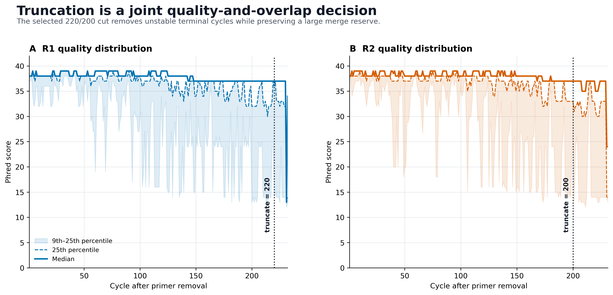
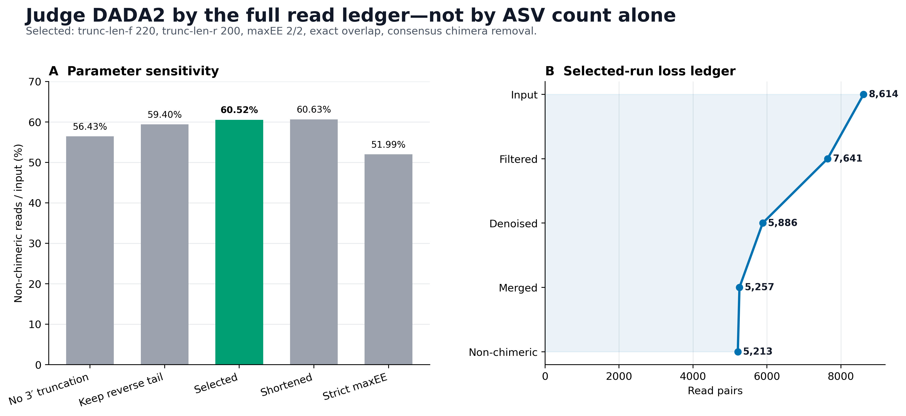
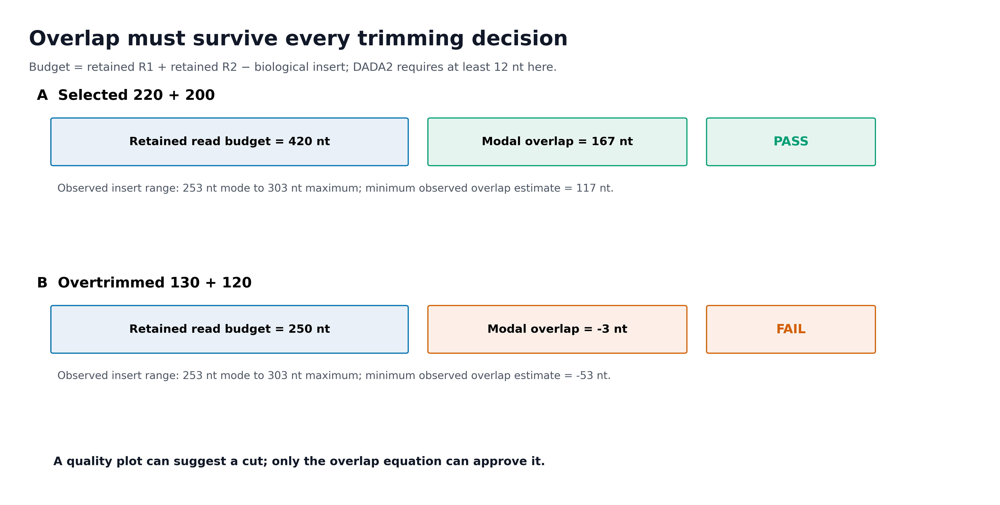
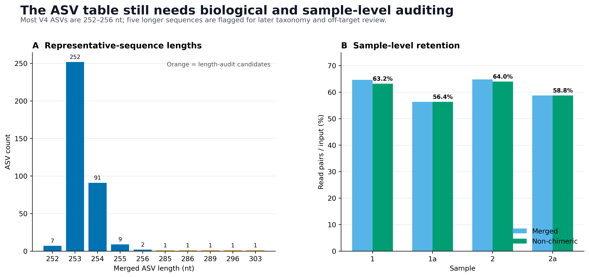

> **分析目标：**从 primer-trimmed 双端 FASTQ 的质量分布和扩增子长度出发，确定 DADA2 的截断、expected-error、拼接和去嵌合体参数，得到可审计的 ASV 表与代表序列。  
> **输入文件：**4 个真实 MiSeq V4 样本；每个样本原始 2,500 对 reads，去引物后共 8,614 对。正文包含从下载、导入、去引物到 DADA2 的完整命令。  
> **预计资源：**示例数据约 2.5 MB；单个主参数分支通常 1–2 分钟，5 组敏感性分析与 Artifact 验收约 5–7 分钟，峰值内存低于 2 GB。真实项目的耗时和临时磁盘随 reads 数与样本数增加。  
> **执行策略：**QIIME 2、5 组 DADA2 参数、预期失败探针、Artifact maximum validation、provenance 和出图均已一次性实跑；网页构建使用 `eval: false`，避免重复执行上游去噪。

## 截断参数决定能保留多少有效 ASV {#sec-target}

DADA2 常被压缩成 Methods 里的一句话，但它实际上决定论文中最基础的两个对象：

1. **ASV abundance table**：每个样本中每条精确扩增子序列的计数；
2. **Representative sequences**：分类注释、系统发育树和脱靶审计使用的序列。

主文通常展示 alpha/beta diversity、差异丰度或机器学习结果；DADA2 的质量截断和 read-loss ledger 更适合放在补充材料。建议至少保存下面四类证据。

{#fig-dada2-quality-gate}

{#fig-dada2-loss-ledger}

{#fig-dada2-overlap-budget}

{#fig-dada2-output-audit}

::: {.callout-important title="先记住一句话"}
**截断参数不是在质量图上“看一个 Q30 断崖”就结束。可接受的参数必须同时满足：尾部质量可控、双端 overlap 充足、逐样本保留合理、技术序列已移除，并且没有为了多保留几条 reads 而无谓丢掉大量生物学序列。**
:::

本次固定实测得到：

```text
QIIME 2 / q2cli / q2-dada2: 2026.4.0
DADA2 R package:               1.38.0
Execution:                     1 thread
learnErrors randomize default: FALSE

Selected parameters:
  trunc-len-f / trunc-len-r:   220 / 200
  trim-left-f / trim-left-r:   0 / 0
  maxEE-f / maxEE-r:           2 / 2
  trunc-q:                     2
  minimum overlap:             12 nt
  maximum merge mismatches:    0
  pooling:                     independent
  chimera method:              consensus

Read-pair ledger:
  Input:                       8,614
  Filtered:                    7,641
  Denoised:                    5,886
  Merged:                      5,257
  Non-chimeric:                5,213 (60.52%)
  Sample-level final range:    56.38%–64.04%

ASV output:
  ASVs:                        366
  Modal length:                253 nt
  Common V4 range 252–256 nt:  361 ASVs
  Length-audit candidates:     5 ASVs (285–303 nt)
  Minimum observed overlap
  estimate at 220/200:         117 nt

Validation:                    122 / 122 PASS
```

数据来自版本锁定的 [`nf-core/test-datasets`](https://github.com/nf-core/test-datasets/tree/f282ad2bafb3ca90190ec87290066ee1985df655/testdata) MiSeq v2 FASTQ，并与 [`nf-core/ampliseq 2.18.0`](https://nf-co.re/ampliseq/2.18.0/) 的 V4 测试配置对应。原始 reads 含 515F (Parada) / 806R (Apprill) 引物；正文先按真实序列去引物，再选择 DADA2 参数。

该仓库没有为这 8 个技术测试文件附上独立生物学研究 accession。因此本页只用它们验证 DADA2 的输入、参数和损失账本，不对样本 `1/1a/2/2a` 做生态学解释。

## 理论：为什么这么做 {#sec-theory}

### 1. DADA2 输出的是 ASV，不是按相似度聚类的 OTU

传统 OTU 流程常把达到 97% 或 99% 相似度的序列聚成一组。DADA2 则建立测序错误模型，从观测 reads 中推断样本内真实存在的扩增子序列；输出的每个 feature 对应一条确定的 nucleotide sequence。

这带来三个实际好处：

- 单碱基差异不会因为固定相似度阈值自动被合并；
- 相同序列可用稳定 hash ID 在合适条件下跨表对应；
- 代表序列可以直接用于分类注释、系统发育和脱靶检查。

但 **ASV 不等于物种**。一条 253-nt V4 序列可能无法区分多个 species；同一微生物基因组也可能含不同 16S rRNA gene copies。ASV 只表示“在本扩增区域、经过本流程推断出的精确序列变体”。

### 2. `denoise-paired` 是五道连续门，不是一个黑箱

q2-dada2 的 paired-end 主线可写成：

```text
input
  → filter/truncate
  → learn errors and infer sequences
  → merge R1/R2
  → remove chimeras
  → feature table + representative sequences + stats
```

本例的总账是：

| Stage | Read pairs | Loss from previous stage | Fraction of input |
|---|---:|---:|---:|
| Input | 8,614 | — | 100.00% |
| Filtered | 7,641 | 973 | 88.71% |
| Denoised | 5,886 | 1,755 | 68.33% |
| Merged | 5,257 | 629 | 61.03% |
| Non-chimeric | 5,213 | 44 | 60.52% |

每种损失指向不同问题：

- **过滤损失大**：read 长度不足、expected errors 过高、`trunc-q` 提前截断或参数过严；
- **去噪损失大**：质量模型无法支持这些 reads 形成可靠 sequence inference；
- **拼接损失大**：overlap 不足、overlap 中存在 mismatch、方向或引物处理错误；
- **嵌合体损失大**：PCR chimera、低复杂度数据，或 parent-abundance 规则需要复核。

只报告“保留 60.52%”会丢掉定位信息。审稿时更有价值的是完整 stage ledger 和逐样本分布。

### 3. `trim-left` 与 `trunc-len` 切的是两端

以 R1 为例：

```text
5′                                              3′
|-- trim-left -->|------ retained ------|<- trunc-len cut
```

- `trim-left-f/r` 从 **5′ 端**删除固定长度；
- `trunc-len-f/r` 在指定坐标截掉 **3′ 尾部**；
- `trunc-len = 0` 表示不做固定坐标截断；
- 若某条 read 原本短于非零 `trunc-len`，该 read 会直接被丢弃。

本页引物已经由 Cutadapt 删除，因此：

```text
trim-left-f = 0
trim-left-r = 0
```

如果又填入 19/20，会二次删除真实生物序列。只有当去引物后仍有固定 spacer、低质量起始循环或明确的技术前缀时，才重新设置 `trim-left`。

### 4. `maxEE` 衡量整条 read 的错误负担

单个碱基的 Phred score \(Q\) 对应错误概率：

\[
p_{\mathrm{error}} = 10^{-Q/10}
\]

一条 read 的 expected errors（EE）是各位置错误概率之和：

\[
EE = \sum_{i=1}^{L} 10^{-Q_i/10}
\]

因此两条“平均质量相近”的 reads 可能有不同 EE：一条 read 若在尾部积累多个低质量碱基，整条 read 更容易超过 `maxEE`。

本例比较了：

| Candidate | `trunc F/R` | `maxEE F/R` | Non-chimeric pairs | Retention |
|---|---:|---:|---:|---:|
| No 3′ truncation | 0 / 0 | 2 / 2 | 4,861 | 56.43% |
| Keep reverse tail | 220 / 220 | 2 / 2 | 5,117 | 59.40% |
| **Selected** | **220 / 200** | **2 / 2** | **5,213** | **60.52%** |
| Shortened | 180 / 150 | 2 / 2 | 5,223 | 60.63% |
| Strict maxEE | 220 / 200 | 1 / 1 | 4,478 | 51.99% |

两个容易误判的地方：

1. `180/150` 比 `220/200` 多保留 10 对 reads，不足以补偿额外删除的 90 nt 信息；
2. `maxEE=1/1` 并不天然更“严谨”，本数据中它比主参数少保留 735 对非嵌合 reads。

参数目标不是最大化 reads，也不是最大化 ASV 数，而是在技术可靠性和信息保留之间建立可解释的平衡。

### 5. 双端截断必须先算 overlap

最基本的预算是：

\[
O_{\mathrm{expected}} =
L_F + L_R - L_{\mathrm{insert}}
\]

其中：

- \(L_F\)：截断后 R1 长度；
- \(L_R\)：截断后 R2 长度；
- \(L_{\mathrm{insert}}\)：去引物后的真实扩增子长度；
- \(O_{\mathrm{expected}}\)：理论 overlap。

q2-dada2 2026.4 的 `denoise-paired` 默认要求至少 12 nt overlap，并默认不允许 overlap mismatch。本例：

```text
Modal insert:              253 nt
Selected read budget:      220 + 200 = 420 nt
Modal overlap estimate:    420 - 253 = 167 nt

Longest observed ASV:      303 nt
Minimum observed estimate: 420 - 303 = 117 nt
Required overlap:          12 nt
```

即使按最长的 303-nt 输出估计，仍有 105 nt 安全余量。

反例 `130/120`：

```text
130 + 120 - 253 = -3 nt
```

连主峰扩增子都覆盖不全，更不可能达到 12 nt overlap。真实运行在没有有效 sequence table 时失败；这不是“DADA2 突然坏了”，而是参数在几何上不可能。

::: {.callout-warning title="不要只用一个理论扩增子长度"}
V4 主峰在本例是 253 nt，但输出中还有 254–256 nt 和 285–303 nt 序列。选择截断长度时应给真实长度变异留余量，并在得到 ASV 后回头检查长度分布。较长序列可能是目标类群的真实插入，也可能是非特异扩增；没有分类和比对证据时不能只凭长度删除。
:::

### 6. 质量图提出候选，敏感性分析做最终裁决

质量分布不是一个自动阈值生成器。建议按以下顺序：

1. 在 **去引物之后**重新生成 R1/R2 quality summary；
2. 查看 median，同时查看 9th/25th percentile 和 cycle coverage；
3. 列出 2–4 组质量合理的候选截断；
4. 用预期扩增子长度计算每组 overlap；
5. 在代表整个 run/批次的样本上比较完整 DADA2 ledger；
6. 选择一个参数合同，并对同一技术 run 一致执行；
7. 审计逐样本 retention、ASV 长度、阴性/阳性对照和 provenance。

不存在“所有 MiSeq V4 都用 220/200”这一规则。本页数值只属于本次数据。

### 7. error model、pooling 与可重复性

本例 q2-dada2 调用 DADA2 1.38.0，并采用：

```text
pooling_method = independent
n_reads_learn  = 1,000,000
n_threads      = 1
```

`n_reads_learn` 是误差学习上限；小数据没有 100 万条 reads 时，DADA2 使用可用数据。本例主参数实际用 7,641 对过滤后 reads 学习。

`independent` 分别对样本推断序列；`pseudo` 会先独立运行一轮，再利用多样本中重复出现的 ASV 作为先验提高低丰度检出。pseudo-pooling 可能提高灵敏度，也会增加计算量；不能因为“ASV 更多”就自动采用。

本次固定环境中 `learnErrors()` 的 `randomize` 默认值为 `FALSE`，并使用单线程，因此没有需要人为设置的随机抽样种子。q2-dada2 CLI 也没有暴露 `seed` 参数。真正需要保存的是：

- QIIME 2、q2-dada2 与 DADA2 版本；
- 完整参数；
- 输入 Artifact；
- provenance；
- error-learning 模式和线程数。

### 8. hashed feature ID 也不能替代批次设计

q2-dada2 默认用序列 hash 生成 feature ID。相同 nucleotide sequence 会得到相同 ID，这便于合并完全可比的表。

但 QIIME 2 文档明确提醒：只有在 **相同参数** 下运行的表才应合并。实践中还应同时要求：

- 相同扩增区域与 primer pair；
- 相同 read layout；
- 一致的 primer trimming；
- 相同 DADA2 参数；
- 技术 run 的 error learning 合理；
- 没有把不同长度的序列空间强行视为同一 feature space。

不同 run 可以独立学习 error model；若最终合并，应先保证输出 ASV 序列定义可比，再用 batch-aware 统计处理技术差异。

<details>
<summary><strong>深入：为什么不能用“ASV 数最多”选参数</strong></summary>

ASV 数同时受以下因素影响：

- 保留 reads 数；
- 每条 read 的有效长度；
- error model；
- 样本 pooling；
- chimera 去除；
- 真实群落复杂度；
- 测序误差和非特异扩增。

截得更短可能让更多 reads 通过过滤，却减少可用于区分序列变体的位点；截得更长可能保留信息，却让低质量尾部增加过滤损失。宽松参数还可能留下更多错误或 chimera。

本例 `180/150`：

```text
Non-chimeric pairs: 5,223
ASVs:                323
```

主参数 `220/200`：

```text
Non-chimeric pairs: 5,213
ASVs:                366
```

不能把 366 简单解释为“更真实”，也不能把 5,223 简单解释为“更好”。主参数被选择，是因为它与极短方案有几乎相同的最终 read retention，同时保留更多序列信息、具有充足 overlap，并且逐样本账本稳定。ASV 数只作为结果审计的一部分。

</details>

## 准备工作 {#sec-setup}

<details>
<summary><strong>展开：固定环境、真实数据、导入去引物与作图函数</strong></summary>

### 1. 安装固定 QIIME 2 环境

下面使用 QIIME 2 2026.4 amplicon distribution。若已经安装同名环境，只需运行验证命令。

```{bash}
curl -L --fail \
  -o rachis-qiime2-linux-64-conda.yml \
  "https://raw.githubusercontent.com/qiime2/distributions/refs/heads/dev/2026.4/qiime2/released/rachis-qiime2-linux-64-conda.yml"

mamba env create \
  -n microbiome-qiime2-2026.4 \
  -f rachis-qiime2-linux-64-conda.yml

conda run -n microbiome-qiime2-2026.4 qiime info
conda run -n microbiome-qiime2-2026.4 \
  qiime dada2 denoise-paired --help
```

预期关键版本：

```text
QIIME 2 release: 2026.4
q2cli:           2026.4.0
q2-dada2:        2026.4.0
DADA2:           1.38.0
```

若用户目录不可写，给缓存一个明确位置：

```{bash}
export XDG_CACHE_HOME="${PWD}/.cache"
export NUMBA_CACHE_DIR="${PWD}/.cache/numba"
export MPLCONFIGDIR="${PWD}/.cache/matplotlib"
mkdir -p "${NUMBA_CACHE_DIR}" "${MPLCONFIGDIR}"
```

### 2. 下载 4 个真实 paired-end 样本

```{bash}
mkdir -p data/raw/nfcore-v4
cd data/raw/nfcore-v4

BASE="https://raw.githubusercontent.com/nf-core/test-datasets/f282ad2bafb3ca90190ec87290066ee1985df655/testdata"

for file in \
  1_S103_L001_R1_001.fastq.gz \
  1_S103_L001_R2_001.fastq.gz \
  1a_S103_L001_R1_001.fastq.gz \
  1a_S103_L001_R2_001.fastq.gz \
  2_S115_L001_R1_001.fastq.gz \
  2_S115_L001_R2_001.fastq.gz \
  2a_S115_L001_R1_001.fastq.gz \
  2a_S115_L001_R2_001.fastq.gz
do
  curl -L --fail --retry 3 -O "${BASE}/${file}"
done

cat > SHA256SUMS <<'EOF'
6121840c7f58f9992a4ed8fbd83d1e84497305481682ccaaa4e05f77f65c037e  1_S103_L001_R1_001.fastq.gz
96dfe650ec086ece5256b7315e7edbe4665b0ceba251481bd23bd5b0fefd4ab5  1_S103_L001_R2_001.fastq.gz
f677b902d2a9c5ff3144651b21e111574fec06b46e8d4e8b9871f28c6ca7e7c0  1a_S103_L001_R1_001.fastq.gz
b473d9f1fc992f0f7b990d309f94db5c9b5205cd66cd9d8af18906b41c04ad18  1a_S103_L001_R2_001.fastq.gz
4ef3dcca02628627ac89051f0df5dd341ce1d87b34c04f7403576b70c17705a0  2_S115_L001_R1_001.fastq.gz
a26d7b7afc45d74f232bc719ea612cf22cb788252bb36b1e0bffe1d86e556ba2  2_S115_L001_R2_001.fastq.gz
a8fe1286b639346356cec5fc8f1617778e14e04ac997ad02cbf2b71b15d16ff0  2a_S115_L001_R1_001.fastq.gz
42fc33921fcb3cb4a1d820b72d0804ad82f51b53e2133999e12a8d7c1b2240bf  2a_S115_L001_R2_001.fastq.gz
EOF

sha256sum -c SHA256SUMS
cd ../../..
```

### 3. 独立导入并去除 515F/806R

```{bash}
mkdir -p work/12-dada2 results/12-dada2

python3 - <<'PY'
from pathlib import Path

root = Path("data/raw/nfcore-v4").resolve()
samples = ["1", "1a", "2", "2a"]
lane = {"1": "S103", "1a": "S103", "2": "S115", "2a": "S115"}

with Path("work/12-dada2/manifest.tsv").open("w") as handle:
    handle.write("sample-id\tforward-absolute-filepath\treverse-absolute-filepath\n")
    for sample in samples:
        tag = lane[sample]
        forward = root / f"{sample}_{tag}_L001_R1_001.fastq.gz"
        reverse = root / f"{sample}_{tag}_L001_R2_001.fastq.gz"
        handle.write(f"{sample}\t{forward}\t{reverse}\n")
PY

conda run -n microbiome-qiime2-2026.4 \
  qiime tools import \
  --type 'SampleData[PairedEndSequencesWithQuality]' \
  --input-path work/12-dada2/manifest.tsv \
  --input-format PairedEndFastqManifestPhred33V2 \
  --output-path work/12-dada2/demux.qza

conda run -n microbiome-qiime2-2026.4 \
  qiime cutadapt trim-paired \
  --i-demultiplexed-sequences work/12-dada2/demux.qza \
  --p-front-f '^GTGYCAGCMGCCGCGGTAA' \
  --p-front-r '^GGACTACNVGGGTWTCTAAT' \
  --p-error-rate 0.1 \
  --p-overlap 15 \
  --p-discard-untrimmed \
  --p-cores 1 \
  --o-trimmed-sequences work/12-dada2/trimmed.qza

conda run -n microbiome-qiime2-2026.4 \
  qiime demux summarize \
  --i-data work/12-dada2/trimmed.qza \
  --o-visualization work/12-dada2/trimmed-summary.qzv
```

浏览 `trimmed-summary.qzv`，确认去引物后的质量和长度；不要沿用去引物前的 cycle 坐标。

### 4. 内联出版级作图函数

```{r}
library(ggplot2)
library(dplyr)
library(readr)
library(tidyr)
library(scales)

set.seed(20260719)

pal_pub <- c(
  "#0072B2", "#D55E00", "#009E73", "#CC79A7",
  "#E69F00", "#56B4E9", "#F0E442", "#999999"
)

scale_color_pub <- function(...) {
  ggplot2::scale_color_manual(values = pal_pub, ...)
}

scale_fill_pub <- function(...) {
  ggplot2::scale_fill_manual(values = pal_pub, ...)
}

theme_pub <- function(base_size = 12) {
  ggplot2::theme_bw(base_size = base_size, base_family = "sans") +
    ggplot2::theme(
      panel.grid.major.x = ggplot2::element_blank(),
      panel.grid.minor = ggplot2::element_blank(),
      axis.text = ggplot2::element_text(color = "black"),
      axis.ticks = ggplot2::element_line(
        color = "black",
        linewidth = 0.3
      ),
      plot.title = ggplot2::element_text(
        face = "bold",
        color = "#111827"
      ),
      plot.subtitle = ggplot2::element_text(color = "#4B5563"),
      legend.key = ggplot2::element_blank(),
      legend.background = ggplot2::element_rect(
        fill = scales::alpha("white", 0.85),
        color = NA
      )
    )
}

save_pub <- function(
  plot,
  file_base,
  width = 170,
  height = 105,
  units = "mm",
  dpi = 350
) {
  dir.create(dirname(file_base), recursive = TRUE, showWarnings = FALSE)
  ggplot2::ggsave(
    paste0(file_base, ".pdf"),
    plot,
    width = width,
    height = height,
    units = units,
    device = grDevices::cairo_pdf
  )
  ggplot2::ggsave(
    paste0(file_base, ".png"),
    plot,
    width = width,
    height = height,
    units = units,
    dpi = dpi,
    bg = "white"
  )
  ggplot2::ggsave(
    paste0(file_base, ".tiff"),
    plot,
    width = width,
    height = height,
    units = units,
    dpi = dpi,
    compression = "lzw",
    bg = "white"
  )
}
```

整仓库运行时可改用 `source("R/theme_pub.R")`；单篇运行直接保留上面的函数定义。

</details>

## 可复制代码 {#sec-code}

### 1. 先把截断写成 overlap 预算

本例先用 V4 的已知范围提出候选，再用 DADA2 输出回验实际长度。

```{python}
candidate_f = 220
candidate_r = 200
minimum_overlap = 12

for insert_length in (253, 256, 303):
    overlap = candidate_f + candidate_r - insert_length
    margin = overlap - minimum_overlap
    print(
        f"insert={insert_length} nt, "
        f"overlap={overlap} nt, "
        f"margin={margin} nt"
    )
```

预期输出：

```text
insert=253 nt, overlap=167 nt, margin=155 nt
insert=256 nt, overlap=164 nt, margin=152 nt
insert=303 nt, overlap=117 nt, margin=105 nt
```

若 margin 小于 0，候选参数在几何上不能满足当前 `min-overlap`。不要先运行几小时再从报错猜原因。

### 2. 运行主参数 DADA2

```{bash}
mkdir -p results/12-dada2

conda run -n microbiome-qiime2-2026.4 \
  qiime dada2 denoise-paired \
  --i-demultiplexed-seqs work/12-dada2/trimmed.qza \
  --p-trunc-len-f 220 \
  --p-trunc-len-r 200 \
  --p-trim-left-f 0 \
  --p-trim-left-r 0 \
  --p-max-ee-f 2 \
  --p-max-ee-r 2 \
  --p-trunc-q 2 \
  --p-min-overlap 12 \
  --p-max-merge-mismatch 0 \
  --p-pooling-method independent \
  --p-chimera-method consensus \
  --p-n-threads 1 \
  --p-n-reads-learn 1000000 \
  --p-hashed-feature-ids \
  --p-retain-all-samples \
  --o-table results/12-dada2/dada2-table.qza \
  --o-representative-sequences results/12-dada2/dada2-rep-seqs.qza \
  --o-denoising-stats results/12-dada2/dada2-stats.qza \
  --o-base-transition-stats results/12-dada2/dada2-base-transitions.qza \
  --verbose 2>&1 | tee results/12-dada2/qiime-dada2.log
```

关键点：

- primer 已移除，所以 `trim-left-f/r = 0`；
- 主分析使用单线程，便于固定执行合同；
- `max-merge-mismatch = 0` 要求 overlap 完全一致；
- `retain-all-samples` 保留最终为 0 的样本，避免它们悄悄从表中消失；
- 4 个输出都要保存，不能只留 table。

### 3. 生成 QIIME 2 可视化

QIIME 2 2026.4 的 `feature-table summarize` 是三输出 pipeline：

```{bash}
conda run -n microbiome-qiime2-2026.4 \
  qiime metadata tabulate \
  --m-input-file results/12-dada2/dada2-stats.qza \
  --o-visualization results/12-dada2/dada2-stats.qzv

conda run -n microbiome-qiime2-2026.4 \
  qiime feature-table summarize \
  --i-table results/12-dada2/dada2-table.qza \
  --o-feature-frequencies results/12-dada2/dada2-feature-frequencies.qza \
  --o-sample-frequencies results/12-dada2/dada2-sample-frequencies.qza \
  --o-summary results/12-dada2/dada2-table-summary.qzv

conda run -n microbiome-qiime2-2026.4 \
  qiime feature-table tabulate-seqs \
  --i-data results/12-dada2/dada2-rep-seqs.qza \
  --o-visualization results/12-dada2/dada2-rep-seqs.qzv

conda run -n microbiome-qiime2-2026.4 \
  qiime dada2 plot-base-transitions \
  --i-base-transition-stats results/12-dada2/dada2-base-transitions.qza \
  --o-visualization results/12-dada2/dada2-base-transitions.qzv
```

不要照搬旧版本的单一 `--o-visualization` 参数；先以本机 `--help` 为准。

### 4. 导出并审计 DADA2 stats

```{bash}
mkdir -p results/12-dada2/export-stats

conda run -n microbiome-qiime2-2026.4 \
  qiime tools export \
  --input-path results/12-dada2/dada2-stats.qza \
  --output-path results/12-dada2/export-stats
```

得到的 `stats.tsv` 应包含：

| sample-id | input | filtered | denoised | merged | non-chimeric | final % |
|---|---:|---:|---:|---:|---:|---:|
| 1 | 1,810 | 1,539 | 1,286 | 1,170 | 1,144 | 63.20 |
| 1a | 2,219 | 2,026 | 1,417 | 1,251 | 1,251 | 56.38 |
| 2 | 2,347 | 2,033 | 1,673 | 1,521 | 1,503 | 64.04 |
| 2a | 2,238 | 2,043 | 1,510 | 1,315 | 1,315 | 58.76 |

用下面的脚本自动检查 stage 单调性：

```{python}
from pathlib import Path
import pandas as pd

stats = pd.read_csv(
    Path("results/12-dada2/export-stats/stats.tsv"),
    sep="\t",
    comment="#"
)

stages = ["input", "filtered", "denoised", "merged", "non-chimeric"]

assert (
    stats[stages]
    .apply(lambda row: all(a >= b for a, b in zip(row, row[1:])), axis=1)
    .all()
)
assert stats["sample-id"].nunique() == 4

totals = stats[stages].sum()
print(totals)
print("Final retention:", totals["non-chimeric"] / totals["input"])
```

### 5. 导出 ASV 表、代表序列与 metadata

```{bash}
mkdir -p data/small/dada2 \
  results/12-dada2/export-table \
  results/12-dada2/export-seqs

conda run -n microbiome-qiime2-2026.4 \
  qiime tools export \
  --input-path results/12-dada2/dada2-table.qza \
  --output-path results/12-dada2/export-table

conda run -n microbiome-qiime2-2026.4 \
  biom convert \
  --input-fp results/12-dada2/export-table/feature-table.biom \
  --output-fp results/12-dada2/feature-table.tsv \
  --to-tsv

tail -n +2 results/12-dada2/feature-table.tsv |
  sed '1s/^#OTU ID/FeatureID/' \
  > data/small/dada2/otutab.tsv

conda run -n microbiome-qiime2-2026.4 \
  qiime tools export \
  --input-path results/12-dada2/dada2-rep-seqs.qza \
  --output-path results/12-dada2/export-seqs

cp results/12-dada2/export-seqs/dna-sequences.fasta \
  data/small/dada2/rep-seqs.fasta

cat > data/small/dada2/metadata.tsv <<'EOF'
SampleID	RunID	Assay	Purpose
1	MiSeq_v2_test	V4	technical_validation
1a	MiSeq_v2_test	V4	technical_validation
2	MiSeq_v2_test	V4	technical_validation
2a	MiSeq_v2_test	V4	technical_validation
EOF
```

此时已有：

```text
otutab.tsv
rep-seqs.fasta
metadata.tsv
```

`taxonomy.tsv` 必须由真实分类器结果生成，不能为了凑齐文件而伪造分类。分类完成后再把它与 `otutab.tsv` 和 `metadata.tsv` 组成下游通用三件套。

### 6. 检查代表序列长度

```{python}
from collections import Counter
from pathlib import Path

lengths = []
sequence = []

for line in Path(
    "data/small/dada2/rep-seqs.fasta"
).read_text().splitlines():
    if line.startswith(">"):
        if sequence:
            lengths.append(len("".join(sequence)))
        sequence = []
    else:
        sequence.append(line.strip())

if sequence:
    lengths.append(len("".join(sequence)))

counts = Counter(lengths)
print("ASVs:", len(lengths))
print("Length distribution:", dict(sorted(counts.items())))
```

本例应得到 366 条序列；其中 361 条为 252–256 nt，另外 5 条为 285–303 nt。把长度异常作为审计标签，等分类、比对和对照证据齐全后再决定是否过滤。

### 7. 参数敏感性只用于选合同

对示例数据可运行以下 5 组候选：

```text
untruncated:       F=0,   R=0,   maxEE=2/2
reverse-tail-kept: F=220, R=220, maxEE=2/2
selected:          F=220, R=200, maxEE=2/2
shortened:         F=180, R=150, maxEE=2/2
strict-ee:         F=220, R=200, maxEE=1/1
```

真实研究建议先用覆盖不同 sequencing run、plate、处理组和质量水平的代表样本比较候选。选定后，对整个技术 run 使用同一个合同；不要为每个样本单独调参数，否则样本间可观察序列区域会发生变化。

## 出版级美化 {#sec-publication}

### 1. 主图画损失发生在哪里

“DADA2 retained 60.52%”不如五阶段 ledger 信息量大。推荐：

- 横向或纵向显示 input → filtered → denoised → merged → non-chimeric；
- 同时给绝对 pairs 和 input percentage；
- 样本层面展示 final retention；
- 对明显异常样本按 run、plate、control 分层复核。

用本页审计表重画参数图：

```{r}
sensitivity <- readr::read_tsv(
  "results/12-dada2-asv/parameter-sensitivity.tsv",
  show_col_types = FALSE
)

sensitivity <- sensitivity |>
  dplyr::mutate(
    label = factor(label, levels = label),
    selected = profile_id == "selected"
  )

p <- ggplot(
  sensitivity,
  aes(x = label, y = retention_percent, fill = selected)
) +
  geom_col(width = 0.66) +
  geom_text(
    aes(label = sprintf("%.2f%%", retention_percent)),
    vjust = -0.45,
    size = 3.5
  ) +
  scale_fill_manual(
    values = c(`FALSE` = "#9CA3AF", `TRUE` = "#009E73"),
    guide = "none"
  ) +
  coord_cartesian(ylim = c(0, 68), clip = "off") +
  labs(
    x = NULL,
    y = "Non-chimeric reads / input (%)",
    title = "DADA2 parameter sensitivity",
    subtitle = "Selection balances retention, read length, and overlap"
  ) +
  theme_pub() +
  theme(axis.text.x = element_text(angle = 20, hjust = 1))

save_pub(
  p,
  "figures/12-parameter-sensitivity-redraw",
  width = 170,
  height = 105
)
```

图内标题、轴、图例、样本名和注释一律使用英文。

### 2. ASV 数必须与长度和 reads 一起报告

单独写“获得 366 个 ASVs”没有质量含义。至少同时报告：

- input 与 non-chimeric read pairs；
- 每个样本的 final retention；
- ASV 数；
- representative-sequence length distribution；
- 异常长度如何审计；
- controls 的表现；
- 分类前是否做了其他 feature filtering。

### 3. 把主参数写进图注

可直接改数字的英文图注：

```text
Read-pair retention across the q2-dada2 workflow.
Primer-trimmed paired-end reads were truncated at 220 nt
(R1) and 200 nt (R2), filtered at maxEE=2 for each mate,
merged with a minimum 12-nt exact overlap, and screened
for chimeras using the consensus method. Labels show
read pairs retained at each stage relative to 8,614 input
pairs. Parameter values were selected from post-primer
quality profiles, an explicit overlap budget, and a
five-profile sensitivity analysis.
```

### 4. 三种格式承担不同任务

- PDF：矢量文字和线条，优先用于论文排版；
- PNG：网页和公众号预览，本页使用 350 dpi；
- TIFF：期刊要求位图时使用 LZW 压缩；
- 结果表、QZA/QZV、命令日志与图形一起归档。

## 常见坑 {#sec-pitfalls}

::: {.callout-caution title="审稿人最容易追问的 16 个问题"}
1. **在去引物前的质量图上选 DADA2 坐标。** Primer trimming 会改变 read 长度和 cycle 位置。
2. **去引物后再次 `trim-left 19/20`。** 这会二次删除真实扩增子序列。
3. **只看 median quality。** 低分位质量和每个 cycle 的 read coverage 同样重要。
4. **把 Q30 当成硬性断点。** DADA2 使用整条 read 的 expected errors，不是简单按平均 Q 过滤。
5. **没有算 overlap。** 双端都“看起来很干净”也可能因过度截断无法拼接。
6. **只用一个教科书式扩增子长度。** 真实类群和非特异产物会产生长度分布。
7. **误解 `trunc-len=0`。** 它表示关闭固定长度截断，不表示保留 0 nt。
8. **忽略短于 `trunc-len` 的 reads 会被丢弃。** 变长 FASTQ 尤其需要审计。
9. **以 ASV 数最多为最优。** 更多 ASV 可能来自更多信息，也可能来自错误、chimera 或宽松参数。
10. **以 retained reads 最多为最优。** 极短 reads 可能多通过过滤，却损失分辨率。
11. **盲目把 `maxEE` 改成 1。** 本例因此少保留 735 对非嵌合 reads。
12. **只看全局保留率。** 个别样本的 merge 或 chimera 损失可能被总体平均掩盖。
13. **每个样本使用不同截断长度。** 会让样本间的可观察序列区域不一致。
14. **把不同区域、primer 或 DADA2 参数的表直接合并。** Hash ID 不能消除测量边界差异。
15. **把长度异常 ASV 直接删除。** 应先结合 taxonomy、alignment、controls 和实验设计。
16. **只保存 feature table。** Stats、representative sequences、base transitions、provenance 和日志都是验收证据。
:::

::: {.callout-tip title="快速定位“过滤后很多、拼接后几乎为零”"}
先计算 `trunc_f + trunc_r - insert_length`，再检查 primer 是否已经正确去除、R1/R2 方向、`min-overlap`、`max-merge-mismatch` 和真实 ASV 长度。不要先通过允许大量 overlap mismatch 来“救回”数据。
:::

## 这段 Methods 怎么写 {#sec-methods}

### Paired-end V4 示例

```text
Primer-trimmed paired-end reads were denoised using the
QIIME 2 q2-dada2 plugin (version 2026.4.0; DADA2 version
1.38.0). Truncation lengths were selected from the
post-primer R1/R2 quality distributions and an explicit
paired-end overlap budget. Forward and reverse reads were
truncated at 220 and 200 nt, respectively; no additional
5′ trimming was applied. Reads were filtered with maximum
expected errors of 2 for each mate and truncQ=2. Paired
reads were merged using a minimum 12-nt overlap with zero
overlap mismatches. Sequence inference was performed
independently by sample using one thread and up to
1,000,000 reads for error learning. Chimeras were removed
with the consensus method, and hashed feature identifiers
were retained. Of 8,614 input read pairs, 7,641 passed
filtering, 5,886 were denoised, 5,257 merged, and 5,213
(60.52%) remained non-chimeric. Sample-level final
retention ranged from 56.38% to 64.04%. The resulting
table contained 366 ASVs; 361 representative sequences
were 252–256 nt, whereas five 285–303-nt sequences were
flagged for subsequent taxonomic and off-target review.
```

替换成自己的研究时，至少修改：

- 软件、plugin 和 DADA2 版本；
- primer trimming 状态；
- `trim-left`、`trunc-len`、`maxEE`、`truncQ`；
- `min-overlap` 与 mismatch 规则；
- pooling 和 chimera method；
- threads 与 error-learning 设置；
- input/filtered/denoised/merged/non-chimeric 计数；
- 逐样本保留范围；
- ASV 数和长度审计；
- 异常样本、controls 与异常序列的处置。

## 换成你自己的数据怎么做 {#sec-own-data}

### 1. 准备三个 run-level 输入

这一阶段需要：

| Input | Required content |
|---|---|
| `trimmed.qza` | 已 demultiplex、已按真实文库结构处理引物的 paired-end reads |
| `trimmed-summary.qzv` | 去引物后的 R1/R2 quality 与 length summary |
| `run_sheet.tsv` | run、primer pair、region、layout、instrument 和 processing history |

若手头只有 FASTQ，就使用准备工作中的 manifest → import → primer trimming 命令；不要依赖另一个章节的中间文件。

### 2. 为每个技术 run 建候选表

```text
Candidate ID
trunc_len_f
trunc_len_r
trim_left_f
trim_left_r
max_ee_f
max_ee_r
expected insert-length range
minimum expected overlap
reason for candidate
```

候选至少覆盖：

- 保留较长 reads 的质量边界；
- 更保守的 reverse-tail 截断；
- 一个合理的 `maxEE` 敏感性分支；
- 一个 overlap 明确失败的负对照只用于验证公式，不进入正式分析。

### 3. 用同一套验收选择参数

每个候选比较：

```text
input
filtered
denoised
merged
non-chimeric
sample-level retention
ASV count
representative-sequence lengths
control behavior
provenance
```

选择时优先排除：

- overlap 不足；
- 个别 run 或 plate 系统性崩溃；
- 阴性对照异常；
- 质量尾部明显失控；
- 为极小 retention 增益牺牲大量信息；
- ASV 长度与目标区域严重不符。

### 4. 按 layout 选择 DADA2 action

```text
Illumina paired-end
  └─ dada2 denoise-paired

Illumina single-end
  └─ dada2 denoise-single

PacBio CCS
  └─ dada2 denoise-ccs
```

single-end 没有 merge 和 paired overlap；不能把 paired-end 的截断公式机械套过去。长读长 CCS 还需要 platform-specific 的 primer、orientation、length 和 error-model 审计。

### 5. 明确本篇输出边界

DADA2 完成后保留：

```text
dada2-table.qza
dada2-rep-seqs.qza
dada2-stats.qza
dada2-base-transitions.qza
otutab.tsv
rep-seqs.fasta
metadata.tsv
```

下一步分类注释应从真实 `rep-seqs.fasta` 产生 `taxonomy.tsv`。不要把未分类 ASV 自动写成 species，也不要把 feature ID 当成 taxonomy。

::: {.callout-important title="进入分类注释前的最小验收"}
只有在所有样本的 stage ledger、代表序列长度、controls、Artifact maximum validation 和 provenance 都通过后，才进入 taxonomy。至少保留原始 QZA、QZV、导出表、命令日志和参数选择记录；任何“为提高保留率”做出的改动都要重新运行并比较完整账本。
:::

## 参考 {#sec-references}

- [QIIME 2 Library: q2-dada2 2026.4.0](https://library.qiime2.org/plugins/qiime2/q2-dada2/overview)
- [QIIME 2 Cancer Microbiome Intervention Tutorial: denoising with DADA2](https://docs.qiime2.org/jupyterbooks/cancer-microbiome-intervention-tutorial/020-tutorial-upstream/040-denoising.html)
- [QIIME 2 Atacama soils tutorial: paired-end quality and DADA2](https://docs.qiime2.org/2024.10/tutorials/atacama-soils/)
- [Callahan BJ, et al. DADA2: high-resolution sample inference from Illumina amplicon data. *Nature Methods*. 2016.](https://doi.org/10.1038/nmeth.3869)
- [Callahan BJ, McMurdie PJ, Holmes SP. Exact sequence variants should replace operational taxonomic units in marker-gene data analysis. *ISME Journal*. 2017.](https://doi.org/10.1038/ismej.2017.119)
- [Bolyen E, et al. Reproducible, interactive, scalable and extensible microbiome data science using QIIME 2. *Nature Biotechnology*. 2019.](https://doi.org/10.1038/s41587-019-0209-9)
- [Edgar RC, Flyvbjerg H. Error filtering, pair assembly and error correction for next-generation sequencing reads. *Bioinformatics*. 2015.](https://doi.org/10.1093/bioinformatics/btv401)
- [Straub D, et al. Interpretations of environmental microbial community studies are biased by the selected 16S rRNA gene amplicon sequencing pipeline. *Frontiers in Microbiology*. 2020.](https://doi.org/10.3389/fmicb.2020.550420)
- [nf-core/test-datasets pinned MiSeq v2 FASTQ source](https://github.com/nf-core/test-datasets/tree/f282ad2bafb3ca90190ec87290066ee1985df655/testdata)
- [nf-core/ampliseq 2.18.0 documentation](https://nf-co.re/ampliseq/2.18.0/)
- [Walters W, et al. Improved bacterial 16S rRNA gene V4/V4–V5 primers for microbial community surveys. *mSystems*. 2016.](https://doi.org/10.1128/mSystems.00009-15)
