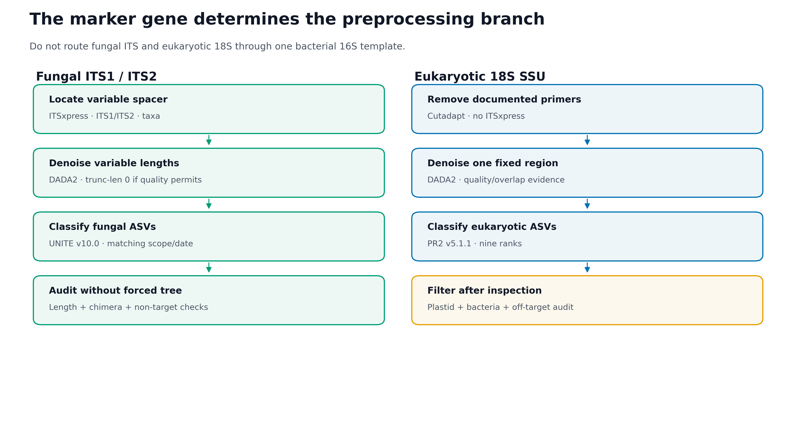
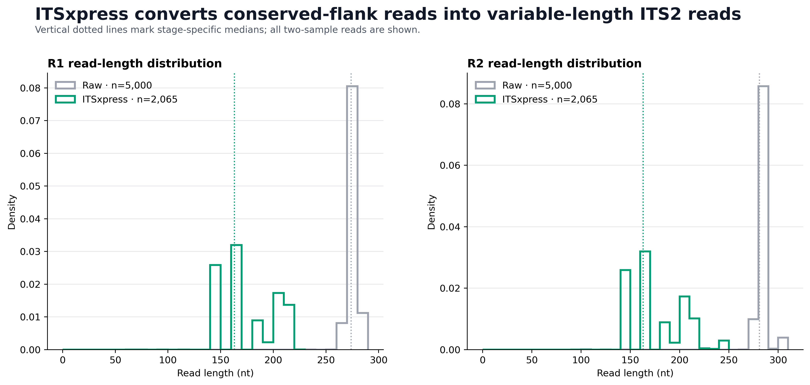
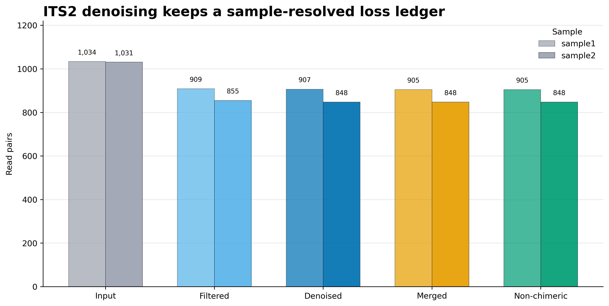
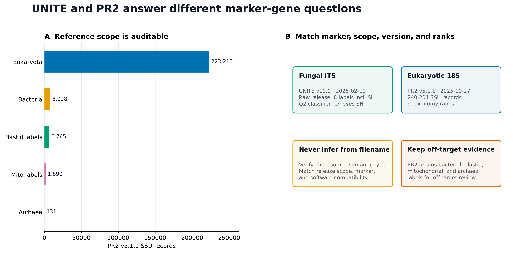

> **分析目标：**根据 marker gene 把真菌 ITS 与真核 18S 分到正确的预处理、去噪、参考库和系统发育分支；用真实 ITS2 paired-end FASTQ 完整验证 ITSxpress → DADA2，并用完整 PR2 SSU 数据库验证 18S taxonomy contract。  
> **输入文件：**2 个真实 ITS2 样本，共 5,000 对 reads；UNITE v10.0 的固定分类器构建记录与 evaluation Artifact；PR2 v5.1.1 全量 240,201 条 SSU 序列。  
> **预计资源：**示例 ITS FASTQ 约 1.2 MB，单线程 ITSxpress + DADA2 通常 3–6 分钟、峰值内存低于 2 GB；完整 PR2 压缩文件约 54.8 MB，流式审计通常数分钟。下载并运行约 115 MB 的 UNITE sklearn 分类器需要更多内存。  
> **执行策略：**QIIME 2 导入、ITSxpress、DADA2、Artifact validation、provenance、UNITE evaluation 和 PR2 全库审计均已一次性实跑；网页构建使用 `eval: false`，避免每次渲染重复上游计算。

## ITS 和 18S 为什么不能照搬 16S 流程？ {#sec-target}

同一项研究可以同时测细菌 16S、真菌 ITS 和真核 18S，但三者不是“换一个数据库名字”这么简单。Marker gene 决定了可观察对象、read geometry、参考序列空间和可用的系统发育方法。

{#fig-marker-branch-map}

论文中最适合展示的是分界明确的 workflow figure；下面三张审计图通常放在补充材料：

{#fig-itsxpress-length}

{#fig-its2-ledger}

{#fig-reference-contract}

::: {.callout-important title="先记住一句话"}
**真菌 ITS、真核 18S 和细菌 16S 是三套测量合同。ITS 的长度高度可变，通常先用 ITSxpress 提取 ITS1/ITS2；18S 是 SSU 区域，不运行 ITSxpress。数据库必须与 marker、扩增区域、taxon scope、版本和分类层级同时匹配。**
:::

本次固定环境与真实结果为：

```text
Execution environment
  QIIME 2 / q2cli:              2026.4.0
  ITSxpress:                    2.1.4
  Biopython:                    1.87
  VSEARCH:                      2.30.4
  HMMER:                        3.4

ITS2 input
  Samples:                      2
  Raw paired reads:             5,000
  Pair-ID mismatches:           0
  ITSxpress retained:           2,065 (41.30%)
    sample1:                    1,034 / 2,500 (41.36%)
    sample2:                    1,031 / 2,500 (41.24%)

DADA2 after ITSxpress
  Input:                        2,065
  Filtered:                     1,764
  Denoised:                     1,755
  Merged:                       1,753
  Non-chimeric:                 1,753
  Non-chimeric / ITSxpress:     84.89%
  Non-chimeric / raw input:     35.06%
  ASVs:                         16
  ASV lengths:                  143–270 nt
  Unique ASV lengths:           14
  Median ASV length:            191 nt

Reference evidence
  UNITE raw QIIME release:      8 labels including sh__
  UNITE Q2 classifier:          sh__ removed before fitting
  UNITE classifier scope:       dynamic fungi · QIIME 2 2026.4
  PR2 full SSU records:         240,201
  PR2 taxonomy depth:           9 ranks for 240,201 / 240,201
  PR2 empty rank fields:        0

Validation:                     55 / 55 PASS
```

ITS FASTQ 来自 USDA-ARS 的公开 [`itsxpress-tutorial`](https://github.com/USDA-ARS-GBRU/itsxpress-tutorial)，固定在 commit `916145d3b05e20656fde30c4732dc084de72d876`。仓库说明写的是两个样本各抽到 10,000 对 reads，但固定提交中的实际文件各为 2,500 对；本页以逐条 FASTQ 计数为准。该提交没有声明独立的数据许可证，因此这些 reads 只用于软件与数据合同复现，不据此比较 Afghanistan 与 Turkey 的生态差异。

18S 部分使用 PR2 v5.1.1 完整 DADA2 FASTA 做 reference scope、rank depth 和脱靶标签审计。本页没有把参考库记录数冒充成 18S 样本结果，也没有声称运行了一个未给出的 18S 实验。

## 理论：为什么这么做 {#sec-theory}

### 1. Marker gene 决定你测到什么

三种常见扩增子可以简化为：

```text
Bacterial / archaeal 16S
  target: small-subunit ribosomal gene region
  typical reference: SILVA / GTDB-derived / Greengenes2

Fungal ITS
  target: ITS1 or ITS2 spacer between conserved rRNA genes
  typical reference: UNITE

Eukaryotic 18S
  target: eukaryotic small-subunit rRNA gene region
  typical reference: PR2
```

“同样是扩增子”不代表 feature table 可以直接拼接。不同 marker 的 feature ID、参考空间、拷贝数偏差和分类层级都不同。跨界联合应先在每个 marker 内独立完成 QC、taxonomy 和 normalization，再在距离、相关或样本层结果上整合。

### 2. ITS 为什么需要提取 spacer

真菌核糖体区域的简化结构是：

```text
18S ─ ITS1 ─ 5.8S ─ ITS2 ─ 28S
```

ITS1/ITS2 两侧有相对保守的 rRNA gene 片段，中间 spacer 长度和序列高度可变。若把 conserved flanks 与目标 spacer 一起送进 DADA2，会出现三个问题：

- 不同 reads 中保留的 flank 长度不一致；
- conserved positions 增加计算量，却不一定增加目标分辨率；
- 固定截断坐标可能系统性排除较长 ITS 类群。

ITSxpress 使用 VSEARCH 做合并/去冗余，用 HMMER 定位 ITS 边界，再把边界投射回保留质量值的原始 reads。对 paired-end 数据，`trim-pair-output-unmerged` 返回仍未合并的、质量值完整的成对 reads，随后再交给 DADA2 学习错误和拼接。

### 3. `region` 和 `taxa` 不是装饰参数

ITSxpress 必须知道目标 spacer 与大类群：

```text
region = ITS1 | ITS2 | ALL
taxa   = A | F | G | O | P
```

其中 `F` 表示 Fungi；其他值对应 ITSxpress 支持的更广或其他真核 scope。参数应由 primer pair 和研究对象决定，而不是看输出 retention 后反向挑一个“保留最多”的值。

本例固定：

```text
region     = ITS2
taxa       = F
cluster-id = 1.0
threads    = 1
```

`cluster-id=1.0` 让边界检测的去冗余阶段保持 100% identity；它不是最终 ASV 聚类阈值。

### 4. 41.30% retention 不是“丢掉 58.70% 真菌”

ITSxpress 在本例保留 2,065/5,000 对 reads。未保留 reads 可能来自：

- 两侧边界无法被 HMM profile 可靠定位；
- read 对不能满足内部合并/边界投射要求；
- 非目标扩增；
- 质量或长度不足；
- 参数的 region/taxa 与文库不匹配。

因此 retention 是 **技术诊断**，不是群落组成比例。若处理组与 ITSxpress retention 系统相关，后续差异可能被预处理选择偏差影响，必须按 sample、run、plate 和 control 展示账本。

### 5. ITS 去噪不能套一个固定长度门

细菌 V4 常出现窄的扩增子长度峰，但 ITS 的真实长度可跨越更宽范围。对 ITSxpress 输出，本例使用：

```text
trunc-len-f = 0
trunc-len-r = 0
trim-left-f = 0
trim-left-r = 0
maxEE-f/r   = 2 / 2
truncQ      = 2
min overlap = 12
```

`trunc-len=0` 表示不按固定 cycle 截断，仍会执行 `truncQ`、expected-error filtering、去噪、paired merge 和 chimera removal。它不是所有 ITS 数据的永恒默认值：若质量尾部严重崩溃，可以在不系统排除长 ITS 的前提下测试截断候选，但必须比较长度分布和 taxonomic retention。

本例 16 个 ASV 有 14 种长度，范围 143–270 nt。把它们强行筛成某个窄峰，会在分类之前先改变可观察真菌集合。

### 6. 18S 是 SSU，不经过 ITSxpress

18S 扩增子的主线是：

```text
paired FASTQ
  → verify documented 18S primers and orientation
  → primer-aware Cutadapt
  → post-primer quality + overlap audit
  → DADA2
  → representative-sequence audit
  → region-matched PR2 classification
  → off-target review
```

18S 与 16S 都属于 small-subunit rRNA gene，但 primer、目标真核类群、区域长度和参考 taxonomy 不同。不能因为二者都叫 SSU，就用细菌 16S classifier 注释 18S。

### 7. UNITE 的“原始发布”和“预训练分类器”不是同一个 taxonomy contract

UNITE v10.0（2025-02-19）的 Fungi QIIME 原始发布记录：

```text
RefS:   20,295
RepS:   81,842
labels: k__, p__, c__, o__, f__, g__, s__, sh__
```

第八个 `sh__` 是 Species Hypothesis（SH）标签。固定的 QIIME 2 2026.4 classifier release 则在训练前执行：

```text
q2-rescript edit-taxonomy
search:      ;sh__.*
replacement: empty
```

也就是说：

- 原始 QIIME taxonomy table 有 8 个标签并保留 SH；
- 本页锁定的预训练 classifier 在拟合前移除了 `sh__`；
- 不能拿 raw release 的 8-label 描述去解释 classifier 输出列。

本页锁定的 classifier 是：

```text
release tag:
  v10.0-2025-02-19-qiime2-2026.4

asset:
  unite_ver2025-02-19_dynamic_fungi-Q2-2026.4.qza

SHA-256:
  5df2370f89b7b64766c0d969ddc5374d3951fdb8bda598ae54ff15cf86b0fca0
```

“dynamic”指 UNITE 按专家建议在不同 Species Hypotheses 上采用动态阈值，不是 DADA2 的 ASV 阈值。

### 8. PR2 的 9 层 taxonomy 也要先审计 scope

PR2 v5.1.1 全量 SSU DADA2 FASTA 的固定审计结果为：

| Top-level label | Records |
|---|---:|
| Eukaryota | 223,210 |
| Bacteria | 8,028 |
| Eukaryota:plas | 6,765 |
| Eukaryota:mito | 1,890 |
| Eukaryota:nucl | 148 |
| Archaea | 131 |
| Eukaryota:apic | 22 |
| Eukaryota:chro | 7 |

240,201/240,201 条记录都有 9 个 taxonomy fields，没有空 field。这里的 9 层是 PR2 自己的 rank schema，不能机械改名成标准的 kingdom → species 七层。

Bacteria、plastid、mitochondrial 和 archaeal 标签不是下载错误。它们允许你看到 18S/SSU 实验中的潜在脱靶；应先报告每个样本的这类 reads，再根据预注册规则过滤，而不是在 classifier 前把证据删掉。

### 9. 系统发育树的处理边界不同

18S 某个固定区域经过方向、长度和脱靶审计后，可以在区域内做 alignment 或 fragment insertion。ITS1/ITS2 长度和同源位置高度可变，不能默认把所有序列做一次全局 multiple sequence alignment 并将得到的树用于 Faith PD 或 UniFrac。

如果论文报告 ITS 的 phylogenetic diversity，Methods 必须说明：

- 对齐区域是什么；
- 如何处理难以对齐的序列；
- tree 是否仅覆盖特定 taxonomic subset；
- 结果对 alignment/filtering 是否稳健。

没有这些证据时，Bray–Curtis、Jaccard 或合适的 compositional distance 通常比一棵被强行对齐的 ITS 树更诚实。

### 10. 可重复性来自固定资产与 provenance

本次运行不包含随机抽样；DADA2 的 error learning 在该合同下使用单线程，ITSxpress 也固定单线程。仍然在重绘代码中设置：

```r
set.seed(20260720)
```

真正需要归档的是：

- 原始 FASTQ 的 source bytes 与修复后 gzip SHA-256；
- QIIME 2、ITSxpress、VSEARCH、HMMER 和 DADA2 版本；
- marker、region、taxa、primer、direction 和 read layout；
- 每个 sample 的 ITSxpress 与 DADA2 stage ledger；
- QZA semantic type、maximum validation 与 provenance；
- UNITE/PR2 的 release、scope、rank contract、checksum 和 license。

## 准备工作 {#sec-setup}

<details>
<summary><strong>展开：固定环境、真实数据、参考库与作图函数</strong></summary>

### 1. 安装 QIIME 2 与 ITSxpress overlay

先创建 QIIME 2 2026.4 amplicon 环境：

```{bash}
curl -L --fail \
  -o rachis-qiime2-linux-64-conda.yml \
  "https://raw.githubusercontent.com/qiime2/distributions/refs/heads/dev/2026.4/qiime2/released/rachis-qiime2-linux-64-conda.yml"

mamba env create \
  -n microbiome-qiime2-2026.4 \
  -f rachis-qiime2-linux-64-conda.yml
```

再安装固定 overlay：

```{bash}
mamba install -n microbiome-qiime2-2026.4 \
  -c bioconda -c conda-forge \
  "itsxpress=2.1.4=pyhdfd78af_0" \
  "biopython=1.87=py312h4c3975b_0"

conda run -n microbiome-qiime2-2026.4 \
  qiime dev refresh-cache

conda run -n microbiome-qiime2-2026.4 qiime info
conda run -n microbiome-qiime2-2026.4 \
  qiime itsxpress trim-pair-output-unmerged --help
```

本次验收还得到 VSEARCH 2.30.4 与 HMMER 3.4。若缓存目录不可写：

```{bash}
export XDG_CACHE_HOME="${PWD}/.cache/xdg"
export NUMBA_CACHE_DIR="${PWD}/.cache/numba"
export MPLCONFIGDIR="${PWD}/.cache/matplotlib"
mkdir -p \
  "${XDG_CACHE_HOME}" \
  "${NUMBA_CACHE_DIR}" \
  "${MPLCONFIGDIR}"
```

### 2. 获取并修复固定提交中的真实 ITS2 FASTQ

固定提交的四个文件虽然以 `.fastq.gz` 结尾，实际却是 plain-text FASTQ。下面先验证 source bytes，再写成真正的 deterministic gzip；不能直接把后缀当作压缩格式。

```{bash}
mkdir -p data/source data/raw/its2

git clone \
  https://github.com/USDA-ARS-GBRU/itsxpress-tutorial \
  data/source/itsxpress-tutorial

git -C data/source/itsxpress-tutorial checkout \
  916145d3b05e20656fde30c4732dc084de72d876
```

```{python}
from pathlib import Path
import gzip
import hashlib
import io

source = Path("data/source/itsxpress-tutorial/data")
target = Path("data/raw/its2")
target.mkdir(parents=True, exist_ok=True)

expected = {
    "sample1_r1.fastq.gz":
        "5e44d1794ff70790fc2ecf807390e459c60db8cb2d807f5a5cba8532d42ef6c4",
    "sample1_r2.fastq.gz":
        "bffb461483b81e74beeeb65fed3ac3e5321535d1023ed3334ade9a2dd99e3ae7",
    "sample2_r1.fastq.gz":
        "00d49fbba7d69f6fad91e128581df2e144faefdd466b844bf0734f67e76a031c",
    "sample2_r2.fastq.gz":
        "c31efec6c90f024122f5f282126ee14b32b4980daab517494cb1686ddba81aca",
}

def read_ids(payload):
    lines = payload.splitlines()
    assert len(lines) % 4 == 0
    ids = []
    for offset in range(0, len(lines), 4):
        header, sequence, plus, quality = lines[offset:offset + 4]
        assert header.startswith(b"@")
        assert plus.startswith(b"+")
        assert len(sequence) == len(quality)
        token = header.split(maxsplit=1)[0]
        if token.endswith((b"/1", b"/2")):
            token = token[:-2]
        ids.append(token)
    return ids

observed_ids = {}

for filename, expected_sha in expected.items():
    payload = (source / filename).read_bytes()
    assert not payload.startswith(b"\x1f\x8b")
    assert hashlib.sha256(payload).hexdigest() == expected_sha
    observed_ids[filename] = read_ids(payload)

    buffer = io.BytesIO()
    with gzip.GzipFile(
        filename="",
        mode="wb",
        fileobj=buffer,
        compresslevel=9,
        mtime=0,
    ) as handle:
        handle.write(payload)
    (target / filename).write_bytes(buffer.getvalue())

for sample in ("sample1", "sample2"):
    forward = observed_ids[f"{sample}_r1.fastq.gz"]
    reverse = observed_ids[f"{sample}_r2.fastq.gz"]
    assert len(forward) == 2500
    assert forward == reverse

print("2 samples; 5,000 synchronized read pairs")
```

写 metadata：

```{bash}
cat > data/raw/its2/metadata.tsv <<'EOF'
sample-id	Collection
sample1	Afghanistan collection
sample2	Turkey collection
EOF
```

### 3. 下载并审计完整 PR2 v5.1.1

```{bash}
mkdir -p data/reference/pr2

curl -L --fail --retry 3 \
  -o data/reference/pr2/pr2_version_5.1.1_SSU_dada2.fasta.gz \
  "https://github.com/pr2database/pr2database/releases/download/v5.1.1/pr2_version_5.1.1_SSU_dada2.fasta.gz"

echo \
  "0c8728abcbb2126eed2c7e587f820cbce39c138cdfdb51239bbf18621498462d  data/reference/pr2/pr2_version_5.1.1_SSU_dada2.fasta.gz" |
  sha256sum -c -
```

流式检查 record、rank 和 top-level label：

```{python}
from collections import Counter
from pathlib import Path
import gzip

path = Path(
    "data/reference/pr2/pr2_version_5.1.1_SSU_dada2.fasta.gz"
)

records = 0
depths = Counter()
domains = Counter()

with gzip.open(path, "rt") as handle:
    for line in handle:
        if not line.startswith(">"):
            continue
        records += 1
        taxonomy = line.rstrip().split("|", 1)[1].rstrip(";")
        ranks = taxonomy.split(";")
        depths[len(ranks)] += 1
        domains[ranks[0]] += 1
        assert all(rank != "" for rank in ranks)

assert records == 240201
assert depths == {9: 240201}

print(records)
print(depths)
print(domains)
```

PR2 首页在本次审计时显示过 `5.1.12`，但 Git tag、GitHub release、Zenodo DOI `10.5281/zenodo.17458343`、release commit `acd4e3d887d9cb8132b699f886cf7448c947b88e` 和仓库 README 均一致指向 **v5.1.1**。版本应由多个 immutable identifiers 交叉确认，不能只抄页面上的一个字符串。

### 4. 下载固定 UNITE classifier

```{bash}
mkdir -p data/reference/unite

curl -L --fail --retry 3 \
  -o data/reference/unite/unite-dynamic-fungi-Q2-2026.4.qza \
  "https://github.com/colinbrislawn/unite-train/releases/download/v10.0-2025-02-19-qiime2-2026.4/unite_ver2025-02-19_dynamic_fungi-Q2-2026.4.qza"

echo \
  "5df2370f89b7b64766c0d969ddc5374d3951fdb8bda598ae54ff15cf86b0fca0  data/reference/unite/unite-dynamic-fungi-Q2-2026.4.qza" |
  sha256sum -c -

conda run -n microbiome-qiime2-2026.4 \
  qiime tools validate \
  data/reference/unite/unite-dynamic-fungi-Q2-2026.4.qza \
  --level max
```

该 classifier build 是公开 demo release，不是 UNITE 团队的官方训练产物。使用时同时引用 UNITE v10.0 数据发布、UNITE database paper 和 classifier build tag。

### 5. 安装 R 作图依赖并内联出版函数

```{r}
install.packages(
  c("ggplot2", "dplyr", "readr", "tidyr", "scales"),
  repos = "https://cloud.r-project.org"
)
```

```{r}
library(ggplot2)
library(dplyr)
library(readr)
library(tidyr)
library(scales)

set.seed(20260720)

pal_pub <- c(
  "#0072B2", "#D55E00", "#009E73", "#CC79A7",
  "#E69F00", "#56B4E9", "#F0E442", "#999999"
)

scale_color_pub <- function(...) {
  ggplot2::scale_color_manual(values = pal_pub, ...)
}

scale_fill_pub <- function(...) {
  ggplot2::scale_fill_manual(values = pal_pub, ...)
}

theme_pub <- function(base_size = 12) {
  ggplot2::theme_bw(base_size = base_size, base_family = "sans") +
    ggplot2::theme(
      panel.grid.major.x = ggplot2::element_blank(),
      panel.grid.minor = ggplot2::element_blank(),
      axis.text = ggplot2::element_text(color = "black"),
      axis.ticks = ggplot2::element_line(
        color = "black",
        linewidth = 0.3
      ),
      plot.title = ggplot2::element_text(
        face = "bold",
        color = "#111827"
      ),
      plot.subtitle = ggplot2::element_text(color = "#4B5563"),
      legend.key = ggplot2::element_blank(),
      legend.background = ggplot2::element_rect(
        fill = scales::alpha("white", 0.85),
        color = NA
      )
    )
}

save_pub <- function(
  plot,
  file_base,
  width = 170,
  height = 105,
  units = "mm",
  dpi = 350
) {
  dir.create(dirname(file_base), recursive = TRUE, showWarnings = FALSE)
  ggplot2::ggsave(
    paste0(file_base, ".pdf"),
    plot,
    width = width,
    height = height,
    units = units,
    device = grDevices::cairo_pdf
  )
  ggplot2::ggsave(
    paste0(file_base, ".png"),
    plot,
    width = width,
    height = height,
    units = units,
    dpi = dpi,
    bg = "white"
  )
  ggplot2::ggsave(
    paste0(file_base, ".tiff"),
    plot,
    width = width,
    height = height,
    units = units,
    dpi = dpi,
    compression = "lzw",
    bg = "white"
  )
}
```

整仓库运行时可改用 `source("R/theme_pub.R")`；单篇运行直接保留上面的函数定义。

</details>

## 可复制代码 {#sec-code}

### 1. 建立当前 QIIME 2 paired-end manifest

QIIME 2 2026.4 的 `PairedEndFastqManifestPhred33V2` 每个 sample 一行，同时给出 forward 和 reverse 路径：

```{python}
from pathlib import Path

root = Path("data/raw/its2").resolve()
output = Path("results/13-its-18s")
output.mkdir(parents=True, exist_ok=True)

with (output / "its2-manifest.tsv").open("w") as handle:
    handle.write(
        "sample-id\t"
        "forward-absolute-filepath\t"
        "reverse-absolute-filepath\n"
    )
    for sample in ("sample1", "sample2"):
        handle.write(
            f"{sample}\t"
            f"{root / f'{sample}_r1.fastq.gz'}\t"
            f"{root / f'{sample}_r2.fastq.gz'}\n"
        )
```

不要沿用旧教程中“一条 direction 一行”的 V2 manifest；当前版本会把同一 sample ID 判为重复。

### 2. 导入并做 maximum validation

```{bash}
mkdir -p results/13-its-18s

conda run -n microbiome-qiime2-2026.4 \
  qiime tools import \
  --type 'SampleData[PairedEndSequencesWithQuality]' \
  --input-path results/13-its-18s/its2-manifest.tsv \
  --input-format PairedEndFastqManifestPhred33V2 \
  --output-path results/13-its-18s/its2-raw.qza

conda run -n microbiome-qiime2-2026.4 \
  qiime tools validate \
  results/13-its-18s/its2-raw.qza \
  --level max

conda run -n microbiome-qiime2-2026.4 \
  qiime demux summarize \
  --i-data results/13-its-18s/its2-raw.qza \
  --o-visualization results/13-its-18s/its2-raw-summary.qzv
```

输入 Artifact 应为：

```text
Semantic type:
  SampleData[PairedEndSequencesWithQuality]

Directory format:
  SingleLanePerSamplePairedEndFastqDirFmt
```

### 3. 用 ITSxpress 提取 ITS2，保留未合并 pairs

```{bash}
conda run -n microbiome-qiime2-2026.4 \
  qiime itsxpress trim-pair-output-unmerged \
  --i-per-sample-sequences results/13-its-18s/its2-raw.qza \
  --p-region ITS2 \
  --p-taxa F \
  --p-cluster-id 1.0 \
  --p-threads 1 \
  --o-trimmed results/13-its-18s/its2-trimmed.qza \
  --verbose 2>&1 |
  tee results/13-its-18s/qiime-itsxpress.log

conda run -n microbiome-qiime2-2026.4 \
  qiime tools validate \
  results/13-its-18s/its2-trimmed.qza \
  --level max

conda run -n microbiome-qiime2-2026.4 \
  qiime demux summarize \
  --i-data results/13-its-18s/its2-trimmed.qza \
  --o-visualization results/13-its-18s/its2-trimmed-summary.qzv
```

实测 retention：

| Sample | Raw pairs | ITSxpress pairs | Retention |
|---|---:|---:|---:|
| sample1 | 2,500 | 1,034 | 41.36% |
| sample2 | 2,500 | 1,031 | 41.24% |
| **Total** | **5,000** | **2,065** | **41.30%** |

这里两个样本 retention 接近，但真实研究仍要按 sample 和 technical batch 展示，不能只看总数。

### 4. 在 variable-length ITS2 pairs 上运行 DADA2

```{bash}
conda run -n microbiome-qiime2-2026.4 \
  qiime dada2 denoise-paired \
  --i-demultiplexed-seqs results/13-its-18s/its2-trimmed.qza \
  --p-trunc-len-f 0 \
  --p-trunc-len-r 0 \
  --p-trim-left-f 0 \
  --p-trim-left-r 0 \
  --p-max-ee-f 2 \
  --p-max-ee-r 2 \
  --p-trunc-q 2 \
  --p-min-overlap 12 \
  --p-max-merge-mismatch 0 \
  --p-pooling-method independent \
  --p-chimera-method consensus \
  --p-n-threads 1 \
  --p-n-reads-learn 1000000 \
  --p-hashed-feature-ids \
  --p-retain-all-samples \
  --o-table results/13-its-18s/its2-table.qza \
  --o-representative-sequences results/13-its-18s/its2-rep-seqs.qza \
  --o-denoising-stats results/13-its-18s/its2-denoising-stats.qza \
  --o-base-transition-stats results/13-its-18s/its2-base-transitions.qza \
  --verbose
```

逐样本结果：

| Sample | Input | Filtered | Denoised | Merged | Non-chimeric | Final % |
|---|---:|---:|---:|---:|---:|---:|
| sample1 | 1,034 | 909 | 907 | 905 | 905 | 87.52 |
| sample2 | 1,031 | 855 | 848 | 848 | 848 | 82.25 |

2,065 对 ITSxpress 输出中有 1,753 对成为 non-chimeric DADA2 reads。`84.89%` 的分母是 ITSxpress input；若以 raw FASTQ 为分母，则是 `35.06%`。Methods 与图注必须写清分母。

### 5. 生成当前版本的三个 table-summary 输出

QIIME 2 2026.4 的 `feature-table summarize` 是 pipeline，需要三个输出：

```{bash}
conda run -n microbiome-qiime2-2026.4 \
  qiime feature-table summarize \
  --i-table results/13-its-18s/its2-table.qza \
  --m-metadata-file data/raw/its2/metadata.tsv \
  --o-feature-frequencies \
    results/13-its-18s/its2-feature-frequencies.qza \
  --o-sample-frequencies \
    results/13-its-18s/its2-sample-frequencies.qza \
  --o-summary \
    results/13-its-18s/its2-table-summary.qzv

conda run -n microbiome-qiime2-2026.4 \
  qiime feature-table tabulate-seqs \
  --i-data results/13-its-18s/its2-rep-seqs.qza \
  --o-visualization results/13-its-18s/its2-rep-seqs.qzv

conda run -n microbiome-qiime2-2026.4 \
  qiime metadata tabulate \
  --m-input-file results/13-its-18s/its2-denoising-stats.qza \
  --o-visualization results/13-its-18s/its2-stats.qzv
```

本例得到 16 个 ASV，长度计数为：

```text
143:1  148:1  149:1  163:1  185:1  186:2  189:1
193:1  196:1  203:1  205:1  207:1  210:2  270:1
```

### 6. 用固定 UNITE classifier 注释 ITS2

在运行分类前再次核对 classifier 的 marker scope、taxon scope、release 和 checksum。随后：

```{bash}
conda run -n microbiome-qiime2-2026.4 \
  qiime feature-classifier classify-sklearn \
  --i-classifier \
    data/reference/unite/unite-dynamic-fungi-Q2-2026.4.qza \
  --i-reads results/13-its-18s/its2-rep-seqs.qza \
  --p-n-jobs 1 \
  --o-classification results/13-its-18s/its2-taxonomy.qza

conda run -n microbiome-qiime2-2026.4 \
  qiime metadata tabulate \
  --m-input-file results/13-its-18s/its2-taxonomy.qza \
  --o-visualization results/13-its-18s/its2-taxonomy.qzv
```

分类器训练与区域裁剪的完整原则会在后续专门讨论；这里的最低要求是：不能把旧 UNITE classifier、不同 QIIME 2/scikit-learn ABI 或 Eukaryotes scope 的资产，仅凭文件名替换进来。

::: {.callout-note title="结果边界"}
本页固定的数值验收止于真实 ITSxpress/DADA2 输出以及 UNITE classifier build/evaluation 资产审计；没有把分类命令尚未生成的 taxonomy 数量写成结果。只有实际运行上面的 classifier、保存 `its2-taxonomy.qza/.qzv` 并审计 confidence 与 controls 后，Methods 才能写“taxonomy was assigned”。
:::

### 7. 18S 分支的完整命令骨架

18S 不调用 ITSxpress。先对自己的真实 18S manifest 导入并验证，再把实验记录中的 primer 写成变量：

```{bash}
FORWARD_PRIMER="CCAGCASCYGCGGTAATTCC"
REVERSE_PRIMER="ACTTTCGTTCTTGATYRA"

conda run -n microbiome-qiime2-2026.4 \
  qiime tools import \
  --type 'SampleData[PairedEndSequencesWithQuality]' \
  --input-path data/raw/18s/manifest.tsv \
  --input-format PairedEndFastqManifestPhred33V2 \
  --output-path results/13-18s/18s-raw.qza

conda run -n microbiome-qiime2-2026.4 \
  qiime cutadapt trim-paired \
  --i-demultiplexed-sequences results/13-18s/18s-raw.qza \
  --p-front-f "^${FORWARD_PRIMER}" \
  --p-front-r "^${REVERSE_PRIMER}" \
  --p-error-rate 0.1 \
  --p-overlap 15 \
  --p-discard-untrimmed \
  --p-cores 1 \
  --o-trimmed-sequences results/13-18s/18s-trimmed.qza
```

上面的 primer 只是常见 18S V9 构造的完整可执行示例，不是所有 18S 文库的默认值。运行前必须用实验记录和 raw-read anchored match 验证；若你的 R2 primer 记录为 biological orientation，要先转换成 read 中实际出现的 sequenced orientation。

然后根据 **去引物后的** quality profile、真实目标长度和 overlap 预算选择 DADA2 参数：

```{bash}
conda run -n microbiome-qiime2-2026.4 \
  qiime dada2 denoise-paired \
  --i-demultiplexed-seqs results/13-18s/18s-trimmed.qza \
  --p-trunc-len-f 0 \
  --p-trunc-len-r 0 \
  --p-trim-left-f 0 \
  --p-trim-left-r 0 \
  --p-max-ee-f 2 \
  --p-max-ee-r 2 \
  --p-trunc-q 2 \
  --p-min-overlap 12 \
  --p-max-merge-mismatch 0 \
  --p-pooling-method independent \
  --p-chimera-method consensus \
  --p-n-threads 1 \
  --p-hashed-feature-ids \
  --p-retain-all-samples \
  --o-table results/13-18s/18s-table.qza \
  --o-representative-sequences results/13-18s/18s-rep-seqs.qza \
  --o-denoising-stats results/13-18s/18s-stats.qza \
  --o-base-transition-stats results/13-18s/18s-base-transitions.qza
```

这里的 `trunc-len=0/0` 只是安全起点，不是预设结论。必须用你的 quality、length 和 merge ledger 决定是否截断。

### 8. 导出通用三件套时保留 marker 身份

ITS 与 18S 各自导出：

```text
data/small/its/
  otutab.tsv
  taxonomy.tsv
  metadata.tsv
  rep-seqs.fasta

data/small/18s/
  otutab.tsv
  taxonomy.tsv
  metadata.tsv
  rep-seqs.fasta
```

在 metadata 中至少增加：

```text
Marker
Region
PrimerPair
SequencingRun
ExtractionBatch
PCRBatch
```

不要把两个 `otutab.tsv` 按 feature 行直接 `rbind` 后做一次相对丰度。即使 sample IDs 相同，两个 marker 仍有不同的扩增效率、拷贝数偏差和 feature universe。

## 出版级美化 {#sec-publication}

### 1. 画 stage ledger，不画一个孤立 retention

```{r}
ledger <- readr::read_tsv(
  "results/13-its-18s/its2-denoising-ledger.tsv",
  show_col_types = FALSE
) |>
  tidyr::pivot_longer(
    cols = c(input, filtered, denoised, merged, `non-chimeric`),
    names_to = "Stage",
    values_to = "ReadPairs"
  ) |>
  dplyr::mutate(
    Stage = factor(
      Stage,
      levels = c(
        "input", "filtered", "denoised", "merged", "non-chimeric"
      ),
      labels = c(
        "Input", "Filtered", "Denoised", "Merged", "Non-chimeric"
      )
    )
  )

p_ledger <- ggplot(
  ledger,
  aes(x = Stage, y = ReadPairs, fill = sample_id)
) +
  geom_col(position = position_dodge(width = 0.72), width = 0.66) +
  geom_text(
    aes(label = scales::comma(ReadPairs)),
    position = position_dodge(width = 0.72),
    vjust = -0.35,
    size = 3.2
  ) +
  scale_fill_pub(name = "Sample") +
  coord_cartesian(ylim = c(0, 1150), clip = "off") +
  labs(
    x = NULL,
    y = "Read pairs",
    title = "ITS2 denoising loss ledger",
    subtitle = "Counts are reported separately for every sample"
  ) +
  theme_pub()

save_pub(
  p_ledger,
  "figures/13-its2-ledger-redraw",
  width = 170,
  height = 105
)
```

### 2. 把 reference scope 画成可检查对象

```{r}
pr2_domain <- readr::read_tsv(
  "results/13-its-18s/pr2-domain-audit.tsv",
  show_col_types = FALSE
) |>
  dplyr::filter(
    domain_label %in% c(
      "Eukaryota", "Bacteria", "Eukaryota:plas",
      "Eukaryota:mito", "Archaea"
    )
  ) |>
  dplyr::mutate(
    Label = dplyr::recode(
      domain_label,
      Eukaryota = "Eukaryota",
      Bacteria = "Bacteria",
      `Eukaryota:plas` = "Plastid labels",
      `Eukaryota:mito` = "Mito labels",
      Archaea = "Archaea"
    ),
    Label = reorder(Label, records)
  )

p_reference <- ggplot(
  pr2_domain,
  aes(x = records, y = Label, fill = Label)
) +
  geom_col(width = 0.66, show.legend = FALSE) +
  geom_text(
    aes(label = scales::comma(records)),
    hjust = -0.15,
    size = 3.4
  ) +
  scale_fill_pub() +
  coord_cartesian(
    xlim = c(0, max(pr2_domain$records) * 1.17),
    clip = "off"
  ) +
  labs(
    x = "PR2 v5.1.1 SSU records",
    y = NULL,
    title = "Reference scope is auditable",
    subtitle = "Off-target labels are retained for review"
  ) +
  theme_pub()

save_pub(
  p_reference,
  "figures/13-pr2-scope-redraw",
  width = 170,
  height = 105
)
```

所有轴、图例、分组、注释和 taxonomy category 使用英文，中文留在正文解释。

### 3. 图注同时说明分母和 scope

可直接改数字的英文图注：

```text
Read-pair retention across ITS2 extraction and denoising.
ITS2 boundaries were identified with ITSxpress 2.1.4
(region=ITS2, taxa=F, cluster identity=1.0), retaining
2,065 of 5,000 raw read pairs (41.30%). The unmerged,
quality-bearing trimmed pairs were denoised with
q2-dada2 2026.4.0 without fixed-length truncation,
using maxEE=2 per mate, truncQ=2, a minimum 12-nt exact
overlap, independent inference, and consensus chimera
removal. A total of 1,753 non-chimeric read pairs
(84.89% of ITSxpress input; 35.06% of raw input)
yielded 16 ASVs spanning 143–270 nt.
```

### 4. 数据库版本写进图注或补充表

最小字段：

```text
database
release date
marker scope
taxon scope
raw vs pre-trained asset
taxonomy rank contract
software compatibility
checksum / DOI
license
```

“Used UNITE”或“Used PR2”都不够复现。

## 常见坑 {#sec-pitfalls}

::: {.callout-caution title="审稿人最容易追问的 18 个问题"}
1. **把 ITS 当作固定长度 16S 区域。** 固定窄长度门会造成 taxon-specific dropout。
2. **对 18S 运行 ITSxpress。** 18S 是 SSU，不是 internal transcribed spacer。
3. **不写 ITS1 还是 ITS2。** 两者的 primer、长度和参考匹配不同。
4. **`taxa=F` 只因为 retention 最高。** Taxon scope 应由研究设计决定。
5. **把 ITSxpress retention 当真菌比例。** 它是边界检测和技术保留率。
6. **只报总体 retention。** 处理组、run 或 plate 特异的损失会制造假差异。
7. **ITSxpress 后沿用原始 cycle 坐标。** Spacer 提取已经改变 read geometry。
8. **去 spacer 后再次 `trim-left`。** 会删除真实 ITS 序列。
9. **误解 `trunc-len=0`。** 它关闭固定截断，不会关闭质量过滤。
10. **把 16 个 ASV 等同 16 个真菌 species。** ASV 与 species 不是一一对应。
11. **把 UNITE raw taxonomy 与 classifier output 都称为 8 ranks。** 锁定 classifier 在训练前移除了 `sh__`。
12. **只写“UNITE dynamic”。** 还要写日期、scope、singleton policy、QIIME 兼容版本和 checksum。
13. **把 PR2 九层强改为标准七层。** 会丢失数据库自己的 taxonomy semantics。
14. **分类前删除 PR2 中所有非 Eukaryota 标签。** 会丢掉脱靶证据。
15. **把 plastid/mitochondrial reads 当成数据库污染。** 先按 sample 和 control 量化。
16. **给所有 ITS ASV 强行建一棵全局树。** 同源对齐假设可能不成立。
17. **把 ITS、18S、16S feature tables 直接拼起来。** 三套 marker 的 measurement scales 不可交换。
18. **只保存 taxonomy.tsv。** FASTQ hash、QZA/QZV、stats、representative sequences、classifier checksum 和 provenance 都应归档。
:::

::: {.callout-warning title="出现极低 ITSxpress retention 时"}
先检查 primer/region、read direction、是否仍含 adapter、paired IDs、read 长度、`taxa` scope 和 raw file 是否真的 gzip。不要通过反复更换 `region` 或放宽参数，直到得到“好看”的 retention。
:::

::: {.callout-tip title="出现大量 PR2 off-target labels 时"}
按 sample、negative control、PCR plate 和 read count 先画分布；再检查 primer specificity、amplicon length、classification confidence 和 representative-sequence alignment。过滤规则应在看到组间结论前固定，并保留过滤前后的审计表。
:::

## 这段 Methods 怎么写 {#sec-methods}

### ITS2 示例

以下模板适用于已经实际运行本页 UNITE 分类命令并保存 taxonomy 结果的研究：

```text
Paired-end fungal ITS reads were processed using QIIME 2
2026.4.0. ITS2 boundaries were identified with ITSxpress
2.1.4 using the fungal HMM profile (region=ITS2, taxa=F),
100% sequence identity during dereplication, one thread,
and the paired unmerged-output action, which retains
quality scores for downstream denoising. Of 5,000 raw
read pairs, 2,065 (41.30%) contained a recoverable ITS2
region. The trimmed pairs were denoised with q2-dada2
2026.4.0 using no fixed-length or additional 5′
truncation, maximum expected errors of 2 per mate,
truncQ=2, a minimum 12-nt overlap with zero overlap
mismatches, independent sample inference, and consensus
chimera removal. The final table contained 1,753
non-chimeric read pairs (84.89% of ITSxpress input;
35.06% of raw input) and 16 ASVs with representative
sequence lengths of 143–270 nt. Taxonomy was assigned
against the UNITE v10.0 release dated 19 February 2025
using the dynamic Fungi classifier built for QIIME 2
2026.4 (SHA-256:
5df2370f89b7b64766c0d969ddc5374d3951fdb8bda598ae54ff15cf86b0fca0).
The classifier build removes Species Hypothesis labels
before fitting; therefore classifier output was not
described using the eight-label raw-release schema.
```

### 18S 示例

```text
Eukaryotic 18S reads were processed separately from ITS
and bacterial 16S reads. The documented forward and
reverse primers were removed with q2-cutadapt using
anchored 5′ matching, a 0.10 error rate, a minimum
15-nt primer overlap, and paired discard-untrimmed
filtering. Post-primer quality distributions and an
explicit amplicon-overlap budget were used to select
q2-dada2 truncation and expected-error parameters.
Taxonomy was assigned using an amplicon-region-matched
classifier derived from PR2 v5.1.1 (release 27 October
2025; DOI 10.5281/zenodo.17458343). The full reference
FASTA contained 240,201 sequences with nine populated
taxonomy fields. Bacterial, plastid, mitochondrial, and
archaeal assignments were quantified per sample as
off-target evidence before applying the prespecified
filtering rule.
```

替换成自己的研究时，至少修改：

- marker、ITS1/ITS2 或 18S region；
- primer sequences 与 read orientation；
- ITSxpress `taxa`、`cluster-id`、版本和 action；
- DADA2 全部参数与逐阶段计数；
- raw、ITSxpress 和 DADA2 三种分母；
- UNITE/PR2 的 release、scope、rank contract、checksum；
- classifier 是预训练还是本研究训练；
- off-target 与 control 的过滤规则；
- 是否进行 alignment/tree，以及适用范围。

## 换成你自己的数据怎么做 {#sec-own-data}

### 1. 先建 marker contract

在运行任何工具前填写：

| Field | Example |
|---|---|
| Marker | ITS2 |
| Target taxa | Fungi |
| Primer pair | laboratory record |
| Read layout | Illumina paired-end |
| Expected amplicon range | evidence-based range |
| Spacer extraction | ITSxpress ITS2 / not applicable |
| Denoising action | paired / single / CCS |
| Reference | UNITE or PR2 exact release |
| Classifier scope | Fungi / Eukaryotes / region-specific |
| Tree policy | none / region-specific / fragment insertion |

任何一项不清楚，都应先回查 wet-lab sheet，而不是从文件名猜。

### 2. ITS 数据的最小输入

```text
data/raw/its/
  manifest.tsv
  metadata.tsv
  paired FASTQ files

metadata columns:
  sample-id
  biological group
  sequencing run
  extraction batch
  PCR batch
  control type
```

替换正文的 FASTQ 路径后，完整执行：

```text
hash + pair-ID audit
→ QIIME import + max validation
→ raw demux summary
→ ITSxpress
→ trimmed demux summary
→ DADA2
→ ASV length + per-sample ledger
→ UNITE classification
→ control / non-target audit
```

### 3. 18S 数据还需要区域与 primer 证据

除三件套目标外，18S 上游至少需要：

```text
forward primer
reverse primer in sequenced orientation
target region
expected insert-length range
target eukaryotic scope
PR2 release and region-matched classifier
```

若只拿到“18S sequencing”四个字，不能安全决定 Cutadapt、DADA2 或 classifier 参数。

### 4. 分开输出两套三件套

每个 marker 分别形成：

```text
otutab.tsv
taxonomy.tsv
metadata.tsv
rep-seqs.fasta
processing-ledger.tsv
reference-audit.tsv
```

三件套内部要求：

- `otutab` feature IDs 与 `taxonomy` 行名完全一致；
- `otutab` sample names 与 `metadata` 行名完全一致；
- taxonomy 空层保持明确的 `Unclassified`/数据库原始空值策略；
- metadata 保留 marker、region、run、batch 和 control；
- 图内分组名先转换成英文。

### 5. 跨界问题在各界 QC 后再回答

若同一批样本同时有 16S、ITS 和 18S：

1. 每个 marker 独立做污染、批次、深度、taxonomy 和 beta diversity；
2. 只在共有 sample set 上建立整合分析；
3. 优先在 distance、latent component 或 sample-level summary 上关联；
4. 网络边解释为 statistical association，不写成直接生物互作；
5. 对缺失 marker、不同 extraction/PCR batch 和 compositionality 做敏感性分析。

::: {.callout-important title="进入下游分析前的最小验收"}
ITS：每个样本的 raw → ITSxpress → filtered → denoised → merged → non-chimeric 账本、ASV 长度、UNITE scope 与 controls 全部通过。18S：primer、post-trim quality、overlap、PR2 rank/off-target、classifier provenance 全部通过。任何 marker 的样本系统性丢失，都必须先解释，再做组间比较。
:::

## 参考 {#sec-references}

- [ITSxpress QIIME 2 tutorial and paired unmerged-output workflow](https://forum.qiime2.org/t/q2-itsxpress-a-tutorial-on-a-qiime-2-plugin-to-trim-its-sequences/5780)
- [Rivers AR, et al. ITSxpress: software to rapidly trim internally transcribed spacer sequences with quality scores for marker gene analysis. *F1000Research*. 2018.](https://doi.org/10.12688/f1000research.15704.1)
- [Pinned USDA-ARS ITSxpress tutorial data](https://github.com/USDA-ARS-GBRU/itsxpress-tutorial/tree/916145d3b05e20656fde30c4732dc084de72d876)
- [JGI iTag sample-preparation SOP: 18S V4 and fungal ITS2 primer sequences](https://jgi.doe.gov/sites/default/files/2025-01/iTag-Sample-Preparation-for-Illumina-Sequencing-SOP.pdf)
- [UNITE v10.0 QIIME releases and DOI](https://unite.ut.ee/repository.php)
- [Pinned UNITE QIIME 2 2026.4 classifier build](https://github.com/colinbrislawn/unite-train/releases/tag/v10.0-2025-02-19-qiime2-2026.4)
- [Nilsson RH, et al. The UNITE database for molecular identification of fungi: handling dark taxa and parallel taxonomic classifications. *Nucleic Acids Research*. 2019.](https://doi.org/10.1093/nar/gky1022)
- [Abarenkov K, et al. The UNITE database for molecular identification and taxonomic communication of fungi and other eukaryotes. *Nucleic Acids Research*. 2024.](https://doi.org/10.1093/nar/gkad1039)
- [PR2 database homepage](https://pr2-database.org/)
- [PR2 v5.1.1 release and full SSU DADA2 FASTA](https://github.com/pr2database/pr2database/releases/tag/v5.1.1)
- [PR2 v5.1.1 Zenodo record](https://doi.org/10.5281/zenodo.17458343)
- [Guillou L, et al. The Protist Ribosomal Reference database (PR2): a catalog of unicellular eukaryote SSU rRNA sequences with curated taxonomy. *Nucleic Acids Research*. 2013.](https://doi.org/10.1093/nar/gks1160)
- [QIIME 2 q2-dada2 plugin reference](https://library.qiime2.org/plugins/qiime2/q2-dada2/overview)
- [QIIME 2 q2-cutadapt plugin reference](https://library.qiime2.org/plugins/qiime2/q2-cutadapt/overview)
- [Callahan BJ, et al. DADA2: high-resolution sample inference from Illumina amplicon data. *Nature Methods*. 2016.](https://doi.org/10.1038/nmeth.3869)
- [Bolyen E, et al. Reproducible, interactive, scalable and extensible microbiome data science using QIIME 2. *Nature Biotechnology*. 2019.](https://doi.org/10.1038/s41587-019-0209-9)
