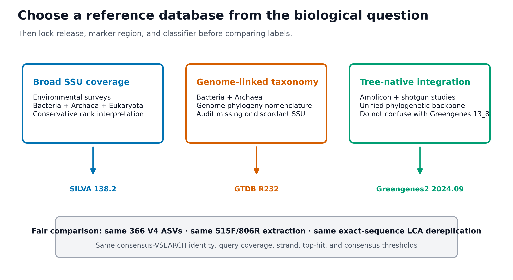
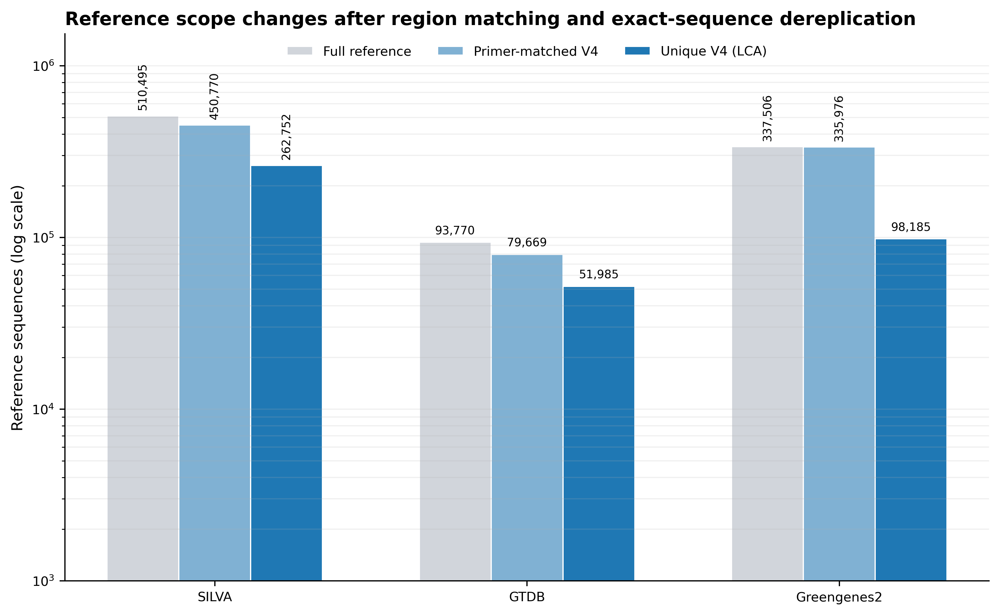
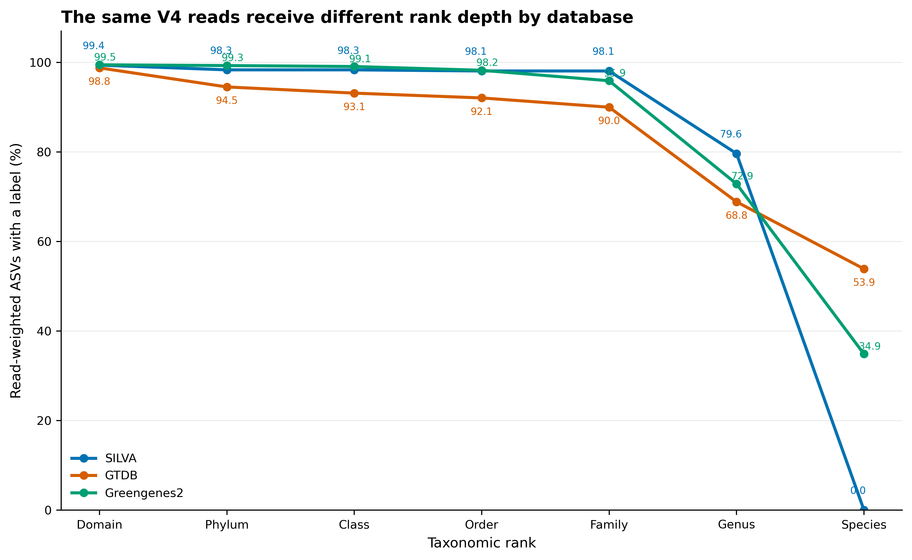
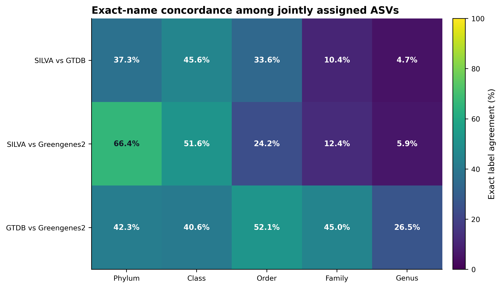

## 分类结果首先取决于参考数据库 {#sec-target}

数据库选择首先对应 Methods 中的 reference contract，也会直接改变正文或补充材料里的分类深度、未注释比例与脱靶审计。不要从“哪个数据库名字更熟”开始，而要从研究问题开始。

{#fig-database-decision-map}

{#fig-reference-scope}

{#fig-rank-coverage}

{#fig-taxonomy-concordance}

::: {.callout-important title="先记住一句话"}
**数据库不是中性的物种字典。必须同时写清 release、reference subset、扩增区域、taxonomy schema、分类算法和参数；species 字符串只是数据库条件下的标签，不是 V4 已证明物种或菌株。**
:::

本次固定环境与真实结果为：

```text
Environment
  QIIME 2 / q2cli:               2026.4.0
  q2-feature-classifier:         2026.4.0
  RESCRIPt:                      2026.4.0
  VSEARCH:                       2.30.4
  scikit-learn:                  1.7.1

Query
  Real V4 ASVs:                  366
  Non-chimeric reads:            5,213
  ASV length:                    252–303 nt
  Median ASV length:             253 nt

Region reference contract
  Primer pair:                   515F / 806R
  Forward:                       GTGYCAGCMGCCGCGGTAA
  Reverse:                       GGACTACNVGGGTWTCTAAT
  Primer identity:               0.80
  Amplicon length:               200–400 nt
  Orientation:                   both
  Dereplication:                 exact sequence + LCA

Reference scope
                        full        primer-matched V4    unique V4 LCA
  SILVA 138.2           510,495     450,770              262,752
  GTDB R11-RS232         93,770      79,669               51,985
  Greengenes2 2024.09   337,506     335,976               98,185

Same classifier contract
  maxaccepts:                     50
  maxrejects:                     all
  identity / query coverage:      0.80 / 0.80
  strand:                         both
  top hits only / maxhits:        true / all
  minimum consensus:              0.51
  output no hits:                 true

Assignments
  SILVA:                          358 / 366 ASVs; 5,181 / 5,213 reads
  GTDB:                           356 / 366 ASVs; 5,149 / 5,213 reads
  Greengenes2:                    362 / 366 ASVs; 5,185 / 5,213 reads

Validation:                       91 / 91 PASS
```

这 366 条 ASV 来自固定 commit `f282ad2bafb3ca90190ec87290066ee1985df655` 的真实 nf-core/test-datasets V4 MiSeq 数据。原始 10,000 对 reads 经 anchored、IUPAC-aware 515F/806R 去引物和 DADA2 后保留 5,213 对非嵌合 reads。这里使用其代表序列和真实频数做数据库合同验证；原数据没有独立的生态研究分组，因此不据此比较环境或处理效应。

## 开始前：数据与运行环境 {#sec-setup}

在 Linux 或 WSL2 的项目文件夹中运行下面的下载命令。下载后保留这里的相对目录，后续命令使用同一组文件。

```bash
base_url="https://raw.githubusercontent.com/petemeng/microbiome-best-practices/3cb6a817e0c73ab7ecbec1cedc1ad80cbb9ecfaa"
for file in \
  env/qiime2.yml \
  scripts/prepare_taxonomy_database_assets.py \
  scripts/validate_taxonomy_databases.py
do
  mkdir -p "$(dirname "$file")"
  curl --fail --location --retry 3 "$base_url/$file" --output "$file" || break
done
```


<details>
<summary>本次分析的数据、环境与图形设置</summary>

### 安装固定 QIIME 2 环境

项目提供已经验证的 `env/qiime2.yml`：

```{bash}
mamba env create -f env/qiime2.yml
conda activate microbiome-qiime2-2026.4

qiime info
qiime feature-classifier classify-consensus-vsearch --help
qiime rescript extract-seq-segments --help
qiime rescript dereplicate --help
vsearch --version
python -c "import sklearn; print(sklearn.__version__)"
```

若用户目录缓存不可写，把缓存放在当前项目：

```{bash}
export XDG_CACHE_HOME="${PWD}/.cache/xdg"
export NUMBA_CACHE_DIR="${PWD}/.cache/numba"
export MPLCONFIGDIR="${PWD}/.cache/matplotlib"
mkdir -p \
  "${XDG_CACHE_HOME}" \
  "${NUMBA_CACHE_DIR}" \
  "${MPLCONFIGDIR}"
```

### 检查本页的小型固定资产

```{bash}
DATA="data/small/taxonomy-databases"

ls -lh "${DATA}"
gzip -t "${DATA}/query-v4-asvs.fasta.gz"
gzip -t "${DATA}/silva-138.2-v4.fasta.gz"
gzip -t "${DATA}/silva-138.2-v4-taxonomy.tsv.gz"
gzip -t "${DATA}/gtdb-r232-v4.fasta.gz"
gzip -t "${DATA}/gtdb-r232-v4-taxonomy.tsv.gz"
gzip -t "${DATA}/greengenes2-2024.09-v4.fasta.gz"
gzip -t "${DATA}/greengenes2-2024.09-v4-taxonomy.tsv.gz"
```

固定 SHA-256：

```text
query-v4-asvs.fasta.gz
  fa71915be8007d36ec70f85d28401f5a94d0d33eca323782cc937cfc4bcf1af4
query-v4-asv-abundance.tsv
  a80e3b94d8632c48fb6c01e788e842c022c3b1ee64b79dc94456618328895e6e

silva-138.2-v4.fasta.gz
  3a251d263bd4e12c96023c84b3f2e255b8bcb0d5865dc6f299f9918e6be3a808
silva-138.2-v4-taxonomy.tsv.gz
  f49320aaa32aa70af5c5a48649786e3bb4177868da5da4d2143d0a54c5fa47b0

gtdb-r232-v4.fasta.gz
  3c4234b4defcdc3d8c3b4d1e8956b12288bccd853a4b7f3a3003847c32e6e250
gtdb-r232-v4-taxonomy.tsv.gz
  a23d0d4f62183e949c868c3f25aace3acdebb9362ae0bb1d0e9fe81e74c43fe0

greengenes2-2024.09-v4.fasta.gz
  330fe7f400c84c1e454ca9193bcc49f078b01c7880a8bfb99cbe4c0c3c1c14d2
greengenes2-2024.09-v4-taxonomy.tsv.gz
  9594e9ae78a568672891693207fd4dcc31f8eada83b931031642fafcff2684bd
```

先看结构：

```{bash}
gzip -cd "${DATA}/query-v4-asvs.fasta.gz" | head -n 6
head -n 8 "${DATA}/query-v4-asv-abundance.tsv"
gzip -cd "${DATA}/silva-138.2-v4-taxonomy.tsv.gz" | head -n 6
gzip -cd "${DATA}/gtdb-r232-v4-taxonomy.tsv.gz" | head -n 6
gzip -cd "${DATA}/greengenes2-2024.09-v4-taxonomy.tsv.gz" | head -n 6
```

最小数据结构是：

```text
query FASTA
  >ASV_ID
  ACGT...

taxonomy TSV
  Feature ID<TAB>Taxon
  reference_id<TAB>d__...; p__...; ...; s__...

abundance TSV
  Feature ID<TAB>Frequency<TAB>No. of Samples Observed In
```

### 需要从完整官方发布重建时

完整来源分别为：

- SILVA 138.2 `SILVA_138.2_SSURef_NR99_tax_silva.fasta.gz`，MD5 `c3b7638cab8bf2fe1e5cad01ce406a53`；
- GTDB R232 `ar53_ssu_reps_r232.fna.gz`、`bac120_ssu_reps_r232.fna.gz` 及两份 taxonomy，四个官方 MD5 已写入准备脚本；
- Greengenes2 2024.09 `2024.09.backbone.full-length.fna.qza` 与 `2024.09.backbone.tax.qza`，SHA-256 分别为 `527e7a7d...3989` 与 `6cb6f476...1fe`。

把完整文件放入 ignored scratch `data/raw/taxonomy-databases/`，再运行：

```{bash}
python3 scripts/prepare_taxonomy_database_assets.py \
  --project-root . \
  --raw-dir data/raw/taxonomy-databases \
  --work-dir work/14-reference-preparation \
  --output-dir data/small/taxonomy-databases \
  --qiime-env microbiome-qiime2-2026.4 \
  --threads 4
```

脚本会验证官方 checksum，maximum-validate Greengenes2 QZA，审计完整 source count，用同一 primer/length/orientation 提取 V4，再做 exact-sequence LCA 去冗余。SILVA 原始 description 先通过 RESCRIPt 固定为 domain–genus 六层并启用 rank propagation；原 description 中的 species 文本不会被冒充成短 V4 的可靠 species rank。

GTDB R232 release notes 已把 16S 识别改为贴近 Prokka 的 `barnap` 并使用 396 bp minimum；发布目录内旧通用 `METHODS`/`FILE_DESCRIPTIONS` 仍含 `nhmmer`/200 bp 文本。应分开记录两套文档，并以实际 FASTA 的 397–1,919 bp 长度审计为准。

### 安装 R 作图依赖并内联出版函数

```{r}
install.packages(
  c("ggplot2", "dplyr", "readr", "tidyr", "stringr", "scales"),
  repos = "https://cloud.r-project.org"
)
```

```{r}
library(ggplot2)
library(dplyr)
library(readr)
library(tidyr)
library(stringr)
library(scales)

set.seed(20260720)

pal_pub <- c(
  "#0072B2", "#D55E00", "#009E73", "#CC79A7",
  "#E69F00", "#56B4E9", "#F0E442", "#999999"
)

scale_color_pub <- function(...) {
  ggplot2::scale_color_manual(values = pal_pub, ...)
}

scale_fill_pub <- function(...) {
  ggplot2::scale_fill_manual(values = pal_pub, ...)
}

theme_pub <- function(base_size = 12) {
  ggplot2::theme_bw(base_size = base_size, base_family = "sans") +
    ggplot2::theme(
      panel.grid.major.x = ggplot2::element_blank(),
      panel.grid.minor = ggplot2::element_blank(),
      axis.text = ggplot2::element_text(color = "black"),
      axis.ticks = ggplot2::element_line(
        color = "black",
        linewidth = 0.3
      ),
      plot.title = ggplot2::element_text(
        face = "bold",
        color = "#111827"
      ),
      plot.subtitle = ggplot2::element_text(color = "#4B5563"),
      legend.key = ggplot2::element_blank(),
      legend.background = ggplot2::element_rect(
        fill = scales::alpha("white", 0.85),
        color = NA
      )
    )
}

save_pub <- function(
  plot,
  file_base,
  width = 170,
  height = 105,
  units = "mm",
  dpi = 350
) {
  dir.create(dirname(file_base), recursive = TRUE, showWarnings = FALSE)
  ggplot2::ggsave(
    paste0(file_base, ".pdf"),
    plot,
    width = width,
    height = height,
    units = units,
    device = grDevices::cairo_pdf
  )
  ggplot2::ggsave(
    paste0(file_base, ".png"),
    plot,
    width = width,
    height = height,
    units = units,
    dpi = dpi,
    bg = "white"
  )
  ggplot2::ggsave(
    paste0(file_base, ".tiff"),
    plot,
    width = width,
    height = height,
    units = units,
    dpi = dpi,
    compression = "lzw",
    bg = "white"
  )
}
```


</details>


## 分类结果为什么取决于数据库和分类器 {#sec-theory}

### 三个数据库回答的问题不同

| Database | 核心证据来源 | 更适合优先考虑的场景 | 必须说明的边界 |
|---|---|---|---|
| SILVA 138.2 SSURef NR99 | 整理后的 SSU rRNA 序列与 SILVA taxonomy | 广泛环境调查、需要 Bacteria/Archaea 并保留更广 SSU scope | taxonomy 与 genome phylogeny 不必完全一致；本次 fixed-rank 合同止于 genus |
| GTDB R11-RS232 | 代表基因组系统发育与 genome taxonomy，从代表基因组提取 SSU | 希望扩增子名称与 GTDB genome/MAG 工作尽量同源 | 并非每个代表基因组都有完整、可靠且与 genome tree 一致的 16S；这里是 93,770 条 species-representative SSU，不是 901,341 个基因组 |
| Greengenes2 2024.09 | Web of Life backbone、全长 16S 与大规模 V4 placement | 扩增子与 shotgun、Qiita 或 tree-native 分析需要统一参考框架 | 不是旧 Greengenes 13_8；2024.09 taxonomy 基于 GTDB R220 与 LTP 08/2023，不是本页另行比较的 GTDB R232 |

没有一个数据库对所有问题都“最好”。选择顺序应是：

```text
biological question
  → marker and primer region
  → target taxon scope
  → nomenclature / cross-study compatibility
  → database release and reference subset
  → classifier and parameters
  → sensitivity analysis if conclusions depend on labels
```

### “完整发布”与“可用于本实验的参考”是两层对象

本次先审计完整官方资产，再从每个资产提取同一区域：

```text
full release
  → 515F/806R primer matching
  → 200–400 nt V4 amplicons
  → exact-sequence dereplication
  → least-common-ancestor taxonomy
  → QIIME 2 FeatureData[Sequence] + FeatureData[Taxonomy]
```

这一步很重要。若把 SILVA 的全长 SSU、GTDB 的区域参考和一个预训练 Greengenes2 classifier 直接并排，观察到的差异会同时混合：

- reference scope；
- primer-region availability；
- 重复序列权重；
- taxonomy schema；
- classification algorithm；
- classifier training version。

那样无法把差异归因到数据库。

### 为什么必须按 primer pair 提取同一区域

短扩增子只包含全长 16S 的一部分。全长参考中某些记录：

- 缺少目标区域；
- 在 primer 位点有 mismatch；
- 方向相反；
- 提取后超出合理长度；
- 不同全长序列在 V4 上完全相同。

本次三个数据库统一使用：

```text
515F: GTGYCAGCMGCCGCGGTAA
806R: GGACTACNVGGGTWTCTAAT
primer identity: 0.80
length: 200–400 nt
orientation: both
```

因此图 @fig-reference-scope 中的规模差异是可审计的 reference-scope 结果，不是把三个不等价对象硬放在一起。

### exact-sequence LCA 去冗余解决什么

提取后，多个全长参考可能产生完全相同的 V4 序列。如果保留所有副本，某个重复较多的 lineage 会在 consensus 中获得额外权重。本次用 RESCRIPt 对 identity = 1.0 的区域序列去冗余，并在标签冲突时保留 least common ancestor（LCA）：

```text
same V4 sequence
  label A: d__; p__; c__; o__; f__; g__A
  label B: d__; p__; c__; o__; f__; g__B

LCA result
  d__; p__; c__; o__; f__; g__
```

LCA 丢掉的是短区域无法区分的过深标签，不是生物信息“被浪费”。如果完全相同的 V4 序列对应多个 genus，短 V4 本来就不能凭序列本身决定其中一个。

### 分类器也必须固定

三次分类均使用：

```text
q2-feature-classifier classify-consensus-vsearch
maxaccepts = 50
maxrejects = all
identity = 0.80
query coverage = 0.80
strand = both
top hits only = true
maxhits = all
minimum consensus = 0.51
```

`top-hits-only` 先保留具有最高 percent identity 的 hits，再计算 taxonomy consensus。`minimum consensus = 0.51` 表示某层至少有 51% 的纳入 hits 支持同一标签，否则在该层回退。

::: {.callout-note title="这不是全数据库 exhaustive search"}
QIIME 2 文档说明，只有 `maxaccepts = all` 且 `maxrejects = all` 才遍历完整数据库。本次固定 `maxaccepts = 50`，是相同参数下的有界比较，避免三个大库的重复执行失去可操作性。若关键结论依赖少数边界 ASV，应把 `maxaccepts = all` 作为敏感性分析，并在 Methods 中如实报告运行合同。
:::

### 同时报告 ASV 比例和 read-weighted 比例

ASV coverage 回答“有多少种不同序列拿到标签”；read-weighted coverage 回答“样本中有多少 reads 属于这些序列”。两者分母不同：

\[
\text{ASV coverage}_r =
\frac{\#\{i:\text{ASV }i\text{ 在 rank }r\text{ 有标签}\}}
{\#\{\text{all query ASVs}\}}
\]

\[
\text{Read-weighted coverage}_r =
\frac{\sum_i n_i I(i\text{ 在 rank }r\text{ 有标签})}
{\sum_i n_i}
\]

本例中 SILVA 注释 358/366 个 ASV，但覆盖 5,181/5,213 条 reads。说明未注释 ASV 多为低频序列。若只报告 ASV 比例，会夸大它们在总 reads 中的影响；若只报告 reads，又会隐藏稀有 ASV 的 reference gap。

### 出现物种名称不代表已达到物种分辨率

本例 read-weighted species label coverage 为：

| Database | Reads with a species string |
|---|---:|
| SILVA | 0.0% |
| GTDB | 53.9% |
| Greengenes2 | 34.9% |

这不表示 GTDB 已“鉴定出 53.9% 的真实物种”。原因包括：

- 253 nt 左右的 V4 片段可能由多个 species 共享；
- GTDB 的 `s__` 来自代表基因组 taxonomy；
- exact V4 序列与 species 名之间可能是一对多；
- 16S 多拷贝、数据库误注释和命名更新仍会影响标签；
- 菌株级证据通常需要更长序列、全长 16S、培养、基因组或其他正交验证。

因此正文可写“assigned a database species label”，不应写“species confirmed”。

### 脱靶与 Unassigned 不能在分类前消失

本次保留全部分类结果后得到：

| Database | Bacteria | Archaea | Chloroplast/plastid | Mitochondria | Unassigned |
|---|---:|---:|---:|---:|---:|
| SILVA | 279 ASVs / 3,983 reads | 75 / 1,181 | 1 / 4 | 3 / 13 | 8 / 32 |
| GTDB | 281 / 3,973 | 75 / 1,176 | 0 / 0 | 0 / 0 | 10 / 64 |
| Greengenes2 | 301 / 4,072 | 59 / 1,108 | 0 / 0 | 2 / 5 | 4 / 28 |

GTDB 没有给出 organelle 标签，不等于实验中不存在 organelle reads；它也可能反映 reference scope。过滤应发生在看到结果之后，并保留每个样本的过滤账本：

```text
all classified features
  → report Unassigned
  → report chloroplast / plastid
  → report mitochondria
  → apply preregistered exclusion rule
  → export filtered otutab + taxonomy + metadata
```

### exact-name agreement 不是准确率

在双方都有标签的 ASV 中，严格名称一致率如下：

| Pair | Phylum | Class | Order | Family | Genus |
|---|---:|---:|---:|---:|---:|
| SILVA vs GTDB | 37.3% | 45.6% | 33.6% | 10.4% | 4.7% |
| SILVA vs Greengenes2 | 66.4% | 51.6% | 24.2% | 12.4% | 5.9% |
| GTDB vs Greengenes2 | 42.3% | 40.6% | 52.1% | 45.0% | 26.5% |

这是一个刻意严格的字符串比较。它会把下列情况都记为不一致：

- 同一 lineage 的新旧名称；
- GTDB 的拆分后缀或 placeholder；
- 不同 rank propagation；
- 一方回退到较浅 LCA；
- 真正的 reference/hit 差异。

因此它适合证明“名称依赖数据库”，不适合宣布某个库更准确。若需要判断生物对应关系，应增加 synonym mapping、NCBI/GTDB crosswalk、系统发育位置和 mock-community truth。

### 预训练分类器还需要匹配 scikit-learn 版本

Naive Bayes classifier QZA 内含训练时的 scikit-learn 对象。旧 classifier 即使数据库名称正确，也可能因为训练版本与当前 scikit-learn 1.7.1 不兼容而无法安全加载。QIIME 2 Library 也把 classifier 与特定 QIIME/scikit-learn 组合绑定。

本次刻意使用 sequence-search classifier，不加载旧 pickle。需要速度更快的 region-specific Naive Bayes 时，应在当前环境中从已锁定的区域参考重新训练，并记录：

- reference sequence/taxonomy SHA-256；
- primer-region extraction；
- fit-classifier 版本；
- scikit-learn 版本；
- cross-validation 或 mock-community evaluation。

## 准备参考库并比较分类注释 {#sec-code}

### 建立工作目录并导入 query ASV

```{bash}
set -euo pipefail

DATA="data/small/taxonomy-databases"
WORK="work/14-taxonomy-databases"
OUT="results/14-taxonomy-databases"

mkdir -p "${WORK}" "${OUT}"
gzip -cd "${DATA}/query-v4-asvs.fasta.gz" \
  > "${WORK}/query-v4-asvs.fasta"

qiime tools import \
  --input-path "${WORK}/query-v4-asvs.fasta" \
  --output-path "${WORK}/query-v4-asvs.qza" \
  --type 'FeatureData[Sequence]' \
  --input-format DNAFASTAFormat

qiime tools validate \
  "${WORK}/query-v4-asvs.qza" \
  --level max
```

这一步直接从独立打包的真实代表序列开始，不要求存在某个隐含的 `ps.rds`。你自己的数据需把 DADA2/QIIME 2 导出的 `rep-seqs.qza` 放到同一位置；ASV table 与 metadata 在注释完成后按 ID 对齐。

### 导入三套区域参考

```{bash}
prepare_reference () {
  key="$1"
  fasta_gz="$2"
  taxonomy_gz="$3"

  mkdir -p "${WORK}/${key}"
  gzip -cd "${fasta_gz}" > "${WORK}/${key}/reference.fasta"
  gzip -cd "${taxonomy_gz}" > "${WORK}/${key}/taxonomy.tsv"

  qiime tools import \
    --input-path "${WORK}/${key}/reference.fasta" \
    --output-path "${WORK}/${key}/reference.qza" \
    --type 'FeatureData[Sequence]' \
    --input-format DNAFASTAFormat

  qiime tools import \
    --input-path "${WORK}/${key}/taxonomy.tsv" \
    --output-path "${WORK}/${key}/taxonomy.qza" \
    --type 'FeatureData[Taxonomy]' \
    --input-format TSVTaxonomyFormat

  qiime tools validate "${WORK}/${key}/reference.qza" --level max
  qiime tools validate "${WORK}/${key}/taxonomy.qza" --level max
}

prepare_reference \
  silva \
  "${DATA}/silva-138.2-v4.fasta.gz" \
  "${DATA}/silva-138.2-v4-taxonomy.tsv.gz"

prepare_reference \
  gtdb \
  "${DATA}/gtdb-r232-v4.fasta.gz" \
  "${DATA}/gtdb-r232-v4-taxonomy.tsv.gz"

prepare_reference \
  greengenes2 \
  "${DATA}/greengenes2-2024.09-v4.fasta.gz" \
  "${DATA}/greengenes2-2024.09-v4-taxonomy.tsv.gz"
```

### 用同一套 consensus-VSEARCH 参数分类

```{bash}
classify_database () {
  key="$1"

  qiime feature-classifier classify-consensus-vsearch \
    --i-query "${WORK}/query-v4-asvs.qza" \
    --i-reference-reads "${WORK}/${key}/reference.qza" \
    --i-reference-taxonomy "${WORK}/${key}/taxonomy.qza" \
    --p-maxaccepts 50 \
    --p-maxrejects all \
    --p-perc-identity 0.8 \
    --p-query-cov 0.8 \
    --p-strand both \
    --p-top-hits-only \
    --p-maxhits all \
    --p-output-no-hits \
    --p-threads 4 \
    --p-min-consensus 0.51 \
    --p-unassignable-label Unassigned \
    --o-classification "${OUT}/${key}-taxonomy.qza" \
    --o-search-results "${OUT}/${key}-search-results.qza" \
    --no-recycle \
    --verbose

  qiime tools validate \
    "${OUT}/${key}-taxonomy.qza" \
    --level max
  qiime tools validate \
    "${OUT}/${key}-search-results.qza" \
    --level max
}

classify_database silva
classify_database gtdb
classify_database greengenes2
```

`--p-output-no-hits` 让 366 个 query 都保留在 taxonomy 输出中；没有合格 hit 的 ASV 写为 `Unassigned`，不会在导出时悄悄消失。

### 导出分类注释与序列搜索结果

```{bash}
for key in silva gtdb greengenes2; do
  mkdir -p \
    "${OUT}/${key}-taxonomy-export" \
    "${OUT}/${key}-search-export"

  qiime tools export \
    --input-path "${OUT}/${key}-taxonomy.qza" \
    --output-path "${OUT}/${key}-taxonomy-export"

  qiime tools export \
    --input-path "${OUT}/${key}-search-results.qza" \
    --output-path "${OUT}/${key}-search-export"
done

head -n 8 "${OUT}/silva-taxonomy-export/taxonomy.tsv"
head -n 8 "${OUT}/silva-search-export/blast6.tsv"
```

QIIME 2 2026.4 导出的分类列为：

```text
Feature ID    Taxon    Consensus
```

旧版本或其他 action 可能使用 `Confidence`。解析器应按列名识别，不能假定第三列永远叫同一个名字。

### 一次性运行完整审计

```{bash}
python3 scripts/validate_taxonomy_databases.py \
  --project-root . \
  --output-dir results/14-taxonomy-databases \
  --figure-dir figures \
  --qiime-env microbiome-qiime2-2026.4
```

审计会重新验证：

- 7 个 source/derived checksum 和 3 个 query 文件合同；
- 完整发布、raw V4 与 unique V4 LCA 的记录数和 rank depth；
- query FASTA 与 abundance feature ID 一致；
- 6 个输出 Artifact 的 semantic type、maximum validation 与 provenance；
- 366 个 ASV 的分类覆盖、BLAST6 top hits、逐 rank 覆盖；
- organelle/off-target、Unassigned、三库 crosswalk 与 exact-name concordance；
- 4 张图的 PDF、PNG 和 350 dpi LZW TIFF。

应看到：

```text
Validation: 91 / 91 PASS

SILVA:        358 / 366 ASVs; 5,181 / 5,213 reads
GTDB:         356 / 366 ASVs; 5,149 / 5,213 reads
Greengenes2:  362 / 366 ASVs; 5,185 / 5,213 reads
```

### 选择主数据库后生成标准三件套

数据库选择应在看处理组差异之前预注册。假设研究主合同选择 SILVA，先把 QIIME 2 feature table 导出为 TSV，再与 taxonomy 和 metadata 对齐：

```{bash}
qiime tools export \
  --input-path table.qza \
  --output-path export-table

biom convert \
  -i export-table/feature-table.biom \
  -o export-table/otutab.tsv \
  --to-tsv

qiime tools export \
  --input-path results/14-taxonomy-databases/silva-taxonomy.qza \
  --output-path export-taxonomy
```

```{r}
otutab <- readr::read_tsv(
  "export-table/otutab.tsv",
  skip = 1,
  show_col_types = FALSE
) |>
  dplyr::rename(FeatureID = 1)

taxonomy_raw <- readr::read_tsv(
  "export-taxonomy/taxonomy.tsv",
  show_col_types = FALSE
)

metadata <- readr::read_tsv(
  "metadata.tsv",
  comment = "",
  show_col_types = FALSE
)
metadata <- metadata[metadata[[1]] != "#q2:types", , drop = FALSE]
names(metadata)[1] <- "SampleID"

rank_names <- c(
  "Domain", "Phylum", "Class", "Order",
  "Family", "Genus", "Species"
)

taxonomy <- taxonomy_raw |>
  tidyr::separate_wider_delim(
    Taxon,
    delim = "; ",
    names = rank_names,
    too_few = "align_start"
  ) |>
  dplyr::mutate(
    dplyr::across(
      dplyr::all_of(rank_names),
      ~ stringr::str_remove(.x, "^[dpcofgs]__")
    )
  ) |>
  dplyr::rename(FeatureID = `Feature ID`)

feature_ids <- otutab$FeatureID
sample_ids <- colnames(otutab)[-1]

stopifnot(!anyDuplicated(feature_ids))
stopifnot(!anyDuplicated(taxonomy$FeatureID))
stopifnot(!anyDuplicated(metadata[[1]]))
stopifnot(setequal(feature_ids, taxonomy$FeatureID))
stopifnot(setequal(sample_ids, metadata[[1]]))

readr::write_tsv(otutab, "otutab.tsv")
readr::write_tsv(taxonomy, "taxonomy.tsv")
readr::write_tsv(metadata, "metadata.tsv")
```

SILVA 本次只提供六层 fixed-rank taxonomy，`Species` 会是 `NA`。不要把空 species 自动填成 genus，也不要把未分类标签改成一个真实 taxon。

### 过滤脱靶时同时保存审计表

```{r}
taxonomy_flagged <- taxonomy |>
  tidyr::unite(
    "taxon_text",
    dplyr::all_of(rank_names),
    sep = "; ",
    remove = FALSE,
    na.rm = TRUE
  ) |>
  mutate(
    exclusion_reason = case_when(
      str_detect(
        taxon_text,
        regex("chloroplast|plastid", ignore_case = TRUE)
      ) ~ "Chloroplast/plastid",
      str_detect(
        taxon_text,
        regex("mitochond", ignore_case = TRUE)
      ) ~ "Mitochondria",
      is.na(Domain) | Domain == "Unassigned" ~ "Unassigned",
      TRUE ~ "Keep"
    )
  )

readr::write_tsv(
  taxonomy_flagged,
  "results/taxonomy-filter-audit.tsv"
)

keep_ids <- taxonomy_flagged |>
  filter(exclusion_reason == "Keep") |>
  pull(FeatureID)

otutab_filtered <- otutab |>
  filter(FeatureID %in% keep_ids)

taxonomy_filtered <- taxonomy_flagged |>
  filter(FeatureID %in% keep_ids) |>
  select(-taxon_text)

readr::write_tsv(otutab_filtered, "results/otutab.filtered.tsv")
readr::write_tsv(taxonomy_filtered, "results/taxonomy.filtered.tsv")
readr::write_tsv(metadata, "results/metadata.filtered.tsv")
```

若 `otutab` 的行是样本、列是 ASV，应先显式转置；不要靠维度“看起来差不多”猜方向。

## 把参考覆盖率与注释差异一起解释 {#sec-publication}

### 主图优先展示逐级覆盖，而不是只给一个 assignment %

```{r}
rank_coverage <- readr::read_tsv(
  "results/14-taxonomy-databases/taxonomy-rank-coverage.tsv",
  show_col_types = FALSE
) |>
  mutate(
    rank = factor(
      rank,
      levels = c(
        "domain", "phylum", "class", "order",
        "family", "genus", "species"
      )
    ),
    coverage = 100 * read_fraction
  )

p_rank <- ggplot(
  rank_coverage,
  aes(rank, coverage, color = database, group = database)
) +
  geom_line(linewidth = 0.9) +
  geom_point(size = 2.3) +
  geom_text(
    aes(label = sprintf("%.1f", coverage)),
    position = position_dodge(width = 0.18),
    vjust = -0.7,
    size = 3,
    show.legend = FALSE
  ) +
  scale_color_manual(
    values = c(
      SILVA = "#0072B2",
      GTDB = "#D55E00",
      Greengenes2 = "#009E73"
    )
  ) +
  scale_y_continuous(
    limits = c(0, 106),
    breaks = seq(0, 100, 20),
    labels = label_number(suffix = "%")
  ) +
  labs(
    x = "Taxonomic rank",
    y = "Read-weighted ASVs with a label",
    color = NULL,
    title = "The same V4 reads receive different rank depth by database"
  ) +
  theme_pub()

save_pub(
  p_rank,
  "figures/14-rank-assignment-coverage",
  width = 178,
  height = 112
)
```

轴、图例和标签全部使用英文，可直接进入英文稿。正文解释中再说明分母是 5,213 条真实 reads。

### reference scope 用对数轴，但不要暗示“大就是准”

```{r}
reference_scope <- readr::read_tsv(
  "results/14-taxonomy-databases/v4-reference-audit.tsv",
  show_col_types = FALSE
) |>
  select(
    database,
    `Full reference` = full_records,
    `Primer-matched V4` = primer_matched_v4_records,
    `Unique V4 (LCA)` = lca_v4_records
  ) |>
  pivot_longer(
    -database,
    names_to = "stage",
    values_to = "records"
  ) |>
  mutate(
    stage = factor(
      stage,
      levels = c(
        "Full reference",
        "Primer-matched V4",
        "Unique V4 (LCA)"
      )
    )
  )

p_scope <- ggplot(
  reference_scope,
  aes(database, records, fill = stage)
) +
  geom_col(position = position_dodge(width = 0.82), width = 0.78) +
  scale_y_log10(labels = label_number(big.mark = ",")) +
  scale_fill_manual(
    values = c("#D1D5DB", "#80B1D3", "#1F78B4")
  ) +
  labs(
    x = NULL,
    y = "Reference sequences (log scale)",
    fill = NULL,
    title = paste(
      "Reference scope changes after region matching",
      "and exact-sequence dereplication"
    )
  ) +
  theme_pub()

save_pub(
  p_scope,
  "figures/14-reference-scope-audit",
  width = 178,
  height = 108
)
```

图注要明确：full reference、primer-matched 与 LCA unique 是三个处理阶段；柱高不是 precision、recall 或 accuracy。

### concordance 热图必须写“exact-name”

若图题只写 `Taxonomy concordance`，读者容易把它理解成生物分类准确率。应写：

```text
Exact-name concordance among jointly assigned ASVs
```

并在图注说明：

- 分母只包含双方在该 rank 都有非空标签的 ASV；
- 比较的是去 rank prefix 后的严格字符串；
- 未执行 synonym mapping；
- 名称变化不代表样本发生生物变化。

### 主文、补充材料与审计文件分工

建议：

- 主文：数据库决策图或主数据库的 rank-coverage 图；
- 补充图：三库 reference scope 与 exact-name concordance；
- 补充表：每个 ASV 的三库 crosswalk、Consensus、frequency 和 off-target flag；
- 数据仓库：六个 QZA、完整命令日志、版本、checksum 与 validation checks。

一张漂亮堆叠柱图不能替代逐 ASV crosswalk。审稿人若质疑某个 genus，必须能追溯到 query sequence、hit、数据库 release 和分类参数。

## 常见坑 {#sec-pitfalls}

::: {.callout-caution title="坑 1：只写数据库名称，不写完整合同"}
`SILVA`、`GTDB` 或 `Greengenes` 都不够。至少写 release、reference subset、目标区域、taxonomy ranks、classifier、identity/query coverage/consensus 与软件版本。
:::

::: {.callout-caution title="坑 2：把 Greengenes 13_8 和 Greengenes2 混为一谈"}
Greengenes2 2024.09 是新的 tree-native 资源；它的构建、taxonomy 来源和适用工作流都不同于旧 Greengenes 13_8。
:::

::: {.callout-caution title="坑 3：给三个库使用三个不同算法"}
一个库用 sklearn、一个用 BLAST、另一个用 tree placement，再把差异称为“数据库效应”，无法解释。数据库比较应固定算法，算法比较应固定数据库。
:::

::: {.callout-caution title="坑 4：用 species 字符串证明 V4 到物种"}
species 字符串是参考 taxonomy 的输出。短 V4 是否能分辨物种，需要 one-to-many reference audit、mock community、全长/基因组或其他正交证据。
:::

::: {.callout-caution title="坑 5：分类前删除 chloroplast、mitochondria 和 Unassigned"}
这会隐藏 wet-lab 脱靶、低质量序列和 reference gap。先分类、按样本报告、再按预注册规则过滤，并保存过滤前后三件套。
:::

::: {.callout-caution title="坑 6：强行载入版本不匹配的 sklearn classifier"}
classifier QZA 中的 pickle 与 scikit-learn 训练版本绑定。版本不匹配时重新训练当前环境的 region-specific classifier，不要用“能解压”代替可复现性。
:::

::: {.callout-caution title="坑 7：把 exact-name disagreement 写成生物差异"}
同一条 ASV 在不同 taxonomy system 中改名，不代表处理组群落发生变化。跨数据库比较应称为 nomenclature/reference sensitivity。
:::

::: {.callout-caution title="坑 8：只报告总 assignment，不报告 rank 和分母"}
“99% 被注释”可能仅表示 domain 有标签。必须分别报告 domain–species，并同时给 ASV-based 与 read-weighted 分母。
:::

## 报告分类数据库与注释 {#sec-methods}

### 主分析模板

> Representative 16S rRNA gene V4 amplicon sequence variants (ASVs) were taxonomically annotated against the SILVA SSURef NR99 release 138.2 reference. Full-length reference sequences were trimmed in silico to the 515F (`GTGYCAGCMGCCGCGGTAA`)–806R (`GGACTACNVGGGTWTCTAAT`) region using a combined primer-identity threshold of 0.80, a retained amplicon-length range of 200–400 nt, and bidirectional orientation search. Identical extracted amplicons were dereplicated at 100% sequence identity, and conflicting labels were resolved to their least common ancestor. Taxonomy was assigned in QIIME 2 2026.4 using q2-feature-classifier `classify-consensus-vsearch` with `maxaccepts=50`, `maxrejects=all`, 80% sequence identity, 80% query coverage, bidirectional search, top-hit filtering, and a minimum consensus of 0.51. Unassigned, chloroplast/plastid, and mitochondrial features were retained for audit before applying the prespecified exclusion rules. Database species labels were treated as reference-dependent annotations rather than proof of species- or strain-level resolution.

### 数据库敏感性模板

> Database sensitivity was assessed by annotating the same 366 V4 ASVs against region-matched, exact-sequence-LCA-dereplicated references derived from SILVA 138.2 SSURef NR99, GTDB R11-RS232 species-representative SSU sequences, and the Greengenes2 2024.09 full-length backbone. All three annotations used the identical consensus-VSEARCH contract described above. We compared ASV-based and read-weighted assignment depth at each taxonomic rank, retained organelle/off-target and unassigned categories, and calculated strict exact-name agreement only among ASVs assigned by both databases at the rank under comparison. Exact-name disagreement was interpreted as nomenclature/reference sensitivity and not as biological change or a direct measure of database accuracy.

若你的主数据库、primer、区域、identity 或 `maxaccepts` 不同，必须改成实际值。不要从这段模板复制一个代码中没有执行的参数。

## 将分类数据库与注释用于自己的研究 {#sec-own-data}

### 先确定分类数据库、版本和注释参数

在分类前记录：

| Field | Example |
|---|---|
| Marker | 16S rRNA gene |
| Region | V4 |
| Primer | 515F/806R |
| Primary database | SILVA 138.2 SSURef NR99 |
| Sensitivity database | GTDB R11-RS232 |
| Region extraction | identity 0.80; 200–400 nt; both |
| Dereplication | exact sequence; LCA |
| Classifier | consensus-VSEARCH |
| Classifier parameters | identity 0.80; query coverage 0.80; consensus 0.51 |
| Exclusions | chloroplast/plastid, mitochondria; after reporting |
| Species wording | database label only |

研究问题若要求与 MAG/shotgun 的 GTDB 名称对齐，可以把 GTDB 设为主合同；若要求与历史 SILVA 队列可比，可以固定 SILVA。选择依据应在看组间显著性之前确定。

### 准备四个输入

```text
rep-seqs.fasta or rep-seqs.qza
  one representative sequence per ASV

otutab.tsv
  rows = ASVs, columns = samples, integer counts

metadata.tsv
  rows = samples, first column = sample ID

reference contract
  release + region sequences + taxonomy + checksums
```

taxonomy 是本章要生成的第三张表。若你从已有三件套开始重新注释，旧 `taxonomy.tsv` 只能作为对照，不能作为新 classifier 的输入真值。

### 只改路径与主数据库

```{bash}
QUERY="your-project/rep-seqs.qza"
TABLE="your-project/table.qza"
METADATA="your-project/metadata.tsv"
PRIMARY_DB="silva"
```

然后复用上面的导入、分类、导出和 ID 对齐代码。不要因为自己的数据量更大就静默更改 identity、query coverage 或 consensus；若确实修改，要把它当作新的分析合同。

### 报告每个样本过滤前后的序列数

至少输出：

```text
sample_id
input_reads
assigned_domain_reads
assigned_genus_reads
unassigned_reads
chloroplast_plastid_reads
mitochondrial_reads
retained_reads
```

若处理组与 unassigned/off-target burden 相关，差异丰度结果可能受选择偏差影响。此时应展示敏感性分析，而不是只给过滤后的漂亮组成图。

### 跨数据库敏感性关注结论，不追求标签全相同

可比较：

- 主要 phylum/family 的方向是否稳定；
- 关键 differential feature 是否只在一个命名体系中存在；
- 合并到更高 rank 后结论是否恢复一致；
- Unassigned 与 organelle burden 是否改变；
- 关键 ASV 的序列、top hits 和 phylogenetic placement 是否支持解释。

若 genus 名称变化但同一条 ASV 的组间效应方向与不确定性不变，应报告为命名敏感，而不是两个互相矛盾的生物发现。

### 输出三件套与完整审计

最终交付：

```text
otutab.tsv
taxonomy.tsv
metadata.tsv
taxonomy-filter-audit.tsv
taxonomy-assignment-summary.tsv
taxonomy-rank-coverage.tsv
taxonomy-crosswalk.tsv
classifier/reference checksums
QIIME 2 provenance and command log
```

三件套中的 ASV/sample ID 必须完全一致；过滤任何 feature 后，同步更新 `otutab` 和 `taxonomy`，`metadata` 保留实际进入分析的样本。

## 参考 {#sec-references}

1. Quast C, Pruesse E, Yilmaz P, et al. The SILVA ribosomal RNA gene database project: improved data processing and web-based tools. *Nucleic Acids Research*. 2013;41(D1):D590–D596. [SILVA release 138.2](https://www.arb-silva.de/documentation/release-1382/)
2. Parks DH, Chuvochina M, Rinke C, et al. GTDB: an ongoing census of bacterial and archaeal diversity through a phylogenetically consistent, rank normalized and complete genome-based taxonomy. *Nucleic Acids Research*. 2022;50(D1):D785–D794. [GTDB R11-RS232 files](https://data.gtdb.ecogenomic.org/releases/release232/232.0/)
3. McDonald D, Jiang Y, Balaban M, et al. Greengenes2 unifies microbial data in a single reference tree. *Nature Biotechnology*. 2024;42:715–718. [Greengenes2 2024.09 release](https://ftp.microbio.me/greengenes_release/2024.09/)
4. Bokulich NA, Kaehler BD, Rideout JR, et al. Optimizing taxonomic classification of marker-gene amplicon sequences with QIIME 2's q2-feature-classifier plugin. *Microbiome*. 2018;6:90.
5. Robeson MS II, O'Rourke DR, Kaehler BD, et al. RESCRIPt: Reproducible sequence taxonomy reference database management for the masses. *PLOS Computational Biology*. 2021;17(11):e1009581.
6. Rognes T, Flouri T, Nichols B, Quince C, Mahé F. VSEARCH: a versatile open source tool for metagenomics. *PeerJ*. 2016;4:e2584.
7. Bolyen E, Rideout JR, Dillon MR, et al. Reproducible, interactive, scalable and extensible microbiome data science using QIIME 2. *Nature Biotechnology*. 2019;37:852–857.
8. Werner JJ, Koren O, Hugenholtz P, et al. Impact of training sets on classification of high-throughput bacterial 16S rRNA gene surveys. *ISME Journal*. 2012;6:94–103.
9. Straub D, Blackwell N, Langarica-Fuentes A, Peltzer A, Nahnsen S, Kleindienst S. Interpretations of environmental microbial community studies are biased by the selected 16S rRNA gene amplicon sequencing pipeline. *Frontiers in Microbiology*. 2020;11:550420. [Pinned nf-core test data](https://github.com/nf-core/test-datasets/tree/f282ad2bafb3ca90190ec87290066ee1985df655/testdata)
10. QIIME 2. [`classify-consensus-vsearch` documentation](https://docs.qiime2.org/2024.10/plugins/available/feature-classifier/classify-consensus-vsearch/) and [versioned data resources](https://library.qiime2.org/data-resources).
