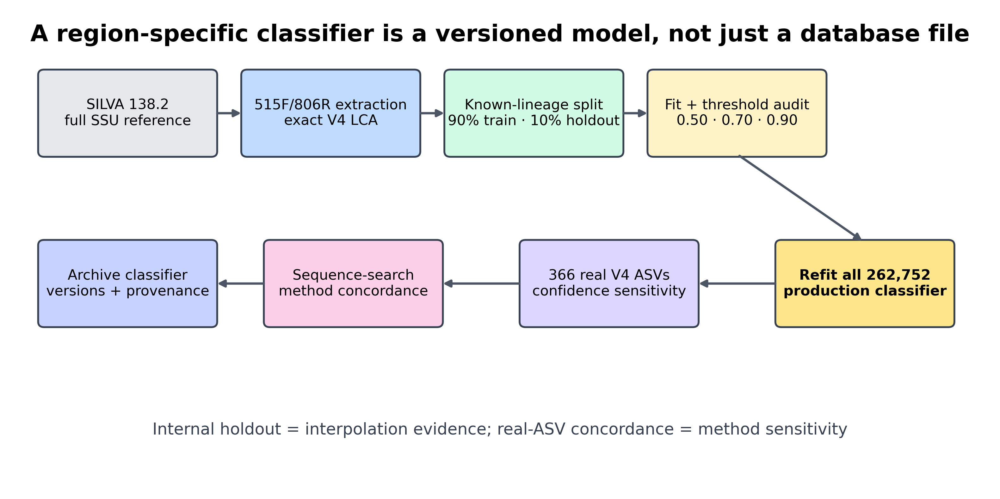
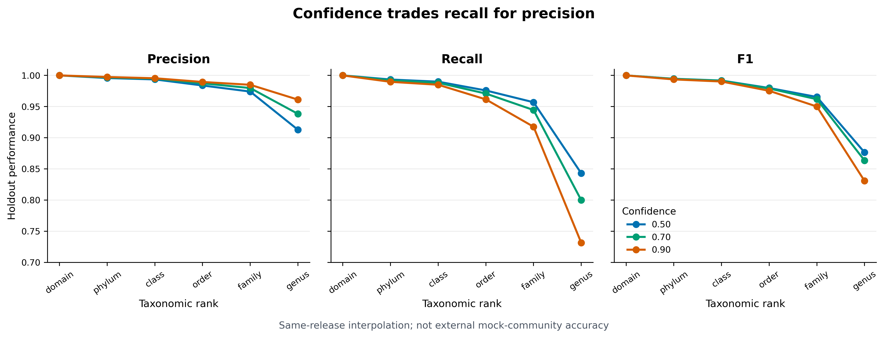
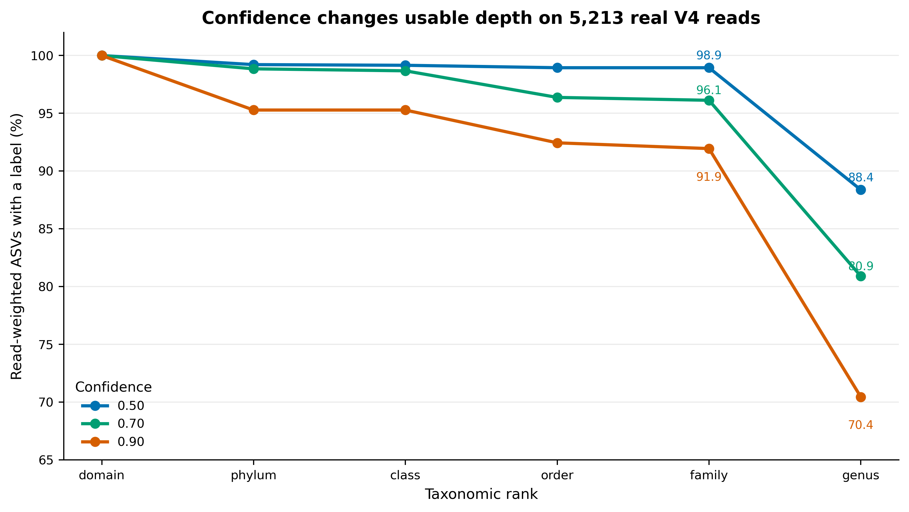
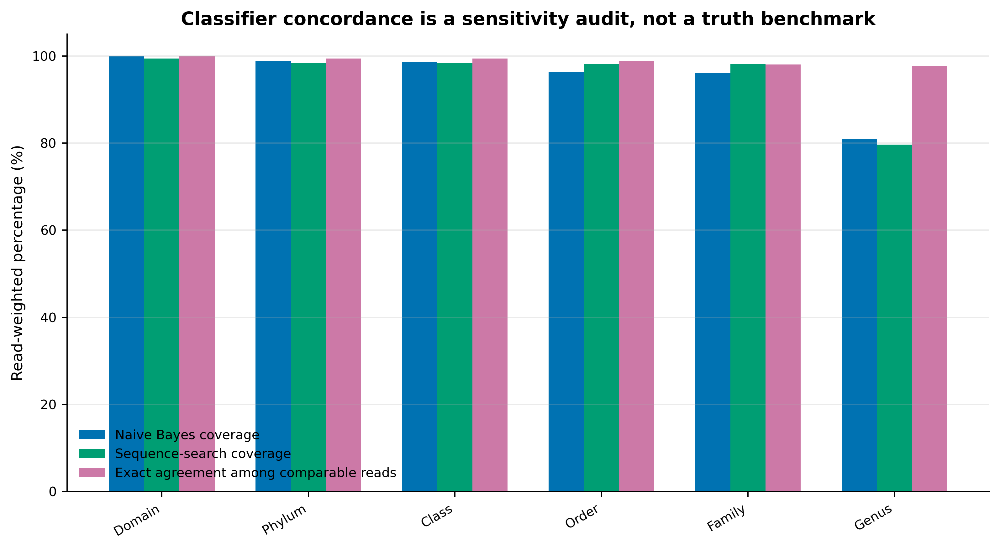

## 为什么分类器必须匹配你的引物区域？ {#sec-target}

训练分类器通常不占正文里最醒目的生态结果图，却决定后面每一张堆叠柱图、差异菌图和网络图上的名称。论文中至少应留下两类证据：

- Methods 中完整的 classifier contract：数据库 release、引物区、区域提取规则、taxonomy 层级、训练参数和软件版本；
- Supplementary 中的验证图：不同置信阈值下逐层 precision、recall、F1、拒判率，以及生产数据上的分类深度敏感性。

{#fig-build-contract}

{#fig-holdout-performance}

{#fig-query-sensitivity}

{#fig-method-concordance}

::: {.callout-important title="先记住一句话"}
**分类器不是一个可以跨项目随手复用的“数据库文件”。它是 marker region、reference release、taxonomy contract、训练参数和 scikit-learn 运行时共同定义的版本化模型。**
:::

本次固定环境与真实结果为：

```text
Environment
  QIIME 2 / q2cli:               2026.4.0
  q2-feature-classifier:         2026.4.0
  scikit-learn:                  1.7.1
  joblib / NumPy / SciPy:        1.5.3 / 2.4.2 / 1.17.1

Region reference
  Database:                      SILVA 138.2 SSURef NR99
  Region:                        515F/806R V4
  Dereplication:                 exact sequence + LCA
  Taxonomy contract:             domain to genus
  Unique reference records:      262,752
  Genus lineages:                5,872

Deterministic known-lineage split
  Training:                      236,516 records
  Holdout:                        26,236 records
  Singleton lineages:                711, training only
  Train/holdout ID overlap:             0
  Train/holdout sequence overlap:       0

Genus-level holdout performance
  confidence     precision     recall       F1       abstained
  0.50             0.9128      0.8429     0.8765       1,980
  0.70             0.9383      0.7998     0.8635       3,819
  0.90             0.9612      0.7314     0.8307       6,184

Real-query genus coverage
  confidence     labeled ASVs       labeled reads
  0.50              352 / 366        4,607 / 5,213
  0.70              318 / 366        4,217 / 5,213
  0.90              294 / 366        3,672 / 5,213

At confidence 0.70 versus SILVA sequence-search
  Genus-comparable:               303 ASVs / 3,797 reads
  Exact genus-name agreement:     293 ASVs / 3,711 reads
  Agreement among comparable:     96.70% ASVs / 97.74% reads

Production classifier
  Reference records used:         262,752
  Training strategy:              refit after threshold audit
  Validation:                     80 / 80 PASS
```

这里的 366 条 ASV 来自固定 commit `f282ad2bafb3ca90190ec87290066ee1985df655` 的真实 nf-core V4 MiSeq 数据。原始 10,000 对 reads 经 anchored、IUPAC-aware 515F/806R 去引物和 DADA2 后保留 5,213 对非嵌合 reads。它们用于测试模型在真实 query 上的分类深度和方法敏感性；原数据没有独立生态分组，因此不据此推断处理效应。

## 开始前：数据与运行环境 {#sec-setup}

在 Linux 或 WSL2 的项目文件夹中运行下面的下载命令。下载后保留这里的相对目录，后续命令使用同一组文件。

```bash
base_url="https://raw.githubusercontent.com/petemeng/microbiome-best-practices/3cb6a817e0c73ab7ecbec1cedc1ad80cbb9ecfaa"
for file in \
  env/qiime2.yml \
  scripts/validate_region_classifier.py
do
  mkdir -p "$(dirname "$file")"
  curl --fail --location --retry 3 "$base_url/$file" --output "$file" || break
done
```


<details>
<summary>本次分析的数据、环境与图形设置</summary>

### 安装并核对 QIIME 2 环境

项目提供已验证的 `env/qiime2.yml`：

```{bash}
mamba env create \
  -n microbiome-qiime2-2026.4 \
  -f env/qiime2.yml \
  --channel-priority flexible
conda activate microbiome-qiime2-2026.4

qiime info
qiime feature-classifier extract-reads --help
qiime feature-classifier fit-classifier-naive-bayes --help
qiime feature-classifier classify-sklearn --help
qiime quality-control evaluate-taxonomy --help

python - <<'PY'
import joblib
import numpy
import scipy
import sklearn

print("scikit-learn", sklearn.__version__)
print("joblib", joblib.__version__)
print("NumPy", numpy.__version__)
print("SciPy", scipy.__version__)
PY
```

若用户目录缓存不可写，把缓存放进项目：

```{bash}
export XDG_CACHE_HOME="${PWD}/.cache/xdg"
export NUMBA_CACHE_DIR="${PWD}/.cache/numba"
export MPLCONFIGDIR="${PWD}/.cache/matplotlib"
mkdir -p \
  work \
  "${XDG_CACHE_HOME}" \
  "${NUMBA_CACHE_DIR}" \
  "${MPLCONFIGDIR}"

qiime tools cache-create --cache work/15-classifier-cache
```

`--use-cache` 必须指向 `qiime tools cache-create` 创建的 QIIME cache，普通空目录不等价。

### 检查真实参考与 query

```{bash}
DATA="data/small/taxonomy-databases"

gzip -t "${DATA}/silva-138.2-v4.fasta.gz"
gzip -t "${DATA}/silva-138.2-v4-taxonomy.tsv.gz"
gzip -t "${DATA}/query-v4-asvs.fasta.gz"

gzip -cd "${DATA}/silva-138.2-v4.fasta.gz" | head -n 6
gzip -cd "${DATA}/silva-138.2-v4-taxonomy.tsv.gz" | head -n 6
gzip -cd "${DATA}/query-v4-asvs.fasta.gz" | head -n 6
head -n 8 "${DATA}/query-v4-asv-abundance.tsv"
```

固定 SHA-256：

```text
silva-138.2-v4.fasta.gz
  3a251d263bd4e12c96023c84b3f2e255b8bcb0d5865dc6f299f9918e6be3a808
silva-138.2-v4-taxonomy.tsv.gz
  f49320aaa32aa70af5c5a48649786e3bb4177868da5da4d2143d0a54c5fa47b0
query-v4-asvs.fasta.gz
  fa71915be8007d36ec70f85d28401f5a94d0d33eca323782cc937cfc4bcf1af4
query-v4-asv-abundance.tsv
  a80e3b94d8632c48fb6c01e788e842c022c3b1ee64b79dc94456618328895e6e
```

最小输入结构：

```text
reference FASTA
  >reference_id
  ACGT...

reference taxonomy TSV
  Feature ID<TAB>Taxon
  reference_id<TAB>d__...; p__...; c__...; o__...; f__...; g__...

query FASTA
  >ASV_ID
  ACGT...

otutab.tsv
  FeatureID<TAB>Sample_1<TAB>Sample_2...

metadata.tsv
  SampleID<TAB>Group<TAB>Batch...
```

### 安装 R 作图依赖并内联出版函数

```{r}
install.packages(
  c("ggplot2", "dplyr", "readr", "tidyr", "stringr", "scales"),
  repos = "https://cloud.r-project.org"
)
```

```{r}
library(ggplot2)
library(dplyr)
library(readr)
library(tidyr)
library(stringr)
library(scales)

set.seed(20260720)

pal_pub <- c(
  "#0072B2", "#D55E00", "#009E73", "#CC79A7",
  "#E69F00", "#56B4E9", "#F0E442", "#999999"
)

scale_color_pub <- function(...) {
  ggplot2::scale_color_manual(values = pal_pub, ...)
}

scale_fill_pub <- function(...) {
  ggplot2::scale_fill_manual(values = pal_pub, ...)
}

theme_pub <- function(base_size = 12) {
  ggplot2::theme_bw(base_size = base_size, base_family = "sans") +
    ggplot2::theme(
      panel.grid.major.x = ggplot2::element_blank(),
      panel.grid.minor = ggplot2::element_blank(),
      axis.text = ggplot2::element_text(color = "black"),
      axis.ticks = ggplot2::element_line(
        color = "black",
        linewidth = 0.3
      ),
      plot.title = ggplot2::element_text(
        face = "bold",
        color = "#111827"
      ),
      plot.subtitle = ggplot2::element_text(color = "#4B5563"),
      legend.key = ggplot2::element_blank(),
      legend.background = ggplot2::element_rect(
        fill = scales::alpha("white", 0.85),
        color = NA
      )
    )
}

save_pub <- function(
  plot,
  file_base,
  width = 170,
  height = 105,
  units = "mm",
  dpi = 350
) {
  dir.create(dirname(file_base), recursive = TRUE, showWarnings = FALSE)
  ggplot2::ggsave(
    paste0(file_base, ".pdf"),
    plot,
    width = width,
    height = height,
    units = units,
    device = grDevices::cairo_pdf
  )
  ggplot2::ggsave(
    paste0(file_base, ".png"),
    plot,
    width = width,
    height = height,
    units = units,
    dpi = dpi,
    bg = "white"
  )
  ggplot2::ggsave(
    paste0(file_base, ".tiff"),
    plot,
    width = width,
    height = height,
    units = units,
    dpi = dpi,
    compression = "lzw",
    bg = "white"
  )
}
```


</details>


## 分类器必须匹配引物和扩增区域 {#sec-theory}

### “区域特异”是让训练集与实验可见信息一致

测序读到的是 V4，不是完整 16S。若直接用全长 SSU 训练，模型会在训练阶段看见 query 永远不会提供的 k-mer；不同参考记录还可能在 V4 上完全相同，却在全长其他区域可区分。

本次参考准备路径是：

```text
SILVA 138.2 full SSU
  → match 515F/806R
  → retain 200–400 nt amplicons
  → exact-sequence dereplication
  → least-common-ancestor taxonomy
  → region-specific classifier
```

区域提取并不会凭空提高生物学分辨率。它解决的是训练域与 query 域不一致；如果两个 genus 在 V4 上不可区分，正确做法是回退到共同祖先，而不是强行给出一个更深名称。

### reference taxonomy 必须先固定

本次 SILVA 合同固定为 domain、phylum、class、order、family、genus 六层。原始 description 中可能出现 species 文本，但没有把它提升为本分类器的 species 输出。这样做把两个问题分开：

- 模型能否在 V4 上支持某个标签；
- 数据库文本是否碰巧含有更深名称。

短 V4 的 genus 标签仍然是参考库条件下的推断；species 或 strain 结论需要额外 marker、培养、基因组或其他正交证据。

### exact-sequence LCA 防止重复参考投票

同一条 V4 序列可能来自多条完整 SSU 记录。若重复项全部进入训练，出现次数多的 lineage 会获得额外权重；若同一序列对应不同 genus，模型还会被要求学习一个从序列本身无法决定的标签。

exact-sequence LCA 的处理是：

```text
identical V4 sequence
  reference A: d__; p__; c__; o__; f__; g__A
  reference B: d__; p__; c__; o__; f__; g__B

retained label
  d__; p__; c__; o__; f__; g__
```

这不是“丢掉已知 genus”，而是把不可辨识性写进训练标签。

### 为什么不能拿训练集自己评估

把同一序列同时放进训练和测试，会得到几乎没有意义的高分。本次先对 262,752 条已经 exact-dereplicated 的序列按完整 genus lineage 分组，再在每个非 singleton lineage 内按固定 SHA-256 顺序留下约 10%：

```text
all reference records:   262,752
training records:        236,516
holdout records:          26,236
shared IDs:                    0
shared sequences:              0
holdout lineages unseen
  in training:                 0
```

711 个 singleton lineage 全部留在 training，确保生产参考范围不因验证拆分而无意义地丢失；它们不参与 holdout。

::: {.callout-warning title="这个留出集故意只回答一个较窄的问题"}
所有 holdout lineage 在 training 中都已有其他参考，因此它评估的是同一 release 内 **known-lineage interpolation**。它通常比独立 mock community、跨 release 测试或真正 novel lineage 更容易，不能写成“真实样本 genus 准确率为 93.8%”。
:::

### precision、recall、F1 与 abstention 要一起看

对每个 taxonomy rank，本次定义：

\[
\mathrm{Precision} =
\frac{\mathrm{Correct}}
{\mathrm{Correct}+\mathrm{Incorrect}}
\]

\[
\mathrm{Recall} =
\frac{\mathrm{Correct}}
{\mathrm{Expected}}
\]

\[
\mathrm{F1} =
\frac{2 \times \mathrm{Precision} \times \mathrm{Recall}}
{\mathrm{Precision}+\mathrm{Recall}}
\]

其中：

- `incorrect`：模型给了该层标签，但名称错误；
- `abstained`：模型没有把 taxonomy 延伸到该层；
- `expected`：reference 在该层有可评估标签的记录数。

只报 precision 会奖励过度保守的模型；只报 recall 会掩盖错误深层标签；只报“有多少 ASV 被注释”则完全不知道名称是否正确。

### confidence 越高，不等于模型“整体越好”

在 q2-feature-classifier 中，confidence 控制何时截断 taxonomy。阈值升高通常提高已给出标签的 precision，同时增加 abstention。

本次 genus 层：

| Confidence | Correct | Incorrect | Abstained | Precision | Recall | F1 |
|---:|---:|---:|---:|---:|---:|---:|
| 0.50 | 21,811 | 2,084 | 1,980 | 0.9128 | 0.8429 | **0.8765** |
| 0.70 | 20,695 | 1,361 | 3,819 | 0.9383 | 0.7998 | 0.8635 |
| 0.90 | 18,926 | 765 | 6,184 | **0.9612** | 0.7314 | 0.8307 |

0.50 在这套内部留出集上得到最高 genus F1；0.70 将错误 genus 从 2,084 降到 1,361，以 recall 下降约 4.3 个百分点为代价；0.90 继续提高 precision，却使真实 query 的 genus read coverage 从 80.9% 降到 70.4%。

因此本页用 0.70 作为主分析的平衡点，但不把它写成普适最优值：

- 探索性筛查、后续会人工核对：可考虑 0.50，并保留敏感性分析；
- 常规群落描述：0.70 是可解释的折中；
- 错误深层标签代价很高：可考虑 0.90，或直接在更高 rank 汇报。

confidence 是模型截断参数，不是经外部校准的“这个 genus 有 70% 概率为真”。

### 明确 Naive Bayes 分类器的参考库、区域与训练设置

本次把会影响模型的参数全部显式写出：

```text
feature analyzer:      char_wb
k-mer range:           7 to 7
hashed features:       8,192
alternate sign:        false
normalization:         L2
MultinomialNB alpha:   0.001
fit prior:             false
class weights:         not supplied
chunk size:            20,000
```

分类时固定：

```text
read orientation:      same
reads per batch:       20,000
parallel jobs:         4
confidence:            0.50 / 0.70 / 0.90
```

`same` 适用于本次已经统一为正向的代表序列。若自己的 ASV FASTA 方向不确定，应先检查流程保证的 orientation，再决定使用 `same`、`reverse-complement` 或 `auto`；不要把方向搜索当作无成本默认。

### 分类器必须与 scikit-learn 版本兼容

QIIME classifier 内部保存了序列化的 scikit-learn pipeline。旧环境训练的模型在新环境中可能：

- 无法反序列化；
- 能读取但发出版本警告；
- 因 feature pipeline 或依赖变化得到不可比结果。

因此 archive 至少要同时保存：

- classifier QZA；
- QIIME 2 和 q2-feature-classifier 版本；
- scikit-learn、joblib、NumPy、SciPy 版本；
- reference FASTA/taxonomy checksum；
- 训练命令和 Artifact provenance。

### 验证后必须用全参考重新训练

236,516 条 training reference 生成的是验证模型，只用于估计 holdout 表现。阈值确定后，本次重新用全部 262,752 条参考训练生产 classifier。否则会故意丢掉 26,236 条已知参考，并把验证过程中的缺口带进正式样本。

```text
holdout classifier
  → choose/report threshold
  → discard as production deliverable

all-reference classifier
  → classify study ASVs
  → archive with versions and provenance
```

### 方法一致性不是 ground truth

在 confidence 0.70 下，Naive Bayes 与同一 SILVA 区域参考的 consensus-VSEARCH 在 303 个都有 genus 标签的 ASV 中有 293 个 exact-name match；按 reads 加权是 3,711/3,797，约 97.74%。

这个高一致性说明本数据的大多数高丰度标签对算法选择不敏感，但不能证明共同标签正确。两种方法共享：

- 同一 query；
- 同一 SILVA release；
- 同一区域 reference；
- 同一 taxonomy schema。

共享偏差也会让二者一致。真正的 accuracy 仍需要已知组成 mock community、人工整理 isolate 或其他独立 truth set。

## 构建区域分类器并检查迁移表现 {#sec-code}

### 从完整 reference 提取与引物一致的区域

如果已经下载完整 SILVA sequences 和固定 taxonomy Artifact，先提取实验区域：

```{bash}
mkdir -p work/15-classifier results/15-train-classifier

qiime feature-classifier extract-reads \
  --i-sequences work/silva-138.2-full-sequences.qza \
  --p-f-primer GTGYCAGCMGCCGCGGTAA \
  --p-r-primer GGACTACNVGGGTWTCTAAT \
  --p-identity 0.80 \
  --p-min-length 200 \
  --p-max-length 400 \
  --p-n-jobs 4 \
  --p-read-orientation both \
  --o-reads work/15-classifier/silva-v4-extracted.qza \
  --use-cache work/15-classifier-cache
```

再把提取成功的 ID 对应 taxonomy 导入，并对完全相同的 V4 序列做 LCA 去冗余：

```{bash}
qiime rescript dereplicate \
  --i-sequences work/15-classifier/silva-v4-extracted.qza \
  --i-taxa work/15-classifier/silva-v4-extracted-taxonomy.qza \
  --p-mode lca \
  --p-perc-identity 1.0 \
  --p-threads 4 \
  --p-rank-handles d__ p__ c__ o__ f__ g__ \
  --o-dereplicated-sequences work/15-classifier/silva-v4-sequences.qza \
  --o-dereplicated-taxa work/15-classifier/silva-v4-taxonomy.qza \
  --use-cache work/15-classifier-cache
```

`silva-v4-extracted-taxonomy.qza` 只能含有成功提取的 sequence IDs；先按 ID 取子集，再导入，不能把完整 taxonomy 与区域 sequences 直接错配。

本页已经提供经过上述流程和 checksum 审计的小型压缩资产，可直接导入：

```{bash}
gzip -cd data/small/taxonomy-databases/silva-138.2-v4.fasta.gz \
  > work/15-classifier/silva-v4.fasta
gzip -cd data/small/taxonomy-databases/silva-138.2-v4-taxonomy.tsv.gz \
  > work/15-classifier/silva-v4-taxonomy.tsv
gzip -cd data/small/taxonomy-databases/query-v4-asvs.fasta.gz \
  > work/15-classifier/query-v4-asvs.fasta

qiime tools import \
  --type 'FeatureData[Sequence]' \
  --input-path work/15-classifier/silva-v4.fasta \
  --output-path work/15-classifier/silva-v4-sequences.qza \
  --validate-level max

qiime tools import \
  --type 'FeatureData[Taxonomy]' \
  --input-format TSVTaxonomyFormat \
  --input-path work/15-classifier/silva-v4-taxonomy.tsv \
  --output-path work/15-classifier/silva-v4-taxonomy.qza \
  --validate-level max

qiime tools import \
  --type 'FeatureData[Sequence]' \
  --input-path work/15-classifier/query-v4-asvs.fasta \
  --output-path work/15-classifier/query-v4-asvs.qza \
  --validate-level max
```

### 先建立不泄漏的验证拆分

本页的完整拆分 membership 已保存为 `reference-split-membership.tsv.gz`。核心规则是按 domain–genus 完整 lineage 分组、singleton 留在 training、其他 lineage 按固定 SHA-256 顺序取约 10% holdout：

```{python}
import csv
import gzip
import hashlib
import math
from collections import defaultdict

SEED = "article15-silva1382-v4-known-lineage-v1"

def read_fasta(path):
    seqs, key, pieces = {}, None, []
    with open(path) as handle:
        for line in handle:
            line = line.strip()
            if line.startswith(">"):
                if key is not None:
                    seqs[key] = "".join(pieces).upper()
                key, pieces = line[1:].split()[0], []
            elif line:
                pieces.append(line)
    if key is not None:
        seqs[key] = "".join(pieces).upper()
    return seqs

def write_fasta(path, ids, seqs):
    with open(path, "w") as handle:
        for feature_id in sorted(ids):
            handle.write(f">{feature_id}\n{seqs[feature_id]}\n")

def write_taxonomy(path, ids, taxonomy):
    with open(path, "w", newline="") as handle:
        writer = csv.writer(handle, delimiter="\t")
        writer.writerow(["Feature ID", "Taxon"])
        for feature_id in sorted(ids):
            writer.writerow([feature_id, taxonomy[feature_id]])

seqs = read_fasta("work/15-classifier/silva-v4.fasta")
with open("work/15-classifier/silva-v4-taxonomy.tsv") as handle:
    taxonomy = {
        row["Feature ID"]: row["Taxon"]
        for row in csv.DictReader(handle, delimiter="\t")
    }

groups = defaultdict(list)
for feature_id, taxon in taxonomy.items():
    lineage = "; ".join(
        (taxon.split(";") + [""] * 6)[:6]
    )
    groups[lineage].append(feature_id)

training, holdout, membership = [], [], []
for lineage in sorted(groups):
    ordered = sorted(
        groups[lineage],
        key=lambda feature_id: hashlib.sha256(
            f"{SEED}\t{feature_id}\t{seqs[feature_id]}".encode()
        ).hexdigest()
    )
    n_holdout = (
        0 if len(ordered) == 1
        else min(len(ordered) - 1, max(1, math.floor(0.10 * len(ordered))))
    )
    holdout_ids = set(ordered[:n_holdout])
    for feature_id in ordered:
        split = "holdout" if feature_id in holdout_ids else "training"
        (holdout if split == "holdout" else training).append(feature_id)
        membership.append([feature_id, split, lineage, len(ordered)])

assert not set(training) & set(holdout)
assert not ({seqs[x] for x in training} & {seqs[x] for x in holdout})
assert len(training) == 236516
assert len(holdout) == 26236

write_fasta("work/15-classifier/training.fasta", training, seqs)
write_fasta("work/15-classifier/holdout.fasta", holdout, seqs)
write_taxonomy(
    "work/15-classifier/training-taxonomy.tsv", training, taxonomy
)
write_taxonomy(
    "work/15-classifier/holdout-taxonomy.tsv", holdout, taxonomy
)

with gzip.open(
    "results/15-train-classifier/reference-split-membership.tsv.gz",
    "wt",
    encoding="utf-8"
) as handle:
    writer = csv.writer(handle, delimiter="\t")
    writer.writerow(["feature_id", "split", "genus_lineage", "lineage_records"])
    writer.writerows(sorted(membership))
```

独立 mock community 可以直接替代这一内部留出集；若目标是测试 novel lineage，应按更高层 lineage 做 group holdout，而不是保证每个 genus 都在 training 中出现。

导入拆分后的四个对象：

```{bash}
qiime tools import \
  --type 'FeatureData[Sequence]' \
  --input-path work/15-classifier/training.fasta \
  --output-path work/15-classifier/training-sequences.qza \
  --validate-level max

qiime tools import \
  --type 'FeatureData[Taxonomy]' \
  --input-format TSVTaxonomyFormat \
  --input-path work/15-classifier/training-taxonomy.tsv \
  --output-path work/15-classifier/training-taxonomy.qza \
  --validate-level max

qiime tools import \
  --type 'FeatureData[Sequence]' \
  --input-path work/15-classifier/holdout.fasta \
  --output-path work/15-classifier/holdout-sequences.qza \
  --validate-level max

qiime tools import \
  --type 'FeatureData[Taxonomy]' \
  --input-format TSVTaxonomyFormat \
  --input-path work/15-classifier/holdout-taxonomy.tsv \
  --output-path work/15-classifier/holdout-expected-taxonomy.qza \
  --validate-level max
```

### 训练验证 classifier

```{bash}
qiime feature-classifier fit-classifier-naive-bayes \
  --i-reference-reads work/15-classifier/training-sequences.qza \
  --i-reference-taxonomy work/15-classifier/training-taxonomy.qza \
  --p-classify--alpha 0.001 \
  --p-classify--chunk-size 20000 \
  --p-no-classify--fit-prior \
  --p-no-feat-ext--alternate-sign \
  --p-feat-ext--analyzer char_wb \
  --p-feat-ext--n-features 8192 \
  --p-feat-ext--ngram-range '[7, 7]' \
  --p-feat-ext--norm l2 \
  --o-classifier results/15-train-classifier/silva-v4-holdout-classifier.qza \
  --use-cache work/15-classifier-cache
```

### 在三个阈值上分类 holdout

三次命令除 confidence 和输出名外完全相同：

```{bash}
qiime feature-classifier classify-sklearn \
  --i-reads work/15-classifier/holdout-sequences.qza \
  --i-classifier results/15-train-classifier/silva-v4-holdout-classifier.qza \
  --p-reads-per-batch 20000 \
  --p-n-jobs 4 \
  --p-confidence 0.50 \
  --p-read-orientation same \
  --o-classification results/15-train-classifier/holdout-taxonomy-c050.qza \
  --use-cache work/15-classifier-cache

qiime feature-classifier classify-sklearn \
  --i-reads work/15-classifier/holdout-sequences.qza \
  --i-classifier results/15-train-classifier/silva-v4-holdout-classifier.qza \
  --p-reads-per-batch 20000 \
  --p-n-jobs 4 \
  --p-confidence 0.70 \
  --p-read-orientation same \
  --o-classification results/15-train-classifier/holdout-taxonomy-c070.qza \
  --use-cache work/15-classifier-cache

qiime feature-classifier classify-sklearn \
  --i-reads work/15-classifier/holdout-sequences.qza \
  --i-classifier results/15-train-classifier/silva-v4-holdout-classifier.qza \
  --p-reads-per-batch 20000 \
  --p-n-jobs 4 \
  --p-confidence 0.90 \
  --p-read-orientation same \
  --o-classification results/15-train-classifier/holdout-taxonomy-c090.qza \
  --use-cache work/15-classifier-cache
```

为主阈值生成 QIIME 官方评估：

```{bash}
qiime quality-control evaluate-taxonomy \
  --i-expected-taxa work/15-classifier/holdout-expected-taxonomy.qza \
  --i-observed-taxa results/15-train-classifier/holdout-taxonomy-c070.qza \
  --p-depth 6 \
  --p-palette tab10 \
  --o-visualization results/15-train-classifier/holdout-evaluation-c070.qzv \
  --use-cache work/15-classifier-cache
```

### 用全部参考序列重训用于正式分析的分类器

评估结束后，重新使用全部 262,752 条 reference：

```{bash}
qiime feature-classifier fit-classifier-naive-bayes \
  --i-reference-reads work/15-classifier/silva-v4-sequences.qza \
  --i-reference-taxonomy work/15-classifier/silva-v4-taxonomy.qza \
  --p-classify--alpha 0.001 \
  --p-classify--chunk-size 20000 \
  --p-no-classify--fit-prior \
  --p-no-feat-ext--alternate-sign \
  --p-feat-ext--analyzer char_wb \
  --p-feat-ext--n-features 8192 \
  --p-feat-ext--ngram-range '[7, 7]' \
  --p-feat-ext--norm l2 \
  --o-classifier results/15-train-classifier/silva-v4-classifier.qza \
  --use-cache work/15-classifier-cache
```

### 分类真实 ASV，并保留阈值敏感性

主分析：

```{bash}
qiime feature-classifier classify-sklearn \
  --i-reads work/15-classifier/query-v4-asvs.qza \
  --i-classifier results/15-train-classifier/silva-v4-classifier.qza \
  --p-reads-per-batch 20000 \
  --p-n-jobs 4 \
  --p-confidence 0.70 \
  --p-read-orientation same \
  --o-classification results/15-train-classifier/query-taxonomy-c070.qza \
  --use-cache work/15-classifier-cache
```

敏感性分支只改 confidence 与输出名：

```{bash}
# Lower threshold
qiime feature-classifier classify-sklearn \
  --i-reads work/15-classifier/query-v4-asvs.qza \
  --i-classifier results/15-train-classifier/silva-v4-classifier.qza \
  --p-reads-per-batch 20000 \
  --p-n-jobs 4 \
  --p-confidence 0.50 \
  --p-read-orientation same \
  --o-classification results/15-train-classifier/query-taxonomy-c050.qza \
  --use-cache work/15-classifier-cache

# Higher threshold
qiime feature-classifier classify-sklearn \
  --i-reads work/15-classifier/query-v4-asvs.qza \
  --i-classifier results/15-train-classifier/silva-v4-classifier.qza \
  --p-reads-per-batch 20000 \
  --p-n-jobs 4 \
  --p-confidence 0.90 \
  --p-read-orientation same \
  --o-classification results/15-train-classifier/query-taxonomy-c090.qza \
  --use-cache work/15-classifier-cache
```

### 在本篇内重算 sequence-search comparator

方法一致性图不读取其他章节的分类结果，而是用本篇已导入的 query、SILVA V4 sequences 和 taxonomy 重新运行同一套 bounded consensus-VSEARCH：

```{bash}
qiime feature-classifier classify-consensus-vsearch \
  --i-query work/15-classifier/query-v4-asvs.qza \
  --i-reference-reads work/15-classifier/silva-v4-sequences.qza \
  --i-reference-taxonomy work/15-classifier/silva-v4-taxonomy.qza \
  --p-maxaccepts 50 \
  --p-maxrejects all \
  --p-perc-identity 0.8 \
  --p-query-cov 0.8 \
  --p-strand both \
  --p-top-hits-only \
  --p-maxhits all \
  --p-output-no-hits \
  --p-threads 4 \
  --p-min-consensus 0.51 \
  --p-unassignable-label Unassigned \
  --o-classification \
    results/15-train-classifier/silva-sequence-search-taxonomy.qza \
  --o-search-results \
    results/15-train-classifier/silva-sequence-search-results.qza \
  --use-cache work/15-classifier-cache \
  --no-recycle
```

这两个 comparator Artifact 服务于方法敏感性审计，不取代生产 Naive Bayes taxonomy。

### 导出 taxonomy，回到通用三件套

```{bash}
qiime tools export \
  --input-path results/15-train-classifier/query-taxonomy-c070.qza \
  --output-path results/15-train-classifier/query-taxonomy-c070-export
```

把单列 taxonomy 拆成六层，并核对它能与自己的 `otutab`、`metadata` 对齐：

```{r}
tax_raw <- read_tsv(
  "results/15-train-classifier/query-taxonomy-c070-export/taxonomy.tsv",
  show_col_types = FALSE
)

rank_names <- c(
  "Domain", "Phylum", "Class", "Order", "Family", "Genus"
)

split_rank <- function(x) {
  value <- str_split(x, ";", simplify = TRUE)
  value <- value[, seq_len(min(ncol(value), 6)), drop = FALSE]
  if (ncol(value) < 6) {
    value <- cbind(
      value,
      matrix("", nrow(value), 6 - ncol(value))
    )
  }
  value <- apply(value, 2, str_trim)
  value <- apply(value, 2, str_remove, "^[dpcofg]__")
  colnames(value) <- rank_names
  value
}

taxonomy <- bind_cols(
  tibble(FeatureID = tax_raw$`Feature ID`),
  as_tibble(split_rank(tax_raw$Taxon))
)

otutab <- read_tsv("data/your-project/otutab.tsv", show_col_types = FALSE)
metadata <- read_tsv("data/your-project/metadata.tsv", show_col_types = FALSE)

stopifnot(setequal(otutab$FeatureID, taxonomy$FeatureID))
stopifnot(
  setequal(
    names(otutab)[-1],
    metadata$SampleID
  )
)

write_tsv(taxonomy, "results/15-train-classifier/taxonomy.tsv")
```

此时下游分析重新回到：

```text
otutab.tsv     features × samples
taxonomy.tsv   features × ranks
metadata.tsv   samples × variables
```

### 一次性运行完整审计

项目脚本把固定拆分、两次训练、六次分类、指标、图形、maximum validation 和 provenance 合在同一入口：

```{bash}
python3 scripts/validate_region_classifier.py \
  --project-root . \
  --output-dir results/15-train-classifier \
  --figure-dir figures \
  --qiime-env microbiome-qiime2-2026.4
```

脚本会在本篇工作目录内重新计算 sequence-search comparator，再生成关键输出：

```text
classifier-training-summary.json
reference-split-audit.tsv
reference-split-membership.tsv.gz
holdout-rank-metrics.tsv
query-rank-coverage.tsv
query-method-concordance.tsv
silva-v4-classifier.qza
holdout-evaluation-c070.qzv
provenance-audit.tsv
validation-checks.tsv
validation.log
```

完成后先看：

```{bash}
cat results/15-train-classifier/validation.log
column -t -s $'\t' \
  results/15-train-classifier/holdout-rank-metrics.tsv
column -t -s $'\t' \
  results/15-train-classifier/query-rank-coverage.tsv
```

必须得到 `80 / 80 PASS`，再把 classifier 用于正式数据。

## 比较分类器置信度与未见谱系表现 {#sec-publication}

### 验证主图同时放 precision、recall 和 F1

```{r}
holdout <- read_tsv(
  "results/15-train-classifier/holdout-rank-metrics.tsv",
  show_col_types = FALSE
) |>
  mutate(
    confidence = factor(
      sprintf("%.2f", confidence),
      levels = c("0.50", "0.70", "0.90")
    ),
    rank = factor(
      str_to_title(rank),
      levels = c("Domain", "Phylum", "Class", "Order", "Family", "Genus")
    )
  ) |>
  pivot_longer(
    c(precision, recall, f1),
    names_to = "metric",
    values_to = "value"
  ) |>
  mutate(
    metric = recode(
      metric,
      precision = "Precision",
      recall = "Recall",
      f1 = "F1"
    )
  )

p_holdout <- ggplot(
  holdout,
  aes(rank, value, color = confidence, group = confidence)
) +
  geom_hline(yintercept = 1, color = "#D1D5DB", linewidth = 0.3) +
  geom_line(linewidth = 0.8) +
  geom_point(size = 2.1) +
  facet_wrap(~metric, nrow = 1) +
  scale_color_pub(name = "Confidence") +
  scale_y_continuous(
    limits = c(0, 1.02),
    breaks = seq(0, 1, 0.2)
  ) +
  labs(
    x = "Taxonomic rank",
    y = "Holdout performance",
    title = "Confidence trades recall for precision",
    subtitle = "Same-release known-lineage interpolation"
  ) +
  theme_pub() +
  theme(axis.text.x = element_text(angle = 35, hjust = 1))

save_pub(
  p_holdout,
  "figures/15-holdout-rank-performance-r",
  width = 180,
  height = 85
)
```

图题必须出现 `known-lineage` 或 `same-release interpolation`，避免读者把内部留出误读成外部准确率。

### 正式样本用 read-weighted coverage 展示阈值代价

```{r}
query_cov <- read_tsv(
  "results/15-train-classifier/query-rank-coverage.tsv",
  show_col_types = FALSE
) |>
  mutate(
    confidence = factor(
      sprintf("%.2f", confidence),
      levels = c("0.50", "0.70", "0.90")
    ),
    rank = factor(
      str_to_title(rank),
      levels = c("Domain", "Phylum", "Class", "Order", "Family", "Genus")
    )
  )

p_query <- ggplot(
  query_cov,
  aes(rank, 100 * read_fraction, color = confidence, group = confidence)
) +
  geom_line(linewidth = 0.9) +
  geom_point(size = 2.2) +
  scale_color_pub(name = "Confidence") +
  scale_y_continuous(
    limits = c(0, 102),
    breaks = seq(0, 100, 20),
    labels = label_number(suffix = "%")
  ) +
  labs(
    x = "Taxonomic rank",
    y = "Read-weighted ASVs with a label",
    title = "Confidence changes usable taxonomic depth",
    subtitle = "366 V4 ASVs representing 5,213 reads"
  ) +
  theme_pub()

save_pub(
  p_query,
  "figures/15-query-confidence-sensitivity-r",
  width = 155,
  height = 95
)
```

ASV-weighted 和 read-weighted 结果都应保存在表中；主图可优先使用 read-weighted coverage，因为它更接近后续丰度图实际保留的数据量。

### 分开比较注释覆盖率与方法一致性

Naive Bayes 和 sequence-search 的可注释集合并不相同。exact-name agreement 的分母只能是“两种方法在该层都给出标签”的 comparable ASVs/reads，不能用全部 366 个 ASV。

本次 genus 层：

```text
Naive Bayes coverage:         318 ASVs / 4,217 reads
Sequence-search coverage:     341 ASVs / 4,151 reads
Comparable set:               303 ASVs / 3,797 reads
Exact agreement:              293 ASVs / 3,711 reads
```

图例应写 `Exact agreement among comparable reads`，不要简写为 `Accuracy`。

### 主文、补充材料和归档各放什么

| 位置 | 最少内容 |
|---|---|
| Methods | reference release、引物区、LCA、模型参数、confidence、软件版本 |
| 主文或补图 | 阈值下逐层 precision/recall/F1 与真实 query coverage |
| Supplementary table | correct、incorrect、abstained、ASV/read-weighted coverage、方法 crosswalk |
| Archive | classifier QZA、reference checksum、split membership、provenance、完整命令日志 |

classifier 文件本身不能替代 Methods；Methods 也不能替代可读取的 classifier 和 reference provenance。

## 常见坑 {#sec-pitfalls}

::: {.callout-caution title="审稿人最容易追问的十个问题"}

1. **用错引物区。** V3–V4、V4 和全长 classifier 不是同一模型；forward/reverse primer、允许 mismatch 与长度范围都要报告。
2. **reference 与 taxonomy ID 不对齐。** 区域提取后必须按成功提取的 IDs 取 taxonomy 子集，再做 LCA。
3. **train/test 泄漏。** 相同序列、同一个重复 reference 或其改名副本不能同时进入两侧。
4. **把 known-lineage 留出写成外部准确率。** 本页 holdout 中每个 genus lineage 在 training 都已出现，结果只支持内部插值。
5. **只报 accuracy 或 assignment rate。** 至少同时报告 precision、recall、F1 和 abstention，并说明可评估分母。
6. **把 confidence 当概率。** `0.70` 是 taxonomy truncation 阈值，不是校准后的 70% 正确概率。
7. **用验证 classifier 交付。** 阈值确定后必须用全部 reference 重训生产模型。
8. **忽略 scikit-learn ABI。** classifier 要与训练时 QIIME/q2-feature-classifier/scikit-learn 版本一起保存和测试。
9. **把更深标签当更高分辨率。** 数据库能输出 genus 或 species 字符串，不等于 marker region 已唯一支持该分类。
10. **把两种方法一致当作 ground truth。** 共享 reference 和 taxonomy 的方法也会共享偏差；独立 mock community 才能提供更接近 truth 的验证。

:::

## 报告区域分类器与验证设计 {#sec-methods}

### 区域参考与训练模板

> Reference 16S rRNA sequences and taxonomy were obtained from SILVA SSURef NR99 release 138.2. Reference reads were trimmed in silico to the 515F/806R V4 region (primer-match identity 0.80; retained length 200–400 nt) and exact-sequence duplicates were collapsed using least-common-ancestor taxonomy. The resulting reference comprised 262,752 unique V4 sequences with a fixed domain-to-genus taxonomy schema. A region-specific Naive Bayes classifier was fitted with q2-feature-classifier 2026.4.0 under QIIME 2 2026.4.0 and scikit-learn 1.7.1 using 7-mer character features, 8,192 hashed features, alpha = 0.001, and uniform class priors.

### 内部验证与阈值模板

> To assess same-release known-lineage interpolation, reference sequences were grouped by complete genus lineage and deterministically ordered using SHA-256 hashes. Singleton lineages were retained in training, and approximately 10% of records from each remaining lineage were held out, yielding 236,516 training and 26,236 holdout sequences with no shared identifiers or exact sequences. Taxonomy was predicted at confidence thresholds of 0.50, 0.70, and 0.90. At genus level, precision/recall/F1 were 0.913/0.843/0.876, 0.938/0.800/0.864, and 0.961/0.731/0.831, respectively. These estimates describe interpolation within SILVA 138.2 and were not interpreted as external sample accuracy.

### 正式样本模板

> After threshold evaluation, the production classifier was refitted using all 262,752 region-matched reference sequences. Representative ASV sequences were classified at confidence 0.70 with read orientation fixed to the forward reference orientation, 20,000 reads per batch, and four parallel jobs. Taxonomic sensitivity was assessed at confidence 0.50 and 0.90. At the primary threshold, 318 of 366 ASVs, representing 4,217 of 5,213 reads, received a genus label. Species- and strain-level claims were not made from the V4 classifier.

如果用了 independent mock community，应把第二段的 known-lineage split 换成 mock 的真实组成、理论拷贝数、预期 taxonomy 和混样批次，不要仍沿用这里的内部验证措辞。

## 将区域分类器与验证设计用于自己的研究 {#sec-own-data}

### 先确定目标区域、参考序列与分类器参数

在运行前填完：

| Field | Your value |
|---|---|
| Marker / region | 16S V4, V3–V4, full-length, ITS2… |
| Forward primer | sequence with IUPAC codes |
| Reverse primer | sequence with IUPAC codes |
| Reference database | name and release |
| Source files | URLs and checksums |
| Taxonomy schema | retained ranks and prefixes |
| Region extraction | identity, length, orientation |
| Dereplication | exact sequence, LCA rule |
| Model | QIIME/q2-feature-classifier/sklearn versions |
| Threshold plan | candidate confidence values |
| External validation | mock, isolate, cross-release, or unavailable |

缺少其中任一项，classifier 都无法被别人准确复现。

### 准备四个输入

```text
reference-sequences.fasta
reference-taxonomy.tsv
rep-seqs.fasta
otutab.tsv + metadata.tsv
```

taxonomy 在本篇生成，因此分析开始时的 query 侧不是已有 `taxonomy.tsv`，而是 `rep-seqs.fasta`。代表序列 ID 必须与 `otutab.tsv` 第一列完全一致；样本列必须与 `metadata.tsv` 的 `SampleID` 完全一致。

### 只改路径、引物和输出前缀

复制代码时至少替换：

```bash
DATA="data/your-project"
F_PRIMER="YOUR_FORWARD_PRIMER"
R_PRIMER="YOUR_REVERSE_PRIMER"
MIN_LENGTH="YOUR_MINIMUM"
MAX_LENGTH="YOUR_MAXIMUM"
PREFIX="your-region-your-database-release"
```

不要沿用本页 `515F/806R`、200–400 nt 或 `same` orientation，除非它们确实与实验一致。

### 优先使用独立 truth set

验证证据从强到弱可写为：

```text
matched mock community / cultured isolates
  > external curated sequences
  > cross-release or lineage-group holdout
  > same-release known-lineage holdout
  > training-set self score
```

最后一项几乎不能支持泛化性能。没有 mock 时，应明确写出限制，并在更高 taxonomy rank 上报告结论。

### 阈值按错误代价选择

先定义研究中哪种错误更贵：

- false genus 会进入临床解释或机制讨论：优先 precision；
- 主要做群落概览且会保留 higher-rank fallback：可接受更高 abstention；
- 稀有类群筛查且后续有独立验证：可接受较低阈值；
- 结果对阈值敏感：主文报告一个阈值，补充材料保留完整敏感性。

不要只因为 QIIME 默认是 0.70 就省略验证。

### 交付标准三件套与模型归档

最终至少交付：

```text
otutab.tsv
taxonomy.tsv
metadata.tsv
rep-seqs.fasta
classifier.qza
classifier-contract.tsv
reference-checksums.tsv
validation-metrics.tsv
provenance-audit.tsv
```

下游丰度、组成和差异分析只读取前三件套；模型归档负责解释 `taxonomy.tsv` 是怎样产生的。

## 参考 {#sec-references}

- Bokulich NA, Kaehler BD, Rideout JR, et al. Optimizing taxonomic classification of marker-gene amplicon sequences with QIIME 2's q2-feature-classifier plugin. *Microbiome*. 2018;6:90. <https://doi.org/10.1186/s40168-018-0470-z>
- Werner JJ, Koren O, Hugenholtz P, et al. Impact of training sets on classification of high-throughput bacterial 16S rRNA gene surveys. *ISME Journal*. 2012;6:94–103. <https://pubmed.ncbi.nlm.nih.gov/21716311/>
- Robeson MS III, O'Rourke DR, Kaehler BD, et al. RESCRIPt: Reproducible sequence taxonomy reference database management for the masses. *PLOS Computational Biology*. 2021;17:e1009581. <https://doi.org/10.1371/journal.pcbi.1009581>
- SILVA. Release 138.2 documentation. <https://www.arb-silva.de/documentation/release-1382/>
- QIIME 2. Training feature classifiers with q2-feature-classifier. <https://docs.qiime2.org/2024.10/tutorials/feature-classifier/>
- QIIME 2. Current `feature-classifier` action and parameter reference. <https://amplicon-docs.qiime2.org/en/stable/references/plugins/feature-classifier/>
- nf-core/test-datasets. V4 MiSeq test data at commit `f282ad2bafb3ca90190ec87290066ee1985df655`. <https://github.com/nf-core/test-datasets/tree/f282ad2bafb3ca90190ec87290066ee1985df655/testdata>
