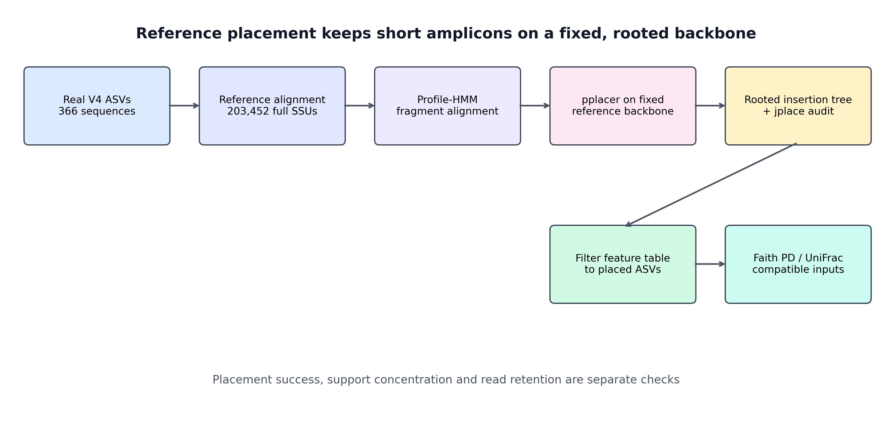
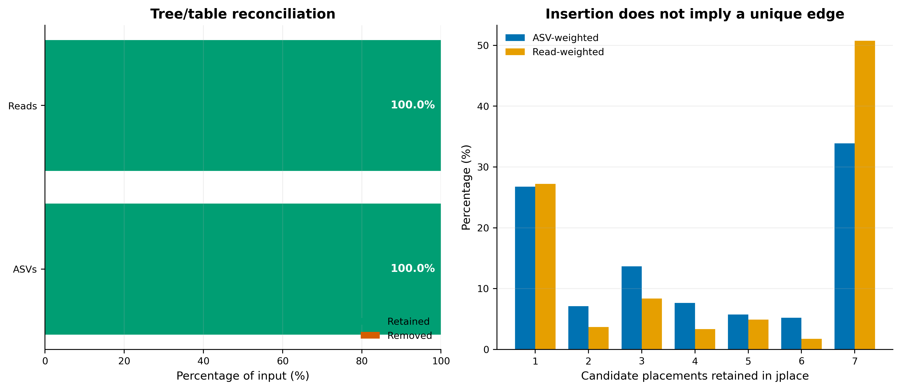
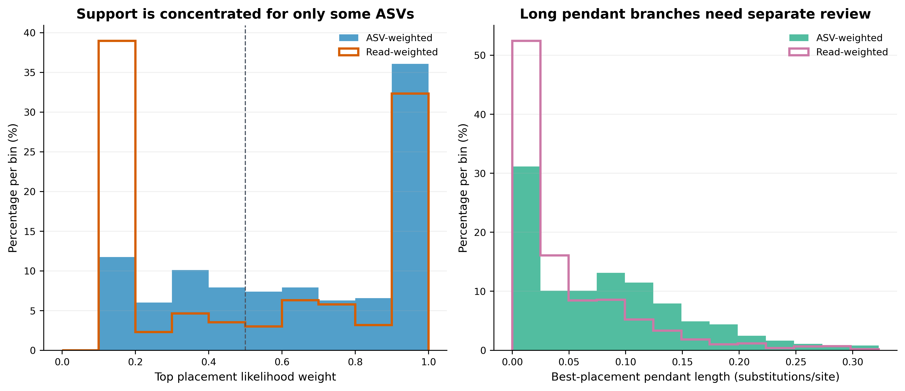
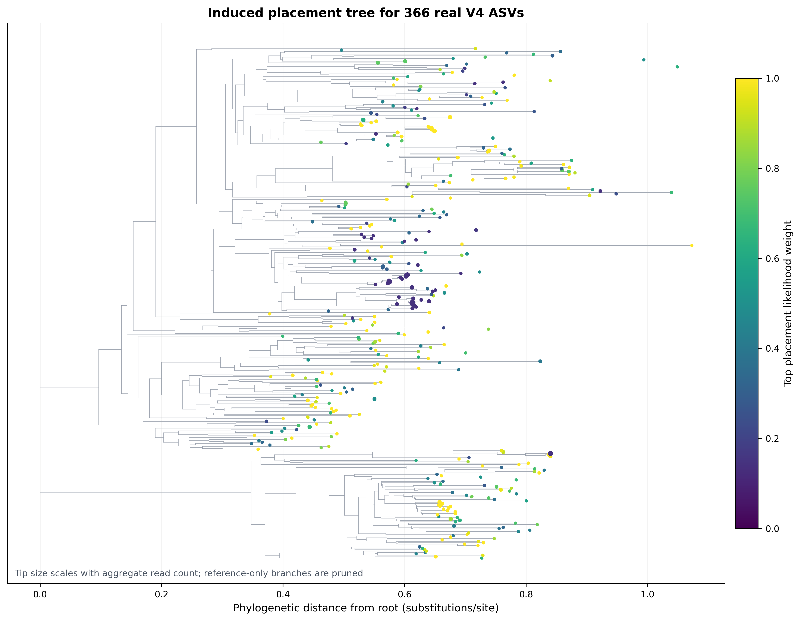

> **分析目标：**把 366 条真实 515F/806R V4 ASV 放入固定的 Greengenes 13_8 99% SEPP backbone，得到可供 Faith's PD 和 UniFrac 使用的 rooted phylogeny；同时审计每条 ASV 的 placement support、枝长、树尖端和 feature-table 保留率。  
> **输入文件：**代表序列 FASTA、与 ASV ID 对齐的 `otutab.tsv`，以及用于下游解释的 `taxonomy.tsv`、`metadata.tsv`。本例的生态样本矩阵没有随公开小数据交付，因此只用 5,213 条 reads 的聚合频数验证 feature retention，不进行样本间生态比较。  
> **预计资源：**官方 SEPP reference Artifact 约 47.8 MiB；本次在 8 线程下 fragment insertion 用时约 7.4 分钟，feature filtering 约 36 秒。建议预留 8 GB 内存、2 GB 工作空间和 15–30 分钟。  
> **执行策略：**reference 下载与最大级别验证、SEPP、jplace/树/BIOM 导出、tip reconciliation、feature filtering、Artifact provenance 和重复运行稳定性均已一次性实跑；网页构建使用 `eval: false`，避免每次渲染重新执行上游任务。

## UniFrac 之前，先得到可信的系统发育树 {#sec-target}

系统发育树通常不会直接作为一张“全树图”放进正文。它更常以三种形式进入论文：

- Methods 中的 reference-placement contract：reference release、算法、subset 参数、线程和软件版本；
- Supplementary 中的放置质量与序列保留审计；
- 下游 Faith's PD、weighted UniFrac、unweighted UniFrac、phylogenetic balance 或树注释图。

Janssen 等人的 SEPP 评估中，Figure 5 用已知来源的 V4 片段量化插入误差与歧义，Figure S2 比较 alignment/placement subset 的运行代价，Figure 12 对比 reference insertion 与 de novo tree construction。下面沿用这套验证逻辑，在真实 ASV 上检查插入、过滤和系统发育树的可用性。

{#fig-sepp-contract}

{#fig-retention-audit}

{#fig-placement-diagnostics}

{#fig-query-tree}

::: {.callout-important title="先记住一句话"}
**SEPP 是 reference placement，不是从头估计一棵新树。输出树能提供共享参考坐标和系统发育距离，但不会让短 V4 获得全长 16S 的分辨率。**
:::

本次固定环境与真实结果为：

```text
Runtime
  QIIME 2 / q2cli:                 2026.4.0
  q2-fragment-insertion:           2026.4.0
  SEPP / HMMER / pplacer:          4.5.6 / 3.4 / 1.1.alpha19
  Threads:                         8
  Alignment / placement subset:    1,000 / 5,000

Reference contract
  Artifact:                        sepp-refs-gg-13-8.qza
  Semantic type:                   SeppReferenceDatabase
  Artifact UUID:                   a14c6180-506b-4ecb-bacb-9cb30bc3044b
  SHA-256:                         e252b83d7d5fbf2a9e14e594768e3578b33b557c34e22b6abc83b324689b1360
  Artifact framework/plugin:       QIIME 2 / q2-fragment-insertion 2019.10.0
  Embedded SEPP version:           4.3.10
  Reference alignment:             203,452 sequences × 1,285 columns
  Reference tree:                  203,452 tips; rooted; no negative lengths

Real V4 query
  ASVs / aggregate reads:          366 / 5,213
  Sequence length:                 252–303 nt; median 253 nt
  Placed and retained:             366 ASVs / 5,213 reads
  Removed after placement:         0 ASVs / 0 reads

Placement diagnostics
  Top likelihood-weight median:    0.6942
  Read-weighted median:            0.5033
  Top weight < 0.50:               131 ASVs / 2,576 reads
  Top weight >= 0.90:              132 ASVs / 1,686 reads
  One candidate position:          98 ASVs / 1,419 reads
  Seven candidate positions:       124 ASVs / 2,647 reads
  Pendant-length median / q95:     0.0721 / 0.2121

Output tree
  Total / query / reference tips:  203,818 / 366 / 203,452
  Root degree:                     2
  Missing / negative lengths:      0 / 0
  Validation:                      74 / 74 PASS
```

这些 ASV 来自 nf-core/test-datasets 固定提交 `f282ad2bafb3ca90190ec87290066ee1985df655` 的真实 MiSeq V4 数据。原始 10,000 对 reads 经 anchored、IUPAC-aware 515F/806R 去引物和 DADA2 后保留 5,213 对非嵌合 reads，得到 366 个 ASV。

## SEPP 如何把短序列放入参考树 {#sec-theory}

### 1. reference placement 与 de novo 建树是两条不同路线

de novo 路线通常是：

```text
query sequences
  → multiple-sequence alignment
  → alignment masking
  → tree inference
  → midpoint/outgroup rooting
```

SEPP 路线则是：

```text
fixed reference alignment + rooted reference tree
  + short query fragments
  → profile-HMM alignment
  → pplacer likelihood placement
  → rooted insertion tree + jplace
```

短 V4 只有约 253 nt，彼此之间可用于估计深层分叉的信息有限。SEPP 保留一个由长参考序列建立的 backbone，把 query 放进同一坐标系；这常比只用短片段从头推断深层拓扑更稳，也便于不同研究共享参考坐标。

但代价同样明确：query 的位置受 reference scope、reference topology、alignment 和 placement 参数约束。SEPP 输出的是“在这套固定 backbone 下最受支持的位置”，不是无参考假设下重新发现的整棵树。

### 2. profile HMM 与 pplacer 分别解决什么

reference alignment 被切分为较小子问题后，profile hidden Markov model（profile HMM）把每条短 query 对齐到参考 alignment。随后 pplacer 比较 query 放到候选 reference edges 上的 likelihood，并把候选位置及其相对支持写入 jplace。

本次显式固定：

```text
alignment subset size = 1,000
placement subset size = 5,000
threads = 8
```

这两个 subset 是计算分解参数，不是抽走 query 的“抽样比例”。改动它们可能影响运行时间、内存和边界 query 的位置，因此要像数据库 release 一样写进 Methods。

### 3. rooted tree 为什么是 Faith's PD 与 UniFrac 的合同

QIIME 2 的 SEPP 输出语义类型为 `Phylogeny[Rooted]`。下游系统发育多样性依赖树上的 branch lengths 和样本拥有的 tips：

\[
\mathrm{Faith\ PD}(s) =
\sum_{e \in E_s} \ell_e
\]

其中 \(E_s\) 是连接样本 \(s\) 所有观测 tips 与树根所需的边，\(\ell_e\) 是边长。UniFrac 则比较样本在树枝上的共享与非共享质量。若树没有根、tip ID 与 feature table 不一致，或枝长缺失，这些量就没有完整计算合同。

因此验收不应停在“生成了 `.qza`”，而要核对：

- semantic type 确实是 `Phylogeny[Rooted]`；
- query 与 reference tip 数量符合预期；
- feature IDs、tree tips 与 jplace names 一一对应；
- branch lengths 完整且没有负值；
- 进入下游的 table 已按 tree tips 过滤。

### 4. reference backbone 与 taxonomy classifier 不是同一个对象

本次 SEPP reference 是官方的 **Greengenes 13_8 99% backbone**，用于提供 alignment 和 phylogenetic coordinates。第 14–15 篇的 SILVA、GTDB 或 Greengenes2 taxonomy reference/classifier 则用于给 ASV 分配名称。

这两个合同可以不同：

```text
representative sequence
  ├─ taxonomy classifier → taxonomic label
  └─ SEPP reference      → phylogenetic position
```

不能把“用 SILVA 注释”误写成“树也由 SILVA 构建”，也不能因为 SEPP backbone 名为 Greengenes 13_8，就把它当作当前 taxonomy truth。这个旧而冻结的 backbone 仍有共享坐标价值，但其 release 年代、reference scope 和系统发育假设必须如实报告。

::: {.callout-warning title="不要替换成名字相近的 Greengenes2 文件"}
Greengenes2 2024.09 taxonomy/reference release 与这里的 `SeppReferenceDatabase` 不是可互换文件。`fragment-insertion sepp` 需要包含 reference alignment、tree 和 SEPP 分区信息的专用 Artifact；普通 FASTA、taxonomy QZA 或 classifier QZA 都不能代替。
:::

### 5. likelihood weight 是候选位置间的相对支持

jplace 为每个 query 保存候选 edges。本页把最高候选的 likelihood weight ratio（LWR）记为 \(w_{\max}\)：

\[
w_i = \frac{L_i}{\sum_j L_j},
\qquad
w_{\max}=\max_i w_i
\]

它回答“在保留下来的候选位置中，最佳位置占多少相对支持”，不是经过外部校准的“位置正确概率”。本次 131/366 个 ASV 的 top LWR 低于 0.50，且它们代表 2,576/5,213 条 reads；因此即使 100% query 都被插入，也不能写成“所有 ASV 均被可靠定位”。

若多个候选位置具有相近权重，应在涉及单个 taxon 的树上解释、phylogenetic balance 或局部分支结论中保持谨慎。群落层面的整体 UniFrac 有时对少量局部歧义较稳，但这需要敏感性分析，而不是默认成立。

### 6. pendant length 与 distal length 需要一起审计

- `pendant_length`：从候选 reference edge 到 query tip 的新枝长度；异常长可能提示 reference 缺口、错误/嵌合序列或 query 与 backbone 差异较大。
- `distal_length`：插入点在候选 reference edge 上的位置；它描述沿该 edge 的切分位置。

本次 pendant length 中位数为 0.0721，95% 分位数为 0.2121，最大值为 0.3167。它们是筛查指标，不存在脱离 reference 和 marker region 的普适“合格阈值”。应优先回看高 pendant length ASV 的频数、嵌合体处理、长度、taxonomy 与候选位置数。

### 7. feature filtering 是系统发育分析前的必做账本

若某些 ASV 无法放入树，feature table 仍保留它们，后续 phylogenetic metric 就会遇到 table/tree ID 不一致。正确顺序是：

```text
representative sequences → SEPP → rooted tree
feature table + rooted tree → filter-features
filtered table + rooted tree → Faith's PD / UniFrac
```

本例恰好 366/366 个 ASV、5,213/5,213 条 reads 都被保留，但仍保存空的 removed table 和 retention audit。对自己的数据，必须同时报告 ASV retention 与 read-weighted retention；少量高丰度 ASV 丢失可能比许多 singleton 丢失更严重。

### 8. 文件 byte hash 不是重复运行的生物学不变量

固定输入与参数的两次独立运行中，366 条 query 的候选 edge、likelihood、LWR、distal length 和 pendant length 完全一致；两棵树的全部 366×366 query tip pairwise distances 也完全一致。QZA UUID、JSON/Newick 序列化顺序和零长度 split 的表示可能变化，因此 archive byte hash 不应被当作生物学结果相等的唯一标准。

更稳健的重复运行检查是：

- tip set 完全一致；
- 每条 query 的候选位置及数值一致；
- rooted status、枝长边界与负枝长数量一致；
- induced query-tree pairwise distances 一致；
- feature/read retention 一致。

## 准备工作 {#sec-setup}

<details>
<summary><strong>展开：固定环境、真实数据、reference checksum 与内联作图函数</strong></summary>

### 1. 安装并核对 QIIME 2 环境

```{bash}
mamba env create \
  -n microbiome-qiime2-2026.4 \
  -f env/qiime2.yml \
  --channel-priority flexible
conda activate microbiome-qiime2-2026.4

qiime info
qiime fragment-insertion sepp --help
qiime fragment-insertion filter-features --help

python - <<'PY'
from importlib.metadata import version

for package in (
    "qiime2", "q2cli", "q2-fragment-insertion", "sepp",
    "biom-format", "dendropy"
):
    print(package, version(package))
PY

hmmbuild -h | head -n 3
pplacer --version
```

### 2. 下载并验证专用 SEPP reference

```{bash}
ROOT="$(pwd -P)"
mkdir -p "${ROOT}/downloads"

curl -fL --retry 3 \
  -o "${ROOT}/downloads/sepp-refs-gg-13-8.qza" \
  https://data.qiime2.org/classifiers/sepp-ref-dbs/sepp-refs-gg-13-8.qza

printf '%s  %s\n' \
  e252b83d7d5fbf2a9e14e594768e3578b33b557c34e22b6abc83b324689b1360 \
  "${ROOT}/downloads/sepp-refs-gg-13-8.qza" \
  | sha256sum --check -

qiime tools peek "${ROOT}/downloads/sepp-refs-gg-13-8.qza"
qiime tools validate \
  "${ROOT}/downloads/sepp-refs-gg-13-8.qza" \
  --level max
```

`qiime tools peek` 应显示：

```text
UUID:    a14c6180-506b-4ecb-bacb-9cb30bc3044b
Type:    SeppReferenceDatabase
Format:  SeppReferenceDirFmt
```

### 3. 看清代表序列和频数结构

```{bash}
DATA="data/small/taxonomy-databases"

gzip -t "${DATA}/query-v4-asvs.fasta.gz"
gzip -cd "${DATA}/query-v4-asvs.fasta.gz" | head -n 6
head -n 8 "${DATA}/query-v4-asv-abundance.tsv"

printf '%s  %s\n' \
  fa71915be8007d36ec70f85d28401f5a94d0d33eca323782cc937cfc4bcf1af4 \
  "${DATA}/query-v4-asvs.fasta.gz" \
  | sha256sum --check -
printf '%s  %s\n' \
  a80e3b94d8632c48fb6c01e788e842c022c3b1ee64b79dc94456618328895e6e \
  "${DATA}/query-v4-asv-abundance.tsv" \
  | sha256sum --check -
```

自己的最小输入结构应为：

```text
representative-sequences.fasta
  >ASV_ID
  ACGT...

otutab.tsv
  FeatureID<TAB>Sample_1<TAB>Sample_2...

taxonomy.tsv
  FeatureID<TAB>Domain<TAB>Phylum...   # 下游注释使用

metadata.tsv
  SampleID<TAB>Group<TAB>Batch...      # 下游比较使用
```

### 4. 安装 R 作图依赖并内联出版函数

```{r}
install.packages(
  c("ggplot2", "dplyr", "readr", "tidyr", "scales", "patchwork"),
  repos = "https://cloud.r-project.org"
)
```

```{r}
library(ggplot2)
library(dplyr)
library(readr)
library(tidyr)
library(scales)
library(patchwork)

set.seed(20260721)

pal_pub <- c(
  "#0072B2", "#D55E00", "#009E73", "#CC79A7",
  "#E69F00", "#56B4E9", "#F0E442", "#999999"
)

scale_color_pub <- function(...) {
  ggplot2::scale_color_manual(values = pal_pub, ...)
}

scale_fill_pub <- function(...) {
  ggplot2::scale_fill_manual(values = pal_pub, ...)
}

theme_pub <- function(base_size = 12) {
  ggplot2::theme_bw(base_size = base_size, base_family = "sans") +
    ggplot2::theme(
      panel.grid.major.x = ggplot2::element_blank(),
      panel.grid.minor = ggplot2::element_blank(),
      axis.text = ggplot2::element_text(color = "black"),
      axis.ticks = ggplot2::element_line(color = "black", linewidth = 0.3),
      plot.title = ggplot2::element_text(face = "bold", color = "#111827"),
      plot.subtitle = ggplot2::element_text(color = "#4B5563"),
      legend.key = ggplot2::element_blank(),
      legend.background = ggplot2::element_rect(
        fill = scales::alpha("white", 0.85), color = NA
      )
    )
}

save_pub <- function(
  plot,
  file_base,
  width = 170,
  height = 105,
  units = "mm",
  dpi = 350
) {
  dir.create(dirname(file_base), recursive = TRUE, showWarnings = FALSE)
  ggplot2::ggsave(
    paste0(file_base, ".pdf"), plot,
    width = width, height = height, units = units,
    device = grDevices::cairo_pdf
  )
  ggplot2::ggsave(
    paste0(file_base, ".png"), plot,
    width = width, height = height, units = units,
    dpi = dpi, bg = "white"
  )
  ggplot2::ggsave(
    paste0(file_base, ".tiff"), plot,
    width = width, height = height, units = units,
    dpi = dpi, compression = "lzw", bg = "white"
  )
}
```


</details>

## 可复制代码 {#sec-code}

### 1. 建立全部使用绝对路径的工作目录

SEPP 的内部脚本会切换临时工作目录。reference、cache、输入和输出如果使用相对路径，可能在运行几分钟后才报“文件不存在”。先把项目根目录转成绝对路径：

```{bash}
ROOT="$(pwd -P)"
DATA="${ROOT}/data/small/taxonomy-databases"
WORK="${ROOT}/work/16-sepp"
OUT="${ROOT}/results/16-sepp-phylogeny"
FIG="${ROOT}/figures"
REF="${ROOT}/downloads/sepp-refs-gg-13-8.qza"
CACHE="${WORK}/qiime-cache"

mkdir -p "${WORK}" "${OUT}" "${FIG}"
qiime tools cache-create --cache "${CACHE}"
```

### 2. 导入代表序列

```{bash}
gzip -cd "${DATA}/query-v4-asvs.fasta.gz" \
  > "${WORK}/query-v4-asvs.fasta"

qiime tools import \
  --type 'FeatureData[Sequence]' \
  --input-path "${WORK}/query-v4-asvs.fasta" \
  --output-path "${OUT}/query-v4-asvs.qza" \
  --validate-level max
```

自己的代表序列可直接替换 `query-v4-asvs.fasta`，但 FASTA header 必须与 `otutab.tsv` 的 feature ID 完全一致。

### 3. 把真实频数导入 QIIME 2 feature table

本例公开文件只有每个 ASV 的聚合频数。下面构造一个名为 `AllReads` 的单列 table，**只用于核对放置前后 ASV/read retention**，不能用于 alpha、beta、多组比较或 PERMANOVA：

```{bash}
python3 - "${DATA}/query-v4-asv-abundance.tsv" \
  "${WORK}/query-abundance.biom.tsv" <<'PY'
import csv
import sys

source, target = sys.argv[1:]
rows = []
with open(source, newline="", encoding="utf-8-sig") as handle:
    reader = csv.DictReader(handle, delimiter="\t")
    for row in reader:
        feature_id = row["Feature ID"]
        if feature_id.startswith("#"):
            continue
        rows.append((feature_id, int(float(row["Frequency"]))))

with open(target, "w", encoding="utf-8", newline="") as handle:
    handle.write("# Constructed from aggregate feature frequencies\n")
    handle.write("#OTU ID\tAllReads\n")
    for feature_id, count in rows:
        handle.write(f"{feature_id}\t{count}\n")
PY

biom convert \
  -i "${WORK}/query-abundance.biom.tsv" \
  -o "${WORK}/query-abundance.biom" \
  --table-type "OTU table" \
  --to-hdf5

qiime tools import \
  --type 'FeatureTable[Frequency]' \
  --input-path "${WORK}/query-abundance.biom" \
  --input-format BIOMV210Format \
  --output-path "${OUT}/query-abundance-table.qza" \
  --validate-level max
```

自己的项目应直接从完整 `otutab.tsv` 构建保留所有样本列的 BIOM：

```{bash}
biom convert \
  -i "${ROOT}/data/otutab.tsv" \
  -o "${WORK}/otutab.biom" \
  --table-type "OTU table" \
  --to-hdf5

qiime tools import \
  --type 'FeatureTable[Frequency]' \
  --input-path "${WORK}/otutab.biom" \
  --input-format BIOMV210Format \
  --output-path "${OUT}/study-table.qza" \
  --validate-level max
```

### 4. 运行 SEPP fragment insertion

```{bash}
qiime tools validate "${REF}" --level max

qiime fragment-insertion sepp \
  --i-representative-sequences "${OUT}/query-v4-asvs.qza" \
  --i-reference-database "${REF}" \
  --p-alignment-subset-size 1000 \
  --p-placement-subset-size 5000 \
  --p-threads 8 \
  --o-tree "${OUT}/sepp-insertion-tree.qza" \
  --o-placements "${OUT}/sepp-placements.qza" \
  --use-cache "${CACHE}" \
  --verbose 2>&1 \
  | tee "${OUT}/qiime-sepp.log"
```

输出分别回答两个问题：

- `sepp-insertion-tree.qza`：包含 reference backbone 和 query tips 的 rooted tree，供系统发育距离使用；
- `sepp-placements.qza`：jplace placement 记录，供候选 edge、LWR 和枝长审计。

### 5. 按树尖端过滤 feature table

```{bash}
qiime fragment-insertion filter-features \
  --i-table "${OUT}/query-abundance-table.qza" \
  --i-tree "${OUT}/sepp-insertion-tree.qza" \
  --o-filtered-table "${OUT}/sepp-filtered-table.qza" \
  --o-removed-table "${OUT}/sepp-removed-table.qza" \
  --use-cache "${CACHE}" \
  --verbose
```

换成自己的数据时，把 `query-abundance-table.qza` 替换为保留全部样本的 `study-table.qza`。下游使用 `sepp-filtered-table.qza`，不要继续使用过滤前的 table。

### 6. maximum validation、导出与快速核对

```{bash}
for artifact in \
  query-v4-asvs.qza \
  query-abundance-table.qza \
  sepp-insertion-tree.qza \
  sepp-placements.qza \
  sepp-filtered-table.qza \
  sepp-removed-table.qza
do
  qiime tools validate "${OUT}/${artifact}" --level max
  qiime tools peek "${OUT}/${artifact}"
done

mkdir -p \
  "${WORK}/export-tree" \
  "${WORK}/export-placements" \
  "${WORK}/export-filtered" \
  "${WORK}/export-removed"

qiime tools export \
  --input-path "${OUT}/sepp-insertion-tree.qza" \
  --output-path "${WORK}/export-tree"
qiime tools export \
  --input-path "${OUT}/sepp-placements.qza" \
  --output-path "${WORK}/export-placements"
qiime tools export \
  --input-path "${OUT}/sepp-filtered-table.qza" \
  --output-path "${WORK}/export-filtered"
qiime tools export \
  --input-path "${OUT}/sepp-removed-table.qza" \
  --output-path "${WORK}/export-removed"

biom summarize-table \
  -i "${WORK}/export-filtered/feature-table.biom"
biom summarize-table \
  -i "${WORK}/export-removed/feature-table.biom"
```

### 7. 一键生成完整审计与发表图

下面的验证入口会从原始 query 和官方 reference 重新执行整个过程，并检查 environment、checksum、reference contents、Artifact、provenance、jplace、tree tips、branch lengths、BIOM retention 和 12 个图形文件：

```{bash}
python3 scripts/validate_sepp_phylogeny.py \
  --project-root "${ROOT}" \
  --reference-database "${REF}" \
  --output-dir "${OUT}" \
  --figure-dir "${FIG}" \
  --qiime-env microbiome-qiime2-2026.4 \
  --threads 8
```

验收成功时末行应为：

```text
SEPP validation passed: 74/74 checks, 366/366 ASVs retained
```

### 8. 接入 Faith's PD 与 UniFrac

自己的完整样本 table 经过 placement filtering 后，可进入 QIIME 2 phylogenetic core metrics。抽平深度必须由样本 library-size 分布决定，并与保留样本数一起报告：

```{bash}
SAMPLING_DEPTH=1000

qiime diversity core-metrics-phylogenetic \
  --i-phylogeny "${OUT}/sepp-insertion-tree.qza" \
  --i-table "${OUT}/sepp-filtered-table.qza" \
  --p-sampling-depth "${SAMPLING_DEPTH}" \
  --m-metadata-file "${ROOT}/data/metadata.tsv" \
  --output-dir "${ROOT}/results/phylogenetic-core-metrics"
```

本例的 `AllReads` 聚合 table 不是样本矩阵，不能用它运行这一段并解释群落差异。

## 出版级美化 {#sec-beautify}

### 1. 把“成功率”与“放置质量”画在同一证据面板

```{r}
retention <- readr::read_tsv(
  "results/16-sepp-phylogeny/feature-retention-audit.tsv",
  show_col_types = FALSE
)
support <- readr::read_tsv(
  "results/16-sepp-phylogeny/placement-support-bins.tsv",
  show_col_types = FALSE
)
candidates <- readr::read_tsv(
  "results/16-sepp-phylogeny/candidate-placement-counts.tsv",
  show_col_types = FALSE
)

p_retention <- retention |>
  dplyr::mutate(
    unit = factor(unit, levels = c("ASVs", "Reads")),
    label = scales::percent(retention_fraction, accuracy = 0.1)
  ) |>
  ggplot(aes(unit, retention_fraction, fill = unit)) +
  geom_col(width = 0.62, show.legend = FALSE) +
  geom_text(aes(label = label), vjust = -0.45, fontface = "bold") +
  scale_fill_pub() +
  scale_y_continuous(
    labels = scales::percent,
    limits = c(0, 1.08),
    expand = expansion(mult = c(0, 0))
  ) +
  labs(
    x = NULL,
    y = "Retention after placement",
    title = "Feature-table retention"
  ) +
  theme_pub()

p_support <- support |>
  dplyr::mutate(
    top_likelihood_weight_bin = factor(
      top_likelihood_weight_bin,
      levels = c("<0.50", "0.50-<0.90", ">=0.90")
    )
  ) |>
  ggplot(aes(top_likelihood_weight_bin, reads, fill = top_likelihood_weight_bin)) +
  geom_col(width = 0.68, show.legend = FALSE) +
  geom_text(aes(label = scales::comma(reads)), vjust = -0.35) +
  scale_fill_pub() +
  scale_y_continuous(labels = scales::comma, expand = expansion(mult = c(0, 0.12))) +
  labs(
    x = "Top likelihood weight",
    y = "Aggregate reads",
    title = "Placement support is not uniformly high"
  ) +
  theme_pub()

p_candidates <- candidates |>
  ggplot(aes(candidate_placements, reads)) +
  geom_col(width = 0.72, fill = pal_pub[1]) +
  geom_point(aes(y = asvs * 20), color = pal_pub[2], size = 2.2) +
  scale_x_continuous(breaks = 1:7) +
  scale_y_continuous(
    labels = scales::comma,
    sec.axis = sec_axis(~ . / 20, name = "ASVs")
  ) +
  labs(
    x = "Candidate placements retained in jplace",
    y = "Aggregate reads",
    title = "Placement ambiguity"
  ) +
  theme_pub()

p_audit <- p_retention + p_support + p_candidates +
  patchwork::plot_annotation(tag_levels = "A")

save_pub(
  p_audit,
  "figures/16-placement-retention-audit-redraw",
  width = 180,
  height = 78
)
```

### 2. 诊断长枝与低支持 query

```{r}
placement <- readr::read_tsv(
  "results/16-sepp-phylogeny/placement-audit.tsv",
  show_col_types = FALSE
)

p_diag <- ggplot(
  placement,
  aes(
    x = top_likelihood_weight,
    y = pendant_length,
    size = frequency,
    color = candidate_placements
  )
) +
  geom_point(alpha = 0.72) +
  scale_size_area(max_size = 8, labels = scales::comma) +
  scale_color_viridis_c(option = "C", direction = -1) +
  geom_vline(xintercept = 0.5, linetype = 2, color = "#6B7280") +
  labs(
    x = "Top likelihood weight",
    y = "Pendant length",
    size = "Aggregate reads",
    color = "Candidate\nplacements",
    title = "Inspect support and branch length together",
    subtitle = "Dashed line is a diagnostic guide, not a correctness threshold"
  ) +
  theme_pub()

save_pub(
  p_diag,
  "figures/16-placement-diagnostics-redraw",
  width = 125,
  height = 100
)
```

图内只保留英文轴、图例和注释；正文再用中文解释。全树有 203,818 个 tips，不适合直接塞进正文。正文优先放 retention/support diagnostics；若研究问题需要局部分支，再预先定义目标 clade 并展示 reference 与 query tips，不能事后只挑“最好看”的分支。

## 常见坑 {#sec-pitfalls}

::: {.callout-caution title="审稿人最容易追问的 10 个问题"}
1. **reference 只写“Greengenes”**：必须给 `sepp-refs-gg-13-8.qza`、官方 URL、SHA-256、Artifact UUID 和 release 边界。  
2. **把 taxonomy reference 当 SEPP reference**：普通 sequence/taxonomy/classifier Artifact 不含 SEPP 所需 alignment、tree 与分区。  
3. **路径使用相对地址**：SEPP 内部切换临时目录，导致 reference 或 cache 在中途失联；全部转为绝对路径。  
4. **只保存树，不保存 placements**：没有 jplace 就无法审计候选 edges、LWR、pendant length 和 placement ambiguity。  
5. **把 100% placed 写成 100% reliable**：本例仍有 131 个 ASV 的 top LWR < 0.50；成功插入与唯一、正确放置是不同命题。  
6. **不按树过滤 feature table**：无树尖端的 feature 会破坏 phylogenetic metric 的 ID 合同。  
7. **只报 ASV retention**：必须同时给 read-weighted retention，避免漏掉少数高丰度序列。  
8. **把 query-only tree 用于正式 UniFrac**：它适合诊断和展示；正式距离使用包含 reference backbone 的 rooted insertion tree。  
9. **把 LWR 当正确概率**：它是保留候选位置间的相对支持，未经过外部 accuracy calibration。  
10. **按 QZA/JSON byte hash 判断重复性**：UUID 与序列化顺序可变；应比较 tip set、per-query placement 数值、枝长和 pairwise distances。
:::

::: {.callout-warning title="高 pendant length 或低 LWR 不是自动删除规则"}
先核对该 ASV 的序列质量、嵌合体筛查、长度、丰度、taxonomy 和 reference scope。若删除，必须预先定义规则，并报告 ASV/read 损失及下游敏感性；不要看完组间结果后再删。
:::

## 这段 Methods 怎么写 {#sec-methods}

下面模板可直接替换方括号内容：

> Representative 16S rRNA gene amplicon sequence variants (ASVs) were phylogenetically placed using the QIIME 2 q2-fragment-insertion plugin (version [2026.4.0]) and SEPP (version [4.5.6]). We used the QIIME 2 Greengenes 13_8 99% SEPP reference database (`sepp-refs-gg-13-8.qza`; SHA-256: [checksum]; Artifact UUID: [UUID]). Fragment insertion was run with an alignment subset size of [1,000], a placement subset size of [5,000], and [8] threads. The resulting `Phylogeny[Rooted]` and `Placements` Artifacts were maximum-validated, and feature identifiers were reconciled among the representative-sequence FASTA, jplace records, tree tips, and feature table. The feature table was filtered to retain only placed ASVs before phylogenetic diversity analyses. In total, [retained ASVs]/[input ASVs] ASVs representing [retained reads]/[input reads] reads were retained. Placement uncertainty was summarized using the number of candidate placements, top likelihood weight ratio, and pendant branch length. Faith's phylogenetic diversity and weighted/unweighted UniFrac distances were calculated from the filtered table and rooted insertion tree at a rarefaction depth of [depth], retaining [n] samples. Random procedures used a fixed seed of [seed].

若没有分析 Faith's PD 或 UniFrac，删除最后一句，不要把“生成了树”写成“完成了系统发育多样性分析”。若额外按 LWR 或 pendant length 过滤，也要写出阈值、阈值制定时点、ASV/read 损失和敏感性分析。

## 换成你自己的数据怎么做 {#sec-own-data}

### 1. 准备四类资产

| Asset | 最小要求 | 最常见错误 |
|---|---|---|
| `otutab.tsv` | feature × sample 整数计数；ASV ID 唯一 | 行列方向反了，或 ID 被表格软件改写 |
| `taxonomy.tsv` | 与 ASV ID 对齐；用于下游标签和异常审查 | 把 taxonomy reference 当成 SEPP reference |
| `metadata.tsv` | sample ID 与 `otutab` 列名一一对应 | 样本缺失、重复或隐含批次未记录 |
| representative FASTA | 每个 table feature 一条同方向序列 | header 与 table feature ID 不一致 |

先做集合审计：

```{r}
otutab <- readr::read_tsv("data/otutab.tsv", show_col_types = FALSE)
taxonomy <- readr::read_tsv("data/taxonomy.tsv", show_col_types = FALSE)
metadata <- readr::read_tsv("data/metadata.tsv", show_col_types = FALSE)

feature_ids <- otutab[[1]]
taxonomy_ids <- taxonomy[[1]]
sample_ids <- names(otutab)[-1]
metadata_ids <- metadata[[1]]

stopifnot(!anyDuplicated(feature_ids))
stopifnot(!anyDuplicated(taxonomy_ids))
stopifnot(!anyDuplicated(sample_ids))
stopifnot(!anyDuplicated(metadata_ids))
stopifnot(setequal(feature_ids, taxonomy_ids))
stopifnot(setequal(sample_ids, metadata_ids))
```

再核对 FASTA IDs：

```{bash}
grep '^>' data/representative-sequences.fasta \
  | sed 's/^>//; s/[[:space:]].*$//' \
  | sort -u \
  > work/16-sepp/fasta-ids.txt

cut -f1 data/otutab.tsv \
  | tail -n +2 \
  | sort -u \
  > work/16-sepp/table-ids.txt

diff -u \
  work/16-sepp/table-ids.txt \
  work/16-sepp/fasta-ids.txt
```

### 2. 只改输入路径，不改审计逻辑

把代码中的两处输入替换为：

```text
data/small/taxonomy-databases/query-v4-asvs.fasta.gz
  → data/representative-sequences.fasta

data/small/taxonomy-databases/query-v4-asv-abundance.tsv
  → data/otutab.tsv
```

然后保留以下步骤：

```text
import representative sequences
  → import full sample-by-feature table
  → SEPP with versioned reference
  → maximum validation
  → export and reconcile FASTA/jplace/tree/table IDs
  → filter table to placed tips
  → report ASV- and read-weighted retention
  → inspect LWR/candidates/pendant length
  → run phylogenetic metrics on filtered table
```

### 3. 在正式统计前完成四项签字

- `tree` 是 `Phylogeny[Rooted]`，且没有缺失或负 branch lengths；
- 所有进入分析的 table features 都能在 tree tips 中找到；
- removed ASV/read 比例已报告并回查其 taxonomy、长度与丰度；
- reference checksum、subset 参数、软件版本和 Artifact provenance 已归档。

如果研究对象明显超出 Greengenes 13_8 backbone 的覆盖范围，或 marker 不是兼容的 16S SSU 区域，不要强行运行这个 reference；应寻找与 marker/taxon 匹配并经过验证的 placement reference，或采用明确报告 alignment、tree inference 与 rooting 的 de novo 路线。

## 参考 {#sec-references}

1. Janssen S, McDonald D, Gonzalez A, et al. Phylogenetic placement of exact amplicon sequences improves associations with clinical information. *mSystems*. 2018;3:e00021-18. [doi:10.1128/mSystems.00021-18](https://doi.org/10.1128/mSystems.00021-18)
2. Mirarab S, Nguyen N, Warnow T. SEPP: SATé-enabled phylogenetic placement. *PLoS ONE*. 2012;7:e31009. [doi:10.1371/journal.pone.0031009](https://doi.org/10.1371/journal.pone.0031009)
3. Matsen FA, Kodner RB, Armbrust EV. pplacer: linear time maximum-likelihood and Bayesian phylogenetic placement of sequences onto a fixed reference tree. *BMC Bioinformatics*. 2010;11:538. [doi:10.1186/1471-2105-11-538](https://doi.org/10.1186/1471-2105-11-538)
4. QIIME 2. q2-fragment-insertion plugin documentation. [https://amplicon-docs.qiime2.org/en/stable/references/plugins/fragment-insertion/](https://amplicon-docs.qiime2.org/en/stable/references/plugins/fragment-insertion/)
5. QIIME 2. Parkinson's Mouse Tutorial: phylogenetic diversity analyses and SEPP reference download. [https://docs.qiime2.org/2024.10/tutorials/pd-mice/](https://docs.qiime2.org/2024.10/tutorials/pd-mice/)
6. QIIME 2 public data. Greengenes 13_8 99% SEPP reference Artifact. [https://data.qiime2.org/classifiers/sepp-ref-dbs/sepp-refs-gg-13-8.qza](https://data.qiime2.org/classifiers/sepp-ref-dbs/sepp-refs-gg-13-8.qza)
7. nf-core/test-datasets, ampliseq V4 data, commit `f282ad2bafb3ca90190ec87290066ee1985df655` (MIT). [https://github.com/nf-core/test-datasets/tree/f282ad2bafb3ca90190ec87290066ee1985df655/testdata](https://github.com/nf-core/test-datasets/tree/f282ad2bafb3ca90190ec87290066ee1985df655/testdata)
