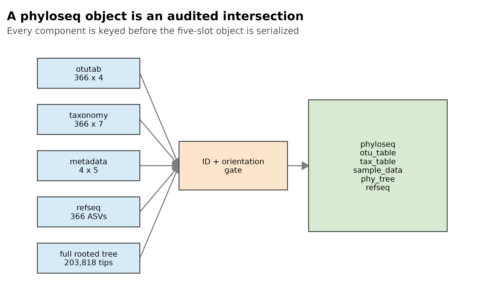
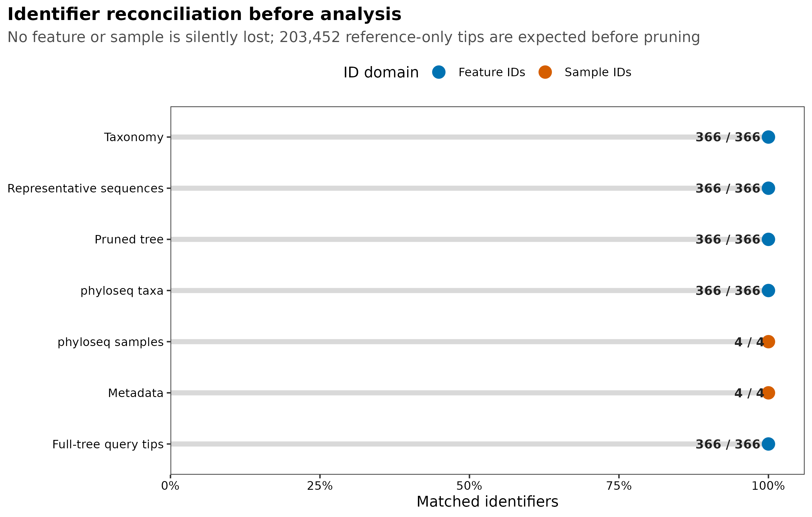
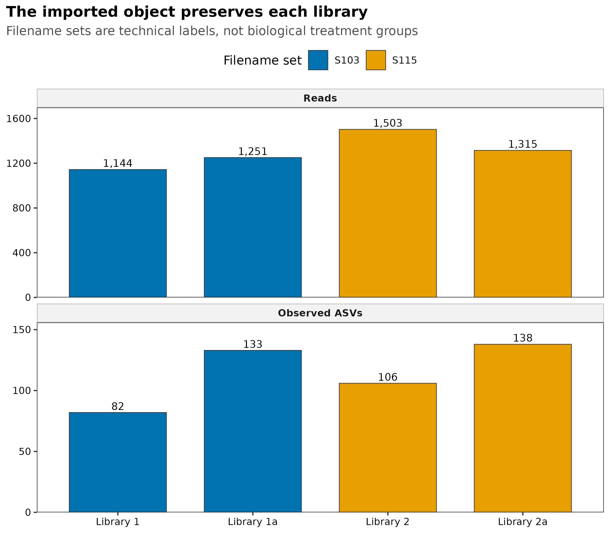
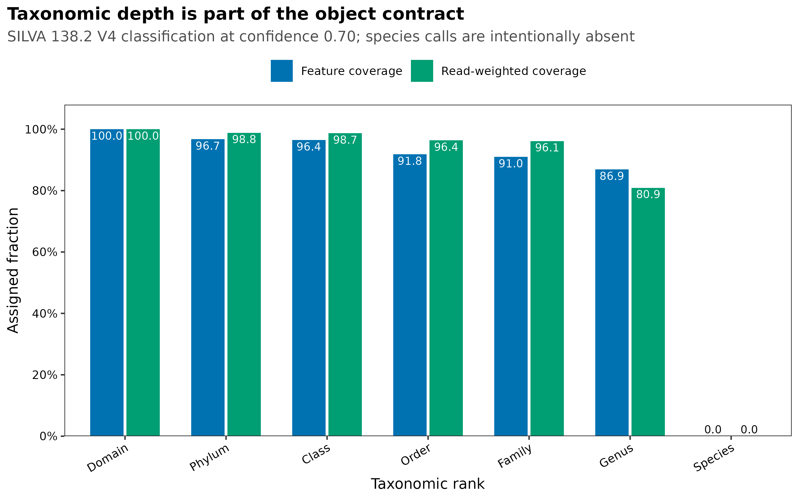

> **分析目标：**把 QIIME 2 导出的真实 ASV 计数、七级 taxonomy、sample metadata、代表序列和 rooted tree 组装成一个五组件 `phyloseq` 对象；在构建前核对方向与 ID，在保存后核对 RDS 往返一致性。  
> **输入文件：**`data/small/phyloseq-import/otutab.tsv`、`taxonomy.tsv`、`metadata.tsv`、`representative-sequences.fasta.gz` 和 `rooted-insertion-tree.nwk.gz`。  
> **预计资源：**读取 203,818-tip 完整树并裁剪、构建对象和回验通常需要 20–90 秒；建议预留 1–2 GB 内存。  
> **执行策略：**正文从可校验的输入文件重新构建对象，`execute: eval: true`；发布前另用独立校验脚本完成 82 项检查，并输出 PDF、PNG、350 dpi LZW TIFF、审计表和运行日志。

## 把 QIIME 2 结果正确装进 phyloseq {#sec-target}

`phyloseq` 对象通常不直接成为论文结果图，却是群落组成、alpha diversity、beta diversity、差异丰度和系统发育分析共同的数据入口。McMurdie 与 Holmes 在 `phyloseq` 方法论文中用对象与分析组件的关系说明这种设计。本页不复制论文原图，而是根据本次真实输入重新绘制四张审计图：

1. 五类输入如何通过方向与 ID gate 进入一个对象；
2. feature ID 和 sample ID 是否完整对齐；
3. 每个技术库的 reads 与 observed ASVs 是否在转换后保留；
4. taxonomy 覆盖率应同时按 ASV 数和 reads 加权报告。

{#fig-phyloseq-contract}

{#fig-id-reconciliation}

{#fig-library-audit}

{#fig-taxonomy-coverage}

::: {.callout-important title="先记住一句话"}
**成功执行 `phyloseq()` 只证明构造器返回了对象，不证明输入方向、ID 交集、计数总量和树尖端都正确。先验收每个组件，再构建对象；构建后再从对象反向核对。**
:::

本次冻结输入和对象结果如下：

```text
Source
  nf-core/test-datasets commit:       f282ad2bafb3ca90190ec87290066ee1985df655
  Denoising:                          QIIME 2 / q2-dada2 2026.4.0
  Taxonomy:                           SILVA 138.2 V4 classifier, confidence 0.70
  Tree:                               rooted SEPP insertion tree

Input contract
  Count table:                        366 features x 4 libraries
  Taxonomy:                           366 features x 7 ranks
  Metadata:                           4 libraries x 5 variables
  Representative sequences:          366
  Total reads:                        5,213
  Complete tree:                      203,818 tips
  Query / reference-only tips:        366 / 203,452

phyloseq object
  Components:                         5
  Component names:                    otu_table, tax_table, sam_data,
                                      phy_tree, refseq
  Orientation:                        taxa_are_rows = TRUE
  Object tree:                        366 rooted ASV tips
  Features / samples / reads:         366 / 4 / 5,213
  Genus assignment:                   318 / 4,217 features / reads
  Species assignment:                 0 / 0 features / reads
  RDS round trip:                     PASS
  Required checks:                    82 / 82 PASS
```

四个 library labels 来自 nf-core 测试文件名。`S103`、`S115`、`base` 和 `suffix_a` 描述文件集合，不是处理、病例状态或生物学重复，因此这里只验证数据结构，不做组间推断。

## 理论：为什么这么做 {#sec-theory}

### 1. 导出是数据合同转换，不是一次复制粘贴

QIIME 2 Artifact（`.qza`）把数据、semantic type、格式和 provenance 打包在一起；R 中的矩阵、data frame、`phylo` 和 `DNAStringSet` 则是分析对象。`qiime tools export` 会把 Artifact 的数据部分写成标准文件，但导出文件不再携带完整 Artifact provenance。

因此应同时保存两类证据：

| 资产 | 负责回答的问题 |
|---|---|
| 原始 `.qza` + `qiime tools peek` / provenance | 数据从哪里来、用什么参数产生 |
| 导出的 TSV / FASTA / Newick + SHA-256 | R 实际读取了哪一份字节 |
| R 对象审计 | 转换是否保留 feature、sample、reads 和树尖端 |
| `sessionInfo()` / lockfile | R 与包版本是什么 |

一个可靠的 R 入口不能只写“从 QIIME 2 导入”，还要明确导出的是哪种 semantic type、怎样转换方向，以及如何证明 ID 没有被截断或自动丢弃。

### 2. 三件套决定主体，序列和树扩展能力

最小的群落对象由三件套组成：

```text
otutab:    features x samples
taxonomy:  features x taxonomic ranks
metadata:  samples x variables
```

它们分别进入：

```text
otu_table   <- counts
tax_table   <- taxonomy
sample_data <- metadata
```

若再加入代表序列与系统发育树，对象可扩展为五组件：

```text
refseq   <- ASV sequences
phy_tree <- rooted ASV tree
```

三组件对象足以进行许多非系统发育分析；Faith's PD、weighted UniFrac 和 unweighted UniFrac 等指标还需要 ID 对齐、含枝长的 rooted tree。保留 `refseq` 也便于追踪具体 ASV、重新注释和导出序列。

### 3. 对象必须是多个 ID 集合的受审计交集

设计数表 feature 集合为 (F_c)，taxonomy 为 (F_t)，代表序列为 (F_s)，树尖端为 (F_p)。进入五组件对象的 ASV 集合应为：

\[
F = F_c \cap F_t \cap F_s \cap F_p
\]

sample 集合则是计数表列名与 metadata 行名的交集：

\[
S = S_c \cap S_m
\]

真正重要的不是交集能算出来，而是集合差是否符合预期。若 taxonomy 少 20 个 ASV，构造器可能只保留共同部分；对象仍能生成，但 feature 数和 reads 已改变。正式分析应在构造器之前显式计算：

```r
setdiff(count_feature_ids, taxonomy_feature_ids)
setdiff(count_sample_ids, metadata_sample_ids)
```

只有预先定义为允许的差异才能保留。例如完整 SEPP insertion tree 中有 203,452 个 reference-only tips，这些参考尖端不是 feature table 中的 ASV，可以在审计后裁剪；taxonomy 缺失一个 count feature 则不是同一类情况。

### 4. `taxa_are_rows` 是方向合同，不是装饰参数

本页计数矩阵是 `features × samples`，因此必须写：

```r
phyloseq::otu_table(otu_matrix, taxa_are_rows = TRUE)
```

若输入是 `samples × features`，应先根据 feature ID 与 taxonomy ID 的匹配关系判断方向，再转置矩阵。不要因为“行数比列数多”就猜测方向；小型研究、聚合表或过滤后的数据完全可能打破这种经验。

方向错误有时仍会生成对象，随后产生荒谬的 `ntaxa()`、`nsamples()` 或 library size。至少要反查：

```text
number of taxa
number of samples
sample-wise read totals
taxa_are_rows flag
```

### 5. 完整 reference-placement tree 要先解释、再裁剪

本例的完整 SEPP tree 有 203,818 个 tips：366 个 query ASV 加 203,452 个 reference tips。完整树保留 reference placement 的坐标和来源证据，但 feature table 只有 366 个 ASV。

对象构建前显式执行：

```r
query_tree <- ape::keep.tip(full_tree, feature_ids)
```

并核对裁剪后仍然：

- 有 366 个且仅有 366 个目标 tips；
- rooted；
- branch lengths 无缺失、无负值；
- tip labels 与 `otutab` feature IDs 完全集合相等。

显式裁剪比依赖构造器内部求交集更容易审计，也避免把 20 万个 reference-only tips 长期塞进每个下游对象。完整 tree 文件仍应作为来源资产归档。

### 6. 导入时保留原始整数计数

相对丰度、稀释、CLR 和其他变换服务于不同问题，不应覆盖唯一的原始计数入口。对象中的 `otu_table` 先保留非负整数 counts：

```text
raw count object
  ├─ composition display      -> relative abundance copy
  ├─ count model              -> raw-count copy + model offsets
  ├─ phylogenetic diversity   -> filtered/rarefied copy
  └─ Aitchison analysis       -> zero-aware log-ratio copy
```

这样每条分析分支都能追溯到同一个 count ledger。若直接把相对丰度写回主体对象，后续 DESeq2、library size 审计和 reads 加权 taxonomy coverage 都会失去原始含义。

### 7. taxonomy 的空值是测量边界

taxonomy table 有七列不等于每条 ASV 都有七级注释。本例中：

| Rank | Assigned ASVs | Assigned reads | Read-weighted coverage |
|---|---:|---:|---:|
| Domain | 366 | 5,213 | 100.0% |
| Phylum | 354 | 5,153 | 98.8% |
| Family | 333 | 5,011 | 96.1% |
| Genus | 318 | 4,217 | 80.9% |
| Species | 0 | 0 | 0.0% |

空字符串、`NA`、`Unassigned` 和前缀后没有名称的值，都不能当作已注释。Species 覆盖为 0 时，不能把 Genus 名称复制到 Species 列，也不能以 ASV 序列唯一为由声称物种水平分辨率。

### 8. RDS 是经过验证的派生物，不是不可追溯的起点

`saveRDS()` 适合保存完整 S4 对象，避免每次交互都重新读取并对齐五类文件。但 RDS 应在三件套、序列、树和环境通过检查后生成，并与以下信息一起归档：

- 输入路径与 SHA-256；
- R、Bioconductor 与 `phyloseq` 版本；
- feature/sample/read counts；
- 组件名称与方向；
- 构建脚本和验证日志。

只收到一个来历不明的 `ps.rds` 时，很难证明计数是否已变换、taxonomy 用了哪个数据库、树是否裁剪正确或 metadata 是否被重排。

<details>
<summary><strong>深入：为什么对象构建前后要检查两次</strong></summary>

构建前检查的是输入合同：

```text
IDs unique
sets reconcile
counts integer and non-negative
orientation explicit
tree rooted and branch lengths valid
```

构建后检查的是转换结果：

```text
class and component names
ntaxa / nsamples / total reads
sample_sums
tree tips and refseq names
RDS reload parity
```

两类检查捕捉的问题不同。前者能指出哪个源文件错了；后者能发现构造器求交集、排序或序列化带来的变化。只做后者时，常只能看到“少了多少”，却不知道丢失发生在哪个组件。

</details>

## 准备工作 {#sec-preparation}

<details open>
<summary><strong>展开：安装依赖、固定版本并定义作图函数</strong></summary>

本页实测环境为 R 4.4.1、Bioconductor 3.19、`phyloseq` 1.48.0、`ape` 5.8、`Biostrings` 2.72.1、`readr` 2.1.5 和 `ggplot2` 3.5.2。首次安装可执行：

```{r}
#| eval: false
install.packages(c(
  "ape", "digest", "dplyr", "ggplot2", "jsonlite", "readr",
  "scales", "tibble", "tidyr"
))

if (!requireNamespace("BiocManager", quietly = TRUE)) {
  install.packages("BiocManager")
}
BiocManager::install(
  c("phyloseq", "Biostrings"),
  version = "3.19",
  ask = FALSE,
  update = FALSE
)
```

新环境若采用更新的 R/Bioconductor 组合，应把实际版本写入锁文件并重跑全部检查，不要强行把不兼容的 Bioconductor release 安装到当前 R。

下面的作图函数直接内联，可用于本页和自己的重绘：

```{r}
#| label: setup
#| include: true
set.seed(20260721)

required_packages <- c(
  "ape", "Biostrings", "digest", "dplyr", "ggplot2",
  "phyloseq", "readr", "scales", "tibble", "tidyr"
)
missing_packages <- required_packages[
  !vapply(required_packages, requireNamespace, logical(1), quietly = TRUE)
]
stopifnot(length(missing_packages) == 0L)

pal_pub <- c(
  blue = "#0072B2",
  orange = "#E69F00",
  green = "#009E73",
  vermillion = "#D55E00",
  purple = "#CC79A7",
  sky = "#56B4E9",
  yellow = "#F0E442",
  grey = "#6B7280"
)

scale_color_pub <- function(..., values = unname(pal_pub)) {
  ggplot2::scale_color_manual(..., values = values)
}

scale_fill_pub <- function(..., values = unname(pal_pub)) {
  ggplot2::scale_fill_manual(..., values = values)
}

theme_pub <- function(base_size = 11) {
  ggplot2::theme_bw(base_size = base_size, base_family = "sans") +
    ggplot2::theme(
      panel.grid = ggplot2::element_blank(),
      axis.text = ggplot2::element_text(color = "black"),
      axis.title = ggplot2::element_text(color = "black"),
      plot.title.position = "plot",
      plot.title = ggplot2::element_text(face = "bold"),
      plot.subtitle = ggplot2::element_text(color = "#4D4D4D"),
      strip.background = ggplot2::element_rect(
        fill = "#F2F2F2", color = "#B3B3B3"
      ),
      strip.text = ggplot2::element_text(face = "bold"),
      legend.key = ggplot2::element_blank(),
      legend.position = "top"
    )
}

save_pub <- function(plot, stem, width = 125, height = 95, dpi = 350) {
  dir.create(dirname(stem), recursive = TRUE, showWarnings = FALSE)
  ggplot2::ggsave(
    paste0(stem, ".pdf"), plot,
    width = width, height = height, units = "mm",
    device = grDevices::cairo_pdf, bg = "white"
  )
  ggplot2::ggsave(
    paste0(stem, ".png"), plot,
    width = width, height = height, units = "mm",
    dpi = dpi, bg = "white"
  )
  ggplot2::ggsave(
    paste0(stem, ".tiff"), plot,
    width = width, height = height, units = "mm",
    dpi = dpi, compression = "lzw", bg = "white"
  )
  invisible(plot)
}
```

</details>

## 可复制代码 {#sec-code}

### 1. 从 QIIME 2 导出标准文件

若手中仍是 Artifact，可在 QIIME 2 环境中导出。输出目录应分别创建，避免同名文件互相覆盖：

```{bash}
#| eval: false
mkdir -p export/table export/taxonomy export/sequences export/tree

qiime tools export \
  --input-path table.qza \
  --output-path export/table

biom convert \
  --input-fp export/table/feature-table.biom \
  --output-fp export/table/feature-table.tsv \
  --to-tsv

qiime tools export \
  --input-path taxonomy.qza \
  --output-path export/taxonomy

qiime tools export \
  --input-path representative-sequences.qza \
  --output-path export/sequences

qiime tools export \
  --input-path rooted-tree.qza \
  --output-path export/tree
```

BIOM 转出的第一行可能是注释，feature ID 列名也可能是 `#OTU ID`。应把它规范成首列 `FeatureID`、行是 features、后续列是 samples 的 `otutab.tsv`。QIIME 2 taxonomy 常是 `Feature ID / Taxon / Confidence` 三列；下文“换成你自己的数据”给出把 `Taxon` 拆成七列的完整代码。

本页使用已经规范化并固定哈希的真实文件，来源记录见 `source-summary.json`。它们不是从某个先前保存的 R 对象读取。

### 2. 校验输入文件字节

先固定路径与 SHA-256。只要文件内容改变，代码立即停止：

```{r}
#| label: input-hashes
input_dir <- "data/small/phyloseq-import"

input_paths <- c(
  otutab = file.path(input_dir, "otutab.tsv"),
  taxonomy = file.path(input_dir, "taxonomy.tsv"),
  metadata = file.path(input_dir, "metadata.tsv"),
  representative_sequences = file.path(
    input_dir, "representative-sequences.fasta.gz"
  ),
  rooted_insertion_tree = file.path(
    input_dir, "rooted-insertion-tree.nwk.gz"
  )
)

expected_sha256 <- c(
  otutab = "6c43bb8f929f935b60e42ed32737632d3be18ddd491f5298ba3a6abd6e3f18a9",
  taxonomy = "8ef235ea19923307eef4d8e1905c2f34b78cf25cf1a83f08aa00353f2c5c0d38",
  metadata = "6628dd51051c53884e82c540ceaff8cc34f69900a78d372239a2ed41ff5b7263",
  representative_sequences = "a19e083cfb0ab757d557569bdf76aa3de78576ae35033a7e69a647976a370bc2",
  rooted_insertion_tree = "7e541e2ed9e3f81d9b6c6bf98999335e7f684a37ac5dd5f2b56e61b2f4c4c47c"
)

observed_sha256 <- vapply(
  input_paths,
  digest::digest,
  character(1),
  algo = "sha256",
  serialize = FALSE,
  file = TRUE
)

hash_audit <- tibble::tibble(
  asset = names(input_paths),
  observed_sha256 = unname(observed_sha256),
  expected_sha256 = unname(expected_sha256),
  status = ifelse(observed_sha256 == expected_sha256, "PASS", "FAIL")
)
stopifnot(all(hash_audit$status == "PASS"))
hash_audit
```

### 3. 读取三件套并确认方向

首列作为 key，而不是普通分析变量：

```{r}
#| label: read-triad
read_keyed_tsv <- function(path) {
  x <- readr::read_tsv(
    path,
    show_col_types = FALSE,
    progress = FALSE,
    name_repair = "minimal",
    na = character()
  )
  ids <- as.character(x[[1L]])
  stopifnot(length(ids) > 0L, !anyDuplicated(ids), !anyNA(ids), nzchar(ids))
  out <- as.data.frame(x[-1L], check.names = FALSE)
  rownames(out) <- ids
  out
}

otutab <- read_keyed_tsv("data/small/phyloseq-import/otutab.tsv")
taxonomy <- read_keyed_tsv("data/small/phyloseq-import/taxonomy.tsv")
metadata <- read_keyed_tsv("data/small/phyloseq-import/metadata.tsv")

otu_matrix <- as.matrix(otutab)
storage.mode(otu_matrix) <- "numeric"
tax_matrix <- as.matrix(taxonomy)
storage.mode(tax_matrix) <- "character"

feature_ids <- rownames(otu_matrix)
sample_ids <- colnames(otu_matrix)

stopifnot(
  dim(otu_matrix)[[1L]] == 366L,
  dim(otu_matrix)[[2L]] == 4L,
  sum(otu_matrix) == 5213,
  all(is.finite(otu_matrix)),
  all(otu_matrix >= 0),
  all(otu_matrix == round(otu_matrix)),
  setequal(feature_ids, rownames(tax_matrix)),
  setequal(sample_ids, rownames(metadata))
)

list(
  otutab_dimension = dim(otu_matrix),
  taxonomy_dimension = dim(tax_matrix),
  metadata_dimension = dim(metadata),
  total_reads = sum(otu_matrix)
)
```

看清三张表的结构：

```{r}
#| label: display-input-structure
utils::head(
  data.frame(FeatureID = rownames(otutab), otutab, check.names = FALSE),
  5
)
utils::head(
  data.frame(FeatureID = rownames(taxonomy), taxonomy, check.names = FALSE),
  5
)
utils::head(
  data.frame(SampleID = rownames(metadata), metadata, check.names = FALSE),
  4
)
```

样本 reads 与 observed ASVs 是最直接的方向回验：

```{r}
#| label: sample-count-audit
sample_audit <- tibble::tibble(
  SampleID = sample_ids,
  Library = metadata[sample_ids, "LibraryLabel"],
  Reads = as.numeric(colSums(otu_matrix)),
  ObservedASVs = as.numeric(colSums(otu_matrix > 0))
)

stopifnot(
  identical(sample_audit$Reads, c(1144, 1251, 1503, 1315)),
  identical(sample_audit$ObservedASVs, c(82, 133, 106, 138))
)
sample_audit
```

### 4. 读取代表序列与完整 rooted tree

先核对 FASTA header，再把完整树明确裁剪到计数表 ASV：

```{r}
#| label: sequences-and-tree
sequences <- Biostrings::readDNAStringSet(
  "data/small/phyloseq-import/representative-sequences.fasta.gz"
)
full_tree <- ape::read.tree(
  gzfile("data/small/phyloseq-import/rooted-insertion-tree.nwk.gz")
)

full_query_tips <- intersect(full_tree$tip.label, feature_ids)
reference_only_tips <- setdiff(full_tree$tip.label, feature_ids)

stopifnot(
  length(sequences) == 366L,
  setequal(names(sequences), feature_ids),
  ape::Ntip(full_tree) == 203818L,
  length(full_query_tips) == 366L,
  length(reference_only_tips) == 203452L,
  ape::is.rooted(full_tree),
  !anyNA(full_tree$edge.length),
  all(full_tree$edge.length >= 0)
)

query_tree <- ape::keep.tip(full_tree, feature_ids)

stopifnot(
  ape::Ntip(query_tree) == 366L,
  setequal(query_tree$tip.label, feature_ids),
  ape::is.rooted(query_tree),
  !anyNA(query_tree$edge.length),
  all(query_tree$edge.length >= 0)
)

tibble::tibble(
  Tree = c("Complete SEPP insertion tree", "ASV-pruned object tree"),
  Tips = c(ape::Ntip(full_tree), ape::Ntip(query_tree)),
  QueryTips = c(length(full_query_tips), ape::Ntip(query_tree)),
  ReferenceOnlyTips = c(length(reference_only_tips), 0L),
  Rooted = c(ape::is.rooted(full_tree), ape::is.rooted(query_tree))
)
```

### 5. 在构造器之前完成 ID gate

对账表应明确区分 feature IDs 与 sample IDs：

```{r}
#| label: id-gate
id_gate <- tibble::tribble(
  ~Component, ~Domain, ~Expected, ~Matched, ~Missing, ~Unexpected,
  "Taxonomy", "Feature IDs", length(feature_ids),
    length(intersect(feature_ids, rownames(taxonomy))),
    length(setdiff(feature_ids, rownames(taxonomy))),
    length(setdiff(rownames(taxonomy), feature_ids)),
  "Representative sequences", "Feature IDs", length(feature_ids),
    length(intersect(feature_ids, names(sequences))),
    length(setdiff(feature_ids, names(sequences))),
    length(setdiff(names(sequences), feature_ids)),
  "Pruned tree", "Feature IDs", length(feature_ids),
    length(intersect(feature_ids, query_tree$tip.label)),
    length(setdiff(feature_ids, query_tree$tip.label)),
    length(setdiff(query_tree$tip.label, feature_ids)),
  "Metadata", "Sample IDs", length(sample_ids),
    length(intersect(sample_ids, rownames(metadata))),
    length(setdiff(sample_ids, rownames(metadata))),
    length(setdiff(rownames(metadata), sample_ids))
)

stopifnot(
  all(id_gate$Matched == id_gate$Expected),
  all(id_gate$Missing == 0L),
  all(id_gate$Unexpected == 0L)
)
id_gate
```

### 6. 构建五组件 `phyloseq` 对象

先按计数表顺序重排其他组件，再构建对象：

```{r}
#| label: build-phyloseq
taxonomy <- taxonomy[feature_ids, , drop = FALSE]
metadata <- metadata[sample_ids, , drop = FALSE]
sequences <- sequences[feature_ids]

ps <- phyloseq::phyloseq(
  phyloseq::otu_table(otu_matrix, taxa_are_rows = TRUE),
  phyloseq::tax_table(as.matrix(taxonomy)),
  phyloseq::sample_data(metadata),
  phyloseq::phy_tree(query_tree),
  sequences
)

component_names <- methods::slotNames(ps)[
  !vapply(
    methods::slotNames(ps),
    function(slot_name) is.null(methods::slot(ps, slot_name)),
    logical(1)
  )
]

stopifnot(
  inherits(ps, "phyloseq"),
  setequal(
    component_names,
    c("otu_table", "tax_table", "sam_data", "phy_tree", "refseq")
  ),
  phyloseq::taxa_are_rows(ps),
  phyloseq::ntaxa(ps) == 366L,
  phyloseq::nsamples(ps) == 4L,
  sum(phyloseq::sample_sums(ps)) == 5213,
  setequal(phyloseq::taxa_names(ps), feature_ids),
  setequal(phyloseq::sample_names(ps), sample_ids),
  setequal(phyloseq::phy_tree(ps)$tip.label, feature_ids),
  setequal(names(phyloseq::refseq(ps)), feature_ids)
)

object_summary <- tibble::tibble(
  Metric = c(
    "Class", "Components", "Features", "Samples", "Reads",
    "Tree tips", "Reference sequences", "Taxa are rows"
  ),
  Value = c(
    class(ps)[[1L]],
    length(component_names),
    phyloseq::ntaxa(ps),
    phyloseq::nsamples(ps),
    sum(phyloseq::sample_sums(ps)),
    ape::Ntip(phyloseq::phy_tree(ps)),
    length(phyloseq::refseq(ps)),
    phyloseq::taxa_are_rows(ps)
  )
)
object_summary
```

`phyloseq` 的内部 slot 名为 `sam_data`，面向读者的 accessor 是 `sample_data()`。分析代码应优先使用 accessor，而不是直接操作 S4 slot。

### 7. 反向核对 taxonomy、样本计数和组件

构建后再次从对象取值：

```{r}
#| label: reverse-audit
object_taxonomy <- as(
  phyloseq::tax_table(ps),
  "matrix"
)
taxa_reads <- phyloseq::taxa_sums(ps)

taxonomy_coverage <- do.call(
  rbind,
  lapply(colnames(object_taxonomy), function(rank_name) {
    values <- object_taxonomy[, rank_name]
    assigned <- !is.na(values) & nzchar(values) & values != "Unassigned"
    data.frame(
      Rank = rank_name,
      AssignedASVs = sum(assigned),
      TotalASVs = length(assigned),
      AssignedReads = sum(taxa_reads[assigned]),
      TotalReads = sum(taxa_reads),
      stringsAsFactors = FALSE
    )
  })
)

genus_row <- taxonomy_coverage[taxonomy_coverage$Rank == "Genus", ]
species_row <- taxonomy_coverage[taxonomy_coverage$Rank == "Species", ]
stopifnot(
  genus_row$AssignedASVs == 318L,
  genus_row$AssignedReads == 4217,
  species_row$AssignedASVs == 0L,
  species_row$AssignedReads == 0
)

taxonomy_coverage
phyloseq::sample_sums(ps)[sample_ids]
phyloseq::rank_names(ps)
phyloseq::sample_variables(ps)
```

### 8. 保存并回读 RDS

保存之前已完成输入与对象检查。回读后比较 class、组件、维度、reads 和 ID：

```{r}
#| label: rds-roundtrip
rds_path <- "results/17-phyloseq-import/atacama-v4-phyloseq.rds"
dir.create(dirname(rds_path), recursive = TRUE, showWarnings = FALSE)
saveRDS(ps, rds_path, version = 3, compress = "xz")
ps_reloaded <- readRDS(rds_path)

stopifnot(
  inherits(ps_reloaded, "phyloseq"),
  phyloseq::ntaxa(ps_reloaded) == phyloseq::ntaxa(ps),
  phyloseq::nsamples(ps_reloaded) == phyloseq::nsamples(ps),
  identical(
    as.numeric(phyloseq::sample_sums(ps_reloaded)[sample_ids]),
    as.numeric(phyloseq::sample_sums(ps)[sample_ids])
  ),
  setequal(phyloseq::taxa_names(ps_reloaded), phyloseq::taxa_names(ps)),
  setequal(phyloseq::sample_names(ps_reloaded), phyloseq::sample_names(ps))
)

tibble::tibble(
  Metric = c("Class", "Features", "Samples", "Reads", "Taxa IDs", "Sample IDs"),
  Before = c(
    class(ps)[[1L]], phyloseq::ntaxa(ps), phyloseq::nsamples(ps),
    sum(phyloseq::sample_sums(ps)), length(phyloseq::taxa_names(ps)),
    length(phyloseq::sample_names(ps))
  ),
  After = c(
    class(ps_reloaded)[[1L]], phyloseq::ntaxa(ps_reloaded),
    phyloseq::nsamples(ps_reloaded), sum(phyloseq::sample_sums(ps_reloaded)),
    length(phyloseq::taxa_names(ps_reloaded)),
    length(phyloseq::sample_names(ps_reloaded))
  )
)
```

发布前的独立校验命令为：

```{bash}
#| eval: false
Rscript --vanilla scripts/validate_phyloseq_import.R \
  --project-root . \
  --input-dir data/small/phyloseq-import \
  --output-dir results/17-phyloseq-import \
  --figure-dir figures

# Expected terminal line:
# Article 17 validation complete: 82 / 82 PASS
```

该脚本还固定 R 与包版本、七份输入哈希、序列长度、完整树与裁剪树、五个对象组件、逐样本 reads、逐 rank taxonomy 覆盖和 RDS 往返结果。机器可读总表在 `results/17-phyloseq-import/validation-checks.tsv`。

## 出版级美化 {#sec-visualization}

### 1. 先画数据合同，再画生态结果

对象入口最值得展示的不是一个 `str(ps)` 截图，而是能回答以下问题的审计图：

- 哪些输入进入对象；
- ID 是否完整匹配；
- 样本 reads 与 observed ASVs 是否保留；
- taxonomy 覆盖下降发生在哪个层级。

例如从对象计算 taxonomy 覆盖后可重绘为 feature- 与 read-weighted 两种比例：

```{r}
#| label: taxonomy-coverage-redraw
#| eval: false
coverage_long <- taxonomy_coverage |>
  dplyr::mutate(
    FeatureCoverage = 100 * AssignedASVs / TotalASVs,
    ReadCoverage = 100 * AssignedReads / TotalReads
  ) |>
  tidyr::pivot_longer(
    c(FeatureCoverage, ReadCoverage),
    names_to = "Weighting",
    values_to = "Coverage"
  ) |>
  dplyr::mutate(
    Weighting = dplyr::recode(
      Weighting,
      FeatureCoverage = "ASV weighted",
      ReadCoverage = "Read weighted"
    )
  )

p_coverage <- ggplot2::ggplot(
  coverage_long,
  ggplot2::aes(x = Rank, y = Coverage, color = Weighting, group = Weighting)
) +
  ggplot2::geom_line(linewidth = 0.8) +
  ggplot2::geom_point(size = 2.6) +
  scale_color_pub(values = c("#0072B2", "#D55E00")) +
  ggplot2::scale_y_continuous(
    limits = c(0, 100),
    breaks = seq(0, 100, 20),
    labels = function(x) paste0(x, "%")
  ) +
  ggplot2::labs(
    x = "Taxonomic rank",
    y = "Assigned coverage",
    color = NULL,
    title = "Taxonomic resolution declines toward lower ranks"
  ) +
  theme_pub()

save_pub(
  p_coverage,
  "figures/17-taxonomy-coverage-redraw",
  width = 125,
  height = 90
)
```

图内的 title、axis、legend、sample labels 和 annotation 使用英文；中文解释留在正文。这样可直接进入英文论文，也能减少跨平台字体差异。

### 2. 图形导出与主张保持一致

本页四张正式图均输出：

```text
PDF                         vector
PNG                         350 dpi
TIFF                        350 dpi, LZW compression
```

尺寸应按期刊单栏或双栏物理宽度设置，不要先导出一张超大像素图再在排版软件中任意拉伸。`save_pub()` 的 `width` 与 `height` 单位为 mm，方便直接按期刊规格调整。

::: {.callout-tip title="审计图也要有明确的统计单位"}
taxonomy coverage 同时给 ASV-weighted 和 read-weighted 结果。前者回答“多少 feature 有名字”，后者回答“这些 feature 覆盖多少观测 reads”。两者差异本身可能提示未注释 feature 主要位于低丰度还是高丰度部分。
:::

## 常见坑 {#sec-pitfalls}

::: {.callout-caution title="审稿人和合作者最容易追问的 12 个问题"}
1. **从来历不明的 `ps.rds` 开始**：无法回查原始 counts、taxonomy release、metadata 对齐和 tree 处理。保留标准输入、哈希和构建脚本。  
2. **把 BIOM 方向读反**：必须用 taxonomy feature IDs 和 metadata sample IDs 判断方向，并核对 `taxa_are_rows`。  
3. **让构造器静默求交集**：先算 `setdiff()`，报告每个组件缺失与额外 ID，再构建对象。  
4. **把完整 SEPP reference tips 当样本 ASV**：完整树可归档，但对象树要显式裁剪到 feature table；本例从 203,818 tips 裁到 366。  
5. **只看 `ntaxa()`，不看 reads**：丢一个高丰度 ASV 可能只减少 1 个 feature，却改变大量 reads。feature 与 read retention 都要报告。  
6. **导入时覆盖原始 counts**：relative abundance、rarefaction 与 CLR 分别在对象副本上完成，不要覆盖 count ledger。  
7. **metadata 行名被自动改写**：`check.names = FALSE`，把首列显式设为 row names，并检查重复、空值和集合相等。  
8. **taxonomy 一列字符串直接塞进 `tax_table`**：先拆成固定 rank 列、去前缀、保留真正未注释值，再验收列名。  
9. **把空 Species 补成 Genus**：这制造了不存在的物种分辨率。本例 Species 为 0/366 ASV。  
10. **树有 tip labels 却没有可靠 branch lengths/root**：系统发育指标还需要 rootedness、完整且非负的枝长。  
11. **把技术文件名当分组**：本例四个 labels 不能支持任何处理效应、病例对照或重复测量推断。  
12. **RDS 保存后不回读**：至少在全新 R session 中 `readRDS()`，比较 class、组件、features、samples、reads 和 ID。
:::

::: {.callout-warning title="对象中有变量，不等于研究设计支持该变量"}
`sample_data()` 只是存储 metadata。一个列名能被 `plot_ordination(..., color = ...)` 使用，并不证明该变量有足够重复、与 batch 可分离或适合置换检验。统计设计仍要独立验收。
:::

::: {.callout-warning title="不要把 phyloseq 自动修剪当作数据清洗策略"}
自动保留共同 taxa 可以让代码继续运行，却会掩盖拼写差异、截断的 FASTA header、taxonomy 缺行或 tree tip 命名错误。只有已经解释并记录的 reference-only tips 才能在明确规则下裁剪。
:::

## 这段 Methods 怎么写 {#sec-methods}

下面模板可直接替换方括号内容：

> QIIME 2 `FeatureTable[Frequency]`, `FeatureData[Taxonomy]`, representative-sequence, and rooted-phylogeny Artifacts were exported using QIIME 2 version [2026.4.0]. The BIOM feature table was converted to a tab-delimited feature-by-sample count matrix without normalization. Taxonomy strings were parsed into seven ranks, and sample identifiers were reconciled between the count matrix and metadata before object construction. Representative-sequence identifiers and query tips in the complete SEPP insertion tree were matched to feature-table identifiers; the complete [203,818]-tip insertion tree was then explicitly pruned to the [366] observed ASV tips using `ape` version [5.8]. A five-component `phyloseq` object was constructed in R version [4.4.1] using `phyloseq` version [1.48.0], comprising the raw-count `otu_table` (`taxa_are_rows = TRUE`), `tax_table`, `sample_data`, rooted `phy_tree`, and `refseq`. Input files were verified by SHA-256 checksums. Feature counts, sample counts, total reads, identifier sets, tree branch lengths, and per-sample library sizes were checked before and after construction and after RDS serialization. The final object contained [366] ASVs across [4] technical libraries and [5,213] reads. The library labels represented source filenames and were not treated as biological groups. Random procedures used a fixed seed of [20260721].

若没有 tree 或 representative sequences，应删除对应组件和句子；不能把三组件对象写成完成了系统发育分析。若正文分析使用了过滤、稀释、相对丰度或 log-ratio 变换，还要在相应 Methods 段落另行说明，不能用“构建了 phyloseq 对象”代替预处理细节。

## 换成你自己的数据怎么做 {#sec-own-data}

### 1. 准备三件套和可选的两个组件

| 文件 | 必需性 | 合同 |
|---|---|---|
| `otutab.tsv` | 必需 | 首列 feature ID；其余列是 sample；非负整数 counts |
| `taxonomy.tsv` | 必需 | 首列同一 feature ID；其余列为固定 taxonomy ranks |
| `metadata.tsv` | 必需 | 首列 sample ID；其余列为实验与协变量 |
| representative FASTA | 推荐 | 每个 count feature 一条同名序列 |
| rooted Newick tree | 系统发育分析必需 | 包含目标 feature tips；枝长完整且非负 |

只需要替换路径：

```r
otutab_path <- "data/otutab.tsv"
taxonomy_path <- "data/taxonomy.tsv"
metadata_path <- "data/metadata.tsv"
sequence_path <- "data/representative-sequences.fasta.gz"
tree_path <- "data/rooted-tree.nwk.gz"
```

然后保留本文的 `read_keyed_tsv()`、方向检查、集合对账、对象反查和 RDS 回验。不要删除检查里的 expected 值后直接运行；应把 366、4、5,213 等示例数字替换成自己在冻结输入后签字确认的数值。

### 2. taxonomy 只有一个 `Taxon` 字符串时完整拆列

QIIME 2 常导出 `Feature ID`、`Taxon`、`Confidence`。下面代码把分号分隔字符串转成七列，并保留 confidence 供敏感性检查：

```{r}
#| eval: false
taxonomy_qiime <- readr::read_tsv(
  "export/taxonomy/taxonomy.tsv",
  show_col_types = FALSE,
  name_repair = "minimal"
) |>
  dplyr::rename(
    FeatureID = `Feature ID`,
    TaxonomyString = Taxon
  ) |>
  tidyr::separate_wider_delim(
    TaxonomyString,
    delim = ";",
    names = c("Domain", "Phylum", "Class", "Order", "Family", "Genus", "Species"),
    too_few = "align_start",
    too_many = "merge"
  ) |>
  dplyr::mutate(
    dplyr::across(
      c(Domain, Phylum, Class, Order, Family, Genus, Species),
      function(x) {
        x <- trimws(x)
        x <- sub("^[dpkcofgs]__", "", x)
        x[x == ""] <- NA_character_
        x
      }
    )
  )

readr::write_tsv(
  dplyr::select(
    taxonomy_qiime,
    FeatureID, Domain, Phylum, Class, Order, Family, Genus, Species
  ),
  "data/taxonomy.tsv",
  na = ""
)
readr::write_tsv(
  dplyr::select(taxonomy_qiime, FeatureID, Confidence),
  "data/taxonomy-confidence.tsv",
  na = ""
)
```

不同数据库可能使用 `D_0__`、`Kingdom` 或更多/更少 ranks。先根据数据库合同建立明确 crosswalk，再改列名；不要只按字符串位置猜。

### 3. 用 ID 判断计数表是否需要转置

```{r}
#| eval: false
otu_raw <- read_keyed_tsv(otutab_path)
tax_raw <- read_keyed_tsv(taxonomy_path)
meta_raw <- read_keyed_tsv(metadata_path)

otu_candidate <- as.matrix(otu_raw)

if (
  setequal(rownames(otu_candidate), rownames(tax_raw)) &&
  setequal(colnames(otu_candidate), rownames(meta_raw))
) {
  otu_matrix <- otu_candidate
} else if (
  setequal(colnames(otu_candidate), rownames(tax_raw)) &&
  setequal(rownames(otu_candidate), rownames(meta_raw))
) {
  otu_matrix <- t(otu_candidate)
} else {
  stop("Count-table orientation cannot be reconciled with taxonomy and metadata IDs.")
}

storage.mode(otu_matrix) <- "numeric"
stopifnot(
  all(is.finite(otu_matrix)),
  all(otu_matrix >= 0),
  all(otu_matrix == round(otu_matrix))
)
```

### 4. 没有 tree 或序列时构建三组件对象

```{r}
#| eval: false
ps_three <- phyloseq::phyloseq(
  phyloseq::otu_table(otu_matrix, taxa_are_rows = TRUE),
  phyloseq::tax_table(as.matrix(tax_raw[rownames(otu_matrix), , drop = FALSE])),
  phyloseq::sample_data(meta_raw[colnames(otu_matrix), , drop = FALSE])
)
```

此时 Bray–Curtis、Jaccard、Aitchison、组成展示和许多差异丰度方法仍可开展；Faith's PD 与 UniFrac 不可用。若后来补入 tree，必须重新做 feature-tip 对账和对象 reads retention，而不是直接把任意 Newick 文件塞进对象。

### 5. 在正式下游分析前完成签字

- counts 是未归一化的非负整数，方向由 ID 证明；
- taxonomy feature IDs 与 count features 完全一致，未注释层级保持缺失；
- metadata sample IDs 与 count columns 完全一致，变量含义和单位有数据字典；
- representative FASTA headers 与 count features 完全一致；
- tree 已 root，枝长完整、非负，进入对象的 tips 与 count features 完全一致；
- `ntaxa()`、`nsamples()`、`sample_sums()`、`taxa_names()` 和 `sample_names()` 与输入账本一致；
- RDS 在全新 session 回读后仍通过同一组检查；
- 输入哈希、包版本、构建脚本和验证日志已经归档。

完成这些检查后，再复制对象创建分支用于过滤、归一化和统计模型。原始 count 对象保留为只读基线。

## 参考 {#sec-references}

1. McMurdie PJ, Holmes S. phyloseq: an R package for reproducible interactive analysis and graphics of microbiome census data. *PLoS ONE*. 2013;8:e61217. [doi:10.1371/journal.pone.0061217](https://doi.org/10.1371/journal.pone.0061217)
2. QIIME 2. Exporting data from QIIME 2 Artifacts. [https://docs.qiime2.org/2024.10/tutorials/exporting/](https://docs.qiime2.org/2024.10/tutorials/exporting/)
3. Bioconductor. phyloseq package and vignettes. [https://bioconductor.org/packages/phyloseq/](https://bioconductor.org/packages/phyloseq/)
4. Paradis E, Schliep K. ape 5.0: an environment for modern phylogenetics and evolutionary analyses in R. *Bioinformatics*. 2019;35:526–528. [doi:10.1093/bioinformatics/bty633](https://doi.org/10.1093/bioinformatics/bty633)
5. Pagès H, Aboyoun P, Gentleman R, DebRoy S. Biostrings: efficient manipulation of biological strings. Bioconductor package. [https://bioconductor.org/packages/Biostrings/](https://bioconductor.org/packages/Biostrings/)
6. Bolyen E, Rideout JR, Dillon MR, et al. Reproducible, interactive, scalable and extensible microbiome data science using QIIME 2. *Nature Biotechnology*. 2019;37:852–857. [doi:10.1038/s41587-019-0209-9](https://doi.org/10.1038/s41587-019-0209-9)
7. nf-core/test-datasets, ampliseq V4 test data, commit `f282ad2bafb3ca90190ec87290066ee1985df655` (MIT). [https://github.com/nf-core/test-datasets/tree/f282ad2bafb3ca90190ec87290066ee1985df655/testdata](https://github.com/nf-core/test-datasets/tree/f282ad2bafb3ca90190ec87290066ee1985df655/testdata)
