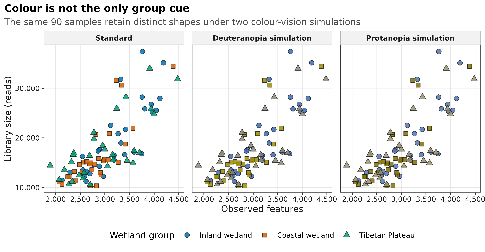
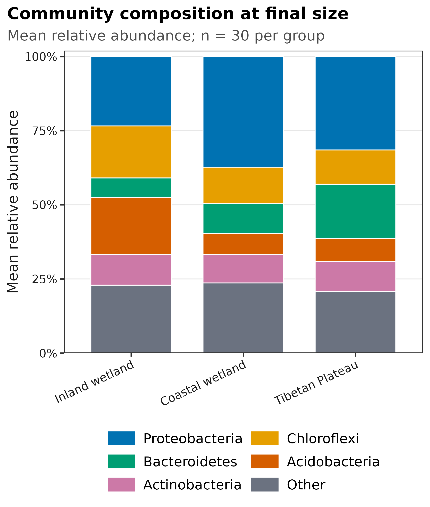
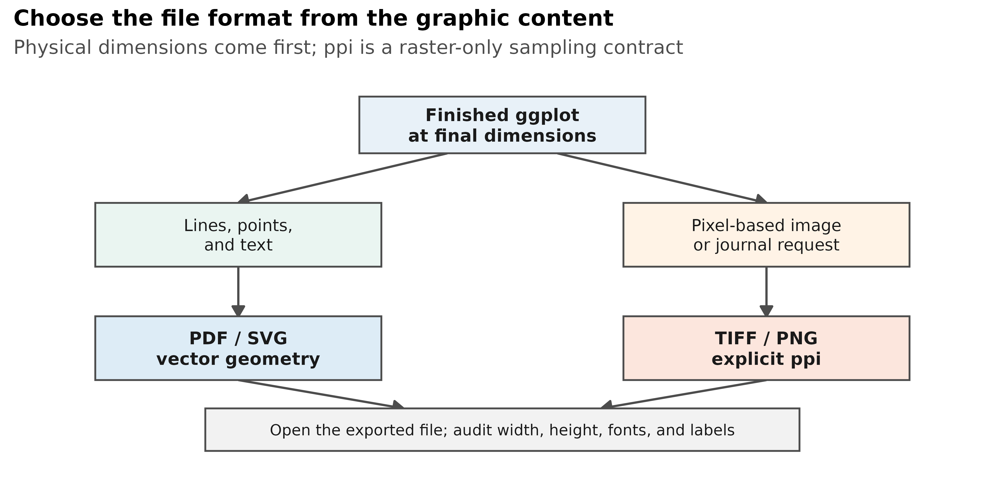
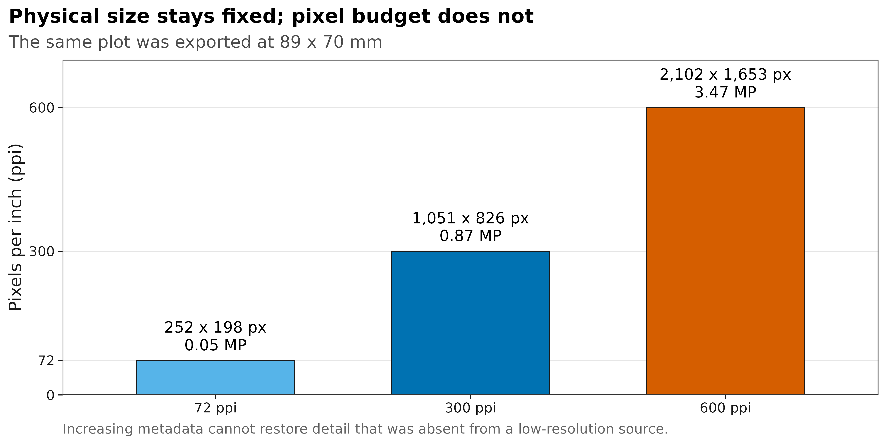

## 发表级图形首先要可读、可辨和可复现 {#sec-paper-figure}

一张图在 RStudio 绘图窗里看起来清楚，不等于投稿文件合格。真正要交付的是一组可复核的文件合同：最终物理尺寸、字体、颜色编码、矢量或位图格式、实际像素数，以及打开导出文件后的回验结果。

本页用 An 等公开湿地研究随 `microeco 2.0.0` 分发的真实 16S 数据重绘四张图。数据包含 13,628 个 OTU、90 个样本和 1,619,670 条 reads；三组各 30 个样本。这里不检验湿地组的生物学差异，只用同一份真实数据演示图形合同。

{#fig-encoding-redundancy}

{#fig-final-size-composition}

{#fig-export-decision}

{#fig-resolution-audit}

::: {.callout-important title="先记住三个结论"}

1. **先定最终宽高，再谈字号和 ppi。** 在大画布上做完再缩小，常把 10 pt 字缩成不可读的小字。
2. **PDF/SVG 是矢量格式，不存在“300 dpi 矢量图”。** ppi 只约束 PNG/TIFF 这类像素网格；图中若嵌入照片，照片本身仍有分辨率。
3. **颜色不能是唯一编码。** 重要分组同时使用 shape、linetype、direct label 或 panel，色觉模拟只是检查，不是可访问性的全部证明。

:::

本次文件级验收为 **171 / 171 PASS**：4 张图各生成 PDF、SVG、PNG 和 LZW-TIFF，共 8 个矢量文件、8 个 600 ppi 位图文件；4 个 PDF 均嵌入字体，4 个 SVG 均保留文本节点，16 个主文件均通过最终尺寸检查。

## 理论：先定最终尺寸，再决定格式 {#sec-theory}

### 1. 矢量和位图解决的是两类问题

矢量图记录几何对象：线段、曲线、点、文字和填充。放大时由查看器重新计算，因此适合大多数 `ggplot2` 统计图。

位图记录规则像素网格，适合显微照片、遥感图、密集热图或期刊明确要求 TIFF/PNG 的情形。位图清晰度由两个量共同决定：

\[
N_{px}=\frac{L_{mm}}{25.4}\times \mathrm{ppi}
\]

其中，$L_{mm}$ 是最终物理长度，$N_{px}$ 是该方向的像素数。例如 89 mm 宽的图：

| Target ppi | Expected width | Expected height at 70 mm | Pixel count |
|---:|---:|---:|---:|
| 72 | 252 px | 198 px | 0.05 MP |
| 300 | 1,051 px | 826 px | 0.87 MP |
| 600 | 2,102 px | 1,653 px | 3.47 MP |

不同软件可能因取整相差 1 pixel，应根据实际文件核对，而不是只看保存命令。

### 2. `dpi` 与 `ppi` 不应混为一谈

- **ppi（pixels per inch）**描述数字图像每英寸包含多少像素；本页位图验收的对象就是 ppi。
- **dpi（dots per inch）**原本描述打印设备每英寸落多少墨点。
- R 的 `ggsave(dpi = ...)` 参数沿用了常见软件命名；对 PNG/TIFF 导出来说，它控制物理尺寸到像素尺寸的换算，因此本文按输出 ppi 解读。

期刊指南经常把数字图的要求也写成 dpi。投稿时照目标期刊的原词填写，但在自己的审计表里应同时保存毫米尺寸和实际 pixels，避免只剩一个模糊的“300 dpi”。

### 3. 字号只能在最终尺寸下判断

字体大小以 point 为单位，1 point = 1/72 inch。若图先按 180 mm 宽绘制，再缩到 90 mm，所有 10 pt 文字都会视觉上变成约 5 pt。正确顺序是：

```text
journal column width
        ↓
final width × height
        ↓
font size / line width / point size
        ↓
legend and panel layout
        ↓
export and reopen
```

字体名称也不是装饰信息。系统若找不到指定字体，会替换成另一个字体，造成字宽变化、换行漂移或 PDF 字体未嵌入。本页明确解析 `DejaVu Sans`，记录字体文件 SHA-256，并检查 PDF 嵌入和 SVG 字体声明。换用 Arial、Helvetica 或期刊指定字体时，同样要先验证系统真正解析到了哪一个文件。

### 4. 色盲友好不等于“换一套调色板”

颜色选择至少要同时回答四个问题：

- 色相在常见色觉缺陷模拟下是否仍可区分；
- 点或线是否还有 shape、linetype、边框或文字标签作为第二通道；
- 浅色对象在白底上是否仍可见；
- 灰度打印、投影和缩小后是否仍能读懂。

本例的三组颜色是蓝、vermillion 和 bluish green。deutan/protan 模拟后部分颜色明显靠近，但 circle、square、triangle 仍保留组别。模拟结果不能代表每位读者的实际视觉体验，因此关键结论还应允许从标签、形状或分面中恢复。

### 5. 期刊规范是目标合同，不是永久常数

Nature 当前图形指南偏好让线条和文字保持矢量，并接受 PDF/SVG；其示例版面给出约 89 mm 单栏和约 183 mm 双栏。PLOS 的具体期刊指南则要求按最终尺寸准备文件，并列出 TIFF/EPS、300–600 dpi、LZW 等要求。两者已经说明：**不同期刊、不同图型、不同投稿阶段可能要求不同格式。**

因此本页把 89 mm 和 183 mm 当作可执行示例，不把它们写成所有期刊的统一标准。投稿前应重新读取目标期刊的最新 figure guide，并把宽高、颜色空间、格式、字体和分辨率更新到导出函数参数中。

<details>
<summary><strong>深入：为什么“把 72 ppi 图片改成 600 ppi”通常没有修复任何细节</strong></summary>

若原始图只有 252 × 198 pixels，把元数据改成 600 ppi 会让它在版面上的标称尺寸变小；把它插值到 2,102 × 1,653 pixels，则只是根据邻近像素猜出新像素。两种操作都不会恢复原来没有记录的线条、字形或照片细节。

统计图应回到产生它的代码和数据重新导出。照片或扫描图应回到原始采集文件；若原始采集本身分辨率不足，应如实说明，而不是用插值掩盖。

</details>

## 准备工作 {#sec-preparation}

<details open>
<summary><strong>展开：安装依赖、获取真实三件套并定义完整作图函数</strong></summary>

本页实测环境为 R 4.4.1、`ggplot2 3.5.2`、`colorspace 2.1.0`、`ragg 1.3.2`、`systemfonts 1.1.0` 和 `svglite 2.1.3`。首次安装可执行：

```{r}
#| eval: false
install.packages(c(
  "colorspace", "digest", "dplyr", "ggplot2", "jsonlite",
  "ragg", "readr", "scales", "svglite", "systemfonts",
  "tibble", "tidyr"
))
```

真实数据来自 CRAN 归档中的 `microeco 2.0.0`。下面的代码会校验源码包 SHA-256，并直接导出 `otutab`、`taxonomy` 和 `metadata`；不需要先构建任何 RDS 对象。

```{r}
#| eval: false
dir.create("downloads", showWarnings = FALSE)
dir.create("data/small", recursive = TRUE, showWarnings = FALSE)

microeco_url <- paste0(
  "https://cran.r-project.org/src/contrib/Archive/microeco/",
  "microeco_2.0.0.tar.gz"
)
microeco_tar <- "downloads/microeco_2.0.0.tar.gz"
download.file(microeco_url, microeco_tar, mode = "wb")

stopifnot(
  digest::digest(
    file = microeco_tar,
    algo = "sha256",
    serialize = FALSE
  ) == "454a3b71ceeea86bdd54f475a12b5bac9c3b124f663b8dc6e560827fca89ebfd"
)

required_data <- c(
  "microeco/data/otu_table_16S.RData",
  "microeco/data/taxonomy_table_16S.RData",
  "microeco/data/sample_info_16S.RData"
)
extract_dir <- tempfile("microeco-data-")
dir.create(extract_dir)
untar(microeco_tar, files = required_data, exdir = extract_dir)

data_env <- new.env(parent = emptyenv())
for (relative_path in required_data) {
  load(file.path(extract_dir, relative_path), envir = data_env)
}

write_keyed_tsv <- function(x, id_name, path) {
  out <- data.frame(
    stats::setNames(list(rownames(x)), id_name),
    x,
    check.names = FALSE
  )
  readr::write_tsv(out, path)
}

write_keyed_tsv(
  data_env$otu_table_16S,
  "FeatureID",
  "data/small/otutab.tsv"
)
write_keyed_tsv(
  data_env$taxonomy_table_16S,
  "FeatureID",
  "data/small/taxonomy.tsv"
)
write_keyed_tsv(
  data_env$sample_info_16S,
  "SampleID",
  "data/small/metadata.tsv"
)
unlink(extract_dir, recursive = TRUE)
```

下面是本文实际使用的完整函数。项目目录中的 `R/theme_pub.R` 保存同一份共享版本；复制单篇代码时直接保留下列定义即可。

```{r}
#| label: setup
#| include: true
set.seed(20260721)

required_packages <- c(
  "colorspace", "digest", "dplyr", "ggplot2", "jsonlite", "ragg",
  "readr", "scales", "svglite", "systemfonts", "tibble", "tidyr"
)
missing_packages <- required_packages[
  !vapply(required_packages, requireNamespace, logical(1), quietly = TRUE)
]
stopifnot(length(missing_packages) == 0L)

font_pub <- "DejaVu Sans"
font_info <- systemfonts::font_info(font_pub)
stopifnot(
  nrow(font_info) >= 1L,
  identical(font_info$family[[1L]], font_pub),
  file.exists(font_info$path[[1L]]),
  isTRUE(font_info$scalable[[1L]])
)

pal_pub <- c(
  blue = "#0072B2",
  orange = "#E69F00",
  green = "#009E73",
  vermillion = "#D55E00",
  purple = "#CC79A7",
  sky = "#56B4E9",
  yellow = "#F0E442",
  grey = "#6B7280"
)

scale_color_pub <- function(..., values = unname(pal_pub)) {
  ggplot2::scale_color_manual(..., values = values)
}

scale_fill_pub <- function(..., values = unname(pal_pub)) {
  ggplot2::scale_fill_manual(..., values = values)
}

theme_pub <- function(base_size = 10, base_family = font_pub) {
  ggplot2::theme_bw(base_size = base_size, base_family = base_family) +
    ggplot2::theme(
      panel.grid.minor = ggplot2::element_blank(),
      panel.grid.major = ggplot2::element_line(
        colour = "#E6E6E6", linewidth = 0.25
      ),
      axis.text = ggplot2::element_text(colour = "#1A1A1A"),
      axis.title = ggplot2::element_text(colour = "#1A1A1A"),
      axis.ticks = ggplot2::element_line(
        colour = "#1A1A1A", linewidth = 0.3
      ),
      plot.title.position = "plot",
      plot.title = ggplot2::element_text(
        face = "bold", size = ggplot2::rel(1.15)
      ),
      plot.subtitle = ggplot2::element_text(colour = "#4D4D4D"),
      plot.caption = ggplot2::element_text(
        colour = "#666666", hjust = 0
      ),
      strip.background = ggplot2::element_rect(
        fill = "#F2F2F2", colour = "#B3B3B3", linewidth = 0.3
      ),
      strip.text = ggplot2::element_text(face = "bold"),
      legend.key = ggplot2::element_blank(),
      legend.position = "top"
    )
}

save_pub <- function(
  plot,
  file_base,
  width = 89,
  height = 70,
  units = "mm",
  dpi = 600,
  write_svg = TRUE,
  write_tiff = TRUE,
  base_family = font_pub
) {
  dir.create(dirname(file_base), recursive = TRUE, showWarnings = FALSE)

  ggplot2::ggsave(
    paste0(file_base, ".pdf"), plot,
    width = width, height = height, units = units,
    device = grDevices::cairo_pdf,
    family = base_family,
    bg = "white"
  )

  if (isTRUE(write_svg)) {
    ggplot2::ggsave(
      paste0(file_base, ".svg"), plot,
      width = width, height = height, units = units,
      device = svglite::svglite,
      bg = "white"
    )
  }

  ggplot2::ggsave(
    paste0(file_base, ".png"), plot,
    width = width, height = height, units = units,
    dpi = dpi,
    device = ragg::agg_png,
    bg = "white"
  )

  if (isTRUE(write_tiff)) {
    ggplot2::ggsave(
      paste0(file_base, ".tiff"), plot,
      width = width, height = height, units = units,
      dpi = dpi,
      device = ragg::agg_tiff,
      compression = "lzw",
      bg = "white"
    )
  }

  invisible(plot)
}
```

</details>

## 可复制代码 {#sec-code}

### 1. 从三件套读入真实数据并先验收

本页在普通 Linux 工作站上约需 30 秒，峰值内存低于 1 GB。四个输入文件都先核对 SHA-256，再检查矩阵方向、非负整数 counts 和 ID 集合。

```{r}
#| label: read-triad
input_paths <- c(
  otutab = "data/small/otutab.tsv",
  taxonomy = "data/small/taxonomy.tsv",
  metadata = "data/small/metadata.tsv",
  source_summary = "data/small/source_summary.json"
)
expected_sha256 <- c(
  otutab = "76fa79c38da889f35978dc86da4641a270961746709ff38049ee5f67e3c6f7a3",
  taxonomy = "725280bb9a0cd9bda7b540022e92af945ceed52527f8b2d220b055b4489f6901",
  metadata = "df24771dccf27607ddf922c6bca2cafa876d946fbe2e09d14b601accce66ba64",
  source_summary = "acc15b18d3f85d6d35770d0db7580d91d0a55a838862876536500a8d7c75711b"
)
observed_sha256 <- vapply(
  input_paths,
  digest::digest,
  character(1),
  algo = "sha256",
  serialize = FALSE,
  file = TRUE
)
stopifnot(identical(observed_sha256, expected_sha256))

read_keyed_tsv <- function(path) {
  x <- readr::read_tsv(
    path,
    show_col_types = FALSE,
    progress = FALSE,
    name_repair = "minimal",
    na = character()
  )
  ids <- as.character(x[[1L]])
  stopifnot(!anyDuplicated(ids))
  out <- as.data.frame(x[-1L], check.names = FALSE)
  rownames(out) <- ids
  out
}

otutab <- read_keyed_tsv(input_paths[["otutab"]])
taxonomy <- read_keyed_tsv(input_paths[["taxonomy"]])
metadata <- read_keyed_tsv(input_paths[["metadata"]])

otu_matrix <- as.matrix(otutab)
storage.mode(otu_matrix) <- "numeric"

stopifnot(
  identical(rownames(otu_matrix), rownames(taxonomy)),
  identical(colnames(otu_matrix), rownames(metadata)),
  all(is.finite(otu_matrix)),
  all(otu_matrix >= 0),
  all(otu_matrix == round(otu_matrix)),
  all(c("Group", "Type", "Saline") %in% colnames(metadata)),
  nrow(otu_matrix) == 13628L,
  ncol(otu_matrix) == 90L,
  sum(otu_matrix) == 1619670
)

dim(otu_matrix)
otu_matrix[1:5, 1:5]
taxonomy[1:5, , drop = FALSE]
head(metadata)
```

### 2. 建立英文标签、颜色和形状的双重编码

metadata 中的 `IW/CW/TW` 先映射成英文组名。每组获得一个颜色和一个形状；颜色模拟只改变填充色，不改变 shape。

```{r}
group_labels <- c(
  IW = "Inland wetland",
  CW = "Coastal wetland",
  TW = "Tibetan Plateau"
)
group_palette <- c(
  "Inland wetland" = "#0072B2",
  "Coastal wetland" = "#D55E00",
  "Tibetan Plateau" = "#009E73"
)
group_shapes <- c(
  "Inland wetland" = 21,
  "Coastal wetland" = 22,
  "Tibetan Plateau" = 24
)

sample_plot_data <- data.frame(
  SampleID = colnames(otu_matrix),
  LibrarySize = as.numeric(colSums(otu_matrix)),
  ObservedFeatures = as.numeric(colSums(otu_matrix > 0)),
  Group = metadata[colnames(otu_matrix), "Group"],
  GroupLabel = unname(
    group_labels[metadata[colnames(otu_matrix), "Group"]]
  ),
  Salinity = metadata[colnames(otu_matrix), "Saline"],
  stringsAsFactors = FALSE
)
sample_plot_data$GroupLabel <- factor(
  sample_plot_data$GroupLabel,
  levels = names(group_palette)
)

palette_views <- list(
  Standard = unname(group_palette),
  "Deuteranopia simulation" = colorspace::deutan(
    unname(group_palette), severity = 1
  ),
  "Protanopia simulation" = colorspace::protan(
    unname(group_palette), severity = 1
  )
)

palette_audit <- do.call(
  rbind,
  lapply(names(palette_views), function(view) {
    data.frame(
      View = view,
      Group = names(group_palette),
      Hex = unname(palette_views[[view]]),
      Shape = unname(group_shapes[names(group_palette)]),
      ContrastWhite = as.numeric(
        colorspace::contrast_ratio(palette_views[[view]], "#FFFFFF")
      ),
      ContrastBlack = as.numeric(
        colorspace::contrast_ratio(palette_views[[view]], "#000000")
      )
    )
  })
)

encoding_plot_data <- do.call(
  rbind,
  lapply(names(palette_views), function(view) {
    out <- sample_plot_data
    out$Vision <- view
    view_palette <- stats::setNames(
      palette_views[[view]],
      names(group_palette)
    )
    out$DisplayColor <- unname(
      view_palette[as.character(out$GroupLabel)]
    )
    out
  })
)
encoding_plot_data$Vision <- factor(
  encoding_plot_data$Vision,
  levels = names(palette_views)
)

palette_audit
```

### 3. 画颜色视觉与冗余编码审计图

点使用可填充 shape 21/22/24，黑色边框让浅色填充在白底上仍有边界。图例中的英文名可以直接进入英文论文。

```{r}
#| output: false
encoding_plot <- ggplot2::ggplot(
  encoding_plot_data,
  ggplot2::aes(x = ObservedFeatures, y = LibrarySize)
) +
  ggplot2::geom_point(
    ggplot2::aes(fill = DisplayColor, shape = GroupLabel),
    colour = "#1A1A1A",
    stroke = 0.35,
    size = 2.2,
    alpha = 0.85
  ) +
  ggplot2::facet_wrap(~Vision, nrow = 1L) +
  ggplot2::scale_fill_identity(
    name = "Wetland group",
    breaks = unname(group_palette),
    labels = names(group_palette),
    guide = "legend"
  ) +
  ggplot2::scale_shape_manual(
    name = "Wetland group",
    values = group_shapes
  ) +
  ggplot2::scale_x_continuous(labels = scales::label_comma()) +
  ggplot2::scale_y_continuous(labels = scales::label_comma()) +
  ggplot2::labs(
    title = "Colour is not the only group cue",
    subtitle = paste(
      "The same 90 samples retain distinct shapes under",
      "two colour-vision simulations"
    ),
    x = "Observed features",
    y = "Library size (reads)"
  ) +
  theme_pub(base_size = 9.5) +
  ggplot2::theme(
    legend.position = "bottom",
    legend.box = "horizontal",
    panel.spacing.x = grid::unit(3, "mm")
  )

save_pub(
  encoding_plot,
  "figures/18-encoding-redundancy-audit",
  width = 183,
  height = 95,
  dpi = 600
)
```

### 4. 在 89 mm 最终宽度下完成单栏图

先把 taxonomy 的 `p__` 前缀清理掉，再按每个样本计算相对丰度。图中展示总 reads 排名前五的 phyla，其余合并为 `Other`；三根柱是组内 30 个样本相对丰度的均值。这张图只用于排版示范，不把组间视觉差异当作推断结果。

```{r}
phylum <- sub(
  "^p__",
  "",
  as.character(taxonomy[rownames(otu_matrix), "Phylum"])
)
phylum[is.na(phylum) | !nzchar(phylum)] <- "Unassigned"

phylum_totals <- sort(
  rowsum(rowSums(otu_matrix), phylum)[, 1L],
  decreasing = TRUE
)
top_phyla <- names(phylum_totals)[seq_len(5L)]
phylum_class <- ifelse(phylum %in% top_phyla, phylum, "Other")
phylum_counts <- rowsum(
  otu_matrix,
  group = phylum_class,
  reorder = FALSE
)
phylum_relative <- sweep(
  phylum_counts,
  2L,
  colSums(phylum_counts),
  "/"
)

phylum_composition <- do.call(
  rbind,
  lapply(names(group_labels), function(group_code) {
    selected <- rownames(metadata)[metadata$Group == group_code]
    data.frame(
      Group = unname(group_labels[[group_code]]),
      Phylum = rownames(phylum_relative),
      MeanRelativeAbundance = rowMeans(
        phylum_relative[, selected, drop = FALSE]
      ),
      SampleN = length(selected),
      stringsAsFactors = FALSE
    )
  })
)

phylum_order <- c(top_phyla, "Other")
phylum_composition$Group <- factor(
  phylum_composition$Group,
  levels = names(group_palette)
)
phylum_composition$Phylum <- factor(
  phylum_composition$Phylum,
  levels = phylum_order
)
stopifnot(
  all(
    abs(
      tapply(
        phylum_composition$MeanRelativeAbundance,
        phylum_composition$Group,
        sum
      ) - 1
    ) < 1e-12
  )
)

phylum_composition
```

```{r}
#| output: false
composition_palette <- stats::setNames(
  c(
    pal_pub[["blue"]],
    pal_pub[["orange"]],
    pal_pub[["green"]],
    pal_pub[["vermillion"]],
    pal_pub[["purple"]],
    pal_pub[["grey"]]
  ),
  phylum_order
)

composition_plot <- ggplot2::ggplot(
  phylum_composition,
  ggplot2::aes(
    x = Group,
    y = MeanRelativeAbundance,
    fill = Phylum
  )
) +
  ggplot2::geom_col(
    width = 0.72,
    colour = "white",
    linewidth = 0.25
  ) +
  ggplot2::scale_fill_manual(
    values = composition_palette,
    breaks = phylum_order,
    drop = FALSE
  ) +
  ggplot2::scale_y_continuous(
    labels = scales::label_percent(accuracy = 1),
    expand = ggplot2::expansion(mult = c(0, 0.02))
  ) +
  ggplot2::labs(
    title = "Community composition at final size",
    subtitle = "Mean relative abundance; n = 30 per group",
    x = NULL,
    y = "Mean relative abundance",
    fill = NULL
  ) +
  theme_pub(base_size = 8.5) +
  ggplot2::theme(
    axis.text.x = ggplot2::element_text(angle = 25, hjust = 1),
    legend.position = "bottom",
    legend.text = ggplot2::element_text(size = 8),
    legend.key.height = grid::unit(3.3, "mm"),
    panel.grid.major.x = ggplot2::element_blank()
  ) +
  ggplot2::guides(
    fill = ggplot2::guide_legend(ncol = 2, byrow = TRUE)
  )

save_pub(
  composition_plot,
  "figures/18-final-size-community-summary",
  width = 89,
  height = 105,
  dpi = 600
)
```

### 5. 把格式选择和像素预算画成可复核证据

格式决策图本身也使用 `ggplot2` 绘制，因此可以和统计图共享字体、线宽和导出函数。

```{r}
#| output: false
decision_boxes <- data.frame(
  xmin = c(1.35, 0.15, 2.55, 0.15, 2.55, 0.65),
  xmax = c(2.65, 1.45, 3.85, 1.45, 3.85, 3.35),
  ymin = c(3.85, 2.25, 2.25, 0.65, 0.65, -0.35),
  ymax = c(4.65, 3.15, 3.15, 1.55, 1.55, 0.25),
  fill = c(
    "#E8F1F8", "#EAF5F1", "#FFF3E6",
    "#DDECF6", "#FCE6DD", "#F2F2F2"
  ),
  label = c(
    "Finished ggplot\nat final dimensions",
    "Lines, points,\nand text",
    "Pixel-based image\nor journal request",
    "PDF / SVG\nvector geometry",
    "TIFF / PNG\nexplicit ppi",
    "Open the exported file; audit width, height, fonts, and labels"
  ),
  stringsAsFactors = FALSE
)
decision_arrows <- data.frame(
  x = c(1.75, 2.25, 0.8, 3.2, 0.8, 3.2),
  xend = c(0.8, 3.2, 0.8, 3.2, 1.55, 2.45),
  y = c(3.85, 3.85, 2.25, 2.25, 0.65, 0.65),
  yend = c(3.15, 3.15, 1.55, 1.55, 0.25, 0.25)
)

decision_plot <- ggplot2::ggplot() +
  ggplot2::geom_segment(
    data = decision_arrows,
    ggplot2::aes(x = x, y = y, xend = xend, yend = yend),
    linewidth = 0.55,
    colour = "#4D4D4D",
    arrow = grid::arrow(
      length = grid::unit(2.1, "mm"),
      type = "closed"
    )
  ) +
  ggplot2::geom_rect(
    data = decision_boxes,
    ggplot2::aes(
      xmin = xmin,
      xmax = xmax,
      ymin = ymin,
      ymax = ymax,
      fill = fill
    ),
    colour = "#4D4D4D",
    linewidth = 0.45
  ) +
  ggplot2::geom_text(
    data = decision_boxes,
    ggplot2::aes(
      x = (xmin + xmax) / 2,
      y = (ymin + ymax) / 2,
      label = label
    ),
    family = font_pub,
    colour = "#1A1A1A",
    lineheight = 0.98,
    size = c(3.2, 3, 3, 3.2, 3.2, 2.8),
    fontface = c("bold", "plain", "plain", "bold", "bold", "plain")
  ) +
  ggplot2::scale_fill_identity() +
  ggplot2::coord_cartesian(
    xlim = c(0, 4),
    ylim = c(-0.45, 4.8),
    clip = "off"
  ) +
  ggplot2::labs(
    title = "Choose the file format from the graphic content",
    subtitle = paste(
      "Physical dimensions come first; ppi is a raster-only",
      "sampling contract"
    )
  ) +
  theme_pub(base_size = 10) +
  ggplot2::theme(
    panel.grid.major = ggplot2::element_blank(),
    panel.grid.minor = ggplot2::element_blank(),
    panel.border = ggplot2::element_blank(),
    axis.text = ggplot2::element_blank(),
    axis.title = ggplot2::element_blank(),
    axis.ticks = ggplot2::element_blank(),
    legend.position = "none",
    plot.margin = ggplot2::margin(5, 7, 5, 7)
  )

save_pub(
  decision_plot,
  "figures/18-export-decision-map",
  width = 183,
  height = 90,
  dpi = 600
)
```

同一张 probe 图固定为 89 × 70 mm，只改变 ppi。`floor()` 对应本次 ragg 设备实际采用的像素取整方式；正式回验仍以生成文件为准。

```{r}
#| output: false
probe_plot <- ggplot2::ggplot(
  sample_plot_data,
  ggplot2::aes(x = ObservedFeatures, y = LibrarySize)
) +
  ggplot2::geom_point(
    ggplot2::aes(fill = GroupLabel, shape = GroupLabel),
    colour = "#1A1A1A",
    stroke = 0.3,
    size = 1.7,
    alpha = 0.85
  ) +
  ggplot2::scale_fill_manual(values = group_palette) +
  ggplot2::scale_shape_manual(values = group_shapes) +
  ggplot2::scale_x_continuous(labels = scales::label_comma()) +
  ggplot2::scale_y_continuous(labels = scales::label_comma()) +
  ggplot2::labs(
    title = "Resolution probe",
    x = "Observed features",
    y = "Library size (reads)"
  ) +
  theme_pub(base_size = 8) +
  ggplot2::theme(legend.position = "none")

probe_ppi <- c(72L, 300L, 600L)
probe_paths <- file.path(
  "results/18-publication-graphics",
  paste0("resolution-probe-", probe_ppi, "ppi.png")
)
dir.create(
  "results/18-publication-graphics",
  recursive = TRUE,
  showWarnings = FALSE
)

for (i in seq_along(probe_ppi)) {
  ggplot2::ggsave(
    probe_paths[[i]],
    plot = probe_plot,
    width = 89,
    height = 70,
    units = "mm",
    dpi = probe_ppi[[i]],
    device = ragg::agg_png,
    bg = "white"
  )
}

resolution_plot_data <- data.frame(
  target_ppi = probe_ppi,
  pixel_width = floor(89 / 25.4 * probe_ppi),
  pixel_height = floor(70 / 25.4 * probe_ppi)
)
resolution_plot_data$megapixels <- with(
  resolution_plot_data,
  pixel_width * pixel_height / 1e6
)
resolution_plot_data$PPI <- factor(
  paste0(resolution_plot_data$target_ppi, " ppi"),
  levels = paste0(probe_ppi, " ppi")
)
resolution_plot_data$PixelLabel <- paste0(
  scales::comma(resolution_plot_data$pixel_width),
  " x ",
  scales::comma(resolution_plot_data$pixel_height),
  " px\n",
  sprintf("%.2f MP", resolution_plot_data$megapixels)
)

resolution_plot <- ggplot2::ggplot(
  resolution_plot_data,
  ggplot2::aes(x = PPI, y = target_ppi, fill = PPI)
) +
  ggplot2::geom_col(
    width = 0.62,
    colour = "#1A1A1A",
    linewidth = 0.35
  ) +
  ggplot2::geom_text(
    ggplot2::aes(label = PixelLabel),
    vjust = -0.35,
    family = font_pub,
    size = 3.2,
    lineheight = 0.95
  ) +
  ggplot2::scale_fill_manual(
    values = c(
      pal_pub[["sky"]],
      pal_pub[["blue"]],
      pal_pub[["vermillion"]]
    )
  ) +
  ggplot2::scale_y_continuous(
    limits = c(0, 700),
    breaks = c(0, 72, 300, 600),
    expand = ggplot2::expansion(mult = c(0, 0))
  ) +
  ggplot2::labs(
    title = "Physical size stays fixed; pixel budget does not",
    subtitle = "The same plot was exported at 89 x 70 mm",
    x = NULL,
    y = "Pixels per inch (ppi)",
    caption = paste(
      "Increasing metadata cannot restore detail that was absent",
      "from a low-resolution source."
    )
  ) +
  theme_pub(base_size = 10) +
  ggplot2::theme(
    legend.position = "none",
    panel.grid.major.x = ggplot2::element_blank()
  )

save_pub(
  resolution_plot,
  "figures/18-raster-resolution-audit",
  width = 183,
  height = 92,
  dpi = 600
)
```

### 6. 不只保存：逐个打开并检查导出文件

完整验证器会核对输入哈希、R 包、字体文件、颜色模拟、PDF page size、PDF 字体嵌入、SVG 文本节点、PNG/TIFF pixels、有效 ppi 和 TIFF LZW 压缩：

```{bash}
#| eval: false
Rscript --vanilla scripts/validate_publication_graphics.R \
  --project-root . \
  --input-dir data/small \
  --output-dir results/18-publication-graphics \
  --figure-dir figures
```

下面读取验证器生成的机器可读表。`actual_width_mm` 和 `actual_height_mm` 是导出文件的实际尺寸，不是命令中计划写入的数字。

```{r}
format_audit <- readr::read_tsv(
  "results/18-publication-graphics/format-audit.tsv",
  show_col_types = FALSE
)
validation_summary <- jsonlite::read_json(
  "results/18-publication-graphics/publication-graphics-summary.json",
  simplifyVector = TRUE
)

stopifnot(
  validation_summary$checks_total == 171L,
  validation_summary$checks_passed == 171L,
  validation_summary$checks_failed == 0L,
  nrow(format_audit) == 16L,
  all(format_audit$dimension_status == "PASS")
)

format_audit[, c(
  "figure",
  "extension",
  "bytes",
  "actual_width_mm",
  "actual_height_mm",
  "pixel_width",
  "pixel_height",
  "effective_ppi_x",
  "compression",
  "font_status",
  "dimension_status"
)]
```

PDF 经 Cairo 导出时 page box 以 point 记录，毫米换算可能因整数 point 取整出现小于 0.4 mm 的差异；SVG 和位图尺寸则几乎精确命中。这里把这个设备行为写入容差，而不是把计划值冒充实测值。

## 出版级美化 {#sec-publication}

### 1. 把尺寸作为函数参数，而不是最后手动缩放

常见的两类调用可以直接固定：

```{r}
#| eval: false
# Single-column example
save_pub(
  plot_single,
  "figures/figure-single",
  width = 89,
  height = 75,
  dpi = 600
)

# Two-column example
save_pub(
  plot_double,
  "figures/figure-double",
  width = 183,
  height = 105,
  dpi = 600
)
```

先用目标宽度检查文字、点、线、legend 和 panel 数量。若单栏塞不下，不要继续缩字；应减少面板、直接标注、拆分补充图，或改用双栏宽度。

### 2. 用“视觉层级”代替装饰堆叠

一个稳定的层级通常是：

- 主标题最强，subtitle 次之，caption 最弱；
- 数据对象比网格线更醒目；
- 主要比较用饱和色，背景和辅助参考线用中性灰；
- 同一种语义在所有 panel 中保持同一颜色、shape 和顺序；
- 不靠阴影、3D、渐变或粗边框制造“高级感”。

本页主题保留浅色 major grid，去掉 minor grid。若图是组成柱图，x 方向网格没有帮助，就局部关闭；若图是坐标散点，浅网格可帮助估读数值。主题函数提供基线，具体图仍应按信息结构做小范围覆盖。

### 3. 图例应服务查找，不应消耗半张图

优先级通常是：

1. 直接在对象附近标注；
2. 合并相同语义的 color/shape 图例；
3. 固定类别顺序并控制 `ncol`；
4. 类别过多时改为分面、热图或补充表，而不是无限扩展颜色。

组成图只显示 top taxa 时，必须在图注或 Methods 中写明 top 的选择规则和 `Other` 的定义，不能让读者误以为未显示类群不存在。

### 4. 最终提交前做人工加机器双检查

| Audit | Machine check | Human check |
|---|---|---|
| Dimensions | PDF/SVG page size; raster pixels | Fits journal column without manual scaling |
| Typography | Font resolved/embedded; SVG text present | Labels readable at 100% final size |
| Colour | Hex values; CVD simulations | Groups remain interpretable without hue alone |
| Raster | Pixel dimensions; effective ppi; compression | No jagged lines, blur, halo or interpolation artifacts |
| Content | Expected files and English labels | No clipping, overlap, duplicated legends or stale annotations |

机器检查能证明文件属性，不能判断故事是否清楚；人工检查能发现布局问题，却容易漏掉错误尺寸和未嵌入字体。两者不能互相替代。

## 常见坑 {#sec-pitfalls}

::: {.callout-caution title="审稿与制图阶段最常见的失败模式"}

- **给 PDF 写“600 dpi”。** PDF/SVG 的线和文字是矢量；只对其中嵌入的 raster layer 单独讨论 ppi。
- **用 `ggsave()` 默认尺寸交稿。** 默认值可能来自当前设备，与期刊栏宽无关；每次显式写 `width`、`height` 和 `units`。
- **在 180 mm 画布上调好 8 pt 字，再缩到 90 mm。** 最终字号随整体缩放减半，应直接在 90 mm 上排版。
- **只用红绿区分组。** 即使颜色通过某个模拟，也应增加 shape、linetype、label 或 facet。
- **黄色点直接放白底。** 浅色面积或点需要深色边框；彩色文字还要单独检查对比度。
- **指定字体名却不检查解析结果。** 同名字体可能缺失或被替换；记录 `systemfonts::font_info()` 的 family、path 和文件哈希。
- **SVG 有图形却没有可编辑文字。** 某些设备把字形转换成 path；需要文本可编辑时，用 `svglite` 并检查 `<text>` 节点。
- **把低分辨率图重新采样后称为 600 ppi 原图。** 应从数据和绘图代码重新导出，照片则回到原始采集文件。
- **所有图一律 600 ppi。** 先看目标期刊和图型；过高分辨率会增加文件体积和处理时间，并不改善矢量对象。
- **只看 R 绘图窗，不打开提交文件。** PDF 字体替换、SVG 换行、TIFF 颜色和裁切问题只会在实际文件中暴露。

:::

## 这段 Methods 怎么写 {#sec-methods}

下面的英文模板可以直接替换方括号内容。只有实际执行过的尺寸、设备和检查才能保留。

> **Figure generation and export.** Statistical graphics were generated in R [version] with ggplot2 [version] using a predefined publication theme. Figure text was set in [font family], whose resolved system font was recorded before rendering. Categorical groups were encoded redundantly by colour and [shape/linetype/direct labels], and the selected palette was inspected under protan and deutan colour-vision simulations with colorspace [version]. Figures were composed at their intended final widths ([single-column width] mm or [double-column width] mm) rather than resized after export. Line art and text were exported as PDF and SVG; raster deliverables were exported with ragg as PNG and LZW-compressed TIFF at [300/600] ppi. Exported files were reopened and audited for physical dimensions, raster pixel dimensions, font embedding or declaration, text retention, compression, clipping, and label readability. All labels within figures were in English.

若期刊只收 TIFF，应删除“PDF and SVG were submitted”，改写为“PDF/SVG files were retained as editable masters, and the submitted TIFF files…”。若实际没有做色觉模拟或字体嵌入检查，也不能把相应句子留在 Methods 中。

## 换成你自己的数据怎么做 {#sec-own-data}

### 1. 只改三件套路径和分组列

```{r}
#| eval: false
otutab <- read_keyed_tsv("your_project/data/otutab.tsv")
taxonomy <- read_keyed_tsv("your_project/data/taxonomy.tsv")
metadata <- read_keyed_tsv("your_project/data/metadata.tsv")

group_column <- "Treatment"
group_levels <- c("Control", "Disease", "Therapy")

stopifnot(
  identical(rownames(otutab), rownames(taxonomy)),
  identical(colnames(otutab), rownames(metadata)),
  group_column %in% colnames(metadata),
  setequal(unique(metadata[[group_column]]), group_levels)
)
```

若 `otutab` 是 samples × features，应先根据 taxonomy feature IDs 判断方向并转置；不要凭行数和列数猜。

### 2. 根据真实类别数设计编码

三到五组可以使用离散颜色加 shape。类别更多时，不要自动循环八种颜色；先判断是否能用分面、排序、聚合或直接标签减少同时编码的类别数。

```{r}
#| eval: false
group_palette <- c(
  Control = "#0072B2",
  Disease = "#D55E00",
  Therapy = "#009E73"
)
group_shapes <- c(Control = 21, Disease = 22, Therapy = 24)

colorspace::deutan(group_palette, severity = 1)
colorspace::protan(group_palette, severity = 1)
```

### 3. 把目标期刊规范写成参数表

```{r}
#| eval: false
journal_spec <- data.frame(
  layout = c("single", "double"),
  width_mm = c(89, 183),
  height_mm = c(80, 110),
  raster_ppi = c(600, 600)
)
```

这里的数字必须替换成目标期刊当前指南。还要确认允许的格式、RGB/CMYK、最大文件大小、字体范围、线宽和是否允许透明背景。

### 4. 额外数据要求

本分析只需要三件套。若图中还包含显微照片、地图、凝胶图或其他像素源文件，还需要保存：

- 未经截图或社交软件压缩的原始图；
- 原始 pixels、采集尺寸和颜色空间；
- 裁剪、亮度/对比度调整和拼版记录；
- 每个 panel 的来源与允许的处理边界。

统计图的 600 ppi 导出不能替代这些原始影像合同。

## 参考 {#sec-references}

1. An J, Liu C, Wang Q, et al. Soil bacterial community structure in Chinese wetlands. *Geoderma*. 2019;337:290–299. [doi:10.1016/j.geoderma.2018.09.035](https://doi.org/10.1016/j.geoderma.2018.09.035)
2. Liu C, Cui Y, Li X, Yao M. microeco: an R package for data mining in microbial community ecology. *FEMS Microbiology Ecology*. 2021;97(2):fiaa255. [doi:10.1093/femsec/fiaa255](https://doi.org/10.1093/femsec/fiaa255)
3. Wickham H, Navarro D, Pedersen TL. *ggplot2: Elegant Graphics for Data Analysis*. 3rd ed. [ggplot2 book](https://ggplot2-book.org/)
4. ggplot2 developers. Save a ggplot or other grid object with sensible defaults. [`ggsave()` documentation](https://ggplot2.tidyverse.org/reference/ggsave.html)
5. Pedersen TL, Shemanarev M. ragg: high-quality raster graphics devices. [`agg_tiff()` documentation](https://ragg.r-lib.org/reference/agg_tiff.html)
6. Wickham H, Henry L, Pedersen TL, et al. svglite: an SVG graphics device. [svglite documentation](https://svglite.r-lib.org/)
7. Pedersen TL. systemfonts: system native font finding. [systemfonts documentation](https://systemfonts.r-lib.org/reference/index.html)
8. Zeileis A, Fisher JC, Hornik K, et al. colorspace: A Toolbox for Manipulating and Assessing Colors and Palettes. *Journal of Statistical Software*. 2020;96(1):1–49. [doi:10.18637/jss.v096.i01](https://doi.org/10.18637/jss.v096.i01)
9. Machado GM, Oliveira MM, Fernandes LAF. A physiologically-based model for simulation of color vision deficiency. *IEEE Transactions on Visualization and Computer Graphics*. 2009;15(6):1291–1298. [doi:10.1109/TVCG.2009.113](https://doi.org/10.1109/TVCG.2009.113)
10. Nature Portfolio. [Preparing figures—specifications](https://research-figure-guide.nature.com/figures/preparing-figures-our-specifications/) and [building/exporting figure panels](https://research-figure-guide.nature.com/figures/building-and-exporting-figure-panels/)
11. PLOS. [Figure guidelines](https://journals.plos.org/plosmedicine/s/figures)
