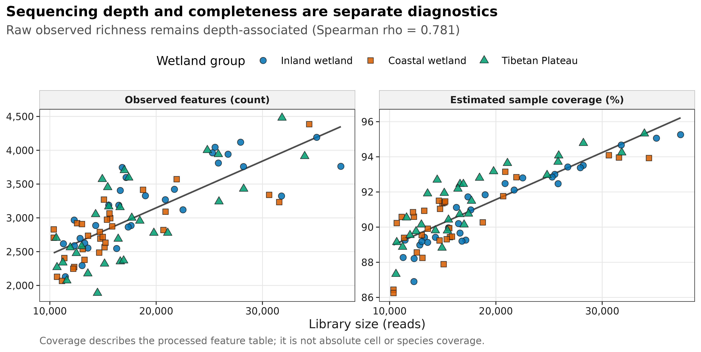
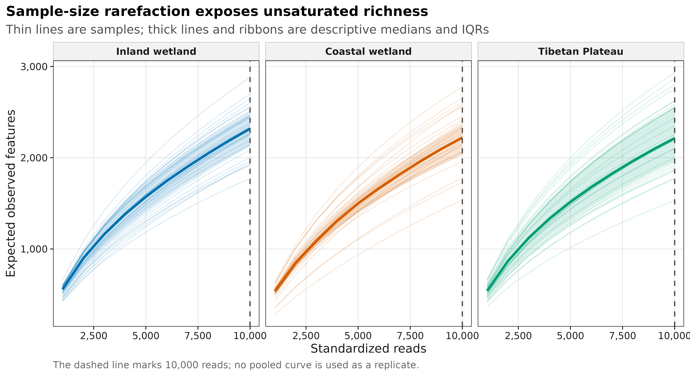
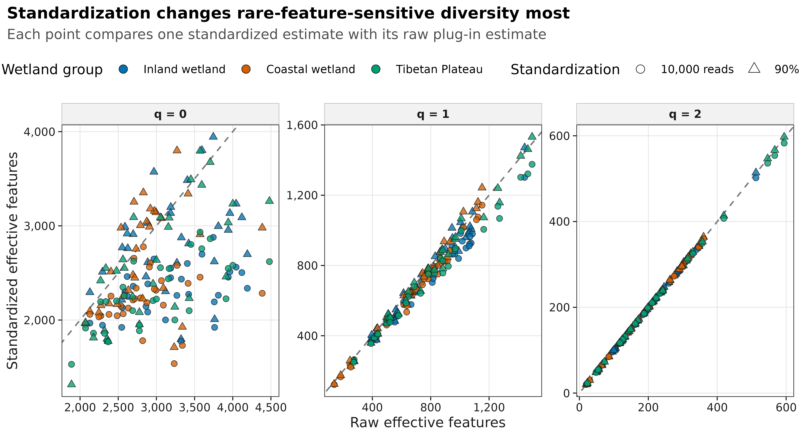
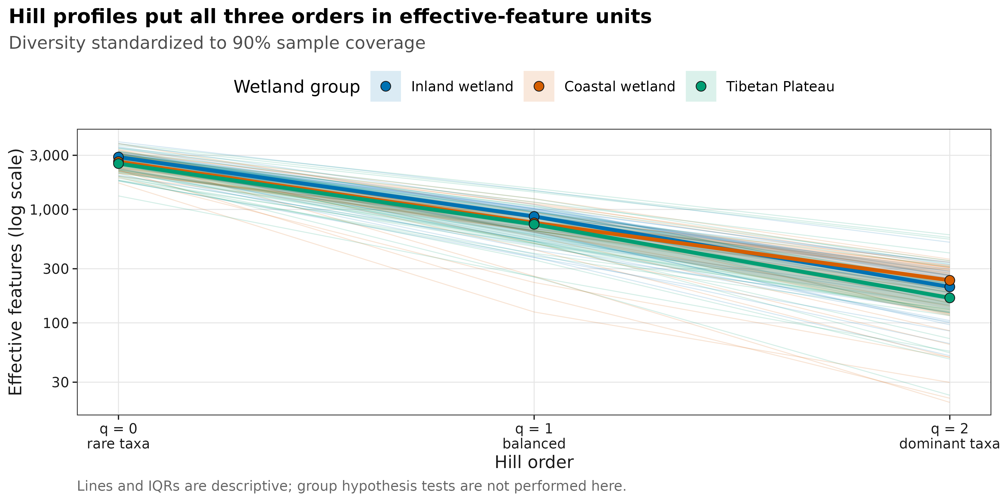

## Alpha 多样性到底在量化什么？ {#sec-paper-figure}

Alpha 多样性（alpha diversity）描述的是**单个样本内部**检测到多少类群，以及丰度在这些类群之间分配得多均匀。论文里常见的 Shannon 箱线图只是最终摘要；在比较分组之前，还应先回答三个测量问题：样本测了多深、测得多完整、结论是否依赖某一种指数或标准化方法。

本页使用 An 等中国湿地研究随 `microeco 2.0.0` 分发的真实 16S 数据：13,628 个 OTU、90 个样本、1,619,670 条 reads，内陆湿地、沿海湿地和青藏高原湿地各 30 个样本。[原始数据论文](https://doi.org/10.1016/j.geoderma.2018.09.035)与 [`microeco` 软件论文](https://doi.org/10.1093/femsec/fiaa255)提供了可引用的数据来源。以下四张图均由三件套重新计算，不复制原论文图。

{#fig-depth-completeness}

{#fig-rarefaction-curves}

{#fig-standardization-comparison}

{#fig-hill-profile}

::: {.callout-important title="先记住四个结论"}

1. **不要只报一个 Shannon。** 至少同时给 richness、evenness 或 dominant-sensitive 指标，并写清每个指标的定义。
2. **原始 richness 不能脱离测序深度解释。** 本数据的 raw Observed 与 library size 的 Spearman \(\rho=0.781\)。
3. **抽平不是一个适用于所有任务的默认预处理。** 等 reads 可用于可视化或特定距离分析的敏感性比较，但不应把随机抽平表继续交给差异丰度计数模型。
4. **Hill numbers 统一了量纲。** \(q=0\) 是 observed richness，\(q=1\) 是 \(\exp(H')\)，\(q=2\) 是 inverse Simpson；数值都表示“同等多样的有效 feature 数”。

:::

本数据的 library size 为 10,364–37,374 reads。若所有样本都按 10,000 reads 比较，可保留 90/90 个样本，但相当于不利用 44.4% 的已测 reads。改按 90% coverage 比较时，56 个样本需要 interpolation，34 个样本需要短程 extrapolation，最大推算 effort 为原 library size 的 1.453 倍。两条路径都应连同目标值和代价一起报告。

## 每个指数到底在测什么 {#sec-theory}

### 1. Richness、evenness 和 dominance 不是同一个问题

设样本中第 \(i\) 个 feature 的相对丰度为 \(p_i\)，检测到的 feature 数为 \(S_{obs}\)。常见指标可整理为：

| 指标 | 定义或直觉 | 单位 | 对稀有 feature 的敏感度 |
|---|---|---|---|
| Observed | 检测到的非零 feature 数 | features | 高 |
| Chao1 | 用 singleton/doubleton 修正未检出 richness | features | 很高 |
| Shannon | \(-\sum p_i\log p_i\) | entropy | 中等 |
| Simpson | `vegan` 中为 \(1-\sum p_i^2\) | probability | 低 |
| Pielou | \(H'/\log(S_{obs})\) | 0–1 ratio | 中等 |
| Hill \(q=0\) | \(S_{obs}\) | effective features | 高 |
| Hill \(q=1\) | \(\exp(H')\) | effective features | 中等 |
| Hill \(q=2\) | \(1/\sum p_i^2\) | effective features | 低 |

Observed 只计算“见过多少个”；Shannon 同时受 richness 和均匀度影响；Simpson 更强调优势 feature。它们不应被互换命名。例如，`vegan::diversity(index = "simpson")` 返回的是 \(1-\sum p_i^2\)，而不是 inverse Simpson。

<details>
<summary><strong>深入：Chao1 与 sample coverage 为什么都盯着 singleton</strong></summary>

若 \(f_1\) 和 \(f_2\) 分别表示样本中只出现 1 次和 2 次的 feature 数，经典 Chao1 的核心修正项与 \(f_1^2/(2f_2)\) 有关；软件会对 \(f_2=0\) 等边界情况使用修正公式。singleton 越多，未观察 richness 的证据通常越强。

Good's sample coverage 的直观估计为：

\[
\hat C = 1-\frac{f_1}{n}
\]

其中 \(n\) 是该样本的总 reads。它估计下一条 read 落在已观测 feature 中的概率，而不是“环境中 90% 的细胞或物种已经被测到”。PCR 偏好、16S 拷贝数、引物覆盖和分类数据库误差仍然存在。

在计算 Observed、Chao1 和 coverage 前删除 singleton，会直接改写这些估计量所需的信息。低丰度过滤可用于其他下游任务，但必须与原始 richness 估计分开。

</details>

### 2. 稀释曲线、等 reads 和等 coverage 回答不同问题

**Sample-size rarefaction** 问：“如果每个样本只使用相同数量的 reads，期望看到多少 diversity？”它把测序量固定下来，但不同样本在该深度下可能具有不同完整度。

**Coverage-based standardization** 问：“如果每个样本都比较到相同的样本完整度，期望 diversity 是多少？”它允许对测得更完整的样本做 interpolation，也允许对不够完整的样本做有限 extrapolation。

本页使用解析 rarefaction / extrapolation，不生成随机抽平 count table。这样重复运行不会因一次随机丢 reads 而改变结果，也不会诱使人把抽平表误用于后续差异丰度模型。

::: {.callout-note title="稀释曲线接近平台不等于测序绝对充分"}
曲线只描述当前 feature 定义和处理流程下，继续增加 reads 对观测 richness 的预期收益。平台外观还受横轴范围、singleton、测序错误处理和分类分辨率影响。应同时报告 library size、coverage、目标深度或目标 coverage，以及 extrapolation 范围。
:::

### 3. Hill numbers 把三个指标放回同一量纲

Hill number 的一般形式为：

\[
{}^qD=\left(\sum_i p_i^q\right)^{1/(1-q)}
\]

当 \(q\) 增大，稀有 feature 的权重降低：

- \(q=0\)：每个被检测 feature 权重相同，对稀有 feature 最敏感；
- \(q=1\)：极限形式为 \(\exp(H')\)，兼顾 richness 与 evenness；
- \(q=2\)：为 inverse Simpson，主要反映优势 feature。

“Hill \(q=1=800\)”可以读作：该样本的 Shannon 多样性，相当于 800 个等丰度 feature。这个解释比直接比较 entropy 值更直观。

## 准备工作 {#sec-preparation}

<details open>
<summary><strong>展开：安装依赖、获取真实三件套并定义完整作图函数</strong></summary>

本页实测环境为 R 4.4.1、`vegan 2.6-6.1`、`phyloseq 1.48.0`、`iNEXT 3.0.2` 和 `ggplot2 3.5.2`。首次安装可执行：

```{r}
#| eval: false
install.packages(c(
  "digest", "dplyr", "ggplot2", "iNEXT", "jsonlite", "ragg",
  "readr", "scales", "svglite", "systemfonts", "tibble",
  "tidyr", "vegan"
))
if (!requireNamespace("BiocManager", quietly = TRUE)) {
  install.packages("BiocManager")
}
BiocManager::install("phyloseq")
```

真实数据来自 CRAN 归档中的 `microeco 2.0.0`。下面代码锁定源码包版本、核对 SHA-256，并直接导出 `otutab`、`taxonomy` 和 `metadata`：

```{r}
#| eval: false
dir.create("downloads", showWarnings = FALSE)
dir.create("data/small", recursive = TRUE, showWarnings = FALSE)

microeco_url <- paste0(
  "https://cran.r-project.org/src/contrib/Archive/microeco/",
  "microeco_2.0.0.tar.gz"
)
microeco_tar <- "downloads/microeco_2.0.0.tar.gz"
if (!file.exists(microeco_tar)) {
  download.file(microeco_url, microeco_tar, mode = "wb")
}

stopifnot(
  digest::digest(
    file = microeco_tar,
    algo = "sha256",
    serialize = FALSE
  ) == "454a3b71ceeea86bdd54f475a12b5bac9c3b124f663b8dc6e560827fca89ebfd"
)

required_data <- c(
  "microeco/data/otu_table_16S.RData",
  "microeco/data/taxonomy_table_16S.RData",
  "microeco/data/sample_info_16S.RData"
)
extract_dir <- tempfile("microeco-data-")
dir.create(extract_dir)
untar(microeco_tar, files = required_data, exdir = extract_dir)

data_env <- new.env(parent = emptyenv())
for (relative_path in required_data) {
  load(file.path(extract_dir, relative_path), envir = data_env)
}

write_keyed_tsv <- function(x, id_name, path) {
  out <- data.frame(
    stats::setNames(list(rownames(x)), id_name),
    x,
    check.names = FALSE
  )
  readr::write_tsv(out, path)
}

write_keyed_tsv(
  data_env$otu_table_16S,
  "FeatureID",
  "data/small/otutab.tsv"
)
write_keyed_tsv(
  data_env$taxonomy_table_16S,
  "FeatureID",
  "data/small/taxonomy.tsv"
)
write_keyed_tsv(
  data_env$sample_info_16S,
  "SampleID",
  "data/small/metadata.tsv"
)
unlink(extract_dir, recursive = TRUE)
```

下面是本页使用的完整出版函数：

```{r}
#| label: setup
#| include: true
set.seed(20260721)

required_packages <- c(
  "digest", "dplyr", "ggplot2", "iNEXT", "jsonlite", "phyloseq",
  "ragg", "readr", "scales", "svglite", "systemfonts", "tibble",
  "tidyr", "vegan"
)
missing_packages <- required_packages[
  !vapply(required_packages, requireNamespace, logical(1), quietly = TRUE)
]
stopifnot(length(missing_packages) == 0L)

font_pub <- "DejaVu Sans"
font_info <- systemfonts::font_info(font_pub)
stopifnot(
  nrow(font_info) >= 1L,
  identical(font_info$family[[1L]], font_pub),
  file.exists(font_info$path[[1L]]),
  isTRUE(font_info$scalable[[1L]])
)

pal_pub <- c(
  blue = "#0072B2",
  orange = "#E69F00",
  green = "#009E73",
  vermillion = "#D55E00",
  purple = "#CC79A7",
  sky = "#56B4E9",
  yellow = "#F0E442",
  grey = "#6B7280"
)

scale_color_pub <- function(..., values = unname(pal_pub)) {
  ggplot2::scale_color_manual(..., values = values)
}

scale_fill_pub <- function(..., values = unname(pal_pub)) {
  ggplot2::scale_fill_manual(..., values = values)
}

theme_pub <- function(base_size = 10, base_family = font_pub) {
  ggplot2::theme_bw(base_size = base_size, base_family = base_family) +
    ggplot2::theme(
      panel.grid.minor = ggplot2::element_blank(),
      panel.grid.major = ggplot2::element_line(
        colour = "#E6E6E6", linewidth = 0.25
      ),
      axis.text = ggplot2::element_text(colour = "#1A1A1A"),
      axis.title = ggplot2::element_text(colour = "#1A1A1A"),
      axis.ticks = ggplot2::element_line(
        colour = "#1A1A1A", linewidth = 0.3
      ),
      plot.title.position = "plot",
      plot.title = ggplot2::element_text(
        face = "bold", size = ggplot2::rel(1.15)
      ),
      plot.subtitle = ggplot2::element_text(colour = "#4D4D4D"),
      plot.caption = ggplot2::element_text(
        colour = "#666666", hjust = 0
      ),
      strip.background = ggplot2::element_rect(
        fill = "#F2F2F2", colour = "#B3B3B3", linewidth = 0.3
      ),
      strip.text = ggplot2::element_text(face = "bold"),
      legend.key = ggplot2::element_blank(),
      legend.position = "top"
    )
}

save_pub <- function(
  plot,
  file_base,
  width = 183,
  height = 100,
  units = "mm",
  dpi = 600,
  write_svg = TRUE,
  write_tiff = TRUE,
  base_family = font_pub
) {
  dir.create(dirname(file_base), recursive = TRUE, showWarnings = FALSE)

  ggplot2::ggsave(
    paste0(file_base, ".pdf"), plot,
    width = width, height = height, units = units,
    device = grDevices::cairo_pdf,
    family = base_family,
    bg = "white"
  )

  if (isTRUE(write_svg)) {
    ggplot2::ggsave(
      paste0(file_base, ".svg"), plot,
      width = width, height = height, units = units,
      device = svglite::svglite,
      bg = "white"
    )
  }

  ggplot2::ggsave(
    paste0(file_base, ".png"), plot,
    width = width, height = height, units = units,
    dpi = dpi,
    device = ragg::agg_png,
    bg = "white"
  )

  if (isTRUE(write_tiff)) {
    ggplot2::ggsave(
      paste0(file_base, ".tiff"), plot,
      width = width, height = height, units = units,
      dpi = dpi,
      device = ragg::agg_tiff,
      compression = "lzw",
      bg = "white"
    )
  }

  invisible(plot)
}
```

</details>

## 可复制代码 {#sec-code}

### 1. 读取三件套并按 ID 对齐

下面的主流程在普通工作站约需 1 分钟，峰值内存低于 1 GB。`otutab` 必须是 feature × sample 的非负整数表；这里不在 richness 计算前做 prevalence 或 abundance 过滤。

```{r}
#| label: read-triad
read_keyed_tsv <- function(path) {
  x <- readr::read_tsv(
    path,
    show_col_types = FALSE,
    progress = FALSE,
    name_repair = "minimal",
    na = character()
  )
  ids <- as.character(x[[1L]])
  stopifnot(!anyDuplicated(ids))
  out <- as.data.frame(x[-1L], check.names = FALSE)
  rownames(out) <- ids
  out
}

input_paths <- c(
  otutab = "data/small/otutab.tsv",
  taxonomy = "data/small/taxonomy.tsv",
  metadata = "data/small/metadata.tsv"
)
expected_sha256 <- c(
  otutab = "76fa79c38da889f35978dc86da4641a270961746709ff38049ee5f67e3c6f7a3",
  taxonomy = "725280bb9a0cd9bda7b540022e92af945ceed52527f8b2d220b055b4489f6901",
  metadata = "df24771dccf27607ddf922c6bca2cafa876d946fbe2e09d14b601accce66ba64"
)
observed_sha256 <- vapply(
  input_paths,
  digest::digest,
  character(1),
  algo = "sha256",
  serialize = FALSE,
  file = TRUE
)
stopifnot(identical(observed_sha256, expected_sha256))

otutab <- read_keyed_tsv(input_paths[["otutab"]])
taxonomy <- read_keyed_tsv(input_paths[["taxonomy"]])
metadata <- read_keyed_tsv(input_paths[["metadata"]])

otutab <- data.matrix(otutab)
storage.mode(otutab) <- "numeric"
feature_ids <- rownames(otutab)
sample_ids <- colnames(otutab)

stopifnot(
  setequal(feature_ids, rownames(taxonomy)),
  setequal(sample_ids, rownames(metadata)),
  all(is.finite(otutab)),
  all(otutab >= 0),
  all(abs(otutab - round(otutab)) < .Machine$double.eps^0.5),
  all(colSums(otutab) > 0)
)
taxonomy <- taxonomy[feature_ids, , drop = FALSE]
metadata <- metadata[sample_ids, , drop = FALSE]

dim(otutab)
sum(otutab)
otutab[1:5, 1:5]
taxonomy[1:5, , drop = FALSE]
head(metadata)
```

标准三件套也可以组装成 `phyloseq` 对象，但原始表仍是本页的计算起点：

```{r}
ps <- phyloseq::phyloseq(
  phyloseq::otu_table(otutab, taxa_are_rows = TRUE),
  phyloseq::tax_table(as.matrix(taxonomy)),
  phyloseq::sample_data(metadata)
)
ps
```

### 2. 在未过滤计数上计算完整 Alpha 指数表

```{r}
community <- t(otutab)
library_size <- rowSums(community)
observed <- vegan::specnumber(community)
frequency_one <- rowSums(community == 1)
frequency_two <- rowSums(community == 2)
goods_coverage <- 1 - frequency_one / library_size
estimate_r <- vegan::estimateR(community)
shannon <- vegan::diversity(community, index = "shannon")
simpson <- vegan::diversity(community, index = "simpson")
inverse_simpson <- vegan::diversity(community, index = "invsimpson")
pielou <- shannon / log(observed)

group_labels <- c(
  IW = "Inland wetland",
  CW = "Coastal wetland",
  TW = "Tibetan Plateau"
)
group_palette <- c(
  "Inland wetland" = pal_pub[["blue"]],
  "Coastal wetland" = pal_pub[["vermillion"]],
  "Tibetan Plateau" = pal_pub[["green"]]
)
group_shapes <- c(
  "Inland wetland" = 21,
  "Coastal wetland" = 22,
  "Tibetan Plateau" = 24
)

alpha_raw <- data.frame(
  SampleID = sample_ids,
  Group = metadata$Group,
  GroupLabel = unname(group_labels[metadata$Group]),
  LibrarySize = as.numeric(library_size),
  Singletons = as.integer(frequency_one),
  Doubletons = as.integer(frequency_two),
  GoodsCoverage = as.numeric(goods_coverage),
  Observed = as.numeric(observed),
  Chao1 = as.numeric(estimate_r["S.chao1", ]),
  Chao1SE = as.numeric(estimate_r["se.chao1", ]),
  Shannon = as.numeric(shannon),
  Simpson = as.numeric(simpson),
  Pielou = as.numeric(pielou),
  Hill0 = as.numeric(observed),
  Hill1 = as.numeric(exp(shannon)),
  Hill2 = as.numeric(inverse_simpson),
  stringsAsFactors = FALSE
)
alpha_raw$GroupLabel <- factor(
  alpha_raw$GroupLabel,
  levels = names(group_palette)
)

phyloseq_alpha <- suppressWarnings(
  phyloseq::estimate_richness(
    ps,
    measures = c("Observed", "Chao1", "Shannon", "Simpson", "InvSimpson")
  )
)
phyloseq_alpha <- phyloseq_alpha[sample_ids, , drop = FALSE]
stopifnot(
  max(abs(alpha_raw$Observed - phyloseq_alpha$Observed)) < 1e-10,
  max(abs(alpha_raw$Chao1 - phyloseq_alpha$Chao1)) < 1e-8,
  max(abs(alpha_raw$Shannon - phyloseq_alpha$Shannon)) < 1e-10,
  max(abs(alpha_raw$Simpson - phyloseq_alpha$Simpson)) < 1e-10,
  max(abs(alpha_raw$Hill2 - phyloseq_alpha$InvSimpson)) < 1e-10,
  max(abs(alpha_raw$Hill1 - exp(alpha_raw$Shannon))) < 1e-10,
  max(abs(alpha_raw$Hill2 - 1 / (1 - alpha_raw$Simpson))) < 1e-8
)

depth_observed_spearman <- suppressWarnings(
  cor(alpha_raw$LibrarySize, alpha_raw$Observed, method = "spearman")
)
alpha_raw[1:6, ]
c(
  minimum_depth = min(alpha_raw$LibrarySize),
  median_depth = median(alpha_raw$LibrarySize),
  maximum_depth = max(alpha_raw$LibrarySize),
  minimum_coverage = min(alpha_raw$GoodsCoverage),
  median_coverage = median(alpha_raw$GoodsCoverage),
  maximum_coverage = max(alpha_raw$GoodsCoverage),
  depth_observed_spearman = depth_observed_spearman
)
```

本数据的 raw coverage 为 86.25%–95.32%，但 raw Observed 与 depth 的相关仍达到 0.781。高 coverage 不代表 richness 已对测序深度完全不敏感。

### 3. 用解析稀释得到 10,000-read 比较值和逐样本曲线

10,000 reads 低于所有样本的最浅 library，因此全部样本都可做 interpolation。`iNEXT::estimateD()` 直接返回期望 diversity，不创建一次随机抽样后的新 count table。

```{r}
abundance_list <- setNames(
  lapply(seq_len(nrow(community)), function(i) {
    as.numeric(community[i, community[i, ] > 0])
  }),
  sample_ids
)

data_info <- iNEXT::DataInfo(
  abundance_list,
  datatype = "abundance"
)
data_info <- data_info[
  match(sample_ids, data_info$Assemblage),
  ,
  drop = FALSE
]
alpha_raw$iNEXTCoverage <- data_info$SC
stopifnot(
  max(abs(alpha_raw$GoodsCoverage - alpha_raw$iNEXTCoverage)) <= 0.0001
)

size_target <- 10000L
set.seed(20260721)
size_estimate <- iNEXT::estimateD(
  abundance_list,
  q = c(0, 1, 2),
  datatype = "abundance",
  base = "size",
  level = size_target,
  nboot = 0
)
alpha_size <- data.frame(
  SampleID = size_estimate$Assemblage,
  Group = metadata[size_estimate$Assemblage, "Group"],
  GroupLabel = unname(
    group_labels[metadata[size_estimate$Assemblage, "Group"]]
  ),
  TargetReads = as.numeric(size_estimate$m),
  Method = size_estimate$Method,
  Order = as.integer(size_estimate$Order.q),
  SampleCoverage = size_estimate$SC,
  HillD = size_estimate$qD,
  stringsAsFactors = FALSE
)
alpha_size$GroupLabel <- factor(
  alpha_size$GroupLabel,
  levels = names(group_palette)
)
stopifnot(
  length(unique(alpha_size$SampleID)) == 90L,
  identical(sort(unique(alpha_size$Order)), 0:2),
  identical(unique(alpha_size$Method), "Rarefaction")
)

depth_grid <- seq(1000L, size_target, by = 1000L)
rarefaction_matrix <- vapply(
  depth_grid,
  function(depth) as.numeric(
    vegan::rarefy(community, sample = depth)
  ),
  numeric(nrow(community))
)
rownames(rarefaction_matrix) <- sample_ids
colnames(rarefaction_matrix) <- as.character(depth_grid)
rarefaction_curve_data <- data.frame(
  SampleID = rep(sample_ids, times = length(depth_grid)),
  TargetReads = rep(depth_grid, each = length(sample_ids)),
  ExpectedObserved = as.numeric(rarefaction_matrix),
  stringsAsFactors = FALSE
)
rarefaction_curve_data$Group <- metadata[
  rarefaction_curve_data$SampleID,
  "Group"
]
rarefaction_curve_data$GroupLabel <- factor(
  unname(group_labels[rarefaction_curve_data$Group]),
  levels = names(group_palette)
)

size_cost <- data.frame(
  SamplesRetained = length(unique(alpha_size$SampleID)),
  ReadsAvailable = sum(community),
  ReadsRepresented = size_target * length(unique(alpha_size$SampleID)),
  FractionNotUsed = 1 -
    size_target * length(unique(alpha_size$SampleID)) / sum(community)
)
size_cost
```

### 4. 按 90% coverage 比较，并检查 extrapolation 边界

目标 coverage 不是越高越好。阈值越高，需要 extrapolation 的样本越多，推算距离也越长。这里先比较 0.88、0.90、0.92，再选择最大 effort ratio 不超过 1.5 的 0.90 作为展示值。

```{r}
coverage_levels <- c(0.88, 0.90, 0.92)
coverage_sensitivity <- do.call(
  rbind,
  lapply(coverage_levels, function(level) {
    set.seed(20260721)
    estimate <- iNEXT::estimateD(
      abundance_list,
      q = 0,
      datatype = "abundance",
      base = "coverage",
      level = level,
      nboot = 0
    )
    observed_reads <- as.numeric(library_size[estimate$Assemblage])
    data.frame(
      TargetCoverage = level,
      Samples = nrow(estimate),
      RarefactionSamples = sum(estimate$Method == "Rarefaction"),
      ObservedSamples = sum(estimate$Method == "Observed"),
      ExtrapolationSamples = sum(estimate$Method == "Extrapolation"),
      MedianImpliedReads = median(estimate$m),
      MaximumEffortRatio = max(estimate$m / observed_reads)
    )
  })
)
coverage_sensitivity

coverage_target <- 0.90
set.seed(20260721)
coverage_estimate <- iNEXT::estimateD(
  abundance_list,
  q = c(0, 1, 2),
  datatype = "abundance",
  base = "coverage",
  level = coverage_target,
  nboot = 0
)
alpha_coverage <- data.frame(
  SampleID = coverage_estimate$Assemblage,
  Group = metadata[coverage_estimate$Assemblage, "Group"],
  GroupLabel = unname(
    group_labels[metadata[coverage_estimate$Assemblage, "Group"]]
  ),
  ImpliedReads = coverage_estimate$m,
  ObservedReads = as.numeric(
    library_size[coverage_estimate$Assemblage]
  ),
  EffortRatio = coverage_estimate$m / as.numeric(
    library_size[coverage_estimate$Assemblage]
  ),
  Method = coverage_estimate$Method,
  Order = as.integer(coverage_estimate$Order.q),
  TargetCoverage = coverage_estimate$SC,
  HillD = coverage_estimate$qD,
  stringsAsFactors = FALSE
)
alpha_coverage$GroupLabel <- factor(
  alpha_coverage$GroupLabel,
  levels = names(group_palette)
)
coverage_q0 <- alpha_coverage[
  alpha_coverage$Order == 0L,
  ,
  drop = FALSE
]
stopifnot(
  sum(coverage_q0$Method == "Rarefaction") == 56L,
  sum(coverage_q0$Method == "Extrapolation") == 34L,
  max(coverage_q0$EffortRatio) <= 1.5,
  max(abs(alpha_coverage$TargetCoverage - coverage_target)) < 1e-8
)
c(
  rarefaction_samples = sum(coverage_q0$Method == "Rarefaction"),
  extrapolation_samples = sum(coverage_q0$Method == "Extrapolation"),
  median_implied_reads = median(coverage_q0$ImpliedReads),
  maximum_effort_ratio = max(coverage_q0$EffortRatio)
)
```

### 5. 比较 Hill orders 对标准化的敏感性

```{r}
raw_hill <- rbind(
  data.frame(
    SampleID = alpha_raw$SampleID,
    Order = 0L,
    HillD = alpha_raw$Hill0
  ),
  data.frame(
    SampleID = alpha_raw$SampleID,
    Order = 1L,
    HillD = alpha_raw$Hill1
  ),
  data.frame(
    SampleID = alpha_raw$SampleID,
    Order = 2L,
    HillD = alpha_raw$Hill2
  )
)
raw_hill$Group <- metadata[raw_hill$SampleID, "Group"]
raw_hill$GroupLabel <- unname(group_labels[raw_hill$Group])

safe_spearman <- function(x, y) {
  suppressWarnings(cor(x, y, method = "spearman"))
}
rank_rows <- list()
for (order_q in 0:2) {
  raw_q <- raw_hill[
    raw_hill$Order == order_q,
    c("SampleID", "HillD")
  ]
  names(raw_q)[[2L]] <- "RawHillD"
  size_q <- alpha_size[
    alpha_size$Order == order_q,
    c("SampleID", "HillD")
  ]
  names(size_q)[[2L]] <- "SizeHillD"
  coverage_q <- alpha_coverage[
    alpha_coverage$Order == order_q,
    c("SampleID", "HillD")
  ]
  names(coverage_q)[[2L]] <- "CoverageHillD"
  joined <- Reduce(
    function(x, y) merge(x, y, by = "SampleID", sort = FALSE),
    list(raw_q, size_q, coverage_q)
  )
  rank_rows[[length(rank_rows) + 1L]] <- data.frame(
    Order = order_q,
    Comparison = c(
      "Raw vs 10,000 reads",
      "Raw vs 90% coverage",
      "10,000 reads vs 90% coverage"
    ),
    SpearmanRho = c(
      safe_spearman(joined$RawHillD, joined$SizeHillD),
      safe_spearman(joined$RawHillD, joined$CoverageHillD),
      safe_spearman(joined$SizeHillD, joined$CoverageHillD)
    )
  )
}
rank_stability <- do.call(rbind, rank_rows)
rank_stability
```

对 \(q=0\)，raw 与标准化后的样本排序相关只有约 0.54；对 \(q=1\) 约为 0.99，对 \(q=2\) 几乎为 1。也就是说，测序量和 coverage 的选择主要影响稀有 feature 驱动的 richness，而优势 feature 驱动的结论更稳定。这个结果是诊断，不是选择 \(q=2\) 来回避问题的理由。

### 6. 生成组别描述表，不在这里做组间检验

```{r}
standardized_hill <- rbind(
  transform(
    raw_hill[c("SampleID", "Group", "GroupLabel", "Order", "HillD")],
    Standardization = "Raw counts"
  ),
  transform(
    alpha_size[c("SampleID", "Group", "GroupLabel", "Order", "HillD")],
    Standardization = "10,000 reads"
  ),
  transform(
    alpha_coverage[c("SampleID", "Group", "GroupLabel", "Order", "HillD")],
    Standardization = "90% coverage"
  )
)
standardized_hill$Standardization <- factor(
  standardized_hill$Standardization,
  levels = c("Raw counts", "10,000 reads", "90% coverage")
)
group_descriptive_summary <- standardized_hill |>
  dplyr::group_by(Standardization, Group, GroupLabel, Order) |>
  dplyr::summarise(
    Samples = dplyr::n(),
    Median = median(HillD),
    Q25 = quantile(HillD, 0.25),
    Q75 = quantile(HillD, 0.75),
    .groups = "drop"
  )
group_descriptive_summary
```

中位数和四分位距只描述当前 90 个样本。独立样本、配对或重复测量需要不同的检验设计；零膨胀、协变量和批次也不能用一个未经设计核查的 Wilcoxon 检验代替。

## 出版级美化 {#sec-publication}

### 1. 深度与完整度必须分成两个 panel

```{r}
depth_plot_data <- rbind(
  data.frame(
    SampleID = alpha_raw$SampleID,
    GroupLabel = alpha_raw$GroupLabel,
    LibrarySize = alpha_raw$LibrarySize,
    Metric = "Observed features (count)",
    Value = alpha_raw$Observed
  ),
  data.frame(
    SampleID = alpha_raw$SampleID,
    GroupLabel = alpha_raw$GroupLabel,
    LibrarySize = alpha_raw$LibrarySize,
    Metric = "Estimated sample coverage (%)",
    Value = 100 * alpha_raw$iNEXTCoverage
  )
)
depth_plot_data$Metric <- factor(
  depth_plot_data$Metric,
  levels = c(
    "Observed features (count)",
    "Estimated sample coverage (%)"
  )
)

depth_plot <- ggplot2::ggplot(
  depth_plot_data,
  ggplot2::aes(x = LibrarySize, y = Value)
) +
  ggplot2::geom_smooth(
    method = "lm",
    formula = y ~ x,
    se = FALSE,
    colour = "#4D4D4D",
    linewidth = 0.55
  ) +
  ggplot2::geom_point(
    ggplot2::aes(fill = GroupLabel, shape = GroupLabel),
    colour = "#1A1A1A",
    stroke = 0.3,
    size = 2,
    alpha = 0.86
  ) +
  ggplot2::facet_wrap(~Metric, scales = "free_y", nrow = 1L) +
  ggplot2::scale_fill_manual(values = group_palette) +
  ggplot2::scale_shape_manual(values = group_shapes) +
  ggplot2::scale_x_continuous(labels = scales::label_comma()) +
  ggplot2::scale_y_continuous(
    labels = scales::label_comma(accuracy = 1)
  ) +
  ggplot2::labs(
    title = "Sequencing depth and completeness are separate diagnostics",
    subtitle = paste0(
      "Raw observed richness remains depth-associated (Spearman rho = ",
      sprintf("%.3f", depth_observed_spearman), ")"
    ),
    x = "Library size (reads)",
    y = NULL,
    fill = "Wetland group",
    shape = "Wetland group",
    caption = paste(
      "Coverage describes the processed feature table;",
      "it is not absolute cell or species coverage."
    )
  ) +
  theme_pub(base_size = 9) +
  ggplot2::theme(legend.position = "top")

save_pub(
  depth_plot,
  "figures/19-depth-completeness-audit",
  width = 183,
  height = 92
)
```

### 2. 稀释曲线必须以样本为单位

```{r}
curve_summary <- rarefaction_curve_data |>
  dplyr::group_by(GroupLabel, TargetReads) |>
  dplyr::summarise(
    Median = median(ExpectedObserved),
    Q25 = quantile(ExpectedObserved, 0.25),
    Q75 = quantile(ExpectedObserved, 0.75),
    .groups = "drop"
  )

rarefaction_plot <- ggplot2::ggplot(
  rarefaction_curve_data,
  ggplot2::aes(x = TargetReads, y = ExpectedObserved)
) +
  ggplot2::geom_line(
    ggplot2::aes(group = SampleID, colour = GroupLabel),
    linewidth = 0.25,
    alpha = 0.18
  ) +
  ggplot2::geom_ribbon(
    data = curve_summary,
    ggplot2::aes(
      x = TargetReads,
      ymin = Q25,
      ymax = Q75,
      fill = GroupLabel
    ),
    inherit.aes = FALSE,
    alpha = 0.16,
    colour = NA
  ) +
  ggplot2::geom_line(
    data = curve_summary,
    ggplot2::aes(y = Median, colour = GroupLabel),
    linewidth = 0.9
  ) +
  ggplot2::geom_vline(
    xintercept = size_target,
    linetype = 2,
    colour = "#4D4D4D",
    linewidth = 0.45
  ) +
  ggplot2::facet_wrap(~GroupLabel, nrow = 1L) +
  ggplot2::scale_colour_manual(values = group_palette, guide = "none") +
  ggplot2::scale_fill_manual(values = group_palette, guide = "none") +
  ggplot2::scale_x_continuous(labels = scales::label_comma()) +
  ggplot2::scale_y_continuous(labels = scales::label_comma()) +
  ggplot2::labs(
    title = "Sample-size rarefaction exposes unsaturated richness",
    subtitle = paste(
      "Thin lines are samples; thick lines and ribbons are",
      "descriptive medians and IQRs"
    ),
    x = "Standardized reads",
    y = "Expected observed features",
    caption = paste(
      "The dashed line marks 10,000 reads;",
      "no pooled curve is used as a replicate."
    )
  ) +
  theme_pub(base_size = 9) +
  ggplot2::theme(legend.position = "none")

save_pub(
  rarefaction_plot,
  "figures/19-rarefaction-curves",
  width = 183,
  height = 100
)
```

### 3. 用相同坐标单位比较两种标准化

```{r}
raw_for_plot <- raw_hill[c("SampleID", "Order", "HillD")]
names(raw_for_plot)[[3L]] <- "RawHillD"
size_for_plot <- alpha_size[
  c("SampleID", "GroupLabel", "Order", "HillD")
]
size_for_plot$Standardization <- "10,000 reads"
coverage_for_plot <- alpha_coverage[
  c("SampleID", "GroupLabel", "Order", "HillD")
]
coverage_for_plot$Standardization <- "90% coverage"
comparison_plot_data <- rbind(size_for_plot, coverage_for_plot)
comparison_plot_data <- merge(
  comparison_plot_data,
  raw_for_plot,
  by = c("SampleID", "Order"),
  sort = FALSE
)
comparison_plot_data$OrderLabel <- factor(
  paste0("q = ", comparison_plot_data$Order),
  levels = paste0("q = ", 0:2)
)
comparison_plot_data$Standardization <- factor(
  comparison_plot_data$Standardization,
  levels = c("10,000 reads", "90% coverage")
)

standardization_plot <- ggplot2::ggplot(
  comparison_plot_data,
  ggplot2::aes(x = RawHillD, y = HillD)
) +
  ggplot2::geom_abline(
    slope = 1,
    intercept = 0,
    linetype = 2,
    colour = "#7A7A7A",
    linewidth = 0.45
  ) +
  ggplot2::geom_point(
    ggplot2::aes(fill = GroupLabel, shape = Standardization),
    colour = "#1A1A1A",
    stroke = 0.28,
    size = 1.65,
    alpha = 0.78
  ) +
  ggplot2::facet_wrap(~OrderLabel, scales = "free", nrow = 1L) +
  ggplot2::scale_fill_manual(values = group_palette) +
  ggplot2::scale_shape_manual(
    values = c("10,000 reads" = 21, "90% coverage" = 24)
  ) +
  ggplot2::guides(
    fill = ggplot2::guide_legend(
      override.aes = list(shape = 21, size = 2.4, alpha = 1)
    ),
    shape = ggplot2::guide_legend(
      override.aes = list(fill = "white", size = 2.4, alpha = 1)
    )
  ) +
  ggplot2::scale_x_continuous(labels = scales::label_comma()) +
  ggplot2::scale_y_continuous(labels = scales::label_comma()) +
  ggplot2::labs(
    title = paste(
      "Standardization changes rare-feature-sensitive",
      "diversity most"
    ),
    subtitle = paste(
      "Each point compares one standardized estimate with",
      "its raw plug-in estimate"
    ),
    x = "Raw effective features",
    y = "Standardized effective features",
    fill = "Wetland group",
    shape = "Standardization"
  ) +
  theme_pub(base_size = 9) +
  ggplot2::theme(legend.position = "top")

save_pub(
  standardization_plot,
  "figures/19-standardization-comparison",
  width = 183,
  height = 100
)
```

### 4. Hill profile 使用 log y 轴，但不对数据取 log 后再解释

```{r}
coverage_profile <- alpha_coverage
coverage_profile$OrderLabel <- coverage_profile$Order
coverage_profile_summary <- coverage_profile |>
  dplyr::group_by(GroupLabel, OrderLabel) |>
  dplyr::summarise(
    Median = median(HillD),
    Q25 = quantile(HillD, 0.25),
    Q75 = quantile(HillD, 0.75),
    .groups = "drop"
  )

hill_plot <- ggplot2::ggplot(
  coverage_profile,
  ggplot2::aes(x = OrderLabel, y = HillD)
) +
  ggplot2::geom_line(
    ggplot2::aes(group = SampleID, colour = GroupLabel),
    linewidth = 0.25,
    alpha = 0.16
  ) +
  ggplot2::geom_ribbon(
    data = coverage_profile_summary,
    ggplot2::aes(
      x = OrderLabel,
      ymin = Q25,
      ymax = Q75,
      fill = GroupLabel,
      group = GroupLabel
    ),
    inherit.aes = FALSE,
    alpha = 0.14,
    colour = NA
  ) +
  ggplot2::geom_line(
    data = coverage_profile_summary,
    ggplot2::aes(
      y = Median,
      group = GroupLabel,
      colour = GroupLabel
    ),
    linewidth = 0.95
  ) +
  ggplot2::geom_point(
    data = coverage_profile_summary,
    ggplot2::aes(y = Median, fill = GroupLabel),
    shape = 21,
    colour = "#1A1A1A",
    stroke = 0.3,
    size = 2.2
  ) +
  ggplot2::scale_colour_manual(values = group_palette, guide = "none") +
  ggplot2::scale_fill_manual(values = group_palette) +
  ggplot2::scale_x_continuous(
    breaks = 0:2,
    labels = c(
      "q = 0\nrare taxa",
      "q = 1\nbalanced",
      "q = 2\ndominant taxa"
    )
  ) +
  ggplot2::scale_y_log10(labels = scales::label_comma()) +
  ggplot2::labs(
    title = paste(
      "Hill profiles put all three orders in",
      "effective-feature units"
    ),
    subtitle = "Diversity standardized to 90% sample coverage",
    x = "Hill order",
    y = "Effective features (log scale)",
    fill = "Wetland group",
    caption = paste(
      "Lines and IQRs are descriptive; group hypothesis tests",
      "are not performed here."
    )
  ) +
  theme_pub(base_size = 9) +
  ggplot2::theme(legend.position = "top")

save_pub(
  hill_plot,
  "figures/19-hill-profile",
  width = 183,
  height = 92
)
```

### 5. 对导出文件做机器回验

完整验证器会核对输入 SHA-256、包版本、指标公式、`phyloseq`/`vegan` 数值一致性、coverage sensitivity、随机边界、PDF 字体嵌入、SVG 文本节点、位图像素、实际 ppi、物理尺寸和 TIFF LZW 压缩：

```{bash}
#| eval: false
Rscript --vanilla scripts/validate_alpha_diversity.R \
  --project-root . \
  --input-dir data/small \
  --output-dir results/19-alpha-diversity \
  --figure-dir figures
```

项目内存在审计结果时，下面代码会强制要求 193 项全部通过；单独复制正文代码时，不需要该结果目录也能完成前面的计算和出图。

```{r}
audit_summary_path <- paste0(
  "results/19-alpha-diversity/",
  "alpha-diversity-summary.json"
)
if (file.exists(audit_summary_path)) {
  audit_summary <- jsonlite::read_json(
    audit_summary_path,
    simplifyVector = TRUE
  )
  stopifnot(
    audit_summary$checks_total == 193L,
    audit_summary$checks_passed == 193L,
    audit_summary$checks_failed == 0L,
    audit_summary$graphics$primary_figures == 4L,
    audit_summary$graphics$format_files == 16L
  )
  unlist(audit_summary[c(
    "checks_total",
    "checks_passed",
    "checks_failed"
  )])
}
```

## 常见坑 {#sec-pitfalls}

::: {.callout-caution title="审稿人最常追问的八件事"}

1. **只报 Shannon，不写定义。** Shannon entropy 与 Hill \(q=1\) 数值不同；Simpson 与 inverse Simpson 也不同。
2. **在 Observed/Chao1 前过滤 singleton。** 这会直接删除 richness 与 coverage 估计所需的信息，使结果被人为压低。
3. **把原始 richness 当成可直接比较的表型。** 先画 richness–depth 关系，并报告测序量或 coverage 标准化策略。
4. **抽到全队列最浅样本却不报告代价。** 应报告目标 reads、保留样本数和不再利用的 reads 比例。
5. **把一次随机抽平表继续用于差异丰度。** 计数模型通常需要原始 counts 和自己的 library-size 处理；不要把可视化用的抽平表当成统一输入。
6. **看到曲线像平台就宣布“测序饱和”。** 横轴范围、singleton、feature definition 和误差处理都会改变曲线外观。
7. **把 pooled group curve 当作重复样本。** 推断单位是独立样本，不是把 30 个样本加总后的一条曲线。
8. **把 90% sample coverage 写成环境物种覆盖 90%。** 这里的 coverage 仅针对处理后的 reads × feature 表。

:::

::: {.callout-warning title="为什么这里不加星号和 P 值"}
当前图中的粗线、IQR 和组中位数只用于描述。组间推断必须先确定独立、配对、重复测量或多协变量设计，再选择相应模型并处理多重比较。先看描述图再不断尝试检验，也会产生选择性报告风险。
:::

## 这段 Methods 怎么写 {#sec-methods}

下面英文可直接替换 feature 类型、目标深度和目标 coverage：

> Alpha diversity was calculated from the unfiltered sample-by-feature count table before prevalence or abundance filtering. Per-sample library size, singleton and doubleton counts, observed richness, bias-corrected Chao1 richness, Shannon entropy, Simpson diversity (1 minus Simpson concentration), Pielou evenness, and Good's sample coverage were recorded. Diversity was additionally expressed as Hill numbers of orders q = 0, 1, and 2, corresponding to observed richness, exp(Shannon entropy), and inverse Simpson concentration, respectively. Sample-size-based rarefaction was evaluated analytically at 10,000 reads, retaining all 90 samples. Coverage-based interpolation/extrapolation was performed with iNEXT 3.0.2 at 90% sample coverage; 56 samples required interpolation and 34 required extrapolation, with a maximum extrapolation effort of 1.453 times the observed library size. No randomly rarefied count table was retained for downstream differential-abundance modelling. Group summaries in this analysis were descriptive and no between-group hypothesis test was performed.

若使用 ASV，应把 `feature` 替换为 ASV；若 0.90 coverage 会导致过长 extrapolation，应报告实际选用的阈值和敏感性分析，不能照抄上述数字。

## 换成你自己的数据怎么做 {#sec-own-data}

### 1. 只替换三件套路径和分组列

```{r}
#| eval: false
input_paths <- c(
  otutab = "your_project/otutab.tsv",
  taxonomy = "your_project/taxonomy.tsv",
  metadata = "your_project/metadata.tsv"
)
group_col <- "Treatment"

otutab <- read_keyed_tsv(input_paths[["otutab"]])
taxonomy <- read_keyed_tsv(input_paths[["taxonomy"]])
metadata <- read_keyed_tsv(input_paths[["metadata"]])

stopifnot(
  setequal(rownames(otutab), rownames(taxonomy)),
  setequal(colnames(otutab), rownames(metadata)),
  group_col %in% colnames(metadata)
)
metadata$AnalysisGroup <- factor(metadata[[group_col]])
```

最低输入要求：

- `otutab`：行是 ASV/OTU，列是样本，单元格为原始非负整数 reads；
- `taxonomy`：行 ID 与 `otutab` 完全一致；本分析不按分类层级聚合，但仍保留它作为标准输入和结果解释依据；
- `metadata`：行是样本，至少包含分组列；图中若有中文分组名，先 recode 成英文；
- 样本或 feature 顺序不一致时，按 ID 显式重排，不能只取交集后假定顺序正确。

### 2. 不要机械照抄 10,000 reads

先检查 `sort(colSums(otutab))`。目标 reads 至少要说明：

- 有多少样本低于目标并会被排除或需要 extrapolation；
- 每个样本会舍弃或不利用多少 reads；
- richness 排序在多个目标深度下是否稳定；
- 这个标准化表是否仅用于 diversity/距离，而不是所有下游模型。

### 3. Coverage 目标也要做 sensitivity analysis

至少比较 3 个相邻目标，例如 0.85、0.90、0.95，并记录每个目标下的 interpolation/extrapolation 样本数、median implied reads 和 maximum effort ratio。若结论只在长程 extrapolation 下出现，应降低目标、增加测序，或把不确定性写进结论。

### 4. 组间检验还需要研究设计信息

三件套足以计算 Alpha 指数，但正式推断还要从 metadata 确认：

- 独立样本还是同一受试者/地点的重复测量；
- 是否存在配对、批次、时间点、笼位、家庭或中心效应；
- 连续协变量与预先指定的交互项；
- 主要指标、主要对比和多重比较范围。

这些信息决定后续使用独立样本检验、配对检验、混合模型还是协变量调整模型。

## 参考 {#sec-references}

- An J, Liu C, Wang Q, et al. Soil bacterial community structure in Chinese wetlands. *Geoderma*. 2019;337:290–299. [doi:10.1016/j.geoderma.2018.09.035](https://doi.org/10.1016/j.geoderma.2018.09.035)
- Liu C, Cui Y, Li X, Yao M. microeco: an R package for data mining in microbial community ecology. *FEMS Microbiology Ecology*. 2021;97(2):fiaa255. [doi:10.1093/femsec/fiaa255](https://doi.org/10.1093/femsec/fiaa255)
- Hill MO. Diversity and evenness: a unifying notation and its consequences. *Ecology*. 1973;54(2):427–432. [doi:10.2307/1934352](https://doi.org/10.2307/1934352)
- Chao A, Jost L. Coverage-based rarefaction and extrapolation: standardizing samples by completeness rather than size. *Ecology*. 2012;93(12):2533–2547. [doi:10.1890/11-1952.1](https://doi.org/10.1890/11-1952.1)
- Chao A, Gotelli NJ, Hsieh TC, et al. Rarefaction and extrapolation with Hill numbers: a framework for sampling and estimation in species diversity studies. *Ecological Monographs*. 2014;84(1):45–67. [doi:10.1890/13-0133.1](https://doi.org/10.1890/13-0133.1)
- Hsieh TC, Ma KH, Chao A. iNEXT: an R package for rarefaction and extrapolation of species diversity (Hill numbers). *Methods in Ecology and Evolution*. 2016;7(12):1451–1456. [doi:10.1111/2041-210X.12613](https://doi.org/10.1111/2041-210X.12613)
- Willis AD. Rarefaction, alpha diversity, and statistics. *Frontiers in Microbiology*. 2019;10:2407. [doi:10.3389/fmicb.2019.02407](https://doi.org/10.3389/fmicb.2019.02407)
- McMurdie PJ, Holmes S. Waste not, want not: why rarefying microbiome data is inadmissible. *PLOS Computational Biology*. 2014;10(4):e1003531. [doi:10.1371/journal.pcbi.1003531](https://doi.org/10.1371/journal.pcbi.1003531)
- McMurdie PJ, Holmes S. phyloseq: an R package for reproducible interactive analysis and graphics of microbiome census data. *PLOS ONE*. 2013;8(4):e61217. [doi:10.1371/journal.pone.0061217](https://doi.org/10.1371/journal.pone.0061217)
- Oksanen J, Simpson GL, Blanchet FG, et al. `vegan`: Community Ecology Package. [CRAN package page](https://CRAN.R-project.org/package=vegan)
