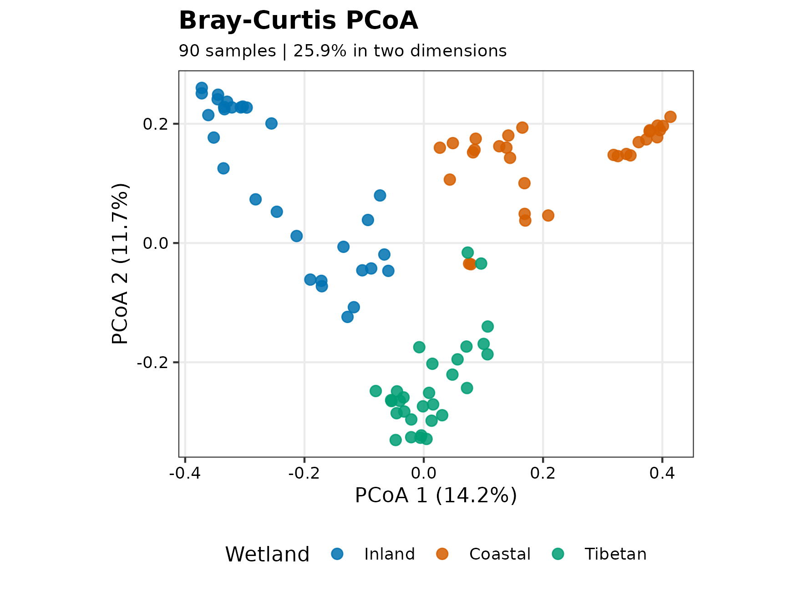
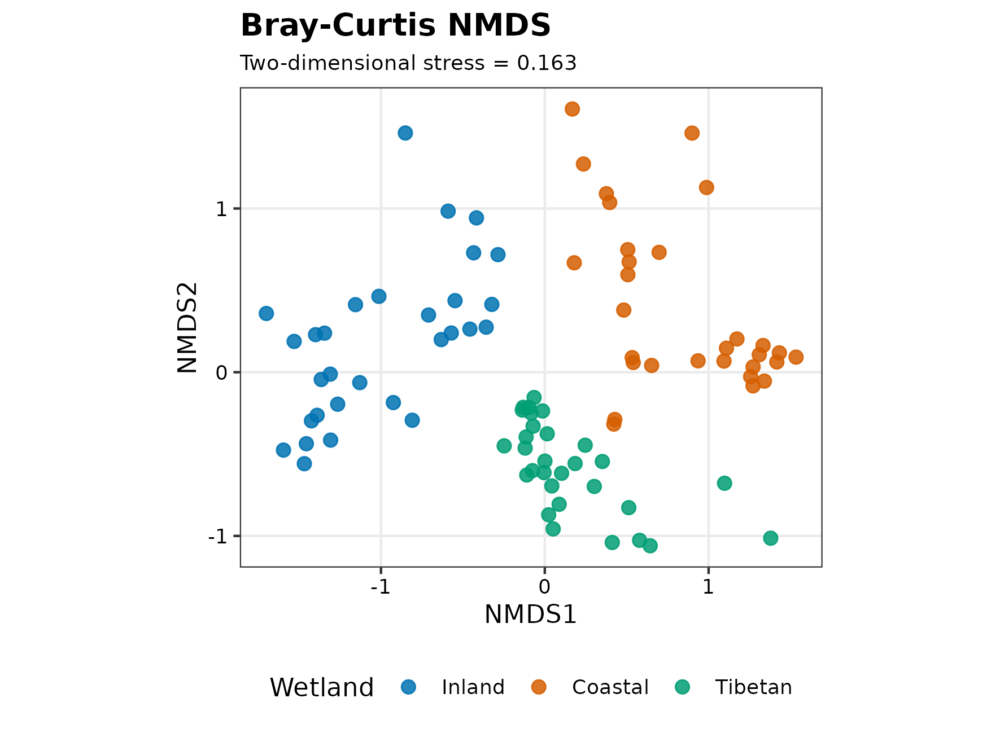
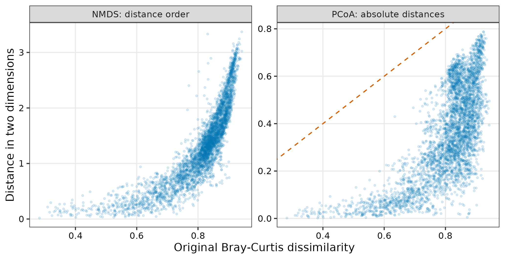
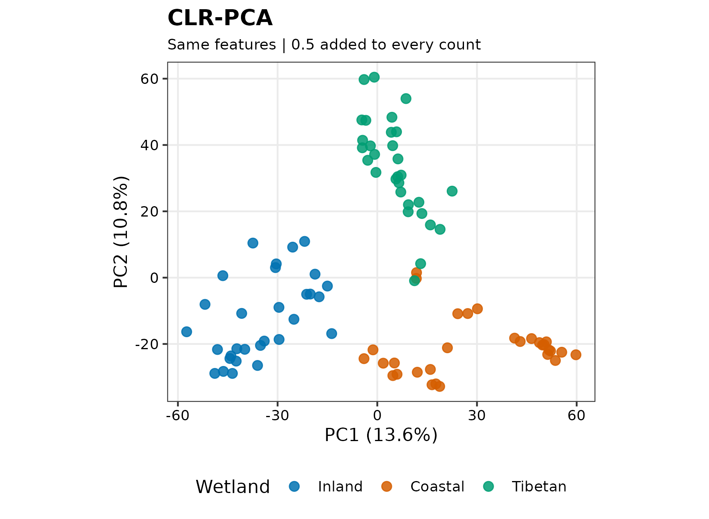

## 一张二维图能说明多少群落差异？ {#sec-target}

两个处理组在排序图上分开，是微生物组论文中很常见的结果。但同一批样本换一种距离、换一种零值处理，甚至只看另外两个坐标轴，就可能呈现不同的结构。问题不是“哪张图最好看”，而是：**我们希望保留哪一种群落差异，这张二维图又保留了多少？**

非约束排序不使用分组标签来寻找坐标。PCoA、NMDS 和 PCA 都属于这一类方法，却不在优化同一个目标。下面用中国湿地的 90 个土壤样本，比较三种表示，并把图形诊断和研究设计放在一起解释。

::: {.callout-important title="先确定距离，再判断图是否可信"}
- 若关心优势类群的相对组成差异，可从相对丰度的 Bray–Curtis 距离和 PCoA 起步；若关心类群之间的比例关系，应另行考虑对数比表示。
- PCoA 的轴比例、NMDS 的 stress 和原始距离与二维距离的一致程度，回答不同的拟合问题，不能相互替代。
- 比较方法时先保持样本和特征集合一致，再单独改变过滤或零处理；否则不知道差异来自哪里。
- 排序图、PERMANOVA 和离散度检验都不能消除混杂。缺少采样层级信息时，可以描述图形，不能据此确认独立重复或因果效应。
:::

## 读取 90 个湿地样本，先看分组意味着什么 {#sec-setup}

数据来自 An 等人的中国湿地研究，由 `microeco` 分发为 OTU 表、分类表和样本信息表。样本包括内陆湿地（IW）、沿海湿地（CW）和青藏高原湿地（TW），各 30 个。数据出处见[原始研究](https://doi.org/10.1016/j.geoderma.2018.09.035)和 [`microeco` 论文](https://doi.org/10.1093/femsec/fiaa255)。

<details class="wechat-omit">
<summary>安装依赖和定义绘图函数</summary>

首次使用时安装依赖。示例以 R 4.4.1、vegan 2.6-6.1 验证；升级软件后，尤其应重新检查随机排序的收敛和 stress。

```{r}
#| eval: false
install.packages(c("vegan", "ggplot2", "scales", "knitr"))
```

```{r}
#| label: reader-plot-helpers
pal_pub <- c("#0072B2", "#D55E00", "#009E73")
scale_color_pub <- function(...) ggplot2::scale_color_manual(values = pal_pub, ...)
scale_fill_pub <- function(...) ggplot2::scale_fill_manual(values = pal_pub, ...)
theme_pub <- function(base_size = 11) {
  ggplot2::theme_bw(base_size = base_size) +
    ggplot2::theme(
      panel.grid.minor = ggplot2::element_blank(),
      legend.position = "bottom",
      axis.text = ggplot2::element_text(colour = "black"),
      plot.title = ggplot2::element_text(face = "bold"),
      plot.subtitle = ggplot2::element_text(size = 9)
    )
}
save_pub <- function(plot, file_base, width = 150, height = 110) {
  dir.create(dirname(file_base), recursive = TRUE, showWarnings = FALSE)
  for (extension in c("pdf", "png", "tiff")) {
    extra <- switch(extension,
      pdf = list(device = grDevices::cairo_pdf),
      png = list(dpi = 300),
      tiff = list(dpi = 300, compression = "lzw"))
    do.call(ggplot2::ggsave, c(list(
      filename = paste0(file_base, ".", extension), plot = plot,
      width = width, height = height, units = "mm", bg = "white"
    ), extra))
  }
  invisible(plot)
}
```

</details>

在新建文件夹中下载三张表。OTU 表的行是特征、列是样本；另外两张表分别通过特征 ID 和样本 ID 与它对齐。

```{r}
#| label: reader-download
#| results: hide
options(timeout = 600)
data_url <- "https://raw.githubusercontent.com/petemeng/microbiome-best-practices/3cb6a817e0c73ab7ecbec1cedc1ad80cbb9ecfaa/"
input_files <- paste0("data/small/", c("otutab.tsv", "taxonomy.tsv", "metadata.tsv"))
for (path in input_files) {
  dir.create(dirname(path), recursive = TRUE, showWarnings = FALSE)
  if (!file.exists(path)) download.file(paste0(data_url, path), path, mode = "wb", quiet = TRUE)
}
```

```{r}
#| label: reader-inputs
library(vegan)
library(ggplot2)
otutab <- as.matrix(read.delim("data/small/otutab.tsv", row.names = 1, check.names = FALSE))
taxonomy <- read.delim("data/small/taxonomy.tsv", row.names = 1, check.names = FALSE)
metadata <- read.delim("data/small/metadata.tsv", row.names = 1, check.names = FALSE)
storage.mode(otutab) <- "numeric"
stopifnot(
  !anyDuplicated(rownames(otutab)), !anyDuplicated(colnames(otutab)),
  identical(rownames(otutab), rownames(taxonomy)),
  identical(colnames(otutab), rownames(metadata)),
  all(is.finite(otutab)), all(otutab >= 0), all(colSums(otutab) > 0)
)
otutab[1:5, 1:5]
head(taxonomy, 3)
head(metadata, 3)
metadata$Group <- factor(metadata$Group, levels = c("IW", "CW", "TW"),
                         labels = c("Inland", "Coastal", "Tibetan"))
metadata$Saline <- factor(metadata$Saline)
stopifnot(!anyNA(metadata$Group), !anyNA(metadata$Saline))
```

```{r}
#| label: reader-design-table
knitr::kable(table(metadata$Group, metadata$Saline),
             caption = "湿地分组与盐度标签的交叉计数")
design <- model.matrix(~ Group + Saline, metadata)
c(design_columns = ncol(design), design_rank = qr(design)$rank)
```

内陆组全部标为非盐土，沿海和青藏高原组全部标为盐土。这里没有“同一种湿地类型中的盐土与非盐土”对照：`Group + Saline` 的设计矩阵不满秩，**盐度效应不能与湿地分组效应分别识别**。把颜色由三组改为两组不会增加这部分信息。

表里也没有足够的站点、区组或重复采样信息来核实样本是否可自由交换。后面的自由置换结果因此是一个有条件的计算示例，而不是盐度影响群落的独立证据。

[完整 R 脚本](https://github.com/petemeng/microbiome-best-practices/blob/a2c2b95e3087dc45559d34789adddfedbfd30e6a/examples/22-ordination-unconstrained.R)包含数据下载、各项诊断和图形导出。

## 距离决定“不同”是什么意思 {#sec-theory}

对样本内相对丰度向量 pᵢ、pⱼ，Bray–Curtis 距离为

> dᵢⱼ = Σₖ|pᵢₖ − pⱼₖ| / Σₖ(pᵢₖ + pⱼₖ) = ½ Σₖ|pᵢₖ − pⱼₖ|。

它比较相对丰度差的总量，因此丰度较高的类群通常贡献更大。共同未检出的类群不会增加距离。将 counts 转成相对丰度可避免总 reads 数直接决定这个距离，但**不能补回浅测序漏掉的类群，也不等于控制了深度对检出率的影响**。

PCoA 和 NMDS 都可使用这一个距离矩阵；CLR-PCA 则改问“类群之间的比例有多不同”。先作如下区分，后面才知道哪些比较属于算法诊断，哪些已经改变了科学问题。

| 表示 | 优先保留什么 | 二维表示看什么 | 不能从中读出什么 |
|---|---|---|---|
| Bray–Curtis PCoA | 给定距离的欧氏坐标近似 | 特征值、轴比例、二维距离误差 | 因果效应、单个类群的显著性 |
| Bray–Curtis NMDS | 给定距离的大小顺序 | stress、重复起点、Shepard 图 | 每根轴的解释方差 |
| CLR-PCA | 零处理后的对数比欧氏几何 | PCA 轴比例、零处理和过滤敏感性 | 未测量的绝对菌量变化 |

本例先保留至少 5% 样本检出的 OTU，即至少 5 个样本。这个阈值不是通用最优值；它定义了分析的特征范围，稍后再单独比较 20% 阈值。

```{r}
#| label: reader-distance
min_prevalence <- 0.05
keep_feature <- rowSums(otutab > 0) >= ceiling(min_prevalence * ncol(otutab))
comm <- t(otutab[keep_feature, , drop = FALSE])
comm_rel <- sweep(comm, 1, rowSums(comm), "/")
stopifnot(identical(rownames(comm), rownames(metadata)),
          all(abs(rowSums(comm_rel) - 1) < 1e-10))
dist_bray <- vegan::vegdist(comm_rel, method = "bray")
c(samples = nrow(comm), retained_features = ncol(comm), original_features = nrow(otutab))
```

保留了 `r format(ncol(comm), big.mark = ",")` / `r format(nrow(otutab), big.mark = ",")` 个 OTU。三种主表示均使用这批特征和相同的 90 个样本。

## PCoA：先检查几何，再看前两根轴 {#sec-code}

PCoA 把距离转成坐标。对欧氏距离，它相当于对双中心化矩阵 `B = −½ J D^(2) J` 作特征分解，其中 `D^(2)` 表示距离矩阵逐元素平方，`J = I − 11ᵀ/n` 为中心化矩阵。正特征值给出可放到欧氏空间中的方向；实质性的负特征值说明该距离不能被普通欧氏坐标精确表示。它们不是“负的生物学方差”。

Bray–Curtis **可能**产生负特征值，不是必然产生。应先检查，而不是默认给所有结果贴上某种校正名称。

```{r}
#| label: reader-pcoa
pcoa_raw <- stats::cmdscale(dist_bray, k = 2, eig = TRUE, add = FALSE)
eigen_tolerance <- max(abs(pcoa_raw$eig)) * 1e-8
negative_eigenvalues <- pcoa_raw$eig[pcoa_raw$eig < -eigen_tolerance]
negative_mass_ratio <- sum(abs(negative_eigenvalues)) /
  sum(pcoa_raw$eig[pcoa_raw$eig > eigen_tolerance])
needs_correction <- length(negative_eigenvalues) > 0L
pcoa_fit <- if (needs_correction) {
  stats::cmdscale(dist_bray, k = 2, eig = TRUE, add = TRUE)
} else pcoa_raw
correction_name <- if (needs_correction) "Cailliez" else "None"
correction_constant <- if (needs_correction) pcoa_fit$ac else 0
pcoa_variance <- 100 * pcoa_fit$eig[1:2] / sum(pcoa_fit$eig[pcoa_fit$eig > eigen_tolerance])
pcoa_diagnostic <- data.frame(
  NegativeEigenvalues = length(negative_eigenvalues),
  NegativeToPositiveMass = negative_mass_ratio,
  Correction = correction_name, Constant = correction_constant,
  Axis1Percent = pcoa_variance[1], Axis2Percent = pcoa_variance[2]
)
knitr::kable(pcoa_diagnostic, digits = 4)
```

这批数据在上述数值容差下没有实质性负特征值，因此没有进行加常数校正。前两轴分别保留 `r sprintf("%.2f", pcoa_variance[1])`% 和 `r sprintf("%.2f", pcoa_variance[2])`% 的正特征值总量，合计只有 `r sprintf("%.2f", sum(pcoa_variance))`%。图能概括主要梯度，但大部分距离结构仍在更高维中；**二维图上相邻不保证原始群落很相似**。

<details>
<summary>出现负特征值时，Cailliez 与 Lingoes 有什么不同？</summary>

Cailliez 给非对角距离加常数：`d′ = d + c`；Lingoes 给平方距离加常数再开方：`d′ = √(d² + 2c)`。两者都保持对角线为零，却不产生相同的几何。

`stats::cmdscale(add = TRUE)` 使用 **Cailliez**；`vegan::wcmdscale(add = "lingoes")` 才显式指定 Lingoes。不同函数的 `add = TRUE` 不能混为一谈，详见 [R 的 cmdscale 文档](https://stat.ethz.ch/R-manual/R-devel/library/stats/html/cmdscale.html)和 [vegan 的 wcmdscale 文档](https://vegandevs.github.io/vegan/reference/wcmdscale.html)。

`1e-8 × 最大绝对特征值` 是这里区分数值误差的容差，不是允许生物学失真的阈值。若需校正，应报告负特征值规模、校正方法与常数，并比较前后距离结构。校正后的轴比例属于**校正后的距离**；不能把它与未校正结果的解释率直接比较。

</details>

```{r}
#| label: reader-pcoa-plot
pcoa_df <- data.frame(pcoa_fit$points, Group = metadata$Group)
names(pcoa_df)[1:2] <- c("Axis1", "Axis2")
p_pcoa <- ggplot(pcoa_df, aes(Axis1, Axis2, colour = Group)) +
  geom_point(size = 2.4, alpha = 0.85) + scale_color_pub(name = "Wetland") +
  coord_equal() + theme_pub() +
  labs(title = "Bray-Curtis PCoA",
       subtitle = sprintf("90 samples | %.1f%% in two dimensions", sum(pcoa_variance)),
       x = sprintf("PCoA 1 (%.1f%%)", pcoa_variance[1]),
       y = sprintf("PCoA 2 (%.1f%%)", pcoa_variance[2]))
save_pub(p_pcoa, "figures/22-pcoa-bray")
```

{#fig-pcoa}

## NMDS：多跑几个起点，是否就能相信二维图？

NMDS 不要求二维点距等于原始 Bray–Curtis 距离，而是寻找一种单调关系，让“较远的样本对仍较远”。因此它可能更适合保留非线性的距离顺序，但需要迭代优化，也可能停在局部解。

固定随机种子是复现要求，不是收敛证据。下面分别求二维与三维解；`metaMDS` 从多个初始位置搜索，并用相似解的重复出现判断稳定性。我们直接传入已算好的距离，关闭自动转换，避免软件再改变丰度尺度。

```{r}
#| label: reader-nmds
set.seed(20260718)
nmds_fit <- vegan::metaMDS(dist_bray, k = 2, trymax = 200,
                          autotransform = FALSE, trace = FALSE)
set.seed(20260718)
nmds_3d <- vegan::metaMDS(dist_bray, k = 3, trymax = 200,
                         autotransform = FALSE, trace = FALSE)
nmds_diagnostic <- data.frame(
  Dimensions = c(2L, 3L), Stress = c(nmds_fit$stress, nmds_3d$stress),
  RandomStarts = c(nmds_fit$tries, nmds_3d$tries),
  RepeatedBestSolutions = c(nmds_fit$converged, nmds_3d$converged)
)
knitr::kable(nmds_diagnostic, digits = 4)
nmds_sites <- vegan::scores(nmds_fit, display = "sites")
stopifnot(identical(rownames(nmds_sites), rownames(comm)))
nmds_df <- data.frame(nmds_sites, Group = metadata$Group)
p_nmds <- ggplot(nmds_df, aes(NMDS1, NMDS2, colour = Group)) +
  geom_point(size = 2.4, alpha = 0.85) + scale_color_pub(name = "Wetland") +
  coord_equal() + theme_pub() +
  labs(title = "Bray-Curtis NMDS",
       subtitle = sprintf("Two-dimensional stress = %.3f", nmds_fit$stress),
       x = "NMDS1", y = "NMDS2")
save_pub(p_nmds, "figures/22-nmds-bray")
```

{#fig-nmds}

二维 stress 为 `r sprintf("%.3f", nmds_fit$stress)`，三维为 `r sprintf("%.3f", nmds_3d$stress)`。增加维数能降低拟合负担，却不能自动证明存在三个生物学过程。`RepeatedBestSolutions` 表示搜索中重复得到相似最优解的次数，不是成功概率；若为零，不能把“程序正常结束”写成“解已稳定”。

stress 的可接受程度依赖样本量、结构和维数。不要用一个固定分界线代替诊断，也不能把 `1 - stress` 当成解释方差。参数含义和搜索策略见 [metaMDS 文档](https://vegandevs.github.io/vegan/reference/metaMDS.html)。

### 检查哪些样本关系在投影中丢失了 {#sec-visualization}

下面每个点是一对样本。PCoA 面板将原始距离与二维欧氏距离直接比较；本例没有校正，斜线表示完全保留距离。NMDS 面板关注单调趋势，不要求落在斜线上。离趋势很远的样本对，才是需要返回原数据检查的关系。

```{r}
#| label: reader-distance-fit
distance_fit <- rbind(
  data.frame(Method = "PCoA: absolute distances", Original = as.vector(dist_bray),
             Projected = as.vector(dist(pcoa_fit$points))),
  data.frame(Method = "NMDS: distance order", Original = as.vector(dist_bray),
             Projected = as.vector(dist(nmds_sites)))
)
p_distance <- ggplot(distance_fit, aes(Original, Projected)) +
  geom_point(size = 0.65, alpha = 0.13, colour = "#0072B2") +
  facet_wrap(~ Method, scales = "free_y", nrow = 1) + theme_pub() +
  labs(x = "Original Bray-Curtis dissimilarity", y = "Distance in two dimensions")
if (!needs_correction) p_distance <- p_distance + geom_abline(
  data = data.frame(Method = "PCoA: absolute distances", Slope = 1, Intercept = 0),
  aes(slope = Slope, intercept = Intercept), linetype = 2, colour = "#D55E00")
if (!needs_correction) stopifnot(
  length(unique(ggplot_build(p_distance)$data[[2]]$PANEL)) == 1L)
save_pub(p_distance, "figures/22-distance-fit", width = 175, height = 90)
fit_rank_cor <- c(
  PCoA = cor(as.vector(dist_bray), as.vector(dist(pcoa_fit$points)), method = "spearman"),
  NMDS = cor(as.vector(dist_bray), as.vector(dist(nmds_sites)), method = "spearman"))
round(fit_rank_cor, 3)
```

{#fig-distance-fit}

二维距离与原始距离的 Spearman 相关分别为 `r sprintf("%.3f", fit_rank_cor["PCoA"])`（PCoA）和 `r sprintf("%.3f", fit_rank_cor["NMDS"])`（NMDS）。这是描述性一致程度，不是检验：同一个样本参与多个样本对，不能把 4,005 个距离当成 4,005 个独立观察值来计算普通相关检验的 P 值。更高的相关也不意味着该图更能证明组间差异。

## CLR-PCA：改变的不只是算法，还有比较对象

对一个严格为正的样本组成向量 p，CLR 定义为 `clr(pₖ) = log(pₖ) − mean(log(p))`，也就是每个类群相对于该样本所有保留类群几何均值的对数比。CLR 空间中的欧氏距离是 Aitchison 距离。PCA 再把这个高维空间投影到少数坐标轴。

与 Bray–Curtis 相比，对数比强调倍数关系：低丰度类群的变化也可能获得很大权重。因此结果不同不必然是哪种方法“错了”。还要注意三件事：零值不能直接取对数；过滤改变几何均值的参考集合；按特征再做 Z-score 会改变 Aitchison 几何，所以这里不做单位方差缩放。

为观察零处理的影响，下面对**所有计数加 0.5 read**。它不是“只把零替换为 0.5”，也不是对原始组成的无偏恢复。相同计数偏移对浅测序样本影响更大，后面必须比较其他取值。

```{r}
#| label: reader-clr
clr_transform <- function(counts, pseudocount) {
  log_counts <- log(counts + pseudocount)
  log_counts - rowMeans(log_counts)
}
clr_matrix <- clr_transform(comm, pseudocount = 0.5)
stopifnot(max(abs(rowSums(clr_matrix))) < 1e-7)
clr_pca_fit <- prcomp(clr_matrix, center = TRUE, scale. = FALSE, rank. = 2)
clr_variance <- 100 * clr_pca_fit$sdev[1:2]^2 / sum(clr_pca_fit$sdev^2)
clr_df <- data.frame(clr_pca_fit$x[, 1:2], Group = metadata$Group)
p_clr <- ggplot(clr_df, aes(PC1, PC2, colour = Group)) +
  geom_point(size = 2.4, alpha = 0.85) + scale_color_pub(name = "Wetland") +
  coord_equal() + theme_pub() +
  labs(title = "CLR-PCA", subtitle = "Same features | 0.5 added to every count",
       x = sprintf("PC1 (%.1f%%)", clr_variance[1]),
       y = sprintf("PC2 (%.1f%%)", clr_variance[2]))
save_pub(p_clr, "figures/22-clr-pca")
```

{#fig-clr}

### 一次只改变一个分析选择

先固定 5% 过滤，比较 0.1、0.5、1 read 的偏移；再固定偏移，改变过滤。距离相关不受坐标轴旋转或翻转影响，适合先判断整体关系是否明显改变。

```{r}
#| label: reader-sensitivity
keep_20 <- rowSums(otutab > 0) >= ceiling(0.20 * ncol(otutab))
comm_20 <- t(otutab[keep_20, , drop = FALSE])
dist_clr <- dist(clr_matrix)
rank_agreement <- function(a, b) cor(as.vector(a), as.vector(b), method = "spearman")
sensitivity <- data.frame(
  Comparison = c("CLR 0.1 vs 0.5; prevalence 5%", "CLR 1 vs 0.5; prevalence 5%",
                 "CLR prevalence 20% vs 5%; offset 0.5", "Bray prevalence 20% vs 5%",
                 "CLR 0.5 vs Bray; prevalence 5%"),
  Features = c(ncol(comm), ncol(comm), ncol(comm_20), ncol(comm_20), ncol(comm)),
  DistanceSpearman = c(
    rank_agreement(dist(clr_transform(comm, 0.1)), dist_clr),
    rank_agreement(dist(clr_transform(comm, 1)), dist_clr),
    rank_agreement(dist(clr_transform(comm_20, 0.5)), dist_clr),
    rank_agreement(vegdist(comm_20 / rowSums(comm_20), "bray"), dist_bray),
    rank_agreement(dist_clr, dist_bray))
)
knitr::kable(sensitivity, digits = 4)
```

前四行回答“一个参数改变后，同一类距离是否稳定”，最后一行才比较不同几何。即使整体相关很高，某些样本的局部邻居仍可能改变；若结论依赖某个小群体，应继续检查该群体的近邻、异常值和原始丰度，不能只凭一个整体相关系数宣布稳健。

若零很多、偏移选择明显影响结论，应重新考虑检测过程、过滤的科学依据，以及乘法零替代或 robust Aitchison 表示的适用假设；这些方法也不是自动消除稀疏偏差的按钮。[对数比与距离的进一步比较](21-beta-distances.qmd)可帮助确定问题对应的几何。

## 图上分离、组间关联与盐度解释是三回事

PERMANOVA 使用完整距离矩阵，而不是图上的两个坐标。它比较分组对应的距离变异，结果可能受组中心和组内离散程度影响；`betadisper` 则检验样本到组内空间中心的距离是否不同。二者应一起解释，但离散度检验不显著不能证明离散度相同。

下面保留两种分组的结果，避免根据哪一种分组的 P 值更“理想”来挑选主图。每次使用同样的 999 次自由置换，仅用于展示**在样本可交换假设成立时**会得到什么。真实采样若有地点、受试者或区组层级，需据此重新设计置换。

```{r}
#| label: reader-permutation
test_one_group <- function(group, label) {
  model_data <- data.frame(group = group, row.names = rownames(metadata))
  set.seed(20260718)
  fit <- vegan::adonis2(dist_bray ~ group, data = model_data, permutations = 999)
  dispersion <- vegan::betadisper(dist_bray, group = group,
                                  type = "median", bias.adjust = TRUE)
  set.seed(20260718)
  test <- vegan::permutest(dispersion, permutations = 999)
  data.frame(Grouping = label, R2 = fit$R2[1], PERMANOVA_P = fit$`Pr(>F)`[1],
             Dispersion_P = test$tab$`Pr(>F)`[1])
}
group_tests <- rbind(test_one_group(metadata$Group, "Wetland group"),
                     test_one_group(metadata$Saline, "Soil salinity"))
knitr::kable(group_tests, digits = 3)
```

三类湿地的离散度检验也显著，所以不能把 PERMANOVA 信号全部解释为组中心移动。盐土与非盐土的离散度检验未显著，也不能解决开头展示的分组混杂，更不能证明没有离散度差异。这两个探索性分组检验不是两次独立验证。

一个与数据相符的表述是：“在所用相对组成距离下，样本呈现与湿地分组相关的结构；二维表示仅保留部分距离信息。盐度标签与湿地分组混杂，且交换性需结合原始采样设计核实，因此本分析不估计独立盐度效应。”

::: {.callout-caution title="限制置换不等于机械添加 strata"}
如果处理在站点之间分配，站点内所有样本的处理相同，简单设置 `strata = SiteID` 可能根本无法检验该处理效应。应先确定随机化和独立重复的单位，再决定整组置换、组内置换或分层模型。缺少这些信息时，应限制结论，而不是让软件替研究设计作决定。详见 [PERMANOVA 与置换设计](23-permanova-dispersion.qmd)。
:::

## 哪些诊断会让我们改变方案？ {#sec-pitfalls}

| 观察到的情况 | 首先检查 | 合理的下一步 |
|---|---|---|
| PCoA 前两轴比例低，二维距离严重压缩 | 更高轴、异常样本、距离是否匹配问题 | 增加维度展示；组间推断仍基于完整距离 |
| 负特征值不能忽略 | 负值规模、数值误差、距离定义 | 显式选择校正并报告影响，而非静默丢弃 |
| NMDS 最优解未重复出现 | 起点次数、stress、维数 | 增加搜索并检查更高维；仍不稳定则如实报告 |
| CLR 对偏移或过滤敏感 | 零值分布、测序深度、参考集合 | 重新评估零处理及检测假设，不挑选分离最好的一版 |
| 组间离散度不同 | 组样本量、异常值、分布形状 | 联合描述位置与分散程度，避免单一中心效应解释 |
| 分组与批次、地点或盐度重合 | 设计矩阵秩、组内是否有可比较样本 | 改变目标或补充设计；任何排序都不能拆开完全混杂 |

椭圆也不是显著性边界。`stat_ellipse()` 的分布椭圆不等于组均值的置信区间；椭圆重叠与否都不能替代上述检验。图形报告优先保留样本点、距离名称、轴比例或 stress，以及足够清楚的分组说明。

## 报告实际使用的几何与推断边界 {#sec-methods}

> OTUs detected in at least 5% of 90 wetland samples were retained (`r ncol(comm)` OTUs). Bray–Curtis dissimilarities were calculated after sample-wise relative-abundance normalization. No substantive negative eigenvalues were detected using a tolerance of 10⁻⁸ times the largest absolute eigenvalue, and no additive correction was applied. The first two PCoA axes represented `r sprintf("%.2f", sum(pcoa_variance))`% of the positive eigenvalue sum. NMDS was fitted with multiple starts in two and three dimensions (stress `r sprintf("%.3f", nmds_fit$stress)` and `r sprintf("%.3f", nmds_3d$stress)`, respectively). CLR-PCA used the same OTUs, added 0.5 to every count, and did not scale features to unit variance. Offsets of 0.1 and 1 and a 20% prevalence filter were examined separately. PERMANOVA and median-based, bias-adjusted dispersion tests used 999 unrestricted permutations as conditional demonstrations of exchangeability. Sampling-unit independence was not established by the available metadata. Salinity was confounded with wetland group, precluding a separately identifiable salinity effect. Stochastic steps used seed 20260718.

这段描述对应的是当前数据。更换输入后，必须重新填写负特征值、是否校正、维数、过滤和置换设计；尤其不能把“没有区组信息”写成“样本没有区组”。

## 用于新研究时，先固定比较对象 {#sec-own-data}

替换 `otutab`、`taxonomy`、`metadata` 的路径，按 ID 检查方向和顺序；把 `Group` 改成真实分组，并保留采样站点、受试者和批次列。随后先回答：是比较相对组成、检出结构、系统发育组成还是类群比例？只有确定了这一点，才选择 Bray–Curtis、Jaccard、UniFrac 或 Aitchison。UniFrac 还需要与特征 ID 一致的系统发育树。

先固定样本与特征集合运行主分析，再分别改变距离、过滤和零处理。报告一个有理由的主方案及其限制，不把全部备选方案里分离最明显的一张作为主结果。

```{r}
#| label: reader-export-diagnostics
#| results: hide
dir.create("results/22-ordination", recursive = TRUE, showWarnings = FALSE)
for (name in c("pcoa_diagnostic", "nmds_diagnostic", "sensitivity", "group_tests")) {
  write.table(get(name), paste0("results/22-ordination/", name, ".tsv"),
              sep = "\t", quote = FALSE, row.names = FALSE)
}
```

## 参考 {#sec-references}

- An J, Liu C, Wang Q, et al. Soil bacterial community structure in Chinese wetlands. *Geoderma*. 2019;337:290–299. [原始研究](https://doi.org/10.1016/j.geoderma.2018.09.035)。
- Liu C, Cui Y, Li X, Yao M. microeco: an R package for data mining in microbial community ecology. *FEMS Microbiology Ecology*. 2021;97:fiaa255. [软件与数据](https://doi.org/10.1093/femsec/fiaa255)。
- Gower JC. Some distance properties of latent root and vector methods used in multivariate analysis. *Biometrika*. 1966;53:325–338. [方法论文](https://doi.org/10.1093/biomet/53.3-4.325)。
- Anderson MJ. A new method for non-parametric multivariate analysis of variance. *Austral Ecology*. 2001;26:32–46. [PERMANOVA](https://doi.org/10.1111/j.1442-9993.2001.01070.pp.x)。
- Anderson MJ. Distance-based tests for homogeneity of multivariate dispersions. *Biometrics*. 2006;62:245–253. [离散度检验](https://doi.org/10.1111/j.1541-0420.2005.00440.x)。
- R Core Team. [cmdscale：经典多维标度与 Cailliez 校正](https://stat.ethz.ch/R-manual/R-devel/library/stats/html/cmdscale.html)。
- vegan development team. [wcmdscale：Lingoes 与 Cailliez](https://vegandevs.github.io/vegan/reference/wcmdscale.html)；[metaMDS：多起点 NMDS 与 stress](https://vegandevs.github.io/vegan/reference/metaMDS.html)。
