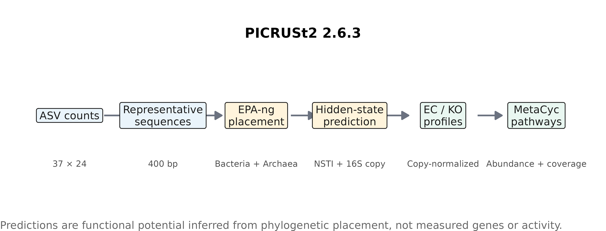
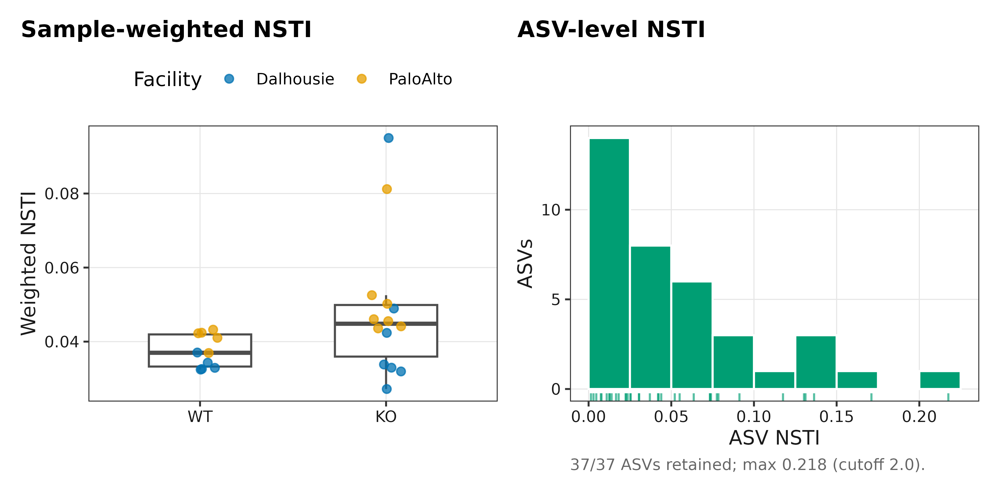
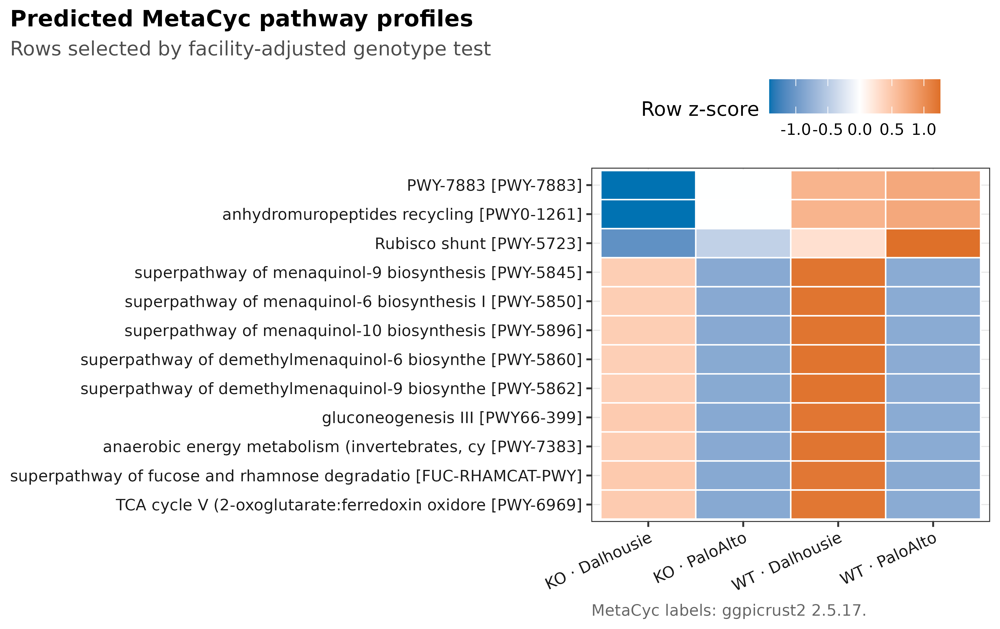
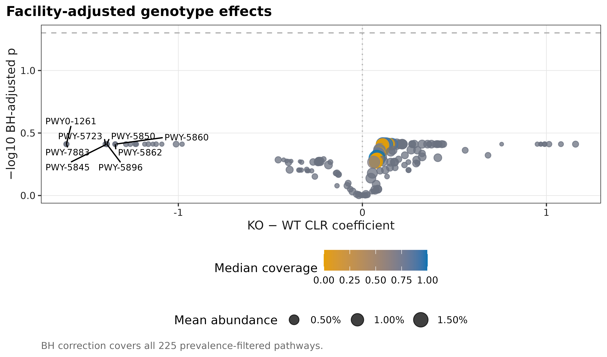

> **分析目标：**从 ASV count table 与 representative sequences 完整运行 PICRUSt2 2.6.3，得到 16S copy-normalized EC/KO 与 MetaCyc pathway abundance/coverage；用 ggpicrust2 2.5.17 注释 pathway，按 genotype 建模并调整 sequencing facility，输出 NSTI audit、热图与 effect-size 图。  
> **输入文件：**通用三件套 `data/small/picrust2-chemerin/{otutab,taxonomy,metadata}.tsv`，另需与 `otutab` 行名一致的 `representative-sequences.fasta`。  
> **预计资源：**官方 chemerin tutorial 的 37 个 ASV、24 个 mouse samples；PICRUSt2 environment 约 3.4 GB、默认 reference 约 470 MB，本次 8 线程实跑 1,213 秒；下游作图少于 1 分钟，四张图导出为 PDF/SVG/600 ppi PNG/LZW-TIFF。

## 这一步对应论文里的哪张图 {#sec-target}

[Douglas et al. (2020)](https://doi.org/10.1038/s41587-020-0548-6)系统展示 PICRUSt2 的 phylogenetic placement、hidden-state prediction 与 benchmark；[Yang et al. (2023)](https://doi.org/10.1093/bioinformatics/btad470)给出 ggpicrust2 的 differential-abundance 与 visualization workflow。这里不复制论文原图，而是对 PICRUSt2 官方 chemerin 16S tutorial 数据真实运行最新版 pipeline，重绘 workflow、NSTI、MetaCyc heatmap 与 multiplicity/coverage audit。

::: {.callout-important title="先给结论"}
PICRUSt2 输出的是由 16S phylogeny 与 reference genomes **预测的 functional potential**。通路图是否可信，至少要同时检查：ASV 与 count-table ID 契约、NSTI、被阈值剔除的 reads、16S copy normalization、pathway coverage、batch/facility adjustment 和多重检验。热图本身不能证明 pathway 基因存在，更不能证明它被表达或产生代谢通量。
:::

官方压缩包含 24 个样本、37 条 400-bp ASV sequences 和 108,718 reads；metadata 中有 `Genotype`（14 KO、10 WT）与 `Facility`（Dalhousie、PaloAlto 各 12）。官方包不分发 taxonomy，因此本章的 `taxonomy.tsv` 七个 rank 有意留空；PICRUSt2 的必需 biological input 是 representative sequences，而不是 taxonomy labels。

## 理论：从 phylogenetic neighbor 推断基因家族 {#sec-theory}

### 1. placement 先决定 sequence 位于 reference tree 的哪里

EPA-ng 将每条 study ASV 放入细菌与古菌 reference trees；pipeline 比较两个 domains 的 nearest-sequenced-taxon distance，保留更匹配的一支。此次 37/37 个 ASV 都选择 bacterial reference，archaeal branch 为 0。

### 2. hidden-state prediction 估计 marker 与 gene-family copy numbers

对放置后的叶节点，PICRUSt2 用参考基因组的 trait table 推断 16S、EC 和 KO copy numbers。样本 ASV counts 先按预测的 16S copy number归一，再与预测 gene-family copies 相乘，形成 metagenome profile。

### 3. NSTI 是 reference extrapolation 的距离审计

ASV-level NSTI 越大，study sequence 与最近已测序参考基因组的距离越远。sample-weighted NSTI 还结合该 ASV 的 normalized abundance。NSTI 不是 prediction accuracy 的直接概率，也没有跨 habitat 通用的“及格线”；应给完整分布、pipeline cutoff 和关键结果对 high-NSTI ASVs 的敏感性。

### 4. pathway abundance 与 coverage 不是同一个量

MetaCyc abundance 由预测 EC profiles 经 regrouping、MinPath 与 gap filling 得到；experimental coverage 描述 pathway reactions 的覆盖程度。高 abundance 但低/不稳定 coverage 的通路值得降级解释，而不是只按 abundance p-value 排名。

### 5. differential test 必须保留实验结构

本数据的 facility 与 genotype 并非同一变量。对每个 prevalence-filtered pathway 的 pseudocount-0.5 CLR abundance 拟合

$$
z_{ks}=\beta_{0k}+\beta_{1k}I(\mathrm{KO})+\beta_{2k}I(\mathrm{PaloAlto})+\epsilon_{ks},
$$

并对完整 pathway family 做 BH correction。热图用 `Genotype × Facility` 四列展示，避免把 facility shift 伪装成 genotype pattern。

<details>
<summary><strong>深入：为什么不能把 PICRUSt2 pathway 当 shotgun pathway</strong></summary>

strain-specific accessory genes、horizontal gene transfer、reference sampling bias 与未培养 lineages 都会破坏“phylogenetic neighbor 拥有同一 gene repertoire”的假设。16S copy-number correction 又是预测值。shotgun metagenomics 直接观察 DNA fragments，仍有 assembly/annotation bias，但证据层级不同；metatranscriptomics、proteomics 与 metabolomics 才分别更接近 expression、protein 与 biochemical output。

</details>

## 准备工作 {#sec-setup}

<details>
<summary><strong>展开：安装 PICRUSt2、R 依赖与出版级函数</strong></summary>

PICRUSt2 用独立 Conda/Mamba environment，避免与网站 R environment 混装：

```{bash}
mamba create -n picrust2-2.6.3 -c conda-forge -c bioconda \
  picrust2=2.6.3
conda activate picrust2-2.6.3
picrust2_pipeline.py --version
```

```{r}
install.packages(c(
  "ggplot2", "ggrepel", "ggpicrust2", "patchwork", "ragg", "readr",
  "scales", "svglite", "systemfonts"
))
```

整仓库使用者可改用 `source("R/theme_pub.R")`；单篇复现直接运行下面定义：

```{r}
library(ggplot2)
library(ggpicrust2)

set.seed(20260741)
font_pub <- "DejaVu Sans"
pal_pub <- c(
  blue = "#0072B2", orange = "#E69F00", green = "#009E73",
  vermillion = "#D55E00", purple = "#CC79A7", sky = "#56B4E9",
  yellow = "#F0E442", grey = "#6B7280"
)
scale_color_pub <- function(..., values = unname(pal_pub)) ggplot2::scale_color_manual(..., values = values)
scale_fill_pub <- function(..., values = unname(pal_pub)) ggplot2::scale_fill_manual(..., values = values)
theme_pub <- function(base_size = 10, base_family = font_pub) {
  ggplot2::theme_bw(base_size = base_size, base_family = base_family) +
    ggplot2::theme(
      panel.grid.minor = ggplot2::element_blank(),
      panel.grid.major = ggplot2::element_line(colour = "#E6E6E6", linewidth = 0.25),
      axis.text = ggplot2::element_text(colour = "#1A1A1A"),
      axis.title = ggplot2::element_text(colour = "#1A1A1A"),
      plot.title.position = "plot",
      plot.title = ggplot2::element_text(face = "bold", size = ggplot2::rel(1.15)),
      plot.subtitle = ggplot2::element_text(colour = "#4D4D4D"),
      plot.caption = ggplot2::element_text(colour = "#666666", hjust = 0),
      strip.background = ggplot2::element_rect(fill = "#F2F2F2", colour = "#B3B3B3"),
      strip.text = ggplot2::element_text(face = "bold"),
      legend.key = ggplot2::element_blank(), legend.position = "top"
    )
}
save_pub <- function(plot, file_base, width = 89, height = 70, units = "mm", dpi = 600) {
  dir.create(dirname(file_base), recursive = TRUE, showWarnings = FALSE)
  ggplot2::ggsave(paste0(file_base, ".pdf"), plot, width = width, height = height,
                  units = units, device = grDevices::cairo_pdf, family = font_pub, bg = "white")
  ggplot2::ggsave(paste0(file_base, ".svg"), plot, width = width, height = height,
                  units = units, device = svglite::svglite, bg = "white")
  ggplot2::ggsave(paste0(file_base, ".png"), plot, width = width, height = height,
                  units = units, dpi = dpi, device = ragg::agg_png, bg = "white")
  ggplot2::ggsave(paste0(file_base, ".tiff"), plot, width = width, height = height,
                  units = units, dpi = dpi, device = ragg::agg_tiff,
                  compression = "lzw", bg = "white")
  invisible(plot)
}
```

</details>

## 可复制代码 {#sec-code}

### 1. 下载固定数据并核对三件套/FASTA 契约

项目脚本固定官方 archive、三个后续篇目的公开数据与 SHA-256；只取本章数据时也可以按同一 URL 下载：

```{bash}
bash scripts/download_articles_41_45_data.sh
sha256sum data/raw/articles-41-45/chemerin_16S.zip
# f57abdc069b6560f0ddb739cf9a341f5679b12f4947f4db2ad5e2cab893669e9
```

```{r}
read_keyed_tsv <- function(path) {
  x <- readr::read_tsv(path, show_col_types = FALSE, progress = FALSE,
                       name_repair = "minimal", na = character())
  ids <- as.character(x[[1L]])
  stopifnot(!anyDuplicated(ids))
  out <- as.data.frame(x[-1L], check.names = FALSE)
  rownames(out) <- ids
  out
}
data_dir <- "data/small/picrust2-chemerin"
otutab_raw <- read_keyed_tsv(file.path(data_dir, "otutab.tsv"))
taxonomy <- read_keyed_tsv(file.path(data_dir, "taxonomy.tsv"))
metadata <- read_keyed_tsv(file.path(data_dir, "metadata.tsv"))
otutab <- as.matrix(data.frame(lapply(otutab_raw, as.integer), check.names = FALSE))
rownames(otutab) <- rownames(otutab_raw)

fasta_ids <- sub("^>", "", grep(
  "^>", readLines(file.path(data_dir, "representative-sequences.fasta")), value = TRUE
))
stopifnot(
  nrow(otutab) == 37L, ncol(otutab) == 24L, sum(otutab) == 108718L,
  identical(colnames(otutab), rownames(metadata)),
  setequal(rownames(otutab), fasta_ids),
  all(vapply(taxonomy, function(x) all(is.na(x) | x == ""), logical(1)))
)
head(otutab[, 1:5])
head(metadata)
```

### 2. 一次性运行 PICRUSt2 2.6.3

```{bash}
set -euo pipefail
picrust2_pipeline.py \
  --study_fasta data/small/picrust2-chemerin/representative-sequences.fasta \
  --input data/small/picrust2-chemerin/table.biom \
  --output data/small/picrust2-chemerin/picrust2-out-v2.6.3 \
  --processes 8 \
  --stratified \
  --coverage \
  --remove_intermediate \
  --verbose \
  > results/41-picrust2/picrust2-run.log 2>&1
```

这次固定运行的关键日志为：

```text
PICRUSt2 2.6.3
37 of 37 sequence ids overlap between input table and FASTA.
37 sequences were kept for bac
0 sequences were kept for arc
All ASVs were below the max NSTI cut-off of 2.0 and so all were retained.
Completed PICRUSt2 pipeline in 1213.35 seconds.
```

输出目录至少应有：`combined_marker_predicted_and_nsti.tsv.gz`、`EC_metagenome_out/`、`KO_metagenome_out/`、`pathways_out/path_abun_unstrat.tsv.gz`、`path_abun_contrib.tsv.gz` 与 `path_cov_unstrat.tsv.gz`。运行后对 22 个输出逐文件写 SHA-256，防止后续图与 pipeline output 脱节。

### 3. 读取 NSTI 与 MetaCyc abundance/coverage

```{r}
out_dir <- file.path(data_dir, "picrust2-out-v2.6.3")
nsti <- read_keyed_tsv(file.path(out_dir, "combined_marker_predicted_and_nsti.tsv.gz"))
weighted_nsti <- read_keyed_tsv(file.path(out_dir, "EC_metagenome_out", "weighted_nsti.tsv.gz"))
pathway_abundance <- as.matrix(data.frame(
  lapply(read_keyed_tsv(file.path(out_dir, "pathways_out", "path_abun_unstrat.tsv.gz")), as.numeric),
  check.names = FALSE
))
rownames(pathway_abundance) <- rownames(
  read_keyed_tsv(file.path(out_dir, "pathways_out", "path_abun_unstrat.tsv.gz"))
)
pathway_coverage <- as.matrix(data.frame(
  lapply(read_keyed_tsv(file.path(out_dir, "pathways_out", "path_cov_unstrat.tsv.gz")), as.numeric),
  check.names = FALSE
))
rownames(pathway_coverage) <- rownames(
  read_keyed_tsv(file.path(out_dir, "pathways_out", "path_cov_unstrat.tsv.gz"))
)

stopifnot(
  nrow(nsti) == 37L, all(nsti$best_domain == "bac"),
  max(as.numeric(nsti$metadata_NSTI)) < 2,
  ncol(pathway_abundance) == 24L,
  identical(colnames(pathway_abundance), rownames(metadata))
)
```

### 4. 用 ggpicrust2 的 MetaCyc reference 注释，再调整 facility

```{r}
annotation <- ggpicrust2::metacyc_reference
description <- setNames(as.character(annotation$description), annotation$id)
pathway_ids <- rownames(pathway_abundance)
pathway_description <- unname(description[pathway_ids])
pathway_description[is.na(pathway_description) | pathway_description == ""] <- pathway_ids[
  is.na(pathway_description) | pathway_description == ""
]
names(pathway_description) <- pathway_ids

prevalence <- rowMeans(pathway_abundance > 0)
keep <- prevalence >= 0.20 & rowSums(pathway_abundance) > 0
analysis_abundance <- pathway_abundance[keep, , drop = FALSE]
clr <- log(analysis_abundance + 0.5)
clr <- sweep(clr, 2L, colMeans(clr), "-")
metadata$Genotype <- factor(metadata$Genotype, levels = c("WT", "KO"))
metadata$Facility <- factor(metadata$Facility, levels = c("Dalhousie", "PaloAlto"))

test_one <- function(pathway) {
  fit <- stats::lm(clr[pathway, ] ~ metadata$Genotype + metadata$Facility)
  coefficient <- summary(fit)$coefficients["metadata$GenotypeKO", ]
  data.frame(
    Pathway = pathway,
    Description = unname(pathway_description[pathway]),
    KOminusWT = coefficient["Estimate"],
    SE = coefficient["Std. Error"],
    PValue = coefficient["Pr(>|t|)"]
  )
}
pathway_tests <- do.call(rbind, lapply(rownames(clr), test_one))
pathway_tests$AdjustedP <- stats::p.adjust(pathway_tests$PValue, "BH")
pathway_tests <- pathway_tests[order(pathway_tests$AdjustedP, -abs(pathway_tests$KOminusWT)), ]
head(pathway_tests, 12)
```

`ggpicrust2::pathway_daa()` 可快速比较多个 DAA backends，`pathway_heatmap()` 可直接生成分组热图；本数据主模型需要显式调整 `Facility`，因此统计层用上面的 covariate-aware model，注释与图形语法沿用 ggpicrust2，再通过 `theme_pub()` 锁定尺寸、字体和输出格式。

## 审计与升级 {#sec-audit}

1. **ID contract 在 placement 前检查。**FASTA headers 与 count rownames 必须一一对应；重名、空格截断或 ASV 表已过滤而 FASTA 未同步都会污染结果。
2. **NSTI 给分布和权重。**此次 ASV max NSTI 远低于 cutoff 2，但不能把低 NSTI 改写成“功能预测准确”；目标 habitat 的 reference representation 仍需讨论。
3. **不要混淆 abundance、coverage 与 contribution。**unstratified abundance 做 sample comparison；coverage 做反应完整性审计；contribution table 用于追踪哪些 ASVs 驱动预测，三者不能互换。
4. **facility 进入 model。**metadata 中有明确 sequencing facility；只做 KO/WT t-test 会忽略设计结构。更复杂设计应加入 cage/litter/batch random effects。
5. **pathway inference 参数要锁定。**placement tool、reference、max NSTI、HSP method、MinPath、gap filling、regroup map 与 database descriptions都进入 provenance。
6. **关键 pathway 做实测升级。**用 shotgun gene families、qPCR、metatranscriptome、targeted metabolite 或 enzyme assay验证，不让预测热图承担超出证据层级的结论。

::: {.callout-note title="ggpicrust2 的定位"}
ggpicrust2 解决 import、annotation、DAA comparison 与可视化的一致接口；它不会自动修复 confounding、paired design、cage effect 或 reference extrapolation。先确定合法 statistical model，再决定用哪一个绘图 wrapper。
:::

## 出版级美化 {#sec-beautify}

### 1. 从 ASV 到 pathway 的分析链

{#fig-picrust2-workflow fig-alt="PICRUSt2 workflow from ASV counts and representative sequences to EC, KO and MetaCyc predictions."}

### 2. NSTI 必须与结果图并列

{#fig-nsti-audit fig-alt="Sample-weighted NSTI by genotype and facility, plus the ASV NSTI distribution."}

### 3. facility-aware MetaCyc heatmap

{#fig-picrust2-heatmap fig-alt="Facility-aware heatmap of predicted MetaCyc pathway profiles."}

### 4. effect、FDR、abundance 与 coverage 同图审计

{#fig-picrust2-effect fig-alt="Facility-adjusted genotype effects with BH adjusted p values, abundance and pathway coverage."}

四个图基名分别为 `41-picrust2-workflow`、`41-nsti-audit`、`41-pathway-heatmap`、`41-pathway-effect`；每个同时导出 PDF、SVG、600 ppi PNG 与 LZW-TIFF。完整数值表位于 `results/41-picrust2/`。

## 常见坑 {#sec-pitfalls}

::: {.callout-caution title="审稿人最常追问的七件事"}

1. 只有 OTU/ASV table，没有 representative sequences，却声称运行了 PICRUSt2。
2. FASTA 与 table IDs 未核对，或从 taxonomy strings 伪造 sequences。
3. 不报告 PICRUSt2/reference/database versions、NSTI 与 filtered reads。
4. 把 predicted pathway 写成 measured gene、activated pathway 或 metabolite production。
5. 只按 p-value 选热图，不做完整 family 的 FDR，也不调整 facility/batch。
6. 把同一 ASV 的多个 pathway contributions 当独立 biological replicates。
7. 忽略 low coverage、MinPath/gap-fill sensitivity 与 strain-level gene variation。

:::

## 这段 Methods 怎么写 {#sec-methods}

> Functional potential was inferred from 37 ASVs and their sample counts using PICRUSt2 v2.6.3. Study sequences were placed independently into the default bacterial and archaeal reference trees with EPA-ng; all 37 ASVs selected the bacterial domain and passed the prespecified maximum NSTI of 2.0. Hidden-state prediction used the default maximum-parsimony method and seed 100. Sequence abundances were normalized by predicted 16S rRNA copy number, and EC and KO profiles were inferred. MetaCyc pathway abundance and experimental coverage were reconstructed from EC profiles using the bundled v24 structured map, EC-to-MetaCyc regrouping, MinPath, and gap filling; stratified contribution tables were retained. MetaCyc identifiers were annotated with ggpicrust2 v2.5.17. Pathways present in ≥20% of samples were CLR-transformed after adding 0.5 and modeled as a function of genotype while adjusting for sequencing facility. Benjamini–Hochberg correction covered the complete filtered pathway set. Predictions were interpreted as phylogenetically inferred functional potential and not as measured genes or metabolic activity.

## 换成你自己的数据怎么做 {#sec-own-data}

替换三件套和 FASTA 路径，并先执行四个 contract checks：

```{r}
otutab_raw <- read_keyed_tsv("your_data/otutab.tsv")
taxonomy <- read_keyed_tsv("your_data/taxonomy.tsv")
metadata <- read_keyed_tsv("your_data/metadata.tsv")
fasta <- "your_data/representative-sequences.fasta"
# 检查：feature IDs 唯一、sample IDs 对齐、FASTA IDs 完全匹配、counts 为非负整数
```

metadata 中把 `Genotype`、`Facility` 换成你的 primary exposure 与 batch/design columns。paired/repeated data 用 subject/cage random effect 或 blocked permutation；多中心数据按 center 审计。运行前锁定 PICRUSt2/reference/MetaCyc versions 与 checksum，运行后保存 NSTI、filtered fraction、coverage、contribution table、session information 和命令日志。

## 参考 {#sec-references}

- Douglas GM, Maffei VJ, Zaneveld JR, et al. PICRUSt2 for prediction of metagenome functions. *Nature Biotechnology*. 2020;38:685–688. <https://doi.org/10.1038/s41587-020-0548-6>
- Yang C, Mai J, Cao X, Burberry A, Cominelli F, Zhang L. ggpicrust2: an R package for PICRUSt2 predicted functional profile analysis and visualization. *Bioinformatics*. 2023;39:btad470. <https://doi.org/10.1093/bioinformatics/btad470>
- Ye Y, Doak TG. A parsimony approach to biological pathway reconstruction/inference for genomes and metagenomes. *PLoS Computational Biology*. 2009;5:e1000465. <https://doi.org/10.1371/journal.pcbi.1000465>
- PICRUSt2 official tutorial and chemerin dataset. <https://github.com/picrust/picrust2/wiki/PICRUSt2-Tutorial-(v2.5.0)>
