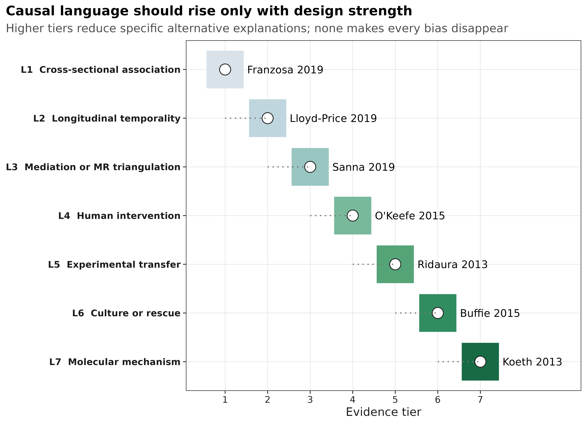
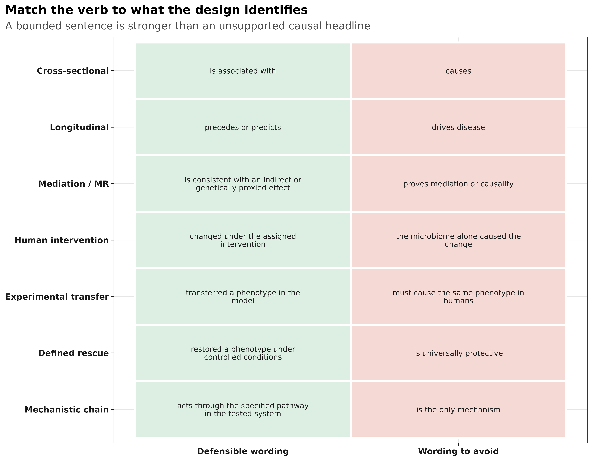
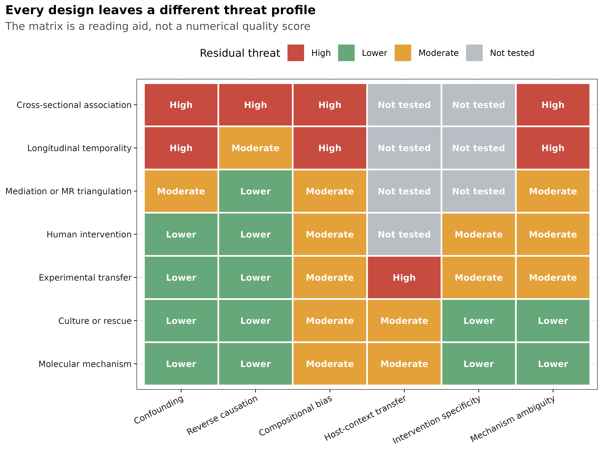
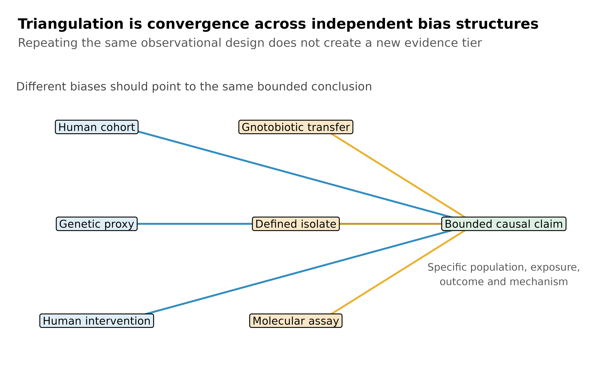

::: {.callout-important title="本章结论"}
- **横断面 16S 研究通常只能支持关联。**显著性、预测准确率或多组学一致性都不能自动排除混杂与反向因果。
- **纵向数据增加了时间顺序，却没有自动创造可交换性。**治疗变化、疾病活动和选择性失访仍可能解释结果。
- **随机干预、实验转移和定义菌救援回答的是不同问题。**它们分别加强干预效应、模型内可转移性和特定条件下的机制定位，不能互相替代。
- **最可靠的因果判断来自跨设计三角验证。**只有多个研究针对同一因果命题、且主要偏倚结构不同，证据才真正升级。
:::

## 微生物组结果什么时候可以谈因果？ {#sec-target}

微生物组论文中最需要审慎处理的，往往不是某个 P 值，而是标题、摘要和讨论里的动词。  
`associated with`、`preceded`、`changed`、`transferred`、`restored` 和 `acted through` 对研究设计的要求并不相同。

下面的证据阶梯用七项一手研究说明不同设计的**结论上限**。层级越高，能够排除的替代解释通常越多；但动物、培养和分子实验也会增加模型外推问题。因此，这不是期刊排名、论文质量分或“因果通关表”。

{fig-alt="Seven-tier microbiome causal evidence ladder" width="100%"}

::: {.callout-note title="不要给整篇论文贴一个因果等级"}
同一篇论文可能同时包含横断面关联、纵向预测和动物救援。应逐条判断主张，而不是把整篇论文简单归为 L1 或 L7。真正需要分级的是“某项证据能支持哪一句结论”。
:::

## 先确定要判断的因果命题

阅读一篇论文时，先把问题写成一句有对象、有时间范围的话。例如：“在目标人群中，与原饮食相比，两周饮食调整是否改变了结肠黏膜标志物？”这句话估计的是饮食组合的短期效应，不是某一个菌的效应，也不是多年后的癌症风险。

后面七项研究都给出了原文入口。阅读时先核对研究对象、暴露如何分配、采样先后、对照和实际结局，再看模型和 P 值；论文里的不同实验应分别判断。讨论段提出的机制假设，不能代替结果段没有测量的证据。

## 因果证据的核心是排除替代解释 {#sec-theory}

因果问题可以写成一个反事实：

> 在同一目标人群或实验系统中，如果暴露从对照水平变为处理水平，结局会怎样改变？

观察性研究无法同时看到同一个体的两个反事实，只能依靠设计、调整和假设逼近；随机分配改善了可交换性，但仍可能受到依从性、失访和干预组合的限制；动物与体外实验增强了控制，却改变了目标系统。

| 设计增加了什么 | 主要减少的威胁 | 仍然没有自动解决 |
|---|---|---|
| 重复随访 | 同一时点的反向解释、稳定个体差异 | 时间变化混杂、治疗改变、失访 |
| 遗传工具变量 | 部分环境混杂和反向因果 | 弱工具、水平多效性、分类错配、共定位 |
| 随机干预 | 已测与未测基线混杂 | 依从性、失访、盲法、组合干预归因 |
| 无菌动物转移 | 人群中难以操纵的群落暴露 | 供体选择、笼位、饮食、宿主物种外推 |
| 定义菌救援或阻断 | 复杂群落中候选因素定位 | 菌株、剂量、生态背景和模型依赖 |

### Hill 标准适合提问，不适合机械计分

Hill 提出的强度、一致性、特异性、时间性、生物梯度、合理性、连贯性、实验和类比，可以帮助发现证据缺口，但不是九项通关证书：

- 时间性是因果的必要条件，却不是充分条件；
- 强关联仍可能来自强混杂，弱关联也可能被测量误差稀释；
- 多因一果与一因多果使“特异性”经常不成立；
- 多项研究若共享同一种偏倚，数量增加也不会自动加强因果性。

<strong>充分性、必要性、介导和可迁移性不能混写</strong>

- **充分性（sufficiency）**：加入某菌或代谢物，在给定条件下可产生或恢复表型。
- **必要性（necessity）**：去除或阻断它会消除表型。
- **介导（mediation）**：暴露的一部分效应通过该中介传递，需要明确时间顺序与中介假设。
- **可迁移性（transportability）**：实验物种、队列或剂量下的效应能否推广到目标人群。

“补回后恢复”支持特定系统中的充分性；只有配合敲除、阻断或替代实验，才更接近必要性。即使机制在鼠中成立，人体临床效应仍需单独验证。

## 七项真实研究提供了哪些证据？ {#sec-setup}

下表把案例的设计、实际发现、可辩护结论和残余威胁直接并列。最后一列不是对论文的否定，而是说明下一种研究设计最需要解决什么。

| 研究与设计 | 实际证据 | 可辩护结论 | 仍不能排除 |
|---|---|---|---|
| [Franzosa 2019](https://doi.org/10.1038/s41564-018-0306-4)：IBD 病例–对照宏基因组与代谢组 | 病例与对照在微生物物种、酶和代谢物谱上存在系统差异 | IBD 与特定微生物及代谢特征相关，这些特征可用于分层或生成机制假设 | 药物、疾病活动、饮食、transit time、总生物量和反向因果 |
| [Lloyd-Price 2019](https://doi.org/10.1038/s41586-019-1237-9)：IBD 纵向多组学 | 重复采样显示微生物与宿主分子状态随疾病活动动态变化 | 部分群落变化与后续疾病状态相关，并具有受试者内时间信息 | 时间变化的治疗与疾病严重度、非随机失访和不规则采样 |
| [Sanna 2019](https://doi.org/10.1038/s41588-019-0350-x)：952 名正常血糖个体加 17 项代谢性状的遗传分析 | 微生物、短链脂肪酸和代谢性状的遗传代理效应支持若干方向性假设 | 结果与特定方向的因果关系相容，可作为独立偏倚结构的三角验证 | 弱工具、水平多效性、分类层级不匹配、样本重叠和缺少共定位 |
| [O'Keefe 2015](https://doi.org/10.1038/ncomms7342)：两周双向饮食互换 | 被分配的饮食组合引起菌群代谢、胆汁酸、短链脂肪酸和结肠黏膜标志物的相反方向变化 | 该短期饮食组合改变了所测微生物相关标志物与黏膜表型 | 组合饮食中单一成分的归因、短随访和临床癌症终点外推 |
| [Ridaura 2013](https://doi.org/10.1126/science.1241214)：肥胖不一致双胞胎菌群转移至无菌鼠 | 四对双胞胎供体的菌群在受控鼠模型中产生不同脂肪积累表型；共居救援受饮食影响 | 人源群落可在该饮食和鼠模型中转移肥胖相关表型 | 供体选择、共转移成分、笼效应、宿主物种和人体治疗效果 |
| [Buffie 2015](https://doi.org/10.1038/nature13828)：定义菌重建与感染模型 | `Clostridium scindens` 重建与次级胆汁酸通路恢复了鼠模型中的艰难梭菌定植抗性 | 该菌及相关代谢能力在指定模型中足以恢复部分定植抗性 | 菌株和剂量特异性、群落背景、病原背景以及人体疗效 |
| [Koeth 2013](https://doi.org/10.1038/nm.3145)：人体摄入、菌代谢与小鼠动脉粥样硬化实验 | L-carnitine 经肠道微生物代谢形成 TMAO；人体关联与小鼠实验共同支持该通路 | 在所测系统中，菌代谢参与 L-carnitine–TMAO–动脉粥样硬化通路 | 饮食剂量、平行通路、人群异质性以及临床干预效应 |

这七项研究不是同一个生物学问题的连续验证，因此不能把它们合并成一条“已证明”的因果链。它们的用途是展示：**当设计改变时，哪些句子开始变得可辩护，哪些句子仍然过强。**

## 不同研究设计的结论上限 {#sec-code}

### 病例–对照研究：发现关联，不负责确定方向

Franzosa 2019 的多组学一致性使 IBD 相关信号更完整，却没有改变暴露分配方式。即使微生物和代谢物同时显著，也仍可能共同响应药物或疾病活动。

**推荐写法：**“IBD was associated with…”、“features differed between…”  
**不推荐：**“the altered microbiome drove IBD”。

### 纵向研究：先后顺序增强，但不等于干预效应

Lloyd-Price 2019 提供了受试者内动态和时间信息。这比一次横断面采样更接近疾病过程，但“先出现”仍可能由治疗变化或早期未测病程共同造成。

**推荐写法：**“changes preceded…”、“predicted subsequent…”  
**不推荐：**在没有可交换性或干预时直接写 “caused”。

### 中介与 MR：提供另一种偏倚结构，而不是因果证明书

Sanna 2019 将宿主遗传、菌群、短链脂肪酸和代谢性状连接起来。MR 的价值是与常规观察研究共享更少的环境混杂；其结论仍依赖工具相关性、排除限制和独立性。

**推荐写法：**“genetically proxied exposure was consistent with…”  
**不推荐：**“MR proved that supplementation will improve the clinical outcome”。

### 人群饮食干预：识别组合干预，而不是自动定位微生物中介

O'Keefe 2015 的核心优势是饮食互换，而不是某个单独菌的随机化。饮食包含多种同步改变的成分，因此试验支持“该饮食组合改变了结局”，不能仅凭菌群随之变化就把全部效应归给某个 taxon。

控制饮食与随机分配不是同一件事。若原文没有交代随机化过程，就不应自行把研究写成随机试验。

**推荐写法：**“the assigned dietary intervention changed…”  
**不推荐：**“microbiome change alone caused…”。

### 转移、救援和机制实验：结论必须绑定模型

Ridaura 2013 支持群落在无菌鼠中的可转移性；Buffie 2015 把复杂群落效应缩小到定义菌及胆汁酸能力；Koeth 2013 进一步连接摄入、微生物代谢物和宿主表型。三者的证据逐步接近机制，但都不能省略 `in this model`、饮食、剂量和宿主背景。

{fig-alt="Claim calibration table for microbiome study designs" width="100%"}

## 为什么需要跨设计三角验证 {#sec-audit}

单一研究设计通常只消除一部分偏倚。下面的矩阵把剩余威胁并列展示：横断面研究最容易受混杂和反向因果影响；动物转移改善操纵性，却增加物种外推问题；定义菌和分子实验缩小机制范围，但可能只在特定菌株、剂量和生态背景下成立。

{fig-alt="Residual threat matrix across causal evidence tiers" width="100%"}

真正的证据升级不是把同一种病例–对照研究再做十次，而是让**针对同一命题**的不同设计收敛。例如，一项可干预假设若同时得到以下结果支持，可信度才会实质提高：

1. 人群纵向数据给出正确的时间顺序；
2. 遗传或 negative-control 分析对主要混杂不敏感；
3. 随机干预改变预设结局；
4. 动物转移或定义菌实验在受控系统中复现表型；
5. 阻断或互补实验定位必要或充分的通路；
6. 独立队列验证效应方向和适用人群。

{fig-alt="Causal triangulation across human and experimental evidence" width="100%"}

::: {.callout-tip title="最佳实践：对主张分级，而不是对论文打分"}
先写出精确命题中的 population、exposure、comparator、outcome、time 和 system，再列出每项研究实际排除了哪些替代解释。只有当不同偏倚结构指向同一命题时，才使用“triangulated evidence”；不要因为论文同时包含多种实验就默认因果链闭合。
:::

## 怎样画证据图而不夸大因果性 {#sec-publication}

证据图不应把层级画成“分数越高越真”。更稳妥的组合是：

- 用阶梯图说明不同设计可支持的最大措辞；
- 用 threat matrix 显示每种设计仍留下什么；
- 用 claim calibration 把统计结果翻译为可辩护句子；
- 用 triangulation 图强调不同偏倚结构的收敛。

图注必须说明层级不是论文质量分，高层级结论也只对指定系统成立。颜色用于区分证据类型和剩余威胁，不用红绿灯把整篇论文判成好或坏。

## 最常见的因果误判

::: {.callout-caution title="出现任意一项，都应降低结论强度"}
1. 用期刊影响因子、样本量或 P 值替代设计判断；
2. 把预测准确率当成病因证据；
3. 认为纵向数据天然排除了 time-varying confounding；
4. 认为 MR 天然随机化，忽略弱工具、多效性和共定位；
5. 把组合干预的效应全部归给某个菌；
6. 把无菌鼠中的 transferability 直接翻译成人体治疗效果；
7. 把 rescue 当作 necessity，或把“机制合理”写成“机制已证实”；
8. 只罗列支持证据，不写可能推翻主张的结果。
:::

## Methods 中怎样说明证据判定 {#sec-methods}

若论文包含因果证据综合或叙述性审查，可以使用下面的英文模板：

> We classified each claim according to the strongest design directly supporting it: cross-sectional association, longitudinal temporality, mediation or genetic triangulation, human intervention, experimental transfer, defined-organism rescue, or molecular mechanism. Classification was based on the study unit, exposure assignment, measurement timing, comparator, estimand, handling of clustering, and the alternative explanations addressed by the design; journal venue and statistical significance were not scoring criteria. For each claim, we recorded residual threats from confounding, reverse causation, compositional measurement, intervention specificity, model-system transportability, and mechanistic ambiguity. Evidence was considered triangulated only when findings converged across designs with materially different bias structures. Causal wording was bounded to the population, exposure, outcome, time frame, and experimental system actually studied.

系统综述还应报告数据库、检索式、检索日期、纳排标准、双人筛选、风险偏倚工具、预注册和证据分级规则。上面的七级框架用于校准措辞，不能冒充经过验证的量表。

## 在自己的研究中怎样选择可辩护措辞 {#sec-own-data}

先根据设计选择结论上限，再根据敏感性分析决定是否需要进一步降级：

| 你实际拥有的证据 | 首选措辞 | 只有补充什么才能升级 |
|---|---|---|
| 单时点组间差异 | associated with、differed between | 纵向时间信息与主要混杂控制 |
| 重复随访且暴露先于结局 | preceded、predicted subsequent | 更可信的可交换性或干预 |
| 有效遗传工具与多项 MR 敏感性分析 | genetically proxied、consistent with | 共定位、独立 GWAS 与其它设计验证 |
| 随机分配的组合干预 | assigned intervention changed | factorial design 或预设中介分析 |
| 人源菌群转移到动物模型 | transferred the phenotype in this model | 多供体、饮食/笼位控制和人体验证 |
| 定义菌或代谢物救援 | restored under controlled conditions | 阻断、敲除、互补和剂量–反应 |
| 完整的暴露–菌酶–代谢物–宿主通路 | acted through the tested pathway in this system | 临床终点试验与目标人群验证 |

最后检查标题、摘要、图注、结果和讨论中的因果动词是否一致。结果段若只能支持 `associated with`，讨论不能突然升级为 `drives`；动物救援成立时，应保留 `in this model`，把人体临床效应留给人体试验。

## 参考 {#sec-references}

- Hill AB. The environment and disease: association or causation? *Proceedings of the Royal Society of Medicine*. 1965;58:295–300. [doi:10.1177/003591576505800503](https://doi.org/10.1177/003591576505800503)
- Franzosa EA, et al. Gut microbiome structure and metabolic activity in inflammatory bowel disease. *Nature Microbiology*. 2019;4:293–305. [doi:10.1038/s41564-018-0306-4](https://doi.org/10.1038/s41564-018-0306-4)
- Lloyd-Price J, et al. Multi-omics of the gut microbial ecosystem in inflammatory bowel diseases. *Nature*. 2019;569:655–662. [doi:10.1038/s41586-019-1237-9](https://doi.org/10.1038/s41586-019-1237-9)
- Sanna S, et al. Causal relationships among the gut microbiome, short-chain fatty acids and metabolic diseases. *Nature Genetics*. 2019;51:600–605. [doi:10.1038/s41588-019-0350-x](https://doi.org/10.1038/s41588-019-0350-x)
- O'Keefe SJD, et al. Fat, fibre and cancer risk in African Americans and rural Africans. *Nature Communications*. 2015;6:6342. [doi:10.1038/ncomms7342](https://doi.org/10.1038/ncomms7342)
- Ridaura VK, et al. Gut microbiota from twins discordant for obesity modulate metabolism in mice. *Science*. 2013;341:1241214. [doi:10.1126/science.1241214](https://doi.org/10.1126/science.1241214)
- Buffie CG, et al. Precision microbiome reconstitution restores bile acid mediated resistance to *Clostridium difficile*. *Nature*. 2015;517:205–208. [doi:10.1038/nature13828](https://doi.org/10.1038/nature13828)
- Koeth RA, et al. Intestinal microbiota metabolism of L-carnitine, a nutrient in red meat, promotes atherosclerosis. *Nature Medicine*. 2013;19:576–585. [doi:10.1038/nm.3145](https://doi.org/10.1038/nm.3145)
