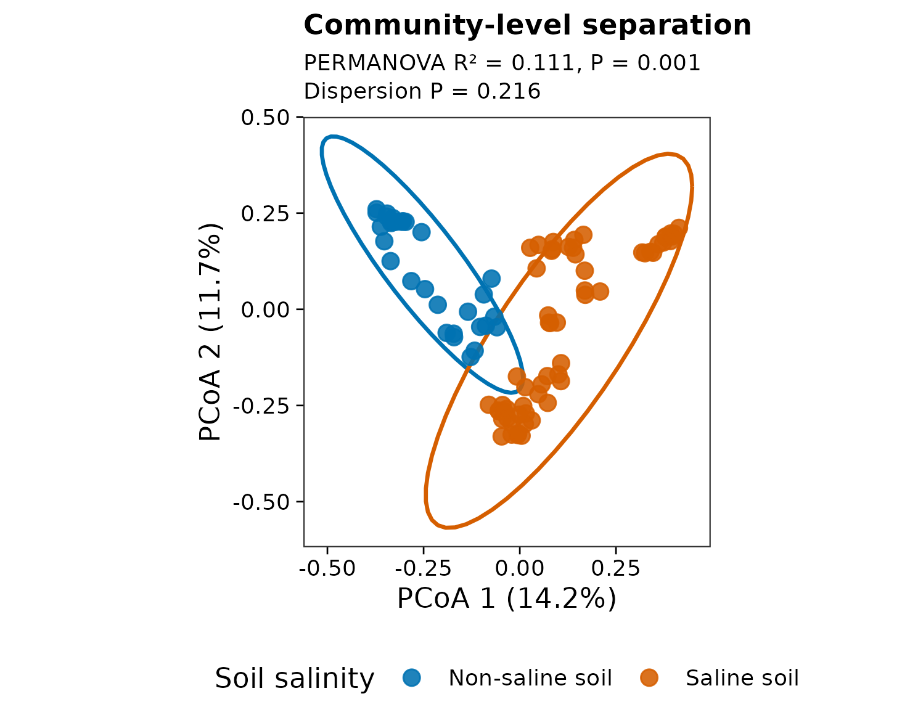
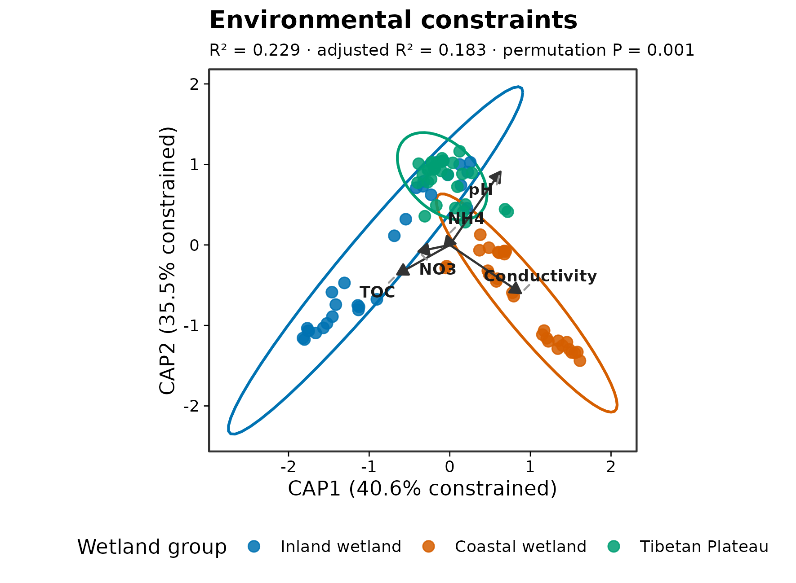

> **学习目标：**从一张“证据地图”理解 16S 研究从实验设计到因果判断的完整路径，并用真实湿地数据复现两类常见论文主图。  
> **输入文件：**`otutab.tsv`、`taxonomy.tsv`、`metadata.tsv`；环境约束分析额外使用 `environment.tsv`。  
> **预计资源：**90 个样本、13,628 个 OTU；普通笔记本约 2–5 分钟，内存低于 1 GB。

## 先看终点：一篇完整的 16S 研究需要哪些证据？ {#sec-target}

一项完整的 16S 研究通常不是“做一张菌群柱状图”，而是一条逐层收紧的证据链：

1. 先证明样本、对照和批次设计能够支持目标比较；
2. 再从原始 reads 得到可追溯的 ASV/OTU 表、分类表和系统发育树；
3. 描述群落多样性与组成；
4. 检验分组、环境或临床变量与群落的关联；
5. 在独立数据中验证预测能力；
6. 最后区分相关、时间顺序、机制和干预证据。

下面两张图来自同一套公开中国湿地 16S 数据，展示两种核心读图方式。

::: {layout-ncol=2}
{#fig-gallery-pcoa}

{#fig-gallery-cap}
:::

图 @fig-gallery-pcoa 回答“样本间整体组成是否不同”；图 @fig-gallery-cap 回答“预先指定的环境梯度与群落差异关联到什么程度”。二者都不能单独证明环境因子造成了群落变化。

本例数据来自中国内陆、沿海和青藏高原湿地调查，`microeco` 将标准化后的 OTU、taxonomy、样本信息和环境变量作为真实示例数据分发。[原始研究](https://doi.org/10.1016/j.geoderma.2018.09.035)与[`microeco` 软件论文](https://doi.org/10.1093/femsec/fiaa255)提供数据和软件出处。

::: {.callout-important title="一张漂亮图对应一个明确问题"}
组成图描述“有什么”，多样性图概括“群落有多复杂或彼此多不同”，差异分析定位“哪些类群与条件相关”，预测模型回答“能否在新样本上预测”，因果结论则需要时间顺序、干预或机制证据。图形越复杂，不代表证据等级越高。
:::

## 理论：从测序表到生物学证据 {#sec-theory}

### 1. 16S 测到的是标记基因，不是完整功能

16S rRNA 扩增子测序对特定可变区进行 PCR 扩增。它适合比较细菌和古菌群落组成，但通常不能稳定解析菌株、毒力基因、耐药基因或真实代谢活性。功能预测只能描述基于参考基因组的推断，不能替代宏基因组、转录组、代谢组或培养实验。

### 2. 测序深度不是微生物绝对数量

每个样本的 reads 总数由取样、DNA 提取、PCR、建库和测序共同决定。常规 16S 表更接近“组成比例”，某一类群相对丰度升高，可能来自它本身增加，也可能来自其他类群减少。[Gloor 等](https://doi.org/10.3389/fmicb.2017.02224)系统说明了微生物组数据的成分性；涉及绝对负荷时，需要 spike-in、流式细胞计数、总菌 qPCR/ddPCR 或其他外部定量参照。

### 3. 同一问题需要相互补充的分析

| 科学问题 | 主要结果 | 必须同时检查 |
|---|---|---|
| 单个样本内部有多丰富？ | Observed features、Shannon、Faith's PD | 测序深度、稀释覆盖、树质量 |
| 不同样本整体是否不同？ | Bray–Curtis/Jaccard/UniFrac、PCoA/NMDS | PERMANOVA、dispersion、置换设计 |
| 哪些类群发生变化？ | ANCOM-BC、ALDEx2、MaAsLin2、DESeq2 等 | 成分性、协变量、FDR、方法敏感性 |
| 环境变量解释多少差异？ | CAP/db-RDA、variation partitioning | 调整后 \(R^2\)、VIF、边际检验 |
| 能否预测疾病或表型？ | ROC/AUC、校准、特征重要性 | 嵌套交叉验证、外部验证、数据泄漏 |
| 能否说“微生物导致结局”？ | 纵向、中介、MR、干预、机制实验 | 时间顺序、混杂、多效性、可重复性 |

[Nearing 等](https://doi.org/10.1038/s41467-022-28034-z)在 38 个数据集上比较差异丰度方法，显示不同方法可能返回显著不同的结果集。因此，方法选择必须由数据结构和估计目标决定，而不是由“哪种方法显著菌更多”决定。

<details>
<summary><strong>深入：八个阶段分别交付什么</strong></summary>

1. **Study design（03–06）：**明确实验单位、主要终点、混杂因素、阴性/阳性对照、批次和采样时点。
2. **Computing setup（07–09）：**固定 QIIME 2、R、数据库和包版本，留下可重跑环境。
3. **ASV generation（10–16）：**从 FASTQ 经导入、去引物、DADA2、taxonomy 和建树，得到带 provenance 的特征表。
4. **Diversity and ordination（17–25）：**从标准三件套构建分析对象，报告 α/β 多样性、排序和环境约束。
5. **Taxa and covariates（26–34）：**描述组成、核心菌群和差异类群，并处理成分性、协变量与绝对定量边界。
6. **Networks and ecology（35–40）：**评估关联网络稳健性、群落构建过程、中性模型和距离衰减。
7. **Prediction and integration（41–50）：**功能预测、随机森林、跨队列验证、多组学、多界和来源追踪。
8. **Causal evidence（51–55）：**纵向、SEM、中介、MR 与证据阶梯；明确哪些结论仍只是关联。

</details>

::: {.callout-note title="推荐的最短可信主线"}
如果目标是完成一篇规范的基础 16S 论文，最低限度应覆盖实验设计与对照、可追溯上游、数据质控、α/β 多样性、组成、至少一种适合数据结构的差异分析、协变量处理、效应量与不确定性。网络、机器学习和因果分析只有在科学问题与样本量真正支持时才加入。
:::

## 准备工作 {#sec-setup}

<details>
<summary><strong>展开：安装依赖、下载真实数据和定义作图函数</strong></summary>

首次运行安装以下 R 包：

```{r}
#| eval: false
install.packages(c(
  "vegan", "ggplot2", "ggrepel", "scales", "digest"
))
```

示例固定使用 `microeco 2.0.0` 源码包中的真实数据。以下代码下载归档、校验 SHA-256，并导出标准三件套和环境变量表。

```{r}
#| eval: false
archive <- "data/raw/microeco_2.0.0.tar.gz"
source_url <- paste0(
  "https://cran.r-project.org/src/contrib/Archive/",
  "microeco/microeco_2.0.0.tar.gz"
)
expected_sha256 <- paste0(
  "454a3b71ceeea86bdd54f475a12b5bac",
  "9c3b124f663b8dc6e560827fca89ebfd"
)

dir.create("data/raw", recursive = TRUE, showWarnings = FALSE)
dir.create("data/small", recursive = TRUE, showWarnings = FALSE)
if (!file.exists(archive)) {
  download.file(source_url, archive, mode = "wb")
}
observed_sha256 <- digest::digest(
  file = archive,
  algo = "sha256",
  serialize = FALSE
)
stopifnot(identical(observed_sha256, expected_sha256))

required <- c(
  "microeco/data/otu_table_16S.RData",
  "microeco/data/taxonomy_table_16S.RData",
  "microeco/data/sample_info_16S.RData",
  "microeco/data/env_data_16S.RData"
)
extract_dir <- tempfile("microeco-data-")
dir.create(extract_dir)
utils::untar(archive, files = required, exdir = extract_dir)

data_env <- new.env(parent = emptyenv())
for (relative_path in required) {
  load(file.path(extract_dir, relative_path), envir = data_env)
}

write_tsv <- function(x, id_name, path) {
  out <- data.frame(
    setNames(list(rownames(x)), id_name),
    x,
    check.names = FALSE
  )
  utils::write.table(
    out,
    path,
    sep = "\t",
    quote = FALSE,
    row.names = FALSE,
    na = ""
  )
}

write_tsv(data_env$otu_table_16S, "FeatureID", "data/small/otutab.tsv")
write_tsv(
  data_env$taxonomy_table_16S,
  "FeatureID",
  "data/small/taxonomy.tsv"
)
write_tsv(
  data_env$sample_info_16S,
  "SampleID",
  "data/small/metadata.tsv"
)
write_tsv(
  data_env$env_data_16S,
  "SampleID",
  "data/small/environment.tsv"
)
unlink(extract_dir, recursive = TRUE)
```

每篇需要的出版级函数在文章内直接定义：

```{r}
library(vegan)
library(ggplot2)
library(ggrepel)

set.seed(20260718)

pal_pub <- c(
  "#0072B2", "#D55E00", "#009E73", "#CC79A7",
  "#E69F00", "#56B4E9", "#F0E442", "#999999"
)

scale_color_pub <- function(...) {
  ggplot2::scale_color_manual(values = pal_pub, ...)
}

scale_fill_pub <- function(...) {
  ggplot2::scale_fill_manual(values = pal_pub, ...)
}

theme_pub <- function(base_size = 12) {
  ggplot2::theme_bw(base_size = base_size, base_family = "sans") +
    ggplot2::theme(
      panel.grid = ggplot2::element_blank(),
      axis.text = ggplot2::element_text(color = "black"),
      axis.ticks = ggplot2::element_line(color = "black", linewidth = 0.3),
      legend.key = ggplot2::element_blank(),
      legend.background = ggplot2::element_rect(
        fill = scales::alpha("white", 0.7),
        color = NA
      )
    )
}

save_pub <- function(
  plot,
  file_base,
  width = 120,
  height = 95,
  units = "mm",
  dpi = 300
) {
  dir.create(dirname(file_base), recursive = TRUE, showWarnings = FALSE)
  ggplot2::ggsave(
    paste0(file_base, ".pdf"),
    plot,
    width = width,
    height = height,
    units = units,
    device = grDevices::cairo_pdf
  )
  ggplot2::ggsave(
    paste0(file_base, ".png"),
    plot,
    width = width,
    height = height,
    units = units,
    dpi = dpi,
    bg = "white"
  )
  ggplot2::ggsave(
    paste0(file_base, ".tiff"),
    plot,
    width = width,
    height = height,
    units = units,
    dpi = dpi,
    compression = "lzw",
    bg = "white"
  )
  invisible(plot)
}
```

整仓库运行时可使用内容相同的 `R/theme_pub.R`；独立阅读时运行以上代码即可获得全部函数。

</details>

## 可复制代码 {#sec-code}

### 1. 读取并核对四张表

```{r}
otutab <- read.delim(
  "data/small/otutab.tsv",
  row.names = 1,
  check.names = FALSE
)
taxonomy <- read.delim(
  "data/small/taxonomy.tsv",
  row.names = 1,
  check.names = FALSE
)
metadata <- read.delim(
  "data/small/metadata.tsv",
  row.names = 1,
  check.names = FALSE
)
environment <- read.delim(
  "data/small/environment.tsv",
  row.names = 1,
  check.names = FALSE
)

otutab <- as.matrix(otutab)
storage.mode(otutab) <- "numeric"

stopifnot(
  identical(rownames(otutab), rownames(taxonomy)),
  identical(colnames(otutab), rownames(metadata)),
  all(colnames(otutab) %in% rownames(environment)),
  all(otutab >= 0),
  all(colSums(otutab) > 0)
)

environment <- environment[colnames(otutab), , drop = FALSE]

dim(otutab)
otutab[1:5, 1:5]
taxonomy[1:5, , drop = FALSE]
head(metadata)
head(environment)
```

三张核心表的方向必须是：

- `otutab`：特征 × 样本；
- `taxonomy`：特征 × 分类层级，行名与 `otutab` 一致；
- `metadata`：样本 × 变量，行名与 `otutab` 列名一致。

### 2. 构建共同的群落矩阵

保留至少在 5% 样本中检出的特征，然后按样本转换为相对丰度。这个转换用于本篇的 Bray–Curtis 展示，不应机械套用到所有分析；例如 DESeq2 和 ANCOM-BC 需要各自规定的输入。

```{r}
min_prevalence <- 0.05
min_samples <- ceiling(min_prevalence * ncol(otutab))
keep_feature <- rowSums(otutab > 0) >= min_samples

comm <- t(otutab[keep_feature, , drop = FALSE])
comm_rel <- sweep(comm, 1, rowSums(comm), "/")
metadata <- metadata[rownames(comm_rel), , drop = FALSE]
environment <- environment[rownames(comm_rel), , drop = FALSE]

stopifnot(
  all(abs(rowSums(comm_rel) - 1) < 1e-10),
  identical(rownames(comm_rel), rownames(metadata)),
  identical(rownames(comm_rel), rownames(environment))
)

c(
  samples = nrow(comm_rel),
  retained_features = ncol(comm_rel),
  original_features = nrow(otutab)
)
```

### 3. 非约束排序：PCoA + PERMANOVA + dispersion

```{r}
dist_bray <- vegan::vegdist(comm_rel, method = "bray")

pcoa_fit <- stats::cmdscale(
  dist_bray,
  k = 2,
  eig = TRUE,
  add = TRUE
)
positive_eigenvalues <- pcoa_fit$eig[pcoa_fit$eig > 0]
pcoa_variance <- 100 * pcoa_fit$eig[1:2] /
  sum(positive_eigenvalues)

pcoa_df <- as.data.frame(pcoa_fit$points)
colnames(pcoa_df) <- c("PCoA1", "PCoA2")
pcoa_df$SampleID <- rownames(pcoa_df)
pcoa_df$Salinity <- factor(
  metadata[pcoa_df$SampleID, "Saline"],
  levels = c("Non-saline soil", "Saline soil")
)

set.seed(20260718)
permanova <- vegan::adonis2(
  dist_bray ~ Salinity,
  data = pcoa_df,
  permutations = 999
)

dispersion_model <- vegan::betadisper(
  dist_bray,
  group = pcoa_df$Salinity,
  type = "median",
  bias.adjust = TRUE
)
set.seed(20260718)
dispersion_test <- vegan::permutest(
  dispersion_model,
  permutations = 999
)

permanova_r2 <- unname(permanova$R2[1])
permanova_p <- unname(permanova$`Pr(>F)`[1])
dispersion_p <- unname(dispersion_test$tab$`Pr(>F)`[1])

permanova
dispersion_test
```

本例的 PERMANOVA 检验组间群落位置差异，`betadisper` 则检查显著结果是否可能由某组更分散造成。二者必须按研究设计使用相同且合理的置换限制。

### 4. 约束排序：环境 CAP

预先选择 pH、总有机碳、铵态氮、硝态氮和电导率，并做 Z-score 标准化。地理组只用于给点着色，不进入当前环境模型。

```{r}
group_labels <- c(
  IW = "Inland wetland",
  CW = "Coastal wetland",
  TW = "Tibetan Plateau"
)
metadata$Group <- factor(
  unname(group_labels[metadata$Group]),
  levels = unname(group_labels)
)

predictors <- c(
  "pH", "TOC", "NH4", "NO3", "Conductivity"
)
stopifnot(all(predictors %in% colnames(environment)))

complete_samples <- complete.cases(
  environment[, predictors, drop = FALSE]
)
comm_env <- comm_rel[complete_samples, , drop = FALSE]
metadata_env <- metadata[complete_samples, , drop = FALSE]
environment_env <- environment[
  complete_samples,
  predictors,
  drop = FALSE
]
model_data <- as.data.frame(scale(environment_env))

cap_env <- vegan::capscale(
  comm_env ~ pH + TOC + NH4 + NO3 + Conductivity,
  data = model_data,
  distance = "bray",
  add = "lingoes"
)

cap_env_r2 <- vegan::RsquareAdj(cap_env)
cap_env_vif <- vegan::vif.cca(cap_env)

set.seed(20260718)
cap_env_overall <- anova(
  cap_env,
  permutations = 999
)
set.seed(20260718)
cap_env_margin <- anova(
  cap_env,
  by = "margin",
  permutations = 999
)

cap_env_p <- unname(cap_env_overall$`Pr(>F)`[1])
cap_env_r2_raw <- unname(cap_env_r2$r.squared)
cap_env_r2_adjusted <- unname(cap_env_r2$adj.r.squared)

cap_env_r2
cap_env_vif
cap_env_overall
cap_env_margin
```

提取当前模型的样本坐标、变量箭头和轴解释比例：

```{r}
cap_eigenvalues <- cap_env$CCA$eig
cap_axis_percent <- 100 * cap_eigenvalues[1:2] /
  sum(cap_eigenvalues)

cap_sites <- as.data.frame(
  vegan::scores(
    cap_env,
    display = "sites",
    choices = 1:2,
    scaling = 2
  )
)
cap_sites$SampleID <- rownames(cap_sites)
cap_sites$Group <- metadata_env[
  cap_sites$SampleID,
  "Group"
]

cap_arrows <- as.data.frame(
  vegan::scores(
    cap_env,
    display = "bp",
    choices = 1:2,
    scaling = 2
  )
)
cap_arrows$Variable <- rownames(cap_arrows)

arrow_multiplier <- min(
  diff(range(cap_sites$CAP1)) * 0.35 /
    max(abs(cap_arrows$CAP1)),
  diff(range(cap_sites$CAP2)) * 0.35 /
    max(abs(cap_arrows$CAP2))
)
cap_arrows$CAP1 <- cap_arrows$CAP1 * arrow_multiplier
cap_arrows$CAP2 <- cap_arrows$CAP2 * arrow_multiplier

head(cap_sites)
cap_arrows
```

## 出版级美化 {#sec-polish}

### 1. 非约束排序预览图

所有统计数字从当前运行对象自动生成，避免图注与代码版本脱节。

```{r}
format_p <- function(p) {
  if (is.na(p)) {
    return("= NA")
  }
  if (p < 0.001) {
    return("< 0.001")
  }
  sprintf("= %.3f", p)
}

p_preview_pcoa <- ggplot(
  pcoa_df,
  aes(PCoA1, PCoA2, color = Salinity)
) +
  stat_ellipse(
    type = "t",
    level = 0.95,
    linewidth = 0.75,
    show.legend = FALSE
  ) +
  geom_point(size = 2.7, alpha = 0.88) +
  scale_color_pub(name = "Soil salinity") +
  labs(
    title = "Community-level separation",
    subtitle = paste0(
      "PERMANOVA R² = ", sprintf("%.3f", permanova_r2),
      ", P ", format_p(permanova_p),
      "\nDispersion P ", format_p(dispersion_p)
    ),
    x = sprintf("PCoA 1 (%.1f%%)", pcoa_variance[1]),
    y = sprintf("PCoA 2 (%.1f%%)", pcoa_variance[2])
  ) +
  coord_equal() +
  theme_pub(base_size = 11) +
  theme(
    plot.title = element_text(face = "bold", size = 11),
    plot.subtitle = element_text(size = 8.8, lineheight = 1.05),
    legend.position = "bottom"
  ) +
  guides(color = guide_legend(nrow = 1, byrow = TRUE))

p_preview_pcoa
save_pub(
  p_preview_pcoa,
  "figures/01-preview-pcoa",
  width = 125,
  height = 100
)
```

### 2. 环境约束排序预览图

```{r}
p_preview_cap <- ggplot(
  cap_sites,
  aes(CAP1, CAP2, color = Group)
) +
  stat_ellipse(
    type = "t",
    level = 0.95,
    linewidth = 0.7,
    show.legend = FALSE
  ) +
  geom_point(size = 2.5, alpha = 0.86) +
  geom_segment(
    data = cap_arrows,
    aes(x = 0, y = 0, xend = CAP1, yend = CAP2),
    inherit.aes = FALSE,
    color = "grey20",
    linewidth = 0.55,
    arrow = grid::arrow(
      length = grid::unit(2.2, "mm"),
      type = "closed"
    )
  ) +
  ggrepel::geom_text_repel(
    data = cap_arrows,
    aes(x = CAP1, y = CAP2, label = Variable),
    inherit.aes = FALSE,
    color = "grey10",
    size = 3.0,
    fontface = "bold",
    seed = 20260718,
    box.padding = 0.35,
    point.padding = 0.2,
    min.segment.length = 0,
    segment.color = "grey60"
  ) +
  scale_color_pub(name = "Wetland group") +
  labs(
    title = "Environmental constraints",
    subtitle = paste0(
      "R² = ", sprintf("%.3f", cap_env_r2_raw),
      " · adjusted R² = ",
      sprintf("%.3f", cap_env_r2_adjusted),
      " · permutation P ", format_p(cap_env_p)
    ),
    x = sprintf(
      "CAP1 (%.1f%% constrained)",
      cap_axis_percent[1]
    ),
    y = sprintf(
      "CAP2 (%.1f%% constrained)",
      cap_axis_percent[2]
    )
  ) +
  coord_equal(clip = "off") +
  theme_pub(base_size = 11) +
  theme(
    plot.title = element_text(face = "bold"),
    plot.subtitle = element_text(size = 9),
    legend.position = "bottom"
  ) +
  guides(color = guide_legend(nrow = 1, byrow = TRUE))

p_preview_cap
save_pub(
  p_preview_cap,
  "figures/01-preview-cap",
  width = 150,
  height = 110
)
```

### 3. 55 篇学习路线图

路线图只表达分析顺序和证据层级，不暗示所有研究都必须使用全部方法。图内文字使用英文，便于直接用于英文汇报。

```{r}
map_nodes <- data.frame(
  id = 1:8,
  x = c(1, 3, 5, 7, 7, 5, 3, 1),
  y = c(2.4, 2.4, 2.4, 2.4, 0, 0, 0, 0),
  chapters = c(
    "Ch. 03–06", "Ch. 07–09", "Ch. 10–16", "Ch. 17–25",
    "Ch. 26–34", "Ch. 35–40", "Ch. 41–50", "Ch. 51–55"
  ),
  stage = c(
    "Study\ndesign",
    "Computing\nsetup",
    "ASV\ngeneration",
    "Diversity &\nordination",
    "Taxa &\ncovariates",
    "Networks &\necology",
    "Prediction &\nintegration",
    "Causal\nevidence"
  ),
  output = c(
    "estimand +\ncontrols",
    "reproducible\nruntime",
    "counts + taxonomy\n+ tree",
    "alpha / beta\nPCoA / CAP",
    "composition +\nDA models",
    "associations +\nassembly",
    "validated models\n+ multi-omics",
    "time → intervention\n→ mechanism"
  ),
  fill = c(
    "#1B4965", "#245F73", "#2C7DA0", "#3A8D9F",
    "#2A9D8F", "#6A4C93", "#B64A28", "#7A1F3D"
  )
)

map_edges <- data.frame(
  x = c(1.85, 3.85, 5.85, 7, 6.15, 4.15, 2.15),
  y = c(2.4, 2.4, 2.4, 1.72, 0, 0, 0),
  xend = c(2.15, 4.15, 6.15, 7, 5.85, 3.85, 1.85),
  yend = c(2.4, 2.4, 2.4, 0.68, 0, 0, 0)
)

p_learning_map <- ggplot() +
  geom_segment(
    data = map_edges,
    aes(x, y, xend = xend, yend = yend),
    linewidth = 0.8,
    color = "grey55",
    arrow = grid::arrow(
      length = grid::unit(2.4, "mm"),
      type = "closed"
    )
  ) +
  geom_tile(
    data = map_nodes,
    aes(x, y, fill = fill),
    width = 1.78,
    height = 1.35,
    color = "white",
    linewidth = 0.9
  ) +
  geom_text(
    data = map_nodes,
    aes(x, y = y + 0.48, label = chapters),
    color = "white",
    size = 2.7,
    fontface = "bold"
  ) +
  geom_text(
    data = map_nodes,
    aes(x, y = y + 0.08, label = stage),
    color = "white",
    size = 2.85,
    fontface = "bold",
    lineheight = 0.88
  ) +
  geom_text(
    data = map_nodes,
    aes(x, y = y - 0.43, label = output),
    color = "white",
    size = 2.05,
    lineheight = 0.9
  ) +
  annotate(
    "text",
    x = 4,
    y = -1.02,
    label = "Association ≠ prediction ≠ causation",
    color = "#7A1F3D",
    fontface = "bold",
    size = 3.8
  ) +
  scale_fill_identity() +
  coord_cartesian(
    xlim = c(0, 8),
    ylim = c(-1.25, 3.25),
    clip = "off"
  ) +
  labs(
    title = "A reproducible 16S evidence workflow",
    subtitle = "Each transition adds assumptions, validation requirements and limits"
  ) +
  theme_void(base_family = "sans") +
  theme(
    plot.title = element_text(
      face = "bold",
      size = 14,
      hjust = 0.5
    ),
    plot.subtitle = element_text(
      size = 10,
      color = "grey35",
      hjust = 0.5,
      margin = margin(b = 10)
    ),
    plot.margin = margin(8, 8, 8, 8)
  )

p_learning_map
save_pub(
  p_learning_map,
  "figures/01-learning-map",
  width = 180,
  height = 110
)
```

三个图均导出为 PDF、PNG 和 300 dpi LZW-TIFF。PDF 用于论文排版，PNG 用于网页和公众号，TIFF 用于要求位图投稿的期刊。

## 常见坑 {#sec-pitfalls}

::: {.callout-caution title="从开题到投稿最容易埋下的八个问题"}
1. **先看数据再定义主要假设。** 在大量分组、距离和方法中挑显著结果，会放大研究者自由度；主要终点和协变量应尽量预先确定。
2. **把 reads 当绝对菌量。** 相对丰度变化不能直接说明某个菌真实增殖或减少。
3. **只按表格位置合并。** OTU、taxonomy、metadata 和树必须按 ID 显式核对；顺序碰巧一致不是证据。
4. **把技术重复当独立样本。** 实验单位决定有效样本量；同一个体、笼位、地块或采样点内的重复需要配对、区组或混合模型。
5. **按显著菌数量选择方法。** 差异方法的输入、零值、离散度和成分性假设不同，应报告选择依据并做敏感性分析。
6. **把分类准确率当可转化价值。** 没有嵌套交叉验证、独立队列、校准与决策价值评估，高 AUC 可能只是数据泄漏或批次识别。
7. **跨研究直接合并不同扩增区。** 引物区、提取方法、平台、数据库和生物信息流程会产生结构性批次差异。
8. **从相关图跳到因果语言。** 共现边、CAP 箭头、中介路径和 MR 结果都有各自假设，不能替代培养、干预、无菌动物或分子机制证据。
:::

::: {.callout-warning title="“顶刊图”不是越复杂越好"}
审稿人首先检查实验单位、对照、批次、协变量、效应量、验证队列和结论边界。一个设计正确、统计完整的 PCoA 往往比堆叠十种未经验证的高级方法更有说服力。
:::

## 这段 Methods 怎么写 {#sec-methods}

下面是一段覆盖基础 16S 统计主线的英文模板。正式使用时必须替换扩增区、平台、数据库版本、过滤阈值、协变量和置换结构。

> Amplicon count, taxonomic annotation and sample-metadata tables were matched by feature and sample identifiers before analysis. The dataset contained `r format(nrow(otutab), big.mark = ",")` features across `r ncol(otutab)` samples. Features detected in at least `r min_prevalence * 100`% of samples were retained, yielding `r format(ncol(comm_rel), big.mark = ",")` features. Bray–Curtis dissimilarities were calculated from sample-wise relative-abundance profiles and visualized by principal coordinates analysis with a Lingoes correction. Group differences were evaluated by PERMANOVA with 999 permutations (\(R^2\) = `r sprintf("%.3f", permanova_r2)`, P `r format_p(permanova_p)`), and homogeneity of multivariate dispersion was assessed separately (P `r format_p(dispersion_p)`). Associations with five prespecified, standardized environmental variables were evaluated by distance-based redundancy analysis; model fit was summarized by raw and adjusted \(R^2\) (`r sprintf("%.3f", cap_env_r2_raw)` and `r sprintf("%.3f", cap_env_r2_adjusted)`, respectively) and tested using 999 permutations (P `r format_p(cap_env_p)`). All random procedures used a fixed seed, and all reported values were generated directly from the executed analysis objects.

如果存在重复测量、配对、笼位、地块或中心效应，必须补充真实的受限置换或混合模型结构；不能保留模板中的自由置换表述。

## 换成你自己的数据怎么做 {#sec-own-data}

先准备三个必需文件：

```{r}
#| eval: false
otutab <- read.delim(
  "your_project/otutab.tsv",
  row.names = 1,
  check.names = FALSE
)
taxonomy <- read.delim(
  "your_project/taxonomy.tsv",
  row.names = 1,
  check.names = FALSE
)
metadata <- read.delim(
  "your_project/metadata.tsv",
  row.names = 1,
  check.names = FALSE
)

group_col <- "Treatment"
metadata$AnalysisGroup <- factor(metadata[[group_col]])

stopifnot(
  identical(rownames(otutab), rownames(taxonomy)),
  identical(colnames(otutab), rownames(metadata))
)
```

然后按科学问题补充相应数据：

| 目标分析 | 三件套之外还需要 |
|---|---|
| UniFrac、Faith's PD、βNTI | tip ID 与特征 ID 一致的系统发育树 |
| CAP、variation partitioning、SEM | 实测环境因子、宿主表型或临床变量 |
| 绝对定量 | spike-in、流式计数、总菌 qPCR/ddPCR 或其他外部负荷 |
| 纵向分析 | 个体 ID、准确时间、干预/暴露与重复测量信息 |
| 生存分析 | 随访时间、事件状态、删失和临床协变量 |
| 多组学 | 同一样本或可明确配对的代谢组、转录组等矩阵 |
| 孟德尔随机化 | 暴露与结局 GWAS 汇总统计、等位基因和 LD 信息 |

开始计算前，用一句话写清楚：

> 在什么总体中，以什么为实验单位，比较什么暴露或处理，对什么结局估计哪一种效应？

如果这句话写不清，优先修正研究问题和设计，而不是继续增加分析方法。

## 参考 {#sec-references}

- Knight R, Vrbanac A, Taylor BC, et al. Best practices for analysing microbiomes. *Nature Reviews Microbiology*. 2018;16:410–422. [doi:10.1038/s41579-018-0029-9](https://doi.org/10.1038/s41579-018-0029-9)
- Bolyen E, Rideout JR, Dillon MR, et al. Reproducible, interactive, scalable and extensible microbiome data science using QIIME 2. *Nature Biotechnology*. 2019;37:852–857. [doi:10.1038/s41587-019-0209-9](https://doi.org/10.1038/s41587-019-0209-9)
- Callahan BJ, McMurdie PJ, Rosen MJ, et al. DADA2: High-resolution sample inference from Illumina amplicon data. *Nature Methods*. 2016;13:581–583. [doi:10.1038/nmeth.3869](https://doi.org/10.1038/nmeth.3869)
- Gloor GB, Macklaim JM, Pawlowsky-Glahn V, Egozcue JJ. Microbiome datasets are compositional: and this is not optional. *Frontiers in Microbiology*. 2017;8:2224. [doi:10.3389/fmicb.2017.02224](https://doi.org/10.3389/fmicb.2017.02224)
- Nearing JT, Douglas GM, Hayes MG, et al. Microbiome differential abundance methods produce different results across 38 datasets. *Nature Communications*. 2022;13:342. [doi:10.1038/s41467-022-28034-z](https://doi.org/10.1038/s41467-022-28034-z)
- Anderson MJ. A new method for non-parametric multivariate analysis of variance. *Austral Ecology*. 2001;26:32–46. [doi:10.1111/j.1442-9993.2001.01070.pp.x](https://doi.org/10.1111/j.1442-9993.2001.01070.pp.x)
- Anderson MJ, Willis TJ. Canonical analysis of principal coordinates: a useful method of constrained ordination for ecology. *Ecology*. 2003;84:511–525. [doi:10.1890/0012-9658(2003)084%5B0511:CAOPCA%5D2.0.CO;2](https://doi.org/10.1890/0012-9658%282003%29084%5B0511%3ACAOPCA%5D2.0.CO%3B2)
- An J, Liu C, Wang Q, et al. Soil bacterial community structure in Chinese wetlands. *Geoderma*. 2019;337:290–299. [doi:10.1016/j.geoderma.2018.09.035](https://doi.org/10.1016/j.geoderma.2018.09.035)
- Liu C, Cui Y, Li X, Yao M. microeco: an R package for data mining in microbial community ecology. *FEMS Microbiology Ecology*. 2021;97(2):fiaa255. [doi:10.1093/femsec/fiaa255](https://doi.org/10.1093/femsec/fiaa255)
