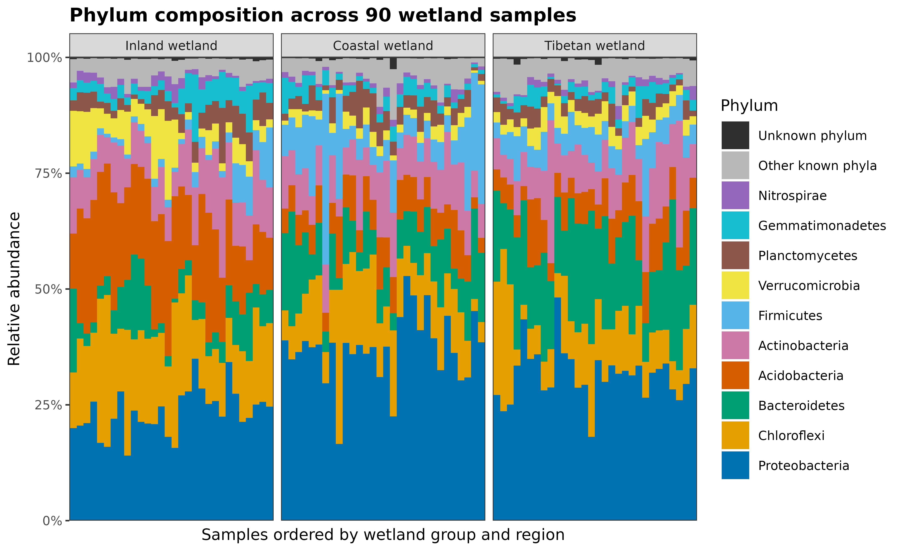
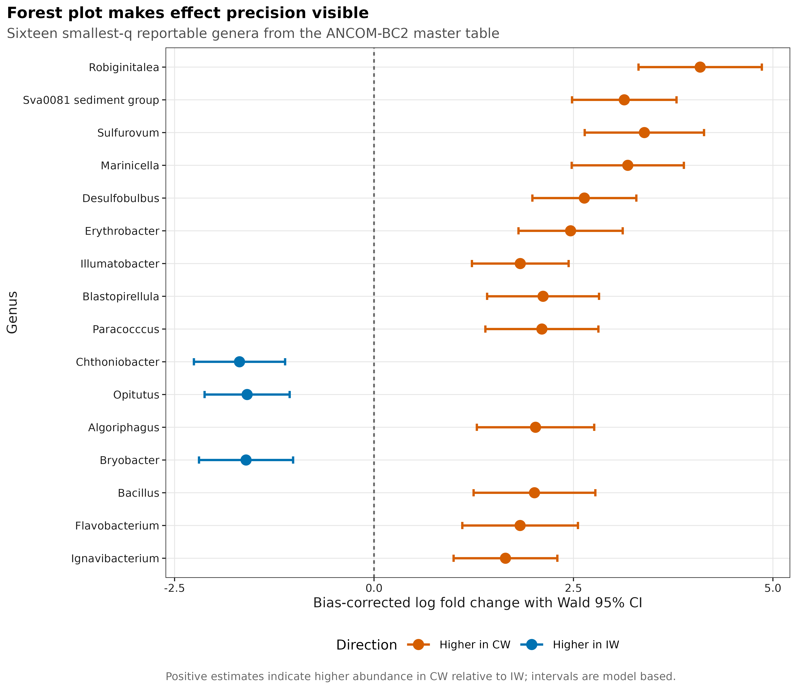
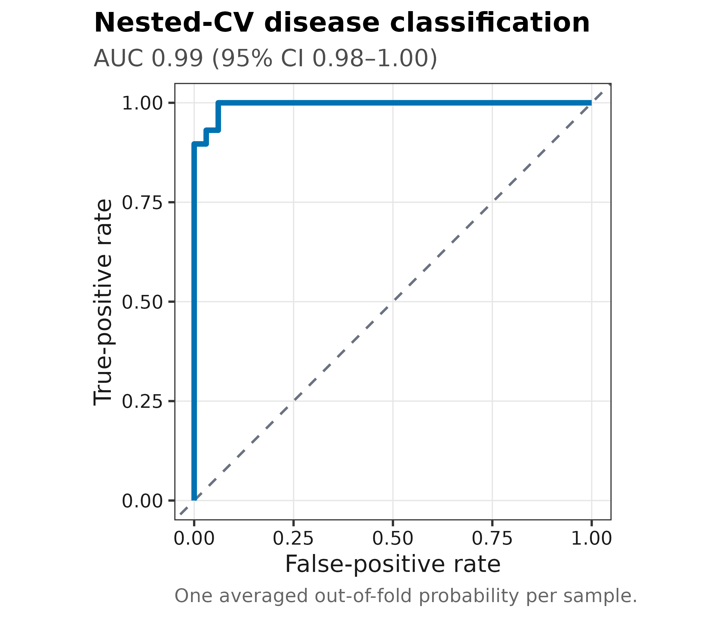
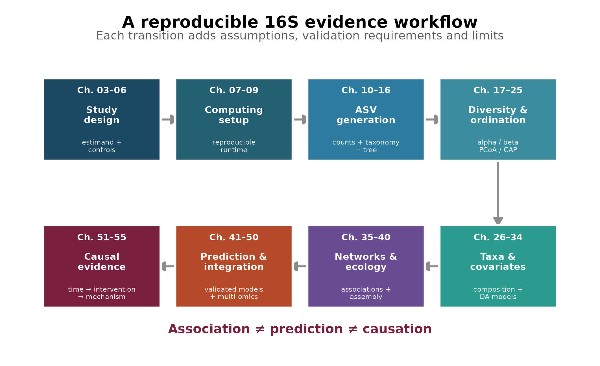

16S 研究的价值不取决于方法堆得多不多，而取决于每张图是否回答了明确的问题、统计检验是否匹配实验设计，以及结论有没有越过证据边界。

下面先看七类常见结果。它们分别负责描述多样性、比较整体群落、定位差异类群、评估预测能力或校准因果语言；任何一张图都不能替代其他层级的证据。

## 六类结果图分别回答什么问题？

### 群落整体是否不同？

::: {layout-ncol=2}

:::

这两张图来自公开的中国湿地 16S 数据。PCoA 回答“样本间整体组成是否不同”；CAP 回答“预先指定的环境梯度与群落差异关联到什么程度”。即使置换检验显著，也不能据此断言环境因子造成了群落变化。

### 单个样本内部有多丰富、多均匀？

Alpha diversity 不是一个 Shannon 指数就能概括。(q=0) 强调稀有类群，(q=1) 平衡常见与稀有类群，(q=2) 更强调优势类群；测序深度和样本完整度必须与组间比较一起检查。

### 群落由哪些类群构成？

组成图适合展示优势类群和样本异质性，但不能凭肉眼判断“富集”。所有比例共享同一个分母；没有 spike-in、流式计数或总菌 qPCR 等外部定量时，柱子变高不能直接写成绝对数量增加。

### 哪些类群与条件相关？

火山图和 cladogram 适合导航，森林图更适合定量解读。正式结果至少要同时报告 contrast、效应量、不确定性、多重检验和协变量；不能按“显著菌最多”选择方法。

### 模型能否预测新样本？

训练集准确率不能回答泛化问题。预测章节还会检查 calibration、标签置换、特征稳定性、批次泄漏和外部队列表现；AUC 很高也不代表模型找到了疾病机制。

### 什么时候可以提高因果措辞？

相关、预测和因果是三个不同目标。纵向设计可以补时间顺序，随机干预可以减少部分混杂，培养、敲除和救援实验可以检验具体机制；没有任何单一设计能自动消除全部偏倚。

## 从研究设计到因果证据的学习地图

| 章节 | 核心问题 | 主要交付 |
|---|---|---|
| 02 | 16S 能测到什么、不能测到什么？ | 技术边界与组学选择 |
| 03–06 | 比较是否由正确的实验单位、对照和采样设计支持？ | estimand、对照、批次与数据合同 |
| 07–09 | 计算环境能否被另一台机器重建？ | 固定的软件、包和数据库版本 |
| 10–16 | FASTQ 怎样变成可信的 ASV、taxonomy 和 tree？ | 可追溯的上游结果与逐阶段损失 |
| 17–25 | 样本内部和样本之间的群落差异是什么？ | alpha/beta diversity、PCoA、PERMANOVA、CAP |
| 26–34 | 哪些类群变化，效应有多大？ | 组成图、差异模型、协变量与绝对定量边界 |
| 35–40 | 网络和群落构建结果是否稳健？ | 关联网络、组装过程、中性模型与距离衰减 |
| 41–50 | 功能、预测和多组学结果能否泛化？ | 功能推断、外部验证和跨模态一致性 |
| 51–55 | 证据允许使用多强的因果措辞？ | 时间顺序、干预、三角验证与机制边界 |

章节顺序代表证据依赖关系，不代表每项研究都必须使用全部方法。网络、机器学习、多组学或因果分析是否加入，应由科学问题、实验设计和独立样本量决定，而不是为了让图更多。

## 三条贯穿所有结果的判断边界

### 16S 测到的是标记基因片段

16S rRNA 扩增子测序适合比较细菌和古菌群落组成，但通常不能稳定解析菌株、毒力基因、耐药基因或真实代谢活性。功能预测描述的是基于参考基因组的推断，不能替代宏基因组、转录组、代谢组或培养实验。

### Reads 不是微生物绝对数量

每个样本的 reads 总数同时受取样、DNA 提取、PCR、建库和测序影响。常规 16S 表更接近组成比例；涉及绝对负荷时，需要 spike-in、流式细胞计数、总菌 qPCR/ddPCR 或其他外部定量参照。

### 分析复杂度不等于证据等级

PCoA、差异分析、网络和机器学习可以发现稳定模式，但仍可能受到实验单位、批次、药物、饮食、地理和其他混杂影响。结论强度应由研究设计和验证方式决定，而不是由图形复杂度决定。

::: {.callout-important title="读任何一张结果图时先核对四件事"}

1. 图上的点究竟代表独立受试者、动物、笼位、地块，还是技术重复？
2. 分组是否与批次、中心、时间或其他变量混杂？
3. 是否同时报告效应量、不确定性和多重检验，而不只报告 P 值？
4. 结论是在描述关联、评估预测，还是主张因果？

:::

## 参考

- Knight R, Vrbanac A, Taylor BC, et al. Best practices for analysing microbiomes. *Nature Reviews Microbiology*. 2018;16:410–422. [doi:10.1038/s41579-018-0029-9](https://doi.org/10.1038/s41579-018-0029-9)
- Bolyen E, Rideout JR, Dillon MR, et al. Reproducible, interactive, scalable and extensible microbiome data science using QIIME 2. *Nature Biotechnology*. 2019;37:852–857. [doi:10.1038/s41587-019-0209-9](https://doi.org/10.1038/s41587-019-0209-9)
- Gloor GB, Macklaim JM, Pawlowsky-Glahn V, Egozcue JJ. Microbiome datasets are compositional: and this is not optional. *Frontiers in Microbiology*. 2017;8:2224. [doi:10.3389/fmicb.2017.02224](https://doi.org/10.3389/fmicb.2017.02224)
- Nearing JT, Douglas GM, Hayes MG, et al. Microbiome differential abundance methods produce different results across 38 datasets. *Nature Communications*. 2022;13:342. [doi:10.1038/s41467-022-28034-z](https://doi.org/10.1038/s41467-022-28034-z)
- An J, Liu C, Wang Q, et al. Soil bacterial community structure in Chinese wetlands. *Geoderma*. 2019;337:290–299. [doi:10.1016/j.geoderma.2018.09.035](https://doi.org/10.1016/j.geoderma.2018.09.035)
- Liu C, Cui Y, Li X, Yao M. microeco: an R package for data mining in microbial community ecology. *FEMS Microbiology Ecology*. 2021;97(2):fiaa255. [doi:10.1093/femsec/fiaa255](https://doi.org/10.1093/femsec/fiaa255)
